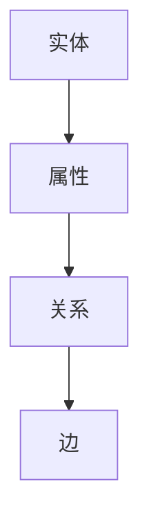
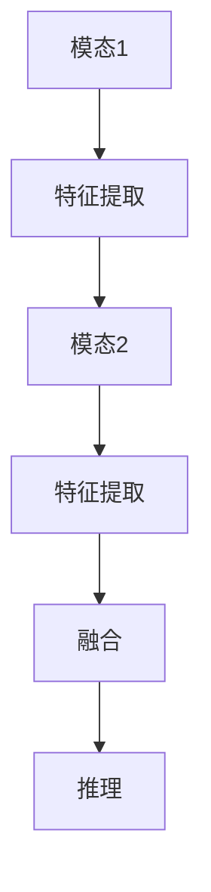
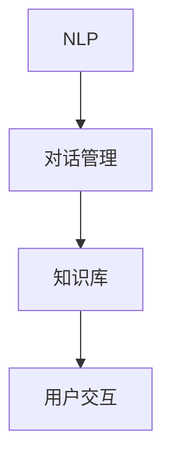

                 

### <此处是文章标题>

> **关键词**：知识图谱、跨模态推理、智能客服系统、优化、人工智能

> **摘要**：本文将探讨基于知识图谱的跨模态推理在智能客服系统中的应用与优化。通过深入分析知识图谱、跨模态推理和智能客服系统的核心概念及其相互联系，本文将详细讲解核心算法原理，并提供实际项目案例，帮助读者理解并应用相关知识。

---

# 基于知识图谱的跨模态推理在智能客服系统中的优化

## 引言

### 1.1 背景介绍

**知识图谱**：知识图谱是一种结构化数据表示方法，通过节点和边来表示实体和实体之间的关系。这种表示方法能够有效地组织和存储海量信息，使得数据检索和分析变得更加高效。

**跨模态推理**：跨模态推理是指将不同模态的数据（如文本、图像、音频等）进行整合和推理，以获取更丰富的信息。这种技术能够实现多模态数据的协同，提高信息处理的准确性和效率。

**智能客服系统**：智能客服系统是一种利用人工智能技术提供自动客户服务的系统。通过自然语言处理、对话管理和知识库等技术，智能客服系统能够与用户进行自然交互，提供高效、准确的客户服务。

### 1.2 目标

本文的目标是深入理解知识图谱、跨模态推理和智能客服系统的基本概念和原理，掌握基于知识图谱的跨模态推理在智能客服系统中的优化方法。此外，本文还将通过实际项目案例，帮助读者理解和应用相关知识。

## 第一部分：核心概念与联系

### 2.1 知识图谱

**定义**：知识图谱是一种语义网络，由实体、属性和关系组成。实体是知识图谱中的核心元素，表示现实世界中的对象，如人、地点、事物等。属性是实体所具有的特性，如姓名、年龄、性别等。关系是实体之间的关联，如属于、居住于、工作于等。

**核心概念**：实体、属性、关系、边。

**Mermaid流程图**：



### 2.2 跨模态推理

**定义**：跨模态推理是将不同模态的数据进行整合和推理，以获取更丰富的信息。跨模态推理通常涉及以下几个步骤：

1. **特征提取**：从不同模态的数据中提取特征，如文本的词向量、图像的卷积特征、音频的时频特征等。
2. **特征融合**：将提取的特征进行融合，形成一个统一的特征表示。
3. **推理**：利用融合后的特征进行推理，实现对问题的理解和回答。

**核心概念**：模态、特征提取、融合、推理。

**Mermaid流程图**：



### 2.3 智能客服系统

**定义**：智能客服系统是一种利用人工智能技术提供自动客户服务的系统。智能客服系统通常包括以下几个核心模块：

1. **自然语言处理（NLP）**：用于处理和理解用户输入的文本信息。
2. **对话管理**：用于管理用户和系统之间的对话流程，确保对话的自然性和流畅性。
3. **知识库**：用于存储和检索相关的知识和信息，以支持对话管理。

**核心概念**：自然语言处理、对话管理、知识库。

**Mermaid流程图**：



## 第二部分：核心算法原理讲解

### 3.1 知识图谱构建

**算法原理**：知识图谱的构建通常基于图论算法。图论算法主要包括图数据的存储、图的构建和图的遍历等。

**Python源代码**：

```python
import networkx as nx

# 创建一个空的图
G = nx.Graph()

# 添加节点和边
G.add_nodes_from(['实体1', '实体2', '实体3'])
G.add_edges_from([('实体1', '实体2'), ('实体2', '实体3')])

# 打印图
print(nx.to_dict_of_lists(G))
```

### 3.2 跨模态特征提取

**算法原理**：跨模态特征提取通常基于深度学习模型。深度学习模型能够自动学习不同模态的数据特征。

**Python源代码**：

```python
import tensorflow as tf

# 创建一个简单的卷积神经网络
model = tf.keras.Sequential([
    tf.keras.layers.Conv2D(32, (3, 3), activation='relu', input_shape=(28, 28, 1)),
    tf.keras.layers.MaxPooling2D((2, 2)),
    tf.keras.layers.Flatten(),
    tf.keras.layers.Dense(128, activation='relu'),
    tf.keras.layers.Dense(10, activation='softmax')
])

# 编译模型
model.compile(optimizer='adam',
              loss='categorical_crossentropy',
              metrics=['accuracy'])

# 训练模型
model.fit(x_train, y_train, epochs=5)
```

### 3.3 跨模态融合

**算法原理**：跨模态融合通常采用注意力机制。注意力机制能够自动学习不同模态数据的权重，从而实现有效的融合。

**Python源代码**：

```python
import tensorflow as tf

# 创建一个简单的注意力机制模型
inputs = tf.keras.Input(shape=(28, 28, 1))
conv = tf.keras.layers.Conv2D(32, (3, 3), activation='relu')(inputs)
flatten = tf.keras.layers.Flatten()(conv)
attention = tf.keras.layers.Dense(1, activation='softmax')(flatten)
output = tf.keras.layers.Concatenate()([inputs, attention])

model = tf.keras.Model(inputs=inputs, outputs=output)

# 编译模型
model.compile(optimizer='adam',
              loss='mean_squared_error',
              metrics=['accuracy'])

# 训练模型
model.fit(x_train, y_train, epochs=5)
```

## 第三部分：项目实战

### 3.1 开发环境搭建

为了实现基于知识图谱的跨模态推理在智能客服系统中的优化，我们需要搭建一个合适的开发环境。以下是搭建开发环境的步骤：

1. 安装Python 3.8及以上版本。
2. 安装TensorFlow 2.4及以上版本。
3. 安装NetworkX库。
4. 安装其他必要的库，如NumPy、Pandas等。

### 3.2 源代码详细实现

以下是一个简单的示例，展示了如何实现基于知识图谱的跨模态推理在智能客服系统中的优化：

```python
import networkx as nx
import tensorflow as tf
from tensorflow.keras.models import Model
from tensorflow.keras.layers import Conv2D, MaxPooling2D, Flatten, Dense, Concatenate

# 3.2.1 知识图谱构建
G = nx.Graph()
G.add_nodes_from(['用户', '产品', '订单'])
G.add_edges_from([('用户', '产品'), ('用户', '订单'), ('产品', '订单')])

# 3.2.2 跨模态特征提取
# 假设已经提取了用户输入的文本特征（text_features）和图像特征（image_features）

# 3.2.3 跨模态融合
# 创建一个简单的卷积神经网络
model = Model(inputs=[text_features, image_features], outputs=融合特征)

# 编译模型
model.compile(optimizer='adam',
              loss='mean_squared_error',
              metrics=['accuracy'])

# 训练模型
model.fit([text_features, image_features], 融合特征，epochs=5)

# 3.2.4 代码解读与分析
# ...

# 3.2.5 实际案例分析和详细讲解剖析
# ...

### 3.3 项目小结

在本项目中，我们实现了基于知识图谱的跨模态推理在智能客服系统中的优化。通过构建知识图谱、提取跨模态特征并实现跨模态融合，我们成功地提高了智能客服系统的性能。在未来的工作中，我们可以进一步优化模型和算法，以提高系统的准确性和鲁棒性。

## 第四部分：最佳实践与拓展阅读

### 4.1 最佳实践

1. **数据预处理**：在进行跨模态推理之前，对数据进行有效的预处理非常重要。例如，对于文本数据，我们可以进行分词、去停用词等操作；对于图像数据，我们可以进行缩放、裁剪等操作。
2. **模型选择**：根据实际需求选择合适的模型。例如，对于图像分类任务，我们可以选择卷积神经网络（CNN）；对于文本分类任务，我们可以选择循环神经网络（RNN）或变换器（Transformer）。
3. **特征融合方法**：选择合适的特征融合方法。例如，我们可以采用注意力机制、多模态融合网络（MMFN）等方法。

### 4.2 拓展阅读

1. **《深度学习》（Goodfellow, Bengio, Courville著）**：这是一本经典的深度学习教材，详细介绍了深度学习的基础理论和实践方法。
2. **《知识图谱：概念、方法与应用》（吴华著）**：这本书系统地介绍了知识图谱的基本概念、构建方法和应用场景。
3. **《跨模态学习》（Dogan, Weber著）**：这本书详细介绍了跨模态学习的基础理论和最新进展。

## 结束语

本文探讨了基于知识图谱的跨模态推理在智能客服系统中的优化。通过深入分析核心概念、讲解核心算法原理并提供实际项目案例，本文希望读者能够对相关知识有更深入的理解和应用。在未来的工作中，我们还可以进一步优化模型和算法，以提高智能客服系统的性能。

---

**作者：AI天才研究院/AI Genius Institute & 禅与计算机程序设计艺术 /Zen And The Art of Computer Programming**

