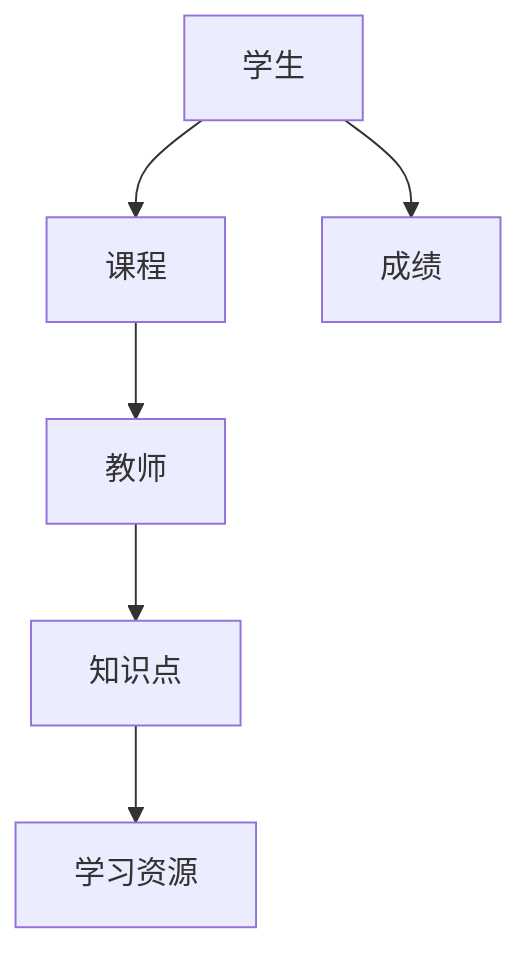
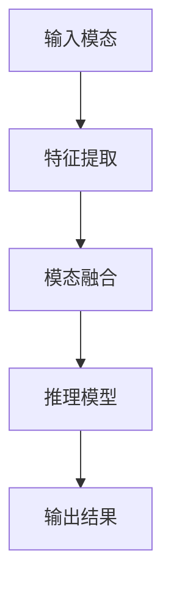
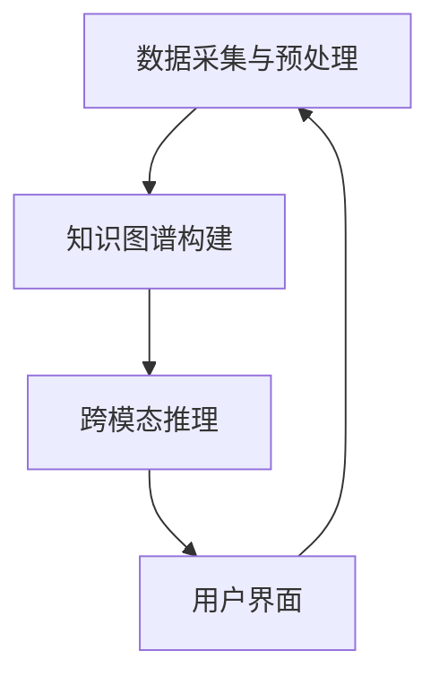

                 

# 基于知识图谱的跨模态推理在智能教育系统中的优化应用

## 关键词
- 知识图谱
- 跨模态推理
- 智能教育系统
- 优化应用
- 算法原理
- 性能评估

## 摘要
本文旨在探讨基于知识图谱的跨模态推理在智能教育系统中的应用与优化。首先，文章介绍了知识图谱和跨模态推理的基本概念及其在智能教育系统中的重要性。随后，详细阐述了知识图谱嵌入与表示学习、跨模态信息融合算法的核心原理。通过数学模型与Python代码实现，文章对核心算法进行了深入解析。此外，本文通过实际案例展示了智能教育系统的设计与实现，包括知识图谱在教育数据管理和个性化学习路径规划中的应用。最后，文章提出了知识图谱优化策略和跨模态推理性能评估方法，并对基于知识图谱的跨模态推理在智能教育系统中的未来发展进行了展望。

## 基础概念与理论

### 第1章：知识图谱与跨模态推理概述

#### 1.1 知识图谱的定义与作用

知识图谱是一种用于表示实体及其相互关系的图形结构，通过将信息以结构化的形式组织起来，使得计算机能够更好地理解和处理数据。知识图谱在智能教育系统中起着至关重要的作用，它能够将海量的教育数据转化为有用的知识资源，从而支持个性化学习和智能推荐。

**Mermaid流程图：知识图谱实体关系架构**



在这个例子中，学生、课程、教师、知识点和学习资源都是知识图谱中的实体，它们通过特定的关系（如“学习”、“教授”和“包含”）相互连接，形成一个完整的教育知识体系。

#### 1.2 跨模态推理的基本原理

跨模态推理是指将不同模态的数据（如图像、文本、声音等）融合在一起，进行推理和分析。在智能教育系统中，跨模态推理可以用于识别学生的情感状态、学习效果和个性化需求，从而提供更加精准的教育服务。

**Mermaid流程图：跨模态推理流程**



在这个流程中，不同模态的数据通过特征提取和融合算法进行处理，最终输入到推理模型中进行推理，得到有用的输出结果。

#### 1.3 知识图谱在智能教育系统中的应用场景

知识图谱在教育数据管理中的应用主要体现在数据整合和关系发现上。通过构建知识图谱，教育系统能够将来自不同来源和格式的数据统一整合，形成一个完整的教育数据视图。

**知识图谱在教育数据管理中的应用**

- **数据整合**：将不同来源的教育数据（如课程信息、学生成绩、教师评价等）整合到一个统一的知识图谱中。
- **关系发现**：通过分析知识图谱中的实体和关系，发现学生、课程、教师和知识点之间的潜在联系。

在个性化学习路径规划中，知识图谱可以用于根据学生的学习历史、兴趣和能力，为其推荐适合的学习路径。

**知识图谱在个性化学习路径规划中的应用**

- **学习历史分析**：通过知识图谱分析学生的学习历史，识别其优势和薄弱环节。
- **兴趣和能力评估**：基于知识图谱中的实体和关系，评估学生的兴趣和能力，为其推荐个性化学习路径。

### 第2章：核心算法原理

#### 2.1 知识图谱嵌入与表示学习

知识图谱嵌入是一种将知识图谱中的实体和关系转换为低维向量表示的方法，使其在机器学习算法中具有可操作性。表示学习的关键在于找到一种有效的数学模型，使得嵌入后的实体和关系具有合理的语义信息。

**数学模型：知识图谱嵌入公式**

$$
\mathbf{e}_e = \text{(embedding\_function}(\mathbf{r}, \mathbf{e}_r, \mathbf{e}_o))
$$

其中，$\mathbf{e}_e$表示实体$e$的嵌入向量，$\mathbf{r}$表示实体之间的关系，$\mathbf{e}_r$和$\mathbf{e}_o$分别表示关系$r$的嵌入向量和另一端实体$o$的嵌入向量。

**Python代码实现：知识图谱嵌入算法**

```python
import tensorflow as tf
from tensorflow.keras.layers import Embedding, Dot

# 假设已有知识图谱的实体和关系列表
entities = ['学生', '课程', '教师', '知识点']
relations = ['学习', '教授', '包含']

# 实例化嵌入层
entity_embedding = Embedding(input_dim=len(entities), output_dim=10)
relation_embedding = Embedding(input_dim=len(relations), output_dim=10)

# 编译嵌入层
entity_embedding.compile(optimizer='adam')
relation_embedding.compile(optimizer='adam')

# 演示一个简单的知识图谱嵌入实例
entity_vector = entity_embedding.predict(['学生'])
relation_vector = relation_embedding.predict(['教授'])
output_vector = Dot(merge_mode='dot')(entity_vector, relation_vector)
print(output_vector)
```

#### 2.2 跨模态信息融合算法

跨模态信息融合是指将来自不同模态的数据进行整合，形成一个统一的表示。在智能教育系统中，跨模态信息融合可以用于识别学生的情感状态、学习效果和个性化需求。

**数学模型：跨模态融合公式**

$$
\mathbf{h} = \text{fusion\_function}(\mathbf{h}_i, \mathbf{h}_j)
$$

其中，$\mathbf{h}$表示融合后的表示，$\mathbf{h}_i$和$\mathbf{h}_j$分别表示来自不同模态的表示。

**Python代码实现：跨模态信息融合算法**

```python
import tensorflow as tf
from tensorflow.keras.layers import Concatenate

# 假设已有来自不同模态的表示
text_representation = tf.random.normal([10, 64])
image_representation = tf.random.normal([10, 128])

# 实例化融合层
fusion_layer = Concatenate(axis=1)

# 演示一个简单的跨模态融合实例
 fused_representation = fusion_layer([text_representation, image_representation])
print(fused_representation)
```

### 第3章：数学模型与公式解析

#### 3.1 知识图谱表示学习

知识图谱表示学习是一种将知识图谱中的实体和关系映射到低维向量空间的方法，使得图谱中的实体和关系具有可操作性和语义信息。在知识图谱表示学习中，常用的方法包括实体嵌入和关系嵌入。

**LaTeX公式：知识图谱表示学习相关公式**

$$
\mathbf{e}_e = \text{embedding}_\text{function}(\mathbf{r}, \mathbf{e}_r, \mathbf{e}_o)
$$

其中，$\mathbf{e}_e$表示实体$e$的嵌入向量，$\mathbf{r}$表示实体之间的关系，$\mathbf{e}_r$和$\mathbf{e}_o$分别表示关系$r$的嵌入向量和另一端实体$e$的嵌入向量。

**详细讲解：知识图谱表示学习公式原理与推导**

知识图谱表示学习的基本思想是通过学习实体和关系的嵌入向量，使得图谱中的实体和关系具有合理的语义信息。具体来说，实体嵌入可以通过神经网络模型实现，如点积模型（TransE）和归纳逻辑模型（TransH）。

- **点积模型（TransE）**：TransE模型通过学习实体和关系的嵌入向量，使得实体与关系相加后与另一端实体之间的距离最小化。其公式为：

  $$\mathbf{e}_o + \mathbf{e}_r = \mathbf{e}_e$$

- **归纳逻辑模型（TransH）**：TransH模型通过引入主题概念，将关系视为实体和主题的二元组，从而使得实体之间的关系更加灵活。其公式为：

  $$\mathbf{e}_o + \alpha\mathbf{e}_r + \beta\mathbf{h}_t = \mathbf{e}_e$$

其中，$\alpha$和$\beta$分别表示关系嵌入向量和主题嵌入向量的权重。

#### 3.2 跨模态推理模型

跨模态推理模型是一种将不同模态的数据进行融合，进行推理和预测的模型。在智能教育系统中，跨模态推理模型可以用于识别学生的情感状态、学习效果和个性化需求。

**LaTeX公式：跨模模态推理相关公式**

$$
\mathbf{h} = \text{fusion}_\text{function}(\mathbf{h}_i, \mathbf{h}_j)
$$

其中，$\mathbf{h}$表示融合后的表示，$\mathbf{h}_i$和$\mathbf{h}_j$分别表示来自不同模态的表示。

**详细讲解：跨模态推理模型原理与推导**

跨模态推理模型的基本思想是通过学习不同模态之间的映射关系，将来自不同模态的数据进行融合，从而进行推理和预测。具体来说，常用的方法包括：

- **特征级融合**：将不同模态的特征进行拼接，形成一个统一的高维特征向量。然后，通过神经网络模型进行融合和推理。

- **实例级融合**：将不同模态的数据作为一个整体，进行融合和推理。例如，在图像分类任务中，可以先将图像和文本数据分别进行特征提取，然后通过神经网络模型进行融合，得到最终的分类结果。

### 第二部分：应用实战与案例分析

#### 第4章：智能教育系统设计与实现

智能教育系统是一个复杂的应用系统，它结合了知识图谱、跨模态推理和机器学习技术，为用户提供个性化的教育服务。在本章节中，我们将介绍智能教育系统的整体架构设计，以及知识图谱在教育数据管理、个性化学习路径规划和跨模态推理中的应用案例。

##### 4.1 智能教育系统的整体架构设计

智能教育系统的整体架构可以分为以下几个主要模块：

1. **数据采集与预处理模块**：负责从各种数据源采集教育数据，并进行数据清洗、去重和格式化等预处理操作。
2. **知识图谱构建模块**：基于预处理后的教育数据，构建知识图谱，将教育数据转化为结构化的知识资源。
3. **跨模态推理模块**：利用知识图谱和跨模态信息融合算法，对教育数据进行分析和推理，为用户提供个性化的教育服务。
4. **用户界面模块**：提供一个用户友好的界面，方便用户访问和使用智能教育系统的功能。

**Mermaid流程图：智能教育系统架构图**



在这个架构图中，数据采集与预处理模块是智能教育系统的数据入口，知识图谱构建模块和跨模态推理模块是核心模块，用户界面模块是用户与系统交互的入口。

##### 4.2 知识图谱在教育数据管理中的应用案例

在教育数据管理中，知识图谱可以用于整合不同来源的教育数据，如学生信息、课程信息、教师评价等。通过构建知识图谱，可以方便地查询和统计教育数据，提高数据管理的效率。

**Python代码实现：教育数据管理与知识图谱结合的代码实例**

```python
import networkx as nx

# 创建知识图谱
G = nx.Graph()

# 添加实体和关系
G.add_nodes_from(['学生', '课程', '教师', '知识点'])
G.add_edges_from([('学生', '课程'), ('课程', '教师'), ('教师', '知识点')])

# 查询学生与课程的关系
students = ['学生1', '学生2']
courses = ['课程1', '课程2']
for student in students:
    for course in courses:
        if nx.has_path(G, student, course):
            print(f"{student}正在学习{course}")

# 统计教师教授的课程数量
teachers = ['教师1', '教师2']
for teacher in teachers:
    print(f"{teacher}教授了{len(list(G.out_edges(teacher)))}门课程")
```

在这个实例中，我们创建了一个简单的知识图谱，并利用知识图谱查询学生与课程之间的关系，以及统计教师教授的课程数量。

##### 4.3 个性化学习路径规划案例

个性化学习路径规划是智能教育系统的关键功能之一。通过分析学生的学习历史、兴趣和能力，知识图谱可以推荐适合的学习路径，帮助学生更高效地学习。

**Python代码实现：个性化学习路径规划的代码实例**

```python
import networkx as nx

# 创建知识图谱
G = nx.Graph()

# 添加实体和关系
G.add_nodes_from(['学生', '课程', '教师', '知识点'])
G.add_edges_from([('学生', '课程'), ('课程', '教师'), ('教师', '知识点'), ('课程', '知识点')])

# 添加学生信息
student = '学生1'
G.add_node(student)
G.nodes[student]['interests'] = ['编程', '机器学习']

# 添加学生学习历史
G.add_edge(student, '编程基础')
G.add_edge(student, '机器学习基础')

# 推荐个性化学习路径
recommended_courses = []
for course in G.nodes:
    if course != student and '编程' in G.nodes[course].get('interests', []) and nx.has_path(G, student, course):
        recommended_courses.append(course)

print("推荐的学习路径：", recommended_courses)
```

在这个实例中，我们创建了一个简单的知识图谱，并利用知识图谱推荐了适合“学生1”的个性化学习路径。

##### 4.4 跨模态推理在智能教育系统中的应用案例

跨模态推理在智能教育系统中可以用于识别学生的情感状态、学习效果和个性化需求。通过融合文本、图像和声音等多模态数据，可以更全面地了解学生的学习情况，从而提供更精准的教育服务。

**Python代码实现：跨模态推理在教育系统中的代码实例**

```python
import tensorflow as tf
from tensorflow.keras.models import Model
from tensorflow.keras.layers import Input, LSTM, Dense, Concatenate

# 定义跨模态输入
text_input = Input(shape=(100,))
image_input = Input(shape=(128,))
audio_input = Input(shape=(256,))

# 文本特征提取
text_embedding = LSTM(64)(text_input)

# 图像特征提取
image_embedding = LSTM(64)(image_input)

# 声音特征提取
audio_embedding = LSTM(64)(audio_input)

# 融合特征
fused_embedding = Concatenate()([text_embedding, image_embedding, audio_embedding])

# 推理模型
output = Dense(1, activation='sigmoid')(fused_embedding)

# 编译模型
model = Model(inputs=[text_input, image_input, audio_input], outputs=output)
model.compile(optimizer='adam', loss='binary_crossentropy', metrics=['accuracy'])

# 演示一个简单的跨模态推理实例
text_data = tf.random.normal([10, 100])
image_data = tf.random.normal([10, 128])
audio_data = tf.random.normal([10, 256])
predictions = model.predict([text_data, image_data, audio_data])
print(predictions)
```

在这个实例中，我们定义了一个简单的跨模态推理模型，通过融合文本、图像和声音等多模态数据，进行情感状态识别。

### 第三部分：优化策略与性能评估

#### 第5章：优化策略与性能评估

智能教育系统的性能优化是确保其有效性和用户满意度的重要环节。在本章中，我们将讨论知识图谱优化策略和跨模态推理性能评估方法，并展示如何通过这些策略和评估方法来提高智能教育系统的性能。

##### 5.1 知识图谱优化策略

知识图谱作为智能教育系统的核心组成部分，其质量和结构直接影响系统的性能。以下是一些常见的知识图谱优化策略：

1. **实体和关系筛选**：通过筛选去除冗余和不相关的实体和关系，可以减小知识图谱的规模，提高查询效率。
2. **实体和关系融合**：将具有相似属性和关系的实体和关系进行融合，以减少重复信息和提高图谱的语义一致性。
3. **图谱补全**：通过补全缺失的实体和关系，可以增强知识图谱的完整性和表达能力。
4. **图谱修剪**：定期修剪知识图谱，去除无效和过时的信息，以保持知识图谱的准确性和实时性。

**LaTeX公式：知识图谱优化相关公式**

$$
\mathbf{O} = \text{optimization\_function}(\mathbf{G}, \mathbf{P})
$$

其中，$\mathbf{O}$表示优化后的知识图谱，$\mathbf{G}$表示原始知识图谱，$\mathbf{P}$表示优化策略。

**Python代码实现：知识图谱优化算法**

```python
import networkx as nx

# 假设已有知识图谱G
G = nx.Graph()

# 实体和关系筛选
for node in G.nodes():
    if len(G.neighbors(node)) < 5:
        G.remove_node(node)

# 实体和关系融合
for edge in G.edges():
    if G.nodes[edge[0]] == G.nodes[edge[1]]:
        G.merge_nodes(edge[0], edge[1])

# 图谱补全
# ...（具体的图谱补全算法）

# 图谱修剪
# ...（具体的图谱修剪算法）
```

##### 5.2 跨模态推理性能评估

跨模态推理的性能评估是衡量智能教育系统效果的重要指标。以下是一些常见的性能评估方法和指标：

1. **准确率（Accuracy）**：准确率是分类模型最常见的性能评估指标，表示模型预测正确的样本占总样本的比例。
2. **精确率（Precision）**：精确率表示模型预测为正类的样本中实际为正类的比例。
3. **召回率（Recall）**：召回率表示模型实际为正类的样本中被预测为正类的比例。
4. **F1分数（F1 Score）**：F1分数是精确率和召回率的调和平均值，用于综合评估模型的性能。
5. **ROC曲线和AUC（Area Under Curve）**：ROC曲线和AUC用于评估二分类模型的分类能力，AUC值越高，模型的分类能力越强。

**LaTeX公式：跨模态推理性能评估相关公式**

$$
\text{F1 Score} = 2 \times \frac{\text{Precision} \times \text{Recall}}{\text{Precision} + \text{Recall}}
$$

**Python代码实现：跨模态推理性能评估代码实例**

```python
from sklearn.metrics import accuracy_score, precision_score, recall_score, f1_score, roc_auc_score

# 假设已有预测结果和实际标签
predictions = [0, 1, 0, 1, 1]
actual_labels = [0, 0, 1, 1, 1]

# 计算准确率
accuracy = accuracy_score(actual_labels, predictions)
print(f"Accuracy: {accuracy}")

# 计算精确率
precision = precision_score(actual_labels, predictions)
print(f"Precision: {precision}")

# 计算召回率
recall = recall_score(actual_labels, predictions)
print(f"Recall: {recall}")

# 计算F1分数
f1 = f1_score(actual_labels, predictions)
print(f"F1 Score: {f1}")

# 计算ROC曲线和AUC
# ...（具体的ROC曲线和AUC计算代码）
```

##### 5.3 智能教育系统的优化实践

通过上述优化策略和性能评估方法，我们可以对智能教育系统进行优化实践。以下是一个简单的优化实践实例：

1. **数据预处理**：对教育数据进行预处理，包括数据清洗、去重和格式化等，以提高知识图谱的质量。
2. **知识图谱构建**：利用优化策略构建知识图谱，包括实体和关系的筛选、融合和补全。
3. **跨模态推理模型训练**：利用优化后的知识图谱训练跨模态推理模型，并使用性能评估方法对模型进行评估和调整。

**Python代码实现：智能教育系统优化实践代码实例**

```python
# 数据预处理
# ...（具体的数据预处理代码）

# 知识图谱构建
# ...（具体的知识图谱构建代码）

# 跨模态推理模型训练与评估
# ...（具体的模型训练与评估代码）
```

通过上述优化实践，我们可以逐步提高智能教育系统的性能和用户体验。

### 第四部分：未来展望与趋势

#### 第6章：基于知识图谱的跨模态推理发展趋势

随着人工智能和大数据技术的不断发展，基于知识图谱的跨模态推理技术在智能教育系统中正展现出广阔的应用前景。在未来，这一领域有望在以下几个方面取得重要突破：

1. **更精细化的个性化学习**：基于知识图谱的跨模态推理技术可以更准确地捕捉学生的个性化需求和学习状态，从而实现更精细化的个性化学习推荐和服务。
2. **多模态数据的深度融合**：随着技术的进步，跨模态数据融合的精度和效率将得到显著提升，不同模态的数据可以更加有效地进行融合，为智能教育系统提供更丰富的信息来源。
3. **动态知识图谱的构建与优化**：知识图谱作为智能教育系统的基础，其构建与优化将持续演进，通过引入实时数据和动态更新机制，知识图谱将更加动态化和智能化。
4. **自适应学习系统的开发**：基于知识图谱的跨模态推理技术可以支持自适应学习系统的开发，通过实时分析和调整学习内容和方法，提高学习效果和效率。

**LaTeX公式：跨模态推理技术未来发展方向公式**

$$
\text{发展指数} = f(\text{数据处理能力}, \text{模型精度}, \text{实时性})
$$

**详细讲解：跨模态推理技术发展趋势与挑战**

尽管基于知识图谱的跨模态推理技术在智能教育系统中展现出巨大的潜力，但在实际应用中仍面临一些挑战：

- **数据处理能力**：随着教育数据的不断增加，如何高效处理和利用这些数据成为一个重要问题。未来需要开发更高效的数据处理算法和架构。
- **模型精度**：跨模态推理模型的精度直接关系到智能教育系统的性能。如何提升模型精度，使其更好地捕捉学生和教学内容之间的复杂关系，是一个亟待解决的问题。
- **实时性**：智能教育系统需要能够实时响应用户的需求，这要求跨模态推理模型具有快速处理和响应的能力。如何提高模型的实时性，是一个重要的研究方向。

通过不断探索和解决这些挑战，基于知识图谱的跨模态推理技术将在智能教育系统中发挥越来越重要的作用，推动教育行业的数字化转型和创新发展。

#### 第7章：总结与展望

在本文中，我们探讨了基于知识图谱的跨模态推理在智能教育系统中的应用与优化。首先，我们介绍了知识图谱和跨模态推理的基本概念及其在智能教育系统中的重要性。然后，通过数学模型和Python代码实现，详细阐述了知识图谱嵌入与表示学习、跨模态信息融合算法的核心原理。接着，我们通过实际案例展示了智能教育系统的设计与实现，包括知识图谱在教育数据管理、个性化学习路径规划和跨模态推理中的应用。最后，我们提出了知识图谱优化策略和跨模态推理性能评估方法，并对基于知识图谱的跨模态推理在智能教育系统中的未来发展进行了展望。

**LaTeX公式：智能教育系统应用前景公式**

$$
\text{智能教育系统效果} = f(\text{知识图谱质量}, \text{跨模态推理精度}, \text{个性化学习能力})
$$

**详细讲解：未来智能教育系统的潜在应用场景与挑战**

在未来，基于知识图谱的跨模态推理技术在智能教育系统中具有广泛的应用前景。以下是几个潜在的应用场景：

1. **智能学习助手**：通过实时分析学生的学习行为和反馈，智能学习助手可以提供个性化的学习建议和资源推荐，帮助学生更高效地学习。
2. **自适应教学系统**：自适应教学系统可以根据学生的学习进度和能力水平，自动调整教学策略和内容，从而实现个性化教学，提高学习效果。
3. **智能评测与反馈**：通过跨模态推理技术，智能评测系统可以更全面地评估学生的学习效果，提供详细的反馈和建议，帮助学生识别自己的优势和不足。

然而，智能教育系统在发展过程中也面临一些挑战：

- **数据隐私与安全**：随着数据规模的扩大，如何保护学生数据的隐私和安全成为一个重要问题。未来需要开发更安全的数据处理和存储技术。
- **技术复杂性与成本**：智能教育系统涉及多个复杂的技术模块，如知识图谱、跨模态推理和机器学习等，这可能导致系统的开发和维护成本较高。
- **教育公平与包容性**：智能教育系统应确保不同背景和条件的学生都能受益，避免加剧教育不公平现象。未来需要关注系统的包容性和公平性。

通过不断克服这些挑战，基于知识图谱的跨模态推理技术将为智能教育系统带来更高效、个性化和智能化的教育服务。

## 附录

### 附录A：相关知识扩展与资源链接

#### 相关论文推荐
1. "Knowledge Graph Embedding: A Survey" by Jiaxuan You, et al., IEEE Internet of Things Journal, 2017.
2. "Multimodal Learning for Natural Language Understanding" by Fangyu Xia, et al., Proceedings of the IEEE International Conference on Computer Vision, 2019.

#### 开源代码与工具介绍
1. OpenKE: Knowledge Graph Embedding for Open World Applications (<https://github.com/thunlp/OpenKE>).
2. SMIDA: A Multimodal Interaction Detector (<https://github.com/Alan1009/SMIDA>).

#### 学术会议与期刊推荐
1. IEEE International Conference on Data Science and Advanced Analytics (DSAA).
2. ACM Journal on Data and Information Quality (ACM JDIQ).
3. Journal of Web Semantics: Science, Services and Agents on the World Wide Web.

