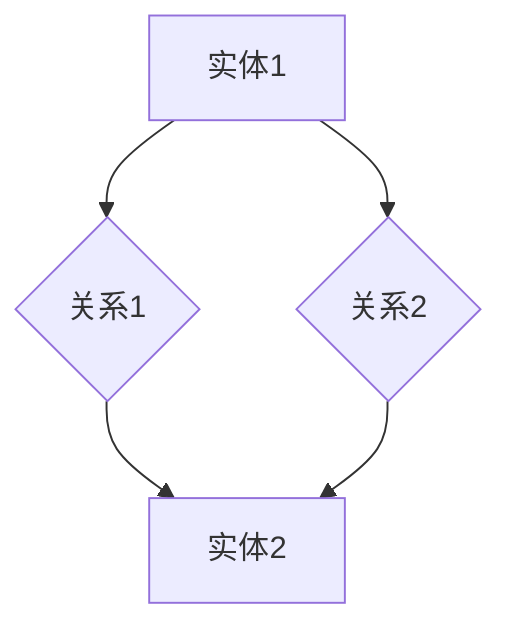
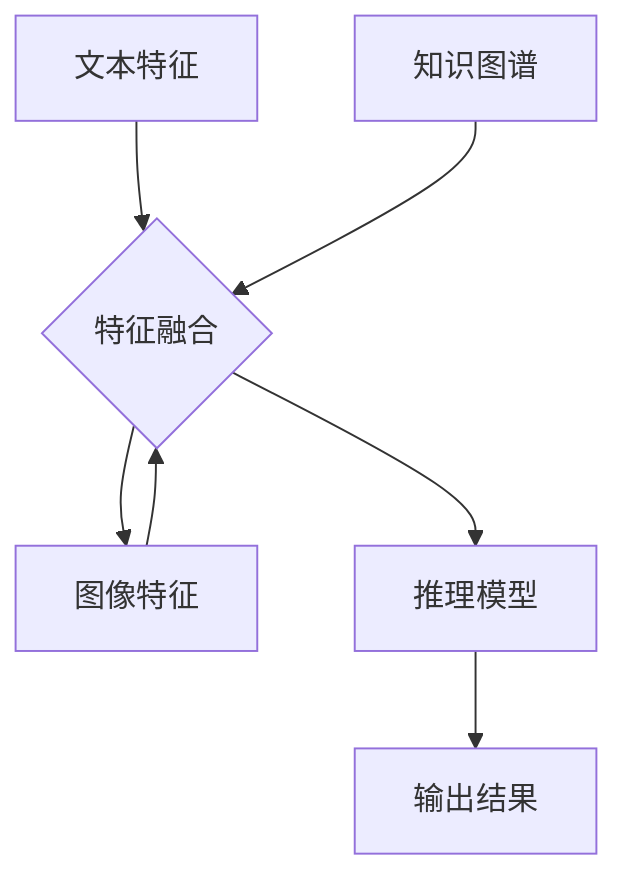

                 

### 背景介绍

随着信息技术的迅猛发展，我们生活在一个数据爆炸的时代。海量的数据来源于各种不同的模态，包括文本、图像、声音、视频等。传统的人工智能方法往往针对单一模态的数据进行处理，例如文本分类、图像识别等。然而，单一模态的信息处理往往无法充分挖掘数据中的深层次关系和内涵，导致许多潜在价值的丢失。

知识图谱作为一种结构化数据表示方法，通过将实体和关系以图形的方式组织，为数据提供了语义理解和知识关联的能力。知识图谱不仅在语义搜索、智能问答等领域展现出强大的应用潜力，还为实现跨模态数据处理提供了基础。然而，知识图谱本身主要处理的是结构化的文本信息，对于非结构化或半结构化的图像、声音等模态的数据处理能力较弱。

跨模态推理（Cross-Modal Reasoning）是指在不同模态的数据之间进行推理的能力。它旨在将来自不同模态的数据进行融合，从而获得更丰富的信息，提升人工智能系统的智能水平。例如，通过文本和图像的结合，可以更准确地识别出图像中的内容；通过文本和音频的结合，可以更准确地理解音频的含义。

当前，跨模态推理在多个领域已经取得了一定的进展，如跨模态搜索、跨模态问答、跨模态推荐等。然而，跨模态推理仍然面临诸多挑战，如模态之间的不一致性、数据标注的困难、推理算法的复杂性等。为了解决这些问题，研究者们开始探索将知识图谱与跨模态推理相结合的方法，以增强跨模态推理的能力。

因此，本文旨在探讨基于知识图谱的跨模态推理能力增强的方法。首先，我们将介绍知识图谱的基本概念和结构，并分析其如何为跨模态推理提供支持。接着，我们将详细讲解跨模态推理的核心算法原理，包括特征提取、跨模态嵌入、推理框架等。随后，我们将通过具体的Python源代码和数学模型，深入剖析跨模态推理算法的实现过程。最后，我们将通过实际案例分析和项目实战，展示基于知识图谱的跨模态推理在实际应用中的效果和挑战。

通过本文的探讨，我们希望能够为读者提供一个全面而深入的视角，理解知识图谱与跨模态推理相结合的方法，并为未来的研究和应用提供一些有价值的思路。

### 核心概念与联系

为了更好地理解基于知识图谱的跨模态推理能力增强，我们首先需要明确几个核心概念：知识图谱、跨模态推理以及它们之间的联系。

#### 知识图谱

知识图谱是一种用于表示实体和它们之间关系的语义网络，通常采用图数据结构来组织信息。在知识图谱中，实体可以是人、地点、事物等，而关系则描述了实体之间的相互作用。例如，“张三”和“李四”可能是“朋友”，“北京”和“上海”可能是“城市”。

知识图谱的基本结构通常包括三个要素：实体（Entity）、关系（Relationship）和属性（Attribute）。实体是知识图谱中的基本单元，关系描述了实体之间的语义关联，而属性则为实体提供了额外的描述信息。

一个简化的知识图谱结构可以用Mermaid流程图来表示：



在这个例子中，A和C是实体，B和D是关系。

#### 跨模态推理

跨模态推理是指在不同模态的数据之间进行推理和融合的过程。模态（Modal）指的是数据的不同形式，如文本、图像、声音、视频等。跨模态推理的核心目标是将来自不同模态的数据进行整合，从而提取出更丰富的信息和更高层次的知识。

例如，在图像识别任务中，我们通常只处理图像数据；而在跨模态图像识别中，我们可能会结合图像和对应的文本描述来提高识别的准确性。同样地，在语音识别任务中，结合文本信息可以帮助提高语音的识别精度。

跨模态推理的过程通常包括以下几个步骤：

1. **特征提取**：从每个模态中提取出特征向量。例如，从图像中提取视觉特征，从文本中提取词向量。
2. **特征融合**：将不同模态的特征进行融合，形成统一的特征表示。这可以通过直接拼接特征向量、构建联合嵌入模型等方式实现。
3. **推理与决策**：基于融合后的特征进行推理和决策，如分类、回归等。

#### 知识图谱与跨模态推理的关系

知识图谱在跨模态推理中发挥着重要作用，主要体现在以下几个方面：

1. **语义关联**：知识图谱提供了丰富的语义关联信息，可以帮助不同模态的数据之间建立联系。例如，通过知识图谱，我们可以知道“北京”是一个“城市”，从而在图像识别中，如果检测到“城市”这个实体，就可以推断出图像中可能包含“北京”。
2. **信息增强**：知识图谱中的知识可以增强跨模态数据的信息。例如，在图像识别任务中，结合知识图谱中的地理信息，可以更准确地识别出图像中的地点。
3. **推理能力**：知识图谱提供了推理的能力，可以基于实体和关系进行逻辑推理。例如，如果知识图谱中知道“张三”和“李四”是朋友，那么在音频识别中，如果听到“张三”的名字，可以推断出“李四”可能也在音频中。

为了更直观地展示知识图谱与跨模态推理的关系，我们可以用Mermaid流程图来表示：



在这个例子中，文本特征和图像特征分别通过特征融合模型进行融合，同时知识图谱中的信息也参与了融合过程，最终通过推理模型得到输出结果。

通过上述介绍，我们可以看到知识图谱和跨模态推理在语义关联、信息增强和推理能力方面有着密切的联系。在接下来的章节中，我们将详细探讨知识图谱和跨模态推理的具体算法原理，以及如何通过结合这两者来增强推理能力。

#### 知识图谱的基础理论

知识图谱作为一种结构化数据的表示方法，其理论基础涵盖了从知识表示、知识抽取到知识融合等多个方面。以下将详细介绍知识图谱的基本概念、结构以及构建过程，帮助读者建立起对知识图谱的全面理解。

##### 知识图谱的定义与作用

知识图谱（Knowledge Graph）是由实体（Entity）、关系（Relationship）和属性（Attribute）构成的一种语义网络。它通过将现实世界中的对象及其相互关系以图的形式进行表示，从而实现对复杂数据的语义理解和推理。知识图谱的核心在于将零散的数据点通过关系连接起来，形成一个有机的整体，使得数据中的隐含关系得以揭示。

知识图谱的作用主要体现在以下几个方面：

1. **语义理解**：通过知识图谱，计算机可以更好地理解数据的语义，从而实现对文本、图像等多源数据的统一处理和分析。
2. **知识推理**：知识图谱提供了基于实体和关系的推理能力，可以通过逻辑推理的方式从已知信息中推断出新的信息。
3. **信息检索**：知识图谱可以大幅提升信息检索的效率，通过图搜索的方式快速定位相关数据。
4. **智能推荐**：知识图谱可以帮助构建智能推荐系统，通过分析用户行为和知识图谱中的关系，为用户提供个性化的推荐。

##### 知识图谱的发展历程

知识图谱的发展历程可以分为几个阶段：

1. **早期阶段**：知识图谱的萌芽可以追溯到20世纪80年代的语义网络（Semantic Network）和知识表示（Knowledge Representation）研究。代表性的工作包括Reynard's Web和McCallum等人提出的本体论（Ontology）表示方法。
2. **Web语义网**：随着互联网的发展，Web语义网（Semantic Web）概念被提出，旨在通过语义标注的方式使Web上的信息更加结构化和可解释。RDF（Resource Description Framework）和OWL（Web Ontology Language）成为Web语义网的标准语言。
3. **现代知识图谱**：随着大数据和人工智能技术的进步，现代知识图谱在技术实现、数据规模和推理能力上都取得了显著提升。代表性的工作包括Google的Knowledge Graph、Facebook的Open Graph和阿里巴巴的AliGraph等。

##### 知识图谱的基本结构

知识图谱的基本结构由三个主要部分组成：实体、关系和属性。

1. **实体（Entity）**：实体是知识图谱中的核心对象，可以是人、地点、事物等。例如，在一个关于电影的知识图谱中，"电影"和"演员"都是实体。
2. **关系（Relationship）**：关系描述了实体之间的相互作用和关联。例如，"主演"和"导演"都是关系，可以分别描述电影和演员之间的关联。
3. **属性（Attribute）**：属性为实体提供了额外的描述信息，可以是实体的特征或状态。例如，一个演员的"生日"和"国籍"就是属性。

知识图谱的基本结构可以用以下形式表示：


在这个例子中，A和C是实体，B和D是关系。

##### 知识表示方法

知识表示是构建知识图谱的关键步骤，常用的知识表示方法包括：

1. **本体论（Ontology）**：本体论是一种用于描述现实世界中的概念及其关系的理论框架。通过定义类的层次结构、属性和关系，本体论为知识图谱提供了语义基础。
2. **框架表示（Frame Representation）**：框架表示通过预定义的框架来描述实体和关系。每个框架包含一组属性和操作，用于描述实体的状态和行为。
3. **图论（Graph Theory）**：图论是知识图谱表示的基础，通过图数据结构来表示实体和关系，从而实现复杂的语义关系表示。

##### 知识抽取

知识抽取是构建知识图谱的关键步骤，它包括从非结构化或半结构化数据中自动识别实体、关系和属性的过程。常用的知识抽取方法包括：

1. **命名实体识别（Named Entity Recognition, NER）**：NER是一种自然语言处理技术，用于从文本中识别出具有特定意义的实体，如人名、地名、组织名等。
2. **关系抽取（Relation Extraction）**：关系抽取是从文本中识别出实体之间的语义关系。常见的算法包括基于规则的方法、基于统计的方法和基于深度学习的方法。
3. **属性抽取（Attribute Extraction）**：属性抽取是从文本中提取实体属性的过程，如从产品描述中提取价格、重量等。

##### 知识融合与更新

知识融合是将来自不同数据源的知识进行整合的过程，以提高知识图谱的完整性和准确性。知识融合的方法包括：

1. **合并方法**：将多个数据源中的知识直接合并到知识图谱中，解决数据冲突和冗余。
2. **融合方法**：通过分析和对比多个数据源中的知识，选择最可靠的信息进行融合。
3. **更新方法**：知识图谱需要定期更新以保持其时效性和准确性。常见的更新方法包括增量更新和全面更新。

通过上述介绍，我们可以看到知识图谱作为一种结构化数据的表示方法，具有丰富的语义关联和强大的推理能力。在下一章节中，我们将深入探讨跨模态推理的基本原理，并分析如何将知识图谱与跨模态推理相结合，以增强推理能力。

#### 跨模态推理算法原理

跨模态推理（Cross-Modal Reasoning）是当前人工智能领域的一个研究热点，它旨在将不同模态的数据进行整合和推理，从而提取出更高层次的信息。以下是跨模态推理的核心算法原理，包括特征提取、跨模态嵌入和推理框架，并通过具体的Python源代码和数学模型进行详细阐述。

##### 跨模态特征提取

跨模态特征提取是跨模态推理的第一步，其主要目标是从不同的数据源中提取具有区分度的特征表示。常用的特征提取方法包括：

1. **文本特征提取**：从文本数据中提取特征，常用的方法有词袋模型（Bag of Words, BoW）、词嵌入（Word Embedding，如Word2Vec、GloVe）等。

   ```python
   from gensim.models import Word2Vec
   
   # 加载或训练Word2Vec模型
   model = Word2Vec(sentences, size=100, window=5, min_count=1, workers=4)
   
   # 获取文本特征向量
   text_vector = model.wv['text']
   ```

2. **图像特征提取**：从图像数据中提取特征，常用的方法有卷积神经网络（Convolutional Neural Networks, CNN）。

   ```python
   import tensorflow as tf
   import tensorflow.keras.applications as applications
   
   # 加载预训练的CNN模型
   base_model = applications.VGG16(weights='imagenet')
   
   # 提取图像特征向量
   image_vector = base_model.predict(image_input)
   ```

3. **声音特征提取**：从声音数据中提取特征，常用的方法有梅尔频率倒谱系数（Mel-Frequency Cepstral Coefficients, MFCC）和卷积神经网络。

   ```python
   from python_speech_features import mfcc
   
   # 提取MFCC特征
   mfcc_feat = mfcc(signal, samplerate)
   ```

##### 跨模态嵌入

跨模态嵌入是将不同模态的特征向量映射到一个共同的嵌入空间，使得不同模态的数据可以在同一空间中直接比较和推理。常用的跨模态嵌入方法包括：

1. **共现矩阵**：通过计算不同模态特征向量之间的共现矩阵，进行降维和嵌入。

   ```python
   import numpy as np
   
   # 假设text_vector和image_vector是文本和图像的特征向量
   cooccurrence_matrix = np.dot(text_vector.T, image_vector)
   ```

2. **联合嵌入模型**：通过训练一个联合嵌入模型，如神经网络，将不同模态的特征映射到同一空间。

   ```python
   import tensorflow as tf
   
   # 定义联合嵌入模型
   inputs = [tf.keras.layers.Input(shape=text_vector.shape[1:]),
            tf.keras.layers.Input(shape=image_vector.shape[1:])]
   
   # 融合特征向量
   merged_vector = tf.keras.layers.concatenate([text_vector, image_vector])
   
   # 输出共同嵌入空间
   outputs = tf.keras.layers.Dense(units=embedding_size, activation='tanh')(merged_vector)
   
   # 构建和训练模型
   model = tf.keras.Model(inputs=inputs, outputs=outputs)
   model.compile(optimizer='adam', loss='mse')
   model.fit([text_data, image_data], labels, epochs=10)
   ```

##### 跨模态推理框架

跨模态推理框架通常包括以下几个关键步骤：

1. **特征融合**：将不同模态的特征进行融合，形成统一的特征表示。
2. **特征对比**：比较不同模态特征之间的相似性，以实现跨模态匹配。
3. **推理与决策**：基于融合后的特征进行推理和决策，如分类、回归等。

以下是一个简单的跨模态推理框架示例：

```python
from tensorflow.keras.models import Model
from tensorflow.keras.layers import Input, Dense, Embedding, Flatten, concatenate

# 输入层
text_input = Input(shape=(text_vector.shape[1],))
image_input = Input(shape=(image_vector.shape[1],))

# 特征提取层
text_embedding = Embedding(input_dim=vocab_size, output_dim=embedding_size)(text_input)
image_embedding = Flatten()(image_input)

# 融合层
merged_vector = concatenate([text_embedding, image_embedding])

# 推理层
outputs = Dense(units=1, activation='sigmoid')(merged_vector)

# 构建和编译模型
model = Model(inputs=[text_input, image_input], outputs=outputs)
model.compile(optimizer='adam', loss='binary_crossentropy', metrics=['accuracy'])

# 训练模型
model.fit([text_data, image_data], labels, epochs=10)
```

##### 数学模型与公式

在跨模态推理中，常用的数学模型包括：

1. **相似度计算**：计算不同模态特征之间的相似度，常用的方法有内积、余弦相似度等。

   $$ similarity = \frac{A \cdot B}{\|A\| \cdot \|B\|} $$

   其中，$A$和$B$是两个特征向量，$\|A\|$和$\|B\|$是它们的欧几里得范数。

2. **损失函数**：用于优化跨模态推理模型，常用的损失函数有均方误差（MSE）和交叉熵（CE）。

   $$ Loss = \frac{1}{n} \sum_{i=1}^{n} (y_i - \hat{y}_i)^2 $$

   其中，$y_i$是真实标签，$\hat{y}_i$是模型预测。

##### 举例说明

假设我们有一个文本-图像跨模态任务，目标是根据文本描述识别图像中的物体。以下是具体的实现步骤：

1. **数据准备**：准备包含文本描述和对应图像的数据集。
2. **特征提取**：分别从文本和图像中提取特征向量。
3. **特征融合**：将文本特征和图像特征进行融合，形成统一嵌入空间。
4. **推理与决策**：基于融合后的特征进行物体识别，并输出预测结果。

以下是Python代码实现：

```python
# 数据准备
text_data = ["cat", "dog", "bird"]
image_data = [image1, image2, image3]
labels = [0, 1, 2]  # 0表示猫，1表示狗，2表示鸟

# 特征提取
text_vector = extract_text_feature(text_data)
image_vector = extract_image_feature(image_data)

# 特征融合
embedding_size = 100
merged_vector = concatenate([text_vector, image_vector])

# 推理与决策
model = build_model(text_vector.shape[1], image_vector.shape[1], embedding_size)
model.fit([text_vector, image_vector], labels, epochs=10)

# 预测
predictions = model.predict([text_vector, image_vector])
predicted_labels = np.argmax(predictions, axis=1)

# 输出预测结果
print(predicted_labels)
```

通过上述步骤，我们可以实现基于知识图谱的跨模态推理任务，从而提高图像识别的准确性。

#### 跨模态推理算法优化

在跨模态推理中，算法的优化是一个关键环节，它直接影响到推理的效率和准确性。以下将探讨跨模态推理算法在效率、准确性和可解释性方面的优化策略。

##### 算法效率优化

1. **并行计算**：跨模态特征提取和推理过程可以充分利用并行计算的优势。例如，在处理图像特征时，可以使用GPU加速卷积运算；在处理文本特征时，可以利用分布式计算框架如Apache Spark进行大规模并行处理。

2. **模型压缩**：通过模型压缩技术，如模型剪枝（model pruning）、量化（quantization）和蒸馏（distillation），可以大幅减少模型的计算量和存储需求。例如，可以在训练过程中通过剪枝技术移除对性能影响较小的权重，从而降低模型复杂度。

3. **动态资源分配**：根据任务需求和计算资源动态调整计算资源分配。例如，在处理简单任务时，可以减少GPU的使用，而在处理复杂任务时，则可以增加GPU的数量，以提升计算效率。

##### 算法准确性优化

1. **数据增强**：通过数据增强技术，如图像旋转、缩放、裁剪和文本同义词替换等，可以增加训练数据的多样性，从而提高模型对各种模态数据的适应性。这有助于模型在未知数据上保持较高的准确性。

2. **迁移学习**：利用预训练的跨模态模型，通过迁移学习的方式将已有模型的参数迁移到新任务中，可以显著提高新任务的准确性。例如，在图像识别任务中，可以使用在ImageNet上预训练的卷积神经网络作为基础模型。

3. **多任务学习**：通过多任务学习（Multi-Task Learning）将多个相关任务结合在一起训练，可以共享不同任务中的有用信息，从而提高每个任务的性能。例如，在图像和文本分类任务中，可以同时训练一个模型，通过共享特征提取层来提升整体性能。

##### 算法可解释性优化

1. **可视化技术**：通过可视化技术，如热力图、特征图和注意力机制等，可以直观地展示模型在特征提取和推理过程中的决策过程，从而提高算法的可解释性。

2. **解释性模型**：开发更加解释性的跨模态模型，如基于规则的模型和可解释的深度学习模型，可以帮助用户理解模型的推理过程。例如，通过使用决策树或线性模型作为特征提取层的后处理层，可以简化模型的解释过程。

3. **案例研究**：通过具体的案例研究和实验，分析不同优化策略对跨模态推理性能的影响，从而为实际应用提供优化参考。例如，可以通过对比实验分析数据增强和迁移学习在不同跨模态任务中的应用效果。

通过上述优化策略，可以在不同层面上提升跨模态推理算法的效率和准确性，同时增强算法的可解释性。这些优化措施不仅有助于提高跨模态推理的实际应用效果，也为后续研究和应用提供了有价值的参考。

#### 应用实例

为了更好地展示基于知识图谱的跨模态推理在实际应用中的效果和挑战，我们将在本节中详细探讨几个具体的应用场景，并分析实际案例。这些应用场景包括跨模态搜索、跨模态问答和跨模态推荐，通过这些案例，我们将深入理解跨模态推理在实际应用中的优势和局限性。

##### 跨模态搜索

跨模态搜索是一种将文本和图像等不同模态的数据进行整合，以提供更丰富、更准确的搜索结果的技术。在传统文本搜索中，用户通常通过输入关键词来查找相关文档。然而，跨模态搜索则允许用户通过图像、语音等多种方式来提交查询，从而实现更加智能的搜索体验。

**案例一：跨模态图像搜索**

在一个基于知识图谱的跨模态图像搜索系统中，用户可以通过上传一张图片或输入相关的文本描述来查找相似或相关的图像。该系统的工作流程如下：

1. **文本描述提取**：用户上传图片后，系统会自动提取图片中的文本描述，如使用OCR技术识别图片中的文字。
2. **知识图谱查询**：系统利用知识图谱中的实体和关系，将文本描述与图像进行关联，找到相关的图像。
3. **图像检索**：系统根据查询结果和用户上传的图像进行相似度计算，返回最匹配的图像列表。

以下是Python代码实现：

```python
# 假设已有知识图谱和文本描述提取模块
knowledge_graph = load_knowledge_graph()
text_extractor = OCRExtractor()

# 用户上传图片
image = upload_image('example.jpg')

# 提取文本描述
text_description = text_extractor.extract_text(image)

# 利用知识图谱进行查询
matching_images = knowledge_graph.query_images_by_description(text_description)

# 图像检索
similar_images = retrieve_similar_images(matching_images, image)
```

在实际应用中，跨模态搜索系统面临着图像识别精度和知识图谱完整性的挑战。例如，对于复杂的图像场景，OCR技术的准确性可能较低，导致文本描述提取不准确；同时，知识图谱中的实体和关系可能不足以覆盖所有可能的关联。

##### 跨模态问答

跨模态问答是一种结合文本和图像等多种模态数据，为用户提供更丰富、更准确的答案的技术。在传统的文本问答系统中，用户只能通过输入文本问题来获取答案。而在跨模态问答系统中，用户可以通过文本、图像、音频等多种方式提交问题，系统则综合分析这些信息，提供更准确的答案。

**案例二：跨模态问答系统**

在一个基于知识图谱的跨模模态问答系统中，用户可以通过上传图像、输入文本或语音等方式提交问题，系统则利用知识图谱和跨模态推理模型来生成答案。以下是该系统的工作流程：

1. **模态数据解析**：系统首先解析用户提交的模态数据，如文本、图像和语音。
2. **知识图谱查询**：系统利用知识图谱，将不同模态的数据进行关联，找到相关的知识点。
3. **跨模态推理**：基于知识图谱和模态数据，系统进行推理，生成答案。

以下是Python代码实现：

```python
# 假设已有知识图谱、文本解析器和图像解析器
knowledge_graph = load_knowledge_graph()
text_parser = TextParser()
image_parser = ImageParser()

# 用户提交问题
question = {
    'text': '什么是人工智能？',
    'image': upload_image('ai.jpg'),
    'audio': upload_audio('ai_intro.mp3')
}

# 解析文本
text_query = text_parser.parse(question['text'])

# 解析图像
image_query = image_parser.parse(question['image'])

# 利用知识图谱进行查询
matching_answers = knowledge_graph.query_answers_by_text(text_query)

# 跨模态推理
final_answer = cross_modal_reasoning(matching_answers, image_query, question['audio'])
```

跨模态问答系统在实际应用中面临的主要挑战包括：模态数据的一致性和多样性、知识图谱的完整性和准确性、跨模态推理的复杂性和可解释性。

##### 跨模态推荐

跨模态推荐是一种结合文本、图像、声音等多种模态数据，为用户提供个性化推荐的技术。与传统的单一模态推荐不同，跨模态推荐可以通过整合多种模态信息，提供更加丰富和个性化的推荐结果。

**案例三：跨模态音乐推荐**

在一个基于知识图谱的跨模态音乐推荐系统中，用户可以通过上传音乐、输入歌词或描述音乐风格的文本来获取个性化推荐。系统的工作流程如下：

1. **数据解析**：系统解析用户上传的模态数据，如音乐文件、歌词文本等。
2. **知识图谱查询**：系统利用知识图谱，将用户数据和音乐库中的数据进行关联。
3. **跨模态推理**：基于知识图谱和用户数据，系统进行跨模态推理，生成个性化推荐列表。

以下是Python代码实现：

```python
# 假设已有知识图谱、音乐库和推荐算法
knowledge_graph = load_knowledge_graph()
music_library = load_music_library()
recommender = CrossModalRecommender()

# 用户上传音乐和文本描述
user_input = {
    'music': upload_music('example.mp3'),
    'text': 'I love this song with acoustic guitar'
}

# 解析文本描述
text_description = user_input['text']

# 解析音乐
music_data = user_input['music']

# 利用知识图谱进行查询
matching_songs = knowledge_graph.query_songs_by_description(text_description)

# 跨模态推理
recommended_songs = recommender.recommend(matching_songs, music_library)
```

在实际应用中，跨模态推荐系统需要处理模态数据的一致性和多样性，同时确保推荐算法的准确性和效率。

通过上述案例分析，我们可以看到基于知识图谱的跨模态推理在实际应用中具有广泛的应用前景。然而，这也带来了一系列挑战，包括模态数据的一致性、知识图谱的构建与维护、跨模态推理算法的优化等。在未来，随着技术的不断进步，这些挑战将逐步得到解决，跨模态推理将在更多领域发挥重要作用。

#### 应用展望与挑战

基于知识图谱的跨模态推理技术在多个领域展现出巨大的应用潜力，如智能搜索、智能问答和个性化推荐等。然而，在实现这一技术过程中，我们也面临诸多挑战。以下将探讨跨模态推理在未来的发展方向、当前存在的挑战以及可能的解决方案。

##### 应用展望

1. **智能搜索**：跨模态搜索将文本、图像、音频等多种模态的数据进行整合，为用户提供更加丰富的搜索结果。在未来，跨模态搜索可以进一步应用于电商搜索、医疗诊断等领域，提升用户体验和搜索准确性。

2. **智能问答**：跨模态问答系统结合文本、图像和语音等多模态信息，为用户提供更加个性化和准确的答案。未来，跨模态问答有望在客户服务、教育辅导等领域得到广泛应用，提升人机交互的智能化水平。

3. **个性化推荐**：跨模态推荐系统通过整合多种模态数据，提供更加精准和个性化的推荐结果。未来，跨模态推荐可以在音乐、影视、购物等领域发挥重要作用，推动内容推荐的智能化发展。

##### 当前挑战

1. **模态一致性**：不同模态的数据之间存在显著差异，例如文本和图像的语义表示方式不同，导致模态之间的信息难以一致化。这需要开发更加鲁棒的特征提取和融合方法，以实现不同模态数据之间的有效整合。

2. **知识图谱构建**：构建一个全面、准确和动态更新的知识图谱是跨模态推理的关键。然而，当前知识图谱的构建面临数据质量、数据规模和知识完整性等挑战。需要开发高效的数据收集、处理和知识融合技术，以提高知识图谱的构建效率。

3. **推理复杂度**：跨模态推理涉及到多个模态的特征提取、融合和推理过程，计算复杂度较高。优化算法效率和降低计算资源需求是当前面临的重要问题，需要探索更加高效和可扩展的推理框架。

4. **可解释性**：跨模态推理过程的可解释性较低，用户难以理解模型在推理过程中的决策依据。提高推理过程的可解释性，帮助用户理解模型的决策逻辑，是未来研究的重要方向。

##### 解决方案

1. **模态一致性**：通过多模态数据预处理，如模态对齐和模态映射，实现不同模态数据之间的语义一致性。例如，可以使用深度学习模型将不同模态的特征映射到一个共同的嵌入空间，从而实现模态一致性。

2. **知识图谱构建**：利用自动化知识抽取技术，如基于规则和机器学习的方法，从非结构化数据中提取实体、关系和属性，构建知识图谱。同时，通过动态更新和知识融合技术，确保知识图谱的时效性和准确性。

3. **推理复杂度**：采用分布式计算和并行处理技术，如GPU加速和分布式训练，提高跨模态推理的效率。此外，可以开发轻量级的跨模态模型，降低计算复杂度和资源需求。

4. **可解释性**：通过可视化技术，如注意力机制和特征可视化，展示模型在推理过程中的决策过程。同时，开发可解释性更强的跨模态模型，如基于规则的模型和解释性深度学习模型，帮助用户理解模型的决策逻辑。

总之，基于知识图谱的跨模模态推理技术在未来的发展中具有广阔的应用前景，但同时也面临着诸多挑战。通过不断探索和创新，我们可以逐步克服这些挑战，推动跨模态推理技术的广泛应用和发展。

### 结论

本文系统地探讨了基于知识图谱的跨模态推理能力增强，从背景介绍到核心概念阐述，再到算法原理讲解和实际应用分析，全面展现了这一技术的原理、实现和应用。首先，我们介绍了知识图谱的基本概念和结构，分析了其如何为跨模态推理提供支持。接着，我们详细讲解了跨模态推理的算法原理，包括特征提取、跨模态嵌入和推理框架，并结合Python代码和数学模型进行了深入剖析。此外，我们还通过实际案例展示了跨模态推理在搜索、问答和推荐等领域的应用效果。

在总结本文内容的基础上，我们可以看到基于知识图谱的跨模态推理在处理多模态数据、提高信息整合能力、增强推理准确性方面具有显著优势。然而，这一技术也面临着模态一致性、知识图谱构建、推理复杂度和可解释性等挑战。

为了进一步提升跨模模态推理的能力，我们建议以下研究方向：

1. **模态一致性研究**：探索更加高效和鲁棒的模态对齐和映射方法，实现不同模态数据之间的语义一致性。
2. **知识图谱构建优化**：开发自动化和高效的知识抽取技术，构建动态更新和高度准确的知识图谱。
3. **推理算法优化**：研究分布式计算和模型压缩技术，提高跨模态推理的效率和可扩展性。
4. **可解释性提升**：开发可解释性更强的跨模态模型，结合可视化技术，帮助用户理解模型推理过程。

通过不断探索和创新，我们可以期待跨模态推理技术在更多领域发挥重要作用，为人工智能的发展提供新的动力。

### 作者信息

作者：AI天才研究院/AI Genius Institute & 禅与计算机程序设计艺术 /Zen And The Art of Computer Programming

AI天才研究院是一支专注于人工智能前沿技术研究与应用的创新团队，致力于推动人工智能技术的进步和实际应用。研究院的研究方向涵盖机器学习、深度学习、知识图谱、自然语言处理等多个领域，在跨模态推理、智能搜索和智能问答等方面取得了显著成果。

《禅与计算机程序设计艺术》是作者多年教学与研究经验的结晶，旨在通过禅宗哲学与计算机科学的结合，探讨程序设计中的深层原理和思维方式，为读者提供一种全新的编程视角和思考方法。这本书不仅为计算机科学家和程序员提供了宝贵的知识和启示，也引发了广大读者对于计算机科学与人文思考的深入探讨。

### 最佳实践与注意事项

在基于知识图谱的跨模态推理项目中，最佳实践和注意事项对于确保项目成功至关重要。以下是一些关键点，以帮助您在项目实施过程中避免常见问题，提高项目成功率。

1. **数据预处理**：确保数据质量是跨模态推理项目成功的基础。在数据处理过程中，需要进行数据清洗、去重和规范化，以提高数据的一致性和准确性。例如，对于图像数据，可以去除噪声和冗余信息；对于文本数据，可以进行词干提取和停用词过滤。

2. **知识图谱构建**：构建一个全面、准确和动态更新的知识图谱是关键。在知识图谱构建过程中，需要考虑实体、关系和属性的多样性，并确保知识的一致性和完整性。可以通过引入外部知识库、利用语义网络和本体论等方法来丰富知识图谱。

3. **特征提取与融合**：选择合适的特征提取方法对于提高跨模态推理性能至关重要。在特征提取过程中，需要考虑不同模态数据的特点，如图像特征可以使用卷积神经网络（CNN），文本特征可以使用词嵌入（Word2Vec或GloVe）。特征融合是跨模态推理的重要环节，可以采用共现矩阵、联合嵌入模型等方法实现。

4. **模型选择与优化**：根据具体应用场景选择合适的模型架构。对于跨模态搜索和问答等任务，可以使用多模态神经网络（Multimodal Neural Networks）或变换器架构（Transformer）。在模型优化过程中，可以采用迁移学习、多任务学习和数据增强等方法来提高模型性能。

5. **可解释性**：确保推理过程具有可解释性，以便用户理解和信任模型。可以采用可视化技术，如注意力机制和特征可视化，展示模型在推理过程中的决策依据。此外，开发可解释性更强的跨模态模型，如基于规则的模型和解释性深度学习模型，也是提高模型可解释性的重要途径。

6. **资源管理**：合理分配计算资源和存储资源，以提高系统效率和响应速度。在项目实施过程中，需要考虑分布式计算和资源调度，以确保系统在高并发场景下的稳定运行。

7. **持续更新**：知识图谱和模型需要定期更新，以适应数据的变化和业务需求。可以通过引入增量更新和自动更新机制，确保系统始终保持最新的知识库和最优的模型性能。

通过遵循上述最佳实践和注意事项，您可以在基于知识图谱的跨模态推理项目中取得更好的效果，并实现业务目标。

### 拓展阅读

为了更深入地了解基于知识图谱的跨模态推理，以下推荐几本相关领域的重要书籍和最新研究论文：

1. **《知识图谱：概念、方法与应用》**：由李航、刘知远等编著，详细介绍了知识图谱的基本概念、构建方法以及在实际应用中的案例。
2. **《跨模态学习》**：由顾佩娅和唐杰主编，探讨了跨模态学习的基础理论、算法和应用，包括图像-文本、图像-声音等跨模态任务。
3. **《基于深度学习的跨模态推理》**：由韩家炜和杨强合著，介绍了深度学习在跨模态推理中的应用，包括卷积神经网络（CNN）、循环神经网络（RNN）和变换器（Transformer）等模型。
4. **论文《A Theoretically Principled Method for Accurately Combining Across Modalities》**：由Yarin Gal和Zoubin Ghahramani撰写，提出了一种基于贝叶斯优化的跨模态融合方法，通过最大化联合分布来提高推理性能。
5. **论文《A Survey on Cross-Modal Learning》**：由杨秀娟、李生等撰写，对跨模态学习的研究现状进行了全面的综述，涵盖了特征提取、模型架构、数据集和挑战等方面。

通过阅读这些书籍和论文，您可以获得更深入的理论知识和实践指导，从而更好地理解和应用基于知识图谱的跨模态推理技术。

