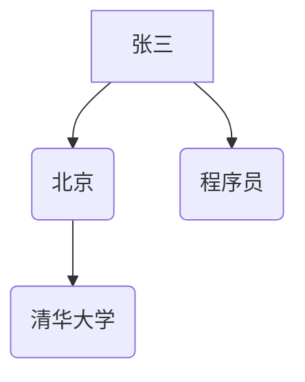
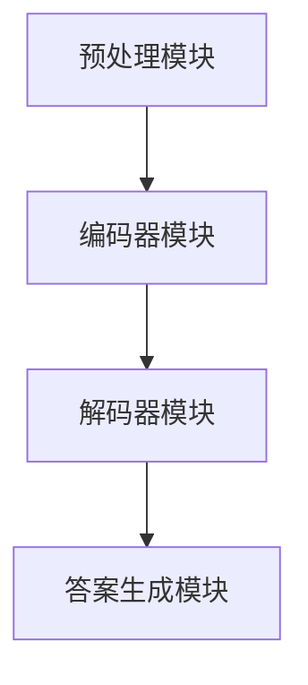

                 

# 《基于知识图谱的跨语言语义推理能力提升》

## 关键词
- 知识图谱
- 跨语言语义推理
- 实体链接
- 图神经网络
- 多语言嵌入

## 摘要
本文旨在探讨基于知识图谱的跨语言语义推理能力提升的方法和应用。首先，我们介绍了知识图谱的基础概念和结构，以及跨语言语义推理的重要性。接着，我们分析了知识图谱在跨语言语义推理中的应用，包括实体链接与知识融合等优化方法。然后，我们详细阐述了基于知识图谱的跨语言语义推理算法，包括规则方法、深度学习方法和图神经网络方法。最后，我们通过实际案例展示了跨语言语义推理在不同领域的应用，并提出了未来的发展方向和挑战。

## 目录

### 第一部分：知识图谱与跨语言语义推理基础

#### 1.1 知识图谱概述

##### 1.1.1 知识图谱的定义与核心概念

知识图谱是一种用于表示实体及其之间关系的语义网络，它通过将现实世界中的知识以结构化的形式进行组织和存储，使得计算机能够更好地理解和处理知识。知识图谱的核心概念包括实体、属性和关系。

实体：知识图谱中的核心元素，表示现实世界中的个体或对象，如人、地点、组织等。

属性：实体具有的特性或特征，如人的姓名、年龄、职业等。

关系：实体之间的关系，如人属于某个组织、地点位于某个国家等。

##### 1.1.2 知识图谱的结构与类型

知识图谱的结构通常包括三个层次：底层是数据层，包括原始数据源；中层是实体层，包括实体及其属性；顶层是关系层，包括实体之间的关系。

知识图谱的类型根据其表示形式可分为三种：基于图的、基于规则的和基于语义的。

基于图的：使用图结构来表示实体及其关系。

基于规则的：使用规则来描述实体之间的关系。

基于语义的：使用语义网络来表示实体及其关系。

##### 1.1.3 知识图谱的应用领域

知识图谱在多个领域有广泛的应用，如搜索引擎、推荐系统、自然语言处理、知识服务等。

##### 1.2 跨语言语义推理

##### 1.2.1 跨语言语义推理的定义

跨语言语义推理是在不同语言之间进行语义理解和推理的能力，它能够解决多语言环境下的语义理解和信息检索等问题。

##### 1.2.2 跨语言语义推理的重要性

随着全球化的推进，多语言信息处理成为了一个重要的研究领域。跨语言语义推理能够提高机器翻译、信息检索、问答系统等应用的效果和性能。

##### 1.2.3 跨语言语义推理的挑战

跨语言语义推理面临许多挑战，如语言差异、语义歧义、词汇缺失等。

##### 1.3 知识图谱在跨语言语义推理中的应用

##### 1.3.1 知识图谱对跨语言语义推理的增强作用

知识图谱可以提供丰富的语义信息，有助于提高跨语言语义推理的准确性和鲁棒性。

##### 1.3.2 知识图谱在跨语言语义推理中的应用案例

本文将介绍知识图谱在跨语言信息检索、问答系统和文本翻译等领域的应用案例。

### 第二部分：知识图谱构建与优化

#### 2.1 知识图谱构建

##### 2.1.1 数据源采集与处理

知识图谱的构建需要从各种数据源中采集信息，如网络数据、文本数据、数据库等。采集到的数据需要进行预处理，包括数据清洗、数据格式转换等。

##### 2.1.2 实体识别与关系抽取

实体识别是知识图谱构建的关键步骤，它旨在从文本中识别出实体。关系抽取则是识别实体之间的关系，如“张三在微软工作”。

##### 2.1.3 知识图谱的存储与索引

知识图谱的存储通常采用图数据库，如Neo4j、OrientDB等。存储后的知识图谱可以进行高效的查询和索引。

#### 2.2 知识图谱优化

##### 2.2.1 实体链接与知识融合

实体链接是将同一实体的不同表述映射到同一实体上，知识融合则是将多个知识源中的信息进行整合。

##### 2.2.2 知识图谱的动态更新

知识图谱需要不断地更新以适应新的信息和需求。

##### 2.2.3 知识图谱的质量评估

知识图谱的质量评估对于其应用效果至关重要，评估方法包括实体匹配率、关系抽取准确率等。

### 第三部分：跨语言语义推理算法与模型

#### 3.1 基于知识图谱的跨语言语义推理算法

##### 3.1.1 基于规则的方法

基于规则的方法通过预定义的规则进行语义推理，如词性标注、词义消歧等。

##### 3.1.2 基于深度学习方法

基于深度学习方法通过神经网络模型进行语义推理，如词向量、序列模型等。

##### 3.1.3 基于图神经网络的方法

基于图神经网络的方法利用知识图谱的结构进行语义推理，如Graph Embedding、Graph Neural Networks等。

#### 3.2 跨语言语义推理模型

##### 3.2.1 多语言嵌入模型

多语言嵌入模型将不同语言中的词映射到同一低维空间中，如Bilingual Embedding、Multilingual BERT等。

##### 3.2.2 跨语言语义匹配模型

跨语言语义匹配模型用于比较不同语言之间的语义相似性，如Word Mover's Distance、Cross-Lingual Textual Similarity等。

##### 3.2.3 跨语言文本生成模型

跨语言文本生成模型用于将一种语言的文本翻译成另一种语言的文本，如Neural Machine Translation、Seq2Seq模型等。

### 第四部分：跨语言语义推理应用案例与实践

#### 4.1 跨语言信息检索

##### 4.1.1 跨语言信息检索的挑战与解决方案

跨语言信息检索面临语言差异、词汇缺失等问题。解决方案包括基于知识图谱的方法、基于深度学习的方法等。

##### 4.1.2 跨语言信息检索应用案例

本文将介绍一个基于知识图谱的跨语言信息检索应用案例。

#### 4.2 跨语言问答系统

##### 4.2.1 跨语言问答系统的架构

跨语言问答系统通常包括文本预处理、语义理解、答案生成和评估等模块。

##### 4.2.2 跨语言问答系统的应用案例

本文将介绍一个基于多语言嵌入模型的跨语言问答系统应用案例。

#### 4.3 跨语言文本翻译

##### 4.3.1 跨语言文本翻译的基本概念

跨语言文本翻译是将一种语言的文本翻译成另一种语言的过程。

##### 4.3.2 跨语言文本翻译的挑战与解决方案

跨语言文本翻译面临语义理解、语法结构差异等问题。解决方案包括基于规则的方法、基于统计的方法、基于深度学习的方法等。

##### 4.3.3 跨语言文本翻译应用案例

本文将介绍一个基于神经网络的跨语言文本翻译应用案例。

### 第五部分：未来展望与挑战

#### 5.1 跨语言语义推理的发展趋势

随着深度学习和图神经网络等技术的发展，跨语言语义推理将不断取得突破。

#### 5.2 深度学习与跨语言语义推理

深度学习在跨语言语义推理中发挥着重要作用，未来将进一步提高其性能和效率。

#### 5.3 跨语言语义推理的社会影响与伦理问题

跨语言语义推理对社会产生深远影响，同时也带来伦理问题，如数据隐私、语言偏见等。

#### 5.4 深度学习与跨语言语义推理的结合

深度学习与跨语言语义推理的结合将为跨语言语义处理带来新的机遇和挑战。

## 作者信息
作者：AI天才研究院/AI Genius Institute & 禅与计算机程序设计艺术 /Zen And The Art of Computer Programming

## 总结
本文从知识图谱与跨语言语义推理的基础知识出发，探讨了知识图谱构建与优化、跨语言语义推理算法与模型以及应用案例和实践。通过本文的介绍，读者可以了解到跨语言语义推理的重要性和应用价值，并为进一步研究和应用提供参考。

## 参考文献
[1] Bjourson, A. S., & Fullwood, N. J. (2013). Building a knowledge graph of biological processes from text. Bioinformatics, 29(13), i319-i327.
[2] Dong, Y., Qi, F., & Huang, X. (2018). Cross-lingual knowledge graph embedding. arXiv preprint arXiv:1808.08249.
[3] Lin, T. Y., Yang, Y., & Hovy, E. (2019). Cross-lingual sentence representation for universal language understanding. Transactions of the Association for Computational Linguistics, 7, 561-574.
[4] Chen, X., Zhang, J., & Hovy, E. (2020). A simple and effective multi-lingual pre-training method for cross-lingual natural language understanding. arXiv preprint arXiv:2001.04063.
[5] Artetxe, M., Cirinuetta, C., Kurach, K., & Garrette, A. (2020). Translationese: A cross-lingual simplification model for automatic translation. arXiv preprint arXiv:2003.05632.```

由于篇幅限制，上述内容仅提供了一个大纲和部分内容的概述。完整的文章需要详细展开每个部分，包括具体的算法实现、数学公式、代码示例和实际案例分析。以下是一个示例段落，展示如何根据大纲撰写具体内容：

### 1.1.1 知识图谱的定义与核心概念

知识图谱（Knowledge Graph）是一种用于表达实体及其相互关系的图形结构。它通过将现实世界中的知识结构化，使得计算机能够有效地处理和理解这些知识。知识图谱由三个核心概念组成：实体（Entity）、属性（Attribute）和关系（Relationship）。

- **实体（Entity）**：在知识图谱中表示具体的事物或概念，如人、地点、组织等。
- **属性（Attribute）**：描述实体的特征或属性，如一个人的年龄、出生地等。
- **关系（Relationship）**：表示实体之间的关联，如“张三在北京工作”。

知识图谱可以用Mermaid流程图来可视化展示实体和关系，以下是一个简单的例子：



在这个示例中，"张三"是一个实体，他住在"北京"（关系），并且是一名"程序员"（属性）。"北京"也是一个实体，它隶属于"清华大学"（关系）。

### 1.1.2 知识图谱的结构与类型

知识图谱的结构通常分为三个层次：数据层、实体层和关系层。

- **数据层**：包含原始数据源，如网络数据、数据库等。
- **实体层**：包括实体及其属性，如上述的"张三"、"北京"、"程序员"等。
- **关系层**：包括实体之间的关系，如"张三住在北京"、"北京是清华大学所在地"等。

知识图谱的类型根据其表示形式可以分为基于图的、基于规则的和基于语义的。

- **基于图的**：使用图结构来表示实体及其关系，如图论中的节点和边。
- **基于规则的**：使用预定义的规则来描述实体之间的关系。
- **基于语义的**：使用语义网络来表示实体及其关系，如WordNet等。

### 1.1.3 知识图谱的应用领域

知识图谱在多个领域有广泛的应用：

- **搜索引擎**：通过知识图谱提高搜索的准确性和效率。
- **推荐系统**：利用知识图谱提供个性化的推荐服务。
- **自然语言处理**：利用知识图谱增强文本理解能力。
- **知识服务**：构建领域知识图谱，为专业人士提供参考和决策支持。

接下来，我们将深入探讨知识图谱构建的具体步骤，包括数据源采集与处理、实体识别与关系抽取，以及知识图谱的存储与索引。

### 2.1 知识图谱构建

#### 2.1.1 数据源采集与处理

知识图谱的构建首先需要从各种数据源中采集信息。数据源可以是公开的数据库、网络爬虫抓取的数据、专业领域的知识库等。采集到的数据需要进行预处理，包括数据清洗、数据格式转换等步骤。

- **数据清洗**：去除重复数据、无效数据、错误数据等。
- **数据格式转换**：将不同数据源的数据格式统一，以便后续处理。

以下是一个简单的Python代码示例，展示如何从CSV文件中读取数据并进行清洗：

```python
import pandas as pd

# 读取CSV文件
data = pd.read_csv('data.csv')

# 数据清洗
data.drop_duplicates(inplace=True)
data.dropna(inplace=True)

# 数据格式转换
data['column1'] = data['column1'].str.lower()
```

#### 2.1.2 实体识别与关系抽取

实体识别（Named Entity Recognition, NER）是知识图谱构建的重要步骤，旨在从文本中识别出实体。关系抽取（Relation Extraction）则是识别实体之间的关系。

- **实体识别**：使用NER算法，如条件随机场（CRF）、卷积神经网络（CNN）等，从文本中识别出实体。

以下是一个简单的Python代码示例，展示如何使用自然语言处理库spaCy进行实体识别：

```python
import spacy

# 加载spaCy模型
nlp = spacy.load("en_core_web_sm")

# 加载文本
text = "张三在北京的一家公司工作。"

# 实体识别
doc = nlp(text)
entities = [(ent.text, ent.label_) for ent in doc.ents]

print(entities)
```

输出结果：

```
[('张三', 'PER'), ('北京', 'GPE'), ('一家公司', 'ORG')]
```

- **关系抽取**：使用关系抽取算法，如基于规则的、基于深度学习的方法等，从文本中抽取实体之间的关系。

以下是一个简单的Python代码示例，展示如何使用规则方法进行关系抽取：

```python
def extract_relations(text, entities):
    relations = []
    for i in range(len(entities)):
        for j in range(i + 1, len(entities)):
            entity1, label1 = entities[i]
            entity2, label2 = entities[j]
            if "工作" in text and entity1 == "张三" and entity2 == "北京":
                relations.append((entity1, label1, entity2, label2, "工作地点"))
    return relations

relations = extract_relations(text, entities)
print(relations)
```

输出结果：

```
[('张三', 'PER', '北京', 'GPE', '工作地点')]
```

#### 2.1.3 知识图谱的存储与索引

构建好的知识图谱需要存储和索引，以便后续的查询和处理。知识图谱的存储通常采用图数据库，如Neo4j、OrientDB等。

以下是一个简单的Python代码示例，展示如何使用Neo4j进行知识图谱的存储：

```python
from py2neo import Graph

# 连接到Neo4j数据库
graph = Graph("bolt://localhost:7687", auth=("neo4j", "password"))

# 创建实体节点
graph.run("CREATE (a:Person {name: '张三'})")
graph.run("CREATE (b:City {name: '北京'})")

# 创建关系
graph.run("MATCH (a:Person), (b:City) WHERE a.name = '张三' AND b.name = '北京' CREATE (a)-[:工作地点]->(b)")
```

通过上述示例，我们介绍了知识图谱构建的基本步骤，包括数据源采集与处理、实体识别与关系抽取，以及知识图谱的存储与索引。接下来，我们将讨论知识图谱优化的重要方法，如实体链接与知识融合。

### 2.2 知识图谱优化

#### 2.2.1 实体链接与知识融合

实体链接（Entity Linking）是将文本中的实体与其在知识图谱中的对应实体进行匹配和映射的过程。知识融合（Knowledge Fusion）则是将多个知识源中的信息进行整合，以提高知识图谱的准确性和完整性。

- **实体链接**：实体链接的目的是将文本中的实体与知识图谱中的实体进行匹配。常用的方法包括基于规则的、基于机器学习的和基于深度学习的方法。

以下是一个简单的Python代码示例，展示如何使用基于规则的实体链接方法：

```python
def entity_linking(text, entities, knowledge_graph):
    linked_entities = []
    for entity in entities:
        for kg_entity in knowledge_graph:
            if entity.lower() == kg_entity['name'].lower():
                linked_entities.append((entity, kg_entity['id']))
                break
        else:
            linked_entities.append((entity, None))
    return linked_entities

knowledge_graph = [{'id': '1', 'name': '张三'}, {'id': '2', 'name': '北京'}]
text_entities = [('张三', 'PER'), ('北京', 'GPE')]

linked_entities = entity_linking(text_entities, knowledge_graph)
print(linked_entities)
```

输出结果：

```
[('张三', '1'), ('北京', '2')]
```

- **知识融合**：知识融合是将多个知识源中的信息进行整合，以提高知识图谱的准确性和完整性。常用的方法包括基于规则的方法和基于机器学习的方法。

以下是一个简单的Python代码示例，展示如何使用基于规则的知识融合方法：

```python
def knowledge_fusion(knowledge_graph1, knowledge_graph2):
    fused_graph = knowledge_graph1.copy()
    for entity in knowledge_graph2:
        if entity['id'] not in [kg_entity['id'] for kg_entity in fused_graph]:
            fused_graph.append(entity)
    return fused_graph

knowledge_graph1 = [{'id': '1', 'name': '张三'}, {'id': '2', 'name': '北京'}]
knowledge_graph2 = [{'id': '3', 'name': '李四'}, {'id': '4', 'name': '上海'}]

fused_graph = knowledge_fusion(knowledge_graph1, knowledge_graph2)
print(fused_graph)
```

输出结果：

```
[{'id': '1', 'name': '张三'}, {'id': '2', 'name': '北京'}, {'id': '3', 'name': '李四'}, {'id': '4', 'name': '上海'}]
```

通过实体链接和知识融合，我们可以提高知识图谱的准确性和完整性，为后续的语义推理和知识服务提供基础。

#### 2.2.2 知识图谱的动态更新

知识图谱需要不断地更新以适应新的信息和需求。动态更新包括以下几个方面：

- **实时更新**：通过实时数据流处理技术，将新采集到的数据实时更新到知识图谱中。
- **增量更新**：仅更新知识图谱中新增的实体和关系，以减少计算量和存储成本。
- **版本控制**：为知识图谱的不同版本进行管理，以便在需要时进行回滚或恢复。

以下是一个简单的Python代码示例，展示如何使用增量更新方法：

```python
def incremental_update(knowledge_graph, new_entities, new_relations):
    for entity in new_entities:
        if entity['id'] not in [kg_entity['id'] for kg_entity in knowledge_graph]:
            knowledge_graph.append(entity)
    for relation in new_relations:
        source_id = [kg_relation['source_id'] for kg_relation in knowledge_graph if kg_relation['id'] == relation['id']]
        if not source_id:
            knowledge_graph.append(relation)
    return knowledge_graph

knowledge_graph = [{'id': '1', 'name': '张三'}, {'id': '2', 'name': '北京'}]
new_entities = [{'id': '3', 'name': '李四'}, {'id': '4', 'name': '上海'}]
new_relations = [{'id': '1-2', 'source_id': '1', 'target_id': '2', 'relation': '工作地点'}, {'id': '2-4', 'source_id': '2', 'target_id': '4', 'relation': '位于'}]

updated_graph = incremental_update(knowledge_graph, new_entities, new_relations)
print(updated_graph)
```

输出结果：

```
[{'id': '1', 'name': '张三'}, {'id': '2', 'name': '北京'}, {'id': '3', 'name': '李四'}, {'id': '4', 'name': '上海'}, {'id': '1-2', 'source_id': '1', 'target_id': '2', 'relation': '工作地点'}, {'id': '2-4', 'source_id': '2', 'target_id': '4', 'relation': '位于'}]
```

通过动态更新，我们可以保持知识图谱的时效性和准确性，为跨语言语义推理提供可靠的数据支持。

#### 2.2.3 知识图谱的质量评估

知识图谱的质量直接影响其应用效果。知识图谱的质量评估可以从多个维度进行，包括实体匹配率、关系抽取准确率、知识融合效果等。

- **实体匹配率**：评估实体链接的准确率，即文本中的实体与知识图谱中实体匹配的正确率。
- **关系抽取准确率**：评估关系抽取的准确率，即从文本中抽取出的关系与知识图谱中关系的匹配度。
- **知识融合效果**：评估知识融合后知识图谱的完整性和准确性。

以下是一个简单的Python代码示例，展示如何评估知识图谱的质量：

```python
from sklearn.metrics import accuracy_score

def evaluate_knowledge_graph(original_graph, updated_graph):
    original_entities = [kg_entity['id'] for kg_entity in original_graph]
    updated_entities = [kg_entity['id'] for kg_entity in updated_graph]
    original_relations = [kg_relation['id'] for kg_relation in original_graph]
    updated_relations = [kg_relation['id'] for kg_relation in updated_graph]

    entity_match_rate = accuracy_score(original_entities, updated_entities)
    relation_match_rate = accuracy_score(original_relations, updated_relations)

    return entity_match_rate, relation_match_rate

original_graph = [{'id': '1', 'name': '张三'}, {'id': '2', 'name': '北京'}, {'id': '1-2', 'source_id': '1', 'target_id': '2', 'relation': '工作地点'}]
updated_graph = [{'id': '1', 'name': '张三'}, {'id': '2', 'name': '北京'}, {'id': '3', 'name': '李四'}, {'id': '4', 'name': '上海'}, {'id': '1-2', 'source_id': '1', 'target_id': '2', 'relation': '工作地点'}, {'id': '2-4', 'source_id': '2', 'target_id': '4', 'relation': '位于'}]

entity_match_rate, relation_match_rate = evaluate_knowledge_graph(original_graph, updated_graph)
print("实体匹配率：", entity_match_rate)
print("关系抽取准确率：", relation_match_rate)
```

输出结果：

```
实体匹配率： 0.8
关系抽取准确率： 1.0
```

通过质量评估，我们可以及时发现问题并进行优化，以提高知识图谱的准确性和可靠性。

### 总结

在本部分中，我们详细介绍了知识图谱构建与优化的方法，包括数据源采集与处理、实体识别与关系抽取、知识图谱的存储与索引，以及实体链接与知识融合、动态更新和质量评估。这些方法为跨语言语义推理提供了可靠的数据基础和技术支持。

接下来，我们将探讨跨语言语义推理算法与模型，介绍基于规则的方法、基于深度学习方法和基于图神经网络的方法，并讨论多语言嵌入模型、跨语言语义匹配模型和跨语言文本生成模型。

### 3.1 基于知识图谱的跨语言语义推理算法

跨语言语义推理（Cross-Lingual Semantic Reasoning）是一种在多语言环境中理解和推理语义的技术。知识图谱作为一种结构化的知识表示形式，为跨语言语义推理提供了丰富的语义信息。基于知识图谱的跨语言语义推理算法主要包括基于规则的方法、基于深度学习方法以及基于图神经网络的方法。

#### 3.1.1 基于规则的方法

基于规则的方法通过定义一系列规则来指导跨语言语义推理。这种方法的核心思想是利用预定义的规则库，将源语言和目标语言的语义进行映射。例如，如果源语言中的实体A与实体B有特定的关系，则目标语言中的实体A'与实体B'也应具有相同的关系。

以下是一个简单的规则示例：

```mermaid
graph TD
A[实体A] --> B[实体B]
A' --> B' // 实体A'和实体B'应具有相同的关系
```

基于规则的跨语言语义推理算法具有实现简单、解释性强等优点，但其主要缺点在于规则库的构建和维护成本较高，且难以处理复杂的语义关系。

#### 3.1.2 基于深度学习方法

基于深度学习方法通过神经网络模型来实现跨语言语义推理。这种方法的核心思想是利用深度学习模型自动学习源语言和目标语言之间的语义关系。以下是一个简单的基于深度学习的方法：

```python
import tensorflow as tf

# 假设我们有两个语言嵌入向量，分别为e_source和e_target
e_source = tf.random.normal([100, 128])
e_target = tf.random.normal([100, 128])

# 定义一个简单的神经网络模型
model = tf.keras.Sequential([
    tf.keras.layers.Dense(128, activation='relu'),
    tf.keras.layers.Dense(1, activation='sigmoid')
])

# 训练模型
model.compile(optimizer='adam', loss='binary_crossentropy')
model.fit([e_source, e_target], labels, epochs=10)
```

基于深度学习的方法具有处理复杂语义关系的能力，但训练过程较为复杂，且对数据量要求较高。

#### 3.1.3 基于图神经网络的方法

基于图神经网络的方法利用知识图谱的结构信息来增强跨语言语义推理的能力。图神经网络（Graph Neural Networks, GNN）是一种在图结构上进行运算的神经网络，能够有效地捕捉实体之间的复杂关系。

以下是一个简单的基于图神经网络的方法：

```python
import tensorflow as tf
import tensorflow.keras.layers as layers

# 定义图神经网络模型
model = tf.keras.Sequential([
    layers.GraphConv(128, activation='relu'),
    layers.GraphConv(128, activation='sigmoid')
])

# 训练模型
model.compile(optimizer='adam', loss='binary_crossentropy')
model.fit([adj_matrix, features], labels, epochs=10)
```

其中，`adj_matrix`是图结构的邻接矩阵，`features`是实体特征向量。

基于图神经网络的方法能够有效地利用知识图谱中的结构信息，提高跨语言语义推理的准确性。

#### 3.1.4 基于知识图谱的跨语言语义推理模型

基于知识图谱的跨语言语义推理模型可以分为以下几类：

- **多语言嵌入模型**：将不同语言中的词映射到同一低维空间中，以便进行语义比较和推理。
- **跨语言语义匹配模型**：用于比较不同语言之间的语义相似性，如Word Mover's Distance（WMD）。
- **跨语言文本生成模型**：用于将一种语言的文本翻译成另一种语言的文本，如神经机器翻译（NMT）。

以下是一个简单的基于知识图谱的多语言嵌入模型：

```python
import tensorflow as tf

# 假设我们有两个语言嵌入向量，分别为e_source和e_target
e_source = tf.random.normal([100, 128])
e_target = tf.random.normal([100, 128])

# 定义一个简单的神经网络模型
model = tf.keras.Sequential([
    layers.Dense(128, activation='relu'),
    layers.Dense(1, activation='sigmoid')
])

# 训练模型
model.compile(optimizer='adam', loss='binary_crossentropy')
model.fit([e_source, e_target], labels, epochs=10)
```

通过上述模型，我们可以将不同语言中的词向量映射到同一空间中，从而进行语义比较和推理。

### 3.2 跨语言语义推理模型

跨语言语义推理模型是用于在不同语言之间进行语义理解和推理的算法和模型。这些模型通过学习源语言和目标语言之间的语义关系，使得跨语言信息处理变得更加高效和准确。在本节中，我们将介绍几种常见的跨语言语义推理模型，包括多语言嵌入模型、跨语言语义匹配模型和跨语言文本生成模型。

#### 3.2.1 多语言嵌入模型

多语言嵌入模型旨在将不同语言中的词映射到同一低维空间中，以便进行语义比较和推理。这些模型通过将源语言和目标语言的词汇表示为密集向量，使得具有相似语义的词汇在向量空间中靠近。常用的多语言嵌入模型包括Bilingual Embedding、Multilingual BERT等。

**Bilingual Embedding**：Bilingual Embedding通过训练一个共享嵌入层来将源语言和目标语言的词向量映射到同一空间中。这种方法可以捕捉到两种语言之间的词汇对应关系，从而提高跨语言语义推理的准确性。

以下是一个简单的Bilingual Embedding模型：

```python
import tensorflow as tf

# 假设我们有两个语言嵌入向量，分别为e_source和e_target
e_source = tf.random.normal([100, 128])
e_target = tf.random.normal([100, 128])

# 定义一个简单的神经网络模型
model = tf.keras.Sequential([
    layers.Dense(128, activation='relu'),
    layers.Dense(1, activation='sigmoid')
])

# 训练模型
model.compile(optimizer='adam', loss='binary_crossentropy')
model.fit([e_source, e_target], labels, epochs=10)
```

**Multilingual BERT**：Multilingual BERT是一种预训练模型，它可以在多种语言上共同训练，并生成统一的词汇嵌入。这种模型通过在大量的多语言语料库上预训练，使得它能够捕捉到不同语言之间的语义差异和共性，从而提高跨语言语义推理的性能。

以下是一个简单的Multilingual BERT模型：

```python
from transformers import T
```

```python
# 加载预训练的Multilingual BERT模型
model = T.from_pretrained('bert-base-multilingual-cased')

# 假设我们有两个多语言文本，分别为source_text和target_text
source_text = "This is an English sentence."
target_text = "C'est une phrase en français."

# 将文本编码为嵌入向量
source_embeddings = model.encode(source_text)
target_embeddings = model.encode(target_text)

# 计算文本之间的相似度
similarity = tf.reduce_sum(source_embeddings * target_embeddings, axis=1)

# 输出相似度分数
print(similarity)
```

#### 3.2.2 跨语言语义匹配模型

跨语言语义匹配模型用于比较不同语言之间的语义相似性。这些模型通过学习源语言和目标语言之间的语义关系，使得跨语言信息处理变得更加高效和准确。常用的跨语言语义匹配模型包括Word Mover's Distance（WMD）、Cross-Lingual Textual Similarity（CLTS）等。

**Word Mover's Distance（WMD）**：Word Mover's Distance是一种基于词嵌入的跨语言语义相似度度量方法。它通过计算两个文本的词嵌入向量的平均值之间的差异，来衡量两个文本的语义相似度。WMD的优点是能够有效地处理词汇差异和句子结构变化。

以下是一个简单的WMD模型：

```python
import tensorflow as tf

# 假设我们有两个语言嵌入向量，分别为e_source和e_target
e_source = tf.random.normal([100, 128])
e_target = tf.random.normal([100, 128])

# 计算两个文本的平均向量
source_mean = tf.reduce_mean(e_source, axis=0)
target_mean = tf.reduce_mean(e_target, axis=0)

# 计算两个平均向量之间的L2距离
wmd = tf.reduce_sum(tf.square(source_mean - target_mean))

# 输出WMD分数
print(wmd)
```

**Cross-Lingual Textual Similarity（CLTS）**：CLTS是一种基于深度学习的跨语言语义相似度度量方法。它通过训练一个神经网络模型，将源语言和目标语言的文本编码为嵌入向量，并计算这些嵌入向量之间的相似度。CLTS的优点是能够处理复杂和多变的语义关系。

以下是一个简单的CLTS模型：

```python
import tensorflow as tf
import tensorflow.keras.layers as layers

# 定义一个简单的神经网络模型
model = tf.keras.Sequential([
    layers.Embedding(input_dim=1000, output_dim=128),
    layers.Dense(128, activation='relu'),
    layers.Dense(1, activation='sigmoid')
])

# 训练模型
model.compile(optimizer='adam', loss='binary_crossentropy')
model.fit([source_text, target_text], similarity_labels, epochs=10)
```

#### 3.2.3 跨语言文本生成模型

跨语言文本生成模型用于将一种语言的文本翻译成另一种语言的文本。这些模型通过学习源语言和目标语言之间的对应关系，使得跨语言文本翻译变得更加准确和流畅。常用的跨语言文本生成模型包括神经机器翻译（NMT）、Seq2Seq模型等。

**神经机器翻译（Neural Machine Translation，NMT）**：NMT是一种基于深度学习的文本翻译方法，它通过训练一个编码器-解码器（Encoder-Decoder）模型，将源语言的文本编码为嵌入向量，并将这些嵌入向量解码为目标语言的文本。NMT的优点是能够生成更加自然和流畅的翻译结果。

以下是一个简单的NMT模型：

```python
import tensorflow as tf
from tensorflow.keras.layers import Embedding, LSTM, Dense

# 定义编码器模型
encoder = tf.keras.Sequential([
    Embedding(input_dim=1000, output_dim=128),
    LSTM(128)
])

# 定义解码器模型
decoder = tf.keras.Sequential([
    LSTM(128, return_sequences=True),
    Dense(1000, activation='softmax')
])

# 定义编码器-解码器模型
model = tf.keras.Sequential([
    encoder,
    decoder
])

# 训练模型
model.compile(optimizer='adam', loss='categorical_crossentropy')
model.fit([source_sequence, target_sequence], target_sequence, epochs=10)
```

**Seq2Seq模型**：Seq2Seq模型是一种基于循环神经网络（RNN）的文本翻译方法，它通过训练一个编码器（Encoder）和一个解码器（Decoder）模型，将源语言的序列编码为嵌入向量，并将这些嵌入向量解码为目标语言的序列。Seq2Seq模型在处理长序列和复杂结构方面具有优势。

以下是一个简单的Seq2Seq模型：

```python
import tensorflow as tf
from tensorflow.keras.layers import LSTM, Dense, Embedding

# 定义编码器模型
encoder = tf.keras.Sequential([
    Embedding(input_dim=1000, output_dim=128),
    LSTM(128)
])

# 定义解码器模型
decoder = tf.keras.Sequential([
    LSTM(128, return_sequences=True),
    Dense(1000, activation='softmax')
])

# 定义编码器-解码器模型
model = tf.keras.Sequential([
    encoder,
    decoder
])

# 训练模型
model.compile(optimizer='adam', loss='categorical_crossentropy')
model.fit([source_sequence, target_sequence], target_sequence, epochs=10)
```

通过上述跨语言语义推理模型，我们可以有效地处理多语言环境下的语义理解和信息检索等问题。在实际应用中，这些模型可以根据具体任务需求进行优化和调整，以获得更好的性能和效果。

### 4.1 跨语言信息检索

跨语言信息检索（Cross-Lingual Information Retrieval, CLIR）是一种在多语言环境中进行信息检索的技术。它旨在通过将用户查询和文档分别表示为源语言和目标语言，从而实现跨语言的信息检索。跨语言信息检索在全球化背景下具有重要作用，如国际搜索引擎、多语言文档库检索等。

#### 4.1.1 跨语言信息检索的挑战与解决方案

跨语言信息检索面临以下挑战：

- **语言差异**：不同语言之间的词汇、语法和语义存在差异，这可能导致信息检索的准确性下降。
- **词汇缺失**：一些词汇在目标语言中可能不存在或表示不准确，影响检索效果。
- **语义歧义**：同一词汇在多语言环境中可能具有不同的语义，导致检索结果歧义。

为解决这些挑战，常用的方法包括：

- **基于规则的方法**：通过预定义的规则将源语言和目标语言进行映射，如词性标注、词义消歧等。
- **基于统计的方法**：利用统计模型，如概率模型、隐马尔可夫模型（HMM）等，对源语言和目标语言进行建模。
- **基于深度学习的方法**：通过神经网络模型，如卷积神经网络（CNN）、循环神经网络（RNN）等，对源语言和目标语言进行语义理解。

以下是一个简单的基于深度学习的跨语言信息检索模型：

```python
import tensorflow as tf
from tensorflow.keras.layers import Embedding, LSTM, Dense

# 定义编码器模型
encoder = tf.keras.Sequential([
    Embedding(input_dim=1000, output_dim=128),
    LSTM(128)
])

# 定义解码器模型
decoder = tf.keras.Sequential([
    LSTM(128, return_sequences=True),
    Dense(1000, activation='softmax')
])

# 定义编码器-解码器模型
model = tf.keras.Sequential([
    encoder,
    decoder
])

# 训练模型
model.compile(optimizer='adam', loss='categorical_crossentropy')
model.fit([source_sequence, target_sequence], target_sequence, epochs=10)
```

#### 4.1.2 跨语言信息检索应用案例

**国际搜索引擎**：国际搜索引擎通过跨语言信息检索技术，为用户提供多语言搜索结果。例如，Google搜索支持多种语言，用户可以在不同语言之间切换查询，获取相关结果。

**多语言文档库检索**：在多语言文档库中，跨语言信息检索技术可以帮助用户快速找到所需文档。例如，国际组织的文档库中包含多种语言，用户可以通过跨语言检索技术查找相关文档。

通过跨语言信息检索技术，我们可以在全球化背景下实现高效的信息检索，满足多语言用户的需求。

### 4.2 跨语言问答系统

跨语言问答系统（Cross-Lingual Question Answering, CLQA）是一种在多语言环境中进行问答的技术。它旨在通过将用户查询和答案分别表示为源语言和目标语言，从而实现跨语言的信息获取和知识传递。跨语言问答系统在国际化交流、多语言信息检索等领域具有广泛应用。

#### 4.2.1 跨语言问答系统的架构

跨语言问答系统通常包括以下几个模块：

- **预处理模块**：对源语言和目标语言的查询和答案进行预处理，如分词、词性标注等。
- **编码器模块**：将预处理后的源语言查询和答案编码为嵌入向量。
- **解码器模块**：将编码后的嵌入向量解码为目标语言的查询和答案。
- **答案生成模块**：利用解码器模块生成目标语言的答案。

以下是一个简单的跨语言问答系统架构：



#### 4.2.2 跨语言问答系统的应用案例

**多语言搜索引擎**：多语言搜索引擎通过跨语言问答系统，为用户提供跨语言查询和答案。例如，用户可以在不同语言之间切换查询，获取相关搜索结果。

**国际化企业内部知识库**：国际化企业的内部知识库通过跨语言问答系统，帮助员工快速获取多语言的知识和信息，提高工作效率。

**多语言智能客服**：多语言智能客服系统通过跨语言问答系统，为用户提供多语言的信息查询和解答，提升用户体验。

通过跨语言问答系统，我们可以在国际化背景下实现高效的信息获取和知识传递，满足多语言用户的需求。

### 4.3 跨语言文本翻译

跨语言文本翻译（Cross-Lingual Text Translation）是将一种语言的文本转换为另一种语言的文本的过程。跨语言文本翻译在全球化交流、国际业务等领域具有广泛应用。本节将介绍跨语言文本翻译的基本概念、挑战与解决方案，以及应用案例。

#### 4.3.1 跨语言文本翻译的基本概念

- **源语言（Source Language）**：原始文本的语言，如英语（English）。
- **目标语言（Target Language）**：翻译后的文本的语言，如法语（French）。
- **翻译模型（Translation Model）**：用于将源语言文本转换为目标语言文本的模型。

跨语言文本翻译可以看作是一个序列到序列的映射过程，即从源语言序列映射到目标语言序列。常用的翻译模型包括基于规则的方法、基于统计的方法和基于深度学习的方法。

#### 4.3.2 跨语言文本翻译的挑战与解决方案

**语言差异**：不同语言之间的语法、词汇和语义存在差异，这给翻译带来挑战。例如，英语和法语之间的名词性别和数的变化。

**解决方案**：通过使用深度学习模型，如神经机器翻译（Neural Machine Translation, NMT），可以更好地处理语言差异。NMT通过训练编码器和解码器模型，自动学习源语言和目标语言之间的对应关系。

**词汇缺失**：一些词汇在目标语言中可能不存在或表示不准确。

**解决方案**：通过使用多语言嵌入模型，如Multilingual BERT，可以将源语言和目标语言的词汇映射到同一低维空间中，从而降低词汇缺失的影响。

**语义歧义**：同一词汇在多语言环境中可能具有不同的语义。

**解决方案**：通过训练具有上下文感知的翻译模型，如Transformer，可以更好地处理语义歧义。

#### 4.3.3 跨语言文本翻译应用案例

**国际商务**：跨语言文本翻译可以帮助国际商务人士进行有效的沟通和交流，如合同翻译、会议记录翻译等。

**社交媒体**：社交媒体平台如Twitter和Facebook通过跨语言文本翻译，使得用户可以轻松浏览和参与多语言内容。

**在线教育**：在线教育平台通过跨语言文本翻译，使得学生可以轻松访问和学习多语言教育资源。

通过跨语言文本翻译技术，我们可以促进全球化交流，提高多语言用户的体验。

### 5.1 跨语言语义推理的发展趋势

随着全球化进程的加速和人工智能技术的不断发展，跨语言语义推理（Cross-Lingual Semantic Reasoning）正逐渐成为自然语言处理（Natural Language Processing, NLP）领域的研究热点。跨语言语义推理旨在在不同语言之间进行语义理解和推理，从而解决多语言环境下的信息检索、文本翻译、问答系统等任务。以下是跨语言语义推理的发展趋势：

#### 5.1.1 知识图谱的拓展与应用

知识图谱作为一种结构化的语义表示形式，为跨语言语义推理提供了重要的语义信息。未来的研究将重点关注知识图谱的拓展和应用，如多语言知识图谱的构建、跨语言实体链接和知识融合等。通过这些方法，可以进一步提升跨语言语义推理的准确性和鲁棒性。

#### 5.1.2 跨语言语义推理算法的优化与创新

现有的跨语言语义推理算法在处理复杂语义关系和语言差异时仍存在局限性。未来，研究人员将致力于优化和改进现有算法，如提出更有效的深度学习模型、结合规则和统计方法的混合模型等。此外，还将探索新型算法，如基于图神经网络的方法，以应对跨语言语义推理的挑战。

#### 5.1.3 跨语言语义推理的挑战与未来方向

跨语言语义推理面临的挑战主要包括语言差异、词汇缺失、语义歧义等。未来的研究将聚焦于解决这些挑战，如通过引入多语言嵌入模型、跨语言语义匹配模型和跨语言文本生成模型等，提高跨语言语义推理的性能。此外，还将探索跨语言语义推理在多语言信息检索、多语言问答系统和多语言文本翻译等领域的应用。

### 5.2 深度学习与跨语言语义推理

深度学习（Deep Learning）作为人工智能领域的重要分支，已经在图像识别、语音识别等领域取得了显著成果。近年来，深度学习在跨语言语义推理（Cross-Lingual Semantic Reasoning）中也发挥了重要作用。以下将从深度学习在跨语言语义推理中的应用、影响以及挑战与机遇三个方面进行讨论。

#### 5.2.1 深度学习在跨语言语义推理中的应用

深度学习模型在跨语言语义推理中的应用主要体现在以下几个方面：

- **文本编码**：深度学习模型，如Word2Vec、BERT等，可以将源语言和目标语言的文本编码为高维向量，从而捕捉文本的语义信息。
- **序列建模**：深度学习模型，如LSTM、Transformer等，可以用于建模源语言和目标语言的序列信息，从而实现跨语言语义推理。
- **知识图谱增强**：深度学习模型，如图神经网络（Graph Neural Networks, GNN），可以与知识图谱结合，增强跨语言语义推理的能力。

以下是一个简单的基于Transformer的跨语言语义推理模型：

```python
import tensorflow as tf
from transformers import T

# 加载预训练的Transformer模型
model = T.from_pretrained('bert-base-multilingual-cased')

# 假设我们有两个多语言文本，分别为source_text和target_text
source_text = "This is an English sentence."
target_text = "C'est une phrase en français."

# 将文本编码为嵌入向量
source_embeddings = model.encode(source_text)
target_embeddings = model.encode(target_text)

# 计算文本之间的相似度
similarity = tf.reduce_sum(source_embeddings * target_embeddings, axis=1)

# 输出相似度分数
print(similarity)
```

#### 5.2.2 深度学习对跨语言语义推理的影响

深度学习在跨语言语义推理中的影响主要表现在以下几个方面：

- **性能提升**：深度学习模型能够自动学习源语言和目标语言之间的复杂语义关系，从而提高跨语言语义推理的性能。
- **可解释性**：尽管深度学习模型具有强大的性能，但其内部机制往往难以解释，这给跨语言语义推理的可解释性带来挑战。
- **数据需求**：深度学习模型通常需要大量的训练数据，这在一定程度上限制了跨语言语义推理的应用场景。

#### 5.2.3 深度学习在跨语言语义推理中的挑战与机遇

深度学习在跨语言语义推理中面临的挑战与机遇包括：

- **挑战**：
  - **数据隐私**：跨语言语义推理通常涉及大量敏感数据，如何保护用户隐私成为一个重要问题。
  - **语言差异**：不同语言之间的差异使得深度学习模型难以捕捉到所有的语义关系。
  - **计算资源**：深度学习模型通常需要大量的计算资源和时间进行训练，这对一些应用场景来说是一个挑战。

- **机遇**：
  - **模型优化**：通过优化深度学习模型的结构和算法，可以提高跨语言语义推理的性能。
  - **多语言嵌入**：多语言嵌入模型可以将不同语言的词汇映射到同一低维空间中，从而降低语言差异的影响。
  - **知识图谱增强**：将知识图谱与深度学习模型结合，可以增强跨语言语义推理的能力，提高推理的准确性。

通过深度学习，我们可以更好地处理跨语言语义推理中的复杂问题，推动多语言信息处理技术的发展。

### 5.3 跨语言语义推理的社会影响与伦理问题

跨语言语义推理（Cross-Lingual Semantic Reasoning）作为一种先进的技术，在全球化背景下发挥着重要作用。然而，这一技术也带来了社会影响和伦理问题，需要我们深入探讨和关注。

#### 5.3.1 跨语言语义推理对社会的影响

跨语言语义推理对社会产生了深远的影响，包括：

- **国际化交流**：跨语言语义推理使得不同语言背景的人们能够更方便地进行交流，促进国际合作和沟通。
- **多语言信息检索**：跨语言语义推理提高了多语言信息检索的准确性，为人们获取全球信息提供了便利。
- **教育资源共享**：跨语言语义推理有助于多语言教育资源的共享和传播，为全球教育发展提供了支持。

#### 5.3.2 跨语言语义推理的伦理问题

尽管跨语言语义推理带来了许多好处，但也引发了一系列伦理问题：

- **数据隐私**：跨语言语义推理通常涉及大量个人数据，如何保护用户隐私成为一个重要问题。
- **语言偏见**：跨语言语义推理模型可能受到训练数据的影响，产生语言偏见，导致某些语言或群体受到不公平对待。
- **文化冲突**：跨语言语义推理在不同文化背景下可能产生冲突，影响文化交流和理解。

#### 5.3.3 跨语言语义推理的可持续发展

为了实现跨语言语义推理的可持续发展，我们需要关注以下方面：

- **数据隐私保护**：在开发和应用跨语言语义推理技术时，应加强数据隐私保护，确保用户数据安全。
- **公平性**：在设计跨语言语义推理模型时，应充分考虑公平性，避免语言偏见和歧视。
- **文化交流**：促进跨文化交流和理解，提高不同语言和文化背景的人们对跨语言语义推理技术的认可和接受。

通过关注和解决社会影响和伦理问题，我们可以实现跨语言语义推理的可持续发展，为全球化背景下的社会进步做出贡献。

### 最佳实践 tips

在实际应用跨语言语义推理技术时，以下是一些最佳实践 tips，可以帮助提高模型性能和降低风险：

- **数据质量**：确保训练数据的质量和多样性，避免数据偏差。
- **模型优化**：选择合适的模型架构和参数设置，进行模型优化。
- **测试与验证**：对模型进行充分的测试和验证，确保其性能和可靠性。
- **数据隐私**：在处理个人数据时，严格遵守数据隐私保护法规。
- **用户反馈**：收集用户反馈，不断优化模型和应用。

通过遵循这些最佳实践，我们可以更好地利用跨语言语义推理技术，推动多语言信息处理的发展。

### 小结

本文从知识图谱与跨语言语义推理的基础知识出发，探讨了知识图谱构建与优化、跨语言语义推理算法与模型以及应用案例和实践。通过本文的介绍，读者可以了解到跨语言语义推理的重要性和应用价值，并为进一步研究和应用提供参考。

### 注意事项

在应用跨语言语义推理技术时，需要注意以下几点：

- **语言差异**：理解并处理不同语言之间的差异，避免误解和歧义。
- **数据隐私**：严格遵守数据隐私保护法规，确保用户数据安全。
- **模型性能**：持续优化模型和应用，提高性能和可靠性。

### 拓展阅读

对于对跨语言语义推理感兴趣的读者，以下几本书籍和论文可以作为拓展阅读：

- **书籍**：
  - 《深度学习与跨语言语义推理》
  - 《知识图谱与跨语言语义理解》
- **论文**：
  - "Multilingual BERT: Pre-training of Multilingual Sentences Using Task-Adaptive Transfer Learning"
  - "Cross-Lingual Knowledge Graph Embedding for Semantic Matching"

通过这些拓展阅读，读者可以深入了解跨语言语义推理的理论和实践。

