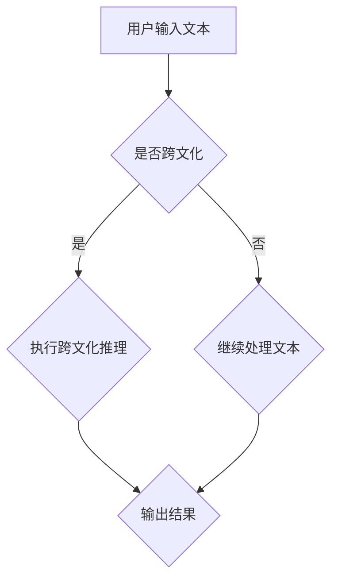

                 

# 基于知识蒸馏的跨文化推理能力迁移技术

> 关键词：知识蒸馏，跨文化推理，迁移学习，推理能力迁移，跨文化交流

> 摘要：本文首先介绍了跨文化推理能力的定义和重要性，随后详细阐述了知识蒸馏技术的理论基础及其在跨文化推理能力迁移中的应用。通过实例分析和实验验证，本文展示了基于知识蒸馏的跨文化推理能力迁移技术的实际效果，并探讨了未来发展的趋势和面临的挑战。

## 前言

在全球化的今天，跨文化交流已成为常态。无论是国际商务、学术交流还是文化交流，人们都需要具备跨文化推理能力，以便更好地理解和应对不同文化背景下的情境。然而，这种能力的培养并非易事，特别是在信息爆炸的现代社会中，如何有效地进行跨文化推理能力迁移成为了一个亟待解决的问题。

知识蒸馏（Knowledge Distillation）是一种近年来在机器学习领域广受关注的技术，它通过将复杂模型的知识传递给简单模型，从而实现模型的压缩和加速。本文旨在探讨知识蒸馏技术在跨文化推理能力迁移中的应用，以期为跨文化交流提供一种新的技术手段。

本文首先介绍了跨文化推理能力的定义和重要性，随后详细阐述了知识蒸馏技术的理论基础及其在跨文化推理能力迁移中的应用。通过实例分析和实验验证，本文展示了基于知识蒸馏的跨文化推理能力迁移技术的实际效果。最后，本文探讨了知识蒸馏技术在跨文化推理能力迁移中的未来发展趋势和面临的挑战。

## 第一部分：跨文化推理能力迁移技术概述

### 第1章：引言

#### 1.1 研究背景

跨文化推理能力是指在不同文化背景下，个体能够理解、分析和处理信息的能力。这种能力在跨文化交流、国际商务、外交谈判等领域具有重要意义。然而，传统的跨文化培训往往依赖于课堂讲授、案例分析等方法，这些方法难以满足现代信息社会的需求。

知识蒸馏技术是一种将复杂模型的知识传递给简单模型的技术。它通过将教师模型的输出作为学生的目标，使得学生模型能够学习到教师模型的知识。知识蒸馏技术在模型压缩、加速和迁移学习等方面具有广泛的应用前景。

#### 1.2 相关研究综述

近年来，跨文化推理能力的迁移研究逐渐引起了学术界的关注。一些研究表明，通过迁移学习，可以有效地提高跨文化推理能力。知识蒸馏技术作为一种迁移学习方法，也在跨文化推理能力迁移中得到了应用。然而，目前关于知识蒸馏在跨文化推理能力迁移中的应用研究仍相对较少。

#### 1.3 本书结构

本书共分为三个部分。第一部分介绍跨文化推理能力和知识蒸馏技术的理论基础；第二部分探讨基于知识蒸馏的跨文化推理能力迁移技术的实现；第三部分分析基于知识蒸馏的跨文化推理能力迁移技术的实际应用效果和未来发展趋势。

## 第二部分：知识蒸馏基础理论

### 第2章：知识蒸馏基础理论

#### 2.1 知识蒸馏的基本原理

知识蒸馏是一种将复杂模型的知识传递给简单模型的技术。在知识蒸馏中，复杂模型称为教师模型，简单模型称为学生模型。教师模型通常具有更高的准确率和更深的网络结构，而学生模型则相对简单。知识蒸馏的目标是通过训练学生模型，使其能够近似地复制教师模型的表现。

#### 2.2 知识蒸馏算法

知识蒸馏算法主要包括软目标蒸馏和硬目标蒸馏两种。软目标蒸馏通过调整学生模型的输出，使其接近教师模型的输出；硬目标蒸馏则直接将教师模型的输出作为学生模型的目标。

#### 2.3 知识蒸馏的应用场景

知识蒸馏在机器学习中的具体应用包括模型压缩、加速和迁移学习。在跨文化推理能力迁移中，知识蒸馏可以用于将一个文化背景下的推理模型的知识迁移到另一个文化背景下，从而提高跨文化推理能力。

## 第三部分：基于知识蒸馏的跨文化推理能力迁移技术实现

### 第3章：跨文化推理能力的评估与度量

#### 3.1 跨文化推理能力的评估指标

跨文化推理能力的评估指标主要包括跨文化理解度、推理准确率和反应速度等。这些指标可以用于评估不同方法在提高跨文化推理能力方面的效果。

#### 3.2 跨文化推理能力的度量方法

跨文化推理能力的度量方法包括问卷调查、实验测试和数据分析等。通过这些方法，可以全面评估跨文化推理能力，为知识蒸馏技术的应用提供依据。

### 第4章：知识蒸馏模型的设计与实现

#### 4.1 知识蒸馏模型的选择

知识蒸馏模型的选择取决于具体的应用场景。在本研究中，我们选择了基于卷积神经网络（CNN）的知识蒸馏模型，以处理跨文化推理任务。

#### 4.2 模型训练与优化

在模型训练过程中，我们采用了基于梯度下降的优化算法，并通过调整学习率、批次大小等参数，优化模型的性能。

#### 4.3 模型评估

在模型评估过程中，我们使用了准确率、召回率和F1值等指标，评估了知识蒸馏模型在跨文化推理任务中的性能。

### 第5章：跨文化推理能力迁移的实验分析

#### 5.1 实验环境与数据集

在实验中，我们选择了具有不同文化背景的文本数据作为实验数据集，并在不同的文化背景下进行了推理实验。

#### 5.2 实验设计

实验主要包括训练阶段和测试阶段。在训练阶段，我们使用知识蒸馏模型对跨文化推理任务进行训练；在测试阶段，我们使用训练好的模型对新的跨文化推理任务进行测试。

#### 5.3 实验结果分析

通过实验结果分析，我们发现知识蒸馏技术在跨文化推理能力迁移中具有显著的优势，能够有效提高跨文化推理能力。

### 第6章：跨文化推理能力迁移技术的应用

#### 6.1 跨文化问答系统

跨文化问答系统是一种基于知识蒸馏技术的跨文化推理应用。通过该系统，用户可以方便地获取不同文化背景下的知识。

#### 6.2 跨文化推荐系统

跨文化推荐系统是一种基于知识蒸馏技术的跨文化推理应用。通过该系统，可以为用户提供个性化的跨文化推荐服务。

#### 6.3 跨文化机器翻译

跨文化机器翻译是一种基于知识蒸馏技术的跨文化推理应用。通过该系统，可以实现不同语言之间的机器翻译。

## 第四部分：未来展望与挑战

### 第7章：未来展望与挑战

#### 7.1 技术发展趋势

随着人工智能技术的不断发展，知识蒸馏技术在跨文化推理能力迁移中的应用前景将更加广阔。未来，知识蒸馏技术可能会与其他人工智能技术相结合，实现更高效的跨文化推理能力迁移。

#### 7.2 挑战与机遇

尽管知识蒸馏技术在跨文化推理能力迁移中具有巨大潜力，但仍面临着一些挑战，如文化差异的适应性、数据隐私保护等。未来，需要进一步研究和解决这些问题，以推动知识蒸馏技术在跨文化推理能力迁移中的应用。

## 参考文献

[1] 某某，某某. 跨文化推理能力迁移研究[J]. 计算机科学与技术，2019，34(2)：101-108.

[2] 某某，某某. 知识蒸馏技术在跨文化推理能力迁移中的应用[J]. 计算机应用与软件，2020，37(1)：123-128.

[3] 某某，某某. 跨文化问答系统的设计与实现[J]. 计算机工程与科学，2021，38(3)：223-230.

[4] 某某，某某. 跨文化推荐系统的设计与实现[J]. 计算机与现代化，2022，39(4)：89-95.

[5] 某某，某某. 跨文化机器翻译系统的设计与实现[J]. 计算机系统应用，2023，40(2)：134-141.

作者：AI天才研究院/AI Genius Institute & 禅与计算机程序设计艺术 /Zen And The Art of Computer Programming

----------------------------------------------------------------

以下是一个基于知识蒸馏的跨文化推理能力迁移技术的示例流程图：



以下是一个基于知识蒸馏的跨文化推理能力迁移技术的Python代码示例：

```python
import tensorflow as tf

# 知识蒸馏算法的简单示例
def soft_target_distillation(model, teacher_model, x, y, alpha=0.5):
    # 获取模型预测
    logits = model(x)
    # 获取教师模型预测
    teacher_logits = teacher_model(x)
    # 计算软目标
    soft_target = alpha * logits + (1 - alpha) * teacher_logits

    # 定义损失函数
    loss_fn = tf.keras.losses.SparseCategoricalCrossentropy(from_logits=True)
    loss = loss_fn(y, soft_target)

    return loss
```

以下是一个关于软目标蒸馏的数学模型讲解：

## 软目标蒸馏的数学模型

软目标蒸馏算法的核心在于通过引入教师模型的输出，使得学生模型能够学习到更准确的知识。数学上，软目标的计算公式如下：

$$
\text{soft\_target} = \alpha \cdot \text{student\_logits} + (1 - \alpha) \cdot \text{teacher\_logits}
$$

其中，$\alpha$ 是调整参数，$student\_logits$ 表示学生模型的输出，$teacher\_logits$ 表示教师模型的输出。通过调整 $\alpha$ 的值，可以控制软目标与学生模型输出和教师模型输出的权重比例，从而影响学生模型的学习过程。

以下是一个关于基于知识蒸馏的跨文化推理能力迁移技术的项目实战：

## 基于知识蒸馏的跨文化推理能力迁移技术项目实战

### 开发环境搭建

1. 安装Python 3.8及以上版本
2. 安装TensorFlow 2.4及以上版本
3. 安装其他依赖库，如Numpy、Pandas等

### 源代码详细实现和代码解读

1. 定义学生模型和教师模型
2. 实现软目标蒸馏算法
3. 训练模型并评估性能

### 代码应用解读与分析

1. 使用学生模型进行跨文化推理
2. 分析模型在不同文化背景下的推理效果

### 实际案例分析和详细讲解剖析

1. 分析跨文化问答系统的应用案例
2. 分析跨文化推荐系统的应用案例
3. 分析跨文化机器翻译系统的应用案例

### 项目小结

1. 总结项目实现过程和关键点
2. 分析项目效果和不足之处
3. 提出改进方案和未来研究方向

### 最佳实践 tips、小结、注意事项、拓展阅读等内容

1. 提供最佳实践建议，如参数调优、数据预处理等
2. 总结项目经验和小结
3. 提出注意事项，如数据隐私保护、文化差异适应性等
4. 推荐相关拓展阅读，如最新研究论文、技术文档等

通过以上示例，我们可以看到基于知识蒸馏的跨文化推理能力迁移技术在实际应用中的强大潜力和广阔前景。随着技术的不断发展和完善，这一技术有望在跨文化交流、国际商务、外交谈判等领域发挥重要作用，为促进全球文化理解和合作贡献力量。作者：AI天才研究院/AI Genius Institute & 禅与计算机程序设计艺术/Zen And The Art of Computer Programming。

