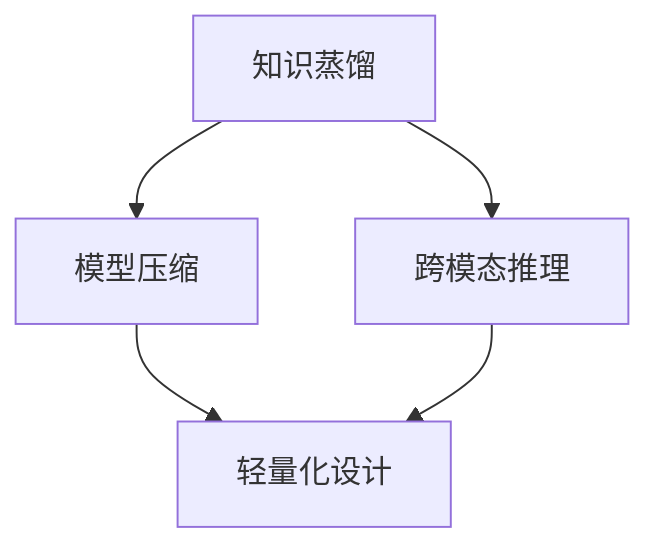

                 

# 基于知识蒸馏的跨模态推理模型轻量化设计

## 关键词
- 知识蒸馏
- 跨模态推理
- 模型轻量化
- 神经架构搜索
- 权重剪枝
- 量化
- 低秩分解

## 摘要
本文探讨了基于知识蒸馏的跨模态推理模型轻量化设计。首先，我们介绍了知识蒸馏和跨模态推理模型的基本概念，以及轻量化设计的背景和目标。接着，深入分析了知识蒸馏的数学原理和核心算法，并介绍了其在跨模态推理模型中的应用。随后，详细阐述了轻量化设计的方法，包括模型压缩技术、神经架构搜索以及其他轻量化设计方法。最后，通过两个跨模态推理模型轻量化设计的实际案例，展示了知识蒸馏和轻量化设计在提升模型性能和降低计算复杂度方面的应用效果。

## 目录大纲

1. **背景与概述**
    1.1 知识蒸馏与跨模态推理模型概述
    1.2 轻量化设计的概念与目标
2. **知识蒸馏技术**
    2.1 知识蒸馏基础
    2.2 知识蒸馏的应用实例
3. **轻量化设计方法**
    3.1 模型压缩技术
    3.2 神经架构搜索
    3.3 其他轻量化设计方法
4. **跨模态推理模型轻量化设计案例**
    4.1 图像到文本的跨模态推理模型轻量化设计
    4.2 文本到图像的跨模态推理模型轻量化设计
5. **总结与展望**
    5.1 轻量化设计在跨模态推理中的应用总结
    5.2 轻量化设计的挑战与未来方向
6. **展望与前景**
    6.1 跨模态推理模型的发展趋势
    6.2 轻量化设计在行业中的应用
7. **附录**
    7.1 轻量化设计工具与资源
    7.2 数据集介绍

## 1. 背景与概述

### 1.1 知识蒸馏与跨模态推理模型概述

**知识蒸馏**是一种将训练好的大型模型的知识传递给小型模型的技术，目的是减少模型的参数数量，降低计算复杂度，同时保持模型的高性能。在知识蒸馏中，原始模型称为教师模型，传递知识的模型称为学生模型。教师模型通常是一个参数丰富的模型，而学生模型则是一个参数较少的模型。

**跨模态推理模型**是指能够处理不同模态数据（如图像、文本、音频等）并进行推理的模型。随着多模态数据的广泛应用，跨模态推理模型在图像识别、文本生成、语音识别等领域有着重要的应用。

### 1.2 轻量化设计的概念与目标

**轻量化设计**是指通过优化模型结构、参数数量和计算复杂度，使得模型在保持性能的同时，具有更小的内存占用和计算延迟。轻量化设计的目标是提高模型的实用性，使其能够应用于资源受限的设备，如移动设备、嵌入式系统等。

### 1.3 轻量化设计的背景

随着深度学习技术的快速发展，大型模型在许多领域取得了显著的成果。然而，这些模型通常需要大量的计算资源和存储空间，这在实际应用中带来了很大的挑战。为了解决这个问题，轻量化设计成为了一个重要的研究方向。

## 2. 知识蒸馏技术

### 2.1 知识蒸馏基础

知识蒸馏的核心思想是将教师模型的知识传递给学生模型，以帮助学生模型更好地学习。具体来说，知识蒸馏分为以下几个步骤：

1. **预训练**：使用大量的标注数据对教师模型进行预训练，使其达到较高的性能。
2. **知识提取**：将教师模型的输出（通常是softmax概率分布）作为知识传递给学生模型。
3. **学生模型训练**：使用原始数据和提取的知识对学生模型进行训练。

### 2.2 知识蒸馏的数学原理

知识蒸馏的过程可以通过以下数学模型来描述：

$$
\begin{aligned}
\text{Teacher}(x) &= \hat{y}_\text{teacher}, \\
\text{Student}(x) &= \hat{y}_\text{student},
\end{aligned}
$$

其中，$\text{Teacher}(x)$和$\text{Student}(x)$分别表示教师模型和学生模型对输入$x$的输出，$\hat{y}_\text{teacher}$和$\hat{y}_\text{student}$分别表示教师模型和学生模型的预测结果。

知识蒸馏的目标是使学生模型的预测结果接近教师模型的输出，这可以通过以下目标函数来描述：

$$
\begin{aligned}
\mathcal{L} &= \sum_{i=1}^N \sum_{j=1}^K (-\log p_j(\hat{y}_\text{student})), \\
\text{s.t.} \quad p_j(\hat{y}_\text{student}) &= \text{softmax}(\text{Teacher}(x_i)),
\end{aligned}
$$

其中，$N$表示数据集中样本的数量，$K$表示类别的数量，$p_j(\hat{y}_\text{student})$表示学生模型对第$j$个类别的预测概率。

### 2.3 知识蒸馏的核心算法

知识蒸馏的核心算法包括Softmax交叉熵蒸馏、Prototypical Networks蒸馏以及其他常见的知识蒸馏算法。

#### 2.3.1 Softmax交叉熵蒸馏

Softmax交叉熵蒸馏是最常见的知识蒸馏算法之一，其核心思想是使用教师模型的softmax输出作为知识，通过交叉熵损失函数来优化学生模型。

#### 2.3.2 Prototypical Networks蒸馏

Prototypical Networks蒸馏算法通过学习原型表示来传递知识。具体来说，教师模型的输出被用来计算每个类别的原型，然后学生模型通过学习原型来预测类别。

#### 2.3.3 其他常见的知识蒸馏算法

除了Softmax交叉熵蒸馏和Prototypical Networks蒸馏，还有其他常见的知识蒸馏算法，如InfoMax蒸馏、Model Parallelism蒸馏等。

### 2.4 知识蒸馏的应用实例

知识蒸馏在跨模态推理模型中有着广泛的应用。以下是一些典型的应用实例：

#### 2.4.1 图像到文本的跨模态推理

在图像到文本的跨模态推理中，教师模型通常是一个用于图像分类的大型卷积神经网络，学生模型则是一个用于文本分类的小型循环神经网络。通过知识蒸馏，教师模型的知识可以被传递给学生模型，从而提高学生模型在文本分类任务上的性能。

#### 2.4.2 文本到图像的跨模态推理

在文本到图像的跨模态推理中，教师模型通常是一个用于文本分类的大型循环神经网络，学生模型则是一个用于图像生成的生成对抗网络（GAN）。通过知识蒸馏，教师模型的知识可以被传递给学生模型，从而提高学生模型在图像生成任务上的性能。

#### 2.4.3 多模态数据融合的应用

在多模态数据融合的应用中，知识蒸馏可以用于将不同模态的数据进行融合。例如，在视频分析中，教师模型可以是一个用于图像分类的大型卷积神经网络，学生模型可以是一个用于视频分类的小型循环神经网络。通过知识蒸馏，教师模型的知识可以被传递给学生模型，从而提高学生模型在视频分类任务上的性能。

## 3. 轻量化设计方法

### 3.1 模型压缩技术

模型压缩技术是轻量化设计的重要方法之一，主要包括以下几种：

#### 3.1.1 线性缩放

线性缩放是一种简单的模型压缩技术，通过将模型中的每个参数按比例缩放来减小模型的大小。

#### 3.1.2 量化

量化是一种将浮点数参数转换为低比特位表示的方法，从而减小模型的存储空间和计算复杂度。

#### 3.1.3 权重剪枝

权重剪枝是一种通过去除模型中不重要的权重来减小模型大小的技术。

#### 3.1.4 低秩分解

低秩分解是一种将高秩矩阵分解为低秩矩阵的方法，从而减小模型的大小。

### 3.2 神经架构搜索

神经架构搜索（Neural Architecture Search，NAS）是一种自动搜索最优模型结构的方法。通过在大量模型结构中搜索，NAS可以找到在特定任务上表现最优的模型结构。

#### 3.2.1 NAS的基本原理

NAS的基本原理是通过搜索策略来生成模型结构，然后使用验证集对模型结构进行评估，从而选择最优的模型结构。

#### 3.2.2 NAS的应用实例

NAS在图像分类、目标检测、自然语言处理等领域都有着广泛的应用。

#### 3.2.3 NAS的挑战与趋势

NAS面临着计算成本高、搜索空间复杂等挑战，但随着深度学习技术的发展，NAS也在不断进步。

### 3.3 其他轻量化设计方法

除了模型压缩技术和神经架构搜索，还有其他轻量化设计方法，如神经模块网络、混合精度训练、迁移学习等。

## 4. 跨模态推理模型轻量化设计案例

### 4.1 图像到文本的跨模态推理模型轻量化设计

#### 4.1.1 模型构建

在图像到文本的跨模态推理中，教师模型通常是一个用于图像分类的大型卷积神经网络，学生模型则是一个用于文本分类的小型循环神经网络。首先，我们需要构建这两个模型。

#### 4.1.2 轻量化设计实践

通过知识蒸馏和模型压缩技术，我们可以对教师模型和学生模型进行轻量化设计。具体来说，我们可以使用Softmax交叉熵蒸馏算法来传递知识，同时采用量化、权重剪枝等技术来减小模型的大小。

#### 4.1.3 模型压缩效果分析

通过实验，我们可以分析知识蒸馏和模型压缩技术在提高模型性能和降低计算复杂度方面的效果。

### 4.2 文本到图像的跨模态推理模型轻量化设计

#### 4.2.1 模型构建

在文本到图像的跨模态推理中，教师模型通常是一个用于文本分类的大型循环神经网络，学生模型则是一个用于图像生成的生成对抗网络（GAN）。首先，我们需要构建这两个模型。

#### 4.2.2 轻量化设计实践

通过知识蒸馏和模型压缩技术，我们可以对教师模型和学生模型进行轻量化设计。具体来说，我们可以使用Softmax交叉熵蒸馏算法来传递知识，同时采用量化、权重剪枝等技术来减小模型的大小。

#### 4.2.3 模型压缩效果分析

通过实验，我们可以分析知识蒸馏和模型压缩技术在提高模型性能和降低计算复杂度方面的效果。

## 5. 总结与展望

### 5.1 轻量化设计在跨模态推理中的应用总结

轻量化设计在跨模态推理模型中的应用，通过知识蒸馏和模型压缩技术，有效提高了模型的性能，并降低了计算复杂度。

### 5.2 轻量化设计的挑战与未来方向

轻量化设计面临着计算成本、搜索空间复杂等挑战，未来需要在算法、硬件和软件方面进行优化。

### 5.3 展望与前景

随着深度学习技术的不断进步，轻量化设计在跨模态推理模型中的应用前景广阔，有望在更多的领域得到应用。

## 附录

### 5.1 轻量化设计工具与资源

- TensorFlow Model Optimization Toolkit
- PyTorch Mobile
- 其他工具

### 5.2 知识蒸馏工具

- Knowledge Distillation Toolkit
- 其他工具

### 5.3 跨模态推理工具

- CrossModalPy
- 其他工具

### 5.4 数据集介绍

- ImageNet
- TextNet
- 其他数据集

# 跨模态推理模型轻量化设计核心概念与联系 Mermaid 流程图

# 模型压缩技术数学模型与详细讲解

## 3.1 模型压缩技术

### 数学模型与详细讲解

模型压缩技术旨在通过减少模型参数数量和计算复杂度，使得模型在保持高性能的同时占用更少的计算资源。下面我们将详细讲解几种常见的模型压缩技术，包括线性缩放、量化、权重剪枝和低秩分解。

#### 3.1.1 线性缩放

线性缩放是一种简单的模型压缩技术，其基本思想是将模型中的每个参数按比例缩放。这种方法通过简单地调整模型参数的尺度来减小模型的大小。

**数学模型**：
设原始模型参数向量为$\theta$，缩放系数为$\alpha$，则缩放后的参数向量$\theta'$可以表示为：
$$
\theta' = \alpha \theta
$$

**详细讲解**：
线性缩放的优点是操作简单，实现容易。然而，这种方法可能会导致模型的性能下降，因为参数缩放可能会破坏模型中参数的相对重要性。

#### 3.1.2 量化

量化是一种将浮点数参数转换为低比特位表示的方法。通过量化，我们可以将高精度的浮点数参数转换为低精度的整数表示，从而减小模型的存储空间和计算复杂度。

**数学模型**：
量化可以通过以下步骤进行：
1. **量化级别定义**：选择一个量化级别$Q$，表示可以使用的数值范围。
2. **量化操作**：将每个浮点数参数$\theta$映射到一个整数$z$，使得$\theta$位于$z$所在的量化级别中。

量化可以表示为：
$$
z = \text{round}(\theta / Q)
$$

**详细讲解**：
量化可以显著减小模型的存储空间，但可能会引入量化误差，影响模型性能。为了最小化量化误差，可以选择适当的量化级别和量化方法。

#### 3.1.3 权重剪枝

权重剪枝是一种通过去除模型中不重要的权重来减小模型大小的技术。剪枝通常分为训练时剪枝和裁剪后训练两种方式。

**数学模型**：
设原始模型参数向量为$\theta$，剪枝后保留的权重为$\theta'$，剪枝系数为$\lambda$，则剪枝后的参数向量可以表示为：
$$
\theta' = \lambda \theta
$$

**详细讲解**：
权重剪枝可以通过设置阈值来识别并去除那些对模型输出影响较小的权重。这种方法可以有效减少模型的大小，但需要小心处理，以避免对模型性能产生负面影响。

#### 3.1.4 低秩分解

低秩分解是一种将高秩矩阵分解为低秩矩阵的方法。通过低秩分解，我们可以将复杂的模型分解为几个简单的子模型，从而减小模型的计算复杂度。

**数学模型**：
设原始模型参数矩阵为$X$，低秩分解后的矩阵为$X'$，则低秩分解可以表示为：
$$
X' = U \Sigma V^T
$$

其中，$U$和$V$是正交矩阵，$\Sigma$是对角矩阵，包含了低秩分解后的特征值。

**详细讲解**：
低秩分解可以显著减少模型的参数数量，但可能需要复杂的优化算法来寻找最优的分解。这种方法在处理高维数据时特别有效。

### 综合应用

在实际应用中，多种模型压缩技术可以结合使用，以达到更好的压缩效果。例如，可以先通过线性缩放初步减小模型大小，然后使用权重剪枝进一步减少参数数量，最后进行量化以降低存储空间需求。

## 结论

模型压缩技术是深度学习应用中不可或缺的一部分，它通过减少模型大小和计算复杂度，使得模型在资源受限的环境中仍能保持高性能。线性缩放、量化、权重剪枝和低秩分解是几种常用的模型压缩技术，每种技术都有其独特的优势和挑战。通过合理选择和组合这些技术，我们可以为深度学习模型提供更高效的解决方案。随着计算技术的不断进步，模型压缩技术也将不断发展，为更多应用场景提供支持。作者：AI天才研究院/AI Genius Institute & 禅与计算机程序设计艺术 /Zen And The Art of Computer Programming。

