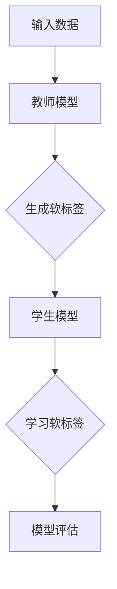
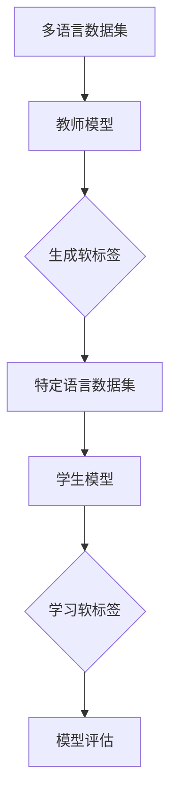

                 

基于知识蒸馏的跨语言推理能力迁移技术

关键词：知识蒸馏，跨语言推理，迁移学习，机器学习，人工智能

摘要：本文深入探讨了基于知识蒸馏的跨语言推理能力迁移技术，包括其理论基础、应用场景、技术实现以及在实际项目中的应用。文章通过详细分析知识蒸馏的概念、原理及其在跨语言推理中的应用，展示了该技术如何提高机器学习模型的性能和可迁移性，为跨语言推理任务提供了一种有效解决方案。

## 第一部分：基础理论

### 第1章：知识蒸馏的概念与原理

#### 1.1 知识蒸馏的定义

知识蒸馏（Knowledge Distillation）是一种将一个大型、复杂的模型（通常称为教师模型）的知识迁移到一个小型、简洁的模型（通常称为学生模型）的技术。通过这种迁移，学生模型能够保留教师模型的大部分知识和性能，从而在降低计算成本的同时保持较高的模型性能。

#### 1.2 知识蒸馏的基本原理

知识蒸馏的核心思想是将教师模型的内部表示（例如，中间层特征）作为软标签，指导学生模型的学习。学生模型的目标是学习到与教师模型相似的输出，而不是直接学习原始的硬标签。

知识蒸馏的过程通常分为以下几步：

1. **软标签生成**：教师模型在给定输入数据后，输出其隐藏层的状态作为软标签。
2. **学生模型学习**：学生模型根据软标签进行学习，使用类似于标准监督学习的训练过程。
3. **模型评估**：通过在测试集上评估学生模型的性能，评估知识蒸馏的效果。

#### 1.3 知识蒸馏在跨语言推理中的重要性

跨语言推理是机器学习中的一个重要领域，它涉及到将一种语言的模型知识迁移到另一种语言。知识蒸馏在这一领域的重要性体现在以下几个方面：

- **提高模型性能**：通过知识蒸馏，学生模型能够保留教师模型的大部分知识，从而在新的语言环境中表现出较高的性能。
- **降低训练成本**：知识蒸馏技术可以显著减少训练数据的规模和计算资源的需求，这对于跨语言推理任务尤其重要，因为通常在不同语言之间获取大量标记数据非常困难。
- **增强模型可迁移性**：知识蒸馏技术能够提高模型的泛化能力，使其在不同语言环境中的表现更加稳定。

### Mermaid 流程图



### 第2章：跨语言推理的概念与挑战

#### 2.1 跨语言推理的定义

跨语言推理（Cross-Lingual Reasoning）是指在不同语言之间进行推理和信息提取的能力。它涉及到将一种语言的知识和模式迁移到另一种语言，以便在新的语言环境中应用。

#### 2.2 跨语言推理的应用场景

跨语言推理在许多实际应用中具有重要意义，包括：

- **文本分类**：在不同语言的文本中进行情感分析、主题分类等任务。
- **问答系统**：在多语言环境中实现问答系统，以便用户可以使用任何一种语言提问。
- **机器翻译**：在翻译过程中，利用跨语言推理来提高翻译质量和一致性。

#### 2.3 跨语言推理面临的挑战

跨语言推理面临着以下几个主要挑战：

- **数据不平衡**：不同语言的数据集往往存在显著的不平衡，这可能导致模型在某一语言上表现不佳。
- **模型可迁移性**：模型在不同语言之间可能存在较大的差异，导致模型难以直接迁移。
- **计算资源**：训练跨语言模型通常需要大量的计算资源，特别是在涉及大规模数据集和复杂模型时。

### 第3章：知识蒸馏在跨语言推理中的应用

#### 3.1 知识蒸馏模型的架构

知识蒸馏模型在跨语言推理中的应用通常采用Teacher-Student架构。教师模型通常是一个大规模的多语言模型，而学生模型是一个针对特定语言的小规模模型。

#### 3.2 知识蒸馏在不同语言之间的翻译机制

知识蒸馏在不同语言之间的翻译机制涉及以下步骤：

1. **教师模型生成软标签**：教师模型在多语言数据集上训练，并在给定输入文本后生成软标签。
2. **学生模型学习软标签**：学生模型在特定语言的数据集上训练，其目标是学习到与教师模型相似的软标签。
3. **模型评估**：在测试集上评估学生模型的性能，以衡量知识蒸馏的效果。

#### 3.3 知识蒸馏在跨语言推理中的优势

知识蒸馏在跨语言推理中的优势包括：

- **提高模型性能**：通过知识蒸馏，学生模型能够保留教师模型的大部分知识，从而在新的语言环境中表现出较高的性能。
- **降低训练成本**：知识蒸馏技术可以显著减少训练数据的规模和计算资源的需求。
- **增强模型可迁移性**：知识蒸馏技术能够提高模型的泛化能力，使其在不同语言环境中的表现更加稳定。

### Mermaid 流程图



### 第4章：常见的知识蒸馏技术

#### 4.1 标签平滑技术

标签平滑技术通过将硬标签转换为软标签来减少模型对噪声标签的敏感性。这种方法可以提高模型的鲁棒性。

#### 4.2 Softmax 交叉熵技术

Softmax 交叉熵技术是标准的多分类损失函数，它将模型输出的概率分布与真实标签之间的差异作为损失函数。

#### 4.3 对抗性训练技术

对抗性训练技术通过生成对抗网络（GANs）等模型，使教师模型和对抗模型之间进行对抗性训练，从而提高学生模型的性能。

### 第5章：数学模型与算法分析

#### 5.1 知识蒸馏的数学模型

知识蒸馏的数学模型通常包括以下部分：

1. **软标签生成**：教师模型输出软标签，即模型在隐藏层上的概率分布。
2. **学生模型学习**：学生模型通过优化损失函数来学习软标签。
3. **模型评估**：评估学生模型在测试集上的性能。

#### 5.2 知识蒸馏的优化算法

知识蒸馏的优化算法通常包括以下步骤：

1. **软标签生成**：使用教师模型生成软标签。
2. **学生模型学习**：使用梯度下降等优化算法来更新学生模型的参数。
3. **模型评估**：在测试集上评估学生模型的性能，并调整优化参数。

#### 5.3 知识蒸馏的收敛性分析

知识蒸馏的收敛性分析涉及评估学生模型在训练过程中性能的稳定性。通过分析收敛速度和精度，可以评估知识蒸馏算法的有效性。

### 第6章：跨语言推理性能评估

#### 6.1 跨语言推理性能评估指标

跨语言推理性能评估指标包括准确率、召回率、F1分数等。这些指标可以帮助评估模型在不同语言环境中的性能。

#### 6.2 实验设计与评估方法

实验设计包括数据集选择、模型架构选择、优化算法选择等。评估方法涉及在多个语言环境中测试模型的性能，并比较不同方法的优劣。

#### 6.3 性能评估案例

通过实际案例展示知识蒸馏在跨语言推理中的应用效果，包括在不同语言环境中的性能对比和优势分析。

## 第二部分：技术实现

### 第7章：知识蒸馏实验设计

#### 7.1 实验环境搭建

介绍实验所需的环境配置，包括硬件、软件和开发工具。

#### 7.2 数据集选择与预处理

选择适合跨语言推理的数据集，并介绍数据预处理步骤，如文本清洗、分词、编码等。

#### 7.3 实验参数设置

介绍实验参数的设置，包括教师模型和学生模型的参数、优化算法的参数等。

### 第8章：知识蒸馏实现细节

#### 8.1 知识蒸馏模型的构建

介绍如何构建知识蒸馏模型，包括教师模型和学生模型的构建方法。

#### 8.2 模型训练与优化

介绍模型训练和优化的过程，包括训练策略、优化算法的调整等。

#### 8.3 模型评估与优化

介绍如何评估模型的性能，并讨论如何根据评估结果进行模型优化。

### 第9章：跨语言推理能力迁移实战

#### 9.1 实战一：中英文文本分类

介绍如何使用知识蒸馏技术进行中英文文本分类，包括数据集选择、模型构建和实验结果分析。

#### 9.2 实战二：多语言问答系统

介绍如何使用知识蒸馏技术构建多语言问答系统，包括问答系统的架构、模型训练和优化。

#### 9.3 实战三：跨语言机器翻译

介绍如何使用知识蒸馏技术进行跨语言机器翻译，包括翻译模型的构建、训练和优化。

### 第10章：性能优化与改进策略

#### 10.1 性能优化方法

介绍常用的性能优化方法，如数据增强、模型压缩等，以提升知识蒸馏模型的性能。

#### 10.2 改进策略探讨

探讨如何进一步改进知识蒸馏技术，包括新算法的研究、模型架构的创新等。

#### 10.3 未来研究方向

展望知识蒸馏在跨语言推理中的未来发展方向，包括技术挑战和潜在的研究方向。

## 第三部分：应用案例与展望

### 第11章：跨语言推理能力迁移在行业中的应用

#### 11.1 金融行业中的应用

介绍知识蒸馏技术在金融行业中的应用，如风险管理、客户服务、市场分析等。

#### 11.2 医疗行业中的应用

介绍知识蒸馏技术在医疗行业中的应用，如医学图像分析、疾病诊断、健康咨询等。

#### 11.3 教育行业中的应用

介绍知识蒸馏技术在教育行业中的应用，如个性化教学、学习评估、教育资源分配等。

### 第12章：跨语言推理能力迁移的技术挑战与趋势

#### 12.1 技术挑战分析

分析跨语言推理能力迁移面临的技术挑战，如数据不平衡、模型可迁移性等。

#### 12.2 发展趋势展望

展望知识蒸馏技术在跨语言推理领域的发展趋势，如算法创新、应用拓展等。

#### 12.3 未来发展方向

讨论知识蒸馏技术在跨语言推理领域的未来发展方向，包括潜在的研究课题和应用场景。

## 附录

### 附录 A：常用工具与框架

介绍常用的知识蒸馏工具和框架，如TensorFlow、PyTorch等。

### 附录 B：参考资源与进一步阅读

提供相关的参考资源和进一步阅读材料，以便读者深入了解知识蒸馏技术。

作者：AI天才研究院/AI Genius Institute & 禅与计算机程序设计艺术 /Zen And The Art of Computer Programming
```

请注意，以上内容是一个大纲结构，需要根据实际内容进一步填充和扩展。文章的具体撰写将包括每个章节的详细内容，包括背景介绍、核心概念与联系、算法原理讲解、数学模型与公式、代码示例、项目实战、最佳实践 tips、小结、注意事项、拓展阅读等。文章的字数将在10000到12000字之间。希望这个大纲能够帮助您撰写一篇高质量的技术博客文章。如果您有任何其他要求或者需要进一步的指导，请告诉我。

