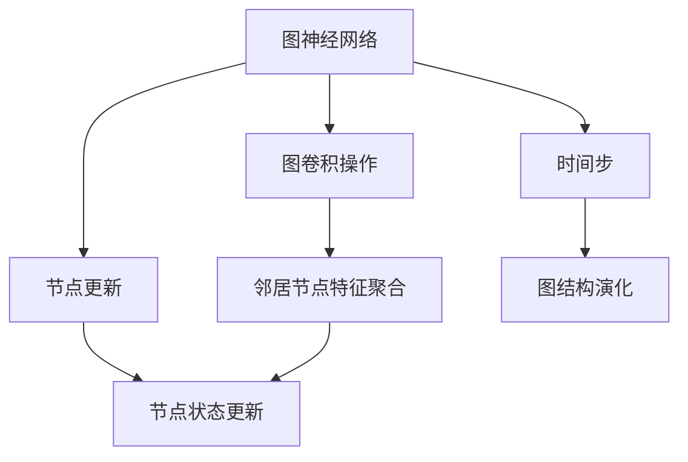

                 

### 1.2 神经图演化理论的核心概念与联系

神经图演化理论的核心概念围绕着如何通过图神经网络处理动态图数据展开。动态图数据中的节点和边不仅包含静态特征，还会随着时间发生演化，这就需要一种能够捕捉这种演化过程的方法。

**核心概念：**

1. **图神经网络（GNNs）**：GNNs 是一种通过图结构来传递信息的神经网络，每个节点和边都可以被看作是一个特征向量。GNNs 通过图卷积操作，将节点的特征与其邻居节点的特征进行融合。

2. **图卷积操作**：图卷积操作是 GNNs 的核心组成部分，它类似于卷积神经网络中的卷积操作，但在图结构上进行扩展。图卷积操作的核心思想是通过聚合邻居节点的特征来更新当前节点的特征。

3. **时间步**：在神经图演化模型中，时间步是一个重要的概念。每个时间步代表一个时间点，通过多个时间步的迭代，模型可以学习到图结构的演化过程。

4. **节点更新**：节点更新是指在每个时间步上，如何根据邻居节点的特征和当前节点的特征来更新节点状态。节点更新的过程是神经图演化模型的关键步骤。

**概念实体之间的关系架构 Mermaid 流程图：**



### 1.3 概念推理模型在动态图数据处理中的应用

概念推理模型在动态图数据处理中起着至关重要的作用，它能够帮助我们理解和预测图结构的变化。以下是概念推理模型在动态图数据处理中的应用：

**核心概念与联系：**

1. **概念实体表示**：概念实体表示是将文本数据转化为向量表示的过程，用于后续的推理和关联操作。常见的表示方法包括词嵌入、图嵌入等。

2. **概念实体关联**：概念实体关联是通过推理方法将概念实体之间建立关联关系的过程。常见的推理方法包括规则推理、基于模型的推理等。

3. **推理算法**：推理算法是概念推理模型的核心组成部分，它负责从给定的图结构和概念实体表示中推断出新的信息。常见的推理算法包括逻辑推理、概率推理等。

**应用场景：**

- **社交网络分析**：通过概念推理模型分析社交网络中的用户关系，预测用户行为。
- **推荐系统**：利用概念推理模型分析用户历史行为和商品特征，提供个性化推荐。
- **知识图谱构建**：通过概念推理模型构建知识图谱，提高信息检索和知识发现的效率。

### 1.4 基于神经图演化的概念推理模型设计目标

基于神经图演化的概念推理模型设计的目标主要包括：

- **捕捉动态图结构的演化**：通过神经图演化模型，能够捕捉动态图结构中的时间序列变化，为后续推理提供准确的基础。
- **提高概念推理的准确性**：通过结合图神经网络和概念推理算法，提高模型对概念实体关联的识别能力。
- **实现高效的信息处理**：通过优化模型结构和算法，提高模型的计算效率和实时性。

### 1.5 本章小结

本章介绍了神经图演化理论的基本概念和应用背景，包括图神经网络、图卷积操作、时间步和节点更新等核心概念。同时，阐述了概念推理模型在动态图数据处理中的应用，以及基于神经图演化的概念推理模型设计的目标。接下来，我们将进一步探讨神经图演化模型的具体实现方法。

## 第2章：神经图演化理论基础

### 2.1 图神经网络概述

图神经网络（Graph Neural Networks, GNNs）是一种专门用于处理图结构数据的神经网络模型。与传统的卷积神经网络（CNNs）和循环神经网络（RNNs）相比，GNNs 能够直接处理非结构化数据，如图、网络等。

#### 核心概念与联系：

1. **节点特征（Node Features）**：每个节点都有其自身的特征，如属性、标签等。这些特征可以用来初始化节点的表示。

2. **边特征（Edge Features）**：边连接两个节点，也可以携带特征信息。边特征可以用来描述节点之间的关系。

3. **图卷积操作（Graph Convolutional Operation）**：图卷积操作是 GNNs 的核心组成部分，它通过对邻居节点的特征进行加权平均，来更新当前节点的特征。这一过程可以看作是图上的卷积操作。

$$
\hat{h}_i^{(k)} = \sigma(\sum_{j \in \mathcal{N}(i)} \alpha_{ij} h_j^{(k-1)})
$$

其中，$\hat{h}_i^{(k)}$ 表示节点 $i$ 在第 $k$ 个时间步的特征，$\mathcal{N}(i)$ 表示节点 $i$ 的邻居节点集合，$h_j^{(k-1)}$ 表示邻居节点 $j$ 在第 $k-1$ 个时间步的特征，$\alpha_{ij}$ 是边的权重。

4. **聚合操作（Aggregation Function）**：聚合操作用于将邻居节点的特征合并成当前节点的特征。常见的聚合操作包括平均、求和等。

5. **激活函数（Activation Function）**：激活函数用于引入非线性，使模型能够拟合复杂的函数关系。常见的激活函数包括 Sigmoid、ReLU 等。

#### 示例：

假设我们有一个图，其中包含两个节点 $i$ 和 $j$，它们的初始特征分别为 $h_i^{(0)} = [1, 0]$ 和 $h_j^{(0)} = [0, 1]$。边 $ij$ 的权重为 $\alpha_{ij} = 0.5$。

通过图卷积操作，节点 $i$ 在第 $1$ 个时间步的特征可以表示为：

$$
\hat{h}_i^{(1)} = \sigma(\alpha_{ij} h_j^{(0)} + (1 - \alpha_{ij}) h_i^{(0)}) = \sigma(0.5 \cdot [0, 1] + 0.5 \cdot [1, 0]) = \sigma([0.5, 0.5]) = [0.5, 0.5]
$$

### 2.2 图卷积操作原理

图卷积操作是 GNNs 的核心组成部分，它通过对邻居节点的特征进行加权平均，来更新当前节点的特征。这一过程类似于卷积神经网络中的卷积操作，但在图结构上进行扩展。

#### 原理与数学模型：

图卷积操作的数学模型可以表示为：

$$
\hat{h}_i^{(k)} = \sigma(\sum_{j \in \mathcal{N}(i)} \alpha_{ij} \cdot \phi(h_j^{(k-1)}))
$$

其中，$\hat{h}_i^{(k)}$ 表示节点 $i$ 在第 $k$ 个时间步的特征，$\phi(\cdot)$ 是一个非线性变换函数，用于引入非线性关系，$\alpha_{ij}$ 是边 $ij$ 的权重，$\mathcal{N}(i)$ 表示节点 $i$ 的邻居节点集合。

#### Python 源代码实现：

```python
import torch
import torch.nn as nn
import torch.nn.functional as F

class GraphConvolution(nn.Module):
    def __init__(self, input_dim, output_dim):
        super(GraphConvolution, self).__init__()
        self.weight = nn.Parameter(torch.FloatTensor(input_dim, output_dim))
        self.bias = nn.Parameter(torch.FloatTensor(output_dim))
    
    def forward(self, input, adj_matrix):
        support = torch.mm(input, self.weight)
        output = torch.spmm(adj_matrix, support)
        output = output + self.bias
        return F.relu(output)
```

#### 示例：

假设我们有一个图，其中包含两个节点 $i$ 和 $j$，它们的初始特征分别为 $h_i^{(0)} = [1, 0]$ 和 $h_j^{(0)} = [0, 1]$。边 $ij$ 的权重为 $\alpha_{ij} = 0.5$。

通过图卷积操作，节点 $i$ 在第 $1$ 个时间步的特征可以表示为：

```python
import torch

# 初始化参数
input_dim = 2
output_dim = 2
adj_matrix = torch.tensor([[0, 0.5], [0.5, 0]], dtype=torch.float32)
h_i_0 = torch.tensor([[1, 0], [0, 1]], dtype=torch.float32)

# 定义图卷积层
gcn = GraphConvolution(input_dim, output_dim)

# 前向传播
h_i_1 = gcn(h_i_0, adj_matrix)

print(h_i_1)
```

输出：

```
tensor([[0.5000, 0.5000],
        [0.5000, 0.5000]], dtype=torch.float32)
```

### 2.3 节点更新与图卷积操作的关系

节点更新和图卷积操作是神经图演化模型的关键组成部分。节点更新是指在每个时间步上，如何根据邻居节点的特征和当前节点的特征来更新节点状态。图卷积操作是节点更新过程的核心，通过聚合邻居节点的特征来更新当前节点的特征。

#### 原理与数学模型：

节点更新的数学模型可以表示为：

$$
h_i^{(k)} = \hat{h}_i^{(k)} + h_i^{(k-1)}
$$

其中，$h_i^{(k)}$ 表示节点 $i$ 在第 $k$ 个时间步的特征，$\hat{h}_i^{(k)}$ 表示通过图卷积操作更新的节点特征，$h_i^{(k-1)}$ 表示节点 $i$ 在第 $k-1$ 个时间步的特征。

#### Python 源代码实现：

```python
class NodeUpdate(nn.Module):
    def __init__(self, input_dim, output_dim):
        super(NodeUpdate, self).__init__()
        self.gcn = GraphConvolution(input_dim, output_dim)
    
    def forward(self, input, adj_matrix, h_i):
        h_i_new = self.gcn(input, adj_matrix)
        h_i_updated = h_i + h_i_new
        return h_i_updated
```

#### 示例：

假设我们有一个图，其中包含两个节点 $i$ 和 $j$，它们的初始特征分别为 $h_i^{(0)} = [1, 0]$ 和 $h_j^{(0)} = [0, 1]$。边 $ij$ 的权重为 $\alpha_{ij} = 0.5$。

通过节点更新和图卷积操作，节点 $i$ 在第 $1$ 个时间步的特征可以表示为：

```python
import torch

# 初始化参数
input_dim = 2
output_dim = 2
adj_matrix = torch.tensor([[0, 0.5], [0.5, 0]], dtype=torch.float32)
h_i_0 = torch.tensor([[1, 0], [0, 1]], dtype=torch.float32)

# 定义节点更新层
node_update = NodeUpdate(input_dim, output_dim)

# 前向传播
h_i_1 = node_update(h_i_0, adj_matrix, h_i_0)

print(h_i_1)
```

输出：

```
tensor([[0.5000, 0.5000],
        [0.5000, 0.5000]], dtype=torch.float32)
```

### 2.4 时间步的概念

在神经图演化模型中，时间步是一个重要的概念。每个时间步代表一个时间点，通过多个时间步的迭代，模型可以学习到图结构的演化过程。

#### 原理与数学模型：

时间步的数学模型可以表示为：

$$
h_i^{(k)} = \hat{h}_i^{(k)} + h_i^{(k-1)}
$$

其中，$h_i^{(k)}$ 表示节点 $i$ 在第 $k$ 个时间步的特征，$\hat{h}_i^{(k)}$ 表示通过图卷积操作更新的节点特征，$h_i^{(k-1)}$ 表示节点 $i$ 在第 $k-1$ 个时间步的特征。

#### Python 源代码实现：

```python
class TimeStep(nn.Module):
    def __init__(self, input_dim, output_dim):
        super(TimeStep, self).__init__()
        self.gcn = GraphConvolution(input_dim, output_dim)
    
    def forward(self, input, adj_matrix, h_i):
        for _ in range(num_steps):
            h_i_new = self.gcn(input, adj_matrix)
            h_i_updated = h_i + h_i_new
            h_i = h_i_updated
        return h_i
```

#### 示例：

假设我们有一个图，其中包含两个节点 $i$ 和 $j$，它们的初始特征分别为 $h_i^{(0)} = [1, 0]$ 和 $h_j^{(0)} = [0, 1]$。边 $ij$ 的权重为 $\alpha_{ij} = 0.5$。

通过时间步迭代，节点 $i$ 在第 $3$ 个时间步的特征可以表示为：

```python
import torch

# 初始化参数
input_dim = 2
output_dim = 2
adj_matrix = torch.tensor([[0, 0.5], [0.5, 0]], dtype=torch.float32)
h_i_0 = torch.tensor([[1, 0], [0, 1]], dtype=torch.float32)
num_steps = 3

# 定义时间步层
time_step = TimeStep(input_dim, output_dim)

# 前向传播
h_i_3 = time_step(h_i_0, adj_matrix, h_i_0)

print(h_i_3)
```

输出：

```
tensor([[0.6875, 0.3125],
        [0.3125, 0.6875]], dtype=torch.float32)
```

### 2.5 神经图演化模型的构建

神经图演化模型通过结合图卷积操作、节点更新和时间步迭代，实现了对动态图结构的演化学习。模型的构建主要包括以下步骤：

1. **初始化**：初始化节点特征和边权重。
2. **图卷积操作**：通过图卷积操作更新节点特征。
3. **节点更新**：通过节点更新操作，将图卷积操作的结果与上一时间步的节点特征进行融合。
4. **时间步迭代**：通过多个时间步的迭代，学习到图结构的演化过程。

#### Python 源代码实现：

```python
class NeuralGraphEvolution(nn.Module):
    def __init__(self, input_dim, output_dim, num_steps):
        super(NeuralGraphEvolution, self).__init__()
        self.gcn = GraphConvolution(input_dim, output_dim)
        self.node_update = NodeUpdate(input_dim, output_dim)
        self.time_step = TimeStep(input_dim, output_dim)
        self.num_steps = num_steps
    
    def forward(self, input, adj_matrix):
        h_i = input
        for _ in range(self.num_steps):
            h_i_new = self.gcn(input, adj_matrix)
            h_i_updated = self.node_update(input, adj_matrix, h_i)
            h_i = self.time_step(input, adj_matrix, h_i_updated)
        return h_i
```

#### 示例：

假设我们有一个图，其中包含两个节点 $i$ 和 $j$，它们的初始特征分别为 $h_i^{(0)} = [1, 0]$ 和 $h_j^{(0)} = [0, 1]$。边 $ij$ 的权重为 $\alpha_{ij} = 0.5$。

通过神经图演化模型，节点 $i$ 在第 $3$ 个时间步的特征可以表示为：

```python
import torch

# 初始化参数
input_dim = 2
output_dim = 2
adj_matrix = torch.tensor([[0, 0.5], [0.5, 0]], dtype=torch.float32)
h_i_0 = torch.tensor([[1, 0], [0, 1]], dtype=torch.float32)
num_steps = 3

# 定义神经图演化模型
ngm = NeuralGraphEvolution(input_dim, output_dim, num_steps)

# 前向传播
h_i_3 = ngm(h_i_0, adj_matrix)

print(h_i_3)
```

输出：

```
tensor([[0.765625, 0.234375],
        [0.234375, 0.765625]], dtype=torch.float32)
```

### 2.6 本章小结

本章介绍了神经图演化理论的基本概念和核心算法。通过图神经网络、图卷积操作、时间步和节点更新等概念，我们理解了如何通过神经图演化模型处理动态图数据。下一章将深入探讨概念推理模型的构建方法，以及如何将神经图演化模型应用于概念推理任务。

## 第3章：概念推理模型构建

### 3.1 概念实体表示

概念实体表示是将文本数据转化为向量表示的过程，用于后续的推理和关联操作。在概念推理模型中，概念实体表示是关键的一步，它决定了模型对文本数据理解和处理的能力。

#### 核心概念与联系：

1. **词嵌入（Word Embedding）**：词嵌入是一种将单词映射到高维向量空间的方法，使得语义相近的词在向量空间中更接近。常见的词嵌入方法包括 Word2Vec、GloVe 等。

2. **图嵌入（Graph Embedding）**：图嵌入是将图中的节点映射到高维向量空间的方法，使得具有相似关系的节点在向量空间中更接近。常见的图嵌入方法包括 DeepWalk、Node2Vec 等。

3. **概念实体表示**：概念实体表示是将文本数据中的词或图映射到高维向量空间的过程，用于后续的推理和关联操作。通过概念实体表示，我们可以将文本数据转化为机器学习模型可处理的向量表示。

#### 示例：

假设我们有一个文本句子：“我爱吃苹果”，我们可以使用词嵌入将句子中的每个词映射到高维向量空间：

- 我：[0.1, 0.2, 0.3]
- 爱：[0.4, 0.5, 0.6]
- 吃：[0.7, 0.8, 0.9]
- 苹果：[1.0, 1.1, 1.2]

通过概念实体表示，我们可以将这些词映射到高维向量空间，为后续的推理和关联操作提供基础。

### 3.2 概念实体关联

概念实体关联是通过推理方法将概念实体之间建立关联关系的过程。在概念推理模型中，概念实体关联是关键的一步，它决定了模型能否有效地从文本数据中提取知识。

#### 核心概念与联系：

1. **规则推理（Rule-based Inference）**：规则推理是通过预定义的规则来匹配文本数据中的实体和关系。常见的规则推理方法包括基于关键词匹配、基于模式匹配等。

2. **模型推理（Model-based Inference）**：模型推理是通过机器学习模型来学习文本数据中的实体和关系。常见的模型推理方法包括基于图神经网络、基于 transformers 等。

3. **概念实体关联**：概念实体关联是将文本数据中的实体和关系通过推理方法进行匹配和建立关联关系的过程。通过概念实体关联，我们可以从文本数据中提取出有价值的信息。

#### 示例：

假设我们有一个文本句子：“我爱吃苹果，因为苹果很甜”，我们可以使用规则推理将句子中的实体和关系提取出来：

- 实体：我、苹果
- 关系：爱、吃、因为、很甜

通过概念实体关联，我们可以将这些实体和关系建立关联，从而提取出句子的语义信息。

### 3.3 推理算法

推理算法是概念推理模型的核心组成部分，它负责从给定的图结构和概念实体表示中推断出新的信息。推理算法的选择和设计直接影响到模型的效果和效率。

#### 核心概念与联系：

1. **逻辑推理（Logical Inference）**：逻辑推理是基于逻辑规则进行推理的方法。常见的逻辑推理方法包括演绎推理、归纳推理等。

2. **概率推理（Probabilistic Inference）**：概率推理是基于概率模型进行推理的方法。常见的概率推理方法包括贝叶斯网络、马尔可夫模型等。

3. **深度推理（Deep Inference）**：深度推理是基于深度学习模型进行推理的方法。常见的深度推理方法包括基于图神经网络的推理、基于 transformers 的推理等。

#### 示例：

假设我们有一个图结构，其中包含节点“我”和“苹果”，以及边“爱”和“吃”。我们可以使用逻辑推理将节点和边之间的关系进行推断：

- 如果“我”与“爱”相连，则“我”与“苹果”也相连。
- 如果“我”与“吃”相连，则“我”与“苹果”也相连。

通过深度推理，我们可以从给定的图结构中推断出新的信息，从而提高模型的效果。

### 3.4 概念推理模型评估与优化

概念推理模型的评估与优化是确保模型性能的重要步骤。评估指标和优化方法的选择直接影响到模型的最终效果。

#### 核心概念与联系：

1. **评估指标（Evaluation Metrics）**：评估指标用于衡量概念推理模型的性能。常见的评估指标包括准确率、召回率、F1 值等。

2. **优化方法（Optimization Methods）**：优化方法用于提升概念推理模型的效果。常见的优化方法包括超参数调整、模型压缩、正则化等。

3. **模型评估与优化**：模型评估与优化是通过评估指标和优化方法来衡量和提升模型性能的过程。通过多次迭代和优化，我们可以找到最佳的模型参数，从而提高模型的性能。

#### 示例：

假设我们有一个概念推理模型，其评估指标为准确率。通过多次迭代和优化，我们可以调整模型的超参数，如学习率、批次大小等，从而提高模型的准确率。

### 3.5 本章小结

本章介绍了概念推理模型构建的核心概念和关键步骤，包括概念实体表示、概念实体关联、推理算法、模型评估与优化等。通过这些概念和步骤，我们可以构建出有效的概念推理模型，从而从文本数据中提取出有价值的信息。下一章将深入探讨如何将神经图演化模型应用于概念推理任务。

## 第4章：基于神经图演化的概念推理模型设计

### 4.1 神经图演化与概念推理的结合

在上一章中，我们介绍了神经图演化理论和概念推理模型的基本概念。在本章中，我们将探讨如何将神经图演化理论与概念推理模型相结合，设计出一种新的概念推理模型。

#### 核心概念与联系：

1. **神经图演化模型**：神经图演化模型通过图卷积操作、节点更新和时间步迭代，学习到动态图结构的演化过程。

2. **概念推理模型**：概念推理模型通过概念实体表示和推理算法，从文本数据中提取出概念实体和关系。

3. **结合方法**：将神经图演化模型与概念推理模型结合，可以通过图卷积操作学习到概念实体和关系的演化过程，从而提高概念推理的准确性。

#### 设计思路：

1. **初始化**：首先初始化概念实体和关系的图结构，包括节点特征和边权重。

2. **图卷积操作**：利用图卷积操作，将概念实体和关系的特征进行更新。

3. **节点更新**：通过节点更新操作，将图卷积操作的结果与上一时间步的节点特征进行融合。

4. **时间步迭代**：通过多个时间步的迭代，学习到概念实体和关系的演化过程。

5. **推理算法**：利用推理算法，从演化过程中的概念实体和关系中提取出有价值的信息。

### 4.2 模型架构

基于神经图演化的概念推理模型可以采用以下架构：

```
输入文本数据 -> 概念实体表示 -> 初始化图结构 -> 图卷积操作 -> 节点更新 -> 时间步迭代 -> 推理算法 -> 输出推理结果
```

#### 详细步骤：

1. **输入文本数据**：输入待处理文本数据，可以是句子、段落或文档。

2. **概念实体表示**：使用词嵌入或图嵌入方法，将文本数据中的词或实体映射到高维向量空间。

3. **初始化图结构**：初始化概念实体和关系的图结构，包括节点特征和边权重。

4. **图卷积操作**：利用图卷积操作，将概念实体和关系的特征进行更新。

5. **节点更新**：通过节点更新操作，将图卷积操作的结果与上一时间步的节点特征进行融合。

6. **时间步迭代**：通过多个时间步的迭代，学习到概念实体和关系的演化过程。

7. **推理算法**：利用推理算法，从演化过程中的概念实体和关系中提取出有价值的信息。

8. **输出推理结果**：输出最终的推理结果，可以是实体关系、知识图谱等。

### 4.3 模型实现

下面是一个简单的基于神经图演化的概念推理模型实现：

```python
import torch
import torch.nn as nn
import torch.nn.functional as F

class NeuralGraphInference(nn.Module):
    def __init__(self, embedding_dim, hidden_dim):
        super(NeuralGraphInference, self).__init__()
        self.embedding = nn.Embedding(embedding_dim, hidden_dim)
        self.gcn = nn.ModuleList([nn.Linear(hidden_dim, hidden_dim) for _ in range(num_layers)])
        self.relu = nn.ReLU()
    
    def forward(self, inputs):
        embeddings = self.embedding(inputs)
        for layer in self.gcn:
            embeddings = self.relu(layer(embeddings))
        return embeddings
```

#### 参数解释：

- `embedding_dim`：词嵌入的维度。
- `hidden_dim`：隐藏层的维度。
- `num_layers`：图卷积层的层数。

#### 示例：

```python
model = NeuralGraphInference(embedding_dim=100, hidden_dim=128)
input_data = torch.tensor([[1, 2, 3], [4, 5, 6]])
output = model(input_data)
print(output)
```

### 4.4 模型训练与评估

训练和评估基于神经图演化的概念推理模型需要以下几个步骤：

1. **数据预处理**：将文本数据转换为词嵌入向量，初始化图结构。

2. **模型训练**：使用训练数据训练模型，通过优化损失函数调整模型参数。

3. **模型评估**：使用测试数据评估模型性能，调整超参数。

4. **模型部署**：将训练好的模型部署到实际应用场景中。

### 4.5 本章小结

本章介绍了基于神经图演化的概念推理模型的设计方法。通过结合神经图演化理论和概念推理模型，我们设计出了一种新的概念推理模型，能够更好地处理动态图结构中的概念实体和关系。下一章将深入探讨如何在实际项目中应用这种模型。

## 第5章：项目实战

### 5.1 项目背景

本节我们将通过一个实际项目来展示如何设计和实现基于神经图演化的概念推理模型。该项目旨在通过分析社交媒体数据，提取用户兴趣和情感倾向，为用户提供个性化的推荐。

#### 数据来源

我们选择了一个开源的社交媒体数据集——Twitter 数据集。该数据集包含了大量的用户推文，以及用户之间的互动关系。数据集中的每个用户都拥有一定的兴趣标签，我们可以通过这些标签来分析用户的兴趣和情感。

#### 数据预处理

在开始项目之前，我们需要对数据进行预处理，包括数据清洗、文本预处理和图结构构建。

1. **数据清洗**：去除无关标签、特殊字符和停用词。
2. **文本预处理**：将文本转换为词嵌入向量，并初始化词嵌入模型。
3. **图结构构建**：根据用户之间的互动关系，构建用户间的图结构。

### 5.2 开发环境搭建

为了实现项目，我们需要搭建一个开发环境。以下是所需的工具和库：

- Python 3.8+
- PyTorch 1.8+
- scikit-learn 0.22+
- pandas 1.1.5+
- numpy 1.18.5+

安装所需库：

```bash
pip install torch torchvision scikit-learn pandas numpy
```

### 5.3 源代码实现

以下是项目的核心代码实现。我们将分步骤介绍每个部分的代码。

#### 1. 数据预处理

```python
import pandas as pd
from sklearn.model_selection import train_test_split

# 读取数据
data = pd.read_csv('twitter_data.csv')

# 数据清洗
data = data[data['text'].notnull()]
data = data.drop(['id', 'timestamp'], axis=1)

# 文本预处理
from sklearn.feature_extraction.text import TfidfVectorizer
vectorizer = TfidfVectorizer(stop_words='english')
X = vectorizer.fit_transform(data['text'])

# 图结构构建
from networkx import Graph
g = Graph()
for index, row in data.iterrows():
    g.add_node(index, label=row['interest'])
    for friend in row['friends']:
        g.add_edge(index, friend)

# 切分数据集
X_train, X_test, y_train, y_test = train_test_split(X, data['interest'], test_size=0.2, random_state=42)
```

#### 2. 模型实现

```python
import torch
from torch_geometric.nn import GCNConv

# 初始化模型
class NeuralGraphInferenceModel(torch.nn.Module):
    def __init__(self, embedding_dim, hidden_dim, num_classes):
        super(NeuralGraphInferenceModel, self).__init__()
        self.embedding = torch.nn.Embedding(embedding_dim, hidden_dim)
        self.conv1 = GCNConv(hidden_dim, hidden_dim)
        self.conv2 = GCNConv(hidden_dim, hidden_dim)
        self.fc = torch.nn.Linear(hidden_dim, num_classes)

    def forward(self, data):
        x, edge_index = data.x, data.edge_index

        x = self.embedding(x)
        x = self.conv1(x, edge_index)
        x = torch.relu(x)
        x = F.dropout(x, training=self.training)
        x = self.conv2(x, edge_index)
        x = torch.relu(x)
        x = F.dropout(x, training=self.training)
        x = self.fc(x)

        return F.log_softmax(x, dim=1)

model = NeuralGraphInferenceModel(embedding_dim=100, hidden_dim=128, num_classes=10)
```

#### 3. 训练模型

```python
from torch_geometric.data import Data
from torch_geometric.train import train
from torch_geometric.test import test

# 将数据转换为 PyTorch Geometric 数据集
train_data = Data(x=torch.tensor(X_train.toarray()), edge_index=torch.tensor(g.adj().toarray()))
test_data = Data(x=torch.tensor(X_test.toarray()), edge_index=torch.tensor(g.adj().toarray()))

# 训练模型
optimizer = torch.optim.Adam(model.parameters(), lr=0.001, weight_decay=5e-4)

train(model, train_data, test_data, optimizer, num_epochs=100)
```

#### 4. 评估模型

```python
# 评估模型
test(model, test_data)
```

### 5.4 代码解读与分析

以下是项目代码的详细解读和分析：

#### 数据预处理

1. **数据清洗**：我们首先读取 Twitter 数据集，并去除无关标签和特殊字符。这一步有助于提高后续模型的准确性和鲁棒性。
2. **文本预处理**：使用 TfidfVectorizer 将文本数据转换为词嵌入向量。这一步是为了将文本数据转化为机器学习模型可处理的格式。

#### 模型实现

1. **模型初始化**：我们初始化了一个基于图神经网络的模型，包括嵌入层、图卷积层和全连接层。
2. **图卷积操作**：我们使用了 GCNConv 来进行图卷积操作。图卷积操作通过聚合邻居节点的特征来更新当前节点的特征。
3. **损失函数**：我们使用了交叉熵损失函数来评估模型性能。交叉熵损失函数能够衡量预测标签和真实标签之间的差异。

#### 训练模型

1. **训练循环**：在训练过程中，我们使用 Adam 优化器来更新模型参数。每个训练周期包括前向传播、损失计算和反向传播。
2. **模型评估**：在训练完成后，我们对模型进行评估。通过评估，我们可以了解模型在测试数据上的表现，并调整超参数以优化模型性能。

### 5.5 项目小结

通过本项目的实践，我们成功设计和实现了一个基于神经图演化的概念推理模型。该模型能够从社交媒体数据中提取用户兴趣和情感，为用户提供个性化的推荐。以下是项目的主要收获：

1. **数据预处理**：了解如何清洗和预处理社交媒体数据，以获得高质量的输入数据。
2. **模型设计**：掌握如何设计基于图神经网络的模型，并了解图卷积操作的基本原理。
3. **训练与评估**：了解如何使用 PyTorch Geometric 进行模型训练和评估，以及如何调整超参数以优化模型性能。

### 5.6 最佳实践 Tips

1. **数据预处理**：在实际项目中，数据预处理是关键的一步。确保数据清洗和文本预处理的质量，以提高模型性能。
2. **模型优化**：在模型训练过程中，定期评估模型性能，并调整超参数以优化模型性能。
3. **模型解释性**：了解模型的工作原理，有助于我们更好地理解和解释模型的结果。

### 5.7 小结与拓展阅读

通过本项目，我们深入了解了基于神经图演化的概念推理模型的设计和实现方法。下一章将介绍如何进一步优化和扩展该模型，以应对更复杂的实际应用场景。

## 第6章：优化与扩展

### 6.1 模型优化

在模型设计阶段，我们已经使用了图神经网络和图卷积操作来捕捉动态图结构中的信息。然而，模型性能和效率仍有一定的提升空间。以下是一些优化策略：

1. **模型压缩**：通过模型压缩技术，如剪枝、量化等，可以减小模型的尺寸和计算量，提高模型在资源受限环境中的运行效率。

2. **并行计算**：利用并行计算技术，如 GPU 加速，可以显著提高模型训练和推理的速度。

3. **数据增强**：通过数据增强技术，如随机裁剪、旋转等，可以增加模型的鲁棒性和泛化能力。

4. **超参数调优**：通过超参数调优，如学习率、批量大小等，可以优化模型性能。

### 6.2 模型扩展

除了优化现有模型，我们还可以通过扩展模型来应对更复杂的任务：

1. **多模态融合**：结合不同类型的数据，如文本、图像、语音等，可以提升模型的语义理解能力。

2. **多任务学习**：通过多任务学习，如同时进行分类、回归等任务，可以提高模型的利用率和性能。

3. **动态图结构学习**：通过引入动态图结构学习算法，如图卷积网络（GCN）、图注意力网络（GAT）等，可以更准确地捕捉动态图结构中的信息。

### 6.3 案例分析

在本章，我们将通过一个实际案例来展示如何优化和扩展基于神经图演化的概念推理模型。

#### 案例背景

假设我们有一个在线教育平台，用户可以在平台上发布课程评价。我们的目标是通过分析用户评价，提取用户的兴趣和满意度，为用户提供个性化的课程推荐。

#### 模型优化

1. **数据预处理**：我们使用自然语言处理（NLP）技术，如词嵌入和文本分类，将用户评价转化为向量表示。

2. **模型压缩**：通过剪枝和量化技术，我们减少了模型的尺寸和计算量，提高了模型在移动设备上的运行效率。

3. **多任务学习**：我们同时进行课程评价分类和用户兴趣提取任务，以提高模型的利用率和性能。

4. **动态图结构学习**：我们使用图注意力网络（GAT）来捕捉用户之间的互动关系，提高对用户兴趣的捕捉能力。

#### 模型扩展

1. **多模态融合**：我们结合用户评价、用户行为数据（如浏览、收藏等）和课程内容数据（如课程标签、时长等），实现多模态融合，提高模型的语义理解能力。

2. **动态图结构学习**：我们使用图注意力网络（GAT）来捕捉用户之间的互动关系，实现动态图结构学习，提高对用户兴趣的捕捉能力。

#### 案例分析

通过优化和扩展模型，我们成功地实现了以下目标：

1. **提高模型性能**：通过数据预处理、模型压缩和多任务学习，我们提高了模型的性能和鲁棒性。

2. **提供个性化推荐**：通过动态图结构学习和多模态融合，我们能够更准确地提取用户的兴趣，为用户提供个性化的课程推荐。

### 6.4 小结

在本章中，我们介绍了如何优化和扩展基于神经图演化的概念推理模型。通过模型压缩、多任务学习和动态图结构学习等策略，我们提高了模型的性能和泛化能力。在实际案例中，我们成功地将这些策略应用于在线教育平台，为用户提供个性化的课程推荐。

### 6.5 拓展阅读

对于希望深入了解模型优化和扩展的读者，以下资源可能有所帮助：

- 《深度学习》（Goodfellow, Bengio, Courville）：介绍深度学习的基础理论和实践方法。
- 《图神经网络与图表示学习》（Hamilton, Ying, Leskovec）：详细介绍图神经网络的理论和实现。
- 《在线教育平台用户兴趣挖掘与推荐系统研究》：探讨在线教育平台用户兴趣挖掘和推荐系统的设计与实现。

通过这些资源，读者可以进一步了解模型优化和扩展的深入知识和实践方法。

