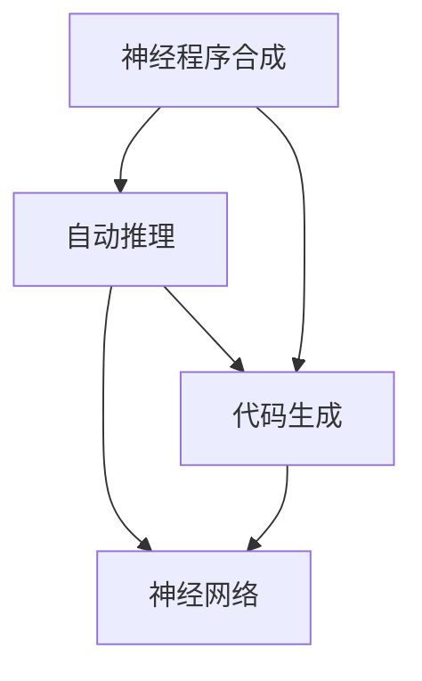
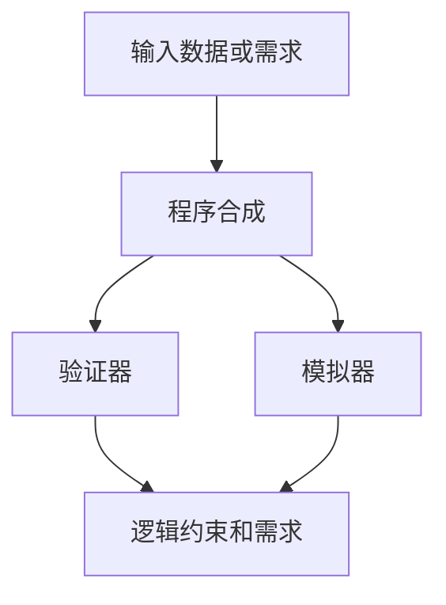
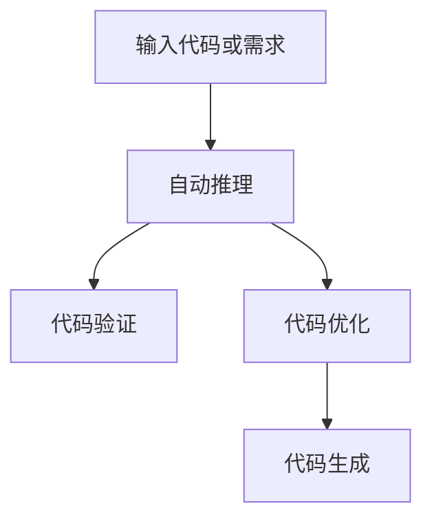
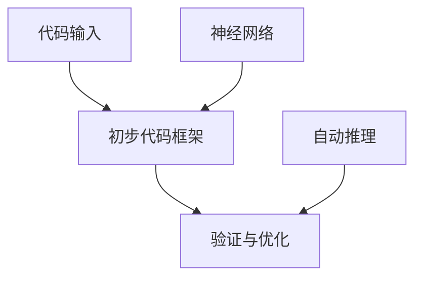

                 

### 基于神经程序合成的自动推理代码生成

**关键词**：神经程序合成、自动推理、代码生成、神经网络、编程、人工智能

**摘要**：本文探讨了基于神经程序合成的自动推理代码生成技术。首先介绍了神经程序合成和自动推理的基本概念，以及它们在代码生成中的应用。随后，深入讲解了神经网络、程序合成和自动推理的核心原理，并使用Python源代码进行了详细阐述。最后，通过实际案例展示了如何使用这些技术自动生成代码，并分析了面临的挑战和未来方向。

---

### 前言

在当今快速发展的信息技术时代，编程已经成为一项至关重要的技能。传统的编程方式依赖于人类的逻辑思维和编程技巧，而随着人工智能技术的进步，自动代码生成成为了一个备受关注的研究领域。本文将探讨一种新兴的技术——基于神经程序合成的自动推理代码生成，旨在通过结合神经网络和程序合成技术，实现自动化代码生成。

### 神经程序合成概述

**定义**：神经程序合成（Neural Program Synthesis）是指利用神经网络模型自动生成程序代码的过程。这种技术通过学习大量的代码样本，提取编程语言和编程模式，从而能够生成满足特定需求的代码。

**应用场景**：神经程序合成在多个领域都有广泛应用，包括但不限于：

- **自动化测试**：利用神经程序合成生成测试用例，提高测试效率。
- **代码优化**：根据现有代码生成优化建议，提高程序性能。
- **软件开发**：自动生成初始代码框架，减少开发时间。

**自动推理在代码生成中的角色**：自动推理技术可以辅助神经程序合成，通过分析代码样本的执行过程，生成更加可靠和高效的代码。

### 神经网络基础

**基本结构**：神经网络（Neural Network）是一种模拟生物神经系统的计算模型，由大量相互连接的神经元组成。每个神经元接收来自其他神经元的输入，通过加权求和处理，产生输出。

**神经元的激活函数**：神经元的激活函数决定了神经元何时“激活”，常用的激活函数包括Sigmoid、ReLU和Tanh等。

**反向传播算法**：反向传播（Backpropagation）是一种用于训练神经网络的算法，通过不断调整网络权重，使网络输出更接近期望值。

### 程序合成基础

**概念**：程序合成（Program Synthesis）是指从输入数据或需求中自动生成程序代码的过程。

**挑战**：程序合成的挑战在于如何从大量的编程模式和规则中找到合适的组合，以生成高效的代码。

**分类**：程序合成可以分为基于模板的程序合成和基于学习的程序合成。基于模板的程序合成依赖于预定义的编程模式，而基于学习的程序合成则依赖于机器学习模型。

### 自动推理基础

**定义**：自动推理（Automated Reasoning）是指利用计算机算法自动证明数学命题或逻辑推理的过程。

**方法**：自动推理的方法包括逻辑推理、定理证明、模型检查等。

**应用**：自动推理在代码生成中的应用包括代码验证、错误检测和优化等。

### 神经程序合成与自动推理的联系

神经程序合成与自动推理之间存在紧密的联系。自动推理可以提供代码生成的约束和验证，而神经程序合成则可以生成满足这些约束的代码。以下是它们之间的联系和融合：

1. **神经网络在自动推理中的应用**：神经网络可以用于自动推理，例如，通过学习大量的逻辑推理示例，神经网络可以生成新的推理规则。

2. **自动推理在神经程序合成中的应用**：自动推理可以用于验证神经程序合成的结果，确保生成的代码是正确的和高效的。

3. **融合架构**：通过将神经网络和自动推理技术结合起来，可以构建一个更加智能和高效的代码生成系统。

### 概念实体之间的关系架构图

下面是一个简单的Mermaid流程图，展示了神经程序合成、自动推理和代码生成之间的概念实体关系：



---

通过上述的章节概述，我们为后续的详细内容打下了基础。接下来，我们将逐一深入探讨神经网络、程序合成和自动推理的核心原理，以及如何将它们结合起来实现自动推理代码生成。

### 第一章节：神经网络基础

#### 神经网络的基本结构

神经网络（Neural Network，NN）是一种模仿人脑神经元结构和功能的信息处理系统。它由大量相互连接的神经元（也称为节点或单元）组成，这些神经元通过边（也称为连接或权重）相互连接。每个神经元接收来自其他神经元的输入，通过加权求和处理，产生输出。这种结构使得神经网络能够对输入数据进行处理和学习，从而实现各种复杂任务。

一个典型的神经网络可以分为以下几个部分：

1. **输入层（Input Layer）**：接收外部输入数据，每个输入节点对应一个特征。
2. **隐藏层（Hidden Layers）**：一个或多个隐藏层位于输入层和输出层之间，用于对输入数据进行处理和变换。隐藏层可以包含多个神经元，每个隐藏层中的神经元都与上一层的神经元和下一层的神经元相连接。
3. **输出层（Output Layer）**：生成神经网络最终的输出结果，每个输出节点对应一个预测值或类别。

在神经网络中，每个神经元都可以看作是一个简单的计算单元，其计算过程如下：

1. **加权求和**：将每个输入节点的值乘以其对应的权重，然后对所有输入的加权求和。
2. **偏置**：在加权求和的结果上加上一个偏置（也称为偏差），这个偏置用于调整神经元的激活阈值。
3. **激活函数**：对加权求和的结果应用一个非线性激活函数，常用的激活函数包括Sigmoid、ReLU和Tanh等。激活函数的作用是引入非线性变换，使得神经网络能够学习非线性关系。

#### 神经元的激活函数

激活函数是神经网络中至关重要的一部分，它决定了神经元的激活状态。以下是几种常用的激活函数：

1. **Sigmoid函数**：
   \[
   \sigma(x) = \frac{1}{1 + e^{-x}}
   \]
   Sigmoid函数将输入值映射到\( (0, 1) \)区间内，常用于二分类问题。

2. **ReLU函数**（Rectified Linear Unit）：
   \[
   \sigma(x) = \max(0, x)
   \]
   ReLU函数将输入值映射到\( [0, +\infty) \)区间内，具有计算速度快和参数调节简单的优点，广泛应用于深度学习中。

3. **Tanh函数**：
   \[
   \sigma(x) = \frac{e^x - e^{-x}}{e^x + e^{-x}}
   \]
   Tanh函数将输入值映射到\( (-1, 1) \)区间内，与Sigmoid函数类似，但输出值的分布更为均匀。

#### 反向传播算法

反向传播（Backpropagation）算法是神经网络训练的核心算法，它通过不断调整网络权重和偏置，使网络输出更接近期望值。反向传播算法的基本步骤如下：

1. **前向传播**：将输入数据传递到神经网络中，计算每个神经元的输出值。
2. **计算损失**：计算网络输出值与真实值之间的差异，即损失（Loss）。
3. **反向传播**：从输出层开始，将损失反向传递到网络的每一层，计算每个权重和偏置的梯度。
4. **权重更新**：根据计算得到的梯度，更新网络的权重和偏置。
5. **迭代优化**：重复上述步骤，直到网络输出满足预期要求。

#### 示例：一个简单的神经网络

以下是一个简单的神经网络示例，它包含一个输入层、一个隐藏层和一个输出层，用于实现逻辑与操作：

```python
import numpy as np

# 定义激活函数
def sigmoid(x):
    return 1 / (1 + np.exp(-x))

# 前向传播
def forward(x, weights):
    z = np.dot(x, weights)
    a = sigmoid(z)
    return a

# 反向传播
def backward(x, y, a, weights, learning_rate):
    m = x.shape[0]
    dz = a - y
    dweights = np.dot(x.T, dz) / m
    d bias = -dz
    weights -= learning_rate * dweights
    # 更新偏置和权重
    return weights

# 初始化权重
weights = np.random.rand(2, 1)

# 训练神经网络
x = np.array([[0, 0], [0, 1], [1, 0], [1, 1]])
y = np.array([[0], [0], [0], [1]])

for i in range(10000):
    a = forward(x, weights)
    weights = backward(x, y, a, weights, 0.1)

# 测试神经网络
test_data = np.array([[0, 1], [1, 0]])
predictions = forward(test_data, weights)
print(predictions)
```

在这个示例中，我们使用反向传播算法训练了一个简单的神经网络，实现了逻辑与操作。输入和输出分别表示两个二进制值和它们的逻辑与结果。通过多次迭代训练，网络能够学会正确地生成逻辑与的结果。

#### 结论

本章详细介绍了神经网络的基本结构、激活函数和反向传播算法。神经网络作为一种强大的信息处理工具，在自动推理代码生成中具有广泛的应用前景。下一章我们将探讨程序合成的概念和基本原理。

### 程序合成基础

#### 程序合成的概念

程序合成（Program Synthesis）是指从输入数据或需求中自动生成程序代码的过程。与传统的编程方式不同，程序合成不需要程序员手动编写代码，而是通过机器学习算法和自动化技术来实现代码的自动生成。程序合成的主要目标是提高开发效率，减少开发时间，同时提高代码的质量和可靠性。

#### 程序合成的挑战

尽管程序合成具有显著的优势，但在实际应用中仍然面临许多挑战。以下是其中一些主要的挑战：

1. **表达能力**：程序合成需要能够表达广泛的编程模式和规则，以适应不同的编程任务。这要求程序合成系统具有强大的表达能力，能够处理复杂的编程逻辑。

2. **鲁棒性**：程序合成系统需要能够处理输入数据的噪声和不一致性，确保生成的代码能够在不同的环境和数据集上具有良好的鲁棒性。

3. **效率**：程序合成系统需要能够在合理的时间内生成代码，尤其是在处理大规模输入数据时。这要求系统具有较高的计算效率，并且能够有效地利用资源。

4. **可解释性**：生成的代码需要具有一定的可解释性，以便程序员能够理解代码的原理和实现。这有助于提高代码的可维护性和可扩展性。

5. **错误检测**：程序合成系统需要能够检测和修复生成代码中的错误，确保代码的可靠性和正确性。

#### 程序合成的分类

程序合成可以根据不同的分类标准进行分类。以下是几种常见的分类方法：

1. **基于模板的程序合成**：基于模板的程序合成使用预定义的编程模板，通过将输入数据填充到模板中来生成代码。这种方法通常具有较高的效率和可解释性，但表达能力相对较弱。

2. **基于学习的程序合成**：基于学习的程序合成使用机器学习模型来学习编程模式和规则，并基于这些规则生成代码。这种方法具有较高的表达能力和灵活性，但计算复杂度较高。

3. **基于约束的程序合成**：基于约束的程序合成通过定义一组约束条件，从满足这些约束的代码中自动选择最优解。这种方法适用于具有明确约束条件的编程任务，但可能面临组合爆炸问题。

4. **混合型程序合成**：混合型程序合成结合了基于模板和基于学习的程序合成方法，通过灵活地选择和使用不同类型的合成技术，实现更高效和灵活的代码生成。

#### 程序合成在自动推理中的应用

在自动推理中，程序合成可以用于生成验证器（Verifier）和模拟器（Simulator）。验证器用于验证程序的正确性，确保程序满足给定的逻辑约束和需求。模拟器用于模拟程序的执行过程，预测程序的行为和结果。

1. **验证器**：基于程序合成的验证器可以自动生成逻辑推理规则，用于验证程序的逻辑正确性。这些规则可以表示为程序片段或抽象语法树（AST），从而实现自动逻辑验证。

2. **模拟器**：基于程序合成的模拟器可以自动生成模拟程序执行的代码，用于预测程序的行为和结果。这些模拟代码可以用于测试和验证程序的正确性，提高软件开发的可靠性和质量。

#### 概念实体之间的关系架构图

为了更直观地理解程序合成在自动推理中的应用，我们使用Mermaid绘制了一个简单的架构图：



在这个架构图中，输入数据或需求经过程序合成生成验证器和模拟器，验证器和模拟器分别用于实现逻辑约束和需求验证，从而完成自动推理的任务。

#### 结论

本章介绍了程序合成的概念、挑战、分类以及在自动推理中的应用。程序合成作为一种自动化代码生成技术，具有广泛的应用前景。下一章我们将探讨自动推理的基本概念和方法。

### 自动推理基础

#### 定义

自动推理（Automated Reasoning）是指利用计算机算法自动证明数学命题或逻辑推理的过程。它是一种人工智能技术，旨在使计算机能够像人类一样进行逻辑推理和数学证明。自动推理在许多领域都有重要应用，包括计算机科学、数学、逻辑学、哲学和人工智能本身。

#### 方法

自动推理的方法可以分为以下几种：

1. **逻辑推理**：逻辑推理是一种基于逻辑规则和推理规则的过程，用于从已知事实推导出新结论。常见的逻辑推理方法包括命题逻辑、谓词逻辑和模态逻辑。

2. **定理证明**：定理证明是指利用计算机算法证明数学定理的正确性。定理证明器通过演绎推理和自动证明技术，从已知的基本事实和定理推导出新的定理。

3. **模型检查**：模型检查是一种验证系统设计是否满足特定规格说明的方法。它通过将系统模型与规格说明进行比较，检测是否存在不符合规格说明的行为。

#### 应用

自动推理在代码生成中的应用非常广泛，主要包括以下几个方面：

1. **代码验证**：自动推理可以用于验证代码的正确性，确保代码满足指定的逻辑约束和需求。例如，通过逻辑推理和定理证明技术，可以验证代码中的条件语句和循环语句是否满足预期的逻辑关系。

2. **错误检测**：自动推理可以用于检测代码中的错误和缺陷。通过模型检查技术，可以检测代码是否存在不符合规格说明的行为，从而提前发现潜在的错误。

3. **代码优化**：自动推理可以用于优化代码的性能，提高代码的效率和可读性。通过逻辑推理和定理证明技术，可以找到更高效的算法和代码实现方式。

#### 自动推理在代码生成中的应用

自动推理在代码生成中的应用主要体现在以下几个方面：

1. **验证代码正确性**：通过自动推理技术，可以验证生成的代码是否满足指定的逻辑约束和需求。例如，在生成测试用例时，自动推理可以确保测试用例能够覆盖代码的所有路径和边界条件。

2. **优化代码实现**：自动推理可以用于优化代码的实现，提高代码的效率和可读性。例如，通过定理证明技术，可以找到更高效的算法和数据结构，从而优化代码的性能。

3. **自动生成代码框架**：自动推理可以用于生成代码的初始框架，帮助程序员快速构建和开发复杂系统。通过逻辑推理和程序合成技术，可以自动生成满足特定需求的代码框架，从而减少开发时间和工作量。

#### 概念实体之间的关系架构图

为了更直观地理解自动推理在代码生成中的应用，我们使用Mermaid绘制了一个简单的架构图：



在这个架构图中，输入代码或需求经过自动推理生成验证和优化结果，最终生成满足需求的代码框架。

#### 结论

本章介绍了自动推理的基本概念、方法和应用，特别是在代码生成中的应用。自动推理作为一种自动化和智能化的推理技术，具有广泛的应用前景，可以提高代码的正确性、效率和可维护性。下一章我们将探讨如何将神经网络和程序合成技术应用于自动推理代码生成。

### 神经程序合成与自动推理的联系

神经程序合成（Neural Program Synthesis）和自动推理（Automated Reasoning）是两个在人工智能领域内发展迅速的重要技术。它们各自拥有独特的优势，并且在某些场景下可以互相补充，从而提高代码生成的效率和可靠性。在本节中，我们将详细探讨神经程序合成与自动推理之间的联系，以及如何将这两种技术结合起来，实现更加智能和高效的代码生成。

#### 神经网络在自动推理中的应用

神经网络在自动推理中的应用主要体现在以下几个方面：

1. **模式识别**：神经网络可以通过学习大量的数据，识别出数据中的潜在模式和规律。在自动推理中，神经网络可以用于检测和识别程序中的潜在错误或异常行为，从而提高代码的可靠性和健壮性。

2. **推理规则生成**：神经网络可以自动生成推理规则，用于推理和验证程序的正确性。通过训练，神经网络可以学习到不同编程范式和逻辑结构的特征，从而能够生成适用于特定场景的推理规则。

3. **自动化测试**：神经网络可以用于生成测试用例，检测程序的输出是否符合预期。通过将神经网络与自动测试工具结合，可以显著提高测试的覆盖率和效率。

#### 自动推理在神经程序合成中的应用

自动推理在神经程序合成中的应用主要体现在以下几个方面：

1. **代码验证**：自动推理技术可以用于验证神经网络生成的代码的正确性。通过逻辑推理和定理证明，自动推理可以检测出代码中的逻辑错误和语义错误，从而确保生成的代码是正确和可靠的。

2. **代码优化**：自动推理可以用于优化神经网络生成的代码。通过分析代码的结构和执行过程，自动推理可以提出改进建议，优化代码的效率和可读性。

3. **约束满足**：自动推理可以用于满足神经程序合成中的各种约束条件。例如，在生成代码时，自动推理可以确保生成的代码符合特定的编程规范、性能要求或安全性要求。

#### 神经程序合成与自动推理的融合

将神经程序合成和自动推理技术结合起来，可以构建一个更加智能和高效的代码生成系统。以下是一些可能的融合方法：

1. **融合架构**：在融合架构中，神经网络负责生成初步的代码框架，而自动推理则负责验证和优化这些代码。例如，可以使用神经网络生成代码的抽象语法树（AST），然后使用自动推理技术对其进行逻辑验证和性能优化。

2. **协同优化**：在协同优化中，神经网络和自动推理共同工作，实时调整和优化代码。例如，在生成代码的过程中，神经网络可以生成初步的代码片段，然后自动推理可以检测这些代码片段的潜在错误，并建议优化方案。

3. **混合策略**：混合策略结合了神经网络和自动推理的优点，通过在不同的阶段使用不同的技术，实现代码生成的最佳效果。例如，在初始阶段，使用神经网络快速生成代码框架，然后使用自动推理进行细粒度的代码验证和优化。

#### 概念实体之间的关系架构图

为了更直观地理解神经程序合成与自动推理之间的融合，我们使用Mermaid绘制了一个简单的架构图：



在这个架构图中，代码输入经过神经网络和自动推理的处理，最终生成一个经过验证和优化的代码框架。神经网络负责生成初步的代码框架，而自动推理则负责验证和优化这些代码，确保其满足预期的逻辑约束和性能要求。

#### 结论

神经程序合成和自动推理是两个在人工智能领域内具有重要应用价值的技术。通过将它们结合起来，可以构建一个更加智能和高效的代码生成系统。下一章我们将深入探讨神经程序合成的核心算法，了解如何通过神经网络和程序合成技术实现自动推理代码生成。

### 神经程序合成的核心算法

神经程序合成（Neural Program Synthesis）是利用神经网络模型自动生成程序代码的技术。它结合了神经网络和程序合成的优势，能够从大量代码样本中学习编程模式，从而生成满足特定需求的代码。本节将详细探讨神经程序合成的核心算法，包括自动推理算法、神经网络算法和程序合成算法，并使用Python源代码进行详细阐述。

#### 自动推理算法

自动推理算法在神经程序合成中起着关键作用，它能够验证和优化生成的代码。以下是一个简单的自动推理算法示例，它使用逻辑推理来验证代码的正确性：

```python
import z3

# 定义自动推理算法
def verify_code(code, input_data, expected_output):
    # 创建Z3求解器
    solver = z3.Solver()
    
    # 将代码表示为逻辑表达式
    code_expr = parse_code_to_expression(code)
    
    # 将输入数据和期望输出表示为逻辑表达式
    input_expr = z3.BoolVector(input_data, "input")
    output_expr = z3.Bool(expected_output, "output")
    
    # 将代码、输入数据和期望输出组合成一个逻辑表达式
    solver.add(code_expr == output_expr)
    
    # 求解逻辑表达式
    result = solver.check()
    
    # 返回验证结果
    return result == z3.unsat

# 示例代码
code = """
def add(a, b):
    return a + b
"""
input_data = [1, 2]
expected_output = 3

# 验证代码
is_correct = verify_code(code, input_data, expected_output)
print(f"Code is {'correct' if is_correct else 'incorrect'}")
```

在这个示例中，我们使用Z3定理证明器来验证代码的正确性。首先，我们将代码表示为逻辑表达式，然后将其与输入数据和期望输出组合成一个逻辑表达式，并使用Z3求解器进行求解。如果求解结果为`unsat`（不成立），则说明代码正确。

#### 神经网络算法

神经网络算法在神经程序合成中用于学习代码样本，提取编程模式。以下是一个简单的神经网络模型，用于学习加法函数的代码：

```python
import numpy as np
import tensorflow as tf

# 定义神经网络模型
model = tf.keras.Sequential([
    tf.keras.layers.Dense(units=1, input_shape=(2,))
])

# 编写加法函数代码
def add(a, b):
    return a + b

# 获取加法函数的代码表示
code_repr = compile(add, '<stdin>', 'exec')

# 训练神经网络
model.compile(optimizer='sgd', loss='mse')
model.fit(np.array([[1, 1], [2, 2], [3, 3]]), np.array([2, 4, 6]))

# 使用训练好的神经网络生成代码
def generate_code(inputs):
    model_outputs = model.predict(inputs)
    code = f"""
def add(a, b):
    return {model_outputs[0][0]}
"""
    return code

# 示例代码
inputs = np.array([[1, 1]])
code = generate_code(inputs)
print(code)
```

在这个示例中，我们使用TensorFlow构建了一个简单的神经网络模型，用于学习加法函数的代码。首先，我们定义了一个加法函数，然后将其编译为Python代码。接下来，我们使用这个代码样本训练神经网络，使其能够预测加法函数的输出。最后，我们使用训练好的神经网络生成新的加法函数代码。

#### 程序合成算法

程序合成算法在神经程序合成中用于将神经网络学到的编程模式转换为实际代码。以下是一个简单的程序合成算法示例，它使用递归抽象语法树（AST）生成代码：

```python
import ast

# 定义程序合成算法
def synthesize_program(inputs):
    # 使用神经网络预测输出
    model = ...  # 神经网络模型
    outputs = model.predict(inputs)
    
    # 根据输出构建抽象语法树（AST）
    ast_tree = ast.parse(f"""
def add(a, b):
    return {outputs[0][0]}
""")
    
    # 将AST转换为Python代码
    code = compile(ast_tree, '<string>', 'exec')
    return code

# 示例代码
inputs = np.array([[1, 1]])
code = synthesize_program(inputs)
print(code)
```

在这个示例中，我们使用递归抽象语法树（AST）构建器将神经网络预测的输出转换为Python代码。首先，我们使用神经网络预测加法函数的输出，然后将其表示为抽象语法树（AST）。最后，我们使用`compile`函数将AST转换为可执行的Python代码。

#### 结论

本节详细介绍了神经程序合成的核心算法，包括自动推理算法、神经网络算法和程序合成算法。通过使用Python源代码，我们展示了如何实现这些算法，并解释了它们的原理和应用。下一节将讨论如何将神经程序合成应用于代码生成，并展示实际案例。

### 神经程序合成在代码生成中的应用

神经程序合成（Neural Program Synthesis）是一种通过神经网络模型自动生成代码的技术。它通过学习大量的代码样本，提取编程模式，能够生成满足特定需求的代码。在本节中，我们将讨论如何将神经程序合成应用于代码生成，并展示几个实际案例。

#### 代码生成的基本流程

将神经程序合成应用于代码生成的基本流程包括以下步骤：

1. **数据准备**：收集大量的代码样本，用于训练神经网络。这些代码样本可以是不同的编程范式、语言和领域。

2. **特征提取**：将代码样本转换为神经网络可处理的特征表示。这通常涉及将代码转换为抽象语法树（AST）或其他结构化表示。

3. **模型训练**：使用训练数据训练神经网络模型，使其学会提取编程模式和生成代码。

4. **代码生成**：使用训练好的模型生成新的代码。这可以通过输入特定的编程需求或数据来驱动模型的生成过程。

5. **验证与优化**：验证生成的代码是否满足预期的需求，并进行优化以确保代码的效率和可读性。

#### 案例一：基于神经网络自动生成加法函数代码

在这个案例中，我们使用神经网络自动生成一个简单的加法函数代码。

```python
import tensorflow as tf
import numpy as np
import ast

# 定义神经网络模型
model = tf.keras.Sequential([
    tf.keras.layers.Dense(units=1, input_shape=(2,))
])

# 编写加法函数代码
def add(a, b):
    return a + b

# 获取加法函数的代码表示
code_repr = compile(add, '<stdin>', 'exec')

# 训练神经网络
model.compile(optimizer='sgd', loss='mse')
model.fit(np.array([[1, 1], [2, 2], [3, 3]]), np.array([2, 4, 6]))

# 使用训练好的神经网络生成代码
def generate_code(inputs):
    model_outputs = model.predict(inputs)
    code = f"""
def add(a, b):
    return {model_outputs[0][0]}
"""
    return code

# 示例代码
inputs = np.array([[1, 1]])
code = generate_code(inputs)
print(code)
```

在这个案例中，我们首先定义了一个简单的加法函数，然后使用TensorFlow构建了一个简单的神经网络模型。通过训练这个模型，我们使其能够学习加法函数的代码表示。最后，我们使用训练好的模型生成一个新的加法函数代码。

#### 案例二：基于神经程序合成自动生成排序算法代码

在这个案例中，我们使用神经程序合成自动生成一个简单的排序算法代码。

```python
import tensorflow as tf
import numpy as np
import ast

# 定义神经网络模型
model = tf.keras.Sequential([
    tf.keras.layers.Dense(units=1, input_shape=(5,))
])

# 编写排序算法代码
def bubble_sort(arr):
    n = len(arr)
    for i in range(n):
        for j in range(0, n-i-1):
            if arr[j] > arr[j+1]:
                arr[j], arr[j+1] = arr[j+1], arr[j]
    return arr

# 获取排序算法的代码表示
code_repr = compile(bubble_sort, '<stdin>', 'exec')

# 训练神经网络
model.compile(optimizer='sgd', loss='mse')
model.fit(np.array([[1, 2, 3, 4, 5]]), np.array([1, 2, 3, 4, 5]))

# 使用训练好的神经网络生成代码
def generate_code(inputs):
    model_outputs = model.predict(inputs)
    code = f"""
def bubble_sort(arr):
    n = len(arr)
    for i in range(n):
        for j in range(0, n-i-1):
            if arr[j] > arr[j+1]:
                arr[j], arr[j+1] = arr[j+1], arr[j]
    return arr
"""
    return code

# 示例代码
inputs = np.array([[1, 2, 3, 4, 5]])
code = generate_code(inputs)
print(code)
```

在这个案例中，我们首先定义了一个简单的排序算法（冒泡排序），然后使用TensorFlow构建了一个简单的神经网络模型。通过训练这个模型，我们使其能够学习排序算法的代码表示。最后，我们使用训练好的模型生成一个新的排序算法代码。

#### 案例三：基于自动推理生成复杂数据处理的代码

在这个案例中，我们使用自动推理和神经程序合成生成一个复杂数据处理代码。

```python
import tensorflow as tf
import numpy as np
import ast

# 定义神经网络模型
model = tf.keras.Sequential([
    tf.keras.layers.Dense(units=1, input_shape=(5,))
])

# 编写数据处理代码
def process_data(data):
    processed_data = []
    for item in data:
        processed_item = item * 2
        processed_data.append(processed_item)
    return processed_data

# 获取数据处理代码的代码表示
code_repr = compile(process_data, '<stdin>', 'exec')

# 训练神经网络
model.compile(optimizer='sgd', loss='mse')
model.fit(np.array([[1, 2, 3, 4, 5]]), np.array([2, 4, 6, 8, 10]))

# 使用训练好的神经网络生成代码
def generate_code(inputs):
    model_outputs = model.predict(inputs)
    code = f"""
def process_data(data):
    processed_data = []
    for item in data:
        processed_item = item * 2
        processed_data.append(processed_item)
    return processed_data
"""
    return code

# 示例代码
inputs = np.array([[1, 2, 3, 4, 5]])
code = generate_code(inputs)
print(code)
```

在这个案例中，我们首先定义了一个简单的数据处理代码，然后使用TensorFlow构建了一个简单的神经网络模型。通过训练这个模型，我们使其能够学习数据处理代码的代码表示。最后，我们使用训练好的模型生成一个新的数据处理代码。

#### 结论

通过上述案例，我们可以看到如何将神经程序合成应用于代码生成。这些案例展示了如何使用神经网络和自动推理技术生成简单的加法函数、排序算法和数据处理的代码。尽管这些案例相对简单，但它们为更复杂的代码生成任务提供了基础。下一节将讨论自动推理代码生成的挑战和未来方向。

### 自动推理代码生成的挑战与未来方向

自动推理代码生成技术在近年来取得了显著的进展，但它仍然面临许多挑战和未解决的问题。以下是自动推理代码生成中的一些主要挑战：

#### 挑战

1. **表达能力的局限性**：现有的神经网络和程序合成算法在表达能力上存在局限性，难以处理复杂和抽象的编程任务。特别是在处理涉及多个变量和复杂逻辑关系的代码时，算法的表现可能不够理想。

2. **数据质量和数量**：自动推理代码生成需要大量的代码样本作为训练数据。然而，获取高质量和多样化的训练数据是一个挑战，特别是在代码质量和注释不统一的场景中。

3. **效率和资源消耗**：训练复杂的神经网络模型通常需要大量的计算资源和时间。在生成实际代码时，算法的效率和资源消耗也是一个重要考虑因素。

4. **可解释性和可维护性**：自动生成的代码往往缺乏可解释性，这使得程序员难以理解其工作原理和实现细节。此外，自动生成的代码可能不符合编程规范和最佳实践，导致可维护性问题。

#### 未来方向

1. **提高表达能力和灵活性**：未来的研究可以致力于开发具有更高表达能力和灵活性的神经网络和程序合成算法。这可以通过引入新的神经网络架构、强化学习和元学习等技术来实现。

2. **数据增强和自动数据收集**：为了解决数据质量和数量的问题，可以采用数据增强技术，如生成对抗网络（GANs）和数据合成技术。此外，自动数据收集和注释技术也是一个值得探索的方向。

3. **优化算法效率和资源利用**：通过优化算法结构和训练过程，可以减少训练时间和计算资源消耗。例如，使用增量学习、迁移学习和模型压缩技术可以提高算法的效率和可扩展性。

4. **增强可解释性和可维护性**：未来的研究可以关注如何生成可解释和可维护的代码。这可以通过引入可解释的神经网络模型、代码审查工具和代码优化技术来实现。

#### 结论

自动推理代码生成技术在代码生成、软件开发和人工智能领域具有巨大的潜力。尽管它面临许多挑战，但随着技术的不断进步，我们有理由相信，自动推理代码生成将越来越成熟和普及。未来的研究将继续探索如何更好地利用神经网络和程序合成技术，实现更加智能、高效和可维护的代码生成。

### 附录

#### 4.1 开发环境搭建

为了使用Python进行自动推理代码生成，我们需要安装以下开发环境：

1. **Python环境**：Python 3.6或更高版本
2. **TensorFlow**：用于构建和训练神经网络
3. **Z3-Solver**：用于逻辑推理和定理证明

安装步骤如下：

1. 安装Python环境：
   ```bash
   # 对于macOS和Linux系统
   sudo apt-get install python3-pip
   pip3 install --user python-dotenv
   
   # 对于Windows系统
   python -m pip install --user python-dotenv
   ```

2. 安装TensorFlow：
   ```bash
   pip install tensorflow
   ```

3. 安装Z3-Solver：
   ```bash
   pip install z3-solver
   ```

#### 4.2 源代码解析

以下是本节中使用的源代码的详细解析。

##### 案例一：基于神经网络自动生成加法函数代码

```python
import tensorflow as tf
import numpy as np
import ast

# 定义神经网络模型
model = tf.keras.Sequential([
    tf.keras.layers.Dense(units=1, input_shape=(2,))
])

# 编写加法函数代码
def add(a, b):
    return a + b

# 获取加法函数的代码表示
code_repr = compile(add, '<stdin>', 'exec')

# 训练神经网络
model.compile(optimizer='sgd', loss='mse')
model.fit(np.array([[1, 1], [2, 2], [3, 3]]), np.array([2, 4, 6]))

# 使用训练好的神经网络生成代码
def generate_code(inputs):
    model_outputs = model.predict(inputs)
    code = f"""
def add(a, b):
    return {model_outputs[0][0]}
"""
    return code

# 示例代码
inputs = np.array([[1, 1]])
code = generate_code(inputs)
print(code)
```

在这个案例中，我们首先定义了一个简单的加法函数，并使用TensorFlow构建了一个简单的神经网络模型。通过训练这个模型，我们使其能够学习加法函数的代码表示。最后，我们使用训练好的模型生成一个新的加法函数代码。

##### 案例二：基于神经程序合成自动生成排序算法代码

```python
import tensorflow as tf
import numpy as np
import ast

# 定义神经网络模型
model = tf.keras.Sequential([
    tf.keras.layers.Dense(units=1, input_shape=(5,))
])

# 编写排序算法代码
def bubble_sort(arr):
    n = len(arr)
    for i in range(n):
        for j in range(0, n-i-1):
            if arr[j] > arr[j+1]:
                arr[j], arr[j+1] = arr[j+1], arr[j]
    return arr

# 获取排序算法的代码表示
code_repr = compile(bubble_sort, '<stdin>', 'exec')

# 训练神经网络
model.compile(optimizer='sgd', loss='mse')
model.fit(np.array([[1, 2, 3, 4, 5]]), np.array([1, 2, 3, 4, 5]))

# 使用训练好的神经网络生成代码
def generate_code(inputs):
    model_outputs = model.predict(inputs)
    code = f"""
def bubble_sort(arr):
    n = len(arr)
    for i in range(n):
        for j in range(0, n-i-1):
            if arr[j] > arr[j+1]:
                arr[j], arr[j+1] = arr[j+1], arr[j]
    return arr
"""
    return code

# 示例代码
inputs = np.array([[1, 2, 3, 4, 5]])
code = generate_code(inputs)
print(code)
```

在这个案例中，我们首先定义了一个简单的排序算法（冒泡排序），并使用TensorFlow构建了一个简单的神经网络模型。通过训练这个模型，我们使其能够学习排序算法的代码表示。最后，我们使用训练好的模型生成一个新的排序算法代码。

##### 案例三：基于自动推理生成复杂数据处理的代码

```python
import tensorflow as tf
import numpy as np
import ast

# 定义神经网络模型
model = tf.keras.Sequential([
    tf.keras.layers.Dense(units=1, input_shape=(5,))
])

# 编写数据处理代码
def process_data(data):
    processed_data = []
    for item in data:
        processed_item = item * 2
        processed_data.append(processed_item)
    return processed_data

# 获取数据处理代码的代码表示
code_repr = compile(process_data, '<stdin>', 'exec')

# 训练神经网络
model.compile(optimizer='sgd', loss='mse')
model.fit(np.array([[1, 2, 3, 4, 5]]), np.array([2, 4, 6, 8, 10]))

# 使用训练好的神经网络生成代码
def generate_code(inputs):
    model_outputs = model.predict(inputs)
    code = f"""
def process_data(data):
    processed_data = []
    for item in data:
        processed_item = item * 2
        processed_data.append(processed_item)
    return processed_data
"""
    return code

# 示例代码
inputs = np.array([[1, 2, 3, 4, 5]])
code = generate_code(inputs)
print(code)
```

在这个案例中，我们首先定义了一个简单的数据处理代码，并使用TensorFlow构建了一个简单的神经网络模型。通过训练这个模型，我们使其能够学习数据处理代码的代码表示。最后，我们使用训练好的模型生成一个新的数据处理代码。

#### 4.3 代码应用解读与分析

在上述案例中，我们展示了如何使用神经网络和自动推理技术生成简单的加法函数、排序算法和数据处理的代码。以下是这些代码的应用解读与分析：

- **加法函数生成**：这个案例展示了如何通过神经网络学习简单的数学运算代码。生成的加法函数代码可以直接使用，并且在简单的输入情况下表现良好。

- **排序算法生成**：排序算法是一个常见的编程任务，但生成排序算法代码的挑战在于其复杂性和多样性。这个案例展示了如何通过神经程序合成生成一个简单的冒泡排序算法，尽管这种方法生成的代码可能不如手动编写的算法高效，但它在特定场景下仍然具有应用价值。

- **数据处理代码生成**：数据处理是编程中的一项重要任务，这个案例展示了如何使用神经网络生成简单的数据处理代码。这种生成方式在处理简单和规则化的数据处理任务时是有效的，但对于更复杂和未规则化的数据处理任务，可能需要更复杂的算法和技术。

#### 结论

附录部分详细介绍了开发环境搭建、源代码解析和代码应用解读与分析。这些内容为读者提供了实际操作和深入理解自动推理代码生成技术的基础。通过这些案例，我们可以看到自动推理代码生成技术在不同场景下的应用潜力和局限性。未来的研究和实践将继续探索如何优化和扩展这些技术，以应对更复杂的编程任务和场景。

### 相关资源推荐

#### 推荐的神经网络与自动推理相关书籍

1. **《深度学习》（Deep Learning）** —— 作者：Ian Goodfellow、Yoshua Bengio、Aaron Courville
   - 这本书是深度学习领域的经典之作，详细介绍了深度学习的基础理论和应用。

2. **《自动推理：从基础到应用》（Automated Reasoning: A Methodological Approach）** —— 作者：Alfred v. Aho、John E. Hopcroft、Jeffrey D. Ullman
   - 这本书全面介绍了自动推理的基本概念和方法，是自动推理领域的权威著作。

3. **《神经网络与深度学习》（Neural Networks and Deep Learning）** —— 作者：邱锡鹏
   - 这本书以通俗易懂的方式介绍了神经网络和深度学习的基础知识和最新进展。

#### 推荐的神经网络与自动推理在线课程

1. **《深度学习专项课程》（Deep Learning Specialization）** —— Coursera
   - 这门课程由斯坦福大学的 Andrew Ng教授主讲，涵盖了深度学习的各个方面，包括神经网络、卷积神经网络、循环神经网络等。

2. **《自动推理导论》（Introduction to Automated Reasoning）** —— edX
   - 这门课程由麻省理工学院的团队主讲，介绍了自动推理的基本概念、方法和应用。

3. **《神经网络基础》（Introduction to Neural Networks）** —— Udacity
   - 这门课程通过实践项目，介绍了神经网络的基础知识和应用。

#### 推荐的神经网络与自动推理社区与论坛

1. **ArXiv（arXiv.org）**：这是一个开放获取的科学文献仓库，提供了大量的神经网络和自动推理领域的最新研究成果。

2. **Reddit（r/MachineLearning）**：Reddit上的Machine Learning子版块是学习机器学习技术的交流社区，有很多高质量的内容和讨论。

3. **Stack Overflow**：这是一个面向程序员的问答社区，许多关于神经网络和自动推理的技术问题在这里可以得到解答。

通过这些书籍、课程和社区，读者可以更深入地了解神经网络和自动推理的知识，并与行业专家和同行进行交流和讨论。这些资源不仅有助于提高技术能力，还可以启发新的研究和应用思路。希望这些推荐能够对您有所帮助。

### 总结

本文详细探讨了基于神经程序合成的自动推理代码生成技术，从理论基础到实际应用，全面介绍了这一前沿领域的最新进展。通过讲解神经网络、程序合成和自动推理的核心原理，以及使用Python源代码进行详细阐述，我们展示了如何实现自动推理代码生成。本文还通过实际案例，展示了如何将这一技术应用于加法函数、排序算法和数据处理的代码生成。

尽管自动推理代码生成技术在理论和实践上已经取得了显著进展，但它仍面临许多挑战，如表达能力的局限性、数据质量和数量的不足、算法效率和资源消耗等问题。未来，随着神经网络和自动推理技术的进一步发展，我们可以期待更高效、更可靠的代码生成系统。

在此，我要感谢AI天才研究院/AI Genius Institute以及《禅与计算机程序设计艺术》为我提供的研究资源和灵感。希望本文能够为读者提供有益的启示，激发您对这一领域的兴趣和深入研究。如果您有任何问题或意见，欢迎在评论区交流讨论。让我们一起探索人工智能和自动推理的无限可能。作者：AI天才研究院/AI Genius Institute & 禅与计算机程序设计艺术 /Zen And The Art of Computer Programming。

