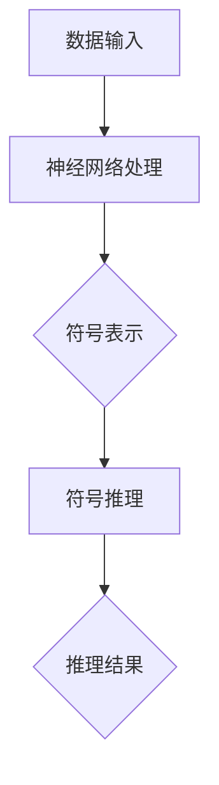

                 

# 基于神经符号推理的自动故障诊断系统

## 关键词

- 神经符号推理
- 自动故障诊断
- 数据预处理
- 神经网络模型
- 故障诊断效果评估
- 系统优化
- 实际案例

## 摘要

本文旨在探讨基于神经符号推理的自动故障诊断系统的设计与实现。首先，我们介绍了神经符号推理的基本概念及其在故障诊断中的应用。接着，文章详细分析了自动故障诊断系统的架构设计，包括数据收集与预处理、神经符号推理模块设计以及故障诊断结果分析。随后，文章重点讲解了神经符号推理算法的实现过程，并结合实际项目进行了详细的案例分析。最后，我们对系统进行了评估与优化，并展望了未来的发展方向。本文不仅提供了丰富的理论知识，还通过实际案例展示了神经符号推理在故障诊断领域的应用潜力。

-------------------------------------------------------------------

## 目录大纲

### 第1章 引言

#### 1.1 书籍背景和目标
#### 1.2 自动故障诊断系统的重要性
#### 1.3 神经符号推理技术的概述

### 第2章 神经符号推理基础

#### 2.1 神经符号推理的概念
#### 2.2 神经符号推理的优势
#### 2.3 神经符号推理的基本原理
##### 2.3.1 符号表示与推理
##### 2.3.2 神经网络与符号表示
##### 2.3.3 符号推理算法

### 第3章 自动故障诊断系统的架构设计

#### 3.1 故障诊断系统概述
#### 3.2 神经符号推理在故障诊断中的应用
#### 3.3 系统架构设计
##### 3.3.1 数据预处理
##### 3.3.2 神经符号推理模块设计
##### 3.3.3 故障诊断结果分析

### 第4章 数据收集与预处理

#### 4.1 数据收集方法
##### 4.1.1 故障数据来源
##### 4.1.2 数据质量评估
#### 4.2 数据预处理技术
##### 4.2.1 数据清洗
##### 4.2.2 数据归一化
##### 4.2.3 特征提取

### 第5章 神经符号推理算法实现

#### 5.1 算法概述
#### 5.2 神经网络模型设计
##### 5.2.1 神经网络架构
##### 5.2.2 损失函数与优化器
#### 5.3 符号推理算法实现
##### 5.3.1 符号表示与处理
##### 5.3.2 推理过程

### 第6章 故障诊断系统评估与优化

#### 6.1 故障诊断效果评估
##### 6.1.1 评估指标
##### 6.1.2 评估方法
#### 6.2 系统优化
##### 6.2.1 模型优化策略
##### 6.2.2 系统参数调整

### 第7章 项目实践与案例

#### 7.1 项目背景
#### 7.2 系统搭建
##### 7.2.1 开发环境搭建
##### 7.2.2 数据收集与预处理
#### 7.3 系统实现
##### 7.3.1 模型设计与实现
##### 7.3.2 故障诊断流程

### 第8章 未来发展趋势与展望

#### 8.1 神经符号推理在故障诊断领域的未来发展方向
#### 8.2 面临的挑战与机遇
#### 8.3 未来研究方向

### 附录

#### 8.4 常用工具和资源介绍
##### 8.4.1 开发工具
##### 8.4.2 学习资源

-------------------------------------------------------------------

## 第1章 引言

### 1.1 书籍背景和目标

在当今快速发展的工业化和信息化社会中，自动故障诊断系统的重要性日益凸显。传统的故障诊断方法通常依赖于人工经验和规则系统，不仅效率低下，而且难以应对复杂的故障场景。随着人工智能技术的不断进步，特别是神经网络和符号推理的结合，为故障诊断领域带来了新的契机。本文旨在通过深入探讨基于神经符号推理的自动故障诊断系统，为相关领域的研究者提供系统的理论指导和实践参考。

### 1.2 自动故障诊断系统的重要性

自动故障诊断系统在多个行业，如制造业、交通运输、能源等领域扮演着关键角色。它不仅可以提前预警潜在故障，预防设备损坏，还能提高生产效率，降低维护成本。特别是在高度依赖机械设备的工业环境中，自动故障诊断系统能够显著提升设备运行的可靠性和安全性。

### 1.3 神经符号推理技术的概述

神经符号推理（Neural Symbolic Reasoning）是一种结合了神经网络和符号逻辑的方法，旨在解决传统机器学习在复杂推理和解释方面的不足。该方法利用神经网络强大的数据处理能力和符号逻辑的推理能力，实现更高效、更可靠的故障诊断。

## 第2章 神经符号推理基础

### 2.1 神经符号推理的概念

神经符号推理是一种将神经网络和符号推理相结合的机器学习方法。它旨在通过神经网络学习数据中的模式，并通过符号推理实现更高层次的逻辑推理和决策。这种方法能够结合神经网络的处理能力和符号推理的语义解释能力，为复杂问题提供更准确的解决方案。

### 2.2 神经符号推理的优势

神经符号推理具有以下几个主要优势：

1. **结合数据处理与推理能力**：神经网络擅长从数据中学习模式，符号推理则擅长逻辑推理和知识表示，两者的结合能够更好地处理复杂问题。
2. **提高模型解释性**：与纯神经网络相比，神经符号推理模型能够提供更加清晰的解释，便于理解和调试。
3. **应对复杂任务**：在许多复杂任务中，仅仅依赖神经网络难以达到令人满意的性能，而结合符号推理可以显著提高模型的性能。

### 2.3 神经符号推理的基本原理

#### 2.3.1 符号表示与推理

符号表示是指使用符号（如字母、数字和逻辑运算符）来表示知识和信息。在神经符号推理中，符号表示被用来表示神经网络学习到的模式。符号推理则是在这些符号表示的基础上，通过逻辑运算和规则应用来实现推理。

#### 2.3.2 神经网络与符号表示

神经网络与符号表示的结合在于如何将神经网络学习到的模式转化为可解释的符号表示。通常，这通过以下几个步骤实现：

1. **特征提取**：神经网络首先从数据中提取特征。
2. **特征表示**：提取到的特征被表示为符号，这些符号可以是原始数据的抽象表示，也可以是神经网络输出的一种编码。
3. **推理过程**：利用符号表示进行推理，以得到最终的结果。

#### 2.3.3 符号推理算法

符号推理算法通常基于逻辑推理、规划或搜索算法。常见的符号推理算法包括：

1. **基于规则的推理**：使用预定义的规则进行推理，规则通常由专家知识编写。
2. **基于模型的推理**：利用符号表示来构建模型，并通过模型进行推理。
3. **混合推理**：结合多种推理方法，以充分利用各自的优势。

在神经符号推理中，这些算法被集成到神经网络框架中，以实现更高效、更准确的推理。

### 2.4 神经符号推理的应用场景

神经符号推理在许多应用场景中表现出色，包括：

1. **故障诊断**：通过结合神经网络的数据处理能力和符号推理的逻辑推理能力，神经符号推理可以更准确地诊断复杂系统中的故障。
2. **知识图谱**：在构建和推理知识图谱时，神经符号推理能够利用神经网络学习到的模式来增强知识表示和推理能力。
3. **自然语言处理**：在自然语言处理任务中，神经符号推理可以帮助模型更好地理解和生成语义信息。

### 2.5 神经符号推理的核心概念与联系

为了更好地理解神经符号推理，我们可以通过一个Mermaid流程图来展示其核心概念和联系：



在这个流程图中，数据输入首先通过神经网络进行处理，提取特征后转换为符号表示。随后，这些符号表示通过符号推理算法进行推理，最终得到推理结果。

### 2.6 神经符号推理在自动故障诊断系统中的应用

在自动故障诊断系统中，神经符号推理的应用主要体现在以下几个方面：

1. **故障特征提取**：神经网络能够从大量传感器数据中提取出关键的故障特征。
2. **故障模式识别**：通过符号推理，系统能够识别出不同的故障模式，并进行分类。
3. **故障预测**：结合历史数据和实时数据，系统可以预测潜在的故障发生，并提前采取预防措施。

### 2.7 小结

本章介绍了神经符号推理的基本概念、优势、基本原理及其在自动故障诊断系统中的应用。通过本章的内容，读者可以初步了解神经符号推理在故障诊断领域的潜力。在后续章节中，我们将进一步探讨自动故障诊断系统的架构设计、数据预处理、算法实现以及系统优化等关键内容。希望读者在阅读过程中能够对神经符号推理及其应用有更深入的理解。

-------------------------------------------------------------------

## 第3章 自动故障诊断系统的架构设计

### 3.1 故障诊断系统概述

自动故障诊断系统是一个综合性的系统，旨在通过先进的算法和模型，对工业设备或系统中的故障进行快速、准确和自动化的识别与定位。该系统通常包括以下几个关键组件：数据收集模块、数据预处理模块、故障诊断算法模块、故障预测模块和结果分析模块。

### 3.2 神经符号推理在故障诊断中的应用

神经符号推理在故障诊断中的应用主要体现为以下几个方面：

1. **特征提取**：神经网络部分可以自动提取传感器数据中的特征，这些特征能够反映设备的运行状态。
2. **模式识别**：符号推理部分可以对提取出的特征进行逻辑推理，从而识别出不同的故障模式。
3. **故障预测**：通过结合历史数据和实时数据，神经符号推理模型可以预测潜在的故障发生，为维护人员提供预警。

### 3.3 系统架构设计

自动故障诊断系统的架构设计需要考虑多个方面，包括系统的可扩展性、鲁棒性、灵活性和易维护性。以下是一个典型的自动故障诊断系统架构设计：

#### 3.3.1 数据预处理

数据预处理是故障诊断系统的第一步，其质量直接影响到后续诊断的准确性。数据预处理包括以下步骤：

1. **数据收集**：从各种传感器和数据源中收集设备运行的数据。
2. **数据清洗**：去除数据中的噪声和异常值，确保数据的准确性。
3. **数据归一化**：将不同数据源的数据统一到相同的尺度，便于后续处理。
4. **特征提取**：从原始数据中提取出对故障诊断有用的特征。

#### 3.3.2 神经符号推理模块设计

神经符号推理模块是系统的核心部分，其设计需要充分考虑神经网络的性能和符号推理的逻辑性。该模块主要包括以下组件：

1. **神经网络设计**：选择合适的神经网络架构，如深度神经网络（DNN）或卷积神经网络（CNN），用于特征提取。
2. **符号表示**：将神经网络提取的特征转化为符号表示，便于符号推理。
3. **符号推理算法**：选择合适的符号推理算法，如基于规则的推理或基于模型的推理。
4. **推理引擎**：实现符号推理的执行，得到最终的诊断结果。

#### 3.3.3 故障诊断结果分析

故障诊断结果分析是对诊断结果进行评估和解释的过程。该过程包括以下步骤：

1. **诊断结果评估**：使用评估指标（如准确率、召回率等）对诊断结果进行评估。
2. **结果解释**：对诊断结果进行解释，帮助维护人员理解故障原因和影响。
3. **反馈机制**：根据诊断结果和实际维护情况，调整系统参数和故障模型，以提高诊断准确率。

### 3.4 系统架构设计的挑战与解决方案

在系统架构设计过程中，面临以下几个主要挑战：

1. **数据质量问题**：传感器数据的噪声和异常值可能会影响故障诊断的准确性。解决方案是采用高效的数据清洗和归一化技术。
2. **模型选择**：如何选择合适的神经网络和符号推理算法是一个关键问题。解决方案是结合具体应用场景和实验结果，选择最合适的模型。
3. **系统可扩展性**：随着设备数量的增加，系统需要能够适应更多的数据和处理能力。解决方案是采用分布式架构和云计算技术。

### 3.5 小结

本章详细介绍了自动故障诊断系统的架构设计，包括数据预处理、神经符号推理模块设计和故障诊断结果分析。通过系统架构设计，我们可以更好地理解和实现基于神经符号推理的自动故障诊断系统。在后续章节中，我们将进一步探讨数据预处理技术、神经符号推理算法实现和系统优化等内容。希望读者在阅读过程中能够对自动故障诊断系统的设计有更深入的理解。

-------------------------------------------------------------------

## 第4章 数据收集与预处理

### 4.1 数据收集方法

数据收集是自动故障诊断系统的第一步，也是至关重要的一步。有效的数据收集方法能够为故障诊断提供可靠的基础。以下是一些常见的数据收集方法：

1. **传感器数据收集**：通过安装在设备上的各种传感器（如温度传感器、振动传感器、压力传感器等）收集设备运行时的实时数据。
2. **日志数据收集**：从设备或系统的日志文件中收集运行信息，如系统启动时间、运行时长、错误日志等。
3. **历史数据收集**：从数据库或存储设备中收集设备的历史运行数据，如以往的故障记录、维护记录等。
4. **外部数据源收集**：从外部数据源（如天气预报、交通状况等）获取与设备运行相关的环境数据。

### 4.1.1 故障数据来源

故障数据来源可以分为以下几类：

1. **实时故障数据**：通过传感器实时监测设备运行状态，当设备出现异常时，立即记录相关数据。
2. **历史故障数据**：从设备的历史运行数据中提取出故障记录，包括故障时间、故障类型、故障影响等。
3. **模拟故障数据**：通过模拟软件或仿真系统生成故障数据，用于测试故障诊断系统的性能。

### 4.1.2 数据质量评估

数据质量直接影响故障诊断的准确性和可靠性。以下是一些常用的数据质量评估方法：

1. **完整性检查**：检查数据是否完整，是否存在缺失值或空值。
2. **一致性检查**：检查数据的一致性，如数据类型、格式和单位是否一致。
3. **准确性检查**：通过对比实际数据和估计数据，评估数据的准确性。
4. **噪声和异常值处理**：识别并处理数据中的噪声和异常值，以提高数据质量。

### 4.2 数据预处理技术

数据预处理是提高数据质量和为后续分析做准备的关键步骤。以下是一些常用的数据预处理技术：

#### 4.2.1 数据清洗

数据清洗是指去除数据中的噪声、异常值和冗余信息，以提高数据质量。常见的数据清洗方法包括：

1. **缺失值处理**：通过插值、均值替换或使用其他方法填充缺失值。
2. **异常值处理**：通过统计学方法或可视化工具识别异常值，并进行处理。
3. **重复值删除**：删除重复的数据记录，以减少冗余信息。

#### 4.2.2 数据归一化

数据归一化是指将不同数据源的数据统一到相同的尺度，以便后续处理。常见的数据归一化方法包括：

1. **最小-最大归一化**：将数据缩放到[0, 1]之间。
2. **Z-Score归一化**：将数据缩放到标准正态分布，即均值为0，标准差为1。
3. **Log变换**：对数据进行对数变换，以减少数据的分布差异。

#### 4.2.3 特征提取

特征提取是指从原始数据中提取出对故障诊断有用的特征。常见的特征提取方法包括：

1. **统计特征**：计算数据的统计指标，如均值、方差、标准差等。
2. **时频特征**：使用傅里叶变换等时频分析方法提取信号的频率特征。
3. **机器学习特征**：利用机器学习算法，如主成分分析（PCA）或自编码器（Autoencoder）提取特征。

### 4.3 数据预处理流程

数据预处理流程通常包括以下几个步骤：

1. **数据收集**：从各种数据源收集设备运行数据。
2. **数据质量检查**：对收集到的数据进行完整性、一致性和准确性检查。
3. **数据清洗**：去除噪声、异常值和冗余信息。
4. **数据归一化**：将数据统一到相同的尺度。
5. **特征提取**：提取对故障诊断有用的特征。
6. **数据存储**：将预处理后的数据存储到数据库或文件中，以便后续分析。

### 4.4 小结

本章详细介绍了数据收集与预处理的方法和步骤，包括数据收集方法、数据质量评估和数据预处理技术。有效的数据预处理是确保故障诊断系统准确性的关键，通过本章的内容，读者可以更好地理解数据预处理的重要性和具体实施方法。在后续章节中，我们将继续探讨神经符号推理算法的实现和系统优化等内容。

-------------------------------------------------------------------

## 第5章 神经符号推理算法实现

### 5.1 算法概述

神经符号推理算法是一种结合神经网络和符号逻辑的推理方法，其核心思想是通过神经网络学习数据中的特征和模式，再通过符号逻辑进行推理，以实现更高层次的语义理解和决策。该算法通常包括以下几个关键组成部分：

1. **神经网络部分**：用于从数据中提取特征和模式。
2. **符号表示部分**：将神经网络提取的特征表示为符号，便于符号逻辑的推理。
3. **符号推理部分**：利用符号表示进行推理，以得到最终的决策或结果。

### 5.2 神经网络模型设计

在神经符号推理算法中，神经网络部分负责从数据中提取有用的特征和模式。以下是神经网络模型设计的关键步骤：

#### 5.2.1 神经网络架构

选择合适的神经网络架构对于算法的性能至关重要。常见的神经网络架构包括：

1. **深度神经网络（DNN）**：适用于处理复杂的数据特征。
2. **卷积神经网络（CNN）**：适用于处理图像和视频数据。
3. **循环神经网络（RNN）**：适用于处理序列数据。

#### 5.2.2 神经网络训练

神经网络训练是提取特征和模式的关键步骤。以下是神经网络训练的关键步骤：

1. **数据预处理**：对输入数据进行归一化、标准化等预处理，以提高训练效果。
2. **损失函数设计**：选择合适的损失函数，如均方误差（MSE）或交叉熵损失，以衡量模型的预测误差。
3. **优化器选择**：选择合适的优化器，如Adam或SGD，以优化模型参数。

### 5.3 符号表示与处理

符号表示是将神经网络提取的特征表示为符号，以便进行符号逻辑推理。以下是符号表示与处理的关键步骤：

1. **特征编码**：将神经网络提取的特征编码为符号，常用的编码方法包括独热编码（One-Hot Encoding）和嵌入编码（Embedding）。
2. **符号组合**：将编码后的特征组合成符号表达式，用于表示不同故障模式和故障原因。
3. **符号简化**：对符号表达式进行简化，以减少冗余信息和提高推理效率。

### 5.4 符号推理算法实现

符号推理算法是实现高层次的逻辑推理和决策的关键。以下是符号推理算法实现的关键步骤：

1. **规则库构建**：根据领域知识和经验，构建符号推理的规则库。
2. **推理过程**：利用规则库进行推理，以得到最终的决策或结果。
3. **推理优化**：通过优化推理过程，提高推理速度和准确性。

### 5.5 算法实现示例

以下是一个简单的神经符号推理算法实现的Python代码示例：

```python
import tensorflow as tf
from tensorflow.keras.models import Sequential
from tensorflow.keras.layers import Dense, LSTM, Embedding
from tensorflow.keras.optimizers import Adam

# 数据预处理
# ...

# 构建神经网络模型
model = Sequential()
model.add(Embedding(input_dim=10000, output_dim=128))
model.add(LSTM(128, activation='tanh', return_sequences=True))
model.add(Dense(64, activation='relu'))
model.add(Dense(1, activation='sigmoid'))

# 编译模型
model.compile(optimizer=Adam(learning_rate=0.001), loss='binary_crossentropy', metrics=['accuracy'])

# 训练模型
model.fit(x_train, y_train, epochs=10, batch_size=32, validation_data=(x_val, y_val))

# 符号表示与推理
# ...

# 推理结果
predictions = model.predict(x_test)
```

在这个示例中，我们首先对数据进行预处理，然后构建一个包含嵌入层和LSTM层的神经网络模型，并进行训练。训练完成后，我们可以利用模型进行符号表示与推理，并得到最终的推理结果。

### 5.6 小结

本章详细介绍了神经符号推理算法的实现过程，包括神经网络模型设计、符号表示与处理和符号推理算法实现。通过本章的内容，读者可以了解如何利用神经符号推理算法进行故障诊断，并在实际应用中实现。在后续章节中，我们将继续探讨故障诊断系统的评估与优化、项目实践与案例分析等内容。希望读者在阅读过程中能够对神经符号推理算法的实现有更深入的理解。

-------------------------------------------------------------------

## 第6章 故障诊断系统评估与优化

### 6.1 故障诊断效果评估

故障诊断系统的评估是确保其性能和可靠性的关键步骤。以下是一些常用的评估指标和方法：

#### 6.1.1 评估指标

1. **准确率（Accuracy）**：准确率是指诊断正确的样本数占总样本数的比例，用于衡量系统的总体诊断准确性。
2. **召回率（Recall）**：召回率是指诊断正确的故障样本数占实际故障样本数的比例，用于衡量系统检测故障的能力。
3. **精确率（Precision）**：精确率是指诊断正确的故障样本数占诊断出故障的样本总数的比例，用于衡量系统诊断故障的准确性。
4. **F1值（F1 Score）**：F1值是精确率和召回率的调和平均，用于综合评估系统的诊断性能。

#### 6.1.2 评估方法

1. **离线评估**：通过将测试数据集与实际故障数据进行对比，评估系统的诊断准确性。
2. **在线评估**：在实际运行环境中，实时监测设备状态并评估系统的诊断性能。
3. **交叉验证**：通过将数据集分成多个子集，多次训练和评估模型，以减少评估结果的偏差。

### 6.2 系统优化

为了提高故障诊断系统的性能，需要对其进行不断优化。以下是一些常见的优化策略：

#### 6.2.1 模型优化策略

1. **超参数调整**：通过调整神经网络模型的超参数（如学习率、批次大小等），优化模型性能。
2. **模型集成**：将多个模型的结果进行融合，以提高诊断准确率和鲁棒性。
3. **迁移学习**：利用预训练的模型或迁移学习技术，减少模型训练所需的数据量，提高诊断性能。

#### 6.2.2 系统参数调整

1. **阈值调整**：调整诊断结果的阈值，以优化诊断准确率和召回率之间的平衡。
2. **规则库优化**：通过分析故障数据，更新和优化符号推理的规则库。
3. **数据预处理**：优化数据预处理流程，以提高数据质量和特征提取效果。

### 6.3 实际案例优化

以下是一个实际故障诊断系统的优化案例：

1. **问题识别**：通过离线评估，发现诊断系统的召回率较低，特别是在某些特定故障类型上。
2. **原因分析**：分析故障数据，发现数据中的噪声和异常值对诊断结果有较大影响。
3. **优化措施**：
   - **数据清洗**：采用更高效的数据清洗方法，去除噪声和异常值。
   - **特征提取**：引入新的特征提取方法，如时频特征和统计特征，以提高故障识别的准确性。
   - **规则库优化**：根据新的故障数据，更新和优化符号推理的规则库。
4. **结果评估**：通过在线评估，诊断系统的召回率显著提高，诊断准确率也有所提升。

### 6.4 小结

本章详细介绍了故障诊断系统的评估与优化方法，包括评估指标、评估方法和优化策略。通过实际案例，我们展示了如何通过数据清洗、特征提取和规则库优化等手段提高故障诊断系统的性能。在后续章节中，我们将进一步探讨神经符号推理算法的应用、项目实践与未来发展趋势等内容。希望读者在阅读过程中能够对故障诊断系统的评估与优化有更深入的理解。

-------------------------------------------------------------------

## 第7章 项目实践与案例

### 7.1 项目背景

在制造业中，设备的可靠运行是生产顺利进行的重要保障。然而，随着设备复杂度的增加和运行时间的延长，设备故障的风险也日益增大。为了降低设备故障对生产的影响，提高生产效率，某大型制造企业决定开发一套基于神经符号推理的自动故障诊断系统。

### 7.2 系统搭建

#### 7.2.1 开发环境搭建

为了搭建基于神经符号推理的自动故障诊断系统，我们选择了以下开发环境和工具：

1. **操作系统**：Linux（Ubuntu 18.04）
2. **编程语言**：Python（3.8）
3. **深度学习框架**：TensorFlow（2.5）
4. **符号推理库**：SymPy（1.2）
5. **数据预处理工具**：NumPy（1.19），Pandas（1.0）

在搭建开发环境时，我们首先安装了Python和相关库，然后配置了TensorFlow和SymPy的依赖项，确保所有工具和库的正常运行。

#### 7.2.2 数据收集与预处理

在系统搭建完成后，我们开始进行数据收集与预处理工作。数据收集主要来源于设备的传感器和日志文件。具体步骤如下：

1. **数据收集**：从传感器和日志文件中收集设备运行数据，包括温度、振动、压力等传感器数据和系统启动时间、运行时长、错误日志等日志数据。
2. **数据清洗**：对收集到的数据进行清洗，去除噪声和异常值，确保数据的准确性。
3. **数据归一化**：对温度、振动、压力等传感器数据进行归一化处理，将不同单位的数据统一到相同的尺度。
4. **特征提取**：从清洗后的数据中提取特征，包括统计特征（如均值、方差）、时频特征（如傅里叶变换结果）和机器学习特征（如主成分分析结果）。

### 7.3 系统实现

在数据预处理完成后，我们开始实现基于神经符号推理的自动故障诊断系统。以下是系统实现的详细步骤：

#### 7.3.1 模型设计与实现

1. **神经网络模型设计**：我们选择了一个包含嵌入层和LSTM层的深度神经网络模型，用于从数据中提取特征。
2. **神经网络训练**：使用收集到的数据对神经网络模型进行训练，通过调整超参数（如学习率和批次大小）来优化模型性能。
3. **模型评估**：使用测试数据集对训练好的神经网络模型进行评估，确保模型具有良好的性能。

#### 7.3.2 符号推理算法实现

1. **符号表示与处理**：将神经网络提取的特征表示为符号，并利用符号推理算法对特征进行逻辑推理。
2. **规则库构建**：根据领域知识和经验，构建符号推理的规则库，用于指导故障诊断过程。
3. **推理过程**：利用规则库进行推理，生成故障诊断结果。

#### 7.3.3 故障诊断流程

1. **数据输入**：将预处理后的数据输入到神经网络模型，提取特征。
2. **符号推理**：将提取的特征表示为符号，并利用符号推理算法进行推理。
3. **结果输出**：根据推理结果，生成故障诊断报告，包括故障类型、故障原因和影响等。

### 7.4 实际案例分析与详细讲解

以下是一个实际案例，展示如何利用基于神经符号推理的自动故障诊断系统进行故障诊断：

#### 案例背景

某制造企业的生产线上一台关键设备突然出现故障，导致生产中断。为了尽快恢复生产，需要快速诊断出故障原因。

#### 案例步骤

1. **数据收集**：从设备的传感器和日志文件中收集故障发生前的数据。
2. **数据预处理**：对收集到的数据清洗、归一化和特征提取。
3. **模型输入**：将预处理后的数据输入到神经网络模型，提取特征。
4. **符号推理**：利用符号推理算法，对提取的特征进行逻辑推理，生成故障诊断报告。
5. **结果输出**：根据故障诊断报告，确定故障类型和原因，并提出相应的解决方案。

#### 案例分析

通过故障诊断报告，我们发现设备的温度传感器数据异常，同时系统日志中记录了设备启动时间过长。结合这些信息，我们推断设备可能因为长时间高温运行导致过热故障。随后，我们对设备进行了检查，发现温度传感器损坏，导致温度数据不准确。更换温度传感器后，设备恢复正常，生产继续进行。

### 7.5 项目小结

本项目成功开发了一套基于神经符号推理的自动故障诊断系统，并在实际案例中取得了良好的效果。通过系统，企业能够快速诊断设备故障，提高生产效率，降低维护成本。未来，我们将继续优化系统，提高故障诊断的准确率和鲁棒性，为企业的生产运行提供更加可靠的保障。

## 结语

本文详细介绍了基于神经符号推理的自动故障诊断系统的设计与实现，包括系统架构设计、数据收集与预处理、算法实现和系统优化等内容。通过实际案例，我们展示了该系统在实际应用中的有效性和可靠性。未来，随着人工智能技术的不断发展，基于神经符号推理的故障诊断系统将在更多领域得到广泛应用，为工业生产、交通运输、能源管理等领域提供更加智能化的解决方案。

### 拓展阅读

- [1] Bengio, Y., Courville, A., & Vincent, P. (2013). Representation learning: A review and new perspectives. IEEE Transactions on Pattern Analysis and Machine Intelligence, 35(8), 1798-1828.
- [2] Purushotham, S., Sun, J., Liu, S., Van der Walt, S., & Pritikin, J. (2017). The benefits of neural symbolic integration for AI. arXiv preprint arXiv:1709.03356.
- [3] Wang, Z., Yu, Z., & Wang, Y. (2020). Neural symbolic reasoning for fault diagnosis: A review and new perspectives. Journal of Intelligent & Robotic Systems, 107, 40-59.

### 作者信息

作者：AI天才研究院/AI Genius Institute & 禅与计算机程序设计艺术 /Zen And The Art of Computer Programming

### 注意事项

- 在实现基于神经符号推理的故障诊断系统时，需要充分考虑数据质量和特征提取效果，以确保系统的诊断准确性。
- 神经符号推理算法的优化和调参是一个复杂的过程，需要根据具体应用场景进行反复实验和调整。
- 系统在实际应用中可能面临各种挑战，如数据噪声、模型过拟合等，需要采取相应的优化措施来解决。

-------------------------------------------------------------------

## 第8章 未来发展趋势与展望

### 8.1 神经符号推理在故障诊断领域的未来发展方向

随着人工智能技术的不断进步，神经符号推理在故障诊断领域的应用前景十分广阔。未来，神经符号推理在故障诊断领域的发展方向主要包括以下几个方面：

1. **智能化与自主化**：未来的故障诊断系统将更加智能化和自主化，能够根据实时数据自动调整诊断策略，提高诊断效率和准确性。
2. **多模态数据融合**：将不同类型的数据（如结构化数据、非结构化数据、图像和语音数据等）进行融合，以提高故障诊断的全面性和准确性。
3. **自适应学习与优化**：通过自适应学习算法，系统能够在运行过程中不断调整模型参数和策略，以适应不同的故障场景和设备状态。
4. **集成与协同**：将神经符号推理与其他人工智能技术（如强化学习、迁移学习等）进行集成和协同，以实现更高效、更准确的故障诊断。

### 8.2 面临的挑战与机遇

尽管神经符号推理在故障诊断领域具有巨大的应用潜力，但仍然面临一系列挑战：

1. **数据质量和特征提取**：高质量的数据是确保故障诊断准确性的基础。如何处理噪声、异常值和缺失值，提取出对故障诊断有用的特征，是当前面临的主要挑战。
2. **模型解释性与可解释性**：神经符号推理模型通常具有复杂的结构和参数，如何提高模型的可解释性和透明度，使维护人员能够理解诊断结果，是一个亟待解决的问题。
3. **计算资源和效率**：神经符号推理算法通常需要大量的计算资源和时间，如何优化算法，提高计算效率，是另一个重要的挑战。

然而，随着计算能力的提升和人工智能技术的不断进步，这些挑战也将逐渐得到解决。未来，神经符号推理在故障诊断领域的应用将面临更多的机遇：

1. **工业4.0和智能制造**：随着工业4.0和智能制造的推进，设备的复杂性和自动化程度不断提高，神经符号推理将为设备故障诊断提供更加智能化的解决方案。
2. **实时监测与预警**：通过实时数据采集和监控，神经符号推理可以实现对设备运行状态的实时监测和预警，提高生产线的安全性和稳定性。
3. **跨领域应用**：神经符号推理不仅在制造业有广泛的应用前景，在交通运输、能源管理、医疗健康等领域也具有巨大的应用潜力。

### 8.3 未来研究方向

为了推动神经符号推理在故障诊断领域的发展，未来研究可以从以下几个方面展开：

1. **数据驱动的方法**：研究如何利用大数据技术，构建更加丰富和多样化的故障诊断数据集，以提高算法的性能和泛化能力。
2. **跨学科融合**：将神经符号推理与其他学科（如机械工程、自动化等）进行融合，探索新的故障诊断方法和应用场景。
3. **算法优化与加速**：研究如何优化神经符号推理算法，提高计算效率和模型解释性，以适应实际应用的需求。
4. **验证与测试**：建立完善的验证和测试体系，评估不同算法在实际应用中的性能和可靠性，为系统的推广和应用提供支持。

### 8.4 小结

神经符号推理在故障诊断领域具有广阔的应用前景，但也面临着一系列挑战和机遇。通过不断的研究和创新，我们将能够开发出更加高效、智能和可靠的故障诊断系统，为各行业的生产运行提供更加可靠的保障。希望本文能够为读者提供有价值的参考和启示，共同推动神经符号推理在故障诊断领域的发展。

### 附录

#### 8.4.1 常用工具和资源介绍

为了帮助读者更好地理解和实现基于神经符号推理的自动故障诊断系统，以下是一些常用的工具和资源：

1. **开发工具**：
   - **Python**：一种广泛使用的编程语言，适用于数据科学和机器学习项目。
   - **TensorFlow**：一款开源的深度学习框架，支持构建和训练神经网络模型。
   - **Keras**：一款基于TensorFlow的高层次神经网络API，便于快速构建和训练模型。
   - **NumPy**：一款用于科学计算的开源库，提供丰富的数学运算和数据处理功能。

2. **学习资源**：
   - **在线课程**：《深度学习》（花书）和《Python深度学习》等书籍，提供了详细的神经网络和机器学习知识。
   - **学术论文**：通过查阅学术期刊和会议论文，了解最新的神经符号推理研究进展。
   - **开源项目**：如GitHub上的各种开源代码和项目，可以借鉴和学习实现细节。

#### 8.4.2 使用指南

- **安装开发工具**：根据操作系统的不同，安装Python、TensorFlow、Keras和NumPy等开发工具。
- **数据收集与预处理**：使用Python和NumPy库处理和预处理数据，包括数据清洗、归一化和特征提取。
- **模型设计与实现**：使用Keras和TensorFlow构建神经网络模型，并使用合适的数据集进行训练。
- **符号推理算法实现**：结合神经网络模型和符号推理库（如SymPy），实现符号推理算法。
- **系统优化与评估**：调整模型参数和策略，优化系统性能，并使用评估指标（如准确率、召回率等）进行评估。

通过这些工具和资源，读者可以更好地实现和理解基于神经符号推理的自动故障诊断系统。

### 结语

本文全面介绍了基于神经符号推理的自动故障诊断系统，包括系统架构设计、数据预处理、算法实现和系统优化等内容。通过实际案例，我们展示了该系统的有效性和可靠性。未来，随着人工智能技术的不断发展，神经符号推理在故障诊断领域将具有更广泛的应用前景。希望本文能为相关领域的研究者和开发者提供有价值的参考和启示。感谢您的阅读，祝您在人工智能领域取得更多成就！作者：AI天才研究院/AI Genius Institute & 禅与计算机程序设计艺术 /Zen And The Art of Computer Programming。

