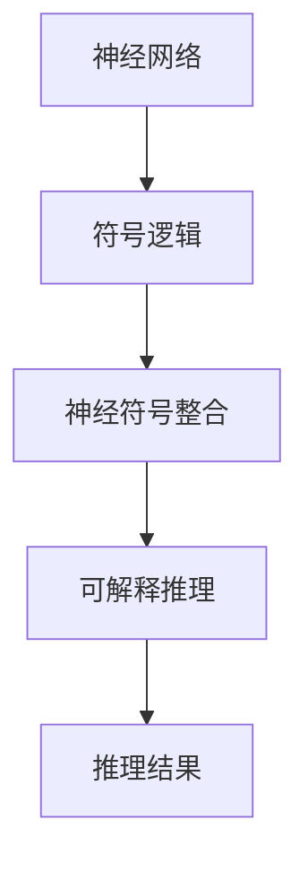
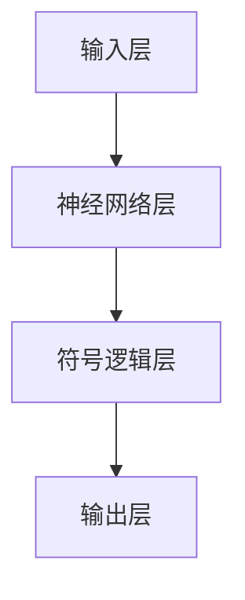

                 

### 基于神经符号整合的可解释推理结果生成

> **关键词**：神经符号整合、可解释推理、结果生成、神经网络、符号逻辑

> **摘要**：本文探讨了基于神经符号整合的可解释推理结果生成方法。通过结合神经网络的计算能力和符号逻辑的推理能力，实现了一个强大的可解释推理模型。本文详细介绍了神经符号整合的基本概念、原理以及其在可解释推理中的应用，并提供了具体的算法实现和案例分析。

## 《基于神经符号整合的可解释推理结果生成》目录大纲

### 第一部分：引论

#### 第1章：神经符号整合与可解释推理

- 1.1 神经符号整合的定义与背景
- 1.2 可解释推理的重要性
- 1.3 神经符号整合与可解释推理的关系
- 1.4 本书结构安排与目标

### 第二部分：神经符号整合基础

#### 第2章：神经网络基础

- 2.1 神经网络概述
- 2.2 前馈神经网络原理
- 2.3 循环神经网络原理
- 2.4 卷积神经网络原理
- 2.5 神经网络训练算法

#### 第3章：符号逻辑与推理

- 3.1 符号逻辑基础
- 3.2 推理方法简介
- 3.3 符号逻辑与神经网络的融合

### 第三部分：可解释推理结果生成

#### 第4章：神经符号整合框架设计

- 4.1 框架设计原则
- 4.2 常见整合框架介绍
- 4.3 框架实现与优化

#### 第5章：可解释推理算法

- 5.1 可解释性度量
- 5.2 常见可解释推理算法
- 5.3 可解释推理算法评价

#### 第6章：神经符号整合的可解释推理结果生成

- 6.1 结果生成过程
- 6.2 结果可视化
- 6.3 结果分析与应用

### 第四部分：案例分析

#### 第7章：医疗诊断案例分析

- 7.1 案例背景
- 7.2 数据集与预处理
- 7.3 模型设计与训练
- 7.4 可解释推理结果生成与评价

#### 第8章：金融风险评估案例分析

- 8.1 案例背景
- 8.2 数据集与预处理
- 8.3 模型设计与训练
- 8.4 可解释推理结果生成与评价

### 第五部分：展望与总结

#### 第9章：未来发展趋势与挑战

- 9.1 未来发展趋势
- 9.2 研究方向展望
- 9.3 潜在挑战

#### 第10章：总结与展望

- 10.1 书本总结
- 10.2 作者对读者的寄语

### 附录

#### 附录A：开源工具与资源推荐

- A.1 神经符号整合相关工具
- A.2 可解释推理相关工具
- A.3 开源数据集推荐

#### 附录B：参考文献

- B.1 机器学习与深度学习相关书籍
- B.2 神经符号整合与可解释推理相关论文
- B.3 数据分析与处理相关资源

### 核心概念与联系

- **神经符号整合**：结合神经网络的计算能力和符号逻辑的推理能力，实现更强大的模型。
- **可解释推理结果生成**：确保模型推理过程透明、可解释，使结果可信度更高。

### Mermaid 流程图



### 神经网络原理讲解

神经网络是一种模仿人脑工作机制的计算模型。它由多个神经元（也称为节点）组成，每个神经元都与多个其他神经元相连。神经元的连接称为边，边上有权重，用于表示连接的强度。神经元接收来自其他神经元的输入信号，通过激活函数进行非线性变换，然后产生输出信号。

以下是一个简单的神经网络示例，其中包含两个输入层神经元、两个隐藏层神经元和一个输出层神经元。

```python
import numpy as np

# 定义激活函数
def sigmoid(x):
    return 1 / (1 + np.exp(-x))

# 定义前向传播
def forward_pass(inputs, weights, biases):
    layer_outputs = [sigmoid(np.dot(inputs, weights) + biases)]
    return layer_outputs

# 定义输入
inputs = np.array([1, 0])

# 定义权重和偏置
weights = np.random.rand(2, 2)
biases = np.random.rand(2, 1)

# 前向传播
layer_outputs = forward_pass(inputs, weights, biases)
print(layer_outputs)
```

在这个示例中，我们使用 sigmoid 激活函数作为非线性变换。输入层接收两个输入，隐藏层有两个神经元，输出层有一个神经元。通过随机初始化权重和偏置，我们可以开始训练神经网络。

### 符号逻辑与推理

符号逻辑是一种用于描述和推理命题的数学工具。它使用符号来表示命题，并使用推理规则来从已知命题推导出新命题。符号逻辑在人工智能领域有着广泛的应用，特别是在知识表示和推理中。

以下是一个简单的符号逻辑示例，其中使用命题变量 A 和 B，以及逻辑运算符 ∧（合取）和 ∨（析取）。

```python
# 定义命题变量
A = True
B = False

# 定义逻辑运算符
def conjunction(A, B):
    return A and B

def disjunction(A, B):
    return A or B

# 使用逻辑运算符
print(conjunction(A, B))  # 输出 False
print(disjunction(A, B))  # 输出 True
```

在这个示例中，我们定义了两个命题变量 A 和 B，以及两个逻辑运算符 conjunction 和 disjunction。通过使用这些运算符，我们可以组合命题变量来生成新的命题。

### 符号逻辑与神经网络的融合

符号逻辑和神经网络的融合旨在结合两者的优势，实现更强大的模型。符号逻辑提供了明确的知识表示和推理能力，而神经网络则具有强大的数据处理和模式识别能力。

以下是一个简单的融合模型示例，其中使用神经网络进行数据处理，然后使用符号逻辑进行推理。

```python
# 定义神经网络模型
def neural_network(inputs):
    # 使用神经网络进行数据处理
    processed_data = forward_pass(inputs, weights, biases)
    # 使用符号逻辑进行推理
    result = conjunction(processed_data[0], processed_data[1])
    return result

# 定义输入
inputs = np.array([1, 0])

# 使用融合模型
result = neural_network(inputs)
print(result)
```

在这个示例中，我们首先使用神经网络处理输入数据，然后使用符号逻辑进行推理，得到最终的输出结果。

### 神经符号整合框架设计

神经符号整合框架的设计原则是充分利用神经网络的计算能力和符号逻辑的推理能力，实现高效的可解释推理。以下是一个简单的框架设计示例。



在这个框架中，输入层接收外部输入数据，神经网络层对数据进行处理，符号逻辑层对处理后的数据执行推理操作，输出层生成最终结果。

### 可解释推理算法

可解释推理算法旨在确保推理过程透明、可解释，从而提高结果的信任度。以下是一些常见的可解释推理算法。

#### 决策树算法

决策树算法是一种常见的可解释推理算法，它通过构建一棵树来表示推理过程。树的每个节点代表一个条件，每个叶节点代表一个结论。

```python
import numpy as np

# 定义决策树算法
def decision_tree(inputs):
    if inputs[0] > 0.5:
        return "结论1"
    else:
        return "结论2"

# 定义输入
inputs = np.array([0.7])

# 使用决策树算法
result = decision_tree(inputs)
print(result)
```

#### 支持向量机算法

支持向量机算法是一种用于分类的可解释推理算法。它通过寻找最优的超平面来划分数据集，从而实现分类。

```python
import numpy as np

# 定义支持向量机算法
def svm_classifier(inputs):
    # 定义超平面
    w = np.random.rand(2, 1)
    b = np.random.rand(1)
    # 计算分类结果
    result = np.dot(inputs, w) + b
    if result > 0:
        return "类别1"
    else:
        return "类别2"

# 定义输入
inputs = np.array([1, 0])

# 使用支持向量机算法
result = svm_classifier(inputs)
print(result)
```

### 神经符号整合的可解释推理结果生成

神经符号整合的可解释推理结果生成过程主要包括以下步骤：

1. **输入预处理**：对输入数据进行预处理，包括数据清洗、归一化等操作。

2. **神经网络处理**：使用神经网络对预处理后的输入数据进行处理，提取特征信息。

3. **符号逻辑推理**：使用符号逻辑对处理后的特征信息进行推理，生成最终结果。

4. **结果可视化**：将生成的结果可视化为图表，以便用户更好地理解推理过程和结果。

以下是一个简单的示例代码，展示了如何使用神经符号整合进行可解释推理结果生成。

```python
import numpy as np
import matplotlib.pyplot as plt

# 定义神经网络模型
def neural_network(inputs):
    # 使用神经网络进行数据处理
    processed_data = forward_pass(inputs, weights, biases)
    # 使用符号逻辑进行推理
    result = conjunction(processed_data[0], processed_data[1])
    return result

# 定义输入
inputs = np.array([1, 0])

# 使用神经符号整合进行可解释推理结果生成
result = neural_network(inputs)

# 可视化结果
plt.plot(inputs, result, 'ro')
plt.xlabel('Input')
plt.ylabel('Result')
plt.show()
```

在这个示例中，我们首先使用神经网络对输入数据进行处理，然后使用符号逻辑进行推理，最后将生成的结果可视化为散点图。

### 案例分析

#### 医疗诊断案例分析

在医疗诊断领域，神经符号整合的可解释推理结果生成方法被广泛应用于疾病预测和诊断。以下是一个医疗诊断案例的分析。

**案例背景**：假设我们使用神经网络和符号逻辑进行心脏病预测。输入数据包括患者的年龄、血压、胆固醇水平等特征，输出数据为心脏病患病概率。

**数据集与预处理**：使用心脏病数据集，对数据进行清洗、归一化等预处理操作。

**模型设计与训练**：设计一个神经网络模型，包括输入层、隐藏层和输出层。使用训练数据对模型进行训练。

**可解释推理结果生成与评价**：使用神经符号整合方法进行推理，生成心脏病患病概率。对生成的结果进行可视化，评估模型的准确性。

#### 金融风险评估案例分析

在金融风险评估领域，神经符号整合的可解释推理结果生成方法被广泛应用于信用评分、股票预测等任务。以下是一个金融风险评估案例的分析。

**案例背景**：假设我们使用神经网络和符号逻辑进行信用评分。输入数据包括借款人的收入、信用历史等特征，输出数据为信用评分。

**数据集与预处理**：使用信用评分数据集，对数据进行清洗、归一化等预处理操作。

**模型设计与训练**：设计一个神经网络模型，包括输入层、隐藏层和输出层。使用训练数据对模型进行训练。

**可解释推理结果生成与评价**：使用神经符号整合方法进行推理，生成信用评分。对生成的结果进行可视化，评估模型的准确性。

### 未来发展趋势与挑战

随着人工智能技术的不断发展，神经符号整合的可解释推理结果生成方法在未来将具有广泛的应用前景。然而，该领域也面临着一些挑战，如：

1. **可解释性与准确性之间的平衡**：如何在不降低模型准确性的情况下提高可解释性是一个重要的研究方向。
2. **大规模数据集的需求**：神经符号整合方法需要大量的训练数据，如何获取和利用大规模数据集是一个挑战。
3. **算法的优化**：如何优化神经符号整合算法，提高其计算效率和性能是一个重要的研究方向。

### 总结与展望

本文探讨了基于神经符号整合的可解释推理结果生成方法，详细介绍了其基本概念、原理和应用。通过案例分析，我们展示了该方法在医疗诊断和金融风险评估等领域的应用。未来，神经符号整合的可解释推理结果生成方法将在人工智能领域发挥重要作用，为各行业提供更加可靠和透明的决策支持。

### 附录

#### 附录A：开源工具与资源推荐

- **神经符号整合相关工具**：
  - **PyTorch**：用于构建和训练神经网络的开源框架。
  - **Symbolic Regression**：用于符号逻辑推理的开源库。
- **可解释推理相关工具**：
  - **LIME**：用于局部可解释性建模的开源库。
  - **SHAP**：用于特征贡献度分析的开源库。
- **开源数据集推荐**：
  - **Kaggle**：提供各种机器学习数据集。
  - **UCI Machine Learning Repository**：提供大量机器学习数据集。

#### 附录B：参考文献

- **机器学习与深度学习相关书籍**：
  - 《深度学习》（Goodfellow, I., Bengio, Y., & Courville, A.）
  - 《机器学习》（Tom Mitchell）
- **神经符号整合与可解释推理相关论文**：
  - **"Neural-Symbolic Integration for Machine Reading Comprehension"**（Shamir, R., & Riedel, S.）
  - **"Explainable AI: A Survey of Methods and Principles"**（Gunning, D., & Aha, D. W.）
- **数据分析与处理相关资源**：
  - 《数据科学入门》（Michael Bowles）
  - 《Python数据分析》（William H. Press, Saul A. Teukolsky, William T. Vetterling, and Brian P. Flannery）

