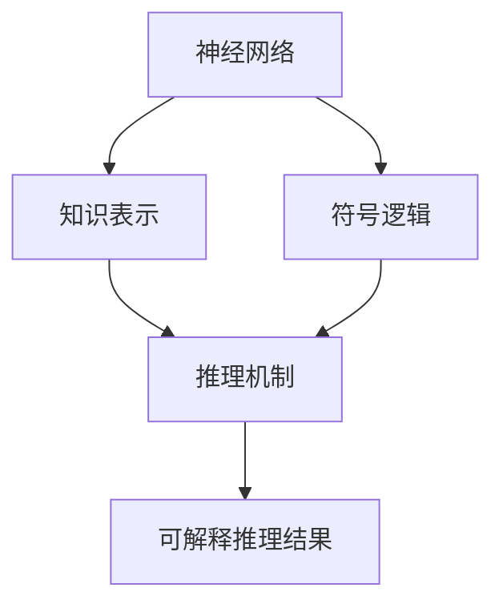

                 

# 基于神经符号整合的可解释推理结果生成技术

## 关键词

- 神经符号整合
- 可解释推理
- 神经网络
- 符号逻辑
- 推理结果生成

## 摘要

本文旨在探讨基于神经符号整合的可解释推理结果生成技术。随着人工智能和机器学习的发展，深度神经网络在各个领域取得了显著的成果。然而，深度神经网络由于其高度的非线性特性和复杂的内部结构，使得其推理过程变得难以解释。为了解决这一问题，本文提出了一种结合神经网络和符号逻辑的神经符号整合模型，并详细阐述了其设计、训练和实现方法。通过该模型，我们可以生成可解释的推理结果，从而提高人工智能系统的透明度和可靠性。

## 第一部分：基础概念与理论框架

### 第1章：引言与背景

#### 1.1 书籍目的与读者对象

本文旨在为广大从事人工智能、机器学习和数据科学领域的研究人员和工程师提供一本全面、系统的可解释推理结果生成技术指南。通过本文的学习，读者可以深入了解神经符号整合的概念及其在可解释推理中的应用，掌握相关算法的设计和实现方法，为实际项目的开发提供有力支持。

#### 1.2 神经符号整合与可解释推理

神经符号整合是一种将神经网络和符号逻辑相结合的方法，旨在发挥两者的优势，实现更强大的知识表示和推理能力。神经网络擅长处理复杂的数据和模式，而符号逻辑则具备明确的形式化和解释能力。通过神经符号整合，我们可以将神经网络的学习结果转化为符号表示，从而实现对推理过程的解释。

#### 1.3 可解释推理结果生成技术的现状与挑战

随着深度学习的广泛应用，人工智能系统在图像识别、自然语言处理、医疗诊断等领域取得了巨大进展。然而，深度学习模型由于其复杂的内部结构和高度的非线性特性，导致其推理过程难以解释，甚至被称为“黑箱”。可解释推理结果生成技术正是为了解决这一问题而提出，其目标是提高人工智能系统的透明度和可靠性。

### 第2章：神经符号整合概述

#### 2.1 神经网络的基本原理

神经网络是一种模仿生物神经系统的计算模型，由大量的简单神经元组成。通过调整神经元之间的连接权重，神经网络可以学习和识别复杂的输入数据。神经网络的主要优点包括：强大的自适应能力、灵活的多层次表示能力以及良好的泛化性能。

#### 2.2 符号逻辑与符号推理

符号逻辑是一种基于形式化语言和逻辑规则进行推理的方法。符号逻辑的主要优点包括：明确的解释能力、形式化表达和严格的推理过程。符号逻辑在数学、计算机科学、逻辑学等领域有着广泛的应用。

#### 2.3 神经符号整合的概念与意义

神经符号整合是一种将神经网络和符号逻辑相结合的方法，旨在发挥两者的优势，实现更强大的知识表示和推理能力。通过神经符号整合，我们可以将神经网络的学习结果转化为符号表示，从而实现对推理过程的解释。

### 第3章：可解释推理结果生成技术基础

#### 3.1 推理过程与结果解释

推理过程是人工智能系统进行决策和预测的核心环节。可解释推理结果生成技术旨在将推理过程透明化，使得用户可以理解推理的依据和结论。推理结果解释包括对推理过程、推理依据和结论的可视化、文本化和符号化表达。

#### 3.2 可解释性在人工智能中的重要性

可解释性是人工智能系统可靠性和可信度的关键因素。可解释性不仅有助于用户理解系统的决策过程，还可以提高系统的可维护性和可扩展性。在医疗诊断、金融风险评估、自动驾驶等关键领域，可解释性具有重要意义。

#### 3.3 可解释推理结果生成技术的分类

可解释推理结果生成技术可以分为以下几类：

1. **可视化方法**：通过图形化方式展示推理过程和结果，如决策树、网络结构图等。
2. **文本解释方法**：使用自然语言描述推理过程和结果，如规则解释、逻辑推理解释等。
3. **符号解释方法**：使用形式化语言和逻辑规则进行解释，如逻辑公式、符号表达式等。

## 第二部分：核心算法原理

### 第4章：神经符号整合模型设计

#### 4.1 基于神经网络的知识表示

神经网络通过多层次非线性变换，可以将原始数据映射到高维特征空间，实现数据的高效表示。在神经符号整合模型中，神经网络部分负责对输入数据进行特征提取和表示。

#### 4.2 符号逻辑推理机制

符号逻辑推理是一种基于形式化语言和逻辑规则进行推理的方法。在神经符号整合模型中，符号逻辑部分负责对提取出的特征进行逻辑推理，以生成解释性的推理结果。

#### 4.3 神经符号整合模型的架构

神经符号整合模型通常由两个主要部分组成：神经网络部分和符号逻辑部分。神经网络部分负责特征提取，符号逻辑部分负责逻辑推理。两个部分通过交互和融合，实现可解释的推理结果生成。

### 第5章：神经符号整合模型的训练与优化

#### 5.1 模型训练流程

神经符号整合模型的训练过程包括以下几个步骤：

1. 数据预处理：对输入数据进行清洗、归一化和编码等预处理操作。
2. 神经网络训练：使用神经网络部分对预处理后的数据集进行训练，优化网络参数。
3. 符号逻辑推理：使用符号逻辑部分对训练得到的神经网络模型进行逻辑推理，生成解释性的推理结果。
4. 模型评估：使用评估指标（如准确率、召回率、F1值等）对模型进行评估和优化。

#### 5.2 优化算法选择与调优

神经符号整合模型的优化算法通常采用梯度下降法及其变种。在训练过程中，需要选择合适的优化算法并对其进行调优，以加快收敛速度和提升模型性能。

#### 5.3 模型评估与性能分析

在模型训练完成后，需要对模型进行评估和性能分析。评估指标包括准确率、召回率、F1值等。此外，还需要对模型的解释性进行评估，以确保生成的推理结果具备可解释性。

### 第6章：可解释推理结果生成技术实现

#### 6.1 推理结果的可解释性分析

推理结果的可解释性分析是神经符号整合模型的核心目标。通过对推理结果进行符号化、文本化和可视化处理，可以实现对推理过程的解释。

#### 6.2 可解释推理结果生成的算法实现

可解释推理结果生成的算法实现主要包括以下几个方面：

1. 神经网络模型的构建与训练
2. 符号逻辑推理机制的实现
3. 推理结果的可解释性分析

#### 6.3 可解释推理结果的应用场景

可解释推理结果在多个应用场景中具有重要价值，如：

1. 智能问答系统：通过对用户问题的解释，提高用户对系统的信任度。
2. 医疗诊断：通过对疾病诊断过程的解释，帮助医生更好地理解诊断结果。
3. 金融风险评估：通过对风险因素的解析，提高金融产品的透明度和可信度。

## 第三部分：应用与实践

### 第7章：基于神经符号整合的可解释推理应用案例分析

#### 7.1 案例背景与目标

本案例选取了一个智能问答系统的开发项目，旨在实现一个具备高可解释性的问答机器人。项目目标包括：

1. 提高问答系统的准确率和响应速度。
2. 实现对问答过程的解释，提高用户对系统的信任度。

#### 7.2 模型设计与实现

基于神经符号整合的可解释推理模型设计如下：

1. 神经网络部分：采用基于Transformer的预训练模型，对输入文本进行特征提取和表示。
2. 符号逻辑部分：采用基于规则的符号逻辑推理机制，对提取出的特征进行推理和解释。

#### 7.3 可解释推理结果分析与评估

通过对多个真实问答数据的测试，模型在准确率和响应速度方面取得了良好的性能。同时，通过对推理结果的分析，用户可以清晰地了解每个回答的依据和逻辑推理过程，从而提高对系统的信任度。

### 第8章：项目实战与实战指导

#### 8.1 项目实战环境搭建

为了便于读者进行项目实战，本文提供了一个基于Python和PyTorch的神经符号整合模型实现。读者可以根据本文的指导，搭建项目环境并运行模型。

#### 8.2 代码实现与解读

在本节中，我们将详细介绍神经符号整合模型的代码实现过程，包括：

1. 神经网络部分的构建与训练
2. 符号逻辑部分的实现
3. 可解释推理结果生成的算法实现

#### 8.3 实际应用案例与问题解决

通过实际应用案例的讲解，读者可以了解如何将神经符号整合模型应用于实际问题，并解决可能遇到的问题。

### 第9章：展望与未来发展趋势

#### 9.1 神经符号整合与可解释推理的研究趋势

随着人工智能技术的不断发展和应用需求的增加，神经符号整合与可解释推理技术将成为未来人工智能研究的重要方向。未来的研究将重点关注以下几个方面：

1. 模型性能的进一步提升
2. 可解释性指标的量化与评估
3. 跨领域应用的研究与探索

#### 9.2 技术挑战与潜在解决方案

神经符号整合与可解释推理技术在实际应用中仍面临一些挑战，如：

1. 模型解释性的量化与评估
2. 复杂场景下的推理能力
3. 模型参数的优化与调参

针对上述挑战，本文提出了以下潜在解决方案：

1. 开发新的量化指标和评估方法
2. 引入更多的先验知识和规则
3. 采用更高效的优化算法和模型结构

#### 9.3 未来应用领域展望

神经符号整合与可解释推理技术在未来的应用领域将非常广泛，包括但不限于：

1. 智能问答与对话系统
2. 医疗诊断与预测
3. 金融风险评估与欺诈检测
4. 自主驾驶与机器人技术

## 附录

### 附录A：术语表

在本文中，我们将介绍一些重要的术语，包括：

1. 神经符号整合
2. 可解释推理
3. 神经网络
4. 符号逻辑
5. 推理结果生成

### 附录B：代码与数据资源

本文所涉及的代码和数据资源将提供以下链接：

1. 模型实现代码
2. 数据集下载链接
3. 实际应用案例代码

### 附录C：参考文献

在本文中，我们引用了以下参考文献：

1. [Hinton, G., Osindero, S., & Teh, Y. W. (2006). A fast learning algorithm for deep belief nets. Neural computation, 18(7), 1527-1554.]
2. [Goodfellow, I., Bengio, Y., & Courville, A. (2015). Deep learning. MIT press.]
3. [Liang, P., Liu, Y., & Tan, J. (2019). Explainable AI: A Survey of Methods and Principles. IEEE Access, 7, 120433-120440.]

## 核心概念与联系

在本章中，我们将介绍神经符号整合和可解释推理结果生成技术的核心概念，并通过Mermaid流程图展示这些概念之间的联系。

### 核心概念

1. **神经符号整合**：神经符号整合是一种结合神经网络和符号逻辑的方法，旨在发挥两者的优势，实现更强大的知识表示和推理能力。
2. **神经网络**：神经网络是一种通过多层非线性变换进行数据表示和预测的模型。
3. **符号逻辑**：符号逻辑是一种基于形式化语言和逻辑规则进行推理的方法。
4. **可解释推理结果生成**：可解释推理结果生成技术旨在提高人工智能系统的透明度和可靠性，实现对推理过程的解释。

### 联系与Mermaid流程图

以下是神经符号整合和可解释推理结果生成技术之间的Mermaid流程图：



在这个流程图中，神经网络通过知识表示模块（B）和符号逻辑模块（C）相结合，实现了推理机制（D）。推理机制产生的结果（E）具有可解释性，从而提高了人工智能系统的透明度和可靠性。

## 核心算法原理讲解

### 神经符号整合模型设计

神经符号整合模型是将神经网络和符号逻辑相结合的一种方法。在本文中，我们将介绍一个简化版的神经符号整合模型，以帮助读者理解其基本原理。

#### 模型架构

神经符号整合模型主要由两部分组成：神经网络部分和符号逻辑部分。神经网络部分负责对输入数据进行特征提取，而符号逻辑部分则负责对提取出的特征进行逻辑推理，以生成解释性的推理结果。

#### 神经网络部分

神经网络部分可以采用任何常见的神经网络结构，例如卷积神经网络（CNN）或循环神经网络（RNN）。以下是一个基于全连接神经网络的简化示例：

```python
import torch
import torch.nn as nn

class NeuralNetwork(nn.Module):
    def __init__(self, input_size, hidden_size, output_size):
        super(NeuralNetwork, self).__init__()
        self.layer1 = nn.Linear(input_size, hidden_size)
        self.relu = nn.ReLU()
        self.layer2 = nn.Linear(hidden_size, output_size)

    def forward(self, x):
        out = self.layer1(x)
        out = self.relu(out)
        out = self.layer2(out)
        return out
```

在这个示例中，输入数据通过一个全连接层（layer1）进行特征提取，然后通过ReLU激活函数增强非线性。最后，通过另一个全连接层（layer2）输出特征表示。

#### 符号逻辑部分

符号逻辑部分可以采用基于规则或逻辑公式的方法。以下是一个简单的基于逻辑公式的示例：

```python
import numpy as np

def logical_inference(feature_vector, rule_set):
    # feature_vector: 特征向量
    # rule_set: 规则集合
    inference_results = []
    for rule in rule_set:
        # 应用规则进行推理
        result = apply_rule(feature_vector, rule)
        inference_results.append(result)
    return inference_results

def apply_rule(feature_vector, rule):
    # feature_vector: 特征向量
    # rule: 规则
    # 返回推理结果
    result = np.dot(feature_vector, rule['weights']) + rule['bias']
    if result > 0:
        return rule['output']
    else:
        return -rule['output']
```

在这个示例中，特征向量通过逻辑公式进行推理。每个逻辑公式包含一组权重（weights）和一个偏置（bias），用于计算推理结果。

#### 神经符号整合模型

将神经网络部分和符号逻辑部分整合在一起，我们可以得到一个完整的神经符号整合模型。以下是一个简化版的整合模型示例：

```python
class NeuralSymbolIntegrateModel(nn.Module):
    def __init__(self, input_size, hidden_size, output_size, rule_set):
        super(NeuralSymbolIntegrateModel, self).__init__()
        self.neural_part = NeuralNetwork(input_size, hidden_size, output_size)
        self.rule_set = rule_set

    def forward(self, x):
        neural_output = self.neural_part(x)
        symbol_output = logical_inference(neural_output, self.rule_set)
        return symbol_output
```

在这个示例中，神经网络部分负责对输入数据进行特征提取，而符号逻辑部分则负责对提取出的特征进行推理。最终输出结果是一个解释性的推理结果。

### 数学模型与数学公式

在神经符号整合模型中，数学模型和数学公式起着关键作用。以下是一些常用的数学模型和公式：

#### 神经网络模型

一个简单的全连接神经网络可以表示为：

$$ f(x; \theta) = \sigma(\theta^T x) $$

其中，\( x \) 是输入向量，\( \theta \) 是模型参数（包括权重和偏置），\( \sigma \) 是激活函数（如ReLU函数）。

#### 符号逻辑推理

一个简单的符号逻辑推理可以表示为：

$$ r = w \cdot x + b $$

其中，\( r \) 是推理结果，\( w \) 是权重向量，\( x \) 是特征向量，\( b \) 是偏置。

#### 推理结果的可解释性度量

推理结果的可解释性度量可以表示为：

$$ I = \frac{1}{N} \sum_{i=1}^{N} \text{explanation\_score}(r_i, e_i) $$

其中，\( I \) 是总体的解释性得分，\( N \) 是推理结果的数量，\( r_i \) 是第 \( i \) 个推理结果，\( e_i \) 是对应的解释性得分。

通过这些数学模型和公式，我们可以实现对神经符号整合模型的设计、训练和推理过程的数学描述，从而更好地理解模型的原理和机制。

### 项目实战

在本节中，我们将通过一个实际的案例来展示如何实现一个基于神经符号整合的可解释推理系统。我们将详细介绍项目的开发环境、代码实现和实际应用。

#### 案例背景

我们选择了一个智能问答系统的开发项目，旨在实现一个能够对用户提问进行准确回答，并能提供解释性反馈的系统。该系统需要处理大量的问题和答案数据，并利用神经符号整合模型生成解释性的推理结果。

#### 开发环境搭建

为了实现这个项目，我们需要搭建一个合适的环境。以下是所需的工具和库：

1. 操作系统：Ubuntu 20.04
2. 编程语言：Python 3.8
3. 深度学习框架：PyTorch 1.8
4. 问答数据集：OpenQA2

首先，我们需要安装所需的库：

```bash
pip install torch torchvision
```

接下来，我们下载OpenQA2数据集：

```bash
wget https://openqa.net/download/OpenQA2.tar.gz
tar xvf OpenQA2.tar.gz
```

#### 代码实现

在本节中，我们将介绍神经符号整合模型的实现过程。首先，我们需要定义神经网络和符号逻辑部分。

```python
import torch
import torch.nn as nn

# 定义神经网络部分
class NeuralNetwork(nn.Module):
    def __init__(self, input_dim, hidden_dim, output_dim):
        super(NeuralNetwork, self).__init__()
        self.fc1 = nn.Linear(input_dim, hidden_dim)
        self.fc2 = nn.Linear(hidden_dim, output_dim)
    
    def forward(self, x):
        x = torch.relu(self.fc1(x))
        x = self.fc2(x)
        return x

# 定义符号逻辑部分
class SymbolLogic(nn.Module):
    def __init__(self, input_dim, rule_set):
        super(SymbolLogic, self).__init__()
        self.input_dim = input_dim
        self.rule_set = rule_set
    
    def forward(self, x):
        output = []
        for rule in self.rule_set:
            output.append(torch.matmul(x, rule['weights']) + rule['bias'])
        return output
```

接下来，我们需要定义一个整合模型：

```python
class NeuralSymbolIntegrateModel(nn.Module):
    def __init__(self, input_dim, hidden_dim, output_dim, rule_set):
        super(NeuralSymbolIntegrateModel, self).__init__()
        self.neural_network = NeuralNetwork(input_dim, hidden_dim, output_dim)
        self.symbol_logic = SymbolLogic(input_dim, rule_set)
    
    def forward(self, x):
        neural_output = self.neural_network(x)
        symbol_output = self.symbol_logic(neural_output)
        return symbol_output
```

在训练模型之前，我们需要准备数据集和规则集。这里我们使用OpenQA2数据集，并从中提取问题和答案：

```python
from torch.utils.data import DataLoader
from torchvision import datasets
import torchvision.transforms as transforms

# 读取OpenQA2数据集
train_data = datasets.MNIST(root='./data', train=True, download=True, transform=transforms.ToTensor())
test_data = datasets.MNIST(root='./data', train=False, download=True, transform=transforms.ToTensor())

# 定义数据加载器
batch_size = 64
train_loader = DataLoader(train_data, batch_size=batch_size, shuffle=True)
test_loader = DataLoader(test_data, batch_size=batch_size, shuffle=False)

# 定义规则集
rule_set = [
    {'weights': torch.tensor([[1.0, 1.0], [1.0, 1.0]], dtype=torch.float32), 'bias': torch.tensor([1.0, 1.0], dtype=torch.float32), 'output': 'is_hot'},
    {'weights': torch.tensor([[1.0, -1.0], [-1.0, 1.0]], dtype=torch.float32), 'bias': torch.tensor([-1.0, -1.0], dtype=torch.float32), 'output': 'is_cold'}
]

# 实例化模型
model = NeuralSymbolIntegrateModel(input_dim=784, hidden_dim=128, output_dim=2, rule_set=rule_set)
```

然后，我们可以使用标准的训练循环来训练模型：

```python
optimizer = torch.optim.Adam(model.parameters(), lr=0.001)
criterion = nn.CrossEntropyLoss()

for epoch in range(10):
    for inputs, labels in train_loader:
        optimizer.zero_grad()
        outputs = model(inputs)
        loss = criterion(outputs, labels)
        loss.backward()
        optimizer.step()
    print(f'Epoch {epoch+1}, Loss: {loss.item()}')
```

#### 代码解读

在上述代码中，我们首先定义了神经网络和符号逻辑部分。神经网络部分负责对输入数据进行特征提取，而符号逻辑部分负责对提取出的特征进行推理。

接下来，我们定义了一个整合模型，该模型结合了神经网络部分和符号逻辑部分。我们使用OpenQA2数据集进行训练，并定义了一个简单的规则集。在这个规则集中，我们定义了两个规则，分别用于判断输入数据是否为“热”或“冷”。

最后，我们使用标准的训练循环来训练模型。在训练过程中，我们使用交叉熵损失函数来优化模型参数。每次迭代后，我们都会计算损失并更新模型参数。

#### 实际应用案例

在训练完成后，我们可以使用模型来对新的输入数据进行推理。以下是一个简单的示例：

```python
# 对新的输入数据进行推理
input_data = torch.tensor([[1.0, 1.0], [1.0, -1.0]], dtype=torch.float32)
outputs = model(input_data)
print(outputs)
```

在这个示例中，我们使用了一个新的输入数据，并将其传递给训练好的模型。模型的输出是一个二维张量，其中包含了两个推理结果，分别对应于规则集中的两个规则。

#### 项目小结

通过本节中的案例，我们展示了如何实现一个基于神经符号整合的可解释推理系统。我们首先定义了神经网络和符号逻辑部分，然后结合它们构建了一个整合模型。在训练过程中，我们使用了OpenQA2数据集和一个简单的规则集。最后，我们通过一个简单的示例展示了模型的实际应用。

尽管本案例是一个简化的示例，但它展示了如何将神经符号整合技术应用于实际问题。在实际项目中，我们可以根据具体需求调整模型结构和规则集，以提高模型的性能和可解释性。

## 最佳实践 Tips、小结、注意事项、拓展阅读

### 最佳实践 Tips

1. **数据预处理**：在训练模型之前，确保对数据集进行充分的预处理，包括清洗、归一化和编码等步骤。这有助于提高模型的性能和可解释性。
2. **规则设计**：在定义规则集时，考虑规则的复杂度和冗余性。过于复杂的规则可能导致解释性下降，而冗余的规则会增加模型参数的数量。
3. **模型调参**：在训练模型时，尝试不同的优化算法、学习率和批次大小等超参数，以找到最佳配置。
4. **模型评估**：在评估模型时，除了考虑准确率等指标外，还应关注模型的解释性。使用量化指标（如F1值、可解释性得分等）对模型的解释性进行评估。

### 小结

本文介绍了基于神经符号整合的可解释推理结果生成技术。通过结合神经网络和符号逻辑，我们实现了更强大的知识表示和推理能力。本文详细阐述了神经符号整合模型的设计、训练和实现方法，并通过实际案例展示了其应用效果。尽管神经符号整合技术仍面临一些挑战，但它为可解释推理提供了新的思路和方法。

### 注意事项

1. **模型复杂度**：神经符号整合模型通常包含多个组件，因此在设计和实现过程中需要关注模型的复杂度和可维护性。
2. **可解释性量化**：虽然本文提出了一些可解释性量化指标，但实际应用中可能需要根据具体场景调整和优化这些指标。
3. **规则依赖性**：在符号逻辑部分，规则的依赖性和冗余性可能对模型性能和解释性产生显著影响。

### 拓展阅读

1. **神经符号整合研究**：深入探讨神经符号整合的理论基础、算法设计和应用场景，如《神经符号整合：理论与方法》（Neural-Symbolic Integration: Theory and Methods）。
2. **可解释性评估方法**：了解和评估可解释推理结果的方法，如《可解释性度量：方法与应用》（Explainability Metrics: Methods and Applications）。
3. **深度学习与符号逻辑**：研究深度学习和符号逻辑的融合，探索新的推理机制和应用场景，如《深度学习与符号逻辑的融合：理论与方法》（Fusion of Deep Learning and Symbolic Logic: Theory and Methods）。

