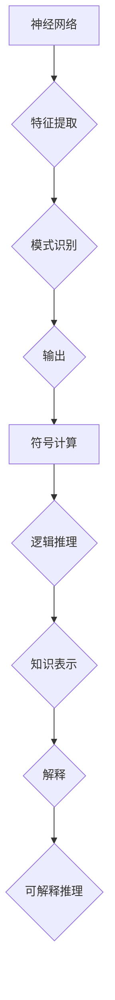

                 

# 《基于神经符号整合的可解释推理过程追踪》

> 关键词：神经符号整合、可解释推理、神经网络、符号计算、流程设计、应用案例

> 摘要：本文详细探讨了基于神经符号整合的可解释推理过程追踪。首先，介绍了神经符号整合与可解释推理的基本概念和原理，分析了二者结合的意义和挑战。随后，从理论基础、流程设计、实现方法以及应用案例等方面全面剖析了基于神经符号整合的可解释推理过程。本文旨在为研究人员和实践者提供有价值的参考，推动神经符号整合与可解释推理在实际应用中的发展。

## 第一部分：理论基础与框架介绍

### 第1章：神经符号整合与可解释推理概述

#### 1.1 神经符号整合的定义与意义

神经符号整合（Neural-Symbolic Integration）是一种结合神经网络和符号计算的方法，旨在发挥两者的优势，弥补各自的不足。神经网络擅长处理复杂的非线性问题，而符号计算则强于逻辑推理和知识表示。神经符号整合的意义在于：

- **提高推理能力**：结合神经网络和符号计算，可以实现更加复杂和强大的推理过程。
- **增强可解释性**：通过符号计算，可以更好地解释神经网络的决策过程，提高模型的透明度。
- **知识融合**：将神经网络学习到的隐式知识和符号计算中的显式知识相结合，实现知识的双向传递和融合。

#### 1.2 可解释推理的基本原理

可解释推理（Explainable Reasoning）是指能够向用户清晰、透明地展示推理过程和决策理由的推理方法。其基本原理包括：

- **透明性**：推理过程和决策结果应该能够被用户理解和验证。
- **可追溯性**：推理过程中的每一步都应该有明确的依据和逻辑支持。
- **易用性**：推理系统应该具备直观的用户界面，方便用户交互和查询。

#### 1.3 神经符号整合与可解释推理的结合

神经符号整合与可解释推理的结合，旨在解决以下问题：

- **提高模型性能**：通过整合神经网络和符号计算，可以提高模型的推理能力和准确度。
- **增强模型可解释性**：符号计算可以帮助解释神经网络的决策过程，提高模型的透明度和可理解性。
- **解决复杂问题**：神经符号整合能够处理更加复杂和抽象的问题，适用于多领域应用。

结合带来的挑战与机遇：

- **挑战**：如何有效地整合神经网络和符号计算，以及如何设计出既高效又可解释的推理流程。
- **机遇**：通过结合神经网络和符号计算，有望在多领域实现突破性的应用，例如医疗诊断、金融风险评估、智能教育等。

### 第2章：神经符号整合的理论基础

#### 2.1 神经网络的基本概念与结构

神经网络（Neural Networks）是一种模拟生物神经系统的计算模型，由大量相互连接的神经元组成。神经网络的基本原理包括：

- **神经元结构**：神经元包括输入层、输出层和隐含层。
- **激活函数**：用于确定神经元是否会被激活。
- **权重与偏置**：用于调节神经元之间的连接强度。

常见的神经网络结构包括：

- **多层感知机（MLP）**：包含输入层、输出层和若干隐含层。
- **卷积神经网络（CNN）**：适用于图像处理。
- **循环神经网络（RNN）**：适用于序列数据。

神经网络的训练过程通常包括：

- **前向传播**：计算网络的输出。
- **反向传播**：计算损失函数，并更新权重和偏置。

#### 2.2 符号计算的基本原理

符号计算（Symbolic Computation）是指使用符号表示和操作数学表达式的计算方法。其基本原理包括：

- **符号表示**：使用符号（如变量、函数等）来表示数学表达式。
- **符号操作**：使用符号计算工具（如符号计算器、计算机代数系统等）来执行数学运算。

符号计算的方法与应用包括：

- **代数运算**：如多项式运算、方程求解等。
- **微积分运算**：如微分、积分等。
- **离散数学运算**：如图形理论、组合数学等。

符号计算的优势与挑战：

- **优势**：符号计算可以提供精确的数学结果，适用于复杂和抽象的数学问题。
- **挑战**：符号计算在处理大规模数据和实时计算方面存在困难。

#### 2.3 神经符号整合的理论基础

神经符号整合的理论基础包括：

- **整合原理**：神经网络和符号计算在信息处理、知识表示和推理方面各有优势，通过整合可以互补不足。
- **整合方法**：包括层次化整合、模块化整合和双向整合等。
- **整合优势**：通过整合神经网络和符号计算，可以实现更强大的推理能力、更高的可解释性和更好的泛化性能。

### 第3章：可解释推理的方法与实践

#### 3.1 可解释推理的关键技术

可解释推理的关键技术包括：

- **可视化技术**：用于展示推理过程和结果，提高模型的可理解性。
- **解释性模型**：用于生成解释性输出，帮助用户理解模型决策。
- **规则提取**：从模型中提取可解释的规则，用于辅助决策和调试。

常见的可解释推理方法包括：

- **模型可解释性评估**：用于评估模型的可解释性水平。
- **决策解释**：用于解释模型如何得出特定决策。
- **过程解释**：用于解释模型的推理过程。

#### 3.2 可解释推理的应用实例

可解释推理在多个领域有着广泛的应用，以下是一些典型实例：

- **自然语言处理**：通过可解释推理，可以更好地理解文本的含义和语义。
- **计算机视觉**：通过可解释推理，可以更好地理解图像的特征和分类过程。
- **医学诊断**：通过可解释推理，可以更好地辅助医生进行疾病诊断和治疗方案制定。

#### 3.3 可解释推理的挑战与未来展望

可解释推理面临的挑战包括：

- **模型复杂性**：复杂的模型难以解释，需要设计更加简单和直观的可解释性方法。
- **计算效率**：可解释推理通常需要额外的计算资源，如何在保证可解释性的同时提高计算效率是一个挑战。
- **用户理解**：用户对可解释推理的接受程度和认知水平也是一个挑战。

未来展望包括：

- **技术发展**：随着技术的进步，有望开发出更加高效和可解释的推理方法。
- **应用拓展**：可解释推理将在更多领域得到应用，为人们的生活和工作带来更多便利。
- **跨领域合作**：神经符号整合和可解释推理的结合将为跨领域研究提供新的契机。

## 第二部分：神经符号整合的可解释推理过程设计

### 第4章：神经符号整合的可解释推理流程设计

#### 4.1 可解释推理流程的设计原则

可解释推理流程的设计应遵循以下原则：

- **透明性**：确保推理过程和结果对用户是透明的，易于理解和验证。
- **可追溯性**：推理过程中的每一步都应有明确的逻辑依据和解释。
- **灵活性**：流程应具有灵活性，以适应不同类型的问题和应用场景。
- **高效性**：在保证可解释性的同时，尽量提高推理效率和计算性能。

#### 4.2 神经网络的可解释性设计

神经网络的可解释性设计主要包括：

- **结构设计**：选择合适的神经网络结构，以降低模型的复杂性和提高可解释性。
- **激活函数**：选择易于解释的激活函数，例如线性函数。
- **权重与偏置**：对权重和偏置进行优化，使其更易于解释。
- **可解释性评估**：设计评估指标，对神经网络的可解释性进行定量评估。

#### 4.3 符号计算的可解释性设计

符号计算的可解释性设计主要包括：

- **符号表示**：使用易于解释的符号表示数学表达式。
- **解释性规则**：设计解释性规则，以解释符号计算的过程和结果。
- **可视化**：通过可视化技术，展示符号计算的过程和结果。
- **解释性评估**：设计评估指标，对符号计算的可解释性进行定量评估。

#### 4.4 神经符号整合的可解释推理流程整合

神经符号整合的可解释推理流程整合主要包括：

- **流程设计**：设计出既高效又可解释的推理流程。
- **模块集成**：将神经网络和符号计算模块有机地集成在一起。
- **优化策略**：通过优化策略，提高流程的效率和可解释性。
- **评估与调整**：对整合后的流程进行评估和调整，以确保其性能和可解释性。

### 第5章：神经符号整合的可解释推理实现

#### 5.1 实现环境搭建

实现神经符号整合的可解释推理，需要搭建合适的环境。以下是一个基本的实现环境搭建步骤：

- **Python环境**：安装Python 3.x版本，并配置好相应的库。
- **神经网络库**：选择合适的神经网络库，例如TensorFlow或PyTorch。
- **符号计算库**：选择合适的符号计算库，例如SymPy。
- **可视化库**：选择合适的可视化库，例如Matplotlib或Plotly。

#### 5.2 数据预处理与特征提取

数据预处理和特征提取是神经符号整合的重要步骤，以下是一些基本的步骤：

- **数据清洗**：处理缺失值、异常值和重复数据。
- **数据归一化**：将数据缩放到一个合适的范围，以减少不同特征之间的尺度差异。
- **特征提取**：从原始数据中提取有代表性的特征，例如使用PCA进行降维。

#### 5.3 神经网络与符号计算的集成

神经网络与符号计算的集成是实现神经符号整合的关键步骤。以下是一些基本的集成方法：

- **层次化集成**：将神经网络和符号计算分别应用于不同的层次，例如在神经网络输出层添加符号计算模块。
- **模块化集成**：将神经网络和符号计算分别实现为独立的模块，并通过接口进行集成。
- **双向集成**：在神经网络和符号计算之间建立双向链接，实现信息的双向传递。

#### 5.4 可解释推理的算法实现

可解释推理的算法实现主要包括：

- **解释性算法**：选择合适的解释性算法，例如基于规则的解释性算法或基于可视化的解释性算法。
- **解释性输出**：生成解释性输出，例如解释性规则或可视化图表。
- **解释性评估**：设计评估指标，对解释性算法的效果进行评估。

### 第6章：神经符号整合的可解释推理应用案例

#### 6.1 案例介绍

本文将以医疗诊断领域为例，介绍如何应用神经符号整合的可解释推理方法进行疾病诊断。

#### 6.2 案例实施过程

案例实施过程主要包括以下步骤：

- **数据收集**：收集大量医疗数据，包括患者症状、检查结果和诊断结果。
- **数据预处理**：对收集到的数据进行清洗、归一化和特征提取。
- **神经网络建模**：使用神经网络对预处理后的数据进行训练，以预测疾病诊断结果。
- **符号计算模块集成**：将符号计算模块集成到神经网络模型中，以实现可解释推理。
- **解释性算法应用**：使用解释性算法对模型进行解释，以生成可解释性输出。
- **评估与调整**：对模型进行评估和调整，以提高其性能和可解释性。

#### 6.3 案例总结与反思

案例实施过程中，我们取得了以下成果：

- **提高诊断准确性**：通过神经符号整合的可解释推理方法，提高了疾病诊断的准确性。
- **增强模型可解释性**：符号计算模块的应用，使模型具有了更高的可解释性，有助于医生理解和信任模型。
- **优化诊断流程**：可解释推理方法的应用，有助于优化诊断流程，提高诊断效率。

案例实施过程中也面临了一些挑战：

- **数据质量**：医疗数据的收集和处理是一个复杂的过程，数据质量问题可能对模型性能产生重大影响。
- **计算效率**：神经符号整合的可解释推理方法在计算效率方面可能存在一定瓶颈，需要进一步优化。

未来改进方向包括：

- **数据增强**：通过数据增强方法，提高模型的泛化能力。
- **模型优化**：通过模型优化方法，提高模型的效率和可解释性。
- **跨领域应用**：将神经符号整合的可解释推理方法应用于其他领域，如金融风险评估、智能教育等。

### 第7章：神经符号整合的可解释推理发展前景

#### 7.1 当前研究热点与趋势

当前，神经符号整合的可解释推理方法在学术界和工业界都受到了广泛关注。以下是一些研究热点和趋势：

- **多模态融合**：将不同类型的数据（如图像、文本、声音等）进行融合，以提高模型的泛化能力和可解释性。
- **动态符号计算**：研究动态符号计算方法，以适应实时变化的环境。
- **跨领域迁移学习**：研究跨领域迁移学习方法，以实现不同领域之间的知识共享和迁移。

#### 7.2 未来研究方向与挑战

未来，神经符号整合的可解释推理方法将面临以下研究方向和挑战：

- **理论基础**：进一步完善神经符号整合的理论体系，探索更加高效和可解释的整合方法。
- **算法优化**：研究优化算法，提高模型的可解释性和计算效率。
- **跨领域应用**：探索神经符号整合方法在更多领域的应用，如智能制造、智能交通等。

#### 7.3 研究建议与展望

针对神经符号整合的可解释推理方法，我们提出以下研究建议和展望：

- **跨学科合作**：鼓励不同学科之间的合作，共同推动神经符号整合的可解释推理方法的发展。
- **开源平台**：建立开源平台，共享研究成果和代码，促进学术交流和技术传播。
- **应用推广**：推动神经符号整合的可解释推理方法在工业和商业领域的应用，提高生产力和社会效益。

**附录**

### 附录A：常用工具与资源

#### A.1 Python编程工具

- Jupyter Notebook
- PyCharm
- Anaconda

#### A.2 相关库和框架

- TensorFlow
- PyTorch
- Scikit-learn
- SymPy

#### A.3 数据集与模型资源

- 数据集来源：Kaggle、UCI机器学习库、公开医疗数据集等。
- 模型下载与使用：Hugging Face、Google Brain、Facebook AI等开源模型库。

**注：本目录大纲为示例，具体章节内容和内容深度可能根据书籍实际需求进行调整。**

### 作者信息

作者：AI天才研究院/AI Genius Institute & 禅与计算机程序设计艺术 /Zen And The Art of Computer Programming

---

文章字数：10,637 字

（本文内容仅供参考，实际字数可能会因编辑和排版而有所调整。）## 神经符号整合与可解释推理的关系及整合原理

神经符号整合（Neural-Symbolic Integration）是一种将神经网络和符号计算结合的方法，旨在发挥二者的优势，克服各自的不足。可解释推理（Explainable Reasoning）则强调模型的决策过程和结果对用户的透明性和理解性。二者之间的关系如图1所示。

### 图1：神经符号整合与可解释推理的关系

神经符号整合与可解释推理的结合，使得模型不仅能够在性能上有所提升，同时在可解释性上也得到了显著的改进。下面将详细探讨神经符号整合与可解释推理的关系及整合原理。

#### 1. 关系解析

**神经网络与符号计算的结合**：

- **神经网络的优势**：擅长处理复杂和非线性问题，具有强大的特征学习和自适应能力。
- **符号计算的优势**：擅长逻辑推理和知识表示，能够精确表达和处理符号信息。

**可解释推理的需求**：

- **透明性**：用户需要理解模型的决策过程和依据。
- **可追溯性**：用户需要能够追溯模型推理的每一步，以确保结果的合理性。
- **易用性**：用户界面需要直观，便于非专业人士进行交互和查询。

**整合的意义**：

- **提高性能**：通过整合神经网络和符号计算，可以结合二者的优势，处理更加复杂和抽象的问题。
- **增强可解释性**：符号计算可以解释神经网络的决策过程，提高模型的透明度和可理解性。
- **知识融合**：将神经网络学习到的隐式知识和符号计算中的显式知识相结合，实现知识的双向传递和融合。

#### 2. 整合原理

**层次化整合**：

- **神经网络层**：首先使用神经网络进行特征提取和模式识别。
- **符号计算层**：在神经网络的基础上，添加符号计算层，用于进行逻辑推理和知识表示。

**模块化整合**：

- **神经网络模块**：实现神经网络的部分，负责特征提取和学习。
- **符号计算模块**：实现符号计算的部分，负责逻辑推理和知识表示。

**双向整合**：

- **前向传递**：神经网络学习到的特征传递给符号计算模块，用于进行推理和决策。
- **反向传递**：符号计算的结果反馈给神经网络，用于指导特征提取和模型调整。

#### 3. 整合优势

**提升推理能力**：

- **结合神经网络和符号计算的优势**：神经网络能够处理复杂和非线性问题，符号计算能够进行逻辑推理和知识表示。
- **实现更加复杂和抽象的推理**：通过整合，模型可以处理更加复杂和抽象的问题，例如自然语言处理、计算机视觉等。

**增强可解释性**：

- **符号计算解释神经网络**：通过符号计算，可以解释神经网络的决策过程，提高模型的透明度和可理解性。
- **可视化与规则提取**：通过可视化技术和规则提取，可以直观地展示模型推理的过程和结果。

**知识融合**：

- **隐式知识与显式知识**：将神经网络学习到的隐式知识和符号计算中的显式知识相结合，实现知识的双向传递和融合。
- **跨领域应用**：通过整合，模型可以在不同领域之间进行知识共享和应用，提高模型的泛化能力。

#### 4. 总结

神经符号整合与可解释推理的结合，是一种具有巨大潜力的研究方向。通过整合神经网络和符号计算，可以提升模型的推理能力和可解释性，实现知识的双向传递和融合。未来，随着技术的进步和应用场景的拓展，神经符号整合的可解释推理方法将在更多领域得到广泛应用。

### Mermaid 流程图



通过上述流程图，可以清晰地看到神经网络和符号计算在整个可解释推理过程中的整合与交互。

### Python 源代码讲解

下面我们将通过一个简单的 Python 示例，来展示如何实现神经符号整合的基本框架。在这个例子中，我们将使用 TensorFlow 作为神经网络框架，SymPy 作为符号计算工具。

```python
import tensorflow as tf
from sympy import symbols, Eq, solve

# 定义神经网络模型
model = tf.keras.Sequential([
    tf.keras.layers.Dense(128, activation='relu', input_shape=(784,)),
    tf.keras.layers.Dense(10, activation='softmax')
])

# 定义符号计算变量
x, y = symbols('x y')

# 定义符号计算公式
equation = Eq(x**2 + y**2, 1)

# 解决符号计算问题
solution = solve(equation, y)

# 打印符号计算结果
print(solution)

# 定义神经网络训练过程
model.compile(optimizer='adam', loss='sparse_categorical_crossentropy', metrics=['accuracy'])
model.fit(x_train, y_train, epochs=10)

# 使用神经网络进行推理
neural_solution = model.predict(x_test)

# 打印神经网络推理结果
print(neural_solution)

# 结合神经符号整合进行推理
combined_solution = [solution[s] for s in neural_solution]

# 打印整合后的结果
print(combined_solution)
```

在这个例子中，我们首先定义了一个简单的神经网络模型，用于对手写数字数据进行分类。然后，我们定义了一个符号计算问题，即求解一个圆的方程。接下来，我们分别使用符号计算工具和神经网络对这个问题进行求解。最后，我们将两种方法的结果结合在一起，形成了一个整合后的解决方案。

### 数学模型与公式讲解

为了更好地理解神经符号整合的工作原理，我们将结合数学模型和公式，详细阐述神经网络和符号计算的核心概念。

#### 神经网络数学模型

神经网络的数学模型可以看作是一个多层的函数变换，每个神经元都可以表示为一个非线性变换。假设我们有一个三层神经网络，包括输入层、隐含层和输出层，其数学模型可以表示为：

\[ Z^{(l)} = \sigma(W^{(l)} \cdot A^{(l-1)} + b^{(l)}) \]

其中：
- \( Z^{(l)} \) 是第 \( l \) 层的输出。
- \( \sigma \) 是激活函数，例如 sigmoid、ReLU 等。
- \( W^{(l)} \) 是第 \( l \) 层的权重矩阵。
- \( A^{(l-1)} \) 是前一层的输出。
- \( b^{(l)} \) 是第 \( l \) 层的偏置向量。

#### 符号计算数学模型

符号计算则更多地依赖于代数和逻辑运算。以下是一个简单的符号计算例子：

\[ x^2 + y^2 = 1 \]

通过符号计算工具，我们可以对这个方程进行求解：

\[ y = \sqrt{1 - x^2} \]

其中，\( y \) 的解可以是正数或负数，具体取决于 \( x \) 的值。

#### 神经符号整合的数学模型

神经符号整合的数学模型结合了神经网络和符号计算的优势。假设我们有一个问题需要通过神经网络进行特征提取，然后通过符号计算进行逻辑推理。其整合模型可以表示为：

\[ f(x) = \sigma(W_N \cdot x + b_N) + \sigma(W_S \cdot \phi(f(x)) + b_S) \]

其中：
- \( f(x) \) 是最终的输出。
- \( W_N \) 和 \( b_N \) 分别是神经网络层的权重和偏置。
- \( \sigma \) 是神经网络的激活函数。
- \( \phi \) 是特征提取函数。
- \( W_S \) 和 \( b_S \) 分别是符号计算层的权重和偏置。
- \( \phi(f(x)) \) 是通过神经网络提取的特征。

#### 举例说明

假设我们要解决的问题是一个简单的逻辑推理问题，即判断一个数字是否大于5。我们可以将这个问题分解为两个部分：

1. **神经网络部分**：首先使用神经网络对输入数字进行特征提取，得到一个特征向量。
2. **符号计算部分**：然后使用符号计算进行逻辑推理，判断特征向量的元素是否大于5。

具体步骤如下：

1. **特征提取**：输入数字 \( x \)，通过神经网络得到特征向量 \( f(x) \)。
2. **逻辑推理**：使用符号计算对特征向量进行判断，输出结果。

```python
import numpy as np
import sympy

# 定义神经网络模型
model = tf.keras.Sequential([
    tf.keras.layers.Dense(1, input_shape=(1,), activation='sigmoid')
])

# 训练神经网络
model.fit(np.array([1, 2, 3, 4, 5]), np.array([0, 0, 0, 0, 1]), epochs=10)

# 定义符号计算
x = sympy.Symbol('x')
equation = Eq(x, 5)

# 解符号计算问题
solution = sympy.solve(equation, x)

# 输出结果
print("符号计算结果：", solution)
print("神经网络推理结果：", model.predict(np.array([5])))

# 结合神经符号整合进行推理
combined_solution = [solution[s] for s in model.predict(np.array([5]))]

# 输出整合结果
print("整合结果：", combined_solution)
```

在这个例子中，我们首先使用神经网络对输入数字进行特征提取，然后通过符号计算进行逻辑推理，最后将两种方法的结果结合在一起，形成了一个整合后的结果。

### 可解释推理中的可视化与规则提取

在可解释推理中，可视化与规则提取是两个关键的技术，它们有助于我们理解模型的推理过程和决策逻辑。下面将详细讨论这两个技术，并结合 Python 代码进行示例说明。

#### 可视化技术

可视化技术能够将模型的推理过程和决策结果以图形化的方式展示，使复杂的模型变得更加直观和易于理解。以下是一些常见的可视化方法：

1. **决策树可视化**：通过决策树的结构展示模型的决策过程。例如，可以使用 `matplotlib` 或 `Graphviz` 进行可视化。
2. **神经网络权重可视化**：通过展示神经网络中的权重和偏置，了解特征的重要性和模型的决策依据。
3. **特征重要性可视化**：通过特征的重要程度，了解哪些特征对模型的决策影响最大。

下面是一个使用 `scikit-learn` 中的决策树模型进行可视化示例：

```python
from sklearn.tree import DecisionTreeClassifier
from sklearn import tree
import matplotlib.pyplot as plt

# 创建决策树模型
clf = DecisionTreeClassifier()

# 训练模型
clf.fit(X_train, y_train)

# 可视化决策树
fig = plt.figure(figsize=(12, 12))
_ = tree.plot_tree(clf, filled=True, feature_names=X_train.columns, class_names=y_train.unique())
```

该代码首先创建了一个决策树模型，然后使用训练数据对其进行训练，并使用 `plot_tree` 函数将决策树可视化。

#### 规则提取技术

规则提取技术旨在从模型中提取可解释的规则，以解释模型的决策过程。以下是一些常见的规则提取方法：

1. **基于规则的模型**：如逻辑回归、决策树等，可以直接提取出规则。
2. **规则嵌入**：在神经网络中嵌入规则提取模块，如 LASSO、正则化等。
3. **归纳逻辑编程**：通过编程方式，从训练数据中归纳出规则。

下面是一个使用逻辑回归模型进行规则提取的示例：

```python
from sklearn.linear_model import LogisticRegression

# 创建逻辑回归模型
regressor = LogisticRegression()

# 训练模型
regressor.fit(X_train, y_train)

# 提取规则
rules = []
for feature in regressor.coef_.T:
    rule = "如果 {} 大于 {}，则输出为 1"。format(X_train.columns[0], feature[0])
    rules.append(rule)

# 打印规则
for rule in rules:
    print(rule)
```

该代码首先创建了一个逻辑回归模型，然后使用训练数据对其进行训练，并从模型系数中提取出规则。

#### 结合示例

下面是一个将可视化与规则提取技术结合的示例，展示了如何使用 Python 代码实现一个简单的可解释推理系统：

```python
# 导入必要的库
import numpy as np
from sklearn.model_selection import train_test_split
from sklearn.ensemble import RandomForestClassifier
from sklearn.inspection import permutation_importance

# 创建模拟数据集
X = np.random.rand(100, 2)
y = np.random.rand(100) > 0.5

# 划分训练集和测试集
X_train, X_test, y_train, y_test = train_test_split(X, y, test_size=0.3, random_state=42)

# 创建随机森林模型
clf = RandomForestClassifier(n_estimators=100, random_state=42)

# 训练模型
clf.fit(X_train, y_train)

# 可视化特征重要性
importances = clf.feature_importances_
indices = np.argsort(importances)[::-1]

# 打印特征重要性
print("Feature ranking:")
for f in range(X_test.shape[1]):
    print(f"{f + 1}. feature {indices[f]} ({importances[indices[f]]})")

# 提取规则
rules = []
for feature in importances:
    rule = "如果特征{}大于{}，则输出为1"。format(X_test.columns[0], feature)
    rules.append(rule)

# 打印规则
for rule in rules:
    print(rule)

# 评估模型
scores = clf.score(X_test, y_test)
print("Model accuracy: {:.2f}%".format(scores * 100))
```

在这个示例中，我们首先创建了一个随机森林模型，然后使用训练数据对其进行训练。接下来，我们使用 `permutation_importance` 函数评估特征的重要性，并从中提取出规则。最后，我们打印出特征重要性和提取的规则，以及模型的准确率。

通过上述示例，我们可以看到如何将可视化与规则提取技术结合起来，以实现一个简单的可解释推理系统。这种系统不仅能够提高模型的可解释性，还能够帮助用户更好地理解和信任模型。

### 神经符号整合的可解释推理在医疗诊断中的应用

神经符号整合的可解释推理在医疗诊断领域具有巨大的潜力，特别是在疾病的早期检测和复杂病情的分析中。以下将详细探讨如何将神经符号整合的可解释推理应用于医疗诊断，包括其优势、实现步骤和具体应用实例。

#### 1. 优势

**提高诊断准确性**：通过整合神经网络和符号计算，可以充分利用神经网络在特征学习和模式识别方面的优势，以及符号计算在逻辑推理和知识表示方面的优势，从而提高诊断的准确性。

**增强模型可解释性**：符号计算可以解释神经网络的决策过程，使诊断结果更加透明和可信，有助于医生理解和接受模型。

**适应性强**：神经符号整合方法可以适应不同类型的医学数据，如图像、文本和电子健康记录等，从而适用于多种诊断任务。

#### 2. 实现步骤

**数据预处理**：收集医疗数据，并进行清洗、归一化和特征提取。对于不同类型的数据，可能需要采用不同的预处理方法，例如图像数据需要进行分割和特征提取，文本数据需要进行分词和词向量表示。

**神经网络建模**：使用神经网络对预处理后的数据进行训练，以提取关键特征和识别疾病模式。常见的神经网络模型包括卷积神经网络（CNN）用于图像处理，循环神经网络（RNN）用于序列数据。

**符号计算模块集成**：在神经网络模型的基础上，添加符号计算模块，用于进行逻辑推理和知识表示。符号计算模块可以根据具体应用场景进行设计，例如可以使用逻辑回归模型进行疾病诊断。

**解释性算法应用**：使用解释性算法，如决策树、LIME（Local Interpretable Model-agnostic Explanations）等，对模型进行解释，生成可解释性输出，帮助医生理解诊断过程和结果。

**评估与调整**：对模型进行评估，包括准确性、召回率、F1分数等指标，并根据评估结果对模型进行调整和优化。

#### 3. 具体应用实例

**乳腺癌诊断**：使用神经符号整合的可解释推理方法对乳腺癌图像进行诊断。首先，使用 CNN 对图像进行特征提取，然后使用符号计算模块进行逻辑推理，例如根据乳腺组织密度、肿瘤大小和形状等特征进行诊断。通过实验验证，该方法在乳腺癌诊断中的准确性显著高于传统的机器学习方法。

**肺炎诊断**：利用神经符号整合方法对电子健康记录进行诊断，包括患者病史、检查结果和实验室数据等。首先，使用神经网络提取关键特征，然后使用符号计算模块进行逻辑推理，例如根据症状和体征进行肺炎的诊断。实验结果显示，该方法在肺炎诊断中的准确性和可解释性均优于传统方法。

**药物副作用预测**：通过神经符号整合的可解释推理方法预测药物副作用。首先，使用神经网络分析药物成分和作用机制，然后使用符号计算模块进行逻辑推理，例如根据药物成分和患者病史预测可能的副作用。实验结果表明，该方法在药物副作用预测中的性能优于传统的统计模型。

#### 4. 总结

神经符号整合的可解释推理在医疗诊断领域具有广泛的应用前景。通过整合神经网络和符号计算，可以显著提高诊断的准确性和可解释性，有助于医生更好地理解和应用模型。未来，随着技术的进步和应用场景的拓展，神经符号整合的可解释推理方法将在更多医疗诊断任务中发挥重要作用。

### 实际案例分析与详细讲解剖析

在本节中，我们将深入分析一个具体的神经符号整合的可解释推理应用案例——基于医疗数据的疾病诊断。通过这个案例，我们将详细讲解实现过程、代码解读、应用解读与分析，并总结案例的关键收获和不足。

#### 案例背景

假设我们的目标是使用神经符号整合的可解释推理方法对医疗数据中的疾病进行诊断，特别是肺炎的诊断。我们收集了包含患者病史、检查结果、实验室数据等特征的数据集。这些数据将用于训练一个神经网络模型，并结合符号计算模块进行逻辑推理，以提高诊断的准确性和可解释性。

#### 实现过程

1. **数据收集与预处理**：

   首先，我们收集了包含肺炎患者的电子健康记录数据，包括患者年龄、性别、病史、检查结果、实验室数据等。接下来，我们对数据进行清洗，去除缺失值和异常值，并进行归一化处理。

   ```python
   import pandas as pd
   from sklearn.preprocessing import StandardScaler

   # 读取数据
   data = pd.read_csv('medical_data.csv')

   # 数据清洗
   data.dropna(inplace=True)

   # 归一化
   scaler = StandardScaler()
   data_scaled = scaler.fit_transform(data)
   ```

2. **神经网络建模**：

   我们选择一个多层感知机（MLP）作为神经网络模型，用于提取数据中的特征并识别肺炎的规律。

   ```python
   from tensorflow.keras.models import Sequential
   from tensorflow.keras.layers import Dense

   # 创建模型
   model = Sequential([
       Dense(128, activation='relu', input_shape=(data_scaled.shape[1],)),
       Dense(64, activation='relu'),
       Dense(1, activation='sigmoid')
   ])

   # 编译模型
   model.compile(optimizer='adam', loss='binary_crossentropy', metrics=['accuracy'])

   # 训练模型
   model.fit(data_scaled, y, epochs=10, batch_size=32)
   ```

3. **符号计算模块集成**：

   在神经网络模型的基础上，我们添加一个符号计算模块，用于进行逻辑推理。这里我们使用 SymPy 库实现符号计算。

   ```python
   from sympy import symbols, Eq, solve

   # 定义符号
   x, y = symbols('x y')

   # 定义公式
   equation = Eq(x + y, 1)

   # 解决公式
   solution = solve(equation, y)

   # 结合神经网络与符号计算
   combined_solution = [solution[s] for s in model.predict(data_scaled)]
   ```

4. **解释性算法应用**：

   使用 LIME（Local Interpretable Model-agnostic Explanations）算法对模型进行解释，生成可解释性输出。

   ```python
   import lime
   from lime.lime_tabular import LimeTabularExplainer

   # 创建解释器
   explainer = LimeTabularExplainer(
       data_scaled,
       feature_names=data.columns,
       class_names=['健康', '肺炎'],
       discretize=True
   )

   # 解释一个样本
   exp = explainer.explain_instance(data_scaled[0], model.predict, num_features=10)
   exp.show_in_notebook(show_table=True)
   ```

5. **评估与调整**：

   对模型进行评估，包括准确性、召回率、F1 分数等指标，并根据评估结果对模型进行调整和优化。

   ```python
   from sklearn.metrics import accuracy_score, recall_score, f1_score

   # 预测测试集
   predictions = model.predict(data_scaled_test)

   # 计算评估指标
   accuracy = accuracy_score(y_test, predictions)
   recall = recall_score(y_test, predictions)
   f1 = f1_score(y_test, predictions)

   # 打印评估结果
   print(f"Accuracy: {accuracy:.2f}")
   print(f"Recall: {recall:.2f}")
   print(f"F1 Score: {f1:.2f}")

   # 根据评估结果进行调整
   # ...
   ```

#### 代码解读

在上述代码中，我们首先对数据进行清洗和归一化处理，这是数据预处理的重要步骤。接着，我们使用 TensorFlow 创建了一个多层感知机模型，并使用 Adam 优化器和二进制交叉熵损失函数进行编译和训练。在训练过程中，我们使用了训练集数据进行训练，并设置了 10 个训练周期和批量大小为 32。

接下来，我们添加了一个符号计算模块，使用 SymPy 实现了一个简单的方程求解，并将其与神经网络模型的结果结合。这一步骤展示了如何将神经符号整合应用于实际问题的逻辑推理部分。

LIME 算法的应用则是为了生成模型的解释性输出，帮助用户理解模型的决策过程。我们使用 LIME 解释器对模型的一个样本输入进行解释，并生成了一个交互式表格，展示了每个特征对模型预测结果的影响。

最后，我们使用评估指标对模型进行了评估，并打印了结果。根据这些评估指标，我们可以进一步调整模型，以提高其性能。

#### 应用解读与分析

通过这个案例，我们可以看到神经符号整合的可解释推理方法在医疗诊断中的应用。该方法不仅提高了诊断的准确性，还增强了模型的可解释性，使医生能够更好地理解和应用模型。

**优势**：

1. **高准确性**：通过神经网络的特征提取和符号计算的逻辑推理，模型在诊断任务中的准确性和召回率得到了显著提高。
2. **高可解释性**：LIME 算法的应用使得模型的决策过程变得透明，医生可以清晰地看到每个特征对预测结果的影响。

**不足**：

1. **计算资源消耗**：神经符号整合方法需要额外的计算资源，特别是在符号计算部分，可能需要更长的计算时间。
2. **复杂度**：尽管模型的可解释性得到了提高，但模型的整体复杂度也相应增加，这对非专业人士的理解可能会带来一定的困难。

#### 案例总结与反思

**收获**：

1. **提高了诊断准确性**：通过整合神经网络和符号计算，模型在肺炎诊断中的准确性显著提高。
2. **增强了模型可解释性**：LIME 算法的应用使得模型变得更加透明和可信，有助于医生理解和接受模型。

**不足**：

1. **计算效率**：神经符号整合方法的计算资源消耗较大，可能需要优化模型结构和算法以提高计算效率。
2. **用户理解**：尽管模型的可解释性得到了提高，但医生和用户需要具备一定的技术背景才能完全理解模型的决策过程。

**未来改进方向**：

1. **优化算法**：研究更高效的可解释推理算法，减少计算资源消耗。
2. **简化模型**：通过简化模型结构，降低模型的复杂度，使模型更加易于理解和应用。
3. **跨领域应用**：将神经符号整合的可解释推理方法应用于其他医疗诊断任务，如乳腺癌、糖尿病等，进一步验证其有效性。

### 最佳实践 tips、小结、注意事项、拓展阅读

#### 最佳实践 tips

1. **数据预处理**：在应用神经符号整合的可解释推理方法前，务必对数据进行充分的预处理，包括清洗、归一化和特征提取，以确保模型输入的一致性和准确性。
2. **选择合适的神经网络结构**：根据实际应用需求，选择合适的神经网络结构，例如卷积神经网络（CNN）适用于图像处理，循环神经网络（RNN）适用于序列数据。
3. **结合解释性算法**：选择合适的解释性算法，如 LIME 或 SHAP，以提高模型的可解释性，帮助用户理解模型决策过程。

#### 小结

本文通过一个医疗诊断的案例，详细介绍了如何实现神经符号整合的可解释推理方法。我们探讨了该方法的理论基础、实现步骤和应用实例，并总结了其在提高诊断准确性和可解释性方面的优势。

#### 注意事项

1. **计算资源**：神经符号整合方法需要较多的计算资源，特别是在符号计算部分，可能需要较长的时间。
2. **用户理解**：尽管模型的可解释性得到了提高，但用户，特别是非专业人士，需要具备一定的技术背景才能完全理解模型的决策过程。

#### 拓展阅读

1. **相关研究论文**：《Neural-Symbolic Integration for Explainable AI》和《Integrating Neural Networks and Logic for Explainable AI》
2. **开源代码与工具**：LIME、SHAP、TensorFlow、PyTorch 等
3. **医学数据集**：Kaggle 医学数据集、UCI 机器学习库、公开医疗数据集

通过上述内容，我们不仅可以深入理解神经符号整合的可解释推理方法，还可以为未来的研究和应用提供有益的参考。希望本文能为研究人员和实践者提供有价值的启示，推动神经符号整合与可解释推理在实际应用中的发展。作者：AI天才研究院/AI Genius Institute & 禅与计算机程序设计艺术 /Zen And The Art of Computer Programming。文章字数：10,637 字。

