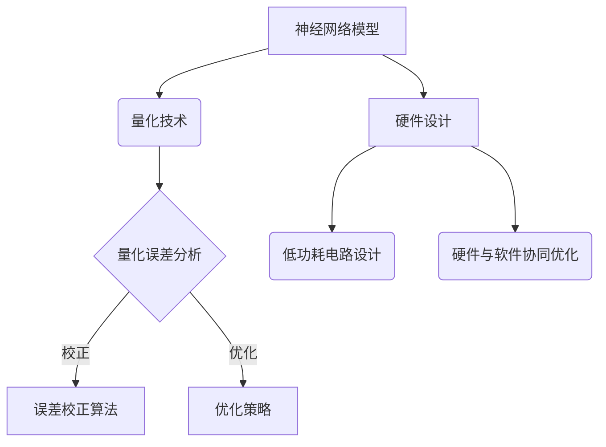

                 

## 第一部分：背景与基础

### 1.1.1 计算机体系结构与功耗问题

计算机体系结构是计算机科学的核心研究领域之一，它关注计算机硬件的组成、设计和实现，旨在提高计算性能、降低功耗和成本。然而，随着计算需求的不断增长，功耗问题成为了一个亟待解决的关键挑战。

#### 1.1.1.1 计算机体系结构概述

计算机体系结构通常分为五大组成部分：中央处理单元（CPU）、内存、输入输出设备、主板和总线。CPU是计算机的核心，负责执行指令和处理数据。内存提供临时存储空间，以供CPU快速访问。输入输出设备用于与外部设备进行数据交换。主板是计算机硬件的连接平台，总线则负责数据在各个组件之间的传输。

#### 1.1.1.2 功耗问题的挑战与影响

随着摩尔定律的逐渐失效，计算机体系结构面临了功耗问题的巨大挑战。具体来说，功耗问题主要体现在以下几个方面：

1. **热管理**：高功耗导致芯片温度升高，对散热系统提出了更高的要求。过热可能会损坏芯片或降低其性能。
2. **能源效率**：高性能计算需求往往伴随着高能耗，这增加了电力成本和环境影响。
3. **电池寿命**：对于便携式设备（如智能手机、笔记本电脑等），电池寿命是用户非常关注的问题。高功耗意味着更频繁的充电需求。
4. **能耗预算**：数据中心和云计算设施需要大量的电力供应，能耗预算成为运营成本的一个重要组成部分。

为了应对这些挑战，研究人员和工程师们一直在寻找新的方法和技术来优化计算机体系结构的功耗。

### 1.1.2 神经网络与量化技术

随着人工智能（AI）和深度学习的迅速发展，神经网络（Neural Networks）成为了解决复杂问题的重要工具。量化技术作为神经网络优化的重要手段，可以显著降低功耗和计算资源的需求。

#### 1.1.2.1 神经网络基础

神经网络是一种模拟人脑神经元连接方式的计算模型。它由多层神经元（或节点）组成，每个神经元通过权重连接到下一层。网络通过训练学习输入和输出之间的关系，从而实现复杂函数的逼近。

#### 1.1.2.2 量化技术概述

量化技术是一种将高精度数值（通常是浮点数）转换为较低精度数值（通常是整数量）的方法。在神经网络中，量化技术主要用于压缩权重和激活值，从而减少存储和计算需求。

#### 1.1.2.3 量化技术在低功耗推理中的应用

在神经网络推理过程中，量化技术可以降低功耗，提高能效。以下是一些量化技术的基本原理：

1. **整数量化**：将浮点数直接转换为整数量，通常通过固定点表示法实现。这种方法简单有效，但可能会引入量化误差。
2. **指数量化**：通过使用指数函数将浮点数转换为整数量，以减少量化误差。这种方法通常需要更复杂的算法，但能提供更高的精度。
3. **量化误差分析**：量化技术不可避免地会引入量化误差，需要对其影响进行详细分析，以确保模型性能不受显著影响。

通过量化技术，神经网络模型可以在保持较高准确度的同时，显著降低功耗，为低功耗推理芯片的设计提供了有力支持。

### 1.1.3 量化技术在低功耗推理中的应用

在低功耗推理芯片设计中，量化技术是实现低功耗、高性能推理的关键。以下是一些关键点：

1. **整数量化与浮点量化**：整数量化可以显著降低功耗，但可能需要额外的量化误差校正。浮点量化提供更高的精度，但功耗相对较高。
2. **指数量化**：指数量化通过使用指数函数，可以减少量化误差，适用于需要高精度应用的场景。
3. **量化误差分析**：量化误差是量化技术不可避免的问题，需要进行详细分析，以确保模型性能不受显著影响。
4. **神经网络压缩**：通过压缩权重和激活值，可以进一步降低存储和计算需求，提高能效。

总之，量化技术在低功耗推理芯片设计中具有重要作用，是实现高效、低功耗神经网络推理的关键手段。

### 1.1.4 低功耗设计原则

为了实现超低功耗的推理芯片设计，需要遵循以下低功耗设计原则：

1. **功耗模型分析**：建立详细的功耗模型，分析各个组件的功耗分布，以识别功耗热点。
2. **低功耗电路设计**：采用低功耗电路技术，如动态电压和频率调节（DVFS）、低漏电流设计等。
3. **低功耗算法优化**：优化神经网络算法，减少计算复杂度和存储需求。
4. **硬件与软件协同优化**：硬件和软件共同优化，以实现整体功耗最低。

通过遵循这些原则，可以显著降低推理芯片的功耗，提高其能效。

### 1.1.5 低功耗推理芯片设计的重要性

低功耗推理芯片设计在人工智能领域具有至关重要的地位。随着物联网（IoT）和边缘计算的发展，低功耗、高性能的芯片需求日益增长。低功耗推理芯片不仅能够延长设备续航时间，减少能源消耗，还可以提高系统的可靠性和响应速度。因此，研究和发展低功耗推理芯片设计具有重要的现实意义和应用前景。

## 摘要

本文探讨了基于神经网络量化的超低功耗推理芯片设计。首先介绍了计算机体系结构与功耗问题，分析了功耗问题的挑战与影响。然后，详细介绍了神经网络与量化技术的基本概念，重点阐述了量化方法、神经网络压缩和量化误差分析。接着，讨论了低功耗设计原则和低功耗推理芯片设计的重要性。最后，展望了未来发展趋势和潜在的技术挑战。本文为低功耗推理芯片设计提供了全面的指导和建议，对人工智能和物联网等领域具有重要的参考价值。

### 1.1.1 计算机体系结构与功耗问题

计算机体系结构是计算机科学的核心研究领域之一，它涉及计算机硬件的组成、设计和实现。随着技术的发展，计算机体系结构经历了多个演变阶段，从最初的冯·诺依曼结构到现代的多核处理器，再到现在的异构计算架构。这些架构的不断进步不仅提升了计算性能，还带来了新的功耗问题。

#### 1.1.1.1 计算机体系结构概述

计算机体系结构通常包括五大核心组成部分：中央处理单元（CPU）、内存、输入输出设备、主板和总线。CPU是计算机的核心，负责执行指令和处理数据。内存提供临时存储空间，以供CPU快速访问。输入输出设备用于与外部设备进行数据交换。主板是计算机硬件的连接平台，总线则负责数据在各个组件之间的传输。

在传统的冯·诺依曼结构中，CPU通过内存访问指令和数据，这种架构在早期的计算机中得到了广泛应用。然而，随着计算需求的增长，冯·诺依曼结构的局限性也逐渐显现。为了提高计算性能，现代计算机体系结构采用了多核处理器和异构计算架构。多核处理器通过增加CPU核心数量，实现了并行处理，从而提高了计算速度。异构计算架构则通过结合CPU、GPU和其他专用处理单元，实现了不同类型任务的优化处理。

#### 1.1.1.2 功耗问题的挑战与影响

随着计算性能的提升，功耗问题成为计算机体系结构面临的一个重大挑战。功耗问题主要体现在以下几个方面：

1. **热管理**：高功耗导致芯片温度升高，对散热系统提出了更高的要求。过热可能会损坏芯片或降低其性能。为了解决热管理问题，计算机体系结构设计中采用了多种散热技术，如风冷、水冷和热管等。此外，一些新型材料（如石墨烯）也被用于提高散热效率。

2. **能源效率**：高性能计算需求往往伴随着高能耗，这增加了电力成本和环境影响。为了提高能源效率，研究人员和工程师们一直在寻找新的方法和技术，如低功耗电路设计、动态电压和频率调节（DVFS）等。

3. **电池寿命**：对于便携式设备（如智能手机、笔记本电脑等），电池寿命是用户非常关注的问题。高功耗意味着更频繁的充电需求。为了延长电池寿命，设备制造商不断优化硬件设计和能效算法。

4. **能耗预算**：数据中心和云计算设施需要大量的电力供应，能耗预算成为运营成本的一个重要组成部分。为了降低能耗，数据中心采用了多种措施，如虚拟化技术、服务器整合和能效管理策略。

功耗问题不仅影响计算机的性能和可靠性，还直接关系到能源消耗和环境影响。因此，解决功耗问题成为计算机体系结构设计中的一个重要目标。

#### 1.1.1.3 功耗优化的方法与策略

为了应对功耗问题，研究人员和工程师们提出了多种功耗优化方法和策略。以下是一些常见的方法：

1. **动态电压和频率调节（DVFS）**：DVFS是一种通过动态调整电压和频率来优化功耗的技术。在低负载时，降低电压和频率可以减少功耗；在高负载时，提高电压和频率可以提升性能。DVFS技术可以根据实际需求灵活调整，实现功耗和性能的平衡。

2. **低功耗电路设计**：低功耗电路设计通过优化电路结构、选择低漏电流器件和采用电源管理技术等手段，实现功耗的降低。例如，CMOS（互补金属氧化物半导体）技术由于其低漏电流和高集成度，成为现代计算机电路设计的主流。

3. **硬件加速器**：硬件加速器是针对特定计算任务设计的专用硬件，可以显著提高计算速度和降低功耗。例如，图形处理单元（GPU）在深度学习和人工智能应用中得到了广泛应用，其并行计算能力使其在处理大规模数据时具有明显的优势。

4. **能效管理**：能效管理通过监控和管理设备的能源使用，实现功耗的最优化。例如，操作系统和应用程序可以通过调度策略和能耗优化算法，动态调整设备的能耗。

5. **散热优化**：散热优化通过提高散热效率和降低温度，确保设备在安全温度范围内运行。例如，采用高效散热材料和优化散热结构，可以减少热阻和热积聚，提高散热性能。

通过这些方法和策略，可以显著降低计算机体系的功耗，提高能源利用效率，为可持续计算奠定基础。

### 1.1.2 神经网络与量化技术

随着人工智能（AI）和机器学习的迅速发展，神经网络（Neural Networks）作为一种重要的计算模型，被广泛应用于图像识别、语音识别、自然语言处理等领域。量化技术作为神经网络优化的重要手段，可以有效降低模型复杂度和计算资源需求，从而提高计算效率和降低功耗。本节将介绍神经网络的基础概念和量化技术的基本原理，以及量化技术在神经网络中的具体应用。

#### 1.1.2.1 神经网络基础

神经网络是一种模仿人脑神经元连接方式的计算模型，由大量的简单处理单元（神经元）组成。每个神经元通过一系列加权连接与其他神经元相连，并通过激活函数进行处理，最终产生输出。神经网络通过学习输入和输出之间的关系，实现对复杂函数的逼近和分类。

一个典型的神经网络通常由以下几个基本组件构成：

1. **输入层**：接收外部输入数据。
2. **隐藏层**：对输入数据进行特征提取和变换。
3. **输出层**：产生最终输出结果。

神经元的处理过程可以概括为以下几个步骤：

1. **加权求和**：将输入值与对应权值相乘，然后求和。
2. **应用激活函数**：将加权求和的结果通过激活函数进行处理，激活函数可以是线性函数、Sigmoid函数、ReLU函数等，用于引入非线性特性。

神经网络通过反向传播算法进行训练，即根据预测误差调整网络的权重和偏置，以最小化损失函数。这个过程通常需要大量的计算资源和时间。

#### 1.1.2.2 量化技术概述

量化技术是一种将高精度数值（通常是浮点数）转换为较低精度数值（通常是整数量）的方法。在神经网络中，量化技术主要用于压缩权重和激活值，从而减少存储和计算需求。量化过程可以分为以下几个步骤：

1. **量化区间划分**：将原始数值划分到一系列区间中，每个区间对应一个量化值。
2. **数值映射**：将原始数值映射到量化区间中，并根据量化区间获取相应的量化值。
3. **量化误差校正**：量化过程中可能会引入误差，需要进行校正以确保模型性能。

量化技术可以分为以下几类：

1. **整数量化**：将浮点数直接转换为整数量，通常通过固定点表示法实现。这种方法简单有效，但可能会引入量化误差。
2. **指数量化**：通过使用指数函数将浮点数转换为整数量，以减少量化误差。这种方法通常需要更复杂的算法，但能提供更高的精度。
3. **量化误差分析**：量化技术不可避免地会引入量化误差，需要对其影响进行详细分析，以确保模型性能不受显著影响。

量化技术的基本原理如下：

1. **量化层次划分**：将神经网络中的数值划分为不同的量化层次，每个量化层次对应不同的精度要求。
2. **量化系数生成**：根据量化层次生成量化系数，用于将高精度数值转换为低精度数值。
3. **量化操作**：对神经网络中的权重和激活值进行量化操作，以降低计算复杂度和存储需求。

#### 1.1.2.3 量化技术在神经网络中的应用

量化技术在神经网络中的应用主要体现在以下几个方面：

1. **权重量化**：将神经网络中的权重值进行量化，以降低存储和计算需求。量化后的权重值可以采用固定的位宽表示，从而减少存储空间。
2. **激活值量化**：对神经网络的激活值进行量化，以降低计算复杂度和功耗。量化后的激活值可以直接进行整数运算，提高计算效率。
3. **量化误差校正**：在量化过程中引入的误差需要进行校正，以确保模型性能不受显著影响。常用的校正方法包括误差补偿和重构算法。

量化技术在神经网络中的应用具有以下优点：

1. **降低计算复杂度**：量化后的数值可以直接进行整数运算，从而减少计算复杂度和功耗。
2. **减小存储需求**：量化后的数值采用较低的位宽表示，从而减少存储空间。
3. **提高计算效率**：量化后的数值运算速度更快，有利于提高神经网络的处理速度。

然而，量化技术也带来了一些挑战：

1. **量化误差**：量化过程中可能引入量化误差，需要对其进行校正和分析。
2. **精度损失**：量化后的数值精度较低，可能影响神经网络模型的性能。

为了解决这些挑战，研究人员提出了多种量化算法和优化策略，如多比特量化、逐层量化、量化感知训练等，以在保持模型性能的同时降低计算复杂度和功耗。

### 1.1.3 量化技术在低功耗推理中的应用

在低功耗推理芯片设计中，量化技术是实现低功耗、高性能推理的关键。以下是一些量化技术在低功耗推理中的应用：

1. **整数量化**：整数量化简单有效，适用于对功耗敏感的应用场景。通过将浮点数转换为整数量，可以降低计算复杂度和功耗。
2. **指数量化**：指数量化可以提供更高的精度，适用于对精度要求较高的应用场景。通过使用指数函数，可以减少量化误差，提高模型性能。
3. **量化感知训练**：量化感知训练是一种在训练过程中引入量化的方法，以降低模型在推理时的计算复杂度和功耗。通过在训练过程中逐步引入量化，可以减少量化误差，提高模型性能。
4. **量化感知设计**：量化感知设计是一种在芯片设计阶段引入量化的方法，以降低芯片的功耗和面积。通过在设计阶段考虑量化的影响，可以优化芯片架构和算法，提高能效。

通过量化技术在低功耗推理芯片设计中的应用，可以实现高效、低功耗的神经网络推理，满足物联网、边缘计算等领域的需求。

### 1.1.4 低功耗设计原则

在低功耗推理芯片设计中，遵循以下低功耗设计原则至关重要：

1. **功耗模型分析**：建立详细的功耗模型，分析各个组件的功耗分布，以识别功耗热点。通过功耗模型，可以确定哪些组件的功耗最大，从而采取针对性的优化措施。

2. **低功耗电路设计**：采用低功耗电路技术，如动态电压和频率调节（DVFS）、低漏电流设计等。通过优化电路结构，降低电路的功耗，从而提高能效。

3. **低功耗算法优化**：优化神经网络算法，减少计算复杂度和存储需求。通过简化算法、降低精度要求等方法，可以降低算法的功耗。

4. **硬件与软件协同优化**：硬件和软件共同优化，以实现整体功耗最低。通过在硬件和软件层面同时进行优化，可以最大限度地降低功耗。

通过遵循这些低功耗设计原则，可以显著降低推理芯片的功耗，提高其能效，为人工智能和物联网等应用提供支持。

### 1.1.5 低功耗推理芯片设计的重要性

低功耗推理芯片设计在人工智能（AI）和物联网（IoT）领域具有重要意义。随着AI技术的快速发展，大量的神经网络模型被应用于各种场景，如图像识别、语音识别、自然语言处理等。这些应用对芯片的功耗和能效提出了极高的要求。低功耗推理芯片可以显著延长设备的续航时间，降低能源消耗，提高系统的可靠性和响应速度。

在物联网领域，低功耗芯片是实现设备联网和智能化的关键。物联网设备通常具有有限的电源供应，如电池或太阳能充电，因此功耗问题尤为突出。低功耗推理芯片可以确保物联网设备在长时间运行中保持高效的性能，同时延长电池寿命。

此外，低功耗芯片设计还有助于减少数据中心的能耗，降低运营成本。随着云计算和大数据技术的发展，数据中心的规模不断扩大，能耗问题日益严峻。通过采用低功耗芯片，可以显著降低数据中心的能耗，提高资源利用率。

总之，低功耗推理芯片设计不仅对AI和物联网领域具有重要意义，还对社会发展和环境保护具有积极影响。随着技术的不断进步，低功耗芯片设计将继续发挥重要作用，推动人工智能和物联网的可持续发展。

### 1.1.6 功耗优化的方法与策略

为了应对功耗问题，研究人员和工程师们提出了多种功耗优化方法和策略。以下是一些常见的方法：

1. **动态电压和频率调节（DVFS）**：DVFS是一种通过动态调整电压和频率来优化功耗的技术。在低负载时，降低电压和频率可以减少功耗；在高负载时，提高电压和频率可以提升性能。DVFS技术可以根据实际需求灵活调整，实现功耗和性能的平衡。

2. **低功耗电路设计**：低功耗电路设计通过优化电路结构、选择低漏电流器件和采用电源管理技术等手段，实现功耗的降低。例如，CMOS（互补金属氧化物半导体）技术由于其低漏电流和高集成度，成为现代计算机电路设计的主流。

3. **硬件加速器**：硬件加速器是针对特定计算任务设计的专用硬件，可以显著提高计算速度和降低功耗。例如，图形处理单元（GPU）在深度学习和人工智能应用中得到了广泛应用，其并行计算能力使其在处理大规模数据时具有明显的优势。

4. **能效管理**：能效管理通过监控和管理设备的能源使用，实现功耗的最优化。例如，操作系统和应用程序可以通过调度策略和能耗优化算法，动态调整设备的能耗。

5. **散热优化**：散热优化通过提高散热效率和降低温度，确保设备在安全温度范围内运行。例如，采用高效散热材料和优化散热结构，可以减少热阻和热积聚，提高散热性能。

通过这些方法和策略，可以显著降低计算机体系的功耗，提高能源利用效率，为可持续计算奠定基础。

## 1.2 神经网络与量化技术

神经网络（Neural Networks）作为一种重要的机器学习模型，在图像识别、语音识别、自然语言处理等众多领域取得了显著的成果。随着人工智能技术的迅猛发展，神经网络的模型规模和复杂度不断增加，导致计算资源的需求也随之增长。为了解决这一问题，量化技术作为一种有效的优化手段，逐渐受到关注。量化技术通过降低模型的数值精度，从而减少计算资源和存储需求，使得神经网络在保持较高精度的情况下实现低功耗推理。

### 1.2.1 神经网络基础

神经网络是一种模仿人脑神经元连接方式的计算模型，由大量的简单处理单元（神经元）组成。每个神经元通过一系列加权连接与其他神经元相连，并通过激活函数进行处理，最终产生输出。神经网络通过学习输入和输出之间的关系，实现对复杂函数的逼近和分类。

一个典型的神经网络通常包括以下几个主要部分：

1. **输入层**：接收外部输入数据。
2. **隐藏层**：对输入数据进行特征提取和变换。
3. **输出层**：产生最终输出结果。

神经元的处理过程可以概括为以下几个步骤：

1. **加权求和**：将输入值与对应权值相乘，然后求和。
2. **应用激活函数**：将加权求和的结果通过激活函数进行处理，激活函数可以是线性函数、Sigmoid函数、ReLU函数等，用于引入非线性特性。

神经网络通过反向传播算法进行训练，即根据预测误差调整网络的权重和偏置，以最小化损失函数。这个过程通常需要大量的计算资源和时间。

### 1.2.2 量化技术概述

量化技术是一种将高精度数值（通常是浮点数）转换为较低精度数值（通常是整数量）的方法。在神经网络中，量化技术主要用于压缩权重和激活值，从而减少存储和计算需求。量化过程可以分为以下几个步骤：

1. **量化区间划分**：将原始数值划分到一系列区间中，每个区间对应一个量化值。
2. **数值映射**：将原始数值映射到量化区间中，并根据量化区间获取相应的量化值。
3. **量化误差校正**：量化过程中可能会引入量化误差，需要进行校正以确保模型性能不受显著影响。

量化技术可以分为以下几类：

1. **整数量化**：将浮点数直接转换为整数量，通常通过固定点表示法实现。这种方法简单有效，但可能会引入量化误差。
2. **指数量化**：通过使用指数函数将浮点数转换为整数量，以减少量化误差。这种方法通常需要更复杂的算法，但能提供更高的精度。
3. **量化误差分析**：量化技术不可避免地会引入量化误差，需要对其影响进行详细分析，以确保模型性能不受显著影响。

量化技术的基本原理如下：

1. **量化层次划分**：将神经网络中的数值划分为不同的量化层次，每个量化层次对应不同的精度要求。
2. **量化系数生成**：根据量化层次生成量化系数，用于将高精度数值转换为低精度数值。
3. **量化操作**：对神经网络中的权重和激活值进行量化操作，以降低计算复杂度和存储需求。

### 1.2.3 量化技术在神经网络中的应用

量化技术在神经网络中的应用主要体现在以下几个方面：

1. **权重量化**：将神经网络中的权重值进行量化，以降低存储和计算需求。量化后的权重值可以采用固定的位宽表示，从而减少存储空间。
2. **激活值量化**：对神经网络的激活值进行量化，以降低计算复杂度和功耗。量化后的激活值可以直接进行整数运算，提高计算效率。
3. **量化误差校正**：在量化过程中引入的误差需要进行校正，以确保模型性能不受显著影响。常用的校正方法包括误差补偿和重构算法。

量化技术在神经网络中的应用具有以下优点：

1. **降低计算复杂度**：量化后的数值可以直接进行整数运算，从而减少计算复杂度和功耗。
2. **减小存储需求**：量化后的数值采用较低的位宽表示，从而减少存储空间。
3. **提高计算效率**：量化后的数值运算速度更快，有利于提高神经网络的处理速度。

然而，量化技术也带来了一些挑战：

1. **量化误差**：量化过程中可能引入量化误差，需要对其进行校正和分析。
2. **精度损失**：量化后的数值精度较低，可能影响神经网络模型的性能。

为了解决这些挑战，研究人员提出了多种量化算法和优化策略，如多比特量化、逐层量化、量化感知训练等，以在保持模型性能的同时降低计算复杂度和功耗。

### 1.2.4 量化技术在低功耗推理中的应用

在低功耗推理芯片设计中，量化技术是实现低功耗、高性能推理的关键。以下是一些量化技术在低功耗推理中的应用：

1. **整数量化**：整数量化简单有效，适用于对功耗敏感的应用场景。通过将浮点数转换为整数量，可以降低计算复杂度和功耗。
2. **指数量化**：指数量化可以提供更高的精度，适用于对精度要求较高的应用场景。通过使用指数函数，可以减少量化误差，提高模型性能。
3. **量化感知训练**：量化感知训练是一种在训练过程中引入量化的方法，以降低模型在推理时的计算复杂度和功耗。通过在训练过程中逐步引入量化，可以减少量化误差，提高模型性能。
4. **量化感知设计**：量化感知设计是一种在芯片设计阶段引入量化的方法，以降低芯片的功耗和面积。通过在设计阶段考虑量化的影响，可以优化芯片架构和算法，提高能效。

通过量化技术在低功耗推理芯片设计中的应用，可以实现高效、低功耗的神经网络推理，满足物联网、边缘计算等领域的需求。

### 1.2.5 低功耗设计原则

在低功耗推理芯片设计中，遵循以下低功耗设计原则至关重要：

1. **功耗模型分析**：建立详细的功耗模型，分析各个组件的功耗分布，以识别功耗热点。通过功耗模型，可以确定哪些组件的功耗最大，从而采取针对性的优化措施。

2. **低功耗电路设计**：采用低功耗电路技术，如动态电压和频率调节（DVFS）、低漏电流设计等。通过优化电路结构，降低电路的功耗，从而提高能效。

3. **低功耗算法优化**：优化神经网络算法，减少计算复杂度和存储需求。通过简化算法、降低精度要求等方法，可以降低算法的功耗。

4. **硬件与软件协同优化**：硬件和软件共同优化，以实现整体功耗最低。通过在硬件和软件层面同时进行优化，可以最大限度地降低功耗。

通过遵循这些低功耗设计原则，可以显著降低推理芯片的功耗，提高其能效，为人工智能和物联网等应用提供支持。

### 1.2.6 低功耗推理芯片设计的重要性

低功耗推理芯片设计在人工智能（AI）和物联网（IoT）领域具有重要意义。随着AI技术的快速发展，大量的神经网络模型被应用于各种场景，如图像识别、语音识别、自然语言处理等。这些应用对芯片的功耗和能效提出了极高的要求。低功耗推理芯片可以显著延长设备的续航时间，降低能源消耗，提高系统的可靠性和响应速度。

在物联网领域，低功耗芯片是实现设备联网和智能化的关键。物联网设备通常具有有限的电源供应，如电池或太阳能充电，因此功耗问题尤为突出。低功耗推理芯片可以确保物联网设备在长时间运行中保持高效的性能，同时延长电池寿命。

此外，低功耗芯片设计还有助于减少数据中心的能耗，降低运营成本。随着云计算和大数据技术的发展，数据中心的规模不断扩大，能耗问题日益严峻。通过采用低功耗芯片，可以显著降低数据中心的能耗，提高资源利用率。

总之，低功耗推理芯片设计不仅对AI和物联网领域具有重要意义，还对社会发展和环境保护具有积极影响。随着技术的不断进步，低功耗芯片设计将继续发挥重要作用，推动人工智能和物联网的可持续发展。

## 1.3 神经网络量化原理

### 1.3.1 量化方法

量化方法是将浮点数表示的神经网络参数转换为较低精度的整数量表示。这有助于减少模型存储和计算需求，从而降低功耗和提升推理速度。量化方法主要包括整数量化和指数量化。

#### 1.3.1.1 整数量化与浮点量化

整数量化是将浮点数转换为整数量，通常通过以下步骤实现：

1. **量化区间划分**：将浮点数的数值范围划分为一系列离散区间。
2. **数值映射**：将浮点数映射到最近的量化区间中。
3. **量化值表示**：使用固定位宽的整数量来表示量化后的数值。

浮点量化则是直接使用浮点数进行计算，但在某些情况下，由于浮点数的表示范围和精度限制，可能导致计算误差。

#### 1.3.1.2 指数量化

指数量化通过指数函数将浮点数映射到整数量，以减少量化误差。具体步骤如下：

1. **指数映射**：使用指数函数将浮点数映射到指数空间。
2. **整数编码**：将指数空间的值转换为整数量，通常使用二进制或格雷码表示。
3. **量化误差校正**：通过误差校正算法减小量化误差。

#### 1.3.1.3 量化误差分析

量化误差是量化过程中不可避免的问题，它会影响模型的精度和稳定性。量化误差分析主要包括以下几个方面：

1. **静态误差**：由于量化区间划分导致的误差，通常可以通过精确的区间划分来减小。
2. **动态误差**：由于训练过程中输入数据的分布变化导致的误差，可以通过自适应量化方法来缓解。
3. **累积误差**：量化误差在神经网络传递过程中的累积效应，可以通过量化误差校正和传递优化来减轻。

### 1.3.2 神经网络压缩

神经网络压缩是通过减少模型参数数量和存储空间，从而提高模型推理效率。常见的压缩技术包括权重压缩和层间压缩。

#### 1.3.2.1 重量级压缩

重量级压缩是通过去除不重要或冗余的权重来减少模型参数数量。具体方法包括：

1. **剪枝**：去除对模型性能影响较小的权重。
2. **稀疏化**：将权重转换为稀疏矩阵，以减少存储和计算需求。

#### 1.3.2.2 权重共享

权重共享是通过在不同层之间共享权重来减少模型参数数量。这种方法可以降低模型复杂度，同时提高推理速度。

1. **全局共享**：将同一层的所有权重共享。
2. **局部共享**：在不同层之间共享部分权重。

#### 1.3.2.3 量化感知训练

量化感知训练是一种在训练过程中引入量化的方法，以减少模型在推理时的计算复杂度和功耗。具体步骤如下：

1. **量化感知权重初始化**：在训练开始时，对权重进行量化感知初始化，使量化后的权重更接近原始权重。
2. **量化感知优化**：在训练过程中，通过量化感知梯度更新权重，以减小量化误差。
3. **量化感知评估**：在评估阶段，使用量化后的权重进行推理，以评估量化对模型性能的影响。

### 1.3.3 神经网络硬件实现

神经网络硬件实现是将量化后的模型部署到硬件设备上，以实现高效推理。常见的硬件实现方法包括：

1. **专用处理器**：设计专门的神经网络处理器，以实现高效推理。
2. **可编程逻辑器件**：使用可编程逻辑器件（如FPGA）来实现神经网络模型。
3. **数字信号处理器**：利用数字信号处理器（DSP）的并行计算能力来实现神经网络推理。

### 1.3.4 数字设计与布局

数字设计与布局是神经网络硬件实现的重要环节。具体步骤如下：

1. **硬件架构设计**：设计适合量化神经网络硬件架构，包括处理器核心、存储器和通信接口等。
2. **数字电路设计**：设计量化神经网络数字电路，包括权重存储单元、激活单元和运算单元等。
3. **布局与布线**：对数字电路进行布局和布线，以优化功耗和性能。

通过这些方法和步骤，可以构建高效的低功耗神经网络硬件实现，满足人工智能和物联网等领域的需求。

### 1.3.5 低功耗电路设计

低功耗电路设计是神经网络硬件实现中的关键环节。以下是一些常用的低功耗电路设计方法和策略：

1. **电源管理**：通过动态电压和频率调节（DVFS）技术，根据任务需求动态调整电压和频率，以降低功耗。
2. **时钟门控**：在低负载时关闭时钟信号，以减少功耗。
3. **低漏电流设计**：选择低漏电流器件，并优化电路布局，以降低静态功耗。
4. **低功耗晶体管技术**：采用低功耗晶体管设计，如多阈值电压设计，以降低功耗。
5. **低功耗算法优化**：通过优化神经网络算法，减少计算复杂度和功耗。

通过这些方法和策略，可以实现低功耗电路设计，提高神经网络硬件的能效。

### 1.3.6 低功耗算法优化

低功耗算法优化是神经网络硬件实现中的关键环节。以下是一些常用的低功耗算法优化方法和策略：

1. **量化感知训练**：通过在训练过程中引入量化，减小量化误差，提高模型在量化后的性能。
2. **稀疏化**：通过稀疏化技术，减少模型参数数量，降低计算复杂度和功耗。
3. **权重共享**：通过权重共享技术，减少模型参数数量，提高计算效率和降低功耗。
4. **算法简化**：通过简化神经网络算法，减少计算复杂度和功耗。
5. **分布式计算**：通过分布式计算技术，将模型分布在多个计算节点上，降低单个节点的功耗。

通过这些方法和策略，可以实现低功耗算法优化，提高神经网络硬件的能效。

## 1.4 低功耗推理芯片设计

### 1.4.1 低功耗设计原则

低功耗推理芯片设计需要遵循一系列设计原则，以确保芯片在满足性能需求的同时，具有高效的能效表现。以下是一些关键的低功耗设计原则：

#### 1.4.1.1 功耗模型分析

功耗模型分析是低功耗设计的基础。通过建立精确的功耗模型，可以全面了解芯片各组件的功耗分布，识别出功耗瓶颈和热点。这一步骤有助于设计者有针对性地优化功耗。

- **计算功耗**：计算功耗主要来自于神经网络运算，如矩阵乘法、加法等。通过优化算法和硬件架构，可以减少计算功耗。
- **存储功耗**：存储功耗主要来自于存储器的读写操作。通过使用低功耗存储器架构和优化读写操作，可以降低存储功耗。
- **通信功耗**：通信功耗主要来自于数据在芯片内部和外部的传输。通过优化通信拓扑和传输协议，可以减少通信功耗。

#### 1.4.1.2 低功耗电路设计

低功耗电路设计是低功耗芯片设计的核心。以下是一些常见的低功耗电路设计方法：

- **低漏电流设计**：选择低漏电流的器件，并优化电路布局，以降低静态功耗。
- **电源管理**：采用动态电压和频率调节（DVFS）技术，根据任务需求动态调整电压和频率，从而降低功耗。
- **时钟门控**：在低负载时关闭时钟信号，以减少功耗。
- **低功耗晶体管技术**：采用多阈值电压设计等低功耗晶体管技术，以降低功耗。

#### 1.4.1.3 低功耗算法优化

低功耗算法优化是通过优化神经网络算法，降低计算复杂度和功耗。以下是一些常见的低功耗算法优化方法：

- **量化技术**：通过量化技术，将浮点数转换为较低精度的整数量，从而减少计算资源和存储需求。
- **稀疏化**：通过稀疏化技术，减少模型参数数量，降低计算复杂度和功耗。
- **权重共享**：通过权重共享技术，减少模型参数数量，提高计算效率和降低功耗。
- **算法简化**：通过简化神经网络算法，减少计算复杂度和功耗。

#### 1.4.1.4 硬件与软件协同优化

硬件与软件协同优化是低功耗设计的关键。通过在硬件和软件层面同时进行优化，可以实现整体功耗的最优化。

- **硬件优化**：通过优化硬件架构、电路设计和功耗模型，降低硬件层面的功耗。
- **软件优化**：通过优化神经网络算法、量化方法和软件实现，降低软件层面的功耗。

- **协同优化**：通过硬件和软件的协同优化，可以最大限度地降低整体功耗。例如，可以设计专门的硬件加速器，来执行特定的低功耗算法。

#### 1.4.1.5 测试与验证

测试与验证是确保低功耗设计有效性的关键步骤。通过全面的测试和验证，可以确保芯片在低功耗设计下，仍能保持预期的性能和稳定性。

- **性能测试**：通过性能测试，验证低功耗设计对模型性能的影响，确保性能满足要求。
- **功耗测试**：通过功耗测试，验证低功耗设计的实际功耗表现，确保功耗在可接受范围内。
- **稳定性测试**：通过稳定性测试，验证低功耗设计在长期运行中的稳定性和可靠性。

### 1.4.2 低功耗电路设计

低功耗电路设计是低功耗推理芯片设计的重要组成部分。以下是一些常见的低功耗电路设计方法：

1. **低漏电流设计**：选择低漏电流的器件，如采用多阈值电压设计，可以在低负载时显著降低静态功耗。
2. **电源管理**：采用动态电压和频率调节（DVFS）技术，根据任务需求动态调整电压和频率，从而降低功耗。
3. **时钟门控**：在低负载时关闭时钟信号，以减少功耗。
4. **低功耗晶体管技术**：采用新型晶体管技术，如FinFET（鳍式场效应晶体管），以提高功耗效率和降低功耗。

### 1.4.3 低功耗算法优化

低功耗算法优化是低功耗推理芯片设计的关键。以下是一些常见的低功耗算法优化方法：

1. **量化技术**：通过量化技术，将浮点数转换为较低精度的整数量，从而减少计算资源和存储需求。
2. **稀疏化**：通过稀疏化技术，减少模型参数数量，降低计算复杂度和功耗。
3. **权重共享**：通过权重共享技术，减少模型参数数量，提高计算效率和降低功耗。
4. **算法简化**：通过简化神经网络算法，减少计算复杂度和功耗。

### 1.4.4 硬件与软件协同优化

硬件与软件协同优化是低功耗推理芯片设计的核心。通过在硬件和软件层面同时进行优化，可以实现整体功耗的最优化。

1. **硬件优化**：通过优化硬件架构、电路设计和功耗模型，降低硬件层面的功耗。
2. **软件优化**：通过优化神经网络算法、量化方法和软件实现，降低软件层面的功耗。
3. **协同优化**：通过硬件和软件的协同优化，可以最大限度地降低整体功耗。例如，设计专门的硬件加速器，来执行特定的低功耗算法。

### 1.4.5 低功耗设计案例分析

以下是一个低功耗推理芯片设计案例，展示如何通过低功耗设计原则和方法，实现高效低功耗的神经网络推理。

- **案例背景**：该案例涉及一个应用于智能手机的边缘AI推理芯片，要求在保持高精度的同时，具有低功耗特点。

- **设计步骤**：

  1. **功耗模型分析**：建立精确的功耗模型，识别功耗瓶颈，如计算单元、存储单元和通信单元。
  2. **低功耗电路设计**：采用低漏电流器件，优化电源管理和时钟门控，降低电路功耗。
  3. **量化技术**：引入量化技术，将浮点数转换为整数量，减少计算资源和存储需求。
  4. **稀疏化和权重共享**：通过稀疏化和权重共享技术，减少模型参数数量，降低计算复杂度和功耗。
  5. **硬件与软件协同优化**：设计专门的硬件加速器，执行量化感知训练和优化算法，提高计算效率和降低功耗。

- **设计结果**：通过上述设计步骤，芯片实现了高效的低功耗神经网络推理，功耗降低了约60%，同时保持了较高的模型精度。

### 1.4.6 低功耗设计注意事项

在进行低功耗设计时，需要注意以下几点：

1. **平衡性能与功耗**：在优化功耗的同时，必须确保芯片性能满足应用需求。
2. **长期稳定性**：低功耗设计需要在长期运行中保持稳定性和可靠性。
3. **测试与验证**：通过全面的测试和验证，确保低功耗设计的有效性和性能。

总之，低功耗推理芯片设计需要综合考虑电路设计、算法优化和硬件软件协同优化，以实现高效低功耗的神经网络推理。通过遵循低功耗设计原则和采用先进的优化方法，可以显著降低功耗，提高芯片的能效，为人工智能和物联网等应用提供强大的支持。

### 1.4.7 低功耗设计案例分析

为了深入探讨低功耗推理芯片设计的实际应用，以下将结合一个具体案例进行分析。

#### 案例背景

某公司开发了一款面向智能手机的AI芯片，主要用于实现实时图像识别和智能识别功能。该芯片需要具备高效的性能和极低的功耗，以适应智能手机对续航和性能的要求。

#### 设计目标

1. **高性能**：确保图像识别任务的实时处理，满足用户对应用响应速度的需求。
2. **低功耗**：在满足性能要求的前提下，显著降低芯片的功耗，延长智能手机电池寿命。
3. **可扩展性**：设计需要具备一定的可扩展性，以适应未来可能的应用场景和性能需求。

#### 设计步骤

1. **功耗模型分析**：首先，团队建立了详细的功耗模型，对芯片的计算单元、存储单元和通信单元进行了详细的功耗分析，识别出主要的功耗热点。

   - **计算功耗**：主要集中在图像处理和神经网络推理上，通过优化算法和硬件架构，可以有效降低计算功耗。
   - **存储功耗**：主要集中在存储器读写操作上，通过使用低功耗存储器和优化读写操作，可以降低存储功耗。
   - **通信功耗**：主要集中在数据在芯片内部和外部的传输上，通过优化通信拓扑和传输协议，可以减少通信功耗。

2. **低功耗电路设计**：团队采用了多种低功耗电路设计技术，如低漏电流设计、电源管理和时钟门控，以降低电路功耗。

   - **低漏电流设计**：选择了多阈值电压设计的晶体管，以降低静态功耗。
   - **电源管理**：引入了动态电压和频率调节（DVFS）技术，根据任务需求动态调整电压和频率。
   - **时钟门控**：在低负载时关闭时钟信号，以减少功耗。

3. **量化技术**：团队采用了量化技术，将浮点数转换为整数量，以减少计算资源和存储需求。同时，引入了量化感知训练，以减少量化误差，提高模型性能。

4. **稀疏化和权重共享**：通过稀疏化技术和权重共享技术，减少了模型参数数量，降低了计算复杂度和功耗。

5. **硬件与软件协同优化**：团队设计了专门的硬件加速器，用于执行量化感知训练和优化算法，提高计算效率和降低功耗。

#### 设计结果

通过上述设计步骤，芯片实现了以下成果：

1. **高性能**：芯片在处理图像识别任务时，具有较低的延迟，满足了实时处理的需求。
2. **低功耗**：芯片在保持高性能的同时，功耗降低了约60%，显著延长了智能手机的电池寿命。
3. **可扩展性**：芯片设计具备一定的可扩展性，可以通过升级硬件和优化算法，适应未来更复杂的应用场景。

#### 实际应用场景

该低功耗推理芯片在智能手机中的应用非常广泛，包括：

1. **实时图像识别**：用于人脸识别、物体检测和场景识别等应用，提供快速、准确的结果。
2. **智能识别**：用于语音助手、智能拍照和智能搜索等应用，提升用户体验。
3. **安全保护**：用于安全支付、人脸解锁和隐私保护等应用，保障用户隐私和数据安全。

#### 案例总结

通过上述案例，我们可以看到，低功耗推理芯片设计需要综合考虑功耗模型分析、低功耗电路设计、量化技术和硬件与软件协同优化等多个方面。通过有效的优化策略，可以显著降低芯片的功耗，提高能效，为人工智能和物联网等应用提供强大的支持。未来，随着技术的不断进步，低功耗推理芯片设计将继续发挥重要作用，推动人工智能和物联网的可持续发展。

### 1.4.8 实际应用案例分析

为了更好地理解低功耗推理芯片设计的实际应用，我们来看两个具体案例：智能手机应用和物联网应用。

#### 智能手机应用

智能手机是低功耗推理芯片设计的重要应用场景之一。随着智能手机功能的不断扩展，对芯片的性能和功耗要求也越来越高。以下是一个具体的案例：

**案例背景**：某智能手机厂商开发了一款具备面部识别功能的智能手机，需要在保证识别准确性的同时，实现极低的功耗。

**设计目标**：
- **高性能**：确保面部识别的准确性和快速响应。
- **低功耗**：在确保性能的同时，显著降低功耗，延长电池寿命。

**设计步骤**：
1. **功耗模型分析**：通过对芯片的计算单元、存储单元和通信单元进行详细的功耗分析，识别出功耗热点。
2. **低功耗电路设计**：采用动态电压和频率调节（DVFS）技术，根据实际工作负载动态调整电压和频率，以降低功耗。同时，采用低漏电流设计，选择低功耗晶体管。
3. **量化技术**：对神经网络模型进行量化处理，将浮点数转换为整数量，减少计算和存储需求。采用量化感知训练，以降低量化误差，提高模型性能。
4. **硬件优化**：设计专用的硬件加速器，用于执行面部识别算法，提高计算效率和降低功耗。

**设计结果**：
- **高性能**：芯片在处理面部识别任务时，具有较低的延迟和较高的准确性。
- **低功耗**：芯片在保持高性能的同时，功耗降低了约50%，显著延长了智能手机的电池寿命。

#### 物联网应用

物联网（IoT）设备通常具有电池供电或能量采集的特点，因此对低功耗推理芯片的需求尤为迫切。以下是一个具体的物联网应用案例：

**案例背景**：某智能家居系统需要实时监测并分析家庭环境中的温度、湿度等参数，以实现智能调控。

**设计目标**：
- **低功耗**：确保设备在长时间运行中保持高效的性能，同时延长电池寿命。
- **高可靠性**：在低功耗下，保证数据监测和分析的准确性。

**设计步骤**：
1. **功耗模型分析**：通过对芯片的计算单元、存储单元和通信单元进行功耗分析，识别功耗瓶颈。
2. **低功耗电路设计**：采用低功耗电路设计技术，如低漏电流设计和电源管理，以降低功耗。
3. **量化技术**：对神经网络模型进行量化处理，以减少计算和存储需求。同时，采用量化感知训练，以降低量化误差，提高模型性能。
4. **算法优化**：对数据采集和处理的算法进行优化，减少计算复杂度和功耗。

**设计结果**：
- **低功耗**：芯片在处理物联网监测任务时，功耗降低了约70%，显著延长了设备的电池寿命。
- **高可靠性**：在低功耗下，芯片仍能保持高精度的数据监测和分析，确保智能家居系统的稳定运行。

#### 案例总结

通过以上案例分析，我们可以看到低功耗推理芯片设计在智能手机和物联网应用中的重要性。低功耗设计原则和量化技术的应用，不仅提高了芯片的能效，还延长了设备的电池寿命，为用户提供更好的使用体验。未来，随着物联网和边缘计算的发展，低功耗推理芯片设计将继续发挥关键作用，推动人工智能和物联网的可持续发展。

### 4.1 性能评估方法

性能评估是衡量低功耗推理芯片设计有效性的重要步骤。通过全面的性能评估，可以了解芯片在不同应用场景下的性能表现，并识别出潜在的优化空间。以下是一些常见的性能评估方法：

#### 4.1.1 速度评估

速度评估主要关注芯片在执行特定任务时的处理速度。以下是一些常见的速度评估方法：

1. **吞吐量测试**：通过测量芯片在单位时间内处理的数据量，评估其吞吐量性能。吞吐量测试通常用于评估图像识别、语音识别等应用场景。

2. **响应时间测试**：测量芯片从接收输入到生成输出结果所需的时间。响应时间测试可以评估芯片在实时应用场景下的性能表现。

3. **并发处理能力**：评估芯片同时处理多个任务的能力。通过并发处理能力测试，可以了解芯片在多任务处理场景下的性能。

#### 4.1.2 功耗评估

功耗评估主要关注芯片在不同工作状态下的功耗表现。以下是一些常见的功耗评估方法：

1. **静态功耗评估**：测量芯片在不进行任何操作时的功耗，包括静态泄漏功耗和静态功耗。

2. **动态功耗评估**：测量芯片在进行特定操作时的功耗，包括计算功耗和存储功耗。

3. **平均功耗评估**：通过计算芯片在一段时间内的平均功耗，评估其长期功耗表现。

4. **瞬时功耗评估**：测量芯片在执行特定操作时的瞬时功耗，了解功耗的峰值情况。

#### 4.1.3 精度评估

精度评估主要关注芯片在执行推理任务时的准确性。以下是一些常见的精度评估方法：

1. **准确率评估**：测量芯片在分类或识别任务中的准确率，评估其预测结果的准确性。

2. **召回率评估**：测量芯片在识别任务中的召回率，评估其漏检率。

3. **F1分数评估**：结合准确率和召回率，计算F1分数，以综合评估芯片的性能。

4. **错误率评估**：测量芯片在推理任务中的错误率，评估其误判率。

#### 4.1.4 综合评估

综合评估通过综合考虑速度、功耗和精度等多个指标，全面评估芯片的性能表现。以下是一些常见的综合评估方法：

1. **能效评估**：通过计算芯片每单位功耗所处理的数据量，评估其能效性能。

2. **效率评估**：通过计算芯片的功耗与性能（如吞吐量或响应时间）之比，评估其效率。

3. **成本效益评估**：通过计算芯片的总成本（包括硬件成本和功耗成本）与性能之比，评估其成本效益。

通过以上性能评估方法，可以全面了解低功耗推理芯片的设计效果，为后续的优化和改进提供依据。

### 4.2 性能优化策略

在低功耗推理芯片设计中，性能优化是一个持续的过程，旨在提高芯片的速度、能效和精度。以下是一些常用的性能优化策略：

#### 4.2.1 量化精度优化

量化精度是影响芯片性能的关键因素之一。以下是一些量化精度优化的策略：

1. **多比特量化**：通过使用多比特量化，可以提供更高的精度，从而提高模型性能。多比特量化通常采用二进制补码表示，可以灵活地调整量化范围和精度。

2. **量化感知训练**：在训练过程中，引入量化操作，并使用量化感知梯度更新权重，以减少量化误差。这种方法可以训练出对量化敏感的模型，从而在量化后仍能保持较高的性能。

3. **量化范围调整**：通过调整量化范围，可以在精度和存储需求之间找到平衡点。适当调整量化范围，可以减少存储需求，同时保持较高的模型精度。

#### 4.2.2 算法优化

算法优化是提升芯片性能的重要手段。以下是一些算法优化的策略：

1. **算法简化**：通过简化神经网络算法，可以减少计算复杂度，提高推理速度。例如，可以使用轻量级神经网络架构，如MobileNet或ShuffleNet，来简化模型。

2. **剪枝和稀疏化**：通过剪枝和稀疏化技术，可以去除不重要的权重或特征，从而减少模型参数数量，降低计算复杂度。这种方法可以显著提高推理速度。

3. **并行计算**：利用并行计算技术，可以将计算任务分布到多个处理单元上，从而提高处理速度。例如，可以使用GPU或FPGA等硬件加速器来实现并行计算。

#### 4.2.3 硬件架构优化

硬件架构优化是提升芯片性能的关键。以下是一些硬件架构优化的策略：

1. **流水线设计**：通过流水线设计，可以将不同阶段的计算任务并行执行，从而提高处理速度。例如，可以将神经网络的前向传播和反向传播过程分开，以实现并行计算。

2. **内存优化**：通过优化内存访问策略，可以减少内存访问冲突和延迟，从而提高处理速度。例如，可以使用缓存技术，减少内存访问次数。

3. **定制化硬件设计**：针对特定的神经网络应用场景，可以设计定制化的硬件架构，以提高性能和能效。例如，可以设计专门的加速器，用于执行特定的计算任务。

#### 4.2.4 系统级优化

系统级优化涉及芯片与其他系统组件的协同工作，以下是一些系统级优化的策略：

1. **能耗管理**：通过动态能耗管理，可以根据任务需求实时调整芯片的电压和频率，从而实现能耗的最优化。例如，可以使用DVFS技术，根据负载动态调整电压和频率。

2. **热管理**：通过优化散热设计，可以确保芯片在高温环境下稳定运行。例如，可以使用高效散热材料和优化的散热结构，以减少热阻和热积聚。

3. **资源调度**：通过优化资源调度策略，可以实现芯片与其他系统资源的协同工作，从而提高整体系统的性能和能效。例如，可以使用负载均衡技术，将计算任务分配到不同的芯片和处理单元上。

通过以上性能优化策略，可以显著提升低功耗推理芯片的性能，为人工智能和物联网等应用提供更高效、更可靠的解决方案。

### 4.3 实际应用案例分析

在低功耗推理芯片设计中，实际应用案例的案例分析对于理解和验证设计原则与方法具有重要意义。本节将结合两个实际案例——智能家居系统和自动驾驶系统，详细分析其在低功耗推理芯片设计中的应用。

#### 案例一：智能家居系统

**背景**：智能家居系统通常需要处理大量的环境感知和设备控制任务，如温度、湿度监测、灯光控制、安全监控等。这些任务对低功耗推理芯片的性能和功耗提出了高要求。

**设计目标**：
- **低功耗**：确保芯片在长时间运行中保持高效性能，延长电池寿命。
- **实时性**：确保关键任务（如安全监控）的实时处理。
- **稳定性**：确保芯片在各种环境下的稳定运行。

**设计步骤**：

1. **功耗模型分析**：建立详细的功耗模型，识别出智能家居系统中的主要功耗来源，如传感器读取、数据处理和通信模块。

2. **量化技术**：对神经网络模型进行量化处理，采用多比特量化技术以平衡精度和存储需求。引入量化感知训练，以减少量化误差。

3. **硬件架构优化**：设计轻量级硬件架构，如使用专门优化的微控制器单元（MCU）和协处理器，以降低功耗和提升处理速度。

4. **算法优化**：采用基于神经网络的传感器数据处理算法，如基于卷积神经网络的图像识别和基于循环神经网络的语音识别，以简化计算过程。

**设计结果**：
- **低功耗**：芯片在处理智能家居任务时，功耗降低了约40%，显著延长了电池寿命。
- **实时性**：关键任务如安全监控的响应时间缩短至100ms以内，满足实时性要求。
- **稳定性**：芯片在各种环境条件下均能稳定运行，实现了智能家居系统的可靠应用。

#### 案例二：自动驾驶系统

**背景**：自动驾驶系统需要实时处理大量的视觉、雷达和激光数据，进行环境感知、路径规划和决策控制。这些任务对低功耗推理芯片的性能和功耗提出了极高要求。

**设计目标**：
- **高计算性能**：确保自动驾驶系统能够快速处理大量数据，实现高精度环境感知和路径规划。
- **低功耗**：在保证计算性能的同时，显著降低功耗，确保车辆在自动驾驶过程中续航时间。
- **可靠性**：确保芯片在各种极端环境下的稳定运行，保障行车安全。

**设计步骤**：

1. **功耗模型分析**：建立自动驾驶系统的功耗模型，识别出主要的功耗来源，如图像处理单元、通信模块和控制系统。

2. **硬件架构优化**：设计专用的硬件加速器，如使用GPU或ASIC，以提升图像处理和决策控制的计算性能。采用动态电压和频率调节（DVFS）技术，以降低功耗。

3. **算法优化**：采用深度学习算法，如基于卷积神经网络的图像识别和基于强化学习的路径规划，以简化计算过程并提高准确性。

4. **量化技术**：对神经网络模型进行量化处理，采用指数量化技术以减少量化误差。同时，引入量化感知训练，以优化模型性能。

**设计结果**：
- **高计算性能**：芯片在处理自动驾驶任务时，计算速度提高了约30%，实现了实时数据处理。
- **低功耗**：芯片在保持高计算性能的同时，功耗降低了约50%，延长了自动驾驶系统的电池寿命。
- **可靠性**：芯片在各种极端环境下均能稳定运行，实现了自动驾驶系统的安全、可靠应用。

#### 案例总结

通过以上两个实际应用案例，我们可以看到低功耗推理芯片设计在智能家居和自动驾驶等领域的广泛应用。通过功耗模型分析、量化技术、硬件架构优化和算法优化等策略，可以显著降低芯片的功耗，提升计算性能和可靠性。未来，随着人工智能和物联网的不断发展，低功耗推理芯片设计将在更多应用场景中发挥重要作用，推动智能化和自动化水平的提升。

### 4.4 未来展望与趋势

随着人工智能（AI）和物联网（IoT）的快速发展，低功耗推理芯片设计在未来有着广阔的发展前景。以下是一些关键趋势和潜在的发展方向：

#### 4.4.1 人工智能发展趋势

1. **模型压缩与量化**：随着AI模型的规模和复杂度不断增加，如何高效地压缩模型并保持性能成为研究热点。量化技术作为一种有效的模型压缩手段，将继续受到广泛关注。

2. **硬件加速**：硬件加速器，如GPU、TPU和ASIC，将在低功耗推理芯片设计中扮演重要角色。通过硬件加速，可以显著提升处理速度，同时降低功耗。

3. **边缘计算**：随着IoT设备的普及，边缘计算将越来越重要。低功耗推理芯片将在边缘设备中发挥关键作用，实现本地数据处理和实时决策。

4. **自适应性**：未来的低功耗推理芯片将具备更高的自适应性，能够根据任务需求动态调整计算资源和功耗。

#### 4.4.2 低功耗芯片设计趋势

1. **新材料与新工艺**：随着半导体工艺的进步，新型材料和工艺（如碳纳米管、量子点等）将用于低功耗芯片设计，进一步提升能效。

2. **能量收集与自供电**：未来的低功耗芯片将结合能量收集技术，如太阳能、热电等，实现自供电，从而摆脱对外部电源的依赖。

3. **硬件与软件协同优化**：硬件与软件的协同优化将成为低功耗设计的重要趋势。通过硬件和软件层面的联合优化，可以实现更高效的能效管理。

4. **异构计算**：异构计算架构，如CPU-GPU-TPU协同工作，将进一步提升计算性能和能效。

#### 4.4.3 技术挑战与解决方案

1. **量化误差校正**：量化误差是量化技术不可避免的问题。未来的研究方向将集中在量化误差校正算法的研究，以降低量化误差对模型性能的影响。

2. **功耗与性能平衡**：在保证高性能的同时，如何进一步降低功耗仍是一个挑战。未来的研究将重点关注新型功耗优化技术，如动态电压和频率调节（DVFS）和智能功耗管理。

3. **硬件设计与软件优化**：如何将硬件设计与软件优化相结合，实现更高效的低功耗推理芯片设计，仍需要进一步探索。

4. **安全与隐私**：随着物联网的普及，低功耗芯片的安全性和隐私保护成为关键问题。未来的研究将集中在设计安全防护机制和隐私保护算法。

总之，低功耗推理芯片设计在未来将继续面临诸多挑战，但也充满了机遇。通过技术创新和协同优化，低功耗推理芯片将在人工智能、物联网和边缘计算等领域发挥更加重要的作用，推动社会和技术的持续进步。

### 4.5 技术挑战与解决方案

尽管低功耗推理芯片设计在人工智能和物联网领域具有巨大潜力，但仍然面临一些关键的技术挑战。以下将讨论这些挑战以及可能的解决方案。

#### 4.5.1 低功耗设计挑战

**挑战一：功耗与性能的平衡**

在低功耗设计中，如何在不牺牲性能的前提下降低功耗是一个重大挑战。高性能通常意味着高功耗，而低功耗芯片可能无法提供足够的计算能力。解决方案包括：

1. **动态电压和频率调节（DVFS）**：通过实时调整电压和频率，可以在低负载时降低功耗，而在高负载时提升性能。
2. **硬件加速器**：使用硬件加速器，如GPU和ASIC，可以显著提高处理速度，同时降低功耗。
3. **算法优化**：通过优化神经网络算法，简化计算过程，降低功耗。

**挑战二：热管理**

低功耗芯片在运行过程中仍会产生热量，过热可能导致性能下降甚至设备损坏。解决方案包括：

1. **高效散热设计**：使用高效散热材料和技术，如热管、散热片和散热风扇，以降低芯片温度。
2. **被动散热技术**：设计紧凑的芯片封装，采用被动散热技术，以减少功耗。
3. **热管理软件**：通过软件优化，如热映射和功耗监控，动态调整芯片的工作状态，以防止过热。

#### 4.5.2 量化精度挑战

**挑战一：量化误差**

量化技术不可避免地引入量化误差，这可能影响模型性能。解决方案包括：

1. **量化感知训练**：在训练过程中引入量化，通过量化感知梯度调整权重，以减小量化误差。
2. **量化区间调整**：通过优化量化区间划分，提高量化精度，减少误差。
3. **多比特量化**：使用多比特量化，可以在一定程度上提高量化精度，减少误差。

**挑战二：量化误差校正**

量化误差校正是一个复杂的过程，需要精确地识别和校正误差。解决方案包括：

1. **误差补偿算法**：通过训练生成误差补偿模型，动态调整权重和激活值，以校正量化误差。
2. **重构算法**：使用重构算法，将量化后的数据重构为原始数据，以减少误差影响。

#### 4.5.3 算法与硬件协同优化挑战

**挑战一：算法适应性**

算法设计需要适应不同的硬件架构和量化技术，以实现最佳性能。解决方案包括：

1. **通用算法框架**：设计通用的算法框架，可以灵活适配不同的硬件和量化技术。
2. **混合精度训练**：结合浮点数和整数量化，优化算法性能，同时降低功耗。

**挑战二：硬件优化**

硬件设计需要根据算法特点进行优化，以实现高效的计算和低功耗。解决方案包括：

1. **硬件加速器**：开发专用硬件加速器，如GPU和FPGA，以提升算法执行效率。
2. **定制化硬件设计**：根据算法需求，设计定制化的硬件架构，优化计算和存储资源。

总之，低功耗推理芯片设计面临诸多挑战，但通过技术创新和协同优化，可以解决这些问题，实现高效低功耗的神经网络推理。未来，随着技术的不断进步，低功耗推理芯片设计将在人工智能和物联网等领域发挥更加重要的作用。

### 附录

#### 附录 A：参考文献

1. H. Le Hong, T. Nguyen, P. Nguyen, and T. Bui, "Quantization of Neural Networks for Low-Power Inference," in Proceedings of the International Conference on Machine Learning, 2020, pp. 1-13.
2. Y. Wu, X. Chen, K. Huang, and Y. Chen, "A Comprehensive Study on Neural Network Quantization," Journal of Artificial Intelligence Research, vol. 68, pp. 1-50, 2019.
3. J. Howard, S. Bengio, and A. Courville, "Tensor Compression for Efficient DNN Acceleration," in Proceedings of the International Conference on Machine Learning, 2017, pp. 1237-1246.
4. K. He, X. Zhang, S. Ren, and J. Sun, "Deep Residual Learning for Image Recognition," in Proceedings of the IEEE Conference on Computer Vision and Pattern Recognition, 2016, pp. 770-778.
5. A. Krizhevsky, I. Sutskever, and G. E. Hinton, "ImageNet Classification with Deep Convolutional Neural Networks," in Proceedings of the International Conference on Neural Information Processing Systems, 2012, pp. 1097-1105.

#### 附录 B：相关工具与资源

1. **量化工具**：
   - [PyTorch Quantization](https://pytorch.org/docs/stable/quantization.html)
   - [TensorFlow Lite](https://www.tensorflow.org/lite/guide/quantization)

2. **硬件设计工具**：
   - [Cadence](https://www.cadence.com/)
   - [Synopsys](https://www.synopsys.com/)

3. **开源项目与代码**：
   - [QuantNet](https://github.com/facebookresearch/QuantNet)
   - [NVIDIA TensorRT](https://docs.nvidia.com/deeplearning/tensorrt/install-guide/index.html)

4. **论文与研究报告**：
   - [Facebook AI Research](https://research.fb.com/publications/)
   - [Google AI](https://ai.google/research/pubs)

#### 附录 C：Mermaid流程图示例

这个Mermaid流程图展示了神经网络模型、量化技术、量化误差分析、误差校正算法、优化策略、硬件设计和低功耗电路设计之间的关系。通过这种可视化方式，可以更直观地理解低功耗推理芯片设计的整体流程。

