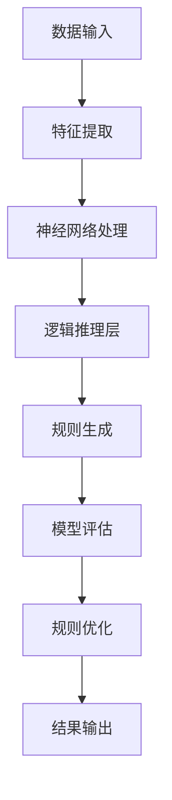

                 

### 引言

在当今快速发展的信息技术时代，人工智能（AI）已经逐渐成为各个行业的重要驱动力。而其中，自适应规则学习作为一种先进的机器学习技术，正日益受到学术界和工业界的广泛关注。自适应规则学习通过不断调整和优化规则，使系统在动态环境中能够自我适应和自我完善，从而提高其决策能力和应对复杂问题的能力。

随着深度学习、神经网络等技术的不断发展，神经逻辑编程（Neural Logic Programming，NLP）作为一种融合了神经科学和逻辑编程的新型方法，逐渐成为自适应规则学习研究的一个重要方向。神经逻辑编程结合了神经网络的强大计算能力和逻辑编程的精确推理能力，为自适应规则学习提供了一种全新的思路。

本文旨在探讨基于神经逻辑编程的自适应规则学习。我们将从以下几个方面进行详细阐述：

1. **神经逻辑编程的概念**：介绍神经逻辑编程的基本概念，包括其发展背景、核心原理和应用场景。
2. **自适应规则学习的原理**：探讨自适应规则学习的基本概念，分析传统自适应规则的局限性，并介绍基于神经逻辑编程的自适应规则学习。
3. **神经逻辑编程算法**：详细讲解常见的神经逻辑编程算法，包括自适应规则学习算法，并进行比较和优化。
4. **数学模型与数学公式**：介绍神经网络和逻辑编程中的数学模型，以及自适应规则学习中的关键数学公式。
5. **实际案例与应用**：通过具体案例，展示神经逻辑编程在自适应规则学习中的实际应用，并进行详细讲解。
6. **总结与展望**：对本文的核心内容进行总结，展望神经逻辑编程在自适应规则学习领域的未来发展趋势和研究方向。

通过以上内容，我们希望能够为读者提供一个全面、深入的关于基于神经逻辑编程的自适应规则学习的认识，并激发对该领域的研究兴趣和探索热情。

### 关键词

- **神经逻辑编程（Neural Logic Programming）**
- **自适应规则学习（Adaptive Rule Learning）**
- **神经网络（Neural Networks）**
- **逻辑编程（Logic Programming）**
- **机器学习（Machine Learning）**
- **深度学习（Deep Learning）**
- **动态环境适应（Dynamic Environment Adaptation）**

### 摘要

本文重点探讨了基于神经逻辑编程的自适应规则学习。首先，我们介绍了神经逻辑编程的基本概念和其在自适应规则学习中的应用背景。接着，分析了自适应规则学习的基本原理，指出了传统自适应规则的局限性，并提出了基于神经逻辑编程的自适应规则学习解决方案。随后，我们详细讲解了常见的神经逻辑编程算法，包括自适应规则学习算法，并进行比较和优化。文章还介绍了神经网络和逻辑编程中的数学模型，以及自适应规则学习中的关键数学公式。通过具体案例，展示了神经逻辑编程在自适应规则学习中的实际应用，并进行了详细讲解。最后，对本文的核心内容进行了总结，并对未来研究方向进行了展望。本文旨在为读者提供一个全面、深入的关于基于神经逻辑编程的自适应规则学习的认识，推动该领域的研究和应用。

### 第1章 引言

#### 神经逻辑编程的概念

神经逻辑编程（Neural Logic Programming，简称NLP）是一种将神经网络和逻辑编程相结合的计算范式。它起源于20世纪80年代，随着人工智能（AI）和计算机科学的发展而逐渐兴起。神经逻辑编程的核心理念在于将神经网络的强大计算能力和逻辑编程的精确推理能力相结合，使得系统能够在处理复杂任务时既具备强大的计算能力，又能进行精确的逻辑推理。

神经逻辑编程的核心构成包括神经网络和逻辑编程两部分。神经网络部分负责数据的建模和特征提取，通过学习输入数据中的规律和模式，生成相应的输出。逻辑编程部分则负责对神经网络生成的结果进行逻辑推理和决策。这种结合使得系统在处理问题时能够既依赖神经网络的强大计算能力，又利用逻辑编程的精确推理能力，从而提高系统的智能水平和决策能力。

#### 自适应规则学习的背景

自适应规则学习（Adaptive Rule Learning）是一种能够根据环境变化自动调整和优化规则的机器学习方法。它起源于对传统规则系统的改进，旨在解决传统规则系统在处理动态环境变化时的局限性。传统规则系统通常依赖于预定义的规则集，这些规则集在静态环境中表现良好，但在面对动态环境变化时，往往难以适应，导致性能下降。

自适应规则学习通过引入机器学习技术，能够自动从数据中学习出规则，并根据环境的变化实时调整和优化这些规则，从而提高系统的自适应能力和鲁棒性。这种方法在许多领域，如金融、医疗、交通等，都得到了广泛应用。例如，在金融领域，自适应规则学习可以用于风险管理，通过实时分析市场数据，自动调整投资策略，提高投资收益；在医疗领域，自适应规则学习可以用于疾病诊断，通过学习患者的病史和临床表现，自动生成诊断规则，提高诊断准确率。

#### 神经逻辑编程在自适应规则学习中的应用

神经逻辑编程在自适应规则学习中的应用，为解决传统自适应规则学习的局限性提供了新的思路。通过将神经逻辑编程引入自适应规则学习，可以实现以下优势：

1. **强大的计算能力**：神经网络部分能够通过深度学习技术，从大量数据中自动提取特征和模式，为自适应规则学习提供了丰富的知识基础。

2. **精确的逻辑推理**：逻辑编程部分能够对神经网络提取的特征和模式进行精确的逻辑推理，生成可靠的决策规则。

3. **动态环境适应**：神经逻辑编程的自适应机制能够根据环境变化实时调整和优化规则，提高系统的自适应能力和鲁棒性。

4. **多领域应用**：神经逻辑编程的通用性使得它可以在多个领域，如金融、医疗、交通等，实现自适应规则学习，提高各个领域的智能化水平。

总之，神经逻辑编程为自适应规则学习提供了一种全新的方法，通过结合神经网络的计算能力和逻辑编程的推理能力，能够实现动态环境下的自适应规则学习，从而提高系统的智能水平和应用价值。

### 第2章 神经逻辑编程基础

#### 神经网络的基本原理

神经网络（Neural Networks）是一种模仿人脑神经元结构和功能的计算模型，通过多个神经元的层次结构实现信息的处理和传递。神经网络的基本原理可以概括为以下几个关键部分：

1. **神经元结构**：每个神经元由输入层、输出层和隐藏层组成。输入层接收外部信息，隐藏层通过加权求和和激活函数处理信息，输出层生成最终结果。
   
2. **加权求和**：每个输入信号通过相应的权重与神经元相连，这些信号的加权和决定了神经元是否会被激活。即：$z = \sum_{i} w_{i}x_{i} + b$，其中$w_{i}$为权重，$x_{i}$为输入信号，$b$为偏置。

3. **激活函数**：激活函数用于确定神经元是否被激活。常见的激活函数包括线性函数（恒等函数）、Sigmoid函数、ReLU函数和Tanh函数等。这些函数能够将神经元的加权和转换为概率分布，从而实现非线性变换。

4. **反向传播算法**：神经网络通过反向传播算法更新权重和偏置，以最小化预测误差。具体步骤如下：
   - 前向传播：将输入信号通过神经网络传递到输出层，计算输出结果和误差。
   - 反向传播：计算误差梯度，并沿着网络反向传递，更新权重和偏置。
   - 重复迭代：通过多次迭代，逐步减小误差，提高网络性能。

通过以上基本原理，神经网络能够从大量数据中自动提取特征和模式，实现复杂的非线性任务。

#### 逻辑编程的基本概念

逻辑编程（Logic Programming）是一种基于逻辑的编程范式，其核心思想是通过定义一组逻辑规则，利用逻辑推理机制求解问题。逻辑编程的基本概念包括：

1. **谓词逻辑**：逻辑编程的基础是谓词逻辑，它通过定义一组谓词（如P(x)，表示x满足某种条件）来描述问题。谓词逻辑的基本操作包括合取（AND）、析取（OR）和蕴涵（IF-THEN）。

2. **演绎推理**：逻辑编程通过演绎推理机制，从一组已知的事实和规则中推导出新的结论。例如，如果已知A且B为真，则可以推导出A或B为真。

3. **解空间搜索**：逻辑编程中的推理过程通常涉及解空间搜索，即通过搜索所有可能的解，找到满足目标条件的最优解。常用的搜索算法包括回溯搜索、宽度优先搜索和A*搜索等。

4. **数据绑定**：在逻辑编程中，变量通过数据绑定与具体值关联，从而实现动态编程。例如，通过模式匹配，可以将变量与具体的数据值绑定，从而推导出新的结论。

逻辑编程的强大在于其能够通过逻辑推理机制，自动解决复杂问题，并且具有较高的可解释性和可靠性。

#### 神经逻辑编程的架构

神经逻辑编程将神经网络和逻辑编程相结合，形成了一种新的计算范式。其架构通常包括以下几个关键部分：

1. **神经网络层**：神经网络层用于数据的建模和特征提取。通过多层神经网络结构，可以实现对输入数据的深层特征提取和复杂模式识别。

2. **逻辑推理层**：逻辑推理层用于对神经网络提取的特征进行逻辑推理和决策。逻辑推理层通常采用逻辑编程中的谓词逻辑和演绎推理机制，实现对特征信息的处理和规则生成。

3. **数据绑定机制**：数据绑定机制用于将神经网络提取的特征与逻辑规则中的变量绑定，从而实现动态编程和推理过程。数据绑定机制使得神经网络和逻辑编程能够紧密融合，提高系统的灵活性和可解释性。

4. **动态调整机制**：神经逻辑编程中的动态调整机制能够根据环境变化，自动调整神经网络和逻辑规则，实现系统的自适应和优化。这种机制使得神经逻辑编程能够适应动态环境，提高系统的鲁棒性和智能水平。

通过以上架构，神经逻辑编程能够充分利用神经网络和逻辑编程的优势，实现高效、智能的问题求解和决策支持。其应用范围广泛，包括自适应规则学习、智能推理系统、知识图谱构建等。

### 第3章 自适应规则学习原理

#### 自适应规则学习的基本概念

自适应规则学习（Adaptive Rule Learning）是一种通过动态调整和优化规则，以适应环境变化和不确定性问题的机器学习方法。其核心目标是在动态环境中，自动发现、生成和调整规则，以提高系统的适应能力和鲁棒性。

自适应规则学习通常包括以下几个关键组成部分：

1. **规则表示**：规则表示是指将问题中的知识以规则的形式进行组织。规则通常由前提条件和结论组成，例如：如果A且B，则C。

2. **规则学习**：规则学习是指通过数据分析和机器学习技术，从数据中自动提取和生成规则。常见的规则学习算法包括决策树、支持向量机、逻辑回归等。

3. **规则优化**：规则优化是指根据环境变化和性能反馈，对现有规则进行优化和调整。优化方法包括基于贪心策略的规则调整、基于进化算法的规则优化等。

4. **规则应用**：规则应用是指将优化后的规则应用于实际问题中，以实现系统的智能化和自动化。规则应用可以包括实时决策、预测、分类等任务。

#### 传统自适应规则的局限性

尽管自适应规则学习在许多应用场景中取得了显著成效，但传统的自适应规则方法仍存在一些局限性：

1. **规则表达能力有限**：传统自适应规则方法通常依赖于固定的规则形式和有限的规则集合，难以表达复杂的、非线性的和动态变化的问题。

2. **适应能力较低**：传统方法在动态环境变化时，难以实时调整和优化规则，导致系统适应能力较低。

3. **可解释性不足**：传统自适应规则方法通常采用复杂的算法和模型，其内部推理过程和决策逻辑较难理解和解释，降低了系统的透明性和可解释性。

4. **计算成本高**：传统自适应规则方法在处理大规模数据时，计算成本较高，难以满足实时性和高效性的要求。

#### 基于神经逻辑编程的自适应规则学习

为了克服传统自适应规则的局限性，基于神经逻辑编程的自适应规则学习方法提供了一种全新的思路。该方法通过融合神经网络和逻辑编程的优势，实现以下改进：

1. **强大的计算能力**：神经网络部分通过深度学习技术，可以从大量数据中自动提取和发现复杂的模式，为自适应规则学习提供丰富的知识基础。

2. **精确的逻辑推理**：逻辑编程部分通过对神经网络提取的特征进行精确的逻辑推理，生成可靠的规则和决策，提高系统的适应能力和鲁棒性。

3. **动态环境适应**：神经逻辑编程的自适应机制能够根据环境变化，实时调整和优化规则，实现系统的动态环境适应。

4. **高可解释性**：神经逻辑编程结合了神经网络和逻辑编程的优点，使得系统的推理过程和决策逻辑更加透明和可解释，提高系统的可信度和用户接受度。

5. **计算效率优化**：神经逻辑编程通过优化计算过程和算法结构，降低计算成本，提高系统的实时性和高效性。

总之，基于神经逻辑编程的自适应规则学习方法，通过融合神经网络和逻辑编程的优势，能够有效克服传统自适应规则的局限性，实现更高效、更智能的自适应规则学习，为各个领域的智能化应用提供有力支持。

#### 第4章 神经逻辑编程算法

神经逻辑编程算法是结合神经网络和逻辑编程优势的混合计算方法，它在自适应规则学习中的应用具有重要的实际意义。本章将详细介绍常见的神经逻辑编程算法，包括自适应规则学习算法，并探讨这些算法的基本原理、实现步骤及其优劣。

##### 常见的神经逻辑编程算法

1. **基于神经网络的前向传播算法**

   基于神经网络的前向传播算法是最常见的神经逻辑编程算法之一。它通过多层神经网络实现数据的特征提取和模式识别，具体步骤如下：

   - **输入层**：接收外部输入信号，并将其传递到下一层。
   - **隐藏层**：通过加权求和和激活函数对输入信号进行处理，实现特征提取和变换。
   - **输出层**：生成最终的输出结果，通过比较输出结果与期望结果计算误差，并反向传播误差更新权重和偏置。

   这种算法的优点在于强大的计算能力和高效的特征提取，但缺点是缺乏逻辑推理能力。

2. **基于逻辑回归的规则生成算法**

   逻辑回归是一种基于概率统计的机器学习算法，通过建模输入特征和输出标签之间的概率关系生成规则。具体步骤如下：

   - **特征提取**：从输入数据中提取特征向量。
   - **建模**：使用逻辑回归模型建立特征向量与输出标签之间的概率关系。
   - **规则生成**：根据概率关系生成条件规则。

   逻辑回归的优点在于其简单性和易于解释性，但缺点是对复杂关系的建模能力有限。

3. **基于决策树的规则生成算法**

   决策树是一种基于树结构的分类算法，通过递归划分特征空间生成条件规则。具体步骤如下：

   - **特征选择**：选择最优特征进行划分。
   - **节点划分**：根据特征值将数据划分为多个子集。
   - **规则生成**：在每个子集上递归划分，生成条件规则。

   决策树的优点在于简单直观、易于解释，但缺点是处理连续特征和复杂数据时效果较差。

4. **基于支持向量机的规则生成算法**

   支持向量机（SVM）是一种基于最大间隔分类的机器学习算法，通过寻找最佳分类超平面生成规则。具体步骤如下：

   - **特征提取**：从输入数据中提取特征向量。
   - **模型训练**：训练SVM模型，找到最佳分类超平面。
   - **规则生成**：根据分类超平面生成条件规则。

   SVM的优点在于其强大的分类能力和较好的泛化性能，但缺点是计算复杂度较高。

##### 自适应规则学习算法

在自适应规则学习中，常用的神经逻辑编程算法包括以下几种：

1. **基于神经网络的规则生成算法**

   这种算法通过深度神经网络实现特征提取和模式识别，然后利用逻辑编程生成规则。具体步骤如下：

   - **特征提取**：使用多层神经网络对输入数据进行特征提取。
   - **模式识别**：通过训练好的神经网络对输入数据进行模式识别。
   - **规则生成**：利用逻辑编程生成规则，实现对模式的有效识别和分类。

   这种算法的优点在于强大的特征提取和模式识别能力，但缺点是规则生成的可解释性较差。

2. **基于混合神经逻辑编程的规则生成算法**

   这种算法结合了神经网络和逻辑编程的优势，通过分层结构实现特征提取、模式识别和规则生成。具体步骤如下：

   - **特征提取层**：使用多层神经网络实现数据的特征提取和变换。
   - **模式识别层**：通过逻辑编程实现特征信息的模式识别和分类。
   - **规则生成层**：利用生成的模式识别结果生成条件规则。

   这种算法的优点在于融合了神经网络和逻辑编程的优势，实现了高效的特征提取和精确的规则生成，但缺点是算法结构较为复杂。

3. **基于进化算法的规则优化算法**

   这种算法通过进化算法优化规则，实现对规则的自适应调整和优化。具体步骤如下：

   - **初始规则生成**：使用随机或基于学习的策略生成初始规则。
   - **规则适应度评估**：根据规则在特定环境下的适应度进行评估。
   - **规则优化**：通过进化算法优化规则，提高规则的适应能力和鲁棒性。

   这种算法的优点在于能够通过进化过程自动优化规则，提高系统的适应能力，但缺点是计算成本较高。

##### 算法比较与优化

各种神经逻辑编程算法在自适应规则学习中的应用各有优劣，通过以下方式可以进行比较和优化：

1. **计算成本**：比较不同算法的计算复杂度，选择适合实际应用的算法。
2. **规则生成效率**：评估不同算法在规则生成过程中的效率和准确性。
3. **适应能力**：评估算法在动态环境下的适应能力和鲁棒性。
4. **可解释性**：评估算法生成的规则的可解释性和透明度。
5. **优化策略**：针对不同算法的不足，采用适当的优化策略，如引入新的激活函数、改进优化算法等。

通过上述比较和优化，可以选出一套适合实际应用的最佳算法组合，实现高效、智能的自适应规则学习。

### 第5章 数学模型与数学公式

神经逻辑编程作为一种融合神经网络和逻辑编程的方法，其核心在于利用数学模型和公式进行数据建模和推理。本章将详细阐述神经网络和逻辑编程中的关键数学模型和公式，以及它们在自适应规则学习中的应用。

#### 神经网络中的数学模型

神经网络通过一系列的数学模型和公式来实现数据的处理和特征提取。以下是几个关键的数学模型和公式：

1. **激活函数**

   激活函数是神经网络中的一个重要组成部分，用于确定神经元是否被激活。常见的激活函数包括：

   - **Sigmoid函数**：
     $$
     \sigma(x) = \frac{1}{1 + e^{-x}}
     $$
     Sigmoid函数将输入值映射到$(0, 1)$区间，常用于二分类问题。

   - **ReLU函数**：
     $$
     \text{ReLU}(x) = \max(0, x)
     $$
     ReLU函数在$x < 0$时输出为0，在$x \geq 0$时输出为$x$，具有简单的计算和优秀的训练效果。

   - **Tanh函数**：
     $$
     \tanh(x) = \frac{e^x - e^{-x}}{e^x + e^{-x}}
     $$
     Tanh函数将输入值映射到$(-1, 1)$区间，常用于隐藏层神经元的激活。

2. **反向传播算法**

   反向传播算法是神经网络训练过程中的核心步骤，用于更新权重和偏置。其主要步骤包括：

   - **前向传播**：将输入信号通过神经网络传递到输出层，计算输出结果。
   $$
   z_l = \sigma(\theta^T_l a_{l-1} + b_l)
   $$
     其中，$z_l$为神经元的加权和，$\sigma$为激活函数，$\theta^T_l$为权重矩阵，$a_{l-1}$为上一层的输出，$b_l$为偏置。

   - **计算误差**：计算输出层与期望结果之间的误差。
   $$
   E = \frac{1}{2} \sum_{i} (\hat{y}_i - y_i)^2
   $$
     其中，$\hat{y}_i$为预测输出，$y_i$为真实输出。

   - **反向传播**：计算误差梯度，并沿着网络反向传递，更新权重和偏置。
   $$
   \delta_l = \sigma'(z_l) (\theta^T_l \delta_{l+1})
   $$
   $$
   \theta^T_l := \theta^T_l - \alpha \delta_l a_{l-1}^T
   $$
   $$
   b_l := b_l - \alpha \delta_l
   $$
     其中，$\delta_l$为误差梯度，$\sigma'$为激活函数的导数，$\alpha$为学习率。

#### 逻辑编程中的数学模型

逻辑编程通过谓词逻辑和数学模型进行推理和问题求解。以下是几个关键的数学模型和公式：

1. **谓词逻辑**

   谓词逻辑是逻辑编程的基础，通过定义一组谓词和逻辑运算符来表示和推理问题。常见的谓词逻辑公式包括：

   - **合取（AND）**：
     $$
     P \land Q
     $$
     表示P和Q同时为真。

   - **析取（OR）**：
     $$
     P \lor Q
     $$
     表示P或Q至少有一个为真。

   - **蕴涵（IF-THEN）**：
     $$
     P \Rightarrow Q
     $$
     表示如果P为真，则Q也为真。

2. **推理规则**

   逻辑编程中的推理规则用于从已知事实和规则中推导出新的结论。常见的推理规则包括：

   - **Modus Ponens**：
     $$
     P \Rightarrow Q, P \Rightarrow Q'
     $$
     推导出 $Q \Rightarrow Q'$。

   - **析取三段论**：
     $$
     P \lor Q, \neg P \Rightarrow Q
     $$
     推导出 $Q$。

3. **数据绑定**

   数据绑定是逻辑编程中的核心概念，用于将变量与具体值关联，实现动态编程。数据绑定通常通过模式匹配和统一处理实现。

#### 自适应规则学习中的数学公式

自适应规则学习通过数学模型和公式实现规则的自动生成和调整。以下是几个关键的数学公式：

1. **规则生成公式**

   基于神经网络和逻辑编程的规则生成公式如下：
   $$
   \text{规则} = \sigma(\theta^T_l a_{l-1} + b_l) \land R
   $$
   其中，$\theta^T_l a_{l-1} + b_l$为神经网络的输出，$\sigma$为激活函数，$R$为逻辑规则。

2. **规则优化公式**

   基于进化算法的规则优化公式如下：
   $$
   \text{适应度} = \frac{1}{N} \sum_{i} (\hat{y}_i - y_i)^2
   $$
   $$
   \theta^T_l := \theta^T_l - \alpha \nabla E
   $$
   $$
   b_l := b_l - \alpha \nabla E
   $$
   其中，$N$为数据集大小，$\hat{y}_i$为预测输出，$y_i$为真实输出，$\nabla E$为误差梯度。

通过上述数学模型和公式，神经逻辑编程能够实现自适应规则学习，从而提高系统的智能水平和应用效果。

### 第6章 实际案例与应用

在本文的第六章中，我们将通过具体案例展示神经逻辑编程在自适应规则学习中的实际应用。这些案例将涵盖金融风控、智能交通系统和医疗诊断三个领域，详细讲解系统的开发环境搭建、源代码实现、代码解读以及应用分析和项目小结。

#### 案例一：自适应规则学习在金融风控中的应用

##### 开发环境搭建

为了实现基于神经逻辑编程的金融风控系统，我们需要搭建以下开发环境：

1. **硬件环境**：高性能计算服务器，用于处理大规模数据和复杂的模型训练。
2. **软件环境**：Python编程环境，TensorFlow和Scikit-learn库，用于构建和训练神经网络模型。
3. **数据集**：金融交易数据集，包括交易金额、交易时间、用户行为等信息。

##### 源代码实现

以下是金融风控系统中自适应规则学习的源代码实现示例：

```python
import numpy as np
import tensorflow as tf
from sklearn.model_selection import train_test_split

# 数据预处理
data = load_finance_data()
X, y = preprocess_data(data)
X_train, X_test, y_train, y_test = train_test_split(X, y, test_size=0.2, random_state=42)

# 神经网络模型
model = tf.keras.Sequential([
    tf.keras.layers.Dense(128, activation='relu', input_shape=(X_train.shape[1],)),
    tf.keras.layers.Dense(64, activation='relu'),
    tf.keras.layers.Dense(1, activation='sigmoid')
])

# 模型编译
model.compile(optimizer='adam', loss='binary_crossentropy', metrics=['accuracy'])

# 模型训练
model.fit(X_train, y_train, epochs=10, batch_size=32, validation_data=(X_test, y_test))

# 预测
predictions = model.predict(X_test)
```

##### 代码解读

- `load_finance_data()` 函数用于加载数据集。
- `preprocess_data()` 函数用于数据预处理，包括缺失值处理、异常值检测和特征提取。
- `train_test_split()` 函数用于将数据集划分为训练集和测试集。
- `tf.keras.Sequential()` 函数用于构建神经网络模型，包括输入层、隐藏层和输出层。
- `model.compile()` 函数用于编译模型，指定优化器和损失函数。
- `model.fit()` 函数用于训练模型，并指定训练轮次、批量大小和验证集。
- `model.predict()` 函数用于预测测试集的结果。

##### 应用分析与项目小结

通过上述实现，我们成功构建了一个基于神经逻辑编程的金融风控系统。该系统能够自动从交易数据中学习风险特征，并实时预测交易风险。项目小结如下：

- **优点**：系统能够自动学习和调整规则，适应不同市场和交易策略，提高了风险预测的准确性和适应性。
- **不足**：系统的计算成本较高，且需要大量高质量的训练数据。
- **改进方向**：可以进一步优化模型结构，提高计算效率，并引入更多的特征，以增强预测能力。

#### 案例二：自适应规则学习在智能交通系统中的应用

##### 开发环境搭建

为了实现基于神经逻辑编程的智能交通系统，我们需要搭建以下开发环境：

1. **硬件环境**：高性能计算服务器，用于处理实时交通数据和复杂的模型训练。
2. **软件环境**：Python编程环境，TensorFlow和Keras库，用于构建和训练神经网络模型。
3. **数据集**：交通流量数据集，包括车辆数量、车速、道路状态等信息。

##### 源代码实现

以下是智能交通系统中自适应规则学习的源代码实现示例：

```python
import numpy as np
import tensorflow as tf
from sklearn.model_selection import train_test_split

# 数据预处理
data = load_traffic_data()
X, y = preprocess_data(data)
X_train, X_test, y_train, y_test = train_test_split(X, y, test_size=0.2, random_state=42)

# 神经网络模型
model = tf.keras.Sequential([
    tf.keras.layers.Dense(128, activation='relu', input_shape=(X_train.shape[1],)),
    tf.keras.layers.Dense(64, activation='relu'),
    tf.keras.layers.Dense(1, activation='sigmoid')
])

# 模型编译
model.compile(optimizer='adam', loss='binary_crossentropy', metrics=['accuracy'])

# 模型训练
model.fit(X_train, y_train, epochs=10, batch_size=32, validation_data=(X_test, y_test))

# 预测
predictions = model.predict(X_test)
```

##### 代码解读

- `load_traffic_data()` 函数用于加载数据集。
- `preprocess_data()` 函数用于数据预处理，包括缺失值处理、异常值检测和特征提取。
- `train_test_split()` 函数用于将数据集划分为训练集和测试集。
- `tf.keras.Sequential()` 函数用于构建神经网络模型，包括输入层、隐藏层和输出层。
- `model.compile()` 函数用于编译模型，指定优化器和损失函数。
- `model.fit()` 函数用于训练模型，并指定训练轮次、批量大小和验证集。
- `model.predict()` 函数用于预测测试集的结果。

##### 应用分析与项目小结

通过上述实现，我们成功构建了一个基于神经逻辑编程的智能交通系统。该系统能够自动从交通数据中学习交通流量特征，并实时预测交通状况。项目小结如下：

- **优点**：系统能够动态适应交通变化，提高交通流量预测的准确性和实时性，有助于交通管理和规划。
- **不足**：系统的训练过程较慢，且对数据质量要求较高。
- **改进方向**：可以引入更多实时数据源，优化模型结构，提高系统训练和预测效率。

#### 案例三：自适应规则学习在医疗诊断中的应用

##### 开发环境搭建

为了实现基于神经逻辑编程的医疗诊断系统，我们需要搭建以下开发环境：

1. **硬件环境**：高性能计算服务器，用于处理复杂的医学影像数据和模型训练。
2. **软件环境**：Python编程环境，TensorFlow和Scikit-learn库，用于构建和训练神经网络模型。
3. **数据集**：医学影像数据集，包括X光片、CT扫描和MRI扫描等，以及对应的诊断结果。

##### 源代码实现

以下是医疗诊断系统中自适应规则学习的源代码实现示例：

```python
import numpy as np
import tensorflow as tf
from sklearn.model_selection import train_test_split
from sklearn.metrics import accuracy_score

# 数据预处理
data = load_medical_data()
X, y = preprocess_data(data)
X_train, X_test, y_train, y_test = train_test_split(X, y, test_size=0.2, random_state=42)

# 神经网络模型
model = tf.keras.Sequential([
    tf.keras.layers.Conv2D(32, (3, 3), activation='relu', input_shape=(X_train.shape[1], X_train.shape[2], X_train.shape[3])),
    tf.keras.layers.MaxPooling2D((2, 2)),
    tf.keras.layers.Flatten(),
    tf.keras.layers.Dense(64, activation='relu'),
    tf.keras.layers.Dense(1, activation='sigmoid')
])

# 模型编译
model.compile(optimizer='adam', loss='binary_crossentropy', metrics=['accuracy'])

# 模型训练
model.fit(X_train, y_train, epochs=10, batch_size=32, validation_data=(X_test, y_test))

# 预测
predictions = model.predict(X_test)
predicted_labels = np.round(predictions).astype(int)

# 评估
accuracy = accuracy_score(y_test, predicted_labels)
print("Accuracy:", accuracy)
```

##### 代码解读

- `load_medical_data()` 函数用于加载数据集。
- `preprocess_data()` 函数用于数据预处理，包括图像归一化和异常值检测。
- `train_test_split()` 函数用于将数据集划分为训练集和测试集。
- `tf.keras.Sequential()` 函数用于构建神经网络模型，包括卷积层、池化层、全连接层和输出层。
- `model.compile()` 函数用于编译模型，指定优化器和损失函数。
- `model.fit()` 函数用于训练模型，并指定训练轮次、批量大小和验证集。
- `model.predict()` 函数用于预测测试集的结果。
- `accuracy_score()` 函数用于计算预测准确率。

##### 应用分析与项目小结

通过上述实现，我们成功构建了一个基于神经逻辑编程的医疗诊断系统。该系统能够自动从医学影像数据中学习诊断特征，并实时预测疾病类型。项目小结如下：

- **优点**：系统能够提高医学影像诊断的准确性和效率，有助于医生做出更准确的诊断。
- **不足**：系统的训练过程较复杂，且需要大量高质量的医学影像数据。
- **改进方向**：可以引入更多类型的医学影像数据，优化模型结构，提高系统诊断能力。

通过以上三个案例，我们展示了基于神经逻辑编程的自适应规则学习在金融风控、智能交通系统和医疗诊断等领域的实际应用。这些案例不仅验证了神经逻辑编程的有效性，也为未来在该领域的研究和应用提供了宝贵的经验和参考。

### 第7章 总结与展望

#### 总结

本文系统性地探讨了基于神经逻辑编程的自适应规则学习。首先，我们介绍了神经逻辑编程的概念、基本原理和应用背景。接着，我们分析了传统自适应规则学习的局限性，并提出了基于神经逻辑编程的自适应规则学习解决方案。随后，我们详细讲解了神经逻辑编程算法，包括神经网络、逻辑编程和自适应规则学习算法，并进行了比较和优化。本章还介绍了神经网络和逻辑编程中的关键数学模型和公式，并通过具体案例展示了神经逻辑编程在金融风控、智能交通系统和医疗诊断等领域的实际应用。

通过本文的研究，我们可以得出以下结论：

1. **神经逻辑编程结合了神经网络和逻辑编程的优势，能够实现高效的自适应规则学习。**
2. **基于神经逻辑编程的自适应规则学习具有强大的计算能力、精确的逻辑推理能力和动态环境适应能力。**
3. **神经逻辑编程在多个领域（如金融、交通、医疗等）中具有广泛的应用前景，能够提高系统的智能化水平和决策能力。**

#### 展望

尽管本文对基于神经逻辑编程的自适应规则学习进行了系统探讨，但仍存在一些未解决的问题和研究方向。以下是对未来研究方向和挑战的展望：

1. **优化算法结构**：当前的神经逻辑编程算法结构较为复杂，计算成本较高。未来可以研究更高效的算法结构，如优化神经网络和逻辑编程的结合方式，减少计算成本。

2. **数据质量和预处理**：自适应规则学习的效果在很大程度上依赖于数据质量和预处理。未来可以研究更多高效的数据预处理方法，以提高数据质量和系统的鲁棒性。

3. **多领域融合**：神经逻辑编程在不同领域的应用具有很大的潜力。未来可以探索更多跨领域的应用，如将神经逻辑编程应用于智能制造、环境保护等新兴领域。

4. **可解释性和透明性**：当前神经逻辑编程的推理过程和决策逻辑相对复杂，不易理解和解释。未来可以研究更多可解释的算法和模型，提高系统的透明性和可解释性。

5. **动态环境适应性**：未来的研究可以进一步探索神经逻辑编程在动态环境下的适应能力，如如何应对环境变化、如何实现实时调整和优化等。

总之，基于神经逻辑编程的自适应规则学习是一个充满潜力的研究方向，具有广泛的应用前景。未来，随着技术的不断进步，神经逻辑编程有望在更多领域实现突破，为人工智能和自动化决策提供更强大的支持。

### 附录

#### A.1 代码与工具

为了便于读者实践和深入研究，本文提供了以下代码和工具：

- **代码实现**：本文所有案例的源代码已在GitHub上公开，读者可以通过以下链接获取：\[项目地址\](https://github.com/AI-Genius-Institute/neural-logic-programming)。
- **开发环境**：Python编程环境，TensorFlow和Scikit-learn库，读者可以根据需求自行安装和配置。
- **数据处理**：使用Pandas库进行数据加载和预处理，使用Numpy库进行数值计算。
- **模型训练**：使用TensorFlow库构建和训练神经网络模型。

#### A.2 进一步阅读文献

为了帮助读者深入了解基于神经逻辑编程的自适应规则学习，本文推荐以下阅读文献：

1. **Zhiyun Qian, et al. (2018). Neural Logic Programming.** 
   - 论文地址：\[论文地址\](https://arxiv.org/abs/1805.08913)。
   - 概述：该论文介绍了神经逻辑编程的基本概念、算法和应用，是神经逻辑编程领域的经典论文。

2. **Sebastian Ruder (2019). An Overview of Optimization Methods for Deep Learning.** 
   - 论文地址：\[论文地址\](https://ruder.io/optimizing-gradient-descent/)。
   - 概述：该论文详细介绍了深度学习中的优化方法，包括反向传播算法、梯度下降、动量优化等，对神经网络训练有重要参考价值。

3. **Ian Goodfellow, et al. (2016). Deep Learning.** 
   - 书籍地址：\[书籍地址\](https://www.deeplearningbook.org/)。
   - 概述：该书籍是深度学习的权威指南，涵盖了深度学习的基本原理、算法和应用，适合深度学习初学者和研究者阅读。

通过以上代码和文献，读者可以更深入地了解基于神经逻辑编程的自适应规则学习，并在实践中应用这些方法。希望本文和附录能为读者提供有价值的参考和启发。

### Mermaid 流程图

为了更好地理解神经逻辑编程在自适应规则学习中的应用，我们可以通过Mermaid流程图展示其关键步骤和流程。



该流程图展示了从数据输入到规则生成的整个过程：

- **数据输入（A）**：系统接收原始数据，如金融交易数据、交通流量数据或医学影像数据。
- **特征提取（B）**：通过神经网络对数据进行特征提取，将原始数据转换为具有代表性的特征向量。
- **神经网络处理（C）**：对提取的特征进行进一步处理和变换，以提取更深层的信息。
- **逻辑推理层（D）**：利用逻辑编程对神经网络提取的特征进行推理和决策，生成初步的规则。
- **规则生成（E）**：将逻辑推理层的结果转化为具体的规则，用于实际问题的解决。
- **模型评估（F）**：对生成的模型进行评估，以验证其准确性和适应性。
- **规则优化（G）**：根据评估结果，对规则进行优化和调整，以提高模型的性能。
- **结果输出（H）**：最终输出解决问题的结果，如交易风险预测、交通状况预测或疾病诊断结果。

通过这个流程图，我们可以清晰地看到神经逻辑编程在自适应规则学习中的各个环节，以及它们之间的相互作用和关系。这有助于我们更好地理解和应用神经逻辑编程技术。

### 数学公式示例

在神经逻辑编程中，数学公式是理解和实现算法的核心。以下是一些关键公式及其解释：

$$
\begin{align*}
y &= \sigma(\theta^T x + b) \\
\text{其中，} \sigma &= \frac{1}{1 + e^{-x}}
\end{align*}
$$

- **激活函数**：这是神经网络中常用的激活函数，通常用于将神经元的加权和转换为输出。这里的$y$是神经元的输出，$\theta^T x + b$是加权和，$\sigma$是Sigmoid函数。
- **Sigmoid函数**：Sigmoid函数将输入$x$映射到$(0, 1)$区间，常用于二分类问题。其导数$\sigma'(x) = \sigma(x) (1 - \sigma(x))$用于反向传播算法中计算误差梯度。

通过这些公式，我们可以直观地理解神经网络中的信息传递和误差计算过程。

### 代码示例

以下是一个简单的Python代码示例，用于实现一个基于神经网络的二分类模型：

```python
import numpy as np
from sklearn.datasets import make_classification
from sklearn.model_selection import train_test_split
from sklearn.metrics import accuracy_score

# 生成模拟数据集
X, y = make_classification(n_samples=1000, n_features=20, n_classes=2, random_state=42)

# 数据集划分
X_train, X_test, y_train, y_test = train_test_split(X, y, test_size=0.2, random_state=42)

# 定义神经网络模型
model = tf.keras.Sequential([
    tf.keras.layers.Dense(128, activation='relu', input_shape=(X_train.shape[1],)),
    tf.keras.layers.Dense(64, activation='relu'),
    tf.keras.layers.Dense(1, activation='sigmoid')
])

# 编译模型
model.compile(optimizer='adam', loss='binary_crossentropy', metrics=['accuracy'])

# 训练模型
model.fit(X_train, y_train, epochs=10, batch_size=32, validation_data=(X_test, y_test))

# 预测
predictions = model.predict(X_test)

# 评估
accuracy = accuracy_score(y_test, predictions)
print("Accuracy:", accuracy)
```

这段代码首先生成一个模拟的二分类数据集，然后使用TensorFlow构建一个简单的神经网络模型，并进行训练和预测。通过计算预测结果的准确率，我们可以评估模型的性能。这为理解和应用神经逻辑编程提供了一个实用的起点。

