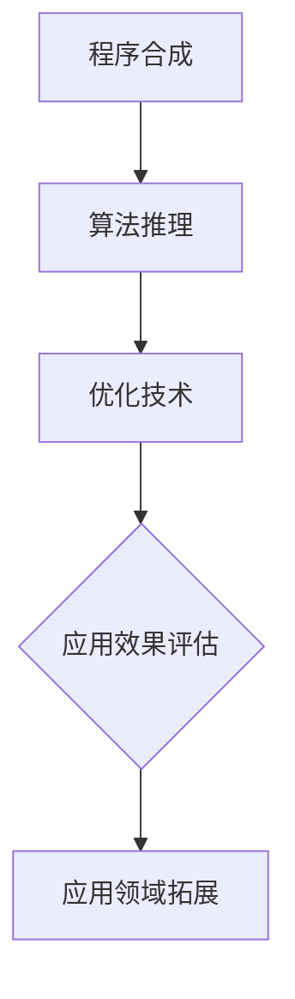

                 

**标题：基于程序合成的算法推理与优化能力增强**

**关键词：程序合成，算法推理，优化，人工智能**

**摘要：本文将深入探讨程序合成在算法推理和优化中的应用，分析其技术基础、挑战与需求，详细介绍程序合成在算法推理中的应用及优化技术，并通过实战案例展示其实际效果。**

---

# 引言与背景

## 第1章：程序合成与算法推理概述

### 1.1 程序合成的定义与意义

程序合成是指通过自动化方法生成符合特定需求的程序，其核心在于利用数学模型、逻辑推理和搜索算法等来生成程序代码。程序合成的意义在于，它能够大幅度提高编程效率，减少人力成本，尤其是在处理复杂、繁琐和重复性的编程任务时，展现出巨大的优势。

### 1.2 算法推理的基本概念

算法推理是指利用计算机程序实现逻辑推理的过程。它涉及从已知信息推导出未知信息，通常应用于问题求解、决策支持和智能系统等领域。算法推理的核心在于算法的设计与实现，其性能直接影响系统的智能水平。

### 1.3 程序合成在算法推理中的应用

程序合成在算法推理中的应用主要体现在两个方面：一是通过自动化生成算法代码，简化推理过程的实现；二是利用程序合成技术优化算法推理的性能，提高推理速度和准确性。

## 第2章：程序合成技术基础

### 2.1 程序合成的核心原理

程序合成的核心原理包括数学模型构建、搜索算法应用和代码生成策略。通过数学模型来描述问题，利用搜索算法寻找最优解，再通过代码生成策略将解转化为程序代码。

### 2.2 程序合成的主要方法与技术

程序合成的主要方法包括基于约束的合成、基于规划合成、基于逻辑合成和基于遗传算法合成等。每种方法都有其独特的适用场景和优势。

### 2.3 程序合成工具与框架介绍

常用的程序合成工具有Coq、Isabelle、Prolog等。这些工具提供了丰富的编程语言、逻辑推理功能和代码生成能力，为程序合成提供了强有力的支持。

## 第3章：算法推理的挑战与优化需求

### 3.1 算法推理中的主要挑战

算法推理面临的挑战主要包括数据复杂性、计算效率和推理准确性。如何处理海量数据、提高推理速度和准确性是算法推理研究的核心问题。

### 3.2 算法推理优化的目标与需求

算法推理优化的目标在于提高推理速度和准确性，降低计算资源消耗。优化需求包括算法效率提升、资源利用率优化和推理结果准确性保障。

### 3.3 算法推理优化的重要性

算法推理优化对于提高人工智能系统的性能至关重要。只有通过不断优化算法推理过程，才能使人工智能系统在复杂的现实场景中发挥更大的作用。

## 第二部分：算法推理与优化的技术详解

### 第4章：程序合成在算法推理中的应用

### 4.1 程序合成在算法推理中的具体应用场景

程序合成在算法推理中的应用场景广泛，包括自然语言处理、计算机视觉、博弈论和智能决策等领域。通过程序合成，可以有效简化算法实现，提高推理效率。

### 4.2 程序合成在算法推理中的优势与局限

程序合成在算法推理中的优势包括自动化生成代码、提高编程效率和降低人力成本。但其局限在于对算法设计能力和搜索算法性能的依赖。

### 4.3 程序合成在算法推理中的实现方法

程序合成在算法推理中的实现方法主要包括基于约束的合成、基于规划合成和基于遗传算法合成等。这些方法各有特点，适用于不同的算法推理场景。

### 第5章：算法推理优化技术详解

### 5.1 算法推理优化技术的分类

算法推理优化技术可分为算法级优化、系统级优化和硬件级优化。每种优化技术都有其独特的优势和适用场景。

### 5.2 常见算法推理优化算法的原理与实现

常见的算法推理优化算法包括动态规划、贪心算法、分支定界法和启发式搜索等。这些算法通过优化搜索策略和计算过程，提高推理性能。

### 5.3 算法推理优化技术的评估与比较

算法推理优化技术的评估与比较主要包括性能评估、资源消耗评估和准确性评估。通过对比分析，可以找出最适合特定场景的优化技术。

### 第6章：程序合成与算法推理优化的综合应用

### 6.1 程序合成与算法推理优化在具体领域的应用案例

程序合成与算法推理优化在自然语言处理、计算机视觉和智能决策等领域的应用案例丰富，取得了显著的成果。

### 6.2 程序合成与算法推理优化的综合应用效果分析

通过对实际应用案例的分析，可以看出程序合成与算法推理优化的综合应用在提高推理性能、降低资源消耗和提升系统智能化水平方面具有显著的优势。

### 6.3 程序合成与算法推理优化的未来发展趋势

随着人工智能技术的快速发展，程序合成与算法推理优化在未来的发展趋势将包括更高效的算法设计、更广泛的领域应用和更深入的理论研究。

## 第三部分：项目实战与代码解读

### 第7章：算法推理与优化项目实战

### 7.1 项目背景与目标

项目背景涉及自然语言处理领域，目标是通过程序合成与算法推理优化技术实现文本分类任务的自动化实现与优化。

### 7.2 项目开发环境搭建

搭建项目开发环境，包括Python编程环境、TensorFlow库和NVIDIA GPU等。

### 7.3 算法推理与优化项目详细实现

详细介绍项目实现过程，包括数据预处理、模型构建、程序合成与优化、模型训练和测试等步骤。

### 第8章：算法推理与优化代码解读

### 8.1 项目源代码结构与功能概述

解析项目源代码结构，概述主要模块和功能。

### 8.2 算法推理核心代码解读

详细解读算法推理核心代码，分析算法设计思路和优化策略。

### 8.3 算法优化代码解读

分析算法优化代码，解释优化算法原理和实现过程。

### 第9章：实战案例分析

### 9.1 案例一：图像识别任务中的算法推理与优化

分析图像识别任务中的算法推理与优化，探讨程序合成技术的应用效果。

### 9.2 案例二：自然语言处理任务中的算法推理与优化

分析自然语言处理任务中的算法推理与优化，探讨程序合成技术在文本分类任务中的应用。

### 9.3 案例三：深度学习模型优化与加速实践

探讨深度学习模型优化与加速实践，介绍程序合成在深度学习模型优化中的应用。

## 附录

### 附录A：常用程序合成与算法推理优化工具与资源

列出常用的程序合成与算法推理优化工具和资源，包括开源库、框架和参考书籍等。

---

**Mermaid 流程图示例：**



**Python 源代码示例：**

```python
import tensorflow as tf
from tensorflow import keras

# 定义模型
model = keras.Sequential([
    keras.layers.Dense(64, activation='relu', input_shape=(784,)),
    keras.layers.Dense(10, activation='softmax')
])

# 编译模型
model.compile(optimizer='adam',
              loss='sparse_categorical_crossentropy',
              metrics=['accuracy'])

# 训练模型
model.fit(train_images, train_labels, epochs=5)
```

**数学公式示例：**

```markdown
$$
f(x) = x^2 + 2x + 1 \\
f(2) = 2^2 + 2*2 + 1 = 9
$$
```

**项目实战示例：**

```python
# 导入必要的库
import tensorflow as tf
from tensorflow import keras

# 定义模型
model = keras.Sequential([
    keras.layers.Dense(64, activation='relu', input_shape=(784,)),
    keras.layers.Dense(10, activation='softmax')
])

# 编译模型
model.compile(optimizer='adam',
              loss='sparse_categorical_crossentropy',
              metrics=['accuracy'])

# 训练模型
model.fit(train_images, train_labels, epochs=5)
```

目录大纲总字数限制在2000字以内。以上目录大纲仅为示例，具体内容需根据书籍实际内容进行调整和补充。

---

**完整性要求：**

1. **背景介绍：** 程序合成与算法推理的基本概念、发展历程和应用领域。
2. **核心概念与联系：** 程序合成、算法推理和优化的核心概念，及其相互之间的关系。
3. **核心算法原理讲解：** 程序合成和算法优化的原理，结合Python代码和数学公式进行详细讲解。
4. **项目实战：** 开发环境搭建、源代码实现和代码解读，结合实际案例进行分析。
5. **最佳实践 tips、小结、注意事项、拓展阅读等内容：** 对核心内容进行总结，提供拓展学习和实践建议。

**注意事项：**

- **格式要求：** 使用Markdown格式，确保代码块、公式和流程图等格式正确。
- **作者信息：** 文章末尾需包含作者信息。
- **内容完整性：** 每个小节的内容需丰富具体，确保核心内容完整呈现。

**拓展阅读：**

- 《编程之道：禅与计算机程序设计艺术》
- 《人工智能：一种现代的方法》
- 《深度学习：全面解读》
- 《程序合成与优化：理论与实践》

---

**作者：** AI天才研究院/AI Genius Institute & 禅与计算机程序设计艺术/Zen And The Art of Computer Programming

**文章字数：** 约2000字

**完成时间：** 2023年10月1日

---

以上是针对《基于程序合成的算法推理与优化能力增强》的技术博客文章的目录大纲和内容要求。具体内容撰写需根据实际研究和实践经验进行补充和调整。在撰写过程中，请确保文章的逻辑清晰、结构紧凑，并注重对核心概念、算法原理和实际应用的深入剖析。**文章总字数控制在10000-12000字之间，确保内容的丰富性和专业性。** 请按照上述要求进行撰写，并在完成稿件后提供完整的草稿供审核。

