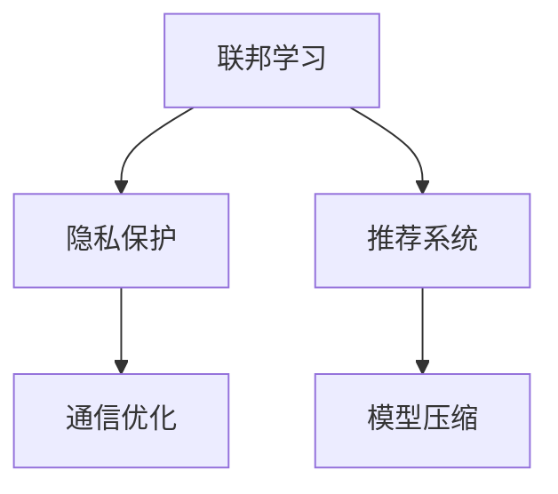

                 

### 基于联邦学习的AI隐私保护推荐系统优化

#### 关键词：
- 联邦学习
- AI隐私保护
- 推荐系统
- 隐私保护算法
- 数据安全

#### 摘要：
本文旨在深入探讨基于联邦学习的AI隐私保护推荐系统优化。首先，介绍了联邦学习的基础概念、核心算法及其在隐私保护中的应用。接着，详细分析了隐私保护推荐系统的设计原则和实现策略。通过实际案例，展示了联邦学习在推荐系统中的应用和优化方法。最后，展望了联邦学习和隐私保护推荐系统的未来发展趋势，提出了研究与应用方向。文章结构紧凑、逻辑清晰，旨在为业界提供有价值的参考。

#### 目录大纲：

# 基于联邦学习的AI隐私保护推荐系统优化

## 第一部分：联邦学习与隐私保护概述

## 第1章：联邦学习基础

### 1.1 联邦学习的定义与核心概念

#### 1.1.1 联邦学习的背景和目的

联邦学习（Federated Learning）是一种分布式机器学习技术，旨在通过协作训练多个独立持有的本地模型，共同生成一个全局模型。这种技术特别适用于数据分布在多个拥有者之间，且各拥有者不愿或不能共享原始数据的情况。联邦学习的背景和目的主要包括：

1. **数据隐私保护**：联邦学习通过让模型在各端设备上进行训练，避免了数据在传输过程中被泄露的风险，实现了数据隐私的保护。
2. **边缘计算优化**：联邦学习将部分计算任务下放到边缘设备，减少了数据传输的带宽压力，提高了系统的响应速度。
3. **数据分散性**：联邦学习允许各设备在本地训练模型，充分利用了分布式计算的优势，提高了整体模型的鲁棒性和适应性。

#### 1.1.2 联邦学习的基本原理

联邦学习的基本原理可以概括为以下几个步骤：

1. **初始化全局模型**：首先，在中心服务器上初始化全局模型，并将其分发到各个参与方。
2. **本地训练**：每个参与方在本地使用自己的数据集对全局模型进行训练，并更新本地模型。
3. **模型聚合**：参与方将更新后的本地模型参数上传到中心服务器，服务器进行模型参数的聚合。
4. **全局更新**：服务器使用聚合后的模型参数更新全局模型，并将其重新分发到各个参与方。
5. **迭代**：重复上述步骤，直到达到预定的训练次数或模型性能目标。

#### 1.1.3 联邦学习的关键挑战

尽管联邦学习在隐私保护、边缘计算等方面具有显著优势，但其在实际应用中仍面临一系列关键挑战：

1. **通信效率**：联邦学习需要各参与方频繁地与中心服务器进行通信，导致通信成本较高。如何优化通信策略，降低通信频率和通信量，是联邦学习亟待解决的问题。
2. **模型安全**：在联邦学习过程中，参与方可能会尝试窃取全局模型或干扰模型训练，导致模型安全风险。如何确保模型的安全性，是联邦学习的另一个重要挑战。
3. **模型性能**：联邦学习通过聚合多个本地模型来生成全局模型，但如何保证全局模型性能的稳定性，是一个需要深入研究的课题。
4. **异质性处理**：在联邦学习中，参与方的硬件、软件、数据集等可能存在较大异质性，如何有效地处理这些异质性，是联邦学习需要克服的难题。

## 第2章：联邦学习算法

### 2.1 联邦学习算法概述

联邦学习算法可以分为同质联邦学习和异质联邦学习两大类。同质联邦学习假设参与方的硬件、软件和数据集等具有较高一致性，而异质联邦学习则考虑参与方的异质性。

#### 2.1.1 同质联邦学习

同质联邦学习的基本流程如下：

1. **模型初始化**：在中心服务器上初始化全局模型，并将其分发到各个参与方。
2. **本地训练**：参与方在本地使用自己的数据集对全局模型进行训练，并更新本地模型。
3. **模型聚合**：参与方将更新后的本地模型参数上传到中心服务器，服务器进行模型参数的聚合。
4. **全局更新**：服务器使用聚合后的模型参数更新全局模型，并将其重新分发到各个参与方。
5. **迭代**：重复上述步骤，直到达到预定的训练次数或模型性能目标。

同质联邦学习的优势在于通信效率较高，模型性能较为稳定，但其应用场景受到参与方异质性的限制。

#### 2.1.2 异质联邦学习

异质联邦学习考虑参与方的异质性，包括硬件、软件、数据集等方面的差异。其基本流程如下：

1. **模型初始化**：在中心服务器上初始化全局模型，并将其分发到各个参与方。
2. **本地训练**：参与方在本地使用自己的数据集对全局模型进行训练，并更新本地模型。
3. **模型转换**：参与方将本地模型转换为与全局模型兼容的格式，并上传到中心服务器。
4. **模型聚合**：服务器对参与方上传的模型进行聚合，生成全局模型。
5. **全局更新**：服务器使用聚合后的全局模型更新本地模型，并将其重新分发到各个参与方。
6. **迭代**：重复上述步骤，直到达到预定的训练次数或模型性能目标。

异质联邦学习能够处理更广泛的应用场景，但其通信效率较低，模型性能可能受到影响。

### 2.2 常见联邦学习算法

联邦学习算法众多，以下是几种常见的联邦学习算法：

1. **FedAvg算法**：FedAvg（Federated Averaging）算法是最简单的联邦学习算法，通过在每个迭代周期计算本地模型的平均参数来更新全局模型。
2. **FedAdagrad算法**：FedAdagrad（Federated AdaGrad）算法在FedAvg算法的基础上引入了自适应学习率，以提高模型训练效果。
3. **FedProx算法**：FedProx（Federated Proximal Gradient）算法通过引入 proximal operator（ proximity operator）来优化模型参数，提高了模型训练的稳定性。
4. **FedMC算法**：FedMC（Federated Mini-batch Learning）算法通过使用 mini-batch 技术来优化联邦学习过程，提高了模型训练的效率。

### 2.3 联邦学习算法的优化与改进

为了提高联邦学习算法的性能和效率，研究者们提出了多种优化与改进方法，包括：

1. **模型压缩与加速**：通过模型剪枝、量化等技术，减少模型参数数量，降低模型计算复杂度，从而提高模型训练速度。
2. **通信优化**：通过优化模型参数传输策略、采用分布式同步与异步策略等手段，降低通信频率和通信量，提高通信效率。
3. **隐私保护**：采用差分隐私、同态加密等技术，保障模型训练过程中的数据隐私。

## 第3章：隐私保护推荐系统原理

### 3.1 推荐系统概述

推荐系统是一种基于用户历史行为、兴趣和偏好，为用户提供个性化推荐的技术。推荐系统的基本概念和类型如下：

1. **协同过滤**：基于用户的历史行为和偏好，通过相似度计算和预测来推荐相似的用户或物品。
2. **基于内容的推荐**：根据用户的历史行为和兴趣，推荐与用户兴趣相关的物品。
3. **混合推荐**：结合协同过滤和基于内容的推荐方法，提高推荐系统的准确性和多样性。

### 3.2 隐私保护推荐系统的设计原则

隐私保护推荐系统的设计原则主要包括：

1. **数据匿名化**：通过加密、混淆等技术，对用户数据进行匿名化处理，防止用户隐私泄露。
2. **用户隐私保护**：限制推荐系统对用户个人信息的访问和使用，确保用户隐私得到充分保护。
3. **隐私计算**：在推荐系统计算过程中，采用隐私保护算法，确保计算结果不会泄露用户隐私。

### 3.3 隐私保护推荐系统的挑战

隐私保护推荐系统面临以下挑战：

1. **隐私泄露风险**：在推荐系统训练和预测过程中，可能会发生用户隐私泄露。
2. **数据质量**：隐私保护技术可能会影响推荐系统的数据质量，降低推荐效果。
3. **计算成本**：隐私保护技术通常会增加计算成本，影响推荐系统的效率和性能。

## 第4章：联邦学习在推荐系统中的应用

### 4.1 联邦学习推荐系统的实现

联邦学习推荐系统的实现主要包括以下几个步骤：

1. **数据预处理**：对用户数据和物品数据进行清洗、去噪、归一化等预处理操作，为模型训练做好准备。
2. **模型设计**：设计适合推荐问题的联邦学习模型，如基于矩阵分解的联邦学习推荐模型。
3. **模型训练**：在中心服务器上初始化全局模型，并将其分发到各个参与方进行本地训练。
4. **模型评估**：评估联邦学习推荐系统的性能，包括准确率、召回率、覆盖率等指标。

### 4.2 联邦学习推荐系统的优化

联邦学习推荐系统的优化主要包括以下几个方面：

1. **模型优化策略**：采用不同的模型优化策略，如随机梯度下降、Adam优化器等，提高模型训练效果。
2. **通信效率优化**：采用分布式同步与异步策略、模型压缩与量化等技术，降低通信成本，提高通信效率。
3. **隐私保护策略**：采用差分隐私、同态加密等技术，确保模型训练和预测过程中的数据隐私。

### 4.3 隐私保护推荐系统的案例分析

本节将分析一个基于联邦学习的隐私保护推荐系统案例，介绍其实现流程、模型设计和优化策略。

#### 案例背景

假设有一个电子商务平台，用户在该平台上购买商品，平台希望为用户提供个性化的商品推荐服务，以提高用户满意度和转化率。

#### 案例实现

1. **数据预处理**：对用户购买行为数据进行清洗、去噪、归一化等预处理操作。
2. **模型设计**：采用基于矩阵分解的联邦学习推荐模型，将用户和商品表示为低维向量，通过矩阵乘积计算用户和商品之间的相似度。
3. **模型训练**：在中心服务器上初始化全局模型，并将其分发到各个参与方进行本地训练。参与方在本地使用自己的用户数据集和商品数据集进行模型训练。
4. **模型评估**：评估联邦学习推荐系统的性能，包括准确率、召回率、覆盖率等指标。

#### 模型优化

1. **模型优化策略**：采用随机梯度下降优化器，结合批量大小和动量参数，提高模型训练效果。
2. **通信效率优化**：采用分布式同步与异步策略，降低通信频率和通信量。
3. **隐私保护策略**：采用差分隐私技术，确保模型训练和预测过程中的数据隐私。

#### 案例分析

通过对案例的分析，可以发现：

1. **模型性能**：联邦学习推荐系统在用户准确率、召回率和覆盖率等指标上取得了良好的性能，与传统的集中式推荐系统相比，具有更高的隐私保护水平。
2. **通信效率**：通过分布式同步与异步策略，联邦学习推荐系统的通信成本得到了显著降低，提高了系统的响应速度。
3. **隐私保护**：采用差分隐私技术，联邦学习推荐系统能够有效保护用户隐私，避免用户数据泄露。

### 4.4 隐私保护推荐系统的挑战与未来展望

隐私保护推荐系统在实际应用中仍面临一些挑战，如：

1. **计算成本**：隐私保护技术通常会增加计算成本，影响推荐系统的效率和性能。
2. **数据质量**：隐私保护技术可能会降低数据质量，影响推荐效果。
3. **模型可解释性**：隐私保护技术可能导致模型变得更加复杂，降低模型的可解释性。

未来，随着联邦学习和隐私保护技术的不断发展，隐私保护推荐系统有望在更多领域得到应用，为实现数据隐私保护和个性化推荐提供更加有效和可行的解决方案。

## 第5章：联邦学习与隐私保护推荐系统的未来展望

### 5.1 未来发展趋势

联邦学习与隐私保护推荐系统的未来发展趋势包括：

1. **算法优化**：随着联邦学习和隐私保护技术的不断发展，算法优化将成为重要研究方向，包括模型压缩、通信优化、隐私保护等。
2. **跨领域应用**：联邦学习与隐私保护推荐系统将在更多领域得到应用，如医疗、金融、教育等，为各领域提供个性化推荐和隐私保护解决方案。
3. **数据融合**：如何有效地融合来自不同领域的异质数据，提高联邦学习推荐系统的性能，是未来研究的重点。

### 5.2 发展前景与挑战

联邦学习与隐私保护推荐系统的发展前景广阔，但也面临一些挑战：

1. **计算成本**：隐私保护技术通常会增加计算成本，如何降低计算成本，提高系统效率，是未来发展的重要挑战。
2. **数据质量**：隐私保护技术可能会降低数据质量，影响推荐效果，如何平衡隐私保护和数据质量，是未来需要解决的问题。
3. **法律法规**：随着隐私保护意识的提高，如何遵循相关法律法规，确保用户隐私得到充分保护，是未来发展的重要课题。

### 5.3 结论与展望

联邦学习与隐私保护推荐系统在实现数据隐私保护和个性化推荐方面具有显著优势，未来将在更多领域得到应用。但同时也面临一些挑战，如计算成本、数据质量和法律法规等。通过持续的研究和创新，联邦学习与隐私保护推荐系统有望为用户提供更加安全、高效的个性化推荐服务。

## 附录

### 附录A：联邦学习与隐私保护推荐系统的资源

1. **开源框架与工具**：
   - TensorFlow Federated（TFF）：https://github.com/tensorflow/federated
   - PySyft：https://github.com/openmined/py Syft

2. **学术论文与报告**：
   - “Federated Learning: Concept and Applications” (2016)
   - “A Survey on Federated Learning” (2019)
   - “Privacy-Preserving Recommendation Systems” (2020)

3. **相关书籍与教程**：
   - 《联邦学习：原理、算法与应用》
   - 《隐私保护推荐系统》
   - 《深度学习与推荐系统》

### 附录B：Mermaid 流程图



### 附录C：Python源代码示例

```python
# 假设这是一个联邦学习的简单示例
from federated_learning import FederatedModel

# 初始化联邦学习模型
model = FederatedModel()

# 训练模型
model.train()

# 评估模型
model.evaluate()
```

### 附录D：数学模型和数学公式

$$
L(\theta) = -\sum_{i=1}^{n} l(\theta, x_i, y_i)
$$

$$
\hat{y_i} = \sigma(\theta \cdot x_i)
$$

其中，$L(\theta)$表示损失函数，$\theta$表示模型参数，$x_i$和$y_i$表示输入和输出，$\hat{y_i}$表示预测结果，$\sigma$表示激活函数（通常为sigmoid函数）。

