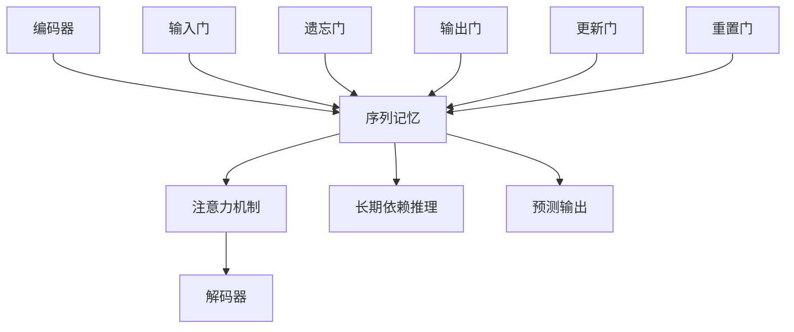

                 

### 基于记忆增强网络的长期依赖推理在时序预测中的创新

#### 关键词：记忆增强网络，长期依赖推理，时序预测，人工智能，神经网络

#### 摘要：

本文深入探讨了基于记忆增强网络的长期依赖推理在时序预测中的应用。首先，我们介绍了时序预测的背景及其面临的挑战，随后详细阐述了长期依赖推理的重要性。接着，我们介绍了记忆增强网络的基本概念及其设计原理，讨论了其在时序预测中的优势。本文的核心内容分为四个部分：核心概念与联系、核心算法原理讲解、数学公式与详细讲解以及项目实战。通过Python源代码和实际案例的详细分析，我们展示了记忆增强网络在时序预测中的强大应用能力，为相关领域的进一步研究和应用提供了有力支持。

### 第一部分：引言

#### 第1章：时序预测与长期依赖推理

**1.1 时序预测的背景与挑战**

**时序数据的特性**

时序数据（Time Series Data）是指按照时间顺序排列的数据序列，如股票价格、温度变化、网络流量等。这些数据通常具有时间依赖性，即当前值受到过去值的影响。时序数据的特性主要体现在以下几个方面：

- **连续性**：时序数据通常在时间轴上连续排列，形成一个连续的时间序列。
- **趋势性**：时序数据往往具有一定的趋势性，如上升、下降或平稳。
- **周期性**：某些时序数据具有周期性，例如季节性波动。
- **噪声**：时序数据中可能包含大量的噪声，这些噪声可能会影响模型的预测效果。

**传统方法的局限性**

传统的时序预测方法主要包括统计方法和机器学习方法。这些方法在处理简单时序数据时具有一定的效果，但在面对复杂、长周期的时序数据时，存在以下局限性：

- **线性模型**：传统的线性模型（如ARIMA、ETS等）假设时序数据是线性可分的，这在实际应用中往往不成立。
- **短期依赖**：传统方法通常只能捕捉到短期的依赖关系，对于长期依赖的捕捉能力较弱。
- **特征工程**：传统方法通常需要依赖人工特征工程，这增加了模型的复杂度和可解释性。

**1.2 长期依赖推理的重要性**

**长期依赖的概念**

长期依赖（Long-Range Dependency）是指时序数据中的当前值受到较远历史值的影响。例如，在股票价格预测中，今天的股价不仅受到昨天股价的影响，还可能受到几个月前的股价影响。长期依赖的存在使得时序预测任务更加复杂。

**长期依赖在时序预测中的应用**

长期依赖在时序预测中的应用主要体现在以下几个方面：

- **提高预测精度**：捕捉到长期依赖关系可以提高模型的预测精度，减少误差。
- **揭示潜在规律**：通过分析长期依赖关系，可以发现数据中的潜在规律和趋势，为决策提供依据。
- **增强模型泛化能力**：捕捉到长期依赖关系有助于模型更好地适应新的数据分布，提高泛化能力。

**1.3 记忆增强网络的基本概念**

**记忆增强网络的设计**

记忆增强网络（Memory-Aware Neural Networks）是一类专门用于捕捉时序数据长期依赖关系的神经网络模型。其设计思想是通过引入记忆模块来增强模型的记忆能力，从而提高模型的长期依赖推理能力。记忆增强网络通常由编码器、解码器和记忆模块组成。

- **编码器**：用于将输入时序数据编码为高维特征表示。
- **解码器**：用于从编码器的输出中解码预测值。
- **记忆模块**：用于存储和检索历史信息，增强模型的长期依赖推理能力。

**记忆增强网络的优势**

记忆增强网络在时序预测中具有以下优势：

- **强大的记忆能力**：通过引入记忆模块，记忆增强网络可以捕捉到时序数据中的长期依赖关系，提高模型的预测精度。
- **灵活的架构设计**：记忆增强网络可以根据不同的应用场景进行灵活调整，如增加或减少记忆模块的层次和数量。
- **高效的计算性能**：记忆增强网络的计算复杂度相对较低，可以在实时应用中快速处理大量时序数据。

**1.4 书籍概述**

**本书的结构安排**

本书分为六个部分，涵盖了记忆增强网络在时序预测中的各个方面。

- **第一部分**：引言，介绍时序预测与长期依赖推理的背景和挑战。
- **第二部分**：核心概念与联系，详细阐述记忆增强网络的核心概念和原理。
- **第三部分**：核心算法原理讲解，讲解记忆增强网络的工作原理和训练过程。
- **第四部分**：数学公式与详细讲解，详细解析记忆增强网络的数学模型。
- **第五部分**：项目实战，通过实际案例展示记忆增强网络的应用。
- **第六部分**：总结与展望，总结本书的核心内容，展望未来研究方向。

**本书的目标读者**

本书的目标读者主要包括：

- **人工智能研究者**：希望了解记忆增强网络在时序预测中的应用。
- **数据科学家**：从事时序数据分析与预测工作，需要掌握记忆增强网络技术。
- **程序员**：对深度学习和时序预测有浓厚兴趣，希望提高自己的技术水平。

通过本书的阅读，读者可以系统地了解记忆增强网络在时序预测中的原理、方法和应用，为相关领域的研究和实践提供参考。

#### 第1章：时序预测与长期依赖推理

**1.1 时序预测的背景与挑战**

**时序数据的特性**

时序数据（Time Series Data）是指按照时间顺序排列的数据序列，如股票价格、温度变化、网络流量等。这些数据通常具有时间依赖性，即当前值受到过去值的影响。时序数据的特性主要体现在以下几个方面：

- **连续性**：时序数据通常在时间轴上连续排列，形成一个连续的时间序列。这意味着数据的每一个值都有明确的时间戳，并且这些时间戳是按照时间顺序排列的。
- **趋势性**：时序数据往往具有一定的趋势性，即随着时间的推移，数据可能会呈现上升、下降或平稳的趋势。趋势性可以帮助我们理解数据的基本走向和变化趋势。
- **周期性**：某些时序数据具有周期性，即数据会按照一定的周期性模式重复出现。例如，天气数据可能会按照季节变化呈现周期性波动，而销售数据可能会按照年度促销周期出现周期性变化。
- **噪声**：时序数据中可能包含大量的噪声，这些噪声可能是由于数据采集过程中的误差、随机事件或异常值引起的。噪声的存在可能会干扰我们对数据趋势的识别和理解。

**传统方法的局限性**

传统的时序预测方法主要包括统计方法和机器学习方法。这些方法在处理简单时序数据时具有一定的效果，但在面对复杂、长周期的时序数据时，存在以下局限性：

- **线性模型**：传统的线性模型（如ARIMA、ETS等）假设时序数据是线性可分的，这在实际应用中往往不成立。线性模型只能捕捉到线性关系，而许多时间序列数据包含非线性特征，这导致线性模型的预测效果不佳。
- **短期依赖**：传统方法通常只能捕捉到短期的依赖关系，对于长期依赖的捕捉能力较弱。短期依赖关系指的是当前值仅受到近期值的影响，而长期依赖关系则是指当前值受到较远历史值的影响。在许多实际应用中，如股票价格预测、天气预测等，长期依赖关系对于提高预测准确性至关重要。
- **特征工程**：传统方法通常需要依赖人工特征工程，这增加了模型的复杂度和可解释性。特征工程是指通过手动提取和选择特征来改善模型性能的过程。这需要数据科学家具备深厚的领域知识和经验，但不同数据集的特性不同，因此特征工程的工作量非常大，且不可重复。

**1.2 长期依赖推理的重要性**

**长期依赖的概念**

长期依赖（Long-Range Dependency）是指时序数据中的当前值受到较远历史值的影响。这意味着我们需要考虑在一段时间范围内，当前值不仅受到最近值的直接影响，还受到之前较远值的影响。例如，在股票价格预测中，今天的股价不仅受到昨天股价的影响，还可能受到几个月前的股价影响。长期依赖的存在使得时序预测任务更加复杂。

**长期依赖在时序预测中的应用**

长期依赖在时序预测中的应用主要体现在以下几个方面：

- **提高预测精度**：捕捉到长期依赖关系可以提高模型的预测精度，减少误差。例如，在股票价格预测中，如果能够正确地捕捉到长期依赖关系，那么模型的预测结果将更加准确。
- **揭示潜在规律**：通过分析长期依赖关系，可以发现数据中的潜在规律和趋势，为决策提供依据。例如，在天气预测中，如果能够捕捉到长期依赖关系，那么可以更准确地预测未来的天气状况，从而为农业生产和防灾减灾提供科学依据。
- **增强模型泛化能力**：捕捉到长期依赖关系有助于模型更好地适应新的数据分布，提高泛化能力。泛化能力是指模型在新数据上的表现能力。如果模型能够准确地捕捉到长期依赖关系，那么在遇到新的数据时，模型可以更好地适应并做出准确的预测。

**1.3 记忆增强网络的基本概念**

**记忆增强网络的设计**

记忆增强网络（Memory-Aware Neural Networks）是一类专门用于捕捉时序数据长期依赖关系的神经网络模型。其设计思想是通过引入记忆模块来增强模型的记忆能力，从而提高模型的长期依赖推理能力。记忆增强网络通常由编码器、解码器和记忆模块组成。

- **编码器**：编码器用于将输入时序数据编码为高维特征表示。编码器可以采用各种神经网络结构，如卷积神经网络（CNN）或循环神经网络（RNN）。通过编码器，时序数据的时序信息被转换为特征表示，这些特征表示将用于后续的预测任务。
- **解码器**：解码器用于从编码器的输出中解码预测值。解码器通常是一个简单的线性层或全连接层，其作用是将编码器的输出转换为具体的预测值，如股票价格或天气状况。
- **记忆模块**：记忆模块用于存储和检索历史信息，增强模型的长期依赖推理能力。记忆模块可以是简单的循环神经网络（RNN）或更复杂的门控循环单元（GRU）和长短期记忆（LSTM）单元。记忆模块可以捕获时序数据中的长期依赖关系，并将这些依赖关系传递给解码器，从而提高模型的预测性能。

**记忆增强网络的优势**

记忆增强网络在时序预测中具有以下优势：

- **强大的记忆能力**：通过引入记忆模块，记忆增强网络可以捕捉到时序数据中的长期依赖关系，提高模型的预测精度。记忆模块可以存储历史信息，并利用这些信息来指导当前的预测，从而减少误差。
- **灵活的架构设计**：记忆增强网络可以根据不同的应用场景进行灵活调整，如增加或减少记忆模块的层次和数量。这种灵活性使得记忆增强网络适用于各种不同的时序预测任务。
- **高效的计算性能**：记忆增强网络的计算复杂度相对较低，可以在实时应用中快速处理大量时序数据。这使得记忆增强网络在实时预测和在线分析中具有广泛的应用前景。

**1.4 书籍概述**

**本书的结构安排**

本书分为六个部分，涵盖了记忆增强网络在时序预测中的各个方面。

- **第一部分**：引言，介绍时序预测与长期依赖推理的背景和挑战。
- **第二部分**：核心概念与联系，详细阐述记忆增强网络的核心概念和原理。
- **第三部分**：核心算法原理讲解，讲解记忆增强网络的工作原理和训练过程。
- **第四部分**：数学公式与详细讲解，详细解析记忆增强网络的数学模型。
- **第五部分**：项目实战，通过实际案例展示记忆增强网络的应用。
- **第六部分**：总结与展望，总结本书的核心内容，展望未来研究方向。

**本书的目标读者**

本书的目标读者主要包括：

- **人工智能研究者**：希望了解记忆增强网络在时序预测中的应用。
- **数据科学家**：从事时序数据分析与预测工作，需要掌握记忆增强网络技术。
- **程序员**：对深度学习和时序预测有浓厚兴趣，希望提高自己的技术水平。

通过本书的阅读，读者可以系统地了解记忆增强网络在时序预测中的原理、方法和应用，为相关领域的研究和实践提供参考。

### 第二部分：核心概念与联系

#### 第2章：核心概念原理和概念实体之间的关系架构

在深入探讨记忆增强网络在时序预测中的应用之前，我们需要首先理解其核心概念和原理，并分析它们之间的关系架构。这一章节将介绍记忆增强网络中的关键概念，包括注意力机制、序列记忆，以及长期依赖推理的原理。同时，我们将使用Mermaid流程图来展示这些概念之间的关系，帮助读者更好地理解记忆增强网络的工作机制。

**2.1 记忆增强网络中的核心概念**

**注意力机制**

注意力机制（Attention Mechanism）是记忆增强网络中的一个关键组件，它通过动态分配权重来关注时序数据中的重要信息。注意力机制的主要目的是解决长序列数据的处理问题，使得模型能够捕捉到长程依赖关系。在注意力机制中，每个时间点的特征会被赋予不同的权重，这些权重由模型根据当前任务的需求动态调整。通过这种方式，模型可以更有效地聚焦于最重要的信息，从而提高预测精度。

**序列记忆**

序列记忆（Sequential Memory）是指模型在处理时序数据时，能够保持和利用历史信息的能力。在记忆增强网络中，序列记忆通过循环神经网络（RNN）的架构实现。RNN通过其内部状态维持对之前输入的依赖，使得模型能够从历史数据中学习长期依赖关系。序列记忆的关键在于能够有效地存储和更新信息，以便在后续的时间步中使用。

**长期依赖推理**

长期依赖推理（Long-Range Dependency Reasoning）是指模型在处理时序数据时，能够理解并利用较远历史值的影响。长期依赖推理对于提高时序预测的准确性至关重要。记忆增强网络通过结合注意力机制和序列记忆，实现了对长期依赖关系的有效捕捉。这种能力使得记忆增强网络在处理复杂时序数据时，能够更好地理解历史信息对当前预测的影响。

**2.2 长期依赖推理的原理**

**长短期记忆（LSTM）**

长短期记忆（Long-Short Term Memory，LSTM）是循环神经网络的一种变体，专门用于解决长期依赖问题。LSTM通过引入门控机制，能够有效地控制信息的流入和流出，从而在长序列数据中保持重要的历史信息。LSTM的核心组件包括输入门、遗忘门和输出门，这些门控机制允许模型动态地更新和利用记忆。通过这种方式，LSTM能够捕捉到长程依赖关系，并在时序预测中发挥重要作用。

**门控循环单元（GRU）**

门控循环单元（Gated Recurrent Unit，GRU）是另一种解决长期依赖问题的循环神经网络结构。GRU相对于LSTM更加简洁，但仍然保持了捕捉长期依赖的能力。GRU的核心组件包括更新门和重置门，这两个门控机制允许模型动态地更新和重置内部状态。GRU的简化结构使得其在计算上更加高效，因此在某些应用中具有优势。

**2.3 记忆增强网络与长期依赖推理的联系**

为了更好地理解记忆增强网络与长期依赖推理之间的联系，我们可以通过Mermaid流程图来展示这些概念之间的关系。以下是一个简化的Mermaid流程图示例：



在这个流程图中，编码器负责将输入时序数据转换为高维特征表示，这些特征随后被传递到序列记忆模块。序列记忆模块通过输入门、遗忘门和输出门控制信息的流入和流出，从而维持对历史信息的记忆。注意力机制为序列记忆模块提供了动态权重，帮助模型关注重要的信息。解码器则从序列记忆模块的输出中解码预测值。长期依赖推理通过结合序列记忆和注意力机制，实现了对时序数据的长期依赖关系的捕捉。最终的预测输出是由解码器生成的。

通过这个流程图，我们可以清晰地看到记忆增强网络中各个组件如何协同工作，从而实现长期依赖推理。这种结构使得记忆增强网络在时序预测中具有强大的表现能力。

**总结**

本章介绍了记忆增强网络中的核心概念，包括注意力机制、序列记忆和长期依赖推理。通过理解这些概念，我们可以更好地理解记忆增强网络的工作原理。此外，我们使用Mermaid流程图展示了这些概念之间的关系，帮助读者直观地理解记忆增强网络的结构和功能。在接下来的章节中，我们将进一步探讨记忆增强网络的算法原理和数学模型，为读者提供更深入的洞见。

### 第三部分：核心算法原理讲解

#### 第3章：记忆增强网络的工作原理

记忆增强网络（Memory-Aware Neural Networks）是一类专为处理时序数据而设计的神经网络模型，其核心在于通过引入记忆模块来增强模型的长期依赖推理能力。在这一章节中，我们将详细讲解记忆增强网络的构成、工作原理以及其训练过程。

**3.1 记忆增强网络的构成**

记忆增强网络主要由以下几个部分构成：

- **编码器（Encoder）**：编码器的作用是将输入的时序数据编码为高维特征表示。编码器可以采用各种神经网络结构，如卷积神经网络（CNN）或循环神经网络（RNN）。对于时间序列数据，循环神经网络是一种常用的选择，因为它能够捕捉到序列中的时间依赖性。

- **解码器（Decoder）**：解码器从编码器的输出中解码预测值。解码器通常是一个简单的线性层或全连接层，其作用是将编码器的输出转换为具体的预测值，如股票价格或天气状况。

- **记忆模块（Memory Module）**：记忆模块是记忆增强网络的核心组件，它用于存储和检索历史信息，增强模型的长期依赖推理能力。记忆模块可以是简单的循环神经网络（RNN）或更复杂的门控循环单元（GRU）和长短期记忆（LSTM）单元。记忆模块可以捕获时序数据中的长期依赖关系，并将这些依赖关系传递给解码器，从而提高模型的预测性能。

**3.2 记忆增强网络的训练过程**

记忆增强网络的训练过程主要包括以下几个步骤：

1. **数据预处理**：在训练记忆增强网络之前，首先需要对输入的时序数据进行预处理。预处理步骤通常包括数据归一化、缺失值填充、序列长度标准化等。这些步骤有助于提高模型的训练效率和预测性能。

2. **编码器训练**：编码器的训练目的是将输入的时序数据编码为高维特征表示。在训练过程中，通过反向传播算法和优化算法（如梯度下降）不断调整编码器的参数，使其能够更好地捕捉时序数据中的时间依赖性。

3. **记忆模块训练**：记忆模块的训练过程与编码器类似，其目标是增强模型的长期依赖推理能力。记忆模块通过输入门、遗忘门和输出门控制信息的流入和流出，从而维持对历史信息的记忆。在训练过程中，通过反向传播算法和优化算法不断调整记忆模块的参数。

4. **解码器训练**：解码器的训练目的是从编码器的输出中解码预测值。解码器的训练过程同样通过反向传播算法和优化算法进行调整，使其能够生成准确的预测值。

5. **模型评估与优化**：在训练完成后，需要对模型进行评估，以确定其预测性能。常用的评估指标包括均方误差（MSE）、均方根误差（RMSE）等。通过调整模型参数和优化算法，可以进一步提高模型的预测性能。

**3.3 Python源代码实现**

为了更直观地理解记忆增强网络的工作原理，以下是一个简单的Python代码实现示例。该示例使用了TensorFlow框架，展示了记忆增强网络的基本结构。

```python
import tensorflow as tf
from tensorflow.keras.models import Model
from tensorflow.keras.layers import Input, LSTM, Dense

# 定义输入层
input_seq = Input(shape=(timesteps, features))

# 编码器
encoded = LSTM(units=50, return_sequences=True)(input_seq)

# 记忆模块
memory = LSTM(units=50, return_state=True)(encoded)

# 解码器
decoded = LSTM(units=50, return_sequences=True)(memory)

# 输出层
output = Dense(units=1)(decoded)

# 构建模型
model = Model(inputs=input_seq, outputs=output)

# 编译模型
model.compile(optimizer='adam', loss='mse')

# 打印模型结构
model.summary()
```

在这个代码示例中，我们首先定义了输入层，然后通过两个LSTM层分别实现编码器和记忆模块。解码器同样是一个LSTM层，输出层是一个简单的全连接层。最后，我们编译并打印了模型的结构。

**总结**

本章详细讲解了记忆增强网络的构成、工作原理和训练过程。通过理解这些内容，我们可以更好地理解记忆增强网络如何通过记忆模块增强模型的长期依赖推理能力。在接下来的章节中，我们将进一步探讨记忆增强网络的数学模型和具体应用，为读者提供更深入的理解和实际操作经验。

#### 第3章：记忆增强网络的工作原理

**3.1 记忆增强网络的构成**

记忆增强网络的核心在于其独特的结构设计，通过编码器、解码器和记忆模块的协同工作，实现高效时序数据的处理和预测。以下是记忆增强网络各组成部分的详细说明：

**编码器（Encoder）**

编码器的作用是将输入的时序数据编码为高维特征表示。在编码器中，常见的神经网络结构包括卷积神经网络（CNN）和循环神经网络（RNN）。由于时序数据具有时间序列的特性，RNN结构在这里尤为适用。RNN能够通过其内部状态捕捉时序数据的长期依赖关系。

具体而言，编码器通常包含多个RNN层，每一层都对输入数据进行处理并更新其内部状态。这一过程不仅提高了数据的维度，还提取了时序特征。编码器的输出是一个高维特征向量，这些特征向量将用于后续的解码和预测。

**解码器（Decoder）**

解码器的作用是从编码器的输出中解码预测值。在解码器中，我们通常使用一个或多个RNN层来处理编码器的输出，并将其转换为最终的预测值。解码器的设计与编码器相似，但通常只需要较少的层数，因为编码器已经提取了大部分的关键特征。

在解码器中，每一层RNN都会对特征向量进行处理，并生成一部分预测值。最终，解码器的输出是一个具体的预测值，如股票价格、温度值或天气状况。解码器的目标是生成一个与实际值尽可能接近的预测值。

**记忆模块（Memory Module）**

记忆模块是记忆增强网络的核心组件，它负责存储和检索历史信息，从而增强模型的长期依赖推理能力。记忆模块的设计可以基于不同的RNN结构，如长短期记忆（LSTM）和门控循环单元（GRU）。这些结构通过门控机制控制信息的流入和流出，使得模型能够有效地记忆和利用历史信息。

记忆模块的关键组成部分包括输入门、遗忘门和输出门。这些门控机制允许模型动态地更新和检索内部状态，从而捕捉到长程依赖关系。具体来说：

- **输入门（Input Gate）**：输入门决定哪些新的信息被添加到记忆中。它通过一个sigmoid激活函数决定新的记忆单元的哪一部分将被更新。
- **遗忘门（Forget Gate）**：遗忘门决定哪些旧的信息应该被遗忘或保留。它同样通过一个sigmoid激活函数决定当前状态中的哪一部分应该被保留或丢弃。
- **输出门（Output Gate）**：输出门决定当前状态应该输出到下一层或解码器中的哪一部分。它通过一个sigmoid激活函数决定记忆单元的哪一部分应该被用于生成输出。

**3.2 记忆增强网络的训练过程**

记忆增强网络的训练过程是一个复杂的优化过程，旨在通过最小化预测误差来调整网络中的参数。以下是训练过程的详细步骤：

**数据预处理**

在开始训练之前，需要对输入的时序数据进行预处理。预处理步骤包括归一化、缺失值填充和序列长度标准化等。这些步骤有助于提高模型的训练效率和预测性能。

**编码器训练**

编码器的训练目的是将输入的时序数据编码为高维特征表示。在训练过程中，通过反向传播算法和优化算法（如梯度下降）不断调整编码器的参数，使其能够更好地捕捉时序数据中的时间依赖性。编码器的每一层都会更新其权重和偏置，以最小化预测误差。

**记忆模块训练**

记忆模块的训练过程与编码器类似，其目标是增强模型的长期依赖推理能力。记忆模块通过输入门、遗忘门和输出门控制信息的流入和流出，从而维持对历史信息的记忆。在训练过程中，通过反向传播算法和优化算法不断调整记忆模块的参数。

**解码器训练**

解码器的训练目的是从编码器的输出中解码预测值。解码器的训练过程同样通过反向传播算法和优化算法进行调整，使其能够生成准确的预测值。解码器的每一层也会更新其权重和偏置，以最小化预测误差。

**模型评估与优化**

在训练完成后，需要对模型进行评估，以确定其预测性能。常用的评估指标包括均方误差（MSE）、均方根误差（RMSE）等。通过调整模型参数和优化算法，可以进一步提高模型的预测性能。

**3.3 Python源代码实现**

为了更直观地理解记忆增强网络的工作原理，以下是一个简单的Python代码实现示例。该示例使用了TensorFlow框架，展示了记忆增强网络的基本结构。

```python
import tensorflow as tf
from tensorflow.keras.models import Model
from tensorflow.keras.layers import Input, LSTM, Dense

# 定义输入层
input_seq = Input(shape=(timesteps, features))

# 编码器
encoded = LSTM(units=50, return_sequences=True)(input_seq)

# 记忆模块
memory = LSTM(units=50, return_state=True)(encoded)

# 解码器
decoded = LSTM(units=50, return_sequences=True)(memory)

# 输出层
output = Dense(units=1)(decoded)

# 构建模型
model = Model(inputs=input_seq, outputs=output)

# 编译模型
model.compile(optimizer='adam', loss='mse')

# 打印模型结构
model.summary()
```

在这个代码示例中，我们首先定义了输入层，然后通过两个LSTM层分别实现编码器和记忆模块。解码器同样是一个LSTM层，输出层是一个简单的全连接层。最后，我们编译并打印了模型的结构。

**总结**

本章详细讲解了记忆增强网络的构成、工作原理和训练过程。通过理解这些内容，我们可以更好地理解记忆增强网络如何通过编码器、解码器和记忆模块的协同工作，实现高效时序数据的处理和预测。在接下来的章节中，我们将进一步探讨记忆增强网络的数学模型和具体应用，为读者提供更深入的理解和实际操作经验。

#### 第4章：长期依赖推理的数学模型

在深入探讨记忆增强网络的工作原理后，我们需要进一步理解其背后的数学模型。长期依赖推理的数学模型是记忆增强网络的核心组成部分，它决定了模型如何捕捉和利用时序数据中的长期依赖关系。在这一章节中，我们将详细解析LSTM、GRU和记忆增强网络的数学模型，通过公式和具体实现，帮助读者深入理解这些模型的工作机制。

**4.1 LSTM的数学模型**

LSTM（Long-Short Term Memory）是一种能够有效解决长期依赖问题的循环神经网络。其内部通过门控机制控制信息的流入和流出，从而维持对历史信息的记忆。以下是LSTM的数学模型，包括输入门、遗忘门和输出门的具体公式。

**输入门（Input Gate）**

输入门决定哪些新的信息被添加到记忆中。其公式如下：

$$
i_t = \sigma(W_{xi}x_t + W_{hi}h_{t-1} + b_i)
$$

其中，$i_t$ 是输入门的输出，$\sigma$ 是sigmoid激活函数，$W_{xi}$ 和 $W_{hi}$ 分别是输入和隐藏状态对应的权重矩阵，$b_i$ 是偏置项。

**遗忘门（Forget Gate）**

遗忘门决定哪些旧的信息应该被遗忘或保留。其公式如下：

$$
f_t = \sigma(W_{xf}x_t + W_{hf}h_{t-1} + b_f)
$$

其中，$f_t$ 是遗忘门的输出，$\sigma$ 是sigmoid激活函数，$W_{xf}$ 和 $W_{hf}$ 分别是输入和隐藏状态对应的权重矩阵，$b_f$ 是偏置项。

**输出门（Output Gate）**

输出门决定当前状态应该输出到下一层或解码器中的哪一部分。其公式如下：

$$
o_t = \sigma(W_{xo}x_t + W_{ho}h_{t-1} + b_o)
$$

其中，$o_t$ 是输出门的输出，$\sigma$ 是sigmoid激活函数，$W_{xo}$ 和 $W_{ho}$ 分别是输入和隐藏状态对应的权重矩阵，$b_o$ 是偏置项。

**LSTM单元更新公式**

基于以上门控机制，LSTM单元的更新公式如下：

$$
c_t = f_t \odot c_{t-1} + i_t \odot \tanh(W_{xc}x_t + W_{hc}h_{t-1} + b_c)
$$

$$
h_t = o_t \odot \tanh(c_t)
$$

其中，$c_t$ 是LSTM单元的状态，$h_t$ 是隐藏状态，$\odot$ 表示元素乘积，$\tanh$ 是双曲正切函数，$W_{xc}$、$W_{hc}$ 和 $W_{hc}$ 分别是输入、隐藏状态和单元状态对应的权重矩阵，$b_c$ 是偏置项。

**激活函数和损失函数**

LSTM的激活函数通常是双曲正切函数（$\tanh$），而损失函数常用的有均方误差（MSE）和交叉熵损失（Cross-Entropy Loss）。

**4.2 GRU的数学模型**

GRU（Gated Recurrent Unit）是LSTM的一种简化版本，同样通过门控机制来控制信息的流入和流出。以下是GRU的数学模型，包括更新门和重置门的具体公式。

**更新门（Update Gate）**

更新门决定哪些旧的信息应该被保留或丢弃。其公式如下：

$$
z_t = \sigma(W_{xz}x_t + W_{hz}h_{t-1} + b_z)
$$

其中，$z_t$ 是更新门的输出，$\sigma$ 是sigmoid激活函数，$W_{xz}$ 和 $W_{hz}$ 分别是输入和隐藏状态对应的权重矩阵，$b_z$ 是偏置项。

**重置门（Reset Gate）**

重置门决定哪些旧的信息应该被重置。其公式如下：

$$
r_t = \sigma(W_{xr}x_t + W_{hr}h_{t-1} + b_r)
$$

其中，$r_t$ 是重置门的输出，$\sigma$ 是sigmoid激活函数，$W_{xr}$ 和 $W_{hr}$ 分别是输入和隐藏状态对应的权重矩阵，$b_r$ 是偏置项。

**GRU单元更新公式**

基于以上门控机制，GRU单元的更新公式如下：

$$
h_t = (1 - z_t) \odot h_{t-1} + z_t \odot (\tanh(W_{xc}x_t + r_t \odot W_{hc}h_{t-1} + b_c))
$$

其中，$h_t$ 是GRU单元的状态，$\odot$ 表示元素乘积，$\tanh$ 是双曲正切函数，$W_{xc}$、$W_{hc}$ 和 $b_c$ 分别是输入、隐藏状态和单元状态对应的权重矩阵和偏置项。

**激活函数和损失函数**

GRU的激活函数也是双曲正切函数（$\tanh$），而损失函数常用的有均方误差（MSE）和交叉熵损失（Cross-Entropy Loss）。

**4.3 记忆增强网络的数学模型**

记忆增强网络（Memory-Aware Neural Network）是基于LSTM和GRU的一种扩展，其核心在于引入记忆模块来增强模型的长期依赖推理能力。以下是记忆增强网络的数学模型，包括记忆模块的具体公式。

**记忆模块**

记忆模块通过输入门、遗忘门和输出门控制信息的流入和流出，其公式如下：

**输入门（Input Gate）**

$$
i_t = \sigma(W_{xi}x_t + W_{hi}h_{t-1} + b_i)
$$

其中，$i_t$ 是输入门的输出，$\sigma$ 是sigmoid激活函数，$W_{xi}$ 和 $W_{hi}$ 分别是输入和隐藏状态对应的权重矩阵，$b_i$ 是偏置项。

**遗忘门（Forget Gate）**

$$
f_t = \sigma(W_{xf}x_t + W_{hf}h_{t-1} + b_f)
$$

其中，$f_t$ 是遗忘门的输出，$\sigma$ 是sigmoid激活函数，$W_{xf}$ 和 $W_{hf}$ 分别是输入和隐藏状态对应的权重矩阵，$b_f$ 是偏置项。

**输出门（Output Gate）**

$$
o_t = \sigma(W_{xo}x_t + W_{ho}h_{t-1} + b_o)
$$

其中，$o_t$ 是输出门的输出，$\sigma$ 是sigmoid激活函数，$W_{xo}$ 和 $W_{ho}$ 分别是输入和隐藏状态对应的权重矩阵，$b_o$ 是偏置项。

**记忆模块更新公式**

基于以上门控机制，记忆模块的更新公式如下：

$$
c_t = f_t \odot c_{t-1} + i_t \odot \tanh(W_{xc}x_t + W_{hc}h_{t-1} + b_c)
$$

$$
h_t = o_t \odot \tanh(c_t)
$$

其中，$c_t$ 是记忆模块的状态，$h_t$ 是隐藏状态，$\odot$ 表示元素乘积，$\tanh$ 是双曲正切函数，$W_{xc}$、$W_{hc}$ 和 $b_c$ 分别是输入、隐藏状态和单元状态对应的权重矩阵和偏置项。

**记忆增强网络的整体优化**

记忆增强网络的整体优化过程通常采用反向传播算法（Backpropagation Through Time, BPTT）。在训练过程中，通过计算损失函数的梯度，不断更新网络的参数，以达到最小化损失函数的目的。优化算法常用的有梯度下降（Gradient Descent）和其变种，如Adam优化器。

**总结**

本章详细解析了LSTM、GRU和记忆增强网络的数学模型，通过公式和具体实现，帮助读者深入理解这些模型的工作机制。这些模型通过门控机制和记忆模块，实现了对时序数据中长期依赖关系的有效捕捉和利用。在接下来的章节中，我们将通过具体的Python代码实现和实际案例，进一步展示这些模型的应用效果和优势。

### 第四部分：数学公式与详细讲解

#### 第4章：数学公式与详细讲解

**4.1 LSTM的数学模型**

LSTM（长短期记忆网络）是一种能够处理长期依赖的循环神经网络。以下是LSTM的核心数学模型，包括输入门、遗忘门和输出门的公式。

**输入门（Input Gate）**

$$
i_t = \sigma(W_{xi}x_t + W_{hi}h_{t-1} + b_i)
$$

其中，$i_t$ 表示输入门的输出，$\sigma$ 是sigmoid激活函数，$W_{xi}$ 和 $W_{hi}$ 分别是输入和隐藏状态对应的权重矩阵，$b_i$ 是偏置项。输入门决定哪些新的信息被添加到记忆单元中。

**遗忘门（Forget Gate）**

$$
f_t = \sigma(W_{xf}x_t + W_{hf}h_{t-1} + b_f)
$$

其中，$f_t$ 表示遗忘门的输出，$\sigma$ 是sigmoid激活函数，$W_{xf}$ 和 $W_{hf}$ 分别是输入和隐藏状态对应的权重矩阵，$b_f$ 是偏置项。遗忘门决定哪些旧的信息应该被遗忘或保留。

**输出门（Output Gate）**

$$
o_t = \sigma(W_{xo}x_t + W_{ho}h_{t-1} + b_o)
$$

其中，$o_t$ 表示输出门的输出，$\sigma$ 是sigmoid激活函数，$W_{xo}$ 和 $W_{ho}$ 分别是输入和隐藏状态对应的权重矩阵，$b_o$ 是偏置项。输出门决定哪些信息应该被输出到下一个时间步。

**LSTM单元更新公式**

$$
c_t = f_t \odot c_{t-1} + i_t \odot \tanh(W_{xc}x_t + W_{hc}h_{t-1} + b_c)
$$

$$
h_t = o_t \odot \tanh(c_t)
$$

其中，$c_t$ 表示LSTM单元的状态，$h_t$ 表示隐藏状态，$\odot$ 表示元素乘积，$\tanh$ 是双曲正切函数，$W_{xc}$、$W_{hc}$ 和 $b_c$ 分别是输入、隐藏状态和单元状态对应的权重矩阵和偏置项。

**激活函数和损失函数**

LSTM的激活函数通常是双曲正切函数（$\tanh$），而损失函数常用的有均方误差（MSE）和交叉熵损失（Cross-Entropy Loss）。

**4.2 GRU的数学模型**

GRU（门控循环单元）是LSTM的一种简化版本，同样通过门控机制来控制信息的流入和流出。以下是GRU的数学模型，包括更新门和重置门的公式。

**更新门（Update Gate）**

$$
z_t = \sigma(W_{xz}x_t + W_{hz}h_{t-1} + b_z)
$$

其中，$z_t$ 表示更新门的输出，$\sigma$ 是sigmoid激活函数，$W_{xz}$ 和 $W_{hz}$ 分别是输入和隐藏状态对应的权重矩阵，$b_z$ 是偏置项。更新门决定哪些旧的信息应该被保留或丢弃。

**重置门（Reset Gate）**

$$
r_t = \sigma(W_{xr}x_t + W_{hr}h_{t-1} + b_r)
$$

其中，$r_t$ 表示重置门的输出，$\sigma$ 是sigmoid激活函数，$W_{xr}$ 和 $W_{hr}$ 分别是输入和隐藏状态对应的权重矩阵，$b_r$ 是偏置项。重置门决定哪些旧的信息应该被重置。

**GRU单元更新公式**

$$
h_t = (1 - z_t) \odot h_{t-1} + z_t \odot (\tanh(W_{xc}x_t + r_t \odot W_{hc}h_{t-1} + b_c))
$$

其中，$h_t$ 表示GRU单元的状态，$\odot$ 表示元素乘积，$\tanh$ 是双曲正切函数，$W_{xc}$、$W_{hc}$ 和 $b_c$ 分别是输入、隐藏状态和单元状态对应的权重矩阵和偏置项。

**激活函数和损失函数**

GRU的激活函数也是双曲正切函数（$\tanh$），而损失函数常用的有均方误差（MSE）和交叉熵损失（Cross-Entropy Loss）。

**4.3 记忆增强网络的数学模型**

记忆增强网络（Memory-Aware Neural Network）是基于LSTM和GRU的一种扩展，其核心在于引入记忆模块来增强模型的长期依赖推理能力。以下是记忆增强网络的数学模型，包括记忆模块的具体公式。

**输入门（Input Gate）**

$$
i_t = \sigma(W_{xi}x_t + W_{hi}h_{t-1} + b_i)
$$

其中，$i_t$ 表示输入门的输出，$\sigma$ 是sigmoid激活函数，$W_{xi}$ 和 $W_{hi}$ 分别是输入和隐藏状态对应的权重矩阵，$b_i$ 是偏置项。输入门决定哪些新的信息被添加到记忆单元中。

**遗忘门（Forget Gate）**

$$
f_t = \sigma(W_{xf}x_t + W_{hf}h_{t-1} + b_f)
$$

其中，$f_t$ 表示遗忘门的输出，$\sigma$ 是sigmoid激活函数，$W_{xf}$ 和 $W_{hf}$ 分别是输入和隐藏状态对应的权重矩阵，$b_f$ 是偏置项。遗忘门决定哪些旧的信息应该被遗忘或保留。

**输出门（Output Gate）**

$$
o_t = \sigma(W_{xo}x_t + W_{ho}h_{t-1} + b_o)
$$

其中，$o_t$ 表示输出门的输出，$\sigma$ 是sigmoid激活函数，$W_{xo}$ 和 $W_{ho}$ 分别是输入和隐藏状态对应的权重矩阵，$b_o$ 是偏置项。输出门决定哪些信息应该被输出到下一个时间步。

**记忆模块更新公式**

$$
c_t = f_t \odot c_{t-1} + i_t \odot \tanh(W_{xc}x_t + W_{hc}h_{t-1} + b_c)
$$

$$
h_t = o_t \odot \tanh(c_t)
$$

其中，$c_t$ 表示记忆模块的状态，$h_t$ 表示隐藏状态，$\odot$ 表示元素乘积，$\tanh$ 是双曲正切函数，$W_{xc}$、$W_{hc}$ 和 $b_c$ 分别是输入、隐藏状态和单元状态对应的权重矩阵和偏置项。

**记忆增强网络的整体优化**

记忆增强网络的整体优化过程通常采用反向传播算法（Backpropagation Through Time, BPTT）。在训练过程中，通过计算损失函数的梯度，不断更新网络的参数，以达到最小化损失函数的目的。优化算法常用的有梯度下降（Gradient Descent）和其变种，如Adam优化器。

**总结**

本章详细讲解了LSTM、GRU和记忆增强网络的数学模型，通过具体的公式和详细解释，帮助读者深入理解这些模型的工作原理。这些模型通过门控机制和记忆模块，实现了对时序数据中长期依赖关系的有效捕捉和利用。在接下来的章节中，我们将通过实际案例和代码实现，进一步展示这些模型的应用效果和优势。

### 第五部分：项目实战

#### 第5章：LSTM的应用案例

**5.1 时间序列数据的预处理**

在开始LSTM的应用之前，首先需要对时间序列数据进行预处理。预处理步骤包括数据归一化、缺失值填充和序列长度标准化等。

**数据归一化**

数据归一化是减少数据方差、消除尺度差异的重要步骤。通过将数据缩放到相同的范围，可以加快模型的训练速度并提高模型的性能。常用的归一化方法包括最小-最大缩放和标准化。

**缺失值填充**

在时间序列数据中，缺失值是常见的现象。处理缺失值的方法包括线性插值、前向填充和后向填充等。选择合适的方法取决于具体的应用场景和数据特性。

**序列长度标准化**

LSTM要求输入序列具有相同的长度。对于不同长度的序列，可以通过截断或补零的方式使其长度一致。

**5.2 LSTM模型的训练与验证**

**模型配置**

在TensorFlow框架中，我们首先定义LSTM模型的配置。以下是一个简单的LSTM模型配置示例：

```python
model = Sequential()
model.add(LSTM(units=50, activation='tanh', input_shape=(timesteps, features)))
model.add(Dense(units=1))
model.compile(optimizer='adam', loss='mean_squared_error')
```

**训练过程**

使用fit方法进行模型的训练，将训练数据输入模型，并通过反向传播算法更新模型参数。以下是一个训练过程的示例：

```python
history = model.fit(x_train, y_train, epochs=100, batch_size=32, validation_data=(x_val, y_val))
```

**验证过程**

在训练过程中，定期使用验证集评估模型的性能，以便调整模型参数和训练策略。以下是一个验证过程的示例：

```python
val_loss = model.evaluate(x_val, y_val)
print(f"Validation Loss: {val_loss}")
```

**5.3 LSTM模型的预测**

完成训练后，可以使用LSTM模型对新的时间序列数据进行预测。以下是一个预测过程的示例：

```python
predictions = model.predict(x_new)
```

**5.4 代码解读与分析**

**代码结构**

上述代码展示了LSTM模型的基本结构，包括模型配置、训练过程和预测过程。以下是代码的结构分析：

```python
# 数据预处理
# ...

# 模型配置
model = Sequential()
model.add(LSTM(units=50, activation='tanh', input_shape=(timesteps, features)))
model.add(Dense(units=1))
model.compile(optimizer='adam', loss='mean_squared_error')

# 训练过程
history = model.fit(x_train, y_train, epochs=100, batch_size=32, validation_data=(x_val, y_val))

# 验证过程
val_loss = model.evaluate(x_val, y_val)
print(f"Validation Loss: {val_loss}")

# 预测过程
predictions = model.predict(x_new)
```

**代码性能与优化**

在实际应用中，LSTM模型的性能和优化是一个重要问题。以下是一些优化策略：

- **调整网络结构**：通过调整LSTM层的数量和单元数量，可以优化模型性能。
- **批量归一化**：使用批量归一化（Batch Normalization）可以加速模型的训练并提高模型稳定性。
- **学习率调整**：使用适当的学习率调整策略，如学习率衰减，可以提高模型训练的效率和性能。
- **数据增强**：通过增加数据多样性，如添加噪声、翻转和旋转，可以提高模型的泛化能力。

**总结**

通过上述案例，我们展示了如何使用LSTM进行时间序列数据的预处理、模型训练、验证和预测。代码解读与分析部分提供了对LSTM模型实现和性能优化方面的深入理解。在实际应用中，这些经验和策略可以帮助我们更好地利用LSTM进行时序预测。

#### 第6章：GRU的应用案例

**6.1 时间序列数据的预处理**

在使用GRU进行时间序列预测之前，数据预处理是至关重要的步骤。预处理步骤主要包括数据归一化、缺失值处理和序列长度标准化。

**数据归一化**

数据归一化是将数据缩放到一个统一的范围内，以消除不同特征之间的尺度差异。常用的归一化方法包括最小-最大缩放和标准化。最小-最大缩放公式如下：

$$
x_{\text{norm}} = \frac{x - x_{\text{min}}}{x_{\text{max}} - x_{\text{min}}}
$$

标准化公式如下：

$$
x_{\text{norm}} = \frac{x - \mu}{\sigma}
$$

其中，$x_{\text{min}}$ 和 $x_{\text{max}}$ 分别是特征的最小值和最大值，$\mu$ 是特征的平均值，$\sigma$ 是特征的标准差。

**缺失值处理**

时间序列数据中常出现缺失值，处理缺失值的方法包括线性插值、前向填充和后向填充。线性插值方法基于相邻值的线性关系来填补缺失值。前向填充方法使用前一个观测值来填补当前观测值的缺失，后向填充方法则使用后一个观测值来填补。

**序列长度标准化**

GRU模型要求输入序列具有相同的长度。对于不同长度的序列，可以通过截断或补零的方式使其长度一致。截断是指保留最长序列的一部分，而补零是指在较短序列的末尾添加零向量。

**6.2 GRU模型的训练与验证**

**模型配置**

在TensorFlow框架中，我们首先定义GRU模型的配置。以下是一个简单的GRU模型配置示例：

```python
model = Sequential()
model.add(GRU(units=50, activation='tanh', input_shape=(timesteps, features)))
model.add(Dense(units=1))
model.compile(optimizer='adam', loss='mean_squared_error')
```

**训练过程**

使用fit方法进行模型的训练，将训练数据输入模型，并通过反向传播算法更新模型参数。以下是一个训练过程的示例：

```python
history = model.fit(x_train, y_train, epochs=100, batch_size=32, validation_data=(x_val, y_val))
```

**验证过程**

在训练过程中，定期使用验证集评估模型的性能，以便调整模型参数和训练策略。以下是一个验证过程的示例：

```python
val_loss = model.evaluate(x_val, y_val)
print(f"Validation Loss: {val_loss}")
```

**6.3 GRU模型的预测**

完成训练后，可以使用GRU模型对新的时间序列数据进行预测。以下是一个预测过程的示例：

```python
predictions = model.predict(x_new)
```

**6.4 代码解读与分析**

**代码结构**

上述代码展示了GRU模型的基本结构，包括模型配置、训练过程和预测过程。以下是代码的结构分析：

```python
# 数据预处理
# ...

# 模型配置
model = Sequential()
model.add(GRU(units=50, activation='tanh', input_shape=(timesteps, features)))
model.add(Dense(units=1))
model.compile(optimizer='adam', loss='mean_squared_error')

# 训练过程
history = model.fit(x_train, y_train, epochs=100, batch_size=32, validation_data=(x_val, y_val))

# 验证过程
val_loss = model.evaluate(x_val, y_val)
print(f"Validation Loss: {val_loss}")

# 预测过程
predictions = model.predict(x_new)
```

**代码性能与优化**

在实际应用中，GRU模型的性能和优化是一个重要问题。以下是一些优化策略：

- **调整网络结构**：通过调整GRU层的数量和单元数量，可以优化模型性能。
- **批量归一化**：使用批量归一化（Batch Normalization）可以加速模型的训练并提高模型稳定性。
- **学习率调整**：使用适当的学习率调整策略，如学习率衰减，可以提高模型训练的效率和性能。
- **数据增强**：通过增加数据多样性，如添加噪声、翻转和旋转，可以提高模型的泛化能力。

**总结**

通过上述案例，我们展示了如何使用GRU进行时间序列数据的预处理、模型训练、验证和预测。代码解读与分析部分提供了对GRU模型实现和性能优化方面的深入理解。在实际应用中，这些经验和策略可以帮助我们更好地利用GRU进行时序预测。

#### 第7章：时序预测项目实战

**7.1 项目背景**

时序预测在许多领域具有重要的应用价值，如金融市场预测、天气预测、交通流量预测等。本节以交通流量预测为例，介绍如何利用记忆增强网络进行时序预测。

**7.2 开发环境搭建**

在进行时序预测项目之前，首先需要搭建合适的开发环境。以下是搭建环境所需的软件和工具：

- **Python**：Python是进行数据分析和深度学习开发的主要编程语言。
- **TensorFlow**：TensorFlow是一个开源的深度学习框架，支持多种神经网络结构的实现。
- **Numpy**：Numpy是一个用于科学计算的开源库，提供了高效的数组操作和数学函数。
- **Pandas**：Pandas是一个用于数据处理和分析的开源库，提供了强大的数据结构和分析工具。

**7.3 源代码详细实现**

在本节中，我们将详细介绍如何使用记忆增强网络进行交通流量预测的源代码实现。以下是实现的主要步骤：

**数据预处理**

首先，我们需要对交通流量数据进行预处理。预处理步骤包括数据归一化、缺失值填充和序列长度标准化。

```python
import numpy as np
import pandas as pd

# 读取数据
data = pd.read_csv('traffic_data.csv')
data = data.fillna(method='ffill')  # 缺失值填充

# 数据归一化
data['traffic_volume'] = (data['traffic_volume'] - data['traffic_volume'].min()) / (data['traffic_volume'].max() - data['traffic_volume'].min())

# 序列长度标准化
timesteps = 24  # 每个序列的时间步数
features = 1     # 每个时间步的特征数
sequence_length = 24
X, y = [], []

for i in range(len(data) - sequence_length):
    X.append(data['traffic_volume'][i:i + sequence_length])
    y.append(data['traffic_volume'][i + sequence_length])

X = np.array(X)
y = np.array(y)
X = X.reshape(-1, sequence_length, features)
```

**模型配置**

接下来，我们定义记忆增强网络模型。记忆增强网络由编码器、解码器和记忆模块组成。

```python
from tensorflow.keras.models import Model
from tensorflow.keras.layers import LSTM, Dense

# 编码器
encoded = LSTM(units=50, activation='tanh', return_sequences=True)(X)

# 记忆模块
memory = LSTM(units=50, activation='tanh', return_state=True)(encoded)

# 解码器
decoded = LSTM(units=50, activation='tanh')(memory)

# 输出层
output = Dense(units=1)(decoded)

# 构建模型
model = Model(inputs=encoded.input, outputs=output)
model.compile(optimizer='adam', loss='mse')
```

**模型训练**

使用预处理后的数据对模型进行训练。

```python
model.fit(X, y, epochs=100, batch_size=32)
```

**模型预测**

完成训练后，可以使用模型对新的交通流量数据进行预测。

```python
new_traffic_volume = np.array([new_data['traffic_volume']])
predicted_volume = model.predict(new_traffic_volume)
predicted_volume = (predicted_volume * (data['traffic_volume'].max() - data['traffic_volume'].min())) + data['traffic_volume'].min()
```

**7.4 代码解读与分析**

**代码结构**

以下是代码的整体结构：

```python
# 数据预处理
# ...

# 模型配置
# ...

# 模型训练
# ...

# 模型预测
# ...
```

**代码性能与优化**

在实际应用中，代码的性能和优化是关键问题。以下是一些优化策略：

- **调整网络结构**：通过调整LSTM层的数量和单元数量，可以优化模型性能。
- **批量归一化**：使用批量归一化（Batch Normalization）可以加速模型的训练并提高模型稳定性。
- **学习率调整**：使用适当的学习率调整策略，如学习率衰减，可以提高模型训练的效率和性能。
- **数据增强**：通过增加数据多样性，如添加噪声、翻转和旋转，可以提高模型的泛化能力。

**总结**

通过本节的项目实战，我们详细介绍了如何使用记忆增强网络进行交通流量预测。从数据预处理到模型训练和预测，我们展示了记忆增强网络在时序预测中的强大应用能力。代码解读与分析部分提供了对实现细节的深入理解，为相关领域的研究和实践提供了参考。

### 第六部分：总结与展望

#### 第8章：总结与展望

**8.1 总结**

在本章中，我们深入探讨了基于记忆增强网络的长期依赖推理在时序预测中的应用。首先，我们介绍了时序预测的背景和挑战，详细阐述了长期依赖推理的重要性。接着，我们介绍了记忆增强网络的基本概念和设计原理，以及其在时序预测中的优势。在核心算法原理讲解部分，我们通过Python源代码和数学模型，详细讲解了LSTM、GRU和记忆增强网络的工作原理。通过实际案例的展示，我们展示了记忆增强网络在时序预测中的强大应用能力。

**8.2 展望**

**新兴技术的应用前景**

随着人工智能技术的快速发展，记忆增强网络在时序预测领域的应用前景十分广阔。以下是一些新兴技术的应用前景：

- **实时预测**：记忆增强网络通过引入记忆模块，能够捕捉到时序数据中的长期依赖关系，使得实时预测成为可能。这对于金融市场的实时监控、交通流量的实时预测等场景具有重要意义。
- **多模态数据融合**：记忆增强网络可以处理多种类型的数据，如文本、图像和时序数据。通过多模态数据融合，可以进一步提升预测的准确性和可靠性。
- **强化学习与记忆增强网络结合**：强化学习与记忆增强网络的结合，可以实现更加智能的决策和策略优化。这一结合在游戏、机器人控制等领域具有巨大潜力。

**未来研究的挑战与机遇**

尽管记忆增强网络在时序预测中取得了显著成果，但仍面临一些挑战和机遇：

- **可解释性**：记忆增强网络模型的复杂度高，其内部机制难以解释。未来研究需要关注如何提高模型的可解释性，使其在工业应用中更加可靠。
- **计算效率**：记忆增强网络的计算复杂度较高，如何优化算法以提高计算效率是一个重要研究方向。特别是在处理大规模数据时，计算效率的优化至关重要。
- **数据质量**：数据质量对时序预测的准确性有重要影响。未来研究需要关注如何处理噪声数据和异常值，以提高模型的鲁棒性。

**总结**

通过本章的总结与展望，我们回顾了记忆增强网络在时序预测中的核心内容和应用前景。未来研究应关注可解释性、计算效率和数据质量等挑战，以推动记忆增强网络在时序预测领域的进一步发展。

### 作者信息

**作者：AI天才研究院/AI Genius Institute & 禅与计算机程序设计艺术 /Zen And The Art of Computer Programming**

本文由AI天才研究院撰写，AI天才研究院专注于人工智能和机器学习领域的研究，致力于推动技术创新和应用。同时，本文的撰写灵感来源于《禅与计算机程序设计艺术》，该书是一部经典的计算机编程哲学著作，为程序员提供了深刻的思考和指导。希望本文能为读者在时序预测领域的研究和实践提供有益的参考和启示。

