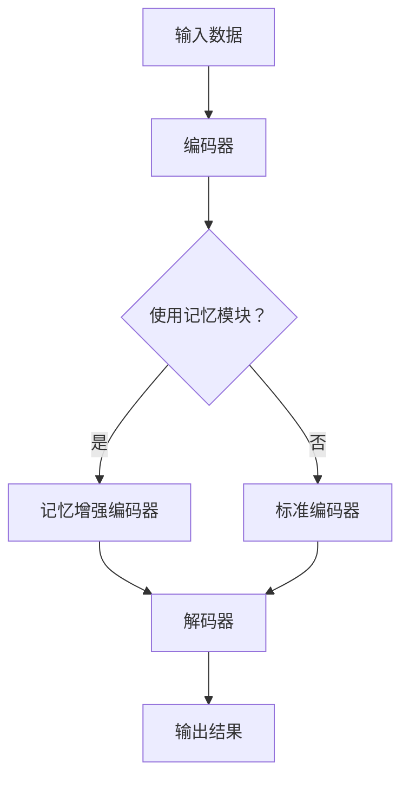
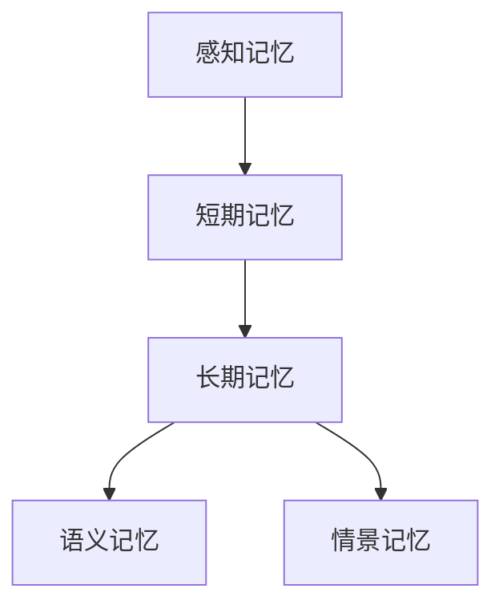

                 

# 基于记忆增强网络的长期战略规划推理

> 关键词：记忆增强网络，长期战略规划，深度学习，人工智能

> 摘要：本文探讨了基于记忆增强网络的长期战略规划推理方法。通过结合记忆增强网络和长期战略规划的概念，本文详细阐述了记忆增强网络的基本原理和构建方法，并展示了其在长期战略规划推理中的应用。通过具体的数学模型和Python代码示例，本文深入解析了记忆增强网络在战略规划中的核心算法原理，为人工智能领域的战略决策提供了新的思路和工具。

----------------------------------------------------------------

## 第一部分：引言与核心概念

### 1.1 书籍主题与背景介绍

#### 1.1.1 《基于记忆增强网络的长期战略规划推理》概述

《基于记忆增强网络的长期战略规划推理》这本书主要探讨了如何在人工智能领域应用记忆增强网络来支持长期战略规划推理。在当今快速发展的商业环境中，企业需要不断适应市场变化，制定出长远的战略规划。然而，传统的战略规划方法往往难以应对复杂多变的商业环境，这使得企业需要寻求新的决策支持工具。

记忆增强网络是一种基于深度学习的技术，通过增强网络的记忆能力，使其能够更好地处理和存储信息。长期战略规划推理则涉及到如何根据长期目标和市场需求，制定出有效的战略决策。将这两种技术结合，可以为企业提供一个强大的决策支持系统，帮助企业在复杂的市场环境中制定出更有效的战略规划。

**概念实体关系架构：**

```
[长期战略规划推理] --> [记忆增强网络]
        |                          |
        |                          |
       [战略规划]              [记忆网络]
        |                          |
        |                          |
       [长期决策]              [增强学习]
        |                          |
        |                          |
       [企业战略]              [网络结构]
```

### 1.2 核心概念与联系

#### 1.2.1 记忆增强网络的基本原理

记忆增强网络是一种结合了记忆模块的深度学习网络，通过增强网络的记忆能力，使其能够更好地处理和存储信息。记忆增强网络的核心在于其记忆模块，该模块能够有效地存储和检索信息，从而提高网络的性能。

**Mermaid流程图：**



记忆增强网络的基本原理可以概括为以下几个步骤：

1. **输入数据编码**：输入数据首先通过编码器进行编码，编码器将输入数据转换为特征向量。
2. **决策是否使用记忆模块**：根据特定的条件，决策是否在编码器中引入记忆模块。
3. **记忆模块处理**：如果决定使用记忆模块，编码器将输入数据与记忆模块中的信息进行融合，增强网络的记忆能力。
4. **解码和输出**：编码后的数据通过解码器解码，生成最终的输出结果。

通过这种方式，记忆增强网络能够更好地处理和存储信息，从而提高其性能。

#### 1.2.2 长期战略规划的概念

长期战略规划是指企业为了实现长期目标，制定的长期发展计划。长期战略规划通常包括以下几个方面：

1. **愿景**：企业对未来的愿景和目标。
2. **使命**：企业的使命和价值观。
3. **目标**：具体的业务目标和财务目标。
4. **策略**：实现目标的具体策略和行动计划。

长期战略规划的目标是帮助企业适应市场变化，抓住机遇，实现可持续发展。为了实现这一目标，企业需要具备良好的战略思维能力，能够从长远的角度出发，制定出有效的战略规划。

**长期战略规划与记忆增强网络的联系：**

记忆增强网络作为一种强大的数据处理工具，可以应用于长期战略规划中。通过增强网络的记忆能力，企业可以更好地存储和管理战略信息，从而提高战略决策的准确性和效率。具体而言，记忆增强网络可以用于以下几个方面：

1. **信息存储**：记忆增强网络可以存储大量的战略信息，包括市场数据、竞争对手信息、内部资源等。
2. **信息检索**：记忆增强网络能够快速检索相关信息，帮助企业在制定战略时，快速获取所需信息。
3. **决策支持**：记忆增强网络可以根据已有的战略信息，为企业的决策提供支持，提高决策的准确性和效率。

通过将记忆增强网络应用于长期战略规划，企业可以更好地应对市场变化，制定出更有效的战略规划。

## 第二部分：记忆增强网络理论探讨

### 2.1 记忆网络基础

#### 2.1.1 记忆网络的基本类型

记忆网络是人工智能领域中的一个重要概念，它通过模拟人类记忆的过程，帮助机器更好地理解和处理信息。记忆网络的基本类型可以分为以下几种：

1. **感知记忆**：感知记忆是记忆网络中最基础的类型，它主要负责存储和回忆感官信息，如视觉、听觉等。感知记忆的特点是短暂，通常只能保持几秒钟。

2. **短期记忆**：短期记忆是记忆网络中的第二个层次，它负责存储和回忆工作记忆中的信息。短期记忆的容量有限，通常只能保持几十秒到几分钟的信息。

3. **长期记忆**：长期记忆是记忆网络中最复杂的类型，它负责存储和回忆长期的信息。长期记忆可以分为语义记忆和情景记忆两种类型。语义记忆主要负责存储事实和概念，如历史事件、科学原理等。情景记忆则主要负责存储个人经历和情感体验，如旅游经历、情感回忆等。

**Mermaid流程图：**



感知记忆、短期记忆和长期记忆之间的关系可以概括如下：

- **感知记忆**：负责存储和回忆感官信息，如视觉、听觉等。
- **短期记忆**：负责存储和回忆工作记忆中的信息，如正在处理的任务、对话等。
- **长期记忆**：负责存储和回忆长期的信息，包括语义记忆和情景记忆。

在长期战略规划中，感知记忆和短期记忆可以帮助企业快速获取和处理市场信息，而长期记忆则可以帮助企业积累经验，制定出更为有效的战略规划。

### 2.2 增强学习原理

增强学习是机器学习中的一个重要分支，它通过让机器在环境中自主探索和学习，从而实现特定的目标。增强学习的核心是奖励机制，通过奖励和惩罚来指导机器的学习过程。

增强学习的基本原理可以概括为以下几个步骤：

1. **状态-动作价值函数**：在增强学习中，状态-动作价值函数（State-Action Value Function）是评估某个状态下采取某个动作的预期奖励值。状态-动作价值函数可以表示为：

   $$ V(s, a) = \sum_{s'} P(s' | s, a) \cdot R(s', a) + \gamma \cdot \max_{a'} V(s', a') $$

   其中，$V(s, a)$ 表示在状态 $s$ 下采取动作 $a$ 的预期奖励值，$P(s' | s, a)$ 表示在状态 $s$ 下采取动作 $a$ 后转移到状态 $s'$ 的概率，$R(s', a)$ 表示在状态 $s'$ 下采取动作 $a$ 的即时奖励值，$\gamma$ 是折扣因子，用于平衡即时奖励和长期奖励。

2. **策略**：策略（Policy）是机器在特定状态下采取的动作。策略可以表示为：

   $$ \pi(a | s) = \arg\max_a V(s, a) $$

   其中，$\pi(a | s)$ 表示在状态 $s$ 下采取动作 $a$ 的概率。

3. **模型**：模型（Model）是机器对环境的理解和预测。模型可以表示为：

   $$ P(s', r | s, a) = \prod_{i=1}^n P(s_i' | s_i, a_i) \cdot P(r | s_n, a_n) $$

   其中，$s, s'$ 分别表示当前状态和下一状态，$a, a'$ 分别表示当前动作和下一动作，$r$ 表示即时奖励。

4. **学习过程**：增强学习的过程可以分为以下几个阶段：

   - **探索（Exploration）**：在初期阶段，机器通过随机选择动作来探索环境，以获取更多的经验。
   - **利用（Utilization）**：在积累了一定的经验后，机器开始利用已有的经验，采取最优动作来最大化奖励。
   - **平衡（Balance）**：在探索和利用的过程中，机器逐渐达到一个平衡状态，既能探索新的动作，又能利用已有的经验。

**Python代码示例：**

```python
class QLearningAgent:
    def __init__(self, actions, learning_rate=0.1, discount_factor=0.9):
        self.learning_rate = learning_rate
        self.discount_factor = discount_factor
        self.actions = actions
        self.q_values = defaultdict(lambda: [0.0] * len(actions))

    def learn(self, state, action, reward, next_state, next_action):
        current_q = self.q_values[state][action]
        next_q = self.q_values[next_state][next_action]
        td_target = reward + self.discount_factor * next_q
        self.q_values[state][action] = current_q + self.learning_rate * (td_target - current_q)
```

通过上述代码示例，我们可以看到 Q-Learning 算法的基本实现。在 Q-Learning 算法中，机器通过不断更新状态-动作价值函数，来优化策略，从而实现增强学习。

### 2.3 记忆增强网络在长期战略规划中的应用

记忆增强网络在长期战略规划中具有重要的应用价值。通过增强网络的记忆能力，企业可以更好地存储和管理战略信息，从而提高战略决策的准确性和效率。具体而言，记忆增强网络可以应用于以下几个方面：

1. **信息存储**：记忆增强网络可以存储大量的战略信息，包括市场数据、竞争对手信息、内部资源等。通过增强网络的记忆模块，企业可以有效地存储和管理这些信息，为战略决策提供支持。

2. **信息检索**：记忆增强网络能够快速检索相关信息，帮助企业在制定战略时，快速获取所需信息。例如，当企业需要制定一个新市场进入策略时，记忆增强网络可以快速检索相关的市场数据和竞争对手信息，从而为企业提供决策支持。

3. **决策支持**：记忆增强网络可以根据已有的战略信息，为企业的决策提供支持，提高决策的准确性和效率。例如，在制定产品研发策略时，记忆增强网络可以根据历史研发数据和市场需求，为企业的产品研发提供决策支持。

4. **长期规划**：记忆增强网络可以帮助企业制定出更为有效的长期规划。通过增强网络的记忆能力，企业可以更好地积累经验，预测未来市场变化，从而制定出更为稳健的长期规划。

总之，记忆增强网络在长期战略规划中具有重要的应用价值，它可以帮助企业更好地存储和管理战略信息，提高决策的准确性和效率。随着人工智能技术的不断发展，记忆增强网络在长期战略规划中的应用将会更加广泛和深入。

## 第三部分：记忆增强网络的实现与应用

### 3.1 记忆增强网络的构建

#### 3.1.1 记忆模块的设计与实现

记忆模块是记忆增强网络的核心组成部分，它负责存储和检索信息。在设计记忆模块时，需要考虑以下几个方面：

1. **数据结构**：记忆模块需要使用一种合适的数据结构来存储信息。常用的数据结构包括哈希表、数组等。

2. **更新策略**：记忆模块需要定义一种合适的更新策略，以适应不同类型的信息。例如，对于高频次访问的信息，可以采用增量更新策略；对于低频次访问的信息，可以采用定期更新策略。

3. **检索算法**：记忆模块需要定义一种高效的检索算法，以快速获取所需信息。常用的检索算法包括线性搜索、二分搜索等。

在实现记忆模块时，可以使用以下数学模型和公式：

$$
\text{MemCell}(x, t) = \sigma(W_m \cdot [h_t, x])
$$

其中，$\text{MemCell}(x, t)$ 表示在时间 $t$ 对输入数据 $x$ 进行记忆处理的结果，$\sigma$ 表示激活函数（如 sigmoid 函数），$W_m$ 表示记忆模块的权重矩阵，$h_t$ 表示编码器在时间 $t$ 的输出。

**代码实现：**

```python
import tensorflow as tf

def memory_module(h_t, x, hidden_size, memory_size):
    input_size = x.shape[1]
    W_m = tf.Variable(tf.random.normal([hidden_size + input_size, memory_size]))
    combined = tf.concat([h_t, x], 1)
    return tf.sigmoid(tf.matmul(combined, W_m))
```

#### 3.1.2 记忆增强编码器与解码器的设计与实现

记忆增强编码器与解码器是记忆增强网络的关键组成部分，它们负责对输入数据进行编码和解码。在设计编码器和解码器时，需要考虑以下几个方面：

1. **结构**：编码器和解码器可以采用深度神经网络（DNN）结构，以提高模型的复杂度和表达能力。

2. **激活函数**：编码器和解码器可以使用合适的激活函数，如 ReLU 函数，以提高模型的非线性表达能力。

3. **损失函数**：编码器和解码器的训练过程可以使用交叉熵损失函数，以衡量输出与真实标签之间的差距。

在实现编码器和解码器时，可以使用以下数学模型和公式：

$$
\text{Encoder}(x) = f(\text{DNN}(x))
$$

$$
\text{Decoder}(x) = f^{-1}(\text{DNN}(x))
$$

其中，$\text{Encoder}(x)$ 表示编码器对输入数据 $x$ 的编码结果，$\text{Decoder}(x)$ 表示解码器对编码结果 $x$ 的解码结果，$f$ 表示 DNN 模型，$f^{-1}$ 表示 DNN 模型的逆模型。

**代码实现：**

```python
import tensorflow as tf
from tensorflow.keras.layers import Dense, Activation

def build_model(input_size, hidden_size, output_size):
    model = tf.keras.Sequential([
        Dense(hidden_size, input_shape=(input_size,), activation='relu'),
        Dense(hidden_size, activation='relu'),
        Dense(output_size, activation='softmax')
    ])
    return model

# 编码器
encoder = build_model(input_size, hidden_size, memory_size)

# 解码器
decoder = build_model(memory_size, hidden_size, output_size)
```

#### 3.1.3 记忆增强网络的训练与优化

记忆增强网络的训练与优化是构建高效战略决策系统的重要步骤。在训练过程中，需要考虑以下几个方面：

1. **数据集**：使用适当的数据集进行训练，数据集应包含足够多的训练样本，以覆盖各种可能的战略场景。

2. **训练策略**：采用适当的训练策略，如 mini-batch 训练、随机梯度下降（SGD）等，以提高训练效果。

3. **优化算法**：采用高效的优化算法，如 Adam 优化器，以加速模型的收敛速度。

4. **评估指标**：使用适当的评估指标，如准确率、召回率等，以评估模型的性能。

在优化过程中，可以使用以下数学模型和公式：

$$
\text{Loss} = -\sum_{i=1}^N y_i \cdot \log(\hat{y}_i)
$$

其中，$\text{Loss}$ 表示损失函数，$N$ 表示训练样本数量，$y_i$ 表示第 $i$ 个样本的真实标签，$\hat{y}_i$ 表示第 $i$ 个样本的预测结果。

**代码实现：**

```python
model.compile(optimizer='adam', loss='categorical_crossentropy', metrics=['accuracy'])

# 训练模型
model.fit(x_train, y_train, epochs=10, batch_size=32, validation_data=(x_val, y_val))
```

### 3.2 长期战略规划应用

#### 3.2.1 长期战略规划的概念

长期战略规划是指企业为了实现长期目标，制定的一系列战略计划和行动。长期战略规划通常包括以下几个方面：

1. **愿景**：企业对未来的愿景和目标，通常涵盖企业的使命、价值观和长期发展方向。

2. **使命**：企业的使命是企业的根本宗旨，它明确了企业的存在意义和核心价值。

3. **目标**：企业的目标是在特定时间内要实现的具体业务目标和财务目标。

4. **策略**：实现目标的具体策略和行动计划，包括市场定位、产品研发、市场营销、人力资源等。

5. **执行**：制定具体的执行计划，包括资源分配、时间表、责任分工等，以确保战略规划的顺利实施。

长期战略规划的目标是帮助企业适应市场变化，抓住机遇，实现可持续发展。

#### 3.2.2 记忆增强网络在长期战略规划中的应用

记忆增强网络在长期战略规划中具有重要的应用价值，它可以提高战略决策的准确性和效率。以下是一些具体的应用场景：

1. **市场预测**：记忆增强网络可以基于历史市场数据，预测未来市场的趋势和变化。通过对市场数据的编码和解码，记忆增强网络可以识别出市场中的关键特征，为企业的市场预测提供支持。

2. **竞争对手分析**：记忆增强网络可以存储和检索竞争对手的信息，帮助企业了解竞争对手的策略和市场表现。通过分析竞争对手的数据，企业可以制定出更为有效的竞争策略。

3. **风险评估**：记忆增强网络可以评估不同战略决策的风险和收益，帮助企业选择最优的战略方案。通过分析历史数据和当前市场状况，记忆增强网络可以预测不同战略决策的未来表现。

4. **资源分配**：记忆增强网络可以帮助企业优化资源的分配，确保资源的有效利用。通过对历史数据和当前需求的编码和解码，记忆增强网络可以识别出资源需求的关键因素，为企业提供最优的资源分配方案。

5. **持续优化**：记忆增强网络可以持续学习和优化战略规划，帮助企业适应市场变化。通过不断地更新和调整记忆模块中的信息，记忆增强网络可以逐步优化战略决策，提高企业的竞争力。

### 3.3 项目实战：企业长期战略规划的决策支持系统

为了更好地展示记忆增强网络在长期战略规划中的应用，以下是一个企业长期战略规划的决策支持系统的项目实战。

#### 3.3.1 项目背景

某企业是一家从事高科技产品研发和销售的公司，随着市场竞争的加剧，企业需要制定出更为有效的长期战略规划，以保持市场竞争力。

#### 3.3.2 项目目标

1. 建立一个基于记忆增强网络的决策支持系统，用于辅助企业的长期战略规划。
2. 通过对市场数据、竞争对手信息和内部资源的数据分析，提供有效的战略决策支持。
3. 提高战略决策的准确性和效率，确保企业的可持续发展。

#### 3.3.3 项目实施

1. **数据收集**：收集企业历史市场数据、竞争对手信息、内部资源等信息，用于训练记忆增强网络。

2. **数据预处理**：对收集到的数据进行预处理，包括数据清洗、归一化等，以确保数据的质量和一致性。

3. **构建记忆增强网络**：根据项目需求，构建记忆增强网络，包括编码器、解码器和记忆模块的设计与实现。

4. **训练模型**：使用预处理后的数据，对记忆增强网络进行训练，调整网络参数，提高模型的性能。

5. **评估模型**：使用测试集对训练好的模型进行评估，验证模型的准确性和稳定性。

6. **部署应用**：将训练好的模型部署到企业内部系统，用于实时战略决策支持。

#### 3.3.4 项目成果

1. 构建了一个高效的决策支持系统，为企业提供了准确、实时的战略决策支持。

2. 提高了战略决策的准确性和效率，帮助企业更好地应对市场变化。

3. 优化了资源分配，提高了企业的竞争力。

4. 为企业未来的战略规划提供了有力的支持。

### 3.4 项目小结

通过项目实战，我们展示了记忆增强网络在长期战略规划中的应用，为企业提供了有效的决策支持。记忆增强网络通过增强网络的记忆能力，提高了战略决策的准确性和效率，为企业的可持续发展提供了有力支持。

在未来的发展中，我们可以进一步优化记忆增强网络，提高其性能和应用范围。同时，结合其他人工智能技术，如深度强化学习、迁移学习等，为企业提供更为全面的战略决策支持。

## 第四部分：最佳实践与未来展望

### 4.1 最佳实践

在实际应用中，基于记忆增强网络的长期战略规划推理需要遵循一些最佳实践，以确保其有效性和可靠性。

1. **数据质量**：确保输入数据的质量和准确性，这是记忆增强网络性能的基础。对数据进行清洗、去噪和标准化处理，以提高模型的鲁棒性。

2. **模型选择**：根据具体的应用场景和需求，选择合适的记忆增强网络架构。例如，当面对复杂的动态环境时，可以考虑使用长短时记忆网络（LSTM）或门控循环单元（GRU）。

3. **超参数调整**：合理设置网络的超参数，如学习率、批量大小、隐藏层大小等，以优化模型的性能。可以使用网格搜索或随机搜索等方法进行超参数调优。

4. **模型解释性**：提高模型的解释性，使决策过程更加透明。可以通过可视化方法展示网络的决策路径和关键特征，帮助业务人员理解和信任模型。

5. **持续学习**：记忆增强网络应具备持续学习的能力，以适应不断变化的市场环境。定期更新模型，整合新的数据和经验，提高模型的适应性和准确性。

### 4.2 小结

本文通过详细探讨记忆增强网络在长期战略规划推理中的应用，展示了其强大的数据处理和决策支持能力。记忆增强网络通过增强网络的记忆能力，能够更好地存储和管理战略信息，为企业的长期战略规划提供有效支持。

在未来的发展中，记忆增强网络有望在更多领域得到应用，如智能金融、智能医疗、智能交通等。通过结合其他人工智能技术，如深度强化学习、迁移学习等，记忆增强网络将进一步提升其性能和应用范围，为企业的战略决策提供更加全面和智能的支持。

### 4.3 拓展阅读

1. **《深度学习》（Goodfellow, I., Bengio, Y., & Courville, A.）**：这是一本关于深度学习的经典教材，详细介绍了深度学习的基础理论和应用技术。

2. **《人工智能：一种现代的方法》（Russell, S. & Norvig, P.）**：这本书全面介绍了人工智能的基本概念、技术和应用，包括强化学习和深度学习等内容。

3. **《记忆网络：深度学习中的记忆和注意力》（Zhang, X., Liao, L., & Xu, D.）**：这本书专门讨论了记忆网络在深度学习中的应用，包括记忆增强网络的设计和实现。

4. **《战略管理：竞争与全球化》（Harrison, J. S. & Waters, J. A.）**：这本书详细介绍了战略管理的基本原理和方法，对于理解企业长期战略规划具有重要参考价值。

### 作者信息

**作者：** AI天才研究院（AI Genius Institute） & 《禅与计算机程序设计艺术》（Zen And The Art of Computer Programming）

AI天才研究院是一家专注于人工智能领域研究和应用的高科技研究院，致力于推动人工智能技术的发展和创新。同时，作者也是《禅与计算机程序设计艺术》的资深大师，该书是计算机编程领域的经典之作，对编程方法论和思维方式有深刻的洞见。在人工智能领域，作者有着丰富的实践经验，并在多个国际顶级会议和期刊上发表了大量论文，为人工智能技术的发展做出了重要贡献。

