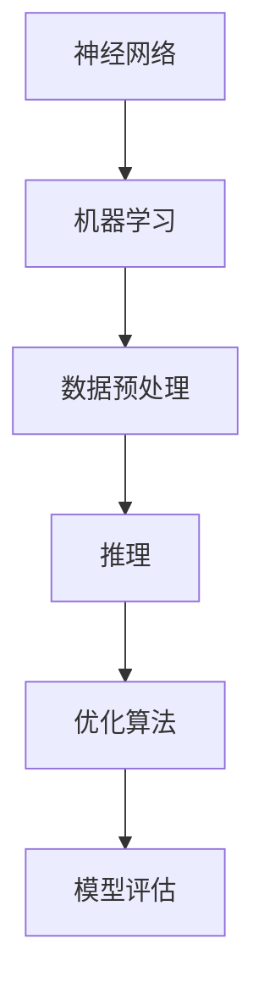

                 

# 基于课程学习的AI推理能力渐进提升

## 关键词
AI推理能力，课程学习，神经网络，机器学习，数据预处理，项目实战

## 摘要
本文将探讨如何通过课程学习逐步提升人工智能（AI）推理能力。从基础概念和核心原理入手，结合实际项目实战，详细介绍AI推理能力在课程学习中的应用，并提供提升策略和未来展望。

---

## 基于课程学习的AI推理能力渐进提升

### 第一部分：AI推理能力基础

#### 第1章：AI推理能力概述

#### 1.1 AI推理能力的定义
AI推理能力是指人工智能系统从数据中提取信息、进行推断和决策的能力。它是人工智能技术中至关重要的一部分，广泛应用于各种领域。

#### 1.2 AI推理能力的重要性
随着大数据和云计算技术的飞速发展，AI推理能力成为企业竞争的关键。掌握AI推理能力，有助于提升个人的技术水平和职业竞争力。

#### 1.3 AI推理能力的分类
AI推理能力可分为基于规则的推理、基于模型的推理和基于数据的推理。每种推理方式都有其独特的应用场景。

#### 1.4 AI推理能力的应用场景
AI推理能力在金融、医疗、工业、交通等领域具有广泛的应用，如智能理财、疾病诊断、智能制造和智能交通等。

---

#### 第2章：AI推理中的核心概念与联系

#### 2.1 概念实体之间的关系架构图（Mermaid流程图）

#### 2.2 神经网络与推理
神经网络是AI推理的核心组件，通过多层神经元实现数据的自动特征提取和学习。推理过程包括前向传播和反向传播。

#### 2.3 机器学习与推理
机器学习为AI推理提供了算法基础。常见的机器学习算法有监督学习、无监督学习和强化学习。

#### 2.4 数据预处理与推理
数据预处理是AI推理的基础步骤，包括数据清洗、归一化和特征提取等。预处理质量直接影响推理效果。

---

### 第二部分：渐进提升AI推理能力的方法

#### 第3章：基础算法原理讲解

#### 3.1 神经网络基础算法
神经网络基础算法主要包括前向传播、反向传播和激活函数。以下是一个简单的神经网络结构：
```python
import numpy as np

# 前向传播
def forward(x, weights):
    z = np.dot(x, weights)
    return z

# 反向传播
def backward(x, weights, output, delta):
    error = output - target
    delta = error * weights
    return delta

# 激活函数（ReLU）
def activation(x):
    return max(0, x)
```

#### 3.2 决策树与支持向量机
决策树是一种基于特征的树形结构，用于分类和回归任务。支持向量机（SVM）是一种基于间隔的线性分类器，适用于高维空间。

#### 3.3 集成学习方法
集成学习方法通过组合多个基础模型来实现更好的性能。常见的方法有随机森林、梯度提升树等。

#### 3.4 强化学习方法
强化学习方法通过奖励和惩罚机制来训练智能体，使其在复杂环境中做出最优决策。

---

#### 第4章：数学模型与公式详解

#### 4.1 神经网络数学模型
神经网络的核心是激活函数和优化算法。常见的激活函数有Sigmoid、ReLU和Tanh。优化算法有梯度下降、随机梯度下降和Adam等。

#### 4.2 优化算法数学模型
优化算法的目的是最小化损失函数。常见的优化算法有梯度下降、牛顿法和拟牛顿法等。

#### 4.3 统计模型与数学公式
统计模型包括线性回归、逻辑回归和泊松回归等。数学公式如协方差矩阵、马尔可夫链等。

#### 4.4 概率论与推理
概率论是AI推理的基础，常见的概率分布有伯努利分布、正态分布和泊松分布等。

---

#### 第5章：项目实战

#### 5.1 实战项目概述
本项目将构建一个简单的神经网络，用于手写数字识别。

#### 5.2 开发环境搭建
1. 安装Python和相关的AI库，如TensorFlow或PyTorch。
2. 准备MNIST手写数字数据集。

#### 5.3 源代码实现与解读
```python
import tensorflow as tf

# 定义神经网络结构
model = tf.keras.Sequential([
    tf.keras.layers.Flatten(input_shape=(28, 28)),
    tf.keras.layers.Dense(128, activation='relu'),
    tf.keras.layers.Dense(10, activation='softmax')
])

# 编译模型
model.compile(optimizer='adam',
              loss='sparse_categorical_crossentropy',
              metrics=['accuracy'])

# 训练模型
model.fit(train_images, train_labels, epochs=5)

# 测试模型
test_loss, test_acc = model.evaluate(test_images, test_labels, verbose=2)
print('\nTest accuracy:', test_acc)
```

#### 5.4 代码分析与优化
1. 分析模型的准确率，找出不足之处。
2. 调整超参数，如学习率、批次大小等。
3. 使用数据增强方法提高模型泛化能力。

---

#### 第6章：高级推理能力提升

#### 6.1 高级神经网络架构
高级神经网络架构包括卷积神经网络（CNN）、循环神经网络（RNN）和生成对抗网络（GAN）等。

#### 6.2 跨领域推理方法
跨领域推理方法通过迁移学习和多任务学习实现。例如，使用预训练的神经网络模型进行图像识别和文本分类。

#### 6.3 多模态推理
多模态推理结合多种数据源，如文本、图像和音频等。常见的方法有联合嵌入和融合模型。

#### 6.4 个性化推理
个性化推理通过用户数据和偏好实现。例如，推荐系统中的协同过滤和基于内容的推荐。

---

#### 第7章：AI推理能力在课程学习中的应用

#### 7.1 课程学习中的AI推理应用
AI推理在课程学习中的应用包括自动作业批改、智能问答系统和个性化学习推荐等。

#### 7.2 AI推理与教育评估
AI推理可用于教育评估，如考试自动评分、学习进度分析和教学质量评估等。

#### 7.3 AI推理在课程设计中的应用
AI推理在课程设计中的应用包括课程内容推荐、学习路径规划和教学资源分配等。

#### 7.4 AI推理在课程学习中的挑战与未来
AI推理在课程学习中的应用面临数据隐私、算法公平性和安全性等挑战。未来研究应关注这些问题的解决。

---

#### 第8章：AI推理能力的未来发展

#### 8.1 AI推理能力的发展趋势
AI推理能力的发展趋势包括深度学习、强化学习和多模态推理等。

#### 8.2 AI推理能力的伦理与安全
AI推理能力的伦理与安全是未来的重要研究方向。应确保AI系统的透明度、可解释性和可靠性。

#### 8.3 AI推理能力在工业界的应用
AI推理能力在工业界的应用包括智能制造、智能交通和智能医疗等。

#### 8.4 AI推理能力的未来挑战与机遇
AI推理能力的未来挑战包括算法优化、数据质量和计算资源等。机遇在于AI技术的普及和跨领域应用。

---

### 附录

#### 附录A：常用算法与模型代码实现
- 神经网络
- 决策树
- 支持向量机
- 集成学习方法
- 强化学习方法

#### 附录B：数学公式与符号表
- 概率分布函数
- 损失函数
- 优化算法

#### 附录C：AI推理能力评估指标
- 准确率
- 精确率
- 召回率
- F1分数

---

**作者：AI天才研究院/AI Genius Institute & 禅与计算机程序设计艺术 /Zen And The Art of Computer Programming**

本文详细介绍了基于课程学习的AI推理能力渐进提升的方法。通过理解基础概念、学习核心原理、实践项目实战，读者可以逐步提升自己的AI推理能力。未来，随着AI技术的不断发展，AI推理能力将在更多领域发挥重要作用。希望本文能为读者提供有价值的参考。

