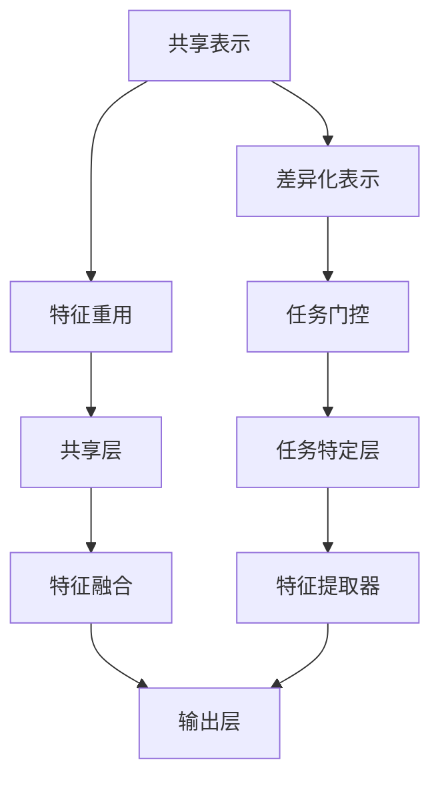

                 

# 《增强AI模型多任务处理能力的策略》

## 关键词
AI模型，多任务学习，模型架构优化，训练策略，算法融合，实践应用

## 摘要
本文探讨了如何增强人工智能（AI）模型在多任务处理中的能力。首先，介绍了AI模型多任务处理的背景与核心概念，包括现状、挑战和基本类型。接着，分析了增强多任务处理能力的策略，包括模型架构优化、训练策略优化和算法融合。文章还通过实际项目案例，展示了这些策略在多任务语音识别系统和图像分析系统中的应用，并提出了未来研究方向与挑战。

## 第一部分：AI模型多任务处理的背景与核心概念

### 第1章：AI模型多任务处理的现状与挑战

#### 1.1 引言：AI模型多任务处理的必要性

随着人工智能技术的快速发展，AI模型的应用场景越来越广泛。然而，传统的单任务模型在处理复杂、多元的任务时存在一定的局限性。多任务学习（Multitask Learning）作为人工智能领域的一个研究热点，旨在通过训练一个单一的模型同时完成多个任务，以提高模型的泛化能力和资源利用效率。

#### 1.2 多任务学习的基本概念

多任务学习是指在一个统一的模型框架下，同时学习多个相关任务的方法。根据任务之间的关系，多任务学习可以分为两种类型：

- **共享表示**：多个任务共享同一个特征提取器，即特征表示是共享的。
- **差异化表示**：每个任务都有自己的特征提取器，但通过特定的方法（如共享层、任务门控等）实现特征的重用。

#### 1.3 多任务学习的挑战与问题

尽管多任务学习具有诸多优势，但在实际应用中仍面临一系列挑战：

- **任务之间的干扰**：不同任务可能会相互干扰，导致模型性能下降。
- **计算资源消耗**：多任务学习通常需要更大的模型和更长的训练时间。
- **数据不平衡**：某些任务可能具有更多或更重要的数据，导致训练不平衡。
- **模型复杂度**：多任务模型的设计和优化比单任务模型更为复杂。

### 第2章：核心概念与联系

#### 2.1 多任务学习与单任务学习的关系

多任务学习是单任务学习的自然扩展。单任务学习关注于在一个特定任务上达到最佳性能，而多任务学习则试图在一个统一框架下同时优化多个任务。

#### 2.2 多任务学习中的共享与差异化

在多任务学习中，共享和差异化是两个核心策略。共享表示通过重用特征表示来提高效率，而差异化表示则通过为每个任务提供定制化的特征来增强性能。

#### 2.3 Mermaid流程图：多任务学习框架关系展示

## 第二部分：增强AI模型多任务处理能力的方法

### 第3章：模型架构优化策略

#### 3.1 多层感知机与多层网络

多层感知机（MLP）是常见的单任务模型架构，但在多任务处理中，可以使用多层网络（如深度神经网络）来增强模型的表示能力和泛化能力。

#### 3.2 循环神经网络（RNN）在多任务中的应用

循环神经网络（RNN）擅长处理序列数据，其在多任务学习中的应用可以通过共享隐藏状态或不同任务之间的交互来实现。

#### 3.3 图神经网络（GNN）在多任务中的应用

图神经网络（GNN）能够处理图结构数据，适用于需要处理复杂数据关系的多任务场景。

### 第4章：训练策略优化

#### 4.1 数据增强与任务转换

数据增强可以通过增加数据的多样性来提升模型的泛化能力。任务转换是一种将原始任务转换为适合多任务学习的形式的方法。

#### 4.2 对抗训练与鲁棒性提升

对抗训练通过生成对抗网络（GAN）等技术来提高模型对干扰和异常数据的鲁棒性。

#### 4.3 学习率调度策略

学习率调度策略可以通过动态调整学习率来优化模型的训练过程，提高收敛速度和最终性能。

### 第5章：算法融合与集成学习

#### 5.1 传统集成学习方法

传统集成学习方法，如Bagging和Boosting，可以通过组合多个基学习器来提高模型的泛化能力。

#### 5.2 基于深度学习的集成学习方法

基于深度学习的集成学习方法，如模型融合和模型蒸馏，可以有效地提高多任务模型的表现。

#### 5.3 算法融合的多任务应用案例分析

通过具体案例展示算法融合在多任务学习中的应用，以及如何解决实际中的挑战。

## 第三部分：多任务处理能力提升的实践应用

### 第6章：多任务语音识别系统的开发

#### 6.1 项目背景与目标

介绍多任务语音识别系统的背景，包括语音识别的挑战和市场需求。

#### 6.2 系统架构设计

详细描述系统的整体架构，包括前端语音处理、后端多任务模型和中间层的融合策略。

#### 6.3 模型设计与实现

介绍多任务语音识别模型的设计，包括输入层、隐藏层和输出层的实现细节。

#### 6.4 实际案例与性能评估

通过实际案例展示模型的性能，并进行详细的分析和评估。

### 第7章：多任务图像分析系统的实现

#### 7.1 项目背景与目标

介绍多任务图像分析系统的背景，包括图像处理的挑战和实际应用场景。

#### 7.2 系统架构设计

描述系统的整体架构，包括图像预处理、多任务模型和后处理模块。

#### 7.3 模型设计与实现

介绍多任务图像分析模型的设计，包括网络结构、损失函数和训练策略。

#### 7.4 实际案例与性能评估

展示模型在实际案例中的应用，并对其性能进行详细评估。

### 第8章：多任务处理能力的持续提升

#### 8.1 当前研究趋势

分析当前多任务学习的研究趋势，包括最新的模型架构和算法。

#### 8.2 未来发展方向

探讨多任务学习的未来发展方向，包括潜在的突破点和挑战。

#### 8.3 总结与展望

总结文章的主要内容，并对未来研究方向进行展望。

## 附录

### 附录A：多任务学习工具与资源推荐

#### A.1 常见深度学习框架

介绍常见的深度学习框架，如TensorFlow、PyTorch等，以及它们在多任务学习中的应用。

#### A.2 多任务学习开源库

推荐一些常用的多任务学习开源库，如MTL、All Multi-Task等，以及它们的优缺点。

#### A.3 学习资源推荐

推荐一些学习资源，包括论文、书籍和在线课程，帮助读者深入了解多任务学习。

# 作者：AI天才研究院/AI Genius Institute & 禅与计算机程序设计艺术 /Zen And The Art of Computer Programming

---

**注**：以上内容为Markdown格式的文章大纲，每个章节的具体内容还需要进一步丰富和详细阐述。在撰写每个章节时，应确保核心概念的解释清晰，算法原理的讲解透彻，并且包含适当的Python代码示例和数学公式。预计总字数将在10000-12000字左右，以确保文章内容的完整性和深度。**

