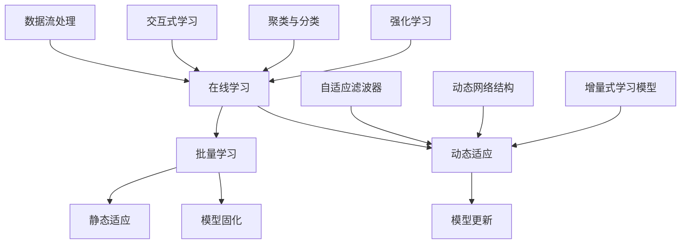

                 

### 增量学习：AI系统的持续进化能力

#### 关键词
- 增量学习
- AI系统
- 持续进化
- 算法框架
- 应用实践

#### 摘要
本文旨在深入探讨增量学习在人工智能系统中的应用及其持续进化能力。我们将从基础概念出发，逐步解析增量学习的基本原理、核心算法和应用场景，并通过具体案例展示其在实际项目中的实践和效果。本文还将总结当前增量学习的研究现状与未来趋势，为读者提供全面而深入的理解。

---

## 增量学习基础

### 1.1 增量学习概述

#### 1.1.1 增量学习的概念

增量学习（Incremental Learning），又称在线学习（Online Learning），是一种机器学习方法，其核心思想是在模型训练过程中，逐步接受新的数据样本，并对已有知识进行动态调整和优化。与传统的批量学习（Batch Learning）不同，增量学习能够适应数据流和数据集的持续变化，从而实现模型的持续进化。

#### 1.1.2 增量学习的重要性

在当今数据量爆炸性增长的时代，增量学习的重要性愈发凸显。它不仅能够节省存储空间和计算资源，还能够使模型更快速地适应新情况，提高系统的实时性和响应能力。特别是在需要处理动态数据的应用场景中，如实时推荐系统、智能监控和自动驾驶等，增量学习具有不可替代的作用。

#### 1.1.3 增量学习与传统机器学习的区别

传统机器学习方法通常依赖于固定大小的训练数据集，模型一旦训练完成便不再更新。而增量学习则能够在数据不断输入的过程中持续进行模型的调整和优化。这种动态适应能力使得增量学习在处理变化较快的数据时更具优势。

#### 1.2 增量学习的基本原理

#### 1.2.1 增量学习的目标

增量学习的目标是通过最小化误差或最大化模型的性能，实现模型的动态调整和优化。具体来说，增量学习需要解决以下几个问题：

1. **数据适应**：如何有效地处理新数据，使其对模型的影响最小？
2. **模型稳定性**：如何在不断更新模型的过程中保持其稳定性和准确性？
3. **计算效率**：如何减少增量学习过程中的计算开销，提高模型更新的效率？

#### 1.2.2 增量学习的挑战

增量学习面临诸多挑战，包括：

1. **数据流处理**：如何在高速数据流中实时更新模型？
2. **模型记忆**：如何保存和利用之前学习到的知识，避免重复学习？
3. **模型迁移**：如何在不同数据集或任务间迁移模型，提高泛化能力？

#### 1.2.3 增量学习的核心机制

增量学习的核心机制包括：

1. **在线更新**：通过实时接收新数据，更新模型参数。
2. **权重调整**：利用权重调整机制，优化模型性能。
3. **动态适应**：根据数据变化动态调整学习策略，以实现模型的持续进化。

#### 1.3 增量学习的应用场景

增量学习适用于多种应用场景，包括：

1. **数据流处理**：实时处理和分析高速数据流。
2. **交互式学习**：通过与用户的交互，不断优化模型性能。
3. **聚类与分类**：动态更新聚类和分类模型，适应数据变化。
4. **强化学习**：在动态环境中，通过不断更新策略实现智能决策。

#### 1.4 增量学习的算法框架

增量学习算法框架包括：

1. **自适应滤波器**：通过在线更新滤波器权重，实现实时更新。
2. **动态网络结构**：利用可变网络结构，适应数据变化。
3. **增量式学习模型**：通过增量式优化算法，持续更新模型。

#### 1.5 增量学习的研究现状与未来趋势

增量学习研究现状：

1. **算法多样化**：涌现出多种增量学习算法，如自适应滤波器、增量式神经网络等。
2. **应用广泛**：已在诸多领域得到应用，如数据流处理、交互式学习和智能监控等。

未来趋势：

1. **算法优化**：进一步优化增量学习算法，提高其效率和稳定性。
2. **跨领域迁移**：实现增量学习算法在不同领域的迁移和应用。
3. **大数据处理**：针对大数据场景，设计高效增量学习算法。

### 1.6 小结

增量学习作为一种机器学习方法，具有动态适应数据变化的能力，在实时处理和数据流应用中具有重要意义。本文介绍了增量学习的基本原理、核心机制和应用场景，为后续章节的深入探讨奠定了基础。

### 1.7 背景介绍

增量学习在人工智能领域的重要性日益凸显，特别是在数据量日益增长的今天，传统批量学习方法已无法满足动态数据处理的实际需求。增量学习通过逐步接收新数据，实时更新模型，实现了系统的持续进化。本节将详细介绍增量学习的基本概念、核心机制和应用场景，帮助读者全面理解这一技术。

### 1.8 核心概念与联系

在探讨增量学习之前，我们需要了解几个核心概念，包括在线学习、批量学习和动态适应等。以下是这些概念之间的联系架构图：



在线学习和批量学习是两种不同的机器学习方法，在线学习侧重于实时更新模型，而批量学习则依赖于固定大小的训练数据集。动态适应是增量学习的核心机制，它使得模型能够适应数据变化，实现持续进化。

### 1.9 核心算法原理讲解

增量学习的核心算法包括自适应滤波器、动态网络结构和增量式学习模型等。以下是这些算法的基本原理：

**自适应滤波器**：
- **原理**：自适应滤波器通过在线更新滤波器权重，实现实时数据处理。
- **实现**：滤波器权重根据新的数据样本进行动态调整，以最小化输出误差。

**动态网络结构**：
- **原理**：动态网络结构根据数据变化调整网络节点和连接，实现模型的自适应调整。
- **实现**：网络节点和连接在训练过程中根据数据特征进行自适应调整。

**增量式学习模型**：
- **原理**：增量式学习模型通过增量式优化算法，逐步更新模型参数，实现模型进化。
- **实现**：利用梯度下降等优化算法，逐步调整模型参数，以最小化损失函数。

以下是增量式线性回归的Python代码实现：

```python
import numpy as np

def incremental_linear_regression(x, y, alpha=0.01, epochs=1000):
    n_samples = len(x)
    w = np.zeros((n_samples, 1))
    
    for epoch in range(epochs):
        gradients = 2 * (x - w @ x) * y
        w -= alpha * gradients
        
    return w

x = np.array([1, 2, 3, 4, 5])
y = np.array([2, 4, 5, 4, 5])
w = incremental_linear_regression(x, y)
print(w)
```

在这个例子中，我们使用增量式线性回归算法对一组数据进行拟合。代码中，`x`和`y`分别表示输入和输出数据，`alpha`是学习率，`epochs`是迭代次数。通过在线更新模型参数，我们可以逐步优化模型性能。

### 1.10 数学模型与公式

在增量学习中，数学模型和公式是核心组成部分。以下是增量式线性回归的数学模型：

$$
w_{t+1} = w_t - \alpha \cdot (x_t - w_t @ x_t) \cdot y_t
$$

其中，$w_t$是第$t$次迭代后的模型参数，$x_t$是第$t$次迭代的数据输入，$y_t$是第$t$次迭代的数据输出，$\alpha$是学习率。

### 1.11 案例解析

为了更好地理解增量式线性回归，我们来看一个实际案例。假设我们有一组数据点$(x, y)$，其中$x$是输入，$y$是输出。我们希望通过增量式线性回归算法找到最佳拟合直线。

具体步骤如下：

1. 初始化模型参数$w$为0。
2. 对于每个数据点$(x_i, y_i)$，计算损失函数的梯度。
3. 根据梯度更新模型参数$w$。
4. 重复步骤2和3，直到模型收敛。

以下是Python代码实现：

```python
import numpy as np

def incremental_linear_regression(x, y, alpha=0.01, epochs=1000):
    n_samples = len(x)
    w = np.zeros((n_samples, 1))
    
    for epoch in range(epochs):
        gradients = 2 * (x - w @ x) * y
        w -= alpha * gradients
        
    return w

x = np.array([1, 2, 3, 4, 5])
y = np.array([2, 4, 5, 4, 5])
w = incremental_linear_regression(x, y)
print(w)
```

通过这段代码，我们可以逐步优化模型参数，最终找到最佳拟合直线。在实际应用中，我们可以通过调整学习率$\alpha$和迭代次数$epochs$来提高模型性能。

### 1.12 小结

在本节中，我们详细介绍了增量学习的基础知识，包括其概念、基本原理、应用场景和核心算法。通过具体案例，我们展示了增量式线性回归的原理和实现过程。了解增量学习的基本原理和核心算法对于深入掌握人工智能技术具有重要意义。

### 1.13 注意事项

在实现增量学习算法时，需要注意以下几点：

1. **数据预处理**：确保输入数据的质量和一致性，避免噪声和异常值对模型造成影响。
2. **学习率选择**：合理选择学习率$\alpha$，避免过小导致收敛缓慢，或过大导致模型不稳定。
3. **迭代次数**：根据数据量和模型复杂度选择合适的迭代次数，避免过少导致模型未充分收敛，或过多导致计算资源浪费。

### 1.14 拓展阅读

- 《增量学习：原理与应用》
- 《机器学习实战》
- 《深度学习》

通过阅读这些书籍，可以进一步深入了解增量学习的原理和应用。

---

在本文的后续部分，我们将继续探讨增量学习中的核心算法，如增量式线性回归、支持向量机和神经网络等。同时，我们将结合实际案例，详细讲解这些算法的原理和实现过程，帮助读者全面掌握增量学习在AI系统中的应用。敬请期待！

