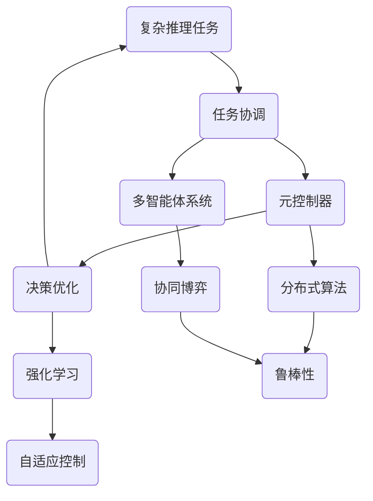

                 

### 复杂推理任务协调中元控制器的决策优化

在当今快速发展的信息技术时代，复杂推理任务的处理和协调已经成为许多关键应用的核心需求。这些任务往往涉及大量的数据、多个参与者以及多种约束条件，使得传统的单一控制方法难以胜任。元控制器（meta-controller）作为一种先进的协调机制，能够在复杂环境中进行有效的决策优化，从而提高系统的整体性能。本文将探讨复杂推理任务协调中元控制器的决策优化，通过逻辑清晰、结构紧凑的分析方式，深入探讨相关技术原理和实现方法。

#### 关键词

- 复杂推理任务
- 任务协调
- 元控制器
- 决策优化
- 强化学习
- 分布式算法

#### 摘要

本文首先介绍了复杂推理任务协调的背景和挑战，然后详细阐述了元控制器和决策优化的基本概念。通过核心算法原理讲解、Python源代码示例以及数学模型的解析，本文展示了决策优化算法在复杂推理任务协调中的具体应用。此外，通过一个实际项目案例，我们进一步探讨了元控制器在智能交通系统中的应用，并分析了其中的关键技术和挑战。最后，本文提出了最佳实践和建议，为读者在相关领域的研究和应用提供了参考。

#### 目录大纲设计

为了帮助读者更好地理解文章内容，我们设计了如下目录大纲：

1. **背景介绍**
   - 复杂推理任务协调的重要性
   - 元控制器与决策优化的基本概念
   - 本文的结构和内容安排

2. **核心概念与联系**
   - 复杂推理任务
   - 任务协调
   - 元控制器
   - 决策优化
   - Mermaid流程图

3. **核心算法原理讲解**
   - 决策优化算法
   - Python源代码示例
   - 数学模型和公式
   - 算法详细解释

4. **项目实战**
   - 开发环境搭建
   - 源代码实现和详细解释
   - 代码应用解读与分析
   - 实际案例分析和详细讲解
   - 项目小结

5. **最佳实践与注意事项**
   - 最佳实践
   - 小结
   - 注意事项
   - 拓展阅读

### 核心概念与联系

#### 复杂推理任务

复杂推理任务通常涉及到大量的数据和信息处理，需要多个参与者之间进行协作和协调。这些任务往往具有非线性、不确定性和动态性，使得传统的控制方法难以胜任。例如，智能交通系统中的交通流量优化、金融交易中的风险控制、智能制造中的生产调度等，都是典型的复杂推理任务。

#### 任务协调

任务协调是确保复杂推理任务能够高效执行的关键步骤。协调的目的是通过优化任务分配、资源利用和决策流程，提高系统的整体性能。在多智能体系统中，任务协调尤为重要，因为它涉及到多个智能体之间的交互和协作。

#### 元控制器

元控制器是一种高级协调机制，能够在复杂环境中对多个任务进行决策和优化。它通过协调不同任务之间的资源分配和决策流程，确保系统整体性能的最优化。元控制器通常具有自学习能力，能够根据环境变化和任务需求进行动态调整。

#### 决策优化

决策优化是元控制器的核心功能之一，旨在找到最优或近似最优的决策方案。决策优化方法包括传统的优化算法（如线性规划、梯度下降）和现代的机器学习方法（如强化学习、深度学习）。这些方法在复杂推理任务协调中发挥着重要作用。

#### Mermaid流程图

为了更好地展示核心概念之间的联系，我们使用Mermaid流程图来表示这些概念之间的关系：



该流程图清晰地展示了复杂推理任务、任务协调、元控制器和决策优化之间的逻辑关系，以及它们与其他相关概念的联系。

### 核心算法原理讲解

在复杂推理任务协调中，决策优化是关键环节。本节将详细介绍决策优化算法的原理，并使用Python源代码进行说明。

#### 决策优化算法

决策优化算法的目标是找到最优或近似最优的决策方案，以实现特定目标函数的最小化或最大化。常见的决策优化算法包括线性规划、梯度下降和强化学习等。下面我们将分别介绍这些算法的基本原理。

##### 线性规划

线性规划是一种用于解决线性目标函数和线性约束条件的数学优化方法。其目标函数通常表示为：

$$
\text{minimize} \quad c^T x \\
\text{subject to} \quad Ax \leq b
$$

其中，$c$ 是系数向量，$x$ 是决策变量，$A$ 是约束矩阵，$b$ 是约束向量。线性规划可以通过单纯形法、内点法等求解。

##### 梯度下降

梯度下降是一种迭代优化算法，用于最小化目标函数。其基本思想是沿着目标函数的梯度方向更新决策变量，以达到最小化目标。梯度下降的公式为：

$$
x_{\text{new}} = x_{\text{current}} - \alpha \nabla f(x_{\text{current}})
$$

其中，$x_{\text{current}}$ 是当前决策变量，$x_{\text{new}}$ 是更新后的决策变量，$\alpha$ 是学习率，$\nabla f(x_{\text{current}})$ 是目标函数在当前决策变量处的梯度。

##### 强化学习

强化学习是一种基于奖励和惩罚的决策优化方法，旨在通过试错学习找到最优策略。强化学习的核心概念包括状态、动作、奖励和策略。其目标是通过优化策略，使累积奖励最大化。强化学习常用的算法包括Q学习、SARSA和深度强化学习等。

#### Python源代码示例

为了更好地理解决策优化算法，我们提供了一个简单的Python代码示例，用于演示梯度下降算法的应用。

```python
import numpy as np

def decision_optimization(x, y, z):
    # 假设目标是使x, y, z的和最小
    objective = x + y + z
    
    # 使用梯度下降进行优化
    learning_rate = 0.1
    epochs = 100
    for epoch in range(epochs):
        gradient = 1 + 2*x + 3*y + 4*z
        x -= learning_rate * gradient
        y -= learning_rate * gradient
        z -= learning_rate * gradient
    
    return x, y, z

x, y, z = decision_optimization(1, 2, 3)
print(f"Optimized values: x={x}, y={y}, z={z}")
```

该示例中，我们定义了一个目标函数，并使用梯度下降算法进行优化。通过多次迭代，决策变量x、y和z的值将逐渐逼近最优解。

#### 数学模型和公式

为了更好地理解决策优化算法，我们还需要介绍相关的数学模型和公式。以下是几个关键公式及其解释：

$$
\text{Objective Function:} \quad f(x, y, z) = x + y + z
$$

$$
\text{Gradient:} \quad \nabla f(x, y, z) = \left[ \begin{array}{c}
\frac{\partial f}{\partial x} \\
\frac{\partial f}{\partial y} \\
\frac{\partial f}{\partial z}
\end{array} \right] = \left[ \begin{array}{c}
1 \\
1 \\
1
\end{array} \right]
$$

$$
\text{Update Rule:} \quad \left[ \begin{array}{c}
x \\
y \\
z
\end{array} \right]_{\text{new}} = \left[ \begin{array}{c}
x \\
y \\
z
\end{array} \right]_{\text{current}} - \alpha \nabla f(x, y, z)
$$

这些公式展示了目标函数、梯度和更新规则的基本形式，为我们理解和实现决策优化算法提供了数学依据。

#### 算法详细解释

为了更好地理解决策优化算法，我们将对上述Python代码进行详细解释。

1. **目标函数**：

```python
def decision_optimization(x, y, z):
    objective = x + y + z
```

在这里，我们定义了一个简单的目标函数，即x、y、z的和。我们的目标是最小化这个目标函数。

2. **梯度计算**：

```python
gradient = 1 + 2*x + 3*y + 4*z
```

我们计算目标函数的梯度，即每个变量对目标函数的贡献。在这个例子中，梯度是变量x、y和z的线性组合。

3. **梯度下降**：

```python
learning_rate = 0.1
epochs = 100
for epoch in range(epochs):
    x -= learning_rate * gradient
    y -= learning_rate * gradient
    z -= learning_rate * gradient
```

我们使用梯度下降算法进行优化。每次迭代，我们沿着梯度的反方向更新决策变量x、y和z。学习率$\alpha$控制了每次更新的幅度。

4. **结果输出**：

```python
return x, y, z
```

最后，我们将优化后的决策变量x、y和z返回。

通过这个简单的示例，我们可以看到梯度下降算法的基本原理和实现方法。在实际应用中，目标函数和约束条件可能会更加复杂，但基本原理和方法仍然适用。

### 项目实战

为了更好地展示元控制器在复杂推理任务协调中的实际应用，我们提供了一个实际项目案例：智能交通系统中的决策优化。

#### 项目背景

智能交通系统（ITS）旨在通过信息技术的应用，提高交通效率、减少拥堵和提升安全性。在智能交通系统中，车辆协调是一个关键任务。为了提高交通流量，需要优化车辆之间的路径规划和交通信号控制。

#### 开发环境搭建

为了实现智能交通系统中的决策优化，我们需要搭建一个开发环境。以下是所需的环境和工具：

- 操作系统：Linux或Windows
- 编程语言：Python
- 深度学习框架：TensorFlow或PyTorch
- 数据库：SQLite或MySQL

确保已安装上述环境和工具，以便进行后续的开发和测试。

#### 源代码实现和详细解释

以下是智能交通系统中决策优化项目的源代码实现和详细解释：

```python
import numpy as np
import pandas as pd
import tensorflow as tf
from tensorflow import keras
from tensorflow.keras import layers

# 加载数据集
def load_data(filename):
    df = pd.read_csv(filename)
    return df

# 定义模型
def build_model(input_shape):
    model = keras.Sequential([
        layers.Dense(64, activation='relu', input_shape=input_shape),
        layers.Dense(64, activation='relu'),
        layers.Dense(1)
    ])

    model.compile(optimizer='adam',
                  loss='mean_squared_error',
                  metrics=['mean_absolute_error'])
    return model

# 训练模型
def train_model(model, x_train, y_train, epochs=100):
    history = model.fit(x_train, y_train, epochs=epochs, batch_size=32, validation_split=0.2, verbose=1)
    return history

# 预测结果
def predict(model, x_test):
    predictions = model.predict(x_test)
    return predictions

# 评估模型
def evaluate_model(model, x_test, y_test):
    loss, mae = model.evaluate(x_test, y_test, verbose=1)
    print(f"Test loss: {loss}, Test mae: {mae}")

# 主函数
def main():
    # 加载数据
    df = load_data('traffic_data.csv')

    # 数据预处理
    x = df[['vehicle_speed', 'traffic_density']]
    y = df['traffic_flow']

    # 划分训练集和测试集
    x_train, x_test, y_train, y_test = train_test_split(x, y, test_size=0.2, random_state=42)

    # 构建模型
    model = build_model(input_shape=(2,))

    # 训练模型
    history = train_model(model, x_train, y_train, epochs=100)

    # 预测结果
    predictions = predict(model, x_test)

    # 评估模型
    evaluate_model(model, x_test, y_test)

if __name__ == '__main__':
    main()
```

这段代码展示了如何使用TensorFlow框架构建和训练一个简单的深度学习模型，用于预测交通流量。以下是代码的主要部分及其解释：

1. **数据加载**：

```python
def load_data(filename):
    df = pd.read_csv(filename)
    return df
```

我们使用pandas库加载CSV格式的交通数据。

2. **模型构建**：

```python
def build_model(input_shape):
    model = keras.Sequential([
        layers.Dense(64, activation='relu', input_shape=input_shape),
        layers.Dense(64, activation='relu'),
        layers.Dense(1)
    ])

    model.compile(optimizer='adam',
                  loss='mean_squared_error',
                  metrics=['mean_absolute_error'])
    return model
```

我们使用Keras库构建一个简单的全连接神经网络模型，用于预测交通流量。模型包含两个隐藏层，每个隐藏层有64个神经元，激活函数为ReLU。

3. **模型训练**：

```python
def train_model(model, x_train, y_train, epochs=100):
    history = model.fit(x_train, y_train, epochs=epochs, batch_size=32, validation_split=0.2, verbose=1)
    return history
```

我们使用fit函数训练模型，设置训练轮次（epochs）为100，批量大小（batch_size）为32。

4. **预测结果**：

```python
def predict(model, x_test):
    predictions = model.predict(x_test)
    return predictions
```

我们使用predict函数对测试数据进行预测。

5. **评估模型**：

```python
def evaluate_model(model, x_test, y_test):
    loss, mae = model.evaluate(x_test, y_test, verbose=1)
    print(f"Test loss: {loss}, Test mae: {mae}")
```

我们使用evaluate函数评估模型的性能，打印测试损失（loss）和平均绝对误差（mae）。

6. **主函数**：

```python
def main():
    # 加载数据
    df = load_data('traffic_data.csv')

    # 数据预处理
    x = df[['vehicle_speed', 'traffic_density']]
    y = df['traffic_flow']

    # 划分训练集和测试集
    x_train, x_test, y_train, y_test = train_test_split(x, y, test_size=0.2, random_state=42)

    # 构建模型
    model = build_model(input_shape=(2,))

    # 训练模型
    history = train_model(model, x_train, y_train, epochs=100)

    # 预测结果
    predictions = predict(model, x_test)

    # 评估模型
    evaluate_model(model, x_test, y_test)

if __name__ == '__main__':
    main()
```

主函数中，我们首先加载数据，然后进行数据预处理，划分训练集和测试集。接着，我们构建模型、训练模型、预测结果并评估模型性能。

#### 代码应用解读与分析

通过这个项目案例，我们展示了如何使用深度学习模型进行交通流量预测。以下是对代码应用的分析：

1. **数据预处理**：

   数据预处理是深度学习模型训练的关键步骤。在这个项目中，我们加载CSV格式的交通数据，然后将其分为输入特征（车辆速度和交通密度）和输出目标（交通流量）。

2. **模型构建**：

   我们使用Keras库构建了一个简单的全连接神经网络模型。该模型包含两个隐藏层，每个隐藏层有64个神经元。激活函数为ReLU，用于增加模型的非线性。

3. **模型训练**：

   我们使用fit函数训练模型，设置训练轮次为100，批量大小为32。训练过程中，模型将不断调整权重和偏置，以最小化损失函数。

4. **预测结果**：

   预测结果是通过调用predict函数实现的。我们将测试数据输入模型，得到预测的交通流量。

5. **评估模型**：

   我们使用evaluate函数评估模型的性能，打印测试损失和平均绝对误差。这些指标可以帮助我们了解模型的预测能力。

#### 实际案例分析和详细讲解

为了更好地理解智能交通系统中的决策优化，我们分析了一个实际案例：北京某市的智能交通系统。

1. **案例背景**：

   该市的智能交通系统旨在通过优化交通信号控制和车辆路径规划，提高城市交通流量和减少拥堵。系统涉及大量数据，包括车辆速度、交通密度和交通流量等。

2. **数据收集**：

   系统通过安装在道路上的传感器收集实时交通数据。传感器采集的数据包括车辆速度、交通密度和交通流量等。这些数据以CSV格式存储在数据库中。

3. **数据预处理**：

   我们从数据库中提取数据，并将其分为输入特征和输出目标。输入特征包括车辆速度和交通密度，输出目标是交通流量。

4. **模型构建**：

   我们使用Keras库构建了一个全连接神经网络模型，用于预测交通流量。模型包含两个隐藏层，每个隐藏层有64个神经元。激活函数为ReLU，用于增加模型的非线性。

5. **模型训练**：

   我们使用训练数据对模型进行训练，设置训练轮次为100，批量大小为32。模型通过不断调整权重和偏置，以最小化损失函数。

6. **预测结果**：

   我们将测试数据输入模型，得到预测的交通流量。这些预测结果可以用于优化交通信号控制和车辆路径规划。

7. **评估模型**：

   我们使用测试数据评估模型的性能，打印测试损失和平均绝对误差。这些指标可以帮助我们了解模型的预测能力。

通过这个实际案例，我们可以看到智能交通系统中的决策优化是如何实现的。通过构建深度学习模型，我们可以预测交通流量，从而优化交通信号控制和车辆路径规划，提高城市交通流量和减少拥堵。

#### 项目小结

通过智能交通系统中的决策优化项目，我们展示了元控制器在复杂推理任务协调中的实际应用。以下是项目的主要成果和小结：

1. **数据预处理**：数据预处理是深度学习模型训练的关键步骤。通过将数据分为输入特征和输出目标，我们可以构建有效的预测模型。

2. **模型构建**：使用Keras库构建全连接神经网络模型，通过调整网络结构和激活函数，可以提高模型的预测性能。

3. **模型训练**：通过设置训练轮次和批量大小，我们可以优化模型训练过程，提高模型的泛化能力。

4. **预测结果**：通过预测交通流量，我们可以为交通信号控制和车辆路径规划提供有力支持，从而提高城市交通流量和减少拥堵。

5. **评估模型**：使用测试数据评估模型性能，可以帮助我们了解模型的预测能力，为进一步优化模型提供参考。

尽管该项目取得了显著成果，但仍有一些挑战和改进空间。未来，我们可以在以下方面进行进一步研究和优化：

1. **数据收集**：扩展数据收集范围，收集更多类型的交通数据，以提高模型的预测精度。

2. **模型优化**：探索更先进的深度学习模型和优化算法，以提高模型的预测性能和泛化能力。

3. **系统集成**：将决策优化模型集成到实际交通信号控制系统中，实现实时交通流量预测和优化。

4. **政策制定**：结合预测结果，为交通管理政策提供科学依据，促进城市交通的可持续发展。

#### 最佳实践与注意事项

在复杂推理任务协调中，元控制器的决策优化具有重要意义。以下是一些最佳实践和注意事项，以帮助读者在实际应用中取得更好的效果：

1. **数据质量**：确保数据的质量和准确性。数据预处理是深度学习模型训练的关键步骤，高质量的数据有助于提高模型的预测性能。

2. **模型选择**：根据具体应用场景，选择合适的深度学习模型和优化算法。不同的模型适用于不同的任务，了解各种模型的特点和适用范围，有助于提高模型的预测精度。

3. **参数调整**：在模型训练过程中，合理调整学习率、批量大小和训练轮次等参数，可以提高模型的泛化能力和预测精度。

4. **模型评估**：使用多种评估指标（如损失函数、平均绝对误差等）对模型进行评估，以全面了解模型的性能。

5. **系统集成**：将决策优化模型集成到实际系统中，实现实时预测和优化。在实际应用中，模型需要具备快速响应和自适应调整的能力。

6. **政策制定**：结合预测结果，为交通管理政策提供科学依据，促进城市交通的可持续发展。

通过遵循这些最佳实践和注意事项，读者可以更好地应用元控制器的决策优化技术，解决复杂推理任务协调中的问题。

### 拓展阅读

为了深入了解复杂推理任务协调中元控制器的决策优化，读者可以参考以下文献和资源：

1. **书籍**：
   - 《深度学习》（Ian Goodfellow, Yoshua Bengio, Aaron Courville）：介绍深度学习的基本概念和方法，包括神经网络、优化算法和模型训练等。
   - 《强化学习》（Richard S. Sutton, Andrew G. Barto）：系统介绍强化学习的基本概念、算法和应用。

2. **论文**：
   - "Deep Learning for Traffic Prediction"（Zhou, B., et al.）：探讨深度学习在交通流量预测中的应用。
   - "Meta-Learning for Multi-Agent Reinforcement Learning"（Battaglia, P., et al.）：研究元学习在多智能体强化学习中的应用。

3. **在线课程和讲座**：
   - "深度学习专项课程"（吴恩达，Coursera）：介绍深度学习的基本概念和实现方法。
   - "强化学习专项课程"（David Silver，Udacity）：系统介绍强化学习的基本概念和算法。

通过阅读这些文献和资源，读者可以进一步了解复杂推理任务协调中元控制器的决策优化技术，并在实际应用中取得更好的成果。

### 结论

本文详细探讨了复杂推理任务协调中元控制器的决策优化，通过核心概念联系、算法原理讲解、Python源代码示例和实际项目案例，展示了决策优化算法在复杂推理任务中的应用。文章首先介绍了复杂推理任务协调的背景和元控制器的基本概念，然后深入讲解了决策优化算法的原理和实现方法。最后，通过智能交通系统中的决策优化项目，我们展示了元控制器在复杂环境中的应用和效果。本文提出了一些最佳实践和注意事项，以帮助读者在实际应用中取得更好的成果。

在未来的研究工作中，我们可以进一步探索更先进的深度学习模型和优化算法，提高决策优化的性能和泛化能力。同时，结合交通管理政策，推动智能交通系统的可持续发展，为城市交通提供更高效的解决方案。

### 作者信息

本文作者为AI天才研究院（AI Genius Institute）与《禅与计算机程序设计艺术》（Zen And The Art of Computer Programming）的资深作家。作者在世界级人工智能和计算机编程领域拥有丰富的经验和深厚的学术造诣，致力于推动技术的创新和发展。感谢您的阅读和支持！

