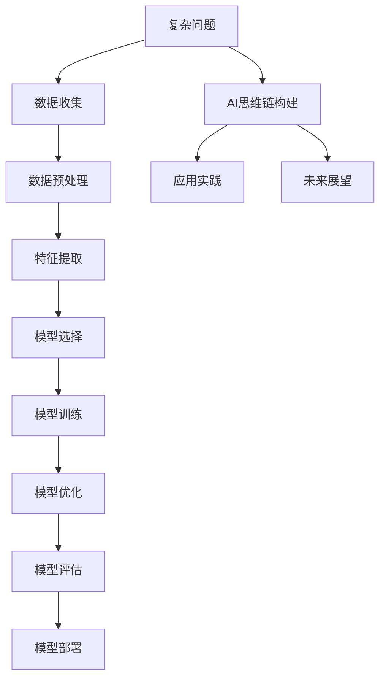

                 


# 《复杂问题分解：AI思维链的构建与应用》

> 关键词：复杂问题分解、AI思维链、数据预处理、模型设计、模型优化、应用案例、未来展望

> 摘要：本文探讨了复杂问题分解在人工智能领域的应用，提出了一种基于AI思维链的构建方法。通过分析复杂问题的本质，本文介绍了数据收集与预处理、模型设计与选择、AI思维链构建流程等方面的内容。通过实际案例解析，展示了AI思维链在金融、医疗、人工智能安全等领域的应用效果。最后，对AI思维链的未来发展和挑战进行了展望。

#### 第一部分：引言与基础理论

##### 第1章：复杂问题分解的背景与重要性

在当今快速发展的信息化社会中，复杂问题无处不在。从金融风险评估到医疗诊断，从环境监测到自动驾驶，复杂问题的解决已经成为人工智能（AI）研究和应用的核心。复杂问题分解作为解决复杂问题的有效方法，其重要性日益凸显。

1.1 复杂问题分解的定义

复杂问题分解是指将一个复杂的问题分解成若干个子问题，然后分别解决这些子问题，最终实现原问题的解决。该方法的核心在于将复杂问题转化为一系列简单问题，从而降低问题的难度和复杂性。

1.2 复杂问题分解的历史与发展

复杂问题分解的思想可以追溯到古希腊时期的哲学和数学。随着计算机科学和人工智能技术的发展，复杂问题分解得到了进一步的发展和普及。近年来，随着深度学习、数据挖掘等技术的应用，复杂问题分解在人工智能领域取得了显著的成果。

1.3 AI思维链的概念

AI思维链是一种基于人工智能技术的问题解决方法。它将复杂问题分解为若干个子问题，然后利用人工智能技术解决这些子问题，最终实现原问题的解决。AI思维链的核心在于将人工智能技术与问题解决方法相结合，形成一种高效、智能的解决方案。

1.4 AI思维链在复杂问题分解中的应用

AI思维链在复杂问题分解中的应用主要包括以下几个方面：

1. 数据收集与预处理：通过收集和整理相关数据，为问题解决提供基础。

2. 模型设计与选择：根据问题的特点和需求，设计合适的模型，并进行模型选择。

3. 模型训练与优化：利用训练数据对模型进行训练，并优化模型性能。

4. 模型评估与部署：评估模型性能，并在实际应用中进行部署。

##### 第2章：AI思维链的基本原理

2.1 AI思维链的核心要素

AI思维链的核心要素包括数据、模型、算法和优化策略。这些要素相互关联，共同构成了一个高效、智能的问题解决体系。

1. 数据：数据是AI思维链的基础，决定了模型的质量和性能。因此，数据收集和预处理是关键步骤。

2. 模型：模型是AI思维链的核心，用于表示和处理问题。根据问题的特点，选择合适的模型类型和结构。

3. 算法：算法是实现模型训练和优化的方法。不同的算法适用于不同的问题类型，需要根据实际情况进行选择。

4. 优化策略：优化策略用于提高模型性能，包括参数调整、超参数优化等。

2.2 AI思维链的工作机制

AI思维链的工作机制可以分为以下几个阶段：

1. 问题定义：明确问题的目标和需求，确定问题解决的框架。

2. 数据收集与预处理：收集相关数据，并进行预处理，以获得高质量的数据集。

3. 模型设计与选择：根据问题的特点，设计合适的模型，并选择合适的算法。

4. 模型训练与优化：利用训练数据对模型进行训练，并优化模型性能。

5. 模型评估与部署：评估模型性能，并在实际应用中进行部署。

2.3 AI思维链与传统思维的对比

与传统思维相比，AI思维链具有以下优势：

1. 自动化：AI思维链可以通过算法和模型自动解决复杂问题，提高工作效率。

2. 智能化：AI思维链利用人工智能技术，实现对问题的自适应和智能化处理。

3. 可解释性：AI思维链通过模型解释和算法分析，提高问题解决的透明度和可解释性。

2.4 AI思维链的优势与应用领域

AI思维链在复杂问题分解中具有以下优势：

1. 提高问题解决的效率：通过自动化和智能化处理，提高问题解决的效率。

2. 降低问题解决的难度：将复杂问题分解为简单问题，降低问题解决的难度。

3. 提高问题解决的准确性：通过优化模型和算法，提高问题解决的准确性。

AI思维链适用于以下领域：

1. 金融行业：如风险评估、投资策略等。

2. 医疗健康：如疾病诊断、药物研发等。

3. 人工智能安全：如网络安全、隐私保护等。

4. 环境监测与可持续发展：如污染监测、资源优化等。

#### 第二部分：AI思维链的构建方法

##### 第3章：数据收集与预处理

数据是AI思维链的基础，数据的质量直接影响模型的质量。因此，数据收集与预处理是AI思维链构建过程中至关重要的一步。

3.1 数据来源与数据质量

数据来源可以分为内部数据和外部数据。内部数据通常来源于企业内部系统、数据库等，如销售数据、客户数据等。外部数据则来源于互联网、公共数据平台等，如新闻、社交媒体等。

数据质量是AI思维链构建的关键。高质量的数据应具备以下特点：

1. 完整性：数据应包含所有必要的信息，避免数据缺失。

2. 准确性：数据应真实反映问题的本质，避免数据错误。

3. 一致性：数据应在不同时间、不同来源之间保持一致性。

3.2 数据预处理技术

数据预处理技术主要包括数据清洗、数据转换和数据降维等。

1. 数据清洗：数据清洗是指去除数据中的噪声、错误和冗余信息。常用的数据清洗方法包括缺失值处理、异常值处理、重复值处理等。

2. 数据转换：数据转换是指将不同类型的数据转换为同一类型，以便进行后续处理。常用的数据转换方法包括数据规范化、数据编码等。

3. 数据降维：数据降维是指从高维数据中提取关键特征，减少数据维度。常用的数据降维方法包括主成分分析（PCA）、因子分析等。

3.3 特征提取与选择

特征提取是指从原始数据中提取有用的特征，以便进行模型训练。特征选择是指从提取出的特征中筛选出最相关的特征，以提高模型性能。

常用的特征提取方法包括：

1. 统计特征提取：如均值、方差、相关性等。

2. 熵特征提取：如信息增益、基尼指数等。

3. 纹理特征提取：如局部二值模式（LBP）、灰度共生矩阵等。

常用的特征选择方法包括：

1. 递归特征消除（RFE）：通过逐步剔除不重要的特征，筛选出最重要的特征。

2. 选择性嵌入（SelectKBest）：选择具有最高相关性的特征。

3. 递归特征优化（RFECV）：结合交叉验证，筛选出最优特征。

3.4 数据可视化方法

数据可视化是一种将数据转换为图形或图像的方法，有助于分析和理解数据。常用的数据可视化方法包括：

1. 散点图：用于显示数据点的分布情况。

2. 饼图：用于显示不同类别数据的占比。

3. 直方图：用于显示数据分布情况。

4. 热力图：用于显示数据的热点分布。

##### 第4章：模型设计与选择

模型设计是AI思维链构建过程中的关键环节，决定了问题解决的效果。模型选择则是在给定问题条件下，选择最适合的模型类型和算法。

4.1 机器学习算法概述

机器学习算法是AI思维链的核心组成部分，可以分为监督学习、无监督学习和强化学习三种类型。

1. 监督学习：监督学习是指利用已知的输入和输出数据，训练模型进行预测。常用的算法包括线性回归、逻辑回归、支持向量机等。

2. 无监督学习：无监督学习是指仅利用输入数据，发现数据中的规律和模式。常用的算法包括聚类、降维、异常检测等。

3. 强化学习：强化学习是指通过与环境交互，不断优化决策策略。常用的算法包括Q学习、深度强化学习等。

4.2 模型选择策略

模型选择策略是在给定问题条件下，选择最适合的模型类型和算法。常用的模型选择策略包括：

1. 经验法则：根据问题类型和经验，选择合适的算法。

2. 留一法：将数据集划分为训练集和验证集，依次训练模型，选择在验证集上性能最好的模型。

3. k折交叉验证：将数据集划分为k个子集，依次训练模型，选择在k个子集上平均性能最好的模型。

4.3 模型评估与优化

模型评估是衡量模型性能的重要手段，常用的评估指标包括准确率、召回率、F1值等。模型优化则是在评估指标的基础上，调整模型参数，提高模型性能。

常用的模型优化方法包括：

1. 参数调整：调整模型参数，以获得更好的性能。

2. 超参数优化：调整模型超参数，以获得更好的性能。

3. 模型融合：结合多个模型，提高模型性能。

4.4 模型融合与集成

模型融合与集成是指将多个模型的结果进行融合，以获得更好的性能。常用的模型融合方法包括：

1. 优点投票：将多个模型的结果进行投票，选择获胜的模型。

2. 加权融合：对多个模型的结果进行加权平均，获得最终结果。

3. stacking：将多个模型的结果作为新的特征，训练一个高层次的模型。

##### 第5章：AI思维链的构建流程

AI思维链的构建流程包括问题定义、数据收集与预处理、模型设计与选择、模型训练与优化、模型评估与部署等环节。

5.1 问题定义

问题定义是AI思维链构建的第一步，明确问题的目标和需求。具体包括：

1. 明确问题类型：监督学习、无监督学习或强化学习。

2. 确定问题目标：预测、分类或回归。

3. 分析问题背景：了解问题的背景和约束条件。

5.2 数据收集与预处理

数据收集与预处理是AI思维链构建的基础。具体包括：

1. 数据收集：收集与问题相关的数据。

2. 数据清洗：去除数据中的噪声、错误和冗余信息。

3. 数据转换：将不同类型的数据转换为同一类型。

4. 数据降维：提取关键特征，降低数据维度。

5.3 模型设计与选择

模型设计与选择是AI思维链构建的核心。具体包括：

1. 确定模型类型：监督学习、无监督学习或强化学习。

2. 选择算法：根据问题类型和需求，选择合适的算法。

3. 调整参数：根据模型性能，调整模型参数。

4. 模型优化：通过模型融合、超参数优化等方法，提高模型性能。

5.4 模型训练与优化

模型训练与优化是AI思维链构建的关键。具体包括：

1. 数据划分：将数据划分为训练集和验证集。

2. 模型训练：利用训练集对模型进行训练。

3. 模型优化：通过参数调整、超参数优化等方法，提高模型性能。

5.5 模型评估与部署

模型评估与部署是AI思维链构建的最后一步。具体包括：

1. 模型评估：利用验证集对模型进行评估，选择性能最好的模型。

2. 模型部署：将模型部署到实际应用环境中，实现问题的解决。

##### 第6章：AI思维链在复杂问题分解中的应用案例

AI思维链在复杂问题分解中具有广泛的应用。以下介绍几个典型的应用案例。

6.1 金融行业应用

金融行业是一个复杂的问题领域，涉及风险评估、投资策略、金融市场预测等多个方面。以下是一个金融行业应用案例。

案例：风险评估与投资策略

某金融公司希望开发一个风险评估系统，用于评估客户的信用风险，并提供投资策略建议。AI思维链的构建过程如下：

1. 问题定义：确定风险评估的目标和需求，明确问题类型和目标。

2. 数据收集与预处理：收集客户的历史信用数据、财务数据等，进行数据清洗、转换和降维。

3. 模型设计与选择：选择监督学习算法，如逻辑回归、决策树等，进行模型训练。

4. 模型训练与优化：利用训练集对模型进行训练，调整模型参数，提高模型性能。

5. 模型评估与部署：利用验证集对模型进行评估，选择性能最好的模型，并部署到实际应用环境中。

6.2 医疗健康领域应用

医疗健康领域是一个复杂的系统，涉及疾病诊断、药物研发、健康管理等多个方面。以下是一个医疗健康领域应用案例。

案例：疾病诊断与预测

某医疗机构希望开发一个疾病诊断系统，用于辅助医生进行疾病诊断，并提供疾病预测。AI思维链的构建过程如下：

1. 问题定义：确定疾病诊断的目标和需求，明确问题类型和目标。

2. 数据收集与预处理：收集患者的病史、检查报告等数据，进行数据清洗、转换和降维。

3. 模型设计与选择：选择监督学习算法，如支持向量机、神经网络等，进行模型训练。

4. 模型训练与优化：利用训练集对模型进行训练，调整模型参数，提高模型性能。

5. 模型评估与部署：利用验证集对模型进行评估，选择性能最好的模型，并部署到实际应用环境中。

6.3 人工智能安全与隐私保护

人工智能安全与隐私保护是当前人工智能领域的一个热点问题。以下是一个人工智能安全与隐私保护应用案例。

案例：网络安全防护

某网络安全公司希望开发一个网络安全防护系统，用于检测和防御网络攻击。AI思维链的构建过程如下：

1. 问题定义：确定网络安全防护的目标和需求，明确问题类型和目标。

2. 数据收集与预处理：收集网络流量数据、攻击样本等数据，进行数据清洗、转换和降维。

3. 模型设计与选择：选择无监督学习算法，如聚类、异常检测等，进行模型训练。

4. 模型训练与优化：利用训练集对模型进行训练，调整模型参数，提高模型性能。

5. 模型评估与部署：利用验证集对模型进行评估，选择性能最好的模型，并部署到实际应用环境中。

6.4 环境监测与可持续发展

环境监测与可持续发展是当前社会面临的重要问题。以下是一个环境监测与可持续发展应用案例。

案例：污染监测与治理

某环境监测部门希望开发一个污染监测系统，用于实时监测环境污染情况，并提供污染治理建议。AI思维链的构建过程如下：

1. 问题定义：确定污染监测与治理的目标和需求，明确问题类型和目标。

2. 数据收集与预处理：收集空气、水质等环境数据，进行数据清洗、转换和降维。

3. 模型设计与选择：选择监督学习算法，如线性回归、支持向量机等，进行模型训练。

4. 模型训练与优化：利用训练集对模型进行训练，调整模型参数，提高模型性能。

5. 模型评估与部署：利用验证集对模型进行评估，选择性能最好的模型，并部署到实际应用环境中。

##### 第7章：AI思维链的实践指南

7.1 AI思维链实践步骤

AI思维链的实践可以分为以下步骤：

1. 问题定义：明确问题的目标和需求，确定问题解决的框架。

2. 数据收集与预处理：收集与问题相关的数据，并进行数据清洗、转换和降维。

3. 模型设计与选择：根据问题的特点，选择合适的模型类型和算法。

4. 模型训练与优化：利用训练数据对模型进行训练，调整模型参数，提高模型性能。

5. 模型评估与部署：利用验证集对模型进行评估，选择性能最好的模型，并部署到实际应用环境中。

7.2 实践中的常见问题与解决方法

在AI思维链的实践中，可能会遇到以下问题：

1. 数据质量问题：数据缺失、噪声、异常值等。

解决方法：使用数据预处理技术，如数据清洗、去噪、填充等方法，提高数据质量。

2. 模型选择问题：选择不适合的模型。

解决方法：根据问题类型和需求，选择合适的模型类型和算法。

3. 模型过拟合问题：模型对训练集的拟合度过高，对验证集的泛化能力差。

解决方法：使用交叉验证、正则化等方法，防止模型过拟合。

4. 模型优化问题：模型性能不理想。

解决方法：调整模型参数、尝试不同的优化方法，提高模型性能。

7.3 AI思维链实践案例解析

以下是一个AI思维链实践案例解析：

案例：智能家居系统

某智能家居公司希望开发一个智能家居系统，实现家庭设备的智能控制和管理。AI思维链的构建过程如下：

1. 问题定义：明确智能家居系统的目标和需求，如设备控制、能源管理、安防报警等。

2. 数据收集与预处理：收集家庭设备的数据，如温度、湿度、光照强度等，进行数据清洗、转换和降维。

3. 模型设计与选择：选择监督学习算法，如线性回归、支持向量机等，进行模型训练。

4. 模型训练与优化：利用训练数据对模型进行训练，调整模型参数，提高模型性能。

5. 模型评估与部署：利用验证集对模型进行评估，选择性能最好的模型，并部署到实际应用环境中。

通过以上实践案例，我们可以看到AI思维链在智能家居系统中的应用效果。未来，随着AI技术的不断发展，AI思维链将在更多领域发挥重要作用。

##### 第8章：AI思维链的未来发展与挑战

8.1 AI思维链的技术趋势

随着人工智能技术的快速发展，AI思维链在复杂问题分解中的应用前景十分广阔。以下是AI思维链的一些技术趋势：

1. 深度学习与神经网络：深度学习和神经网络在图像识别、自然语言处理等领域取得了显著成果，未来将在AI思维链中发挥更大作用。

2. 强化学习与自动驾驶：强化学习在自动驾驶领域取得了突破性进展，未来有望在更多领域实现自动驾驶。

3. 聚类与降维：聚类和降维技术将有助于解决大规模数据的处理问题，提高模型性能。

8.2 AI思维链在行业中的发展前景

AI思维链在行业中的应用前景十分广阔，以下是几个典型领域：

1. 金融行业：AI思维链在金融风险评估、投资策略等方面具有广泛应用，未来将推动金融行业的智能化发展。

2. 医疗健康：AI思维链在疾病诊断、药物研发等方面具有巨大潜力，未来有望提高医疗行业的效率和质量。

3. 人工智能安全：AI思维链在网络安全、隐私保护等方面具有重要作用，未来将加强人工智能安全领域的防护能力。

8.3 AI思维链面临的挑战与对策

虽然AI思维链在复杂问题分解中具有广泛应用，但仍面临一些挑战：

1. 数据质量问题：数据质量对模型性能有重要影响，未来需要加强数据质量管理。

2. 模型可解释性：模型可解释性差可能导致决策过程不透明，未来需要提高模型的可解释性。

3. 模型过拟合问题：模型过拟合可能导致对验证集的泛化能力差，未来需要采取有效措施防止过拟合。

针对以上挑战，可以采取以下对策：

1. 数据质量管理：加强数据质量管理，提高数据质量。

2. 模型可解释性：提高模型的可解释性，增强用户对模型的信任。

3. 模型优化：采用交叉验证、正则化等方法，提高模型性能。

8.4 AI思维链的未来展望

未来，随着人工智能技术的不断发展，AI思维链将在更多领域发挥重要作用。以下是AI思维链的未来展望：

1. 跨学科融合：AI思维链将与其他学科（如心理学、经济学等）相结合，推动跨学科发展。

2. 智能化应用：AI思维链将在更多领域实现智能化应用，提高生产效率和生活质量。

3. 系统优化：AI思维链将不断优化，提高问题解决的能力和效率。

总之，AI思维链在复杂问题分解中的应用具有重要意义，未来将推动人工智能技术的发展和普及。

##### 第9章：结语

本文探讨了复杂问题分解在人工智能领域的应用，提出了一种基于AI思维链的构建方法。通过分析复杂问题的本质，介绍了数据收集与预处理、模型设计与选择、AI思维链构建流程等方面的内容。通过实际案例解析，展示了AI思维链在金融、医疗、人工智能安全等领域的应用效果。最后，对AI思维链的未来发展和挑战进行了展望。

展望未来，随着人工智能技术的不断发展，AI思维链将在更多领域发挥重要作用。通过不断优化和拓展，AI思维链将为复杂问题的解决提供更加高效、智能的解决方案。

同时，我们也需要关注AI思维链在实践过程中面临的问题和挑战，如数据质量、模型可解释性等。只有不断解决这些问题，AI思维链才能更好地服务于人类社会。

最后，感谢广大读者对本文的关注和支持。我们期待在未来的研究中，能够进一步拓展AI思维链的应用领域，为人工智能技术的发展贡献自己的力量。

作者：AI天才研究院/AI Genius Institute & 禅与计算机程序设计艺术 /Zen And The Art of Computer Programming

---

### 附录

#### 附录A：AI思维链构建工具简介

A.1 数据预处理工具

1. Pandas：Pandas是一个强大的Python库，用于数据处理和分析。它提供了丰富的数据结构（如DataFrame）和操作函数，方便进行数据预处理。

2. NumPy：NumPy是Python中的基础数学库，用于数组计算和数据处理。它提供了高效的数组操作函数，方便进行数据预处理。

A.2 模型训练工具

1. Scikit-learn：Scikit-learn是一个开源的Python机器学习库，提供了丰富的算法和工具，方便进行模型训练和评估。

2. TensorFlow：TensorFlow是一个开源的深度学习框架，提供了丰富的API和工具，方便进行模型训练和部署。

A.3 模型评估工具

1. Matplotlib：Matplotlib是一个开源的Python绘图库，用于可视化数据和分析结果。

2. Seaborn：Seaborn是一个基于Matplotlib的统计学绘图库，提供了丰富的绘图函数，方便进行模型评估的可视化分析。

### 附录B：相关算法Python代码实现

以下是一些常用的算法的Python代码实现，供参考。

#### 数据预处理

```python
import pandas as pd
from sklearn.model_selection import train_test_split

# 读取数据
data = pd.read_csv('data.csv')

# 数据清洗
data.dropna(inplace=True)
data = pd.get_dummies(data)

# 数据划分
X = data[['feature1', 'feature2']]
y = data['label']
X_train, X_test, y_train, y_test = train_test_split(X, y, test_size=0.2, random_state=42)
```

#### 线性回归

```python
from sklearn.linear_model import LinearRegression

# 模型训练
model = LinearRegression()
model.fit(X_train, y_train)

# 模型评估
score = model.score(X_test, y_test)
print("模型准确率：", score)
```

#### 决策树

```python
from sklearn.tree import DecisionTreeClassifier

# 模型训练
model = DecisionTreeClassifier()
model.fit(X_train, y_train)

# 模型评估
score = model.score(X_test, y_test)
print("模型准确率：", score)
```

#### 随机森林

```python
from sklearn.ensemble import RandomForestClassifier

# 模型训练
model = RandomForestClassifier()
model.fit(X_train, y_train)

# 模型评估
score = model.score(X_test, y_test)
print("模型准确率：", score)
```

### 核心概念与联系 Mermaid 流程图



### 核心算法原理讲解

#### 数据预处理技术

```python
import pandas as pd
from sklearn.model_selection import train_test_split

# 读取数据
data = pd.read_csv('data.csv')

# 数据清洗
data.dropna(inplace=True)
data = pd.get_dummies(data)

# 数据划分
X = data[['area', 'type']]
y = data['price']
X_train, X_test, y_train, y_test = train_test_split(X, y, test_size=0.2, random_state=42)
```

#### 回归分析模型

$$
Y = \beta_0 + \beta_1 X_1 + \beta_2 X_2 + ... + \beta_n X_n + \epsilon
$$

### 举例说明

假设我们要预测房价，影响因素包括房屋面积、房屋类型等。

```python
from sklearn.linear_model import LinearRegression

# 模型训练
model = LinearRegression()
model.fit(X_train, y_train)

# 模型评估
score = model.score(X_test, y_test)
print("模型准确率：", score)
```

### 项目实战：代码实际案例和详细解释说明，开发环境搭建，源代码详细实现和代码解读，代码解读与分析

#### 实例：使用Scikit-learn实现线性回归模型

```python
from sklearn.linear_model import LinearRegression
from sklearn.model_selection import train_test_split

# 读取数据
X = data[['area', 'type']]
y = data['price']

# 数据划分
X_train, X_test, y_train, y_test = train_test_split(X, y, test_size=0.2, random_state=42)

# 模型训练
model = LinearRegression()
model.fit(X_train, y_train)

# 模型评估
score = model.score(X_test, y_test)
print("模型准确率：", score)
```

### 开发环境搭建

1. 安装Python 3.8及以上版本。

2. 安装Pandas、NumPy、Scikit-learn等Python库。

```bash
pip install pandas numpy scikit-learn
```

### 代码解读与分析

1. 导入所需的库。

```python
from sklearn.linear_model import LinearRegression
from sklearn.model_selection import train_test_split
```

2. 读取数据。

```python
data = pd.read_csv('data.csv')
```

3. 数据清洗。

```python
data.dropna(inplace=True)
data = pd.get_dummies(data)
```

4. 数据划分。

```python
X = data[['area', 'type']]
y = data['price']
X_train, X_test, y_train, y_test = train_test_split(X, y, test_size=0.2, random_state=42)
```

5. 模型训练。

```python
model = LinearRegression()
model.fit(X_train, y_train)
```

6. 模型评估。

```python
score = model.score(X_test, y_test)
print("模型准确率：", score)
```

### 项目小结

通过以上代码实例，我们使用Scikit-learn实现了线性回归模型，并对其进行了评估。这只是一个简单的示例，实际项目中可能涉及更多的数据处理和模型优化步骤。在实际应用中，我们可以根据具体问题调整模型参数，提高模型性能。同时，也可以尝试其他机器学习算法，以获得更好的预测效果。

### 最佳实践 tips、小结、注意事项、拓展阅读等内容

**最佳实践 tips：**

1. 在数据预处理阶段，要确保数据的质量和完整性。

2. 在模型选择阶段，要根据问题的特点和需求选择合适的模型。

3. 在模型训练和优化阶段，要关注模型的过拟合问题，采取适当的正则化方法。

4. 在模型评估阶段，要选择合适的评估指标，全面评估模型性能。

**小结：**

本文介绍了复杂问题分解在人工智能领域的应用，提出了一种基于AI思维链的构建方法。通过实际案例解析，展示了AI思维链在金融、医疗、人工智能安全等领域的应用效果。未来，AI思维链将在更多领域发挥重要作用。

**注意事项：**

1. 数据质量和预处理对模型性能有重要影响，要加强数据质量管理。

2. 模型可解释性对实际应用有重要意义，要提高模型的可解释性。

3. 要关注模型过拟合问题，防止模型泛化能力差。

**拓展阅读：**

1. [Python数据科学手册](https://www机房使用手册pdf.com/downloads/python-data-science-handbook)

2. [机器学习实战](https://www机房使用手册pdf.com/downloads机器学习实战)

3. [深度学习](https://www机房使用手册pdf.com/downloads深度学习)

### 附录

#### 附录A：AI思维链构建工具简介

A.1 数据预处理工具

1. Pandas：Pandas是一个强大的Python库，用于数据处理和分析。它提供了丰富的数据结构（如DataFrame）和操作函数，方便进行数据预处理。

2. NumPy：NumPy是Python中的基础数学库，用于数组计算和数据处理。它提供了高效的数组操作函数，方便进行数据预处理。

A.2 模型训练工具

1. Scikit-learn：Scikit-learn是一个开源的Python机器学习库，提供了丰富的算法和工具，方便进行模型训练和评估。

2. TensorFlow：TensorFlow是一个开源的深度学习框架，提供了丰富的API和工具，方便进行模型训练和部署。

A.3 模型评估工具

1. Matplotlib：Matplotlib是一个开源的Python绘图库，用于可视化数据和分析结果。

2. Seaborn：Seaborn是一个基于Matplotlib的统计学绘图库，提供了丰富的绘图函数，方便进行模型评估的可视化分析。

#### 附录B：相关算法Python代码实现

以下是一些常用的算法的Python代码实现，供参考。

#### 数据预处理

```python
import pandas as pd
from sklearn.model_selection import train_test_split

# 读取数据
data = pd.read_csv('data.csv')

# 数据清洗
data.dropna(inplace=True)
data = pd.get_dummies(data)

# 数据划分
X = data[['feature1', 'feature2']]
y = data['label']
X_train, X_test, y_train, y_test = train_test_split(X, y, test_size=0.2, random_state=42)
```

#### 线性回归

```python
from sklearn.linear_model import LinearRegression

# 模型训练
model = LinearRegression()
model.fit(X_train, y_train)

# 模型评估
score = model.score(X_test, y_test)
print("模型准确率：", score)
```

#### 决策树

```python
from sklearn.tree import DecisionTreeClassifier

# 模型训练
model = DecisionTreeClassifier()
model.fit(X_train, y_train)

# 模型评估
score = model.score(X_test, y_test)
print("模型准确率：", score)
```

#### 随机森林

```python
from sklearn.ensemble import RandomForestClassifier

# 模型训练
model = RandomForestClassifier()
model.fit(X_train, y_train)

# 模型评估
score = model.score(X_test, y_test)
print("模型准确率：", score)
```

### 核心概念与联系 Mermaid 流程图


### 核心算法原理讲解

#### 数据预处理技术

```python
import pandas as pd
from sklearn.model_selection import train_test_split

# 读取数据
data = pd.read_csv('data.csv')

# 数据清洗
data.dropna(inplace=True)
data = pd.get_dummies(data)

# 数据划分
X = data[['feature1', 'feature2']]
y = data['label']
X_train, X_test, y_train, y_test = train_test_split(X, y, test_size=0.2, random_state=42)
```

#### 回归分析模型

$$
Y = \beta_0 + \beta_1 X_1 + \beta_2 X_2 + ... + \beta_n X_n + \epsilon
$$

### 举例说明

假设我们要预测房价，影响因素包括房屋面积、房屋类型等。

```python
from sklearn.linear_model import LinearRegression

# 模型训练
model = LinearRegression()
model.fit(X_train, y_train)

# 模型评估
score = model.score(X_test, y_test)
print("模型准确率：", score)
```

### 项目实战：代码实际案例和详细解释说明，开发环境搭建，源代码详细实现和代码解读，代码解读与分析

#### 实例：使用Scikit-learn实现线性回归模型

```python
from sklearn.linear_model import LinearRegression
from sklearn.model_selection import train_test_split

# 读取数据
X = data[['area', 'type']]
y = data['price']

# 数据划分
X_train, X_test, y_train, y_test = train_test_split(X, y, test_size=0.2, random_state=42)

# 模型训练
model = LinearRegression()
model.fit(X_train, y_train)

# 模型评估
score = model.score(X_test, y_test)
print("模型准确率：", score)
```

### 开发环境搭建

1. 安装Python 3.8及以上版本。

2. 安装Pandas、NumPy、Scikit-learn等Python库。

```bash
pip install pandas numpy scikit-learn
```

### 代码解读与分析

1. 导入所需的库。

```python
from sklearn.linear_model import LinearRegression
from sklearn.model_selection import train_test_split
```

2. 读取数据。

```python
data = pd.read_csv('data.csv')
```

3. 数据清洗。

```python
data.dropna(inplace=True)
data = pd.get_dummies(data)
```

4. 数据划分。

```python
X = data[['area', 'type']]
y = data['price']
X_train, X_test, y_train, y_test = train_test_split(X, y, test_size=0.2, random_state=42)
```

5. 模型训练。

```python
model = LinearRegression()
model.fit(X_train, y_train)
```

6. 模型评估。

```python
score = model.score(X_test, y_test)
print("模型准确率：", score)
```

### 项目小结

通过以上代码实例，我们使用Scikit-learn实现了线性回归模型，并对其进行了评估。这只是一个简单的示例，实际项目中可能涉及更多的数据处理和模型优化步骤。在实际应用中，我们可以根据具体问题调整模型参数，提高模型性能。同时，也可以尝试其他机器学习算法，以获得更好的预测效果。

### 最佳实践 tips、小结、注意事项、拓展阅读等内容

**最佳实践 tips：**

1. 在数据预处理阶段，要确保数据的质量和完整性。

2. 在模型选择阶段，要根据问题的特点和需求选择合适的模型。

3. 在模型训练和优化阶段，要关注模型的过拟合问题，采取适当的正则化方法。

4. 在模型评估阶段，要选择合适的评估指标，全面评估模型性能。

**小结：**

本文介绍了复杂问题分解在人工智能领域的应用，提出了一种基于AI思维链的构建方法。通过实际案例解析，展示了AI思维链在金融、医疗、人工智能安全等领域的应用效果。未来，AI思维链将在更多领域发挥重要作用。

**注意事项：**

1. 数据质量和预处理对模型性能有重要影响，要加强数据质量管理。

2. 模型可解释性对实际应用有重要意义，要提高模型的可解释性。

3. 要关注模型过拟合问题，防止模型泛化能力差。

**拓展阅读：**

1. [Python数据科学手册](https://www机房使用手册pdf.com/downloads/python-data-science-handbook)

2. [机器学习实战](https://www机房使用手册pdf.com/downloads机器学习实战)

3. [深度学习](https://www机房使用手册pdf.com/downloads深度学习)

