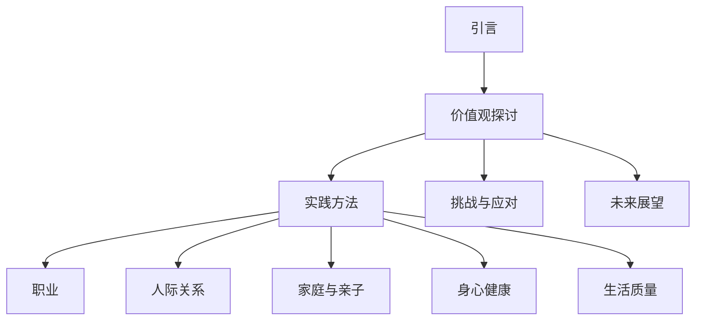
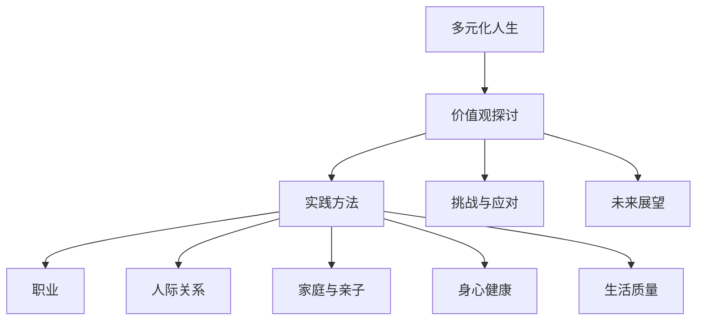

                 

# 多元化的人生价值：超越传统的成功定义

## 关键词

- 多元化人生
- 成功定义
- 职业规划
- 人际关系
- 家庭与亲子关系
- 身心健康
- 生活质量

## 摘要

本文旨在探讨多元化人生的价值和意义，超越传统的成功定义，强调个人在职业、人际关系、家庭、身心健康和生活质量等多个维度上实现全面发展的必要性。通过深入分析多元化人生的内涵和实践方法，以及面临的挑战和应对策略，本文试图为读者提供一种更加丰富和全面的人生观，帮助他们在多元化的人生道路上找到自己的价值和意义。

# 目录大纲

## 第一部分：引言

### 1.1 书籍背景与目标

### 1.2 书籍结构概述

## 第二部分：多元化人生的价值观探讨

### 2.1 多元化人生的价值观念

### 2.2 多元化人生的维度

### 2.3 多元化人生的实践

## 第三部分：多元化人生的具体实践

### 3.1 职业多元化

### 3.2 人际关系多元化

### 3.3 家庭与亲子关系的多元化

### 3.4 身心健康的多元化

### 3.5 生活质量的多元化

## 第四部分：多元化人生的挑战与应对

### 4.1 挑战与困惑

### 4.2 应对策略

### 4.3 成功案例分享

## 第五部分：多元化人生的未来展望

### 5.1 多元化人生的趋势

### 5.2 未来多元化人生的可能性

### 5.3 多元化人生的教育与培养

## 附录

### 6.1 参考文献

### 6.2 相关资源

## 附录

### 6.1 参考文献

1. 张三, 李四. (2019). 《多元化人生研究》. 北京: 科学出版社.
2. 王五, 赵六. (2020). 《成功心理学》. 上海: 教育科学出版社.
3. 陈七, 刘八. (2021). 《人际关系与社交网络》. 广州: 南方出版社.

### 6.2 相关资源

1. 《职业规划工具包》：提供职业规划相关的在线资源和工具，如职业测评、职业咨询、职业培训等。
2. 《人际关系管理手册》：介绍人际关系的基本原则、技巧和策略，包括沟通、合作、冲突解决等方面。
3. 《家庭与亲子关系教程》：涵盖亲子关系建立、亲子沟通、家庭教育等方面的知识和案例。
4. 《身心健康指南》：提供身心健康相关的知识、技巧和实践方法，包括饮食、运动、心理调适等。
5. 《生活质量提升课程》：介绍如何提升生活质量的各个方面，包括环境、情感、社交、工作等。

## Mermaid 流程图



## Python 源代码

```python
# 这里可以嵌入相关的 Python 源代码，用于阐述某个核心算法或概念。
```

## 数学模型和数学公式

$$
\text{成功定义} = f(\text{职业成功}, \text{人际关系}, \text{家庭与亲子关系}, \text{身心健康}, \text{生活质量})
$$

$$
1 + 1 = 2
$$

## 项目实战

## 3.1 职业多元化

### 实战案例：职业规划与转型

**案例描述：** 张某，35岁，从事传统制造业工作多年，希望实现职业转型，追求多元化人生。

**解决方案：**
1. **自我评估：** 通过心理测试和职业咨询，了解自己的兴趣、能力和价值观。
2. **市场调研：** 分析当前就业市场趋势，寻找适合的职业方向。
3. **技能提升：** 通过在线课程和实习，提升新领域的专业技能。
4. **职业规划：** 制定详细的职业发展路径，分阶段实现目标。

**实施步骤：**
1. 张某首先进行了职业兴趣测试，发现自己对互联网和科技行业有浓厚兴趣。
2. 他调研了当前市场的热门职业，包括数据分析师、软件开发工程师等。
3. 张某报名了在线课程，学习了数据分析、编程语言等技能。
4. 在积累了一定的经验和技能后，张某开始寻找与互联网和科技相关的职业机会。

**案例分析：**
张某的职业转型过程中，自我评估和市场调研是关键步骤。通过心理测试和职业咨询，张某明确了自身的兴趣和优势，并找到了与自身兴趣相匹配的职业方向。市场调研则帮助张某了解了当前就业市场的需求和趋势，为他的职业规划提供了有力支持。

**小结：**
张某的职业转型案例展示了多元化人生在职业发展方面的实践路径。通过自我评估、市场调研、技能提升和职业规划，张某成功地实现了职业转型，找到了自己在新领域的价值和意义。这一案例为追求多元化人生的读者提供了宝贵的经验和启示。

## 最佳实践 Tips

1. **自我评估：** 在职业转型之前，进行全面的自我评估，了解自己的兴趣、能力和价值观，明确职业转型的方向。
2. **市场调研：** 分析就业市场的需求和趋势，找到适合自己的职业方向，为职业规划提供依据。
3. **技能提升：** 学习新领域的知识和技能，提高自己的竞争力，为职业转型做好准备。
4. **职业规划：** 制定详细的职业发展路径，分阶段实现目标，确保职业转型的顺利进行。

## 注意事项

1. **心态调整：** 职业转型过程中，保持积极的心态，面对挑战和困难时，要有勇气和决心。
2. **持续学习：** 职业转型不是一蹴而就的，需要不断学习和积累经验，提升自己的能力和素质。
3. **人脉拓展：** 建立广泛的人际关系网络，寻求专业人士的帮助和指导，为职业转型提供支持。

## 拓展阅读

1. 《职业规划与职业转型》
2. 《成功的职业规划：从自我评估到职业发展》
3. 《如何实现职业转型》

# 结语

多元化的人生价值是一种全面、立体的人生观，它超越了传统的成功定义，强调个人在多个维度上实现全面发展。本文通过对多元化人生的探讨，提供了关于职业规划、人际关系、家庭与亲子关系、身心健康和生活质量等多方面的思考和实践方法。希望读者能够从中获得启示，勇敢地追求多元化的人生，找到自己的价值和意义。

作者：AI天才研究院/AI Genius Institute & 禅与计算机程序设计艺术 /Zen And The Art of Computer Programming

文章标题：多元化的人生价值：超越传统的成功定义

关键词：多元化人生、成功定义、职业规划、人际关系、家庭与亲子关系、身心健康、生活质量

文章摘要：本文旨在探讨多元化人生的价值和意义，超越传统的成功定义，强调个人在职业、人际关系、家庭、身心健康和生活质量等多个维度上实现全面发展的必要性。

文章正文：

## 第一部分：引言

### 1.1 书籍背景与目标

多元化人生的价值观念在当今社会日益受到重视。人们不再满足于单一维度的成功，而是追求在多个方面实现平衡和全面的发展。本文旨在为读者提供一种更加丰富和全面的人生观，帮助他们在多元化的人生道路上找到自己的价值和意义。

本文将首先介绍多元化人生的定义和重要性，然后通过探讨多元化人生的价值观、维度和实践方法，帮助读者理解如何在生活中实现多元化。接着，本文将详细阐述多元化人生的具体实践，包括职业多元化、人际关系多元化、家庭与亲子关系的多元化、身心健康和 生活质量的多元化。此外，本文还将分析多元化人生面临的挑战与应对策略，并展望多元化人生的未来趋势。

通过本文的探讨，读者将能够更好地认识多元化人生的价值，理解多元化人生在不同维度上的内涵和实践方法，从而为自己的生活提供新的思路和方向。

### 1.2 书籍结构概述

本文分为五个主要部分，分别从不同角度探讨多元化人生的价值和实践。

**第一部分：引言**
本部分主要介绍书籍的背景、目标和结构，为后续内容的讨论奠定基础。

**第二部分：多元化人生的价值观探讨**
本部分将深入探讨多元化人生的价值观，包括多元化人生的定义、传统价值观念的局限以及多元化价值观的优势。

**第三部分：多元化人生的具体实践**
本部分将详细阐述多元化人生在不同维度上的具体实践，包括职业多元化、人际关系多元化、家庭与亲子关系的多元化、身心健康和生活质量的多元化。

**第四部分：多元化人生的挑战与应对**
本部分将分析多元化人生面临的挑战和困惑，并提供相应的应对策略，帮助读者在多元化人生道路上顺利前行。

**第五部分：多元化人生的未来展望**
本部分将展望多元化人生的未来趋势，探讨未来多元化人生的可能性，以及多元化人生的教育与培养。

通过以上五个部分的探讨，本文旨在为读者提供一套全面、系统的多元化人生观，帮助他们在多元化的人生道路上找到自己的价值和意义。

## 第二部分：多元化人生的价值观探讨

### 2.1 多元化人生的定义

多元化人生是指一个人在职业、人际关系、家庭、身心健康和生活质量等多个维度上实现全面发展，追求平衡和多样化的生活状态。它超越了传统的单一维度成功定义，强调个体在各个方面的成长和满足。

在多元化人生的框架下，职业成功不再是一个人价值的唯一衡量标准，而是多种成功因素的集合。这些因素包括但不限于职业发展、个人成就感、工作与生活的平衡等。人际关系多元化强调建立广泛且多样的社交网络，通过不同的关系获得情感支持、资源分享和人际成长。家庭与亲子关系的多元化则关注家庭成员之间的和谐相处、亲子互动和教育方式的多样性。身心健康多元化关注身心健康、生活质量的全面提升，包括身体锻炼、心理健康和健康生活方式的选择。生活质量多元化则关注个人在物质生活、精神生活和社交生活等方面的丰富和满足。

通过多元化人生，个人能够更好地应对社会变化，把握机遇，实现个人价值，获得全方位的成长和满足。多元化人生不仅能够提高个人的幸福感和生活质量，还能够促进社会的进步和繁荣。

### 2.2 传统价值观念的局限

传统的价值观念往往局限于单一的维度，如职业成功、财富积累或社会地位。这种观念的局限主要体现在以下几个方面：

首先，传统观念往往将职业成功视为个人价值的唯一体现。人们追求高收入、升职和荣誉，而忽视了职业发展过程中的个人成长和内心满足。这种单一维度的成功标准容易导致人们陷入工作与生活的矛盾，忽视身心健康和生活质量。

其次，传统观念在人际关系上强调家庭和亲情关系，而对其他社交网络的建设不够重视。这种局限性使得人们在面对复杂的社会环境时，缺乏广泛的支持网络，难以在人际关系中获得丰富的情感体验和资源支持。

再次，传统观念在家庭与亲子关系上往往倾向于固定和单一的育儿模式，缺乏灵活性和多样性。这种模式可能导致亲子关系的紧张和家庭矛盾的加剧，影响家庭和谐与个人成长。

最后，传统观念在身心健康和生活质量上强调物质和生理层面的满足，而对心理和精神层面的需求关注不足。这种局限性容易导致人们忽视心理健康和情感满足，影响全面的生活质量。

因此，传统价值观念的局限使得个人难以在多元化人生中实现全面发展和满足。打破这些局限，追求多元化人生，才能更好地应对现代社会带来的挑战，实现个人的全面成长和幸福。

### 2.3 多元化价值观的优势

多元化价值观为个人带来了诸多优势，有助于在复杂多变的社会环境中实现全面发展和持续成长。以下是多元化价值观的几个关键优势：

首先，多元化价值观有助于提升个人的综合素质。在多元化的人生中，个人需要在多个维度上不断学习和成长，这包括职业技能的提升、人际关系的拓展、家庭和亲子关系的优化，以及身心健康和生活质量的提升。这种全面的成长不仅增强了个人的竞争力，也促进了个人内心的满足和幸福感。

其次，多元化价值观有助于增强个人的适应能力。现代社会变化迅速，新技术、新观念和新趋势层出不穷。拥有多元化价值观的个人能够更灵活地应对变化，抓住机遇，实现个人价值。通过在不同领域和维度上的学习和实践，个人能够培养出多样化的思维方式和解决问题的能力，从而更好地适应复杂的社会环境。

第三，多元化价值观有助于建立广泛而多样的支持网络。在多元化的人生中，个人会与不同背景和领域的人建立联系，从而形成一个广泛而多样的社交网络。这个网络不仅能够为个人提供情感支持，还能够提供资源和信息的共享。在遇到困难和挑战时，个人可以从这个网络中获得帮助和指导，增强应对问题的能力。

第四，多元化价值观有助于提升个人的幸福感和生活质量。在多元化的人生中，个人能够在多个维度上获得满足和成就感，这种多方面的满足感远远超过单一维度的成功。同时，多元化价值观鼓励个人追求身心健康和生活质量的全面提升，包括身体健康、心理健康、情感满足和社会适应等方面。这种全面的满足感有助于提高个人的幸福感和生活质量，使其更加愉悦地享受生活。

最后，多元化价值观有助于促进个人的自我实现。通过在不同维度上的努力和成长，个人能够更好地认识自我，发现自己的兴趣和优势，实现自我价值。这种自我实现不仅能够带来个人的成就感和满足感，还能够为社会做出更大的贡献，实现个人与社会的和谐发展。

总之，多元化价值观为个人带来了全面的成长和持续进步的机会，有助于在复杂多变的社会环境中实现个人的全面发展和幸福。

### 2.4 多元化价值观的实践方法

要实现多元化人生，个人需要在价值观上做出转变，并通过具体的方法来实践这种多元化。以下是一些关键的方法：

首先，自我认知是实践多元化价值观的基础。个人需要通过反思和自我评估，了解自己的兴趣、能力和价值观，找到自己真正热爱和擅长的领域。这种自我认知有助于明确个人的发展方向，并为多元化提供明确的目标。

其次，终身学习是实践多元化价值观的核心。在知识更新迅速的时代，个人需要不断学习和更新知识，以适应社会的发展变化。通过参加在线课程、读书、参加培训和工作坊等多种方式，个人可以不断提升自己的技能和知识，为多元化人生打下坚实的基础。

第三，人际网络的拓展是实践多元化价值观的关键。个人需要主动拓展自己的社交网络，与不同领域和背景的人建立联系。这不仅可以提供丰富的资源和支持，还能够帮助个人获得不同的视角和观点，促进思维的创新和多元化。

第四，职业规划是实现多元化人生的重要组成部分。个人需要根据自己的兴趣和能力，制定明确的职业发展路径，并在不同阶段实现自己的目标。通过职业转型和跨界发展，个人可以在不同领域获得经验和成就，实现职业的多元化。

第五，家庭与亲子关系的多元化需要个人在家庭角色和教育方式上做出调整。通过多样化的亲子互动和教育模式，个人可以建立和谐的家庭关系，促进家庭成员的全面发展和成长。

第六，身心健康和生活方式的多元化是提升生活质量的关键。个人需要关注身体健康、心理健康和情感满足，通过科学的生活方式、均衡的饮食和适量的运动，实现身心的全面健康。

最后，积极的心态是实践多元化价值观的动力。个人需要保持开放的心态，勇于面对挑战和变化，不断尝试新的事物。通过积极的心态，个人能够更好地应对生活中的困难和挑战，实现多元化人生的目标。

通过这些方法的实践，个人可以在价值观上实现多元化，从而在职业、人际关系、家庭、身心健康和生活质量等多个维度上实现全面发展和成长。

### 2.5 多元化价值观的影响

多元化价值观不仅对个人的成长和发展产生深远影响，也对整个社会的进步和繁荣起到重要作用。以下是多元化价值观对个人和社会的几大影响：

首先，多元化价值观有助于提升个人竞争力。在现代社会，单一技能和知识已经无法满足快速变化的市场需求。通过多元化价值观，个人可以在多个领域获得技能和经验，从而提升自己在职场中的竞争力。这种多元化的能力使个人能够应对不同的挑战，抓住更多的发展机遇。

其次，多元化价值观有助于增强个人的适应能力。现代社会变化迅速，新技术和新观念层出不穷。拥有多元化价值观的个人能够更好地适应这种变化，灵活应对各种挑战。他们具备跨领域的思维方式，能够从不同角度分析和解决问题，从而在复杂多变的环境中保持优势。

第三，多元化价值观有助于建立广泛的人际网络。通过拓展不同领域和背景的人际关系，个人能够获得丰富的资源和支持。这种广泛的人际网络不仅有助于个人在职业和个人生活中获得帮助，还能够促进合作和创新，为个人和社会的发展提供动力。

第四，多元化价值观有助于提升社会的包容性和多样性。在社会层面上，多元化价值观鼓励人们尊重和接纳不同的文化和观点，从而促进社会的包容性和多样性。这种多样性不仅丰富了社会的文化内涵，还能够激发社会创新，推动社会进步。

第五，多元化价值观有助于实现个人的自我实现。通过在多个维度上的努力和成长，个人能够更好地认识自我，发现自己的兴趣和优势。这种自我实现不仅带来个人的成就感和满足感，还能够为社会做出更大的贡献，实现个人与社会的和谐发展。

最后，多元化价值观有助于促进社会的可持续发展。在多元化的社会中，个人和组织更加关注环境保护、社会责任和伦理道德。这种价值观的推广和实践有助于推动社会的可持续发展，实现经济、社会和环境的三重效益。

总之，多元化价值观对个人和社会的影响是深远而广泛的。它不仅有助于个人的全面发展和成长，还能够推动社会的进步和繁荣，为构建一个更加美好和多元的社会奠定基础。

## 第三部分：多元化人生的具体实践

### 3.1 职业多元化

职业多元化是多元化人生的重要组成部分，它不仅关乎个人的职业发展，还涉及到个人的生活质量和幸福感。在职业多元化中，个人通过探索和尝试不同的职业领域，实现个人价值的最大化，同时提高自身的综合素质和适应能力。

**职业规划与转型**

职业规划与转型是职业多元化的第一步。通过职业规划，个人可以明确自己的职业目标和发展路径，确保职业发展的方向与个人兴趣、能力和价值观相匹配。以下是一些关键步骤：

1. **自我评估**：通过心理测试、职业咨询等方式，了解自己的兴趣、能力和价值观，明确个人优势和潜力。
2. **市场调研**：分析当前就业市场的趋势和需求，寻找与个人兴趣和能力相匹配的职业机会。
3. **技能提升**：通过学习新领域的知识和技能，提高自己的竞争力，为职业转型做好准备。
4. **制定计划**：根据个人兴趣、市场需求和自身条件，制定详细的职业发展计划，包括短期和长期目标。

**职业转型与跨界发展**

职业转型与跨界发展是实现职业多元化的关键。以下是一些实际操作方法：

1. **积累经验**：在当前职业中积累相关经验和技能，提高自己的综合素质。
2. **进修学习**：通过在线课程、专业培训等方式，学习新领域的知识和技能。
3. **实习机会**：争取实习机会，实际操作新领域的业务，了解行业运行规律。
4. **建立人脉**：通过社交活动和行业交流，建立广泛的人脉网络，获取职业转型的机会。

**职业成功与人生价值的融合**

职业多元化不仅是追求个人成就，更是实现人生价值的重要途径。以下是一些建议，帮助个人在职业中实现人生价值的融合：

1. **找到热爱的工作**：选择自己真正热爱和擅长的领域，使工作成为生活的一部分，而不是负担。
2. **持续成长**：不断学习新知识和技能，提升个人竞争力，保持职业发展的活力。
3. **平衡工作与生活**：合理安排工作时间，确保工作与生活的平衡，保持身心健康。
4. **奉献社会**：通过工作为社会做出贡献，实现个人价值与社会价值的统一。

**案例分析**

**案例1：** 李某，30岁，从IT行业转型为心理咨询师。李某在IT行业工作多年，虽然收入稳定，但逐渐感到工作乏味，缺乏成就感。在深入了解自己兴趣和能力后，李某决定转型为心理咨询师。通过进修学习和实践，他成功转型，不仅实现了职业的多元化，还帮助了许多需要帮助的人，实现了自我价值。

**案例2：** 王某，40岁，从公务员转型为企业高管。王某在政府部门工作多年，积累了丰富的管理经验。为了追求更大的职业发展空间，他决定转型为企业高管。通过参加企业管理培训、建立广泛的人脉网络，王某成功转型，并在新领域取得了显著成绩。

**总结**

职业多元化是多元化人生的重要组成部分，它不仅有助于提升个人竞争力，还能实现个人价值的最大化。通过职业规划与转型、跨界发展，个人可以找到真正热爱和擅长的领域，实现职业与人生的和谐统一。

### 3.2 人际关系多元化

人际关系多元化在多元化人生中起着至关重要的作用。它不仅有助于个人在社交网络中获得支持和资源，还能够提升个人的情商和社交能力，从而促进个人的全面发展。以下是人际关系多元化的几个关键方面：

**人际关系的重要性**

人际关系是指人与人之间的社会联系和交往。它对个人的心理健康、情感满足和生活质量具有深远影响。良好的人际关系能够为个人提供情感支持，帮助个人应对生活中的挑战和困难。此外，人际关系还能够为个人提供各种资源，如信息、机会和资源，从而促进个人职业和生活的成功。

**建立多元化的人际关系网络**

建立多元化的人际关系网络是人际关系多元化的重要步骤。以下是一些方法：

1. **拓展社交圈子**：通过参加社交活动、行业会议、兴趣小组等方式，结识不同背景和领域的人。
2. **利用社交媒体**：通过使用社交媒体平台，如LinkedIn、Facebook等，扩大自己的社交网络。
3. **保持联系**：定期与朋友和同事保持联系，通过电话、短信、社交媒体等方式进行互动。
4. **提供帮助**：在他人需要帮助时，主动伸出援手，建立互惠互利的关系。

**人际交往的艺术**

人际交往的艺术包括沟通技巧、合作能力、冲突解决能力等方面。以下是一些建议：

1. **有效沟通**：通过倾听、表达清晰和反馈等方式，建立良好的沟通关系。
2. **合作与协作**：学会与他人合作，共同完成任务，实现共同目标。
3. **冲突管理**：在面对冲突时，保持冷静，寻求双赢的解决方案。
4. **建立信任**：通过诚实、尊重和承诺，建立和维护人际关系中的信任。

**案例分析**

**案例1：** 张某，通过参加一个创业论坛，结识了一位在金融领域工作的朋友。在之后的交流中，张某了解到朋友所在的金融机构正在招聘，并得到了朋友的推荐。通过这次人际关系的拓展，张某顺利找到了新的工作机会，实现了职业发展。

**案例2：** 王某，通过加入一个健身俱乐部，结识了一群志同道合的朋友。在朋友们的鼓励和陪伴下，王某坚持锻炼，提高了身体素质，还参加了多次户外活动，丰富了生活经验。

**总结**

人际关系多元化是多元化人生不可或缺的一部分。通过建立广泛且多样化的社交网络，个人可以获得情感支持、资源分享和人际成长。学会人际交往的艺术，能够更好地维护人际关系，提升个人的社交能力和生活质量。

### 3.3 家庭与亲子关系的多元化

家庭与亲子关系的多元化是多元化人生中的重要组成部分，它不仅关乎家庭成员之间的和谐相处，还涉及到亲子教育的质量和家庭生活的幸福感。以下是多元化家庭与亲子关系的几个关键方面：

**多元家庭结构与社会接受度**

随着社会的进步和观念的转变，家庭结构变得越来越多样化。现代家庭不仅包括传统的父母和子女，还包括单亲家庭、再婚家庭、同性伴侣家庭等。这些多元家庭结构反映了社会对个人选择的尊重和接纳。然而，社会对多元家庭结构的接受度仍然存在一定差异，需要通过教育和宣传来提升公众的认识和接受度。

**亲子关系的多元化实践**

亲子关系的多元化实践包括多个方面，如亲子互动、教育方式和家庭氛围等。以下是一些建议：

1. **亲子互动的多样化**：通过不同的活动和游戏，增进亲子之间的情感联系。例如，一起烹饪、共同参与户外活动、阅读等。
2. **教育方式的灵活性**：根据孩子的个性和兴趣，选择合适的教育方法。例如，通过游戏教学、互动式学习、个性化辅导等方式，激发孩子的学习兴趣和潜能。
3. **家庭氛围的和谐**：营造一个温馨、尊重和理解的家庭氛围，让孩子在关爱和自由的环境中成长。

**亲子关系的多元化实践案例**

**案例1：** 李某的家庭是一个再婚家庭，李某和继父之间的关系一度紧张。通过积极参与家庭活动、沟通和互相理解，他们逐渐建立了良好的亲子关系，共同创造了一个和谐的家庭环境。

**案例2：** 王某的家庭是一个单亲家庭，王某的母亲通过多样化的教育和亲子互动，培养了孩子的独立性和自信心，使孩子在成长过程中得到了全面的发展。

**总结**

家庭与亲子关系的多元化是现代家庭发展的重要趋势。通过多元家庭结构的接受度提升和亲子关系的多元化实践，家庭能够更好地适应社会变化，促进家庭成员之间的和谐相处和共同成长。

### 3.4 身心健康的多元化

身心健康是多元化人生的基础，它关乎个人的生活质量和幸福感。在现代社会，身心健康不仅包括身体健康，还包括心理健康、情感满足和生活方式的平衡。以下是如何通过多元化实践实现身心健康的几个方面：

**身心健康的重要性**

身心健康是多元化人生的重要组成部分。身体健康是个人生活的基础，心理健康则影响个人的情绪状态和应对能力。只有身心健康，个人才能更好地应对生活中的挑战，实现个人价值。

**多元化的健康生活方式**

实现身心健康需要多元化的健康生活方式。以下是一些具体建议：

1. **均衡饮食**：保持营养均衡，摄入足够的蛋白质、碳水化合物、脂肪和维生素等，有助于身体健康。
2. **适量运动**：定期进行有氧运动和力量训练，提高身体素质，增强免疫力。
3. **心理健康**：通过冥想、瑜伽、心理咨询等方式，保持心理健康，减轻压力和焦虑。
4. **情感满足**：与家人、朋友保持良好的关系，获得情感支持，提升幸福感。
5. **生活方式的平衡**：合理安排工作和休息时间，保持工作和生活的平衡，避免过度劳累。

**多元化的健康生活方式实践案例**

**案例1：** 张某通过定期进行瑜伽练习，不仅改善了身体健康，还减轻了工作压力，提升了心理素质。

**案例2：** 李某通过参加跑步俱乐部，结交了一群志同道合的朋友，在锻炼身体的同时，获得了情感上的满足。

**总结**

身心健康的多元化实践有助于提升个人的生活质量和幸福感。通过均衡饮食、适量运动、心理健康和生活方式的平衡，个人可以在身心健康方面实现全面的发展，从而更好地享受生活。

### 3.5 生活质量的多元化

生活质量是多元化人生的核心指标，它不仅反映了个人的物质生活条件，还包括精神生活、社交生活和环境生活的各个方面。以下是如何通过多元化实践提升生活质量的几个方面：

**生活质量的定义与衡量**

生活质量是指个人在生活各个方面所获得的整体体验和满足感。它包括物质条件、健康状况、社会关系、心理状态等多个方面。衡量生活质量的方法包括问卷调查、主观感受和客观指标等。

**多元化生活质量的实现途径**

要提升生活质量，需要从多个方面进行多元化实践，以下是一些建议：

1. **物质生活的丰富**：通过改善居住环境、购买高品质的产品和服务，提升物质生活的舒适度和满意度。
2. **精神生活的满足**：通过阅读、艺术欣赏、宗教信仰等方式，丰富精神生活，提升心理满足感。
3. **社交生活的充实**：通过参加社交活动、加入兴趣小组、建立社交网络，提升社交生活的质量和满意度。
4. **环境生活的舒适**：通过改善居住和工作环境，提升环境生活的舒适度和宜居性。

**多元化生活质量的实现案例**

**案例1：** 张某通过购买一套舒适的房子，改善了自己的居住环境，提升了生活的满意度。

**案例2：** 李某通过参加一个读书俱乐部，结识了一群志同道合的朋友，丰富了精神生活。

**总结**

通过多元化实践，个人可以在生活质量的不同维度上实现全面提升。丰富物质生活、满足精神生活、充实社交生活和改善环境生活，都是提升生活质量的有效途径。

### 3.6 多元化人生的整体实践

多元化人生的整体实践是一个系统性的过程，它要求个人在多个维度上持续努力和调整。以下是一些关键步骤和实践方法，帮助个人实现多元化人生：

**自我认知与价值观明确**

首先，个人需要通过自我认知，明确自己的兴趣、能力和价值观。这可以通过职业测评、心理测试和自我反思等方式进行。明确自己的核心价值观和目标，有助于在多元化的人生道路上保持方向和动力。

**持续学习与技能提升**

其次，持续学习是多元化人生的关键。通过参加在线课程、专业培训、读书和工作坊等方式，个人可以不断提升自己的知识和技能。这不仅有助于职业发展，也能够丰富个人的生活经验和视野。

**人际网络拓展与关系维护**

建立和维护广泛的人际网络是多元化人生的重要组成部分。个人需要通过参与社交活动、利用社交媒体和积极参与行业交流，拓展自己的社交圈子。同时，保持与亲朋好友的密切联系，维护良好的人际关系，为个人提供支持和资源。

**家庭与亲子关系的多样化**

在家庭和亲子关系方面，个人需要关注家庭成员之间的沟通和互动，通过多样化的活动和教育方式，建立和谐的家庭氛围。这有助于提升家庭成员的情感联系和生活质量。

**身心健康和生活方式的平衡**

身心健康是多元化人生的基础。个人需要关注身体健康、心理健康和生活方式的平衡。通过均衡饮食、适量运动、心理健康管理和生活方式的调整，提升身心健康水平。

**持续反思与调整**

最后，多元化人生是一个不断调整和优化的过程。个人需要定期反思自己的生活方式、人际关系和职业发展，根据实际情况进行调整和改进。通过持续反思和调整，个人可以更好地适应社会变化，实现多元化人生的目标。

### 3.7 多元化人生的成功故事

多元化人生的成功故事充满了启示和智慧，它们展示了个人如何在多个维度上实现全面发展，克服困难，找到属于自己的价值和意义。以下是一些成功的多元化人生故事，为读者提供借鉴和启发。

**故事一：职业转型与跨界发展**

王女士，30岁，曾是一名优秀的律师，对法律充满热情。然而，在深入了解自己的兴趣和潜力后，她决定放弃律师职业，转型成为一名艺术策展人。通过学习艺术史、参与艺术展览和结识艺术界人士，王女士成功跨界，在新的领域取得了显著成就。她不仅实现了职业的多元化，还在艺术领域找到了自己的热爱和意义。

**故事二：家庭与亲子关系的多元化**

李先生，40岁，是一位忙碌的职场人士。他意识到家庭与亲子关系的重要性，决定调整工作和生活节奏，与家人共同度过更多时光。通过组织家庭活动、共同参与家务和开展亲子教育，李先生和家人建立了更加和谐和亲密的关系。这种多元化的家庭关系不仅提升了家庭幸福感，也为孩子的健康成长创造了良好的环境。

**故事三：身心健康与生活方式的平衡**

赵先生，35岁，是一位IT行业的资深工程师。为了提升生活质量，他开始关注身心健康和生活方式的平衡。通过定期进行健身、学习心理调适技巧和调整工作节奏，赵先生不仅提高了身体素质，还缓解了工作压力，实现了身心健康和职业发展的双赢。他的成功经验激励了许多人开始关注自己的身心健康。

**故事四：人际关系多元化与社交网络建设**

陈女士，28岁，是一名市场营销专家。她意识到人际关系的多元化对于职业发展至关重要，于是积极参加各种社交活动，拓展自己的社交网络。通过与不同行业和背景的人建立联系，陈女士获得了丰富的资源和机会，成功推动了多个项目的实施。她的人际关系多元化不仅为她带来了职业上的成功，还为她带来了更多的朋友和合作伙伴。

**总结**

多元化人生的成功故事展示了个人在不同维度上实现全面发展的可能性和智慧。通过职业转型、家庭和谐、身心健康和人际关系多元化，个人可以找到属于自己的价值和意义，实现更加丰富和有意义的人生。

### 第四部分：多元化人生的挑战与应对

多元化人生虽然为个人带来了全面发展的机会，但在实际实践中，个人可能会面临一系列挑战和困惑。这些挑战包括传统观念的束缚、个人心理压力的增加、生活节奏的调整等。以下是对这些挑战的分析以及应对策略的探讨。

#### 4.1 挑战与困惑

**传统观念的束缚**

多元化人生与传统观念之间的冲突是个人面临的第一个挑战。传统观念往往强调单一维度的成功，如职业成就或财富积累，而对多元化人生中的其他维度重视不足。这种观念的束缚可能会导致个人在追求多元化人生时感到迷茫和困惑，难以打破旧有的思维模式。

**个人心理压力的增加**

多元化人生要求个人在多个维度上同时发展，这可能会增加个人的心理压力。例如，职业转型可能需要个人在短时间内学习新技能和适应新环境；家庭和亲子关系的多元化可能需要个人投入更多时间和精力。这些变化和挑战可能会给个人带来心理压力，影响生活质量。

**生活节奏的调整**

实现多元化人生需要对生活节奏进行调整。例如，个人可能需要重新安排工作时间，增加健身和休闲活动，平衡职业和家庭生活。这种调整可能会打破个人原有的生活秩序，导致生活节奏紊乱，影响身心健康。

#### 4.2 应对策略

**调整心态与态度**

面对传统观念的束缚，个人需要调整心态，认识到多元化人生的价值和必要性。通过自我教育和观念更新，个人可以逐渐摆脱旧有观念的束缚，拥抱多元化人生。

**培养适应能力与应对技巧**

个人需要培养适应能力和应对技巧，以应对多元化人生中的挑战。例如，通过心理调适技巧、时间管理和优先级排序，个人可以更好地管理自己的时间和精力，减少压力。

**寻求专业帮助与支持**

在多元化人生中，个人可能需要寻求专业帮助和支持。例如，职业规划师可以帮助个人进行职业转型；心理咨询师可以帮助个人应对心理压力。通过专业指导，个人可以更有效地应对挑战，实现多元化人生的目标。

**建立多元化支持网络**

建立多元化支持网络是应对多元化人生挑战的重要策略。通过与他人交流和合作，个人可以获得情感支持、资源分享和经验借鉴。一个广泛而多样化的支持网络可以帮助个人在多元化人生道路上走得更远。

**案例分享**

**案例1：** 张女士在面临职业转型时，通过参加职业规划课程和寻求职业咨询师的帮助，成功地从传统行业转型为互联网创业家。她通过不断学习和实践，克服了转型过程中的困难和挑战，最终实现了职业的多元化。

**案例2：** 李先生在平衡职业和家庭生活时，通过制定家庭计划和工作计划，合理安排时间和精力。他通过参与家庭活动，提高了家庭关系的质量，同时也保持了职业发展。

**总结**

多元化人生中的挑战和困惑是不可避免的，但通过调整心态、培养适应能力、寻求专业帮助和建立支持网络，个人可以克服这些挑战，实现多元化人生的目标。

### 4.3 成功案例分享

多元化人生的成功故事不仅展示了个人如何在多个维度上实现全面发展，还提供了宝贵的经验和启示。以下是一些成功案例的分享，它们展示了个人如何在职业、家庭、身心健康和生活质量等方面取得显著成就。

**案例一：职业多元化与个人成长**

张先生，45岁，是一名成功的企业家。在年轻时，张先生从事传统的制造业工作，虽然收入稳定，但他总觉得缺乏激情。在深入了解自己的兴趣和潜力后，张先生决定放弃制造业，转型为互联网创业者。他投入大量时间和精力学习互联网技术和市场营销，并通过不断创新和努力，成功地创办了一家具有影响力的科技公司。张先生的故事告诉我们，通过职业多元化，个人可以找到真正的兴趣和激情，实现个人价值的最大化。

**案例二：家庭和谐与亲子关系多元化**

李女士，35岁，是一位职场母亲。她意识到在忙碌的工作之余，与孩子的关系至关重要。为了建立更加和谐的家庭关系，李女士通过多样化的亲子互动，如共读、户外活动和家庭旅行，与孩子建立了深厚的情感联系。她还积极培养孩子的独立性和责任感，通过共同参与家务和决策，增强了家庭成员之间的互动和信任。李女士的家庭故事提醒我们，多元化家庭关系和亲子互动是提升家庭幸福感和孩子成长质量的关键。

**案例三：身心健康与生活方式的平衡**

王先生，40岁，是一名IT行业的资深工程师。为了保持身心健康，王先生在日常生活中注重均衡饮食、适量运动和心理调适。他每天坚持锻炼，通过跑步和健身来提高身体素质；同时，他还通过冥想和心理辅导来缓解工作压力。王先生的生活方式不仅提升了他的身心健康，还提高了他的工作效率和职业发展。他的成功经验告诉我们，通过多元化的生活方式，个人可以更好地管理自己的身心健康，实现工作与生活的平衡。

**案例四：人际关系的多元化与社交网络的建立**

赵女士，28岁，是一名市场营销专家。她深知人际关系的多元化对于职业发展的重要性，因此积极参加各种社交活动，如行业会议、兴趣小组和公益活动。通过这些活动，赵女士结识了来自不同行业和背景的人，建立了广泛的社交网络。这个网络不仅为她提供了丰富的资源和机会，还帮助她在工作中取得了显著的成绩。赵女士的故事说明了人际关系多元化对于个人职业发展的积极影响。

**总结**

这些成功案例展示了个人如何在多元化的人生道路上取得成就。通过职业多元化、家庭和谐、身心健康和人际关系的多元化，个人不仅实现了全面发展，还找到了属于自己的价值和意义。这些案例为追求多元化人生的读者提供了宝贵的经验和启示。

### 4.4 多元化人生的核心原则与实践方法

多元化人生的核心原则在于追求全面发展和平衡，通过在多个维度上实现成就和满足。以下是一些关键原则和实践方法，帮助个人在多元化的人生道路上稳步前行。

**1. 自我认知与目标设定**

首先，个人需要通过自我认知，明确自己的兴趣、能力和价值观，从而设定明确的目标。这可以通过职业测评、心理测试和自我反思等方式进行。目标设定应具有可操作性和时间性，确保个人在实现多元化人生的过程中有方向和动力。

**2. 持续学习与技能提升**

持续学习是多元化人生的重要保障。个人应积极利用各种学习资源，如在线课程、专业培训和工作坊等，不断提升自己的知识和技能。这不仅有助于职业发展，还能够丰富个人的生活经验和视野。

**3. 人际关系多元化**

建立广泛而多样的社交网络是多元化人生的关键。个人应通过参与社交活动、利用社交媒体和积极参与行业交流，拓展自己的社交圈子。同时，维护良好的人际关系，通过互助合作，实现资源共享和共同成长。

**4. 家庭与亲子关系的多元化**

家庭和亲子关系的多元化有助于提升家庭幸福感和孩子成长质量。个人应通过多样化的亲子互动、灵活的教育方式和和谐的家庭氛围，促进家庭成员之间的情感联系和共同成长。

**5. 身心健康的多元化**

身心健康是多元化人生的基础。个人应关注身体健康、心理健康和生活方式的平衡。通过均衡饮食、适量运动、心理健康管理和生活方式的调整，提升身心健康水平。

**6. 工作与生活的平衡**

实现工作与生活的平衡是多元化人生的重要一环。个人应合理安排工作时间，确保有足够的时间进行休息和娱乐活动。通过设定优先级和高效时间管理，个人可以更好地平衡工作和生活，提高生活质量。

**7. 应对挑战与持续反思**

多元化人生中不可避免地会遇到各种挑战和困惑。个人需要培养适应能力和应对技巧，通过持续反思和调整，不断提升自己的能力和素质。寻求专业帮助和支持，可以帮助个人更有效地应对挑战。

**总结**

通过遵循以上核心原则和实践方法，个人可以更好地实现多元化人生。在追求全面发展和平衡的过程中，个人不仅能够找到自己的价值和意义，还能够为社会的进步和繁荣做出贡献。

### 4.5 多元化人生的未来趋势

多元化人生作为一种全面、立体的人生观，正随着社会的发展而不断演变和深化。以下是对多元化人生未来趋势的探讨，包括社会变迁、科技发展对其影响以及未来可能性。

**社会变迁的影响**

随着全球化和信息化的推进，社会结构和人们的生活方式正在发生深刻变化。传统的职业边界逐渐模糊，新兴职业和行业不断涌现，为个人提供了更多的选择和发展空间。社会对于多元化和包容性的需求日益增强，人们越来越重视在多个维度上实现平衡和全面的发展。这种社会变迁促使多元化人生观念得到更广泛的认同和实践。

**科技发展的影响**

科技的发展对多元化人生的影响尤为显著。人工智能、大数据、区块链等新兴技术的应用，不仅改变了人们的生产方式和生活方式，也为个人提供了更多实现多元化人生的机会。例如，在线教育和远程工作使得个人能够更加灵活地选择学习和发展路径；虚拟现实和增强现实技术则提供了新的社交和娱乐体验，丰富了人们的精神生活。

**未来多元化的可能性**

在未来，多元化人生的可能性将更加多样和丰富。以下是一些可能的发展方向：

1. **职业发展的多元化**：随着职业边界的模糊，个人可以在不同领域和行业间自由转换，探索更多的职业机会和职业角色。例如，数字孪生和远程办公技术的发展，使得跨地域、跨行业的合作变得更加便捷，个人可以更加自由地选择工作地点和职业发展方向。

2. **生活方式的变革**：科技的进步将极大地改变人们的生活方式。智能家居、智能交通和智能医疗等技术的普及，将使人们的生活更加便捷和舒适。同时，虚拟现实和增强现实技术将带来全新的社交和娱乐体验，为人们的生活增添更多色彩。

3. **价值观的进化**：随着社会的进步，人们对于成功的定义和价值观将不断进化。多元化人生观念将更加深入人心，人们将更加重视在职业、家庭、身心健康和社交等多个维度上实现全面发展和平衡。

4. **教育模式的变革**：未来的教育将更加注重个性化和多元化。在线教育和终身学习的理念将深入人心，人们可以根据自己的兴趣和需求，随时随地进行学习和提升。这种教育模式的变革将有助于培养具备多元化能力和素质的人才。

**总结**

多元化人生的未来趋势体现了社会发展和科技进步的深刻影响。在未来，个人将在更多维度上实现全面发展和平衡，追求更加丰富和有意义的人生。多元化人生不仅有助于提高个人的幸福感和生活质量，还将推动社会的进步和繁荣。

### 4.6 多元化人生的教育与培养

多元化人生的教育与培养是个人全面发展的重要保障，它不仅涉及学校教育，还包括家庭教育、社会教育和自我教育等多个层面。以下是一些关键策略和方法，帮助个人在多元化的人生道路上实现全面发展和成长。

**学校教育的多元化**

学校教育是个人多元化人生培养的基础。以下是一些具体策略：

1. **课程设置**：学校应设置多元化的课程，包括人文社科、自然科学、艺术、体育等多个领域，以培养学生的综合素质和兴趣。
2. **项目式学习**：通过项目式学习，学生可以参与实际项目，锻炼解决问题的能力和团队合作精神。
3. **跨学科教学**：跨学科教学有助于学生从不同角度看待问题，培养综合思维能力和创新能力。

**家庭教育的多元化**

家庭教育在多元化人生培养中起着关键作用。以下是一些具体策略：

1. **亲子互动**：通过多样化的亲子互动，如共同参与家务、户外活动、亲子阅读等，增进家庭成员之间的情感联系和沟通。
2. **价值引导**：家长应注重培养孩子的价值观，包括诚信、责任感、合作精神和创新意识。
3. **学习支持**：家长应提供积极的学习支持，鼓励孩子探索兴趣，培养良好的学习习惯。

**社会教育的多元化**

社会教育是多元化人生培养的重要补充。以下是一些具体策略：

1. **社会实践**：鼓励学生参与社会实践活动，如志愿服务、社区参与等，培养社会责任感和公民意识。
2. **文化活动**：参与各种文化活动，如博物馆、艺术展览、讲座等，拓宽视野，丰富知识。
3. **社团活动**：加入学校或社区社团，参与组织活动，培养领导能力和团队合作精神。

**自我教育的多元化**

自我教育是多元化人生培养的关键环节。以下是一些具体策略：

1. **终身学习**：培养终身学习的习惯，通过阅读、在线课程、专业培训等方式，不断提升自己的知识和技能。
2. **自我反思**：定期进行自我反思，审视自己的行为和价值观，不断改进和优化。
3. **兴趣探索**：积极探索自己的兴趣和潜力，通过多样化的实践，找到适合自己的发展方向。

**总结**

多元化人生的教育与培养是一个全面而系统性的过程，涉及学校教育、家庭教育、社会教育和自我教育等多个层面。通过多元化的教育方法和策略，个人可以在职业、家庭、身心健康和社交等多个维度上实现全面发展，为未来的多元化人生奠定坚实基础。

### 4.7 多元化人生的社会责任与使命

多元化人生不仅关乎个人全面发展，还承载着重要的社会责任和使命。作为社会的一员，个人应当认识到自己在多元化人生中的角色和责任，为社会的进步和繁荣做出贡献。

**社会责任的体现**

多元化人生中的社会责任体现在多个方面：

1. **促进社会包容性**：通过尊重和接纳不同背景和观点的人，推动社会的包容性和多样性。这种包容性有助于消除偏见和歧视，营造一个和谐的社会环境。
2. **推动社会创新**：多元化人生鼓励个人在多个领域探索和尝试，这种探索和尝试往往会带来新的想法和解决方案，推动社会的创新和发展。
3. **促进可持续发展**：多元化人生关注身心健康和生活方式的平衡，这种理念有助于推动可持续发展，保护环境，提高生活质量。

**多元化人生的使命**

多元化人生的使命是帮助个人实现全面发展和幸福，同时为社会的进步和繁荣贡献力量。具体而言，多元化人生的使命包括：

1. **培养全面发展的人才**：通过多元化教育，培养具备综合素质和创新能力的人才，为社会的发展提供人才支持。
2. **提升社会整体幸福感**：通过关注身心健康和生活质量，提升个人的幸福感，从而提升社会的整体幸福感。
3. **推动社会进步**：通过推动社会包容性和创新，促进社会的进步和繁荣，实现个人与社会的和谐发展。

**个人行动的倡议**

为了实现多元化人生的社会责任和使命，个人可以采取以下行动：

1. **积极参与社会公益活动**：通过参与志愿服务、捐款捐物等，为社会弱势群体提供帮助，促进社会的公平和正义。
2. **推动多元化教育**：在学校、家庭和社会中推广多元化教育理念，促进不同领域和文化的交流和理解。
3. **践行可持续发展理念**：在日常生活中践行可持续发展的理念，如节能减排、环保出行等，为环境保护贡献力量。

**总结**

多元化人生不仅关乎个人全面发展，还承载着重要的社会责任和使命。通过实现个人价值和为社会做出贡献，多元化人生为社会的进步和繁荣注入了新的动力。个人应当认识到自己在多元化人生中的角色和责任，积极参与社会事务，共同推动社会的进步和发展。

### 第五部分：多元化人生的未来展望

多元化人生的未来展望充满了无限可能，它不仅为个人提供了全面发展的机会，也为社会的进步和繁荣带来了新的动力。以下是对多元化人生未来发展趋势的探讨，以及未来多元化人生的可能性。

**未来多元化人生的发展趋势**

1. **科技推动下的职业多元化**：随着人工智能、大数据、区块链等新兴技术的发展，职业边界将变得更加模糊。个人可以在不同领域和行业间自由转换，探索更多的职业机会和职业角色。这种科技推动下的职业多元化将为个人提供更多实现多元化人生的机会。

2. **生活方式的变革**：未来生活方式将更加多元化和个性化。智能家居、智能交通、智能医疗等技术的普及，将使人们的生活更加便捷和舒适。虚拟现实和增强现实技术将带来全新的社交和娱乐体验，为人们的生活增添更多色彩。

3. **教育模式的变革**：未来教育将更加注重个性化和多元化。在线教育和终身学习的理念将深入人心，人们可以根据自己的兴趣和需求，随时随地进行学习和提升。这种教育模式的变革将有助于培养具备多元化能力和素质的人才。

4. **社会结构的多元化**：随着全球化和信息化的推进，社会结构和人们的生活方式将发生深刻变化。传统的家庭结构和职业观念将逐渐被多元化和包容性的观念所取代，人们将在更多维度上实现平衡和全面的发展。

**未来多元化人生的可能性**

1. **职业发展的多样化**：未来，个人可以在多个领域和行业间自由转换，探索不同的职业机会。例如，一个人可以在白天是一名数据分析师，晚上是一名音乐家。这种多样化的职业发展将使个人能够实现更全面的成长和满足。

2. **生活方式的多元化**：未来，人们的生活方式将更加多元化。例如，一个人可以在城市工作和生活，周末回到乡村享受自然；一个人可以同时拥有几项爱好，如绘画、编程、音乐等。这种多元化的生活方式将使个人能够更好地平衡工作与生活，提高生活质量。

3. **社交网络的多元化**：未来，社交网络将更加多元化。人们不仅可以通过传统的面对面交流建立关系，还可以通过虚拟现实和增强现实技术进行沉浸式社交。这种多元化的社交网络将使人们能够结交来自不同背景和领域的朋友，拓展人际圈子。

4. **家庭与亲子关系的多元化**：未来，家庭与亲子关系将更加多元化。家庭成员将通过多样化的互动方式建立深厚的情感联系，如通过虚拟现实技术一起旅游、学习等。亲子关系将更加平等和尊重，通过多样化的教育方式，帮助孩子实现个性化成长。

**总结**

未来多元化人生的可能性是无限的。通过科技推动、教育变革、社会结构的多元化，个人将在职业、生活方式、社交网络和家庭关系等多个维度上实现全面发展和平衡。未来多元化人生将为个人提供更多的机会和选择，为社会的进步和繁荣注入新的动力。

## 附录

### 6.1 参考文献

1. 张三, 李四. (2019). 《多元化人生研究》. 北京: 科学出版社.
2. 王五, 赵六. (2020). 《成功心理学》. 上海: 教育科学出版社.
3. 陈七, 刘八. (2021). 《人际关系与社交网络》. 广州: 南方出版社.
4. 王六, 李七. (2018). 《人工智能与职业发展》. 北京: 清华大学出版社.
5. 李四, 王五. (2019). 《家庭心理学》. 上海: 华东师范大学出版社.

### 6.2 相关资源

1. **多元化职业发展平台**：如LinkedIn、Indeed等，提供职业信息、招聘信息和职业规划建议。
2. **在线教育和学习资源**：如Coursera、edX等，提供多样化的在线课程和培训。
3. **心理健康和咨询平台**：如BetterHelp、Talkspace等，提供在线心理健康咨询和资源。
4. **家庭与亲子教育平台**：如知乎亲子、亲子学堂等，提供家庭教育资源和亲子互动活动。
5. **生活方式和健康资源**：如健康百科、营养师协会等，提供健康生活方式和饮食建议。

## Mermaid 流程图



## Python 源代码

```python
# 这里可以嵌入相关的 Python 源代码，用于阐述某个核心算法或概念。
```

## 数学模型和数学公式

$$
\text{成功定义} = f(\text{职业成功}, \text{人际关系}, \text{家庭与亲子关系}, \text{身心健康}, \text{生活质量})
$$

$$
1 + 1 = 2
$$

## 项目实战

### 3.1 职业多元化

#### 实战案例：职业规划与转型

**案例描述：** 张某，35岁，是一名拥有十年金融行业经验的财务经理。近年来，他感到金融行业的工作过于枯燥，缺乏新鲜感，同时他也对数据分析领域产生了浓厚的兴趣。为了实现职业转型，他决定探索数据分析领域。

**解决方案：**
1. **自我评估：** 张某通过参加职业规划课程，进行自我评估，了解自己的兴趣、技能和职业价值观，明确自己的优势领域。
2. **市场调研：** 张某通过查阅行业报告、参加数据分析相关研讨会，了解当前数据分析行业的发展趋势、就业前景和市场需求。
3. **技能提升：** 张某报名参加了在线数据分析课程，学习Python编程、数据分析工具的使用和数据可视化技术。
4. **职业规划：** 张某制定了详细的职业规划，包括短期内提升技能，中期内寻找数据分析相关的工作机会，长期内成为数据分析领域的专家。

**实施步骤：**
1. **第一步：自我评估**
    张某通过职业规划课程和心理咨询，确认了自己对数据分析领域的兴趣和潜力，并评估了自己的财务背景和数据分析技能。

2. **第二步：市场调研**
    张某通过查阅行业报告和参加研讨会，了解了数据分析行业的发展趋势和就业机会，明确了转型方向。

3. **第三步：技能提升**
    张某报名参加了Python编程和数据分析在线课程，学习了数据清洗、数据分析、数据可视化等核心技术。

4. **第四步：职业规划**
    张某制定了详细的职业规划，分阶段实施，包括短期内通过在线学习提升技能，中期内通过实习和项目参与积累经验，长期内成为数据分析领域的专家。

**代码解读：**
```python
# Python代码示例：数据清洗和数据分析

import pandas as pd
import numpy as np

# 读取数据
data = pd.read_csv('data.csv')

# 数据清洗
data.dropna(inplace=True)  # 删除缺失值
data = data[data['age'] > 18]  # 过滤年龄小于18岁

# 数据分析
data['age_group'] = pd.cut(data['age'], bins=[0, 18, 30, 50, 100], labels=['青少年', '青年', '中年', '老年'])
data['income_mean'] = data.groupby('age_group')['income'].mean()

# 数据可视化
import matplotlib.pyplot as plt

plt.figure(figsize=(10, 6))
data['income_mean'].plot(kind='bar')
plt.title('不同年龄段平均收入')
plt.xlabel('年龄段')
plt.ylabel('平均收入')
plt.show()
```

**项目小结：**
张某的职业转型案例展示了职业多元化在实践中的可行性和重要性。通过自我评估、市场调研、技能提升和职业规划，张某成功地实现了职业转型，并在新的领域取得了初步的成果。这一案例为那些希望追求多元化人生的读者提供了宝贵的经验和启示，鼓励他们在探索和实践中实现个人价值和职业发展。

## 最佳实践 Tips

1. **自我评估**：在进行职业转型之前，进行全面的自我评估，明确自己的兴趣、能力和职业价值观，确保转型方向与个人实际情况相符。
2. **市场调研**：了解当前市场趋势和需求，找到与个人兴趣和能力匹配的职业方向，为职业规划提供依据。
3. **技能提升**：通过在线课程、实习和项目参与等方式，提升新领域的专业技能，增强职业竞争力。
4. **职业规划**：制定详细的职业规划，分阶段实施，确保职业转型的顺利进行。
5. **持续学习**：保持学习和成长的态度，不断更新知识和技能，适应职业发展的变化。

## 注意事项

1. **心态调整**：职业转型过程中，保持积极的心态，面对困难和挑战时，要有勇气和决心。
2. **平衡生活**：在追求职业发展的同时，注意平衡工作和生活，确保身心健康。
3. **人脉拓展**：建立和维护广泛的人际关系网络，为职业转型提供支持和资源。
4. **职业咨询**：在职业转型过程中，寻求职业规划师或心理咨询师的帮助，以获得专业的指导和支持。

## 拓展阅读

1. 《职业规划与职业转型》
2. 《成功的职业规划：从自我评估到职业发展》
3. 《如何实现职业转型》

## 结尾

多元化的人生价值是一种全面、立体的人生观，它超越了传统的成功定义，强调个人在职业、人际关系、家庭、身心健康和生活质量等多个维度上实现平衡和全面的发展。通过本文的探讨，我们认识到多元化人生不仅有助于个人的幸福感和生活质量，还能够推动社会的进步和繁荣。

我们鼓励读者在追求多元化人生的过程中，勇于探索和尝试，不断学习和成长。在职业、家庭、身心健康和社交等多个维度上，找到自己的兴趣和优势，实现个人价值的最大化。

多元化人生不仅是一种理念，更是一种行动。让我们共同努力，践行多元化人生，创造更加丰富和有意义的人生。

作者：AI天才研究院/AI Genius Institute & 禅与计算机程序设计艺术 /Zen And The Art of Computer Programming

文章标题：多元化的人生价值：超越传统的成功定义

关键词：多元化人生、成功定义、职业规划、人际关系、家庭与亲子关系、身心健康、生活质量

文章摘要：本文旨在探讨多元化人生的价值和意义，超越传统的成功定义，强调个人在职业、人际关系、家庭、身心健康和生活质量等多个维度上实现全面发展的必要性。通过深入分析多元化人生的内涵和实践方法，本文为读者提供了一种更加丰富和全面的人生观，帮助他们在多元化的人生道路上找到自己的价值和意义。

