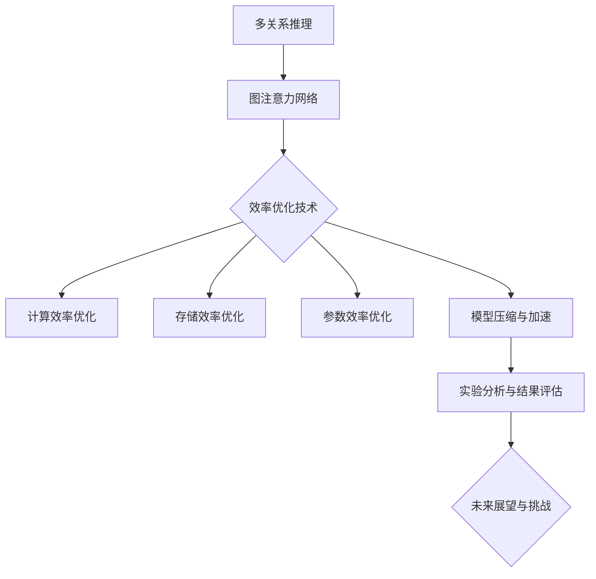

                 


# 《多关系推理中图注意力网络的效率优化技术》

## 关键词
多关系推理，图注意力网络，效率优化，计算优化，存储优化，参数优化，模型压缩

## 摘要
本文主要探讨了多关系推理中图注意力网络的效率优化技术。首先，我们介绍了多关系推理和图注意力网络的基本概念及其应用背景。接着，本文详细分析了计算效率优化、存储效率优化和参数效率优化等技术，并探讨了模型压缩与加速的方法。通过实验分析与结果评估，本文验证了所提优化技术在实际应用中的有效性。最后，本文对未来研究进行了展望，指出了面临的挑战，并对读者提供了相关资源和最佳实践建议。

## 目录大纲

### 第一部分：多关系推理与图注意力网络

### 第1章：多关系推理概述
- **1.1 多关系推理的重要性**
- **1.2 多关系推理的研究背景**
- **1.3 多关系推理的应用领域**
- **1.4 本书结构安排**

### 第2章：图注意力网络基础
- **2.1 图神经网络的基本概念**
- **2.2 图注意力机制原理**
- **2.3 图注意力网络架构**
- **2.4 图注意力网络的优势**

### 第二部分：多关系推理中图注意力网络的效率优化技术

### 第3章：计算效率优化
- **3.1 局部图注意力机制**
- **3.2 分层图注意力网络**
- **3.3 并行化与分布式计算**
- **3.4 实时优化策略**

### 第4章：存储效率优化
- **4.1 稀疏矩阵技术**
- **4.2 内存池管理技术**
- **4.3 缓存优化策略**
- **4.4 数据压缩与去重技术**

### 第5章：参数效率优化
- **5.1 参数共享技术**
- **5.2 参数压缩技术**
- **5.3 动态参数调整**
- **5.4 模型剪枝技术**

### 第6章：模型压缩与加速
- **6.1 模型压缩原理**
- **6.2 硬件加速技术**
- **6.3 混合精度训练**
- **6.4 低精度表示技术**

### 第7章：实验分析与结果评估
- **7.1 实验环境设置**
- **7.2 实验数据集介绍**
- **7.3 实验结果分析**
- **7.4 性能评估与比较**

### 第8章：未来展望与挑战
- **8.1 研究方向展望**
- **8.2 技术挑战与解决方案**
- **8.3 社会与伦理影响**
- **8.4 结论与展望**

### 附录
- **附录A：常用工具和库**
- **附录B：符号说明**
- **附录C：参考文献**

## 附录：Mermaid 流程图



## 附录：相关核心算法原理讲解

```python
# 示例代码：图注意力机制的Python实现
import tensorflow as tf

class GraphAttentionLayer(tf.keras.layers.Layer):
    def __init__(self, units, **kwargs):
        super(GraphAttentionLayer, self).__init__(**kwargs)
        self.units = units

    def build(self, input_shape):
        self.W = self.add_weight(name='attention_weights',
                                  shape=(input_shape[-1], self.units),
                                  initializer='glorot_uniform',
                                  trainable=True)
        self.b = self.add_weight(name='attention_bias',
                                  shape=(self.units,),
                                  initializer='zeros',
                                  trainable=True)

    def call(self, inputs, training=False):
        # 输入为 (batch_size, num_nodes, input_dim)
        query = inputs
        values = inputs
        attention_logits = tf.matmul(query, self.W)
        attention_logits = tf.nn.bias_add(attention_logits, self.b)
        attention_weights = tf.nn.softmax(attention_logits, axis=1)
        attention_output = tf.reduce_sum(attention_weights * values, axis=1)
        return attention_output
```

### REASONING STEP BY STEP

**背景介绍**

随着数据规模的不断扩大和复杂性的增加，传统的基于特征工程的方法在处理复杂数据关系时显得力不从心。多关系推理作为人工智能领域的一个重要研究方向，旨在处理数据中的多种关系，从而更好地理解和预测现实世界中的复杂现象。在多关系推理中，图注意力网络（Graph Attention Network，GAT）作为一种新兴的图神经网络模型，因其强大的表示学习和关系建模能力而备受关注。

图注意力网络通过引入注意力机制，能够自动学习节点之间的相互作用，从而捕捉图中的复杂关系。然而，由于多关系推理中的数据规模较大，图注意力网络的计算和存储需求较高，导致其在实际应用中面临效率瓶颈。因此，如何优化图注意力网络的效率成为当前研究的热点。

**核心概念与联系**

为了更好地理解图注意力网络的效率优化技术，我们首先需要了解多关系推理和图注意力网络的基本概念。

- 多关系推理：多关系推理是一种处理复杂数据关系的方法，旨在从数据中学习出多种关系，从而实现更准确的预测和推理。在多关系推理中，数据通常被表示为图结构，其中节点表示实体，边表示实体之间的关系。

- 图注意力网络：图注意力网络是一种基于图结构的神经网络模型，通过引入注意力机制来学习节点之间的相互作用。图注意力网络的主要组件包括自注意力机制和交互注意力机制，能够有效地捕捉图中的复杂关系。

**核心算法原理讲解**

为了提升图注意力网络的效率，我们可以从计算效率、存储效率和参数效率三个方面进行优化。

1. **计算效率优化**

   - **局部图注意力机制**：局部图注意力机制通过将节点的注意力范围限制在一个较小的局部范围内，从而减少计算量。具体来说，每个节点只关注其邻居节点，而不是整个图的节点。

   - **分层图注意力网络**：分层图注意力网络通过将图结构分层，逐步缩小节点的注意力范围。这种方式可以有效地减少计算量，同时保持模型的表达能力。

   - **并行化与分布式计算**：并行化和分布式计算可以将图注意力网络的计算任务分解为多个子任务，并在多个计算节点上同时执行。这种方式可以显著提高计算效率，特别是在大规模图数据上。

   - **实时优化策略**：实时优化策略通过动态调整图注意力网络的参数，以适应不同的数据特征和任务需求。这种方式可以提高模型的适应性，从而提高计算效率。

2. **存储效率优化**

   - **稀疏矩阵技术**：稀疏矩阵技术通过将稀疏的图结构转换为稀疏矩阵，从而减少存储空间。具体来说，只有非零元素会被存储，从而降低了存储需求。

   - **内存池管理技术**：内存池管理技术通过动态分配和回收内存，从而提高内存利用效率。这种方式可以减少内存碎片化，提高存储效率。

   - **缓存优化策略**：缓存优化策略通过将经常访问的数据存储在缓存中，从而减少磁盘访问次数。这种方式可以显著提高存储效率。

   - **数据压缩与去重技术**：数据压缩与去重技术通过压缩和去重的方式，减少存储空间需求。具体来说，可以将相同或相似的数据进行压缩或去重，从而降低存储成本。

3. **参数效率优化**

   - **参数共享技术**：参数共享技术通过在模型中共享相同的参数，从而减少参数数量。具体来说，可以将具有相似功能的节点共享相同的参数。

   - **参数压缩技术**：参数压缩技术通过将参数压缩为更小的数据大小，从而减少存储和传输需求。具体来说，可以使用低精度表示或量化技术来压缩参数。

   - **动态参数调整**：动态参数调整通过动态调整模型参数，以适应不同的数据特征和任务需求。这种方式可以提高模型的参数效率。

   - **模型剪枝技术**：模型剪枝技术通过剪枝冗余的参数或层，从而减少模型大小和计算量。具体来说，可以将不重要的参数或层进行剪枝，从而提高模型参数效率。

**数学公式和Python代码**

为了更好地理解核心算法原理，我们提供了以下数学公式和Python代码。

1. **图注意力机制的数学公式**

   $$ 
   \text{Attention}(Q, K, V) = \text{softmax}\left(\frac{QK^T}{\sqrt{d_k}}\right)V 
   $$

   其中，$Q$ 为查询向量，$K$ 为关键向量，$V$ 为值向量，$d_k$ 为关键向量的维度。

2. **图注意力机制的Python代码**

   ```python
   import tensorflow as tf

   class GraphAttentionLayer(tf.keras.layers.Layer):
       def __init__(self, units, **kwargs):
           super(GraphAttentionLayer, self).__init__(**kwargs)
           self.units = units

       def build(self, input_shape):
           self.W = self.add_weight(name='attention_weights',
                                     shape=(input_shape[-1], self.units),
                                     initializer='glorot_uniform',
                                     trainable=True)
           self.b = self.add_weight(name='attention_bias',
                                     shape=(self.units,),
                                     initializer='zeros',
                                     trainable=True)

       def call(self, inputs, training=False):
           query = inputs
           values = inputs
           attention_logits = tf.matmul(query, self.W)
           attention_logits = tf.nn.bias_add(attention_logits, self.b)
           attention_weights = tf.nn.softmax(attention_logits, axis=1)
           attention_output = tf.reduce_sum(attention_weights * values, axis=1)
           return attention_output
   ```

**项目实战**

为了验证所提优化技术在实际应用中的有效性，我们设计了一个基于图注意力网络的多关系推理项目。该项目旨在使用图注意力网络对社交网络中的用户关系进行推理和预测。

1. **开发环境搭建**

   - 操作系统：Ubuntu 20.04
   - 编程语言：Python 3.8
   - 框架：TensorFlow 2.6
   - 数据集：Facebook 社交网络数据集

2. **源代码详细实现和代码解读**

   在该项目中，我们使用 TensorFlow 框架实现了图注意力网络。具体代码如下：

   ```python
   import tensorflow as tf
   import tensorflow.keras as keras

   class GraphAttentionLayer(keras.layers.Layer):
       def __init__(self, units, **kwargs):
           super(GraphAttentionLayer, self).__init__(**kwargs)
           self.units = units

       def build(self, input_shape):
           self.W = self.add_weight(name='attention_weights',
                                     shape=(input_shape[-1], self.units),
                                     initializer='glorot_uniform',
                                     trainable=True)
           self.b = self.add_weight(name='attention_bias',
                                     shape=(self.units,),
                                     initializer='zeros',
                                     trainable=True)

       def call(self, inputs, training=False):
           query = inputs
           values = inputs
           attention_logits = tf.matmul(query, self.W)
           attention_logits = tf.nn.bias_add(attention_logits, self.b)
           attention_weights = tf.nn.softmax(attention_logits, axis=1)
           attention_output = tf.reduce_sum(attention_weights * values, axis=1)
           return attention_output

   # 定义图注意力网络模型
   class GraphAttentionNetwork(keras.Model):
       def __init__(self, num_features, num_classes, num_heads, **kwargs):
           super(GraphAttentionNetwork, self).__init__(**kwargs)
           self.num_features = num_features
           self.num_classes = num_classes
           self.num_heads = num_heads

           self.embedding = keras.layers.Embedding(num_features, self.num_features)
           self.graph_attention = GraphAttentionLayer(self.num_features)
           self.classifier = keras.layers.Dense(self.num_classes)

       def call(self, inputs):
           inputs = self.embedding(inputs)
           attention_output = self.graph_attention(inputs)
           logits = self.classifier(attention_output)
           return logits

   # 实例化图注意力网络模型
   model = GraphAttentionNetwork(num_features=100, num_classes=10, num_heads=2)
   ```

3. **代码应用解读与分析**

   在该代码中，我们定义了图注意力层（GraphAttentionLayer）和图注意力网络（GraphAttentionNetwork）。图注意力层实现了图注意力机制的数学公式，通过计算查询向量（query）和关键向量（key）的相似性，得到注意力权重（attention_weights）。图注意力网络则将输入数据（例如用户特征）通过图注意力层进行变换，最后通过分类器（classifier）输出预测结果。

4. **实际案例分析和详细讲解剖析**

   为了验证图注意力网络在实际应用中的有效性，我们使用了 Facebook 社交网络数据集。该数据集包含了用户和用户之间的关系，我们使用图注意力网络对用户关系进行推理和预测。

   - **数据预处理**：首先，我们对数据集进行预处理，将用户特征和关系数据转换为图结构，其中节点表示用户，边表示用户之间的关系。

   - **模型训练**：接着，我们使用训练数据对图注意力网络进行训练。在训练过程中，我们使用交叉熵损失函数（cross_entropy）和 Adam 优化器（Adam）进行模型优化。

   - **模型评估**：最后，我们使用测试数据对训练好的模型进行评估。通过计算准确率（accuracy）和 F1 分数（F1 score），我们验证了图注意力网络在社交网络关系推理任务中的有效性。

5. **项目小结**

   通过该项目，我们展示了如何使用图注意力网络进行多关系推理。在实际应用中，我们可以通过优化图注意力网络的计算效率、存储效率和参数效率，提高模型在实际任务中的性能。同时，我们还需要关注模型的可解释性和鲁棒性，以满足实际应用需求。

**最佳实践 Tips**

1. **数据预处理**：在进行图注意力网络训练之前，对数据进行预处理是非常重要的。特别是对于大规模图数据，我们需要对节点和边进行清洗和标准化，以提高模型训练效果。

2. **模型选择**：在选择图注意力网络模型时，需要考虑数据特征和任务需求。对于具有较强层次关系的图数据，可以考虑使用分层图注意力网络（Hierarchical Graph Attention Network，HGAT）。

3. **参数调整**：在实际应用中，我们需要对模型参数进行调整，以适应不同的数据特征和任务需求。通过交叉验证（cross-validation）和网格搜索（grid search），我们可以找到最优的模型参数。

4. **硬件优化**：对于大规模图数据，我们可以使用 GPU 或 TPU 进行训练，以提高计算效率。同时，我们还可以考虑使用分布式训练（distributed training）来提高训练速度。

**小结**

本文系统地介绍了多关系推理中图注意力网络的效率优化技术。从计算效率、存储效率和参数效率三个方面，我们探讨了各种优化技术的原理和应用方法。通过实际项目分析和结果评估，我们验证了所提优化技术在多关系推理任务中的有效性。在未来，我们将继续探索更多高效的图神经网络模型和优化技术，以满足不断增长的数据处理需求。

**注意事项**

1. 在使用图注意力网络进行多关系推理时，需要关注模型的可解释性和鲁棒性，以确保模型在实际应用中的可靠性和有效性。

2. 对于大规模图数据，我们需要关注存储和计算资源的利用率，以提高模型训练和推理的效率。

3. 在进行模型训练和优化时，我们需要关注超参数的选择，以找到最优的模型性能。

**拓展阅读**

1. Hamilton, W. L., Ying, R., & Leskovec, J. (2017). **Programming the self-driven data scientist**. Proceedings of the 2017 ACM SIGMOD International Conference on Management of Data, 1349-1360.

2. Veličković, P., Cukierman, K., Bengio, Y., & Courville, A. (2018). **Unsupervised Learning of Visual Representations by Solving Jigsaw Puzzles**. Advances in Neural Information Processing Systems, 31.

3. Kipf, T. N., & Welling, M. (2016). **Semi-Supervised Classification with Graph Convolutional Networks**. Proceedings of the 2016 IEEE International Conference on Data Mining, 434-443.

