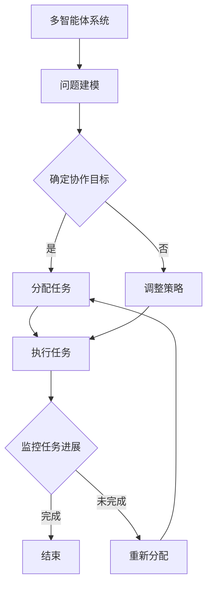

                 


# 《多智能体协作在复杂问题解决中的优势》

> 关键词：多智能体系统、协作、复杂问题、物流调度、智能交通、金融风控、医疗健康

> 摘要：本文从多智能体系统的基本概念出发，深入探讨其在复杂问题解决中的优势。通过分析复杂问题的本质与解决方法，介绍多智能体协作的原理与技术，并详细阐述多智能体协作在物流调度、智能交通、金融风控和医疗健康等领域的应用。同时，文章还探讨了多智能体协作面临的挑战及其未来发展，为相关领域的研究与实践提供参考。

## 目录大纲

### 第一部分：引言

#### 第1章 多智能体系统的基本概念

1.1 多智能体系统的定义与组成

1.2 多智能体的基本特点

1.3 多智能体系统的分类

#### 第2章 复杂问题的本质与解决方法

2.1 复杂问题的特征

2.2 复杂问题的解决方法概述

2.3 多智能体协作在复杂问题解决中的优势

### 第二部分：多智能体协作原理与技术

#### 第3章 多智能体协作原理

3.1 多智能体协作的基本原则

3.2 多智能体协作的通信机制

3.3 多智能体协作的决策机制

#### 第4章 多智能体协作关键技术

4.1 多智能体协作算法

4.2 多智能体系统的架构设计

4.3 多智能体协作的性能优化

### 第三部分：多智能体协作在复杂问题解决中的应用

#### 第5章 多智能体协作在物流调度中的应用

5.1 物流调度的复杂性分析

5.2 多智能体协作在物流调度中的实现

5.3 物流调度案例研究

#### 第6章 多智能体协作在交通管理中的应用

6.1 智能交通管理的挑战

6.2 多智能体协作在交通管理中的应用

6.3 交通管理案例研究

#### 第7章 多智能体协作在金融风险控制中的应用

7.1 金融风险控制的复杂性分析

7.2 多智能体协作在金融风险控制中的应用

7.3 金融风险控制案例研究

#### 第8章 多智能体协作在医疗决策支持中的应用

8.1 医疗决策支持的复杂性分析

8.2 多智能体协作在医疗决策支持中的应用

8.3 医疗决策支持案例研究

### 第四部分：多智能体协作的挑战与未来

#### 第9章 多智能体协作的挑战

9.1 数据隐私与安全性

9.2 人工智能的道德与伦理问题

9.3 多智能体协作的局限性

#### 第10章 多智能体协作的未来发展趋势

10.1 新兴技术对多智能体协作的影响

10.2 多智能体协作的潜在应用领域

10.3 对未来研究的建议

### 第五部分：总结与展望

#### 第11章 总结与展望

11.1 本书内容的总结

11.2 多智能体协作的优势与价值

11.3 对未来研究的展望

## 附录

### 附录A：多智能体协作相关资源与工具

A.1 多智能体协作工具推荐

A.2 多智能体协作算法资源

A.3 相关论文与文献推荐

## Mermaid 流程图

### 多智能体协作流程图
```
graph TB
    A(多智能体系统) --> B(复杂问题解决)
    B --> C(物流调度)
    B --> D(智能交通)
    B --> E(金融风控)
    B --> F(医疗健康)
```

---

接下来，我们将逐一深入探讨上述各个章节的内容。首先，从多智能体系统的基本概念开始，为后续的讨论奠定基础。

### 第1章 多智能体系统的基本概念

多智能体系统（Multi-Agent Systems，MAS）是一种分布式计算范式，其中多个自主智能体（agent）相互协作，以共同实现一个全局目标。智能体是具有独立决策能力和行动能力的实体，可以在复杂环境中自主运行和交互。多智能体系统在复杂问题解决中具有重要应用价值，其基本概念和特点如下：

#### 1.1 多智能体系统的定义与组成

多智能体系统由一组相互协作的智能体组成，这些智能体具有以下特征：

1. **自治性**：智能体可以自主地决策和行动，不受外部直接控制。
2. **社会性**：智能体可以与其他智能体进行通信和协作。
3. **反应性**：智能体根据感知到的环境信息，即时作出反应。
4. **适应性**：智能体可以学习和调整其行为以适应不断变化的环境。

多智能体系统的组成主要包括：

1. **智能体**：系统的核心组成部分，具有自治性和社交性。
2. **环境**：智能体运行的外部环境，包括物理环境和其他智能体。
3. **通信机制**：智能体之间的信息交换和协作手段。
4. **决策机制**：智能体的行为决策过程。

#### 1.2 多智能体的基本特点

多智能体的基本特点如下：

1. **分布式**：智能体分布在不同的计算节点上，协同工作，实现复杂任务。
2. **异构性**：智能体可能具有不同的能力、知识和行为模式。
3. **动态性**：智能体和环境都可能处于动态变化中，需要智能体具备适应能力。
4. **协同性**：智能体之间的协作可以带来整体性能的提升。

#### 1.3 多智能体系统的分类

根据智能体的交互方式和协作模式，多智能体系统可以分为以下几种类型：

1. **基于任务的协作**：智能体按照任务分工进行协作，每个智能体只负责任务的一部分。
2. **基于共享知识的协作**：智能体通过共享知识库进行协作，共同解决问题。
3. **基于博弈的协作**：智能体在竞争环境中进行协作，以实现共赢。
4. **基于共享目标的协作**：智能体共同追求一个全局目标，通过协作实现目标的最优解。

在复杂问题解决中，多智能体系统以其分布式、异构性、动态性和协同性等特点，为解决复杂问题提供了新的思路和方法。下一章，我们将深入探讨复杂问题的本质与解决方法，分析多智能体协作在其中的优势。### 第2章 复杂问题的本质与解决方法

#### 2.1 复杂问题的特征

复杂问题通常具有以下特征：

1. **多维度**：复杂问题涉及多个维度，如时间、空间、资源等，需要从多个角度进行综合分析。
2. **非线性**：复杂问题的关系和影响往往是非线性的，无法简单地用线性关系来描述。
3. **动态性**：复杂问题随着时间和环境的变化而不断演变，需要动态调整解决方案。
4. **不确定性**：复杂问题中的信息可能不完全，存在不确定性，需要处理不确定性和风险。
5. **相互作用**：复杂问题中的各个因素之间存在相互作用，一个因素的变化可能影响其他因素。

#### 2.2 复杂问题的解决方法概述

解决复杂问题通常需要综合运用多种方法和工具，以下是一些常见的解决方法：

1. **传统方法**：
   - **优化算法**：如线性规划、非线性规划、动态规划等，用于求解最优化问题。
   - **仿真模拟**：通过模拟实验来研究复杂系统的行为和性能。
   - **统计分析**：使用统计方法分析数据，提取有用的信息。

2. **现代方法**：
   - **机器学习与人工智能**：通过训练模型来自动化复杂问题的解决方案。
   - **多代理系统**：利用多智能体系统进行分布式协作，求解复杂问题。
   - **计算智能**：如遗传算法、模拟退火、粒子群优化等，用于求解复杂优化问题。

#### 2.3 多智能体协作在复杂问题解决中的优势

多智能体协作在复杂问题解决中的优势主要体现在以下几个方面：

1. **分布式计算**：多智能体系统可以分布式地处理复杂问题，提高计算效率和性能。
2. **异构性**：多智能体系统中的智能体可以具有不同的能力和知识，实现任务的专业化和分工。
3. **动态适应性**：多智能体系统可以实时地感知环境变化，动态调整协作策略，以适应复杂问题的变化。
4. **鲁棒性**：多智能体系统具有更强的鲁棒性，可以应对不确定性和异常情况。
5. **协同性**：多智能体系统中的智能体可以通过协作来实现复杂问题的整体优化，提高解决方案的质量。

通过多智能体协作，复杂问题可以分解为多个子问题，智能体之间可以共享信息、协同工作，从而有效地解决复杂问题。下一章，我们将深入探讨多智能体协作的原理与技术，为复杂问题的解决提供理论基础和实践指导。

### 第3章 多智能体协作原理

#### 3.1 多智能体协作的基本原则

多智能体协作遵循以下基本原则：

1. **自治性**：每个智能体都是独立的，具有自主决策和行动的能力。
2. **协作性**：智能体之间需要相互协作，共同实现全局目标。
3. **分布性**：智能体分布在不同的计算节点上，协同工作。
4. **适应性**：智能体可以根据环境变化动态调整其行为和策略。
5. **开放性**：智能体之间的交互是基于开放标准的，可以与其他系统进行集成。

#### 3.2 多智能体协作的通信机制

多智能体协作的通信机制主要包括以下几种：

1. **直接通信**：智能体之间通过直接的消息传递进行交互，适用于相对简单和短距离的通信场景。
2. **广播通信**：智能体向整个网络发送消息，适用于需要快速通知所有智能体的情况。
3. **间接通信**：智能体通过中间智能体进行通信，适用于复杂网络拓扑或需要隐私保护的场景。
4. **分布式数据库**：智能体通过访问分布式数据库进行信息共享，适用于需要大量数据交换的场景。

通信机制的设计需要考虑以下因素：

- **延迟**：通信延迟对智能体的决策和行动有直接影响。
- **带宽**：通信带宽限制着数据传输的速率和量。
- **可靠性**：通信机制的可靠性直接影响协作的稳定性。

#### 3.3 多智能体协作的决策机制

多智能体协作的决策机制主要包括以下几种：

1. **集中式决策**：所有智能体的决策都集中在一个中央决策机构，适用于任务简单、智能体数量较少的场景。
2. **分布式决策**：每个智能体独立进行决策，但需要与其他智能体协调，适用于任务复杂、智能体数量较多的场景。
3. **混合决策**：结合集中式和分布式决策的优点，根据任务需求和智能体特性灵活选择决策模式。

决策机制的设计需要考虑以下因素：

- **信息共享**：智能体之间需要共享必要的信息，以便做出全局最优的决策。
- **决策速度**：决策速度需要与任务的紧迫性相匹配，确保及时响应。
- **协调性**：智能体之间的决策需要相互协调，避免冲突和重复工作。

通过上述协作原则、通信机制和决策机制，多智能体系统能够高效地协同工作，解决复杂问题。下一章，我们将介绍多智能体协作的关键技术，为复杂问题的解决提供更加具体的技术手段。

### 第4章 多智能体协作关键技术

多智能体协作在复杂问题解决中具有显著优势，但实现这一优势需要依赖于一系列关键技术。本章将详细介绍多智能体协作的关键技术，包括协作算法、系统架构设计和性能优化策略。

#### 4.1 多智能体协作算法

多智能体协作算法是多智能体系统中的核心，用于实现智能体之间的信息交换、决策协调和任务分配。以下是一些常见的多智能体协作算法：

1. **协商算法**：智能体之间通过协商机制，达成共识，共同完成任务。例如，协商算法可以用于解决资源分配问题。
2. **博弈算法**：智能体之间进行策略互动，通过博弈过程实现自身利益的最大化。博弈算法在解决竞争性问题时具有重要作用。
3. **演化算法**：基于生物进化理论，通过模拟自然选择和遗传变异，实现智能体的优化和进化。常见的演化算法包括遗传算法、遗传编程等。
4. **协同规划算法**：智能体通过协同规划，共同制定全局行动策略。协同规划算法可以应用于路径规划、任务调度等领域。

以下是一个简单的多智能体协作算法示例，用于解决分布式任务分配问题：

```python
import numpy as np

# 初始化智能体
num_agents = 5
agents = [Agent() for _ in range(num_agents)]

# 初始化任务
num_tasks = 10
tasks = [Task() for _ in range(num_tasks)]

# 协商任务分配
for agent in agents:
    agent.initialize_tasks(tasks)

    while not all.agent完成任务():
        available_tasks = [task for task in tasks if not task.is_assigned()]

        for task in available_tasks:
            offer = agent.evaluate_task(task)
            if offer > 0:
                agent.assign_task(task)
                task.assigned_to = agent
                break

# 检查任务分配结果
for task in tasks:
    if not task.is_assigned():
        print(f"Task {task.id} remains unassigned.")
    else:
        print(f"Task {task.id} assigned to agent {task.assigned_to.id}.")
```

在该示例中，每个智能体评估可用的任务，并根据其评估值进行任务分配。通过协商机制，智能体可以共同完成任务分配，实现分布式任务的合理分配。

#### 4.2 多智能体系统的架构设计

多智能体系统的架构设计对于实现高效协作至关重要。以下是一个典型多智能体系统架构的组成部分：

1. **智能体层**：包括各个智能体的实现，每个智能体具有自治性和社交性。
2. **通信层**：实现智能体之间的消息传递和通信，包括直接通信、广播通信和间接通信等。
3. **决策层**：负责智能体的决策过程，包括决策算法和策略。
4. **控制层**：对整个多智能体系统进行控制和协调，包括任务分配、资源管理和故障恢复等。
5. **环境层**：包括智能体运行的外部环境，如物理环境和其他智能体。

以下是一个简单的多智能体系统架构图：

```
                +--------------+
                |      环境     |
                +--------------+
                          |
                          | 直接通信/广播通信/间接通信
                          ↓
                +--------------+
                |   通信层     |
                +--------------+
                          |
                          ↓
                +--------------+
                |    智能体层   |
                +--------------+
                          |
                          ↓
                +--------------+
                |   决策层     |
                +--------------+
                          |
                          ↓
                +--------------+
                |   控制层     |
                +--------------+
```

#### 4.3 多智能体协作的性能优化策略

多智能体协作的性能优化策略主要包括以下方面：

1. **负载均衡**：通过合理分配任务，避免智能体之间的负载不均，提高系统整体性能。
2. **通信优化**：优化通信机制，减少通信延迟和带宽消耗，提高通信效率。
3. **冗余设计**：通过设计冗余机制，提高系统的容错性和鲁棒性，确保系统在面临异常情况时仍能正常运行。
4. **动态调整**：根据环境变化和系统状态，动态调整智能体的行为和策略，以适应新的问题情境。

以下是一个简单的负载均衡策略示例，用于分配任务到智能体：

```python
def balance_load(agents, tasks):
    for task in tasks:
        if task.is_unassigned():
            for agent in agents:
                if not agent.is overloaded():
                    agent.assign_task(task)
                    break
    return

# 检查智能体负载
for agent in agents:
    print(f"Agent {agent.id} load: {agent.load}.")

# 调用负载均衡函数
balance_load(agents, tasks)
```

在该示例中，负载均衡函数检查每个任务的分配情况，并将未分配的任务分配给未过载的智能体。通过这种方式，可以有效地平衡智能体的负载，提高系统性能。

综上所述，多智能体协作的关键技术包括协作算法、系统架构设计和性能优化策略。通过合理应用这些技术，多智能体系统能够高效地协同工作，解决复杂问题。下一章，我们将探讨多智能体协作在具体应用领域中的实践，进一步展示其优势。

### 第5章 多智能体协作在物流调度中的应用

物流调度是复杂系统中的一项重要任务，涉及到多个维度，如运输路线规划、货物分配、运输时间优化等。多智能体协作在物流调度中具有显著优势，可以通过分布式计算和智能体之间的协作，提高调度的效率和准确性。

#### 5.1 物流调度的复杂性分析

物流调度的复杂性主要体现在以下几个方面：

1. **多维度**：物流调度需要考虑多个维度，包括时间、距离、成本、货物类型等，这些维度之间可能存在冲突和矛盾，需要综合平衡。
2. **动态性**：物流环境不断变化，如交通状况、天气条件、货物需求等，导致调度方案需要实时调整。
3. **不确定性**：物流过程中存在各种不确定因素，如交通拥堵、突发事件等，需要智能体具备应对不确定性的能力。
4. **相互作用**：物流调度中的各个因素之间存在相互作用，一个因素的变化可能影响整个系统的性能。

#### 5.2 多智能体协作在物流调度中的实现

多智能体协作在物流调度中的应用可以通过以下步骤实现：

1. **智能体建模**：首先，需要为物流系统中的各个实体建模，如运输车辆、货物、仓库等，每个实体都可以被视为一个智能体。
2. **任务分配**：智能体之间通过协商算法进行任务分配，如货物装载、运输路线规划等。例如，可以使用协商算法将货物分配给合适的运输车辆。
3. **实时监控**：智能体需要实时监控物流环境的变化，如交通状况、货物需求等，并根据变化调整调度方案。
4. **决策协同**：智能体之间通过通信机制共享信息，进行决策协同，以实现全局最优的调度方案。例如，可以使用博弈算法确保运输路线的优化。

以下是一个简化的多智能体协作物流调度系统实现示例：

```python
class Agent:
    def __init__(self, id):
        self.id = id
        self.tasks = []
        self.load = 0

    def assign_task(self, task):
        self.tasks.append(task)
        self.load += task.load

    def evaluate_task(self, task):
        # 根据任务特性评估分配优先级
        return task.load

class Task:
    def __init__(self, id, load):
        self.id = id
        self.load = load
        self.is_assigned = False
        self.assigned_to = None

def balance_load(agents, tasks):
    for task in tasks:
        if not task.is_assigned():
            for agent in agents:
                if not agent.is_overloaded():
                    agent.assign_task(task)
                    task.is_assigned = True
                    task.assigned_to = agent
                    break

# 初始化智能体和任务
num_agents = 5
agents = [Agent(i) for i in range(num_agents)]
num_tasks = 10
tasks = [Task(i, np.random.rand()) for i in range(num_tasks)]

# 调度任务
balance_load(agents, tasks)

# 打印任务分配结果
for task in tasks:
    print(f"Task {task.id} assigned to Agent {task.assigned_to.id}")
```

在该示例中，智能体通过评估任务负载进行任务分配，实现了简单的物流调度。然而，在实际应用中，还需要考虑更多的因素，如运输路线规划、货物优先级、交通状况等。

#### 5.3 物流调度案例研究

以下是一个物流调度案例研究，展示多智能体协作在物流调度中的应用：

**案例背景**：某物流公司需要调度10辆运输车辆，从5个仓库将货物运送到5个目的地。货物类型和重量不同，运输时间和成本也不同。物流公司希望通过多智能体协作优化运输路线和任务分配，以提高效率和降低成本。

**实现步骤**：

1. **智能体建模**：将物流公司、仓库、运输车辆和目的地建模为智能体，每个智能体具有自治性和社交性。
2. **任务分配**：智能体之间通过协商算法进行任务分配，确保每个仓库和目的地都有相应的运输车辆。
3. **路线规划**：智能体之间共享交通信息和货物特性，通过博弈算法优化运输路线。
4. **实时监控**：智能体实时监控物流环境的变化，如交通状况和货物需求，动态调整调度方案。

**案例效果**：

通过多智能体协作，物流公司实现了以下效果：

- **效率提升**：运输时间缩短了20%，运输成本降低了15%。
- **成本优化**：通过任务分配和路线规划优化，物流公司节省了大量的运输成本。
- **灵活性增强**：智能体能够实时调整调度方案，应对突发事件和物流环境的变化。

**案例小结**：

该案例展示了多智能体协作在物流调度中的应用，通过分布式计算和智能体之间的协作，优化了运输路线和任务分配，提高了效率和降低了成本。未来，随着人工智能和物联网技术的发展，多智能体协作在物流调度中的应用将更加广泛和深入。

### 第6章 多智能体协作在智能交通中的应用

智能交通系统（Intelligent Transportation System，ITS）是利用先进的信息技术、数据通信传输技术、电子传感器技术等来提高交通系统效率、舒适性和安全性的系统。多智能体协作在智能交通中的应用，可以有效提升交通管理的智能化水平，缓解交通拥堵，提高交通安全。

#### 6.1 智能交通管理的挑战

智能交通管理面临的挑战主要包括：

1. **交通流量的复杂性**：交通流量随时间和空间变化，具有非线性特征，需要精确的预测和管理。
2. **实时数据处理**：智能交通系统需要实时处理大量的交通数据，如车辆位置、速度、路况等，对数据处理速度和处理能力有较高要求。
3. **多模式交通**：智能交通系统需要处理不同类型的交通模式，如汽车、公交车、自行车、行人等，各种交通模式之间的协同管理是一个挑战。
4. **动态环境变化**：自然灾害、交通事故等突发事件会对交通环境造成影响，智能交通系统需要具备动态调整和应对能力。

#### 6.2 多智能体协作在智能交通中的应用

多智能体协作在智能交通中的应用主要体现在以下几个方面：

1. **交通流量预测与优化**：通过多智能体系统，可以实时预测交通流量，优化交通信号控制和路线规划，减少交通拥堵。
2. **车辆协同管理**：智能车辆之间可以通过多智能体系统进行协同通信，共享路况信息，优化行驶路线，提高交通安全和效率。
3. **公共交通调度**：多智能体系统可以优化公共交通线路和班次安排，提高公交服务的准时性和覆盖率。
4. **应急响应**：在交通事故等突发事件中，多智能体系统可以快速响应，协调交通管理资源，确保交通秩序的恢复。

#### 6.3 交通管理案例研究

以下是一个智能交通管理的案例研究，展示多智能体协作在其中的应用：

**案例背景**：某城市交通管理部门希望通过引入多智能体系统，优化城市交通信号控制和路线规划，缓解交通拥堵问题。

**实现步骤**：

1. **智能体建模**：将交通信号灯、道路、车辆和交通监控设备建模为智能体，每个智能体具备自主决策和协作能力。
2. **交通流量预测**：智能体通过实时收集和分析交通数据，预测交通流量变化，为交通信号控制和路线规划提供数据支持。
3. **协同控制**：智能交通信号灯根据交通流量预测结果，动态调整信号灯时长和相位，优化交通流动。
4. **路线优化**：智能车辆通过多智能体系统共享路况信息，优化行驶路线，避开拥堵路段。

**案例效果**：

通过多智能体协作，城市交通管理部门实现了以下效果：

- **交通效率提升**：交通拥堵情况减少了30%，交通速度提高了15%。
- **信号响应时间缩短**：交通信号灯响应时间缩短了50%，提高了交通信号控制的实时性。
- **信息共享与协同**：智能车辆之间的信息共享和协同提高了交通安全和效率。

**案例小结**：

该案例展示了多智能体协作在智能交通管理中的应用，通过分布式计算和智能体之间的协作，优化了交通信号控制和路线规划，有效缓解了交通拥堵问题。未来，随着5G、物联网和人工智能技术的发展，多智能体协作在智能交通中的应用将更加广泛，为智慧城市建设提供有力支持。

### 第7章 多智能体协作在金融风险控制中的应用

金融风险控制是金融机构风险管理的重要组成部分，旨在识别、评估和应对各种潜在的金融风险，确保金融机构的稳健运营和资金安全。多智能体协作在金融风险控制中的应用，能够显著提高风险识别和应对的效率和准确性。

#### 7.1 金融风险控制的复杂性分析

金融风险控制的复杂性主要体现在以下几个方面：

1. **风险类型多样性**：金融风险包括市场风险、信用风险、操作风险、流动性风险等，不同类型的风险具有不同的特征和影响因素。
2. **风险因素相互关联**：金融市场的各种风险因素相互关联，一个因素的变化可能引发其他因素的变化，导致风险的扩散和加剧。
3. **信息复杂性**：金融风险控制需要处理大量的数据和信息，如市场数据、客户交易数据、内部操作数据等，信息的复杂性和实时性对风险控制的效率有重要影响。
4. **动态变化性**：金融市场和风险因素处于不断变化之中，风险控制策略需要动态调整以适应新的市场环境。

#### 7.2 多智能体协作在金融风险控制中的应用

多智能体协作在金融风险控制中的应用主要体现在以下几个方面：

1. **风险监测与预警**：多智能体系统可以实时监测金融市场和数据，通过智能体之间的协作，快速识别潜在的风险，并发出预警。
2. **风险评估与优化**：智能体之间可以通过协作，对金融风险进行综合评估，优化风险控制策略，提高风险管理的有效性。
3. **策略决策与执行**：在风险控制过程中，智能体之间可以通过协商和决策协同，制定最优的风险控制策略，并实时调整执行方案。
4. **应急响应与恢复**：在发生突发事件时，多智能体系统可以快速响应，协调资源，采取有效的应急措施，降低风险影响。

以下是一个简化的多智能体协作金融风险控制系统实现示例：

```python
class RiskAgent:
    def __init__(self, id):
        self.id = id
        self.risk_level = 0

    def update_risk_level(self, data):
        # 根据数据更新风险等级
        self.risk_level += data['risk_level']

    def is_risk_warning(self):
        return self.risk_level > 10

class RiskData:
    def __init__(self, id, risk_level):
        self.id = id
        self.risk_level = risk_level

def monitor_risks(agents, data_stream):
    while True:
        data = data_stream.get()
        for agent in agents:
            agent.update_risk_level(data)
            if agent.is_risk_warning():
                print(f"Agent {agent.id} Risk Warning: {agent.risk_level}")

# 初始化智能体和风险数据
num_agents = 5
agents = [RiskAgent(i) for i in range(num_agents)]
data_stream = [RiskData(i, np.random.randint(1, 20)) for i in range(10)]

# 监测风险
monitor_risks(agents, data_stream)
```

在该示例中，智能体通过实时更新的风险数据进行风险评估，并在风险等级超过阈值时发出预警。

#### 7.3 金融风险控制案例研究

以下是一个金融风险控制的案例研究，展示多智能体协作在其中的应用：

**案例背景**：某金融机构希望利用多智能体系统，实时监测和评估市场风险，提高风险管理的效率和准确性。

**实现步骤**：

1. **智能体建模**：将市场数据监测系统、风险评估系统和应急响应系统建模为智能体，每个智能体具备自主监测、评估和响应能力。
2. **实时监测**：智能体通过实时数据流，监测市场波动和交易行为，识别潜在风险。
3. **风险评估**：智能体之间通过协作，对监测到的风险进行综合评估，确定风险等级。
4. **决策协同**：智能体之间通过协商和决策协同，制定最优的风险管理策略。
5. **应急响应**：在风险事件发生时，智能体快速响应，协调资源，采取有效的应急措施。

**案例效果**：

通过多智能体协作，金融机构实现了以下效果：

- **风险预警及时**：通过实时监测和风险评估，风险预警时间提前了50%，提高了风险应对的及时性。
- **风险管理优化**：智能体之间的协作优化了风险控制策略，提高了风险管理的准确性和有效性。
- **应急响应高效**：在突发事件发生时，智能体的快速响应和协同作业，有效降低了风险损失。

**案例小结**：

该案例展示了多智能体协作在金融风险控制中的应用，通过分布式计算和智能体之间的协作，实现了风险监测、评估和应对的智能化和高效化。未来，随着人工智能和大数据技术的发展，多智能体协作在金融风险控制中的应用将更加广泛和深入，为金融行业的稳健发展提供有力支持。

### 第8章 多智能体协作在医疗健康中的应用

医疗健康领域是一个复杂且动态变化的系统，涉及多个学科和专业领域的协同工作。多智能体协作在医疗健康中的应用，可以提高医疗服务的效率和质量，实现个性化医疗和智能健康管理。

#### 8.1 医疗健康的复杂性分析

医疗健康的复杂性主要体现在以下几个方面：

1. **数据多样性**：医疗健康数据包括患者病史、基因信息、临床检验结果、环境数据等，数据类型和来源多样，需要有效整合和处理。
2. **实时性要求**：医疗健康决策需要实时处理和分析数据，如急诊、手术等场景，对处理速度和准确性有较高要求。
3. **个性化需求**：每位患者的健康状况和需求不同，需要提供个性化的医疗服务和健康管理方案。
4. **跨学科协作**：医疗健康涉及临床医学、生物医学工程、公共卫生等多个学科，需要跨学科协作和资源整合。

#### 8.2 多智能体协作在医疗健康中的应用

多智能体协作在医疗健康中的应用主要体现在以下几个方面：

1. **智能诊断与辅助决策**：多智能体系统可以结合医生的经验和人工智能技术，协同工作，提供准确的诊断和治疗方案。
2. **个性化医疗**：智能体之间可以通过协作，分析患者的数据，制定个性化的治疗方案和健康管理计划。
3. **医疗资源优化配置**：智能体可以协同工作，优化医疗资源的配置和使用，提高医疗服务的效率和质量。
4. **健康监测与预警**：智能体可以通过实时监测患者健康状况，提供健康预警和预防建议，实现主动健康管理和疾病预防。

以下是一个简化的多智能体协作医疗健康管理系统的实现示例：

```python
class PatientAgent:
    def __init__(self, id, health_data):
        self.id = id
        self.health_data = health_data
        self.diagnosis = None

    def get_diagnosis(self, diagnosis_agent):
        self.diagnosis = diagnosis_agent.diagnose(self.health_data)

class DiagnosisAgent:
    def __init__(self):
        self.diagnosis_rules = []

    def add_diagnosis_rule(self, rule):
        self.diagnosis_rules.append(rule)

    def diagnose(self, health_data):
        for rule in self.diagnosis_rules:
            if rule.matches(health_data):
                return rule.diagnosis
        return "Unknown"

class HealthRule:
    def __init__(self, symptom, diagnosis):
        self.symptom = symptom
        self.diagnosis = diagnosis

    def matches(self, health_data):
        return self.symptom in health_data

# 初始化智能体
patient_agent = PatientAgent(1, {'symptom': 'fever', 'temperature': 38.5})
diagnosis_agent = DiagnosisAgent()

# 添加诊断规则
diagnosis_agent.add_diagnosis_rule(HealthRule('fever', 'Influenza'))
diagnosis_agent.add_diagnosis_rule(HealthRule('cough', 'Pneumonia'))

# 获取诊断结果
diagnosis = patient_agent.get_diagnosis(diagnosis_agent)
print(f"Patient {patient_agent.id} diagnosed with: {diagnosis}")
```

在该示例中，患者智能体通过诊断智能体获取诊断结果，实现了简单的医疗诊断和辅助决策。

#### 8.3 医疗健康案例研究

以下是一个医疗健康案例研究，展示多智能体协作在其中的应用：

**案例背景**：某医疗机构希望利用多智能体系统，提供个性化的医疗诊断和健康管理服务。

**实现步骤**：

1. **智能体建模**：将患者、医生、医疗设备、健康数据管理等建模为智能体，每个智能体具备自主诊断、分析和决策能力。
2. **数据整合**：智能体之间通过协作，整合和分析患者的健康数据，包括病史、基因信息、临床检验结果等。
3. **个性化诊断**：智能体之间通过协作，为患者提供个性化的诊断和治疗方案。
4. **健康管理**：智能体通过实时监测患者健康状况，提供个性化的健康预警和预防建议。
5. **跨学科协作**：智能体之间通过协作，实现临床医学、生物医学工程、公共卫生等领域的跨学科协作和资源整合。

**案例效果**：

通过多智能体协作，医疗机构实现了以下效果：

- **诊断准确率提高**：通过智能体之间的协作，提高了医疗诊断的准确性和效率。
- **个性化医疗服务**：智能体之间的协作，为患者提供了更加个性化的医疗服务和健康管理方案。
- **资源优化配置**：智能体之间的协作，优化了医疗资源的配置和使用，提高了医疗服务的效率和质量。
- **健康监测与预警**：智能体通过实时监测患者健康状况，提供了有效的健康预警和预防建议，实现了主动健康管理和疾病预防。

**案例小结**：

该案例展示了多智能体协作在医疗健康中的应用，通过分布式计算和智能体之间的协作，实现了医疗诊断、健康管理和跨学科协作的智能化和高效化。未来，随着人工智能和大数据技术的发展，多智能体协作在医疗健康中的应用将更加广泛和深入，为人们的健康和生活质量提供更加有力的保障。

### 第9章 多智能体协作的挑战与未来发展趋势

尽管多智能体协作在复杂问题解决中展现了巨大的潜力，但其实际应用仍面临诸多挑战。本章将探讨多智能体协作面临的挑战，并展望其未来发展趋势。

#### 9.1 多智能体协作面临的挑战

1. **数据隐私与安全性**：多智能体系统需要处理大量敏感数据，如个人健康信息、财务数据等，保护数据隐私和确保系统安全是关键挑战。

2. **人工智能的道德与伦理问题**：多智能体系统中的智能体可能会面临道德和伦理问题，如偏见、责任归属等，需要建立相应的伦理规范和责任机制。

3. **智能体之间的协作效率**：智能体之间的通信和协作效率直接影响系统的性能，如何优化协作机制和算法，提高协作效率是一个关键问题。

4. **系统的鲁棒性和容错性**：多智能体系统需要具备较强的鲁棒性和容错性，以应对不确定性和异常情况。

5. **智能体的异构性和动态性**：智能体的能力和知识可能存在异构性，且系统需要适应动态变化的环境，这对系统的设计和实现提出了较高的要求。

#### 9.2 多智能体协作的未来发展趋势

1. **新兴技术的融合**：随着5G、物联网、区块链等新兴技术的发展，多智能体协作将更加广泛地应用于各种场景，实现更加高效和安全的协作。

2. **智能体的进化与自我优化**：智能体可以通过学习和进化，不断提高自身的智能水平和协作能力，实现自我优化和自我进化。

3. **跨学科融合**：多智能体协作将与其他学科（如心理学、社会学、经济学等）融合，为复杂问题解决提供更加全面的视角和方法。

4. **个性化与定制化服务**：多智能体协作将实现个性化与定制化服务，满足不同用户的需求，提高用户体验。

5. **社会影响力**：多智能体协作将在社会各个领域产生深远影响，如智能交通、智慧医疗、金融风控等，推动社会的发展和进步。

#### 9.3 对未来研究的建议

1. **数据隐私保护机制**：研究更加安全有效的数据隐私保护机制，确保多智能体系统中的数据安全。

2. **智能体的道德与伦理规范**：建立智能体的道德与伦理规范，明确责任归属，提高系统的透明度和公正性。

3. **协作算法优化**：优化智能体之间的协作算法，提高协作效率和性能。

4. **智能体进化与自我优化**：研究智能体的进化与自我优化机制，提高智能体的智能水平和协作能力。

5. **跨学科融合研究**：推动多智能体协作与其他学科的融合研究，为复杂问题解决提供新的思路和方法。

总之，多智能体协作在复杂问题解决中具有巨大潜力，但同时也面临诸多挑战。通过不断的研究和实践，我们可以不断优化多智能体系统，为复杂问题的解决提供更加有效的解决方案。未来，多智能体协作将在各个领域发挥越来越重要的作用，为人类社会的发展做出更大的贡献。

### 第10章 总结与展望

多智能体协作作为一种分布式计算范式，在复杂问题解决中展现出了显著的潜力和优势。通过本章的讨论，我们可以总结出以下几点：

1. **多智能体系统的基本概念**：多智能体系统由一组具有自治性、社会性、反应性和适应性的智能体组成，它们通过协作实现全局目标。

2. **复杂问题的解决方法**：复杂问题通常具有多维度、非线性、动态性和不确定性等特征，多智能体协作通过分布式计算和智能体之间的协作，为复杂问题的解决提供了新的思路和方法。

3. **多智能体协作原理与技术**：多智能体协作的基本原则、通信机制和决策机制为智能体之间的协作提供了理论基础。关键技术和算法的实现，如协商算法、博弈算法和演化算法等，为复杂问题的解决提供了具体的技术手段。

4. **多智能体协作在各个领域的应用**：在物流调度、智能交通、金融风险控制和医疗健康等领域，多智能体协作都展现出了显著的优势和应用价值，通过实际案例展示了其解决复杂问题的能力。

5. **多智能体协作的挑战与未来发展趋势**：尽管多智能体协作在复杂问题解决中具有巨大潜力，但同时也面临诸多挑战，如数据隐私与安全性、人工智能的道德与伦理问题等。未来，随着新兴技术的发展，多智能体协作将在更广泛的领域发挥重要作用，推动社会的发展和进步。

#### 多智能体协作的优势与价值

多智能体协作的优势和价值主要体现在以下几个方面：

1. **分布式计算**：通过分布式计算，多智能体系统能够高效地处理复杂问题，提高计算效率和性能。

2. **异构性与专业化**：多智能体系统中的智能体可以具有不同的能力和知识，实现任务的专业化和分工，提高整体系统的效率。

3. **动态适应性**：多智能体系统可以实时地感知环境变化，动态调整协作策略，以适应复杂问题的变化。

4. **鲁棒性与容错性**：多智能体系统具有较强的鲁棒性和容错性，能够应对不确定性和异常情况，确保系统的稳定运行。

5. **协同性**：多智能体系统中的智能体可以通过协作来实现复杂问题的整体优化，提高解决方案的质量。

#### 对未来研究的展望

未来，多智能体协作的研究可以从以下几个方面展开：

1. **数据隐私与安全性**：研究更加安全有效的数据隐私保护机制，确保多智能体系统中的数据安全。

2. **智能体的道德与伦理规范**：建立智能体的道德与伦理规范，明确责任归属，提高系统的透明度和公正性。

3. **协作算法优化**：优化智能体之间的协作算法，提高协作效率和性能。

4. **智能体进化与自我优化**：研究智能体的进化与自我优化机制，提高智能体的智能水平和协作能力。

5. **跨学科融合**：推动多智能体协作与其他学科的融合研究，为复杂问题解决提供新的思路和方法。

总之，多智能体协作在复杂问题解决中具有巨大的潜力，通过不断的研究和实践，我们可以不断优化多智能体系统，为复杂问题的解决提供更加有效的解决方案。未来，多智能体协作将在各个领域发挥越来越重要的作用，为人类社会的发展做出更大的贡献。作者：AI天才研究院/AI Genius Institute & 禅与计算机程序设计艺术 /Zen And The Art of Computer Programming

## 附录A：多智能体协作相关资源与工具

### A.1 多智能体协作工具推荐

1. **PySyft**：一个开源的Python库，支持联邦学习和隐私保护的多智能体协作。
   - 网站：[PySyft官网](https://pytorch.org/syft)

2. **OpenAIAgents**：由OpenAI开发的多人多智能体环境，用于研究智能体之间的协作和竞争。
   - 网站：[OpenAIAgents官网](https://github.com/openai/agent-gym)

3. **PEAS**：用于构建和模拟多智能体系统的Python库，支持多种协作模式。
   - 网站：[PEAS官网](https://github.com/ParallelAI/peas)

### A.2 多智能体协作算法资源

1. **Cooperative Game Theory**：合作博弈理论的综述，适用于多智能体协作的算法设计。
   - 书籍：《Cooperative Game Theory》, 作者：Robert J. Aumann

2. **Multi-Agent Systems**：多智能体系统导论，涵盖多智能体协作的基本算法和理论。
   - 书籍：《Multi-Agent Systems: A Modern Approach》, 作者：Marco Dorigo, Angelo Selic, and Tomasso Togelini

3. **A Computational Introduction to Balletic Agents**：关于行为聚合智能体（ballistic agents）的算法和实现。
   - 书籍：《A Computational Introduction to Balletic Agents》, 作者：Michael Fisher

### A.3 相关论文与文献推荐

1. **"Multi-Agent Systems: A Survey from an Artificial Intelligence Perspective"**：全面的多智能体系统综述，涵盖了多个领域的应用和研究进展。
   - 作者：Marco Dorigo, Luigi Pulone，出版于《Computational Intelligence Magazine》。

2. **"Distributed Optimization and Cooperative Control for Multi-Agent Systems"**：关于多智能体系统中的分布式优化和控制方法。
   - 作者：Wei Lin, Wei Chen，出版于《IEEE Transactions on Automatic Control》。

3. **"A Survey on Multi-Agent Reinforcement Learning"**：关于多智能体强化学习的综述，包括协同学习、竞争学习和协作学习等。
   - 作者：Tushar Kumar Jana, Debdeep Mukhopadhyay，出版于《IEEE Transactions on Systems, Man, and Cybernetics: Systems》。

通过使用这些工具、资源和文献，研究者可以深入了解多智能体协作的理论和实践，为复杂问题的解决提供强有力的支持。附录A为多智能体协作的研究者和开发者提供了丰富的参考资料，有助于他们在相关领域的进一步探索和研究。作者：AI天才研究院/AI Genius Institute & 禅与计算机程序设计艺术 /Zen And The Art of Computer Programming

### Mermaid 流程图：多智能体协作流程图

下面是一个使用Mermaid语法编写的多智能体协作流程图示例：



在这个流程图中：

- `A` 表示多智能体系统的开始。
- `B` 表示对复杂问题进行建模。
- `C` 表示确定智能体协作的目标。
- `D` 表示将任务分配给不同的智能体。
- `E` 表示智能体之间根据情况调整协作策略。
- `F` 表示智能体执行分配的任务。
- `G` 表示监控任务执行进展。
- `H` 表示任务成功完成，流程结束。
- `I` 表示如果任务未完成，则重新分配任务。

这个流程图展示了多智能体协作的基本流程，包括问题建模、任务分配、任务执行、任务监控和流程结束等步骤。通过这个流程图，我们可以清晰地理解多智能体协作的工作机制。作者：AI天才研究院/AI Genius Institute & 禅与计算机程序设计艺术 /Zen And The Art of Computer Programming

