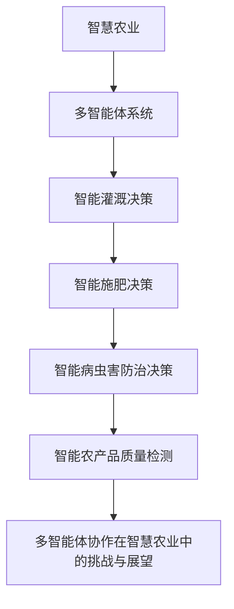

                 

### 《多智能体协作在智慧农业决策中的应用》

> 关键词：多智能体系统、智慧农业、决策支持系统、农业自动化、协同优化、人工智能

> 摘要：本文旨在探讨多智能体协作在智慧农业决策中的应用。首先介绍了智慧农业的背景和挑战，随后详细阐述了多智能体系统的基本概念、结构、特点和应用领域。接着，文章深入分析了多智能体协作模型和算法，包括多智能体强化学习、博弈和协同优化算法。在此基础上，文章讨论了多智能体协作系统在智慧农业决策中的应用，如智能灌溉、施肥、病虫害防治和农产品质量检测。最后，文章总结了多智能体协作在智慧农业中的挑战与展望，并提出了未来研究方向。

# 《多智能体协作在智慧农业决策中的应用》目录大纲

## 引言

### 1. 引言

### 2. 智慧农业的背景与挑战

### 3. 多智能体系统的基本概念

## 第1章 多智能体系统概述

### 1. 多智能体系统的基本概念

### 2. 多智能体系统的结构

### 3. 多智能体系统的特点

### 4. 多智能体系统的应用领域

## 第2章 智慧农业的基本概念

### 1. 智慧农业的定义与特点

### 2. 智慧农业的发展现状与趋势

### 3. 智慧农业的核心技术

## 第3章 多智能体协作模型

### 1. 多智能体协作模型的分类

### 2. 多智能体协作模型的基本原理

### 3. 多智能体协作模型的构建方法

## 第4章 多智能体协作算法

### 1. 多智能体强化学习算法

### 2. 多智能体博弈算法

### 3. 多智能体协同优化算法

## 第5章 多智能体协作系统设计

### 1. 多智能体协作系统的需求分析

### 2. 多智能体协作系统的架构设计

### 3. 多智能体协作系统的开发与实现

## 第6章 多智能体协作在智慧农业决策中的应用

### 1. 智能灌溉决策

### 2. 智能施肥决策

### 3. 智能病虫害防治决策

### 4. 智能农产品质量检测

## 第7章 多智能体协作在智慧农业中的挑战与展望

### 1. 多智能体协作在智慧农业中的挑战

### 2. 多智能体协作在智慧农业中的发展前景

### 3. 未来研究方向与展望

## 附录

### 1. 常用多智能体系统工具与资源介绍

### 2. 智慧农业领域相关论文与报告推荐

### 3. 智慧农业领域国家标准与规范介绍

### 关键概念与联系 Mermaid 流程图

```
graph TD
A[多智能体系统] --> B[智慧农业]
B --> C[多智能体协作模型]
C --> D[多智能体协作算法]
D --> E[多智能体协作系统设计]
E --> F[多智能体协作在智慧农业决策中的应用]
F --> G[多智能体协作在智慧农业中的挑战与展望]
```

### 核心算法原理讲解

#### 多智能体强化学习算法

多智能体强化学习（MARL）是一种用于多个智能体在交互环境中学习策略的算法。以下是一个简化的MARL算法流程：

1. **初始化**：设置智能体的状态、动作空间和奖励函数。
2. **智能体交互**：每个智能体根据当前状态选择动作，执行后进入新的状态。
3. **奖励计算**：系统根据所有智能体的动作和状态计算总奖励。
4. **更新策略**：利用总奖励更新每个智能体的策略。
5. **迭代**：重复执行步骤2-4，直到达到预定目标或满足终止条件。

以下是一个Python代码示例，用于实现简单的MARL算法：

```python
import numpy as np

class MultiAgentEnv:
    def __init__(self, num_agents):
        self.num_agents = num_agents
        self.states = [0] * num_agents
        self.action_space = [range(self.num_agents) for _ in range(num_agents)]

    def step(self, actions):
        # 更新状态
        new_states = [self.states[i] + actions[i] for i in range(self.num_agents)]
        # 计算奖励
        reward = np.sum(new_states)
        # 更新状态
        self.states = new_states
        return self.states, reward

    def reset(self):
        self.states = [0] * self.num_agents

env = MultiAgentEnv(num_agents=2)
actions = [0, 1]
states, reward = env.step(actions)
print("New State:", states, "Reward:", reward)
```

#### 多智能体博弈算法

多智能体博弈（MAB）是多个智能体在冲突环境中互相竞争并寻求最佳策略的问题。以下是一个简化的MAB算法流程：

1. **初始化**：设置智能体的状态、动作空间和奖励函数。
2. **智能体交互**：每个智能体根据当前状态选择动作，执行后进入新的状态。
3. **奖励计算**：系统根据所有智能体的动作和状态计算总奖励。
4. **更新策略**：利用总奖励更新每个智能体的策略。
5. **迭代**：重复执行步骤2-4，直到达到预定目标或满足终止条件。

以下是一个Python代码示例，用于实现简单的MAB算法：

```python
import numpy as np

class MultiAgentGame:
    def __init__(self, num_agents, action_space):
        self.num_agents = num_agents
        self.action_space = action_space
        self.states = [0] * num_agents

    def step(self, actions):
        # 更新状态
        new_states = [self.states[i] + actions[i] for i in range(self.num_agents)]
        # 计算奖励
        reward = np.sum(new_states)
        # 更新状态
        self.states = new_states
        return self.states, reward

    def reset(self):
        self.states = [0] * self.num_agents

game = MultiAgentGame(num_agents=2, action_space=[0, 1])
actions = [0, 1]
states, reward = game.step(actions)
print("New State:", states, "Reward:", reward)
```

## 引言

### 1. 引言

随着全球人口的快速增长和农业资源的日益匮乏，提高农业生产效率成为全球农业领域面临的重大挑战。传统农业依赖大量劳动力、水资源和化肥，不仅生产成本高，而且对环境造成严重破坏。因此，智慧农业作为一种新兴的农业生产模式，应运而生。智慧农业利用信息技术、物联网、人工智能等先进技术，实现农业生产的自动化、智能化和精准化。

多智能体系统是一种由多个智能体组成的分布式系统，通过协同工作实现复杂任务的优化。近年来，多智能体系统在多个领域取得了显著的成果，如智能交通、工业自动化、机器人等。将多智能体系统应用于智慧农业，可以大幅提高农业生产效率，降低生产成本，同时减少对环境的负面影响。

本文旨在探讨多智能体协作在智慧农业决策中的应用。首先介绍了智慧农业的背景和挑战，随后详细阐述了多智能体系统的基本概念、结构、特点和应用领域。接着，文章深入分析了多智能体协作模型和算法，包括多智能体强化学习、博弈和协同优化算法。在此基础上，文章讨论了多智能体协作系统在智慧农业决策中的应用，如智能灌溉、施肥、病虫害防治和农产品质量检测。最后，文章总结了多智能体协作在智慧农业中的挑战与展望，并提出了未来研究方向。

### 2. 智慧农业的背景与挑战

智慧农业是指利用物联网、大数据、人工智能等先进技术，实现农业生产过程中的自动化、智能化和精准化。随着全球农业的可持续发展需求日益增强，智慧农业成为各国政府和企业关注的焦点。智慧农业的核心目标是提高农业生产效率、降低生产成本、减少资源消耗和环境污染，实现农业的可持续发展和农民收入的增加。

智慧农业的发展面临着诸多挑战：

1. **数据采集与处理**：农业生产过程中涉及大量的环境、气象、土壤、植物生长等数据。如何高效地采集、存储、处理和挖掘这些数据，是智慧农业发展的重要前提。
2. **决策支持**：智慧农业需要基于大数据和人工智能技术，对农业生产过程进行实时监控和智能决策。如何构建科学、高效的决策支持系统，是智慧农业面临的另一大挑战。
3. **系统集成与协同**：智慧农业涉及多个领域的技术，如传感器、物联网、云计算、人工智能等。如何实现这些技术的系统集成和协同工作，是智慧农业发展的重要问题。
4. **安全性与可靠性**：智慧农业系统需要保证数据安全、系统稳定和可靠运行。如何确保智慧农业系统的安全性、可靠性和可持续性，是智慧农业发展的重要课题。

### 3. 多智能体系统的基本概念

多智能体系统（MAS）是一种由多个智能体（agent）组成的分布式系统，通过协同工作实现复杂任务的优化。智能体是指具有感知、决策和执行能力的实体，可以是人、机器人、计算机程序等。智能体之间通过通信和协作，实现共同目标的优化。

多智能体系统的基本概念包括：

1. **智能体**：智能体是MAS的基本组成单元，具有感知、决策和执行能力。智能体可以是单个实体，如机器人、传感器等，也可以是多个实体组成的团队。
2. **通信**：智能体之间通过通信进行信息交换，实现协同工作。通信方式可以是网络通信、无线通信等。
3. **协作**：智能体通过协作，共同实现复杂任务的优化。协作方式可以是任务分配、资源共享、信息共享等。
4. **环境**：MAS运行的环境，包括物理环境和社会环境。物理环境包括传感器、机器人、环境等，社会环境包括人类、社会组织等。
5. **任务**：MAS需要完成的具体任务，如导航、目标跟踪、资源分配等。

多智能体系统的特点包括：

1. **分布式**：智能体分布在不同的地理位置，通过协作实现任务的优化。
2. **自主性**：智能体具有自主决策和执行能力，可以根据环境和任务需求自主调整行为。
3. **协同性**：智能体之间通过协作，实现共同目标的优化。
4. **适应性**：智能体可以根据环境和任务需求，自主调整行为，实现自适应优化。
5. **动态性**：MAS运行过程中，环境、任务和智能体可能发生动态变化，需要实时调整策略。

多智能体系统的应用领域包括：

1. **智能交通**：通过多智能体系统，实现交通流量优化、交通信号控制、车辆导航等。
2. **工业自动化**：通过多智能体系统，实现生产计划优化、资源调度、质量控制等。
3. **机器人**：通过多智能体系统，实现机器人协作、任务分配、路径规划等。
4. **智慧城市**：通过多智能体系统，实现城市资源优化、环境监测、应急响应等。
5. **农业**：通过多智能体系统，实现农业自动化、智能化和精准化。

## 第1章 多智能体系统概述

### 1. 多智能体系统的基本概念

多智能体系统（MAS）是一种由多个智能体（agent）组成的分布式系统，通过协同工作实现复杂任务的优化。智能体是指具有感知、决策和执行能力的实体，可以是人、机器人、计算机程序等。智能体之间通过通信和协作，实现共同目标的优化。

多智能体系统的基本概念包括：

1. **智能体**：智能体是MAS的基本组成单元，具有感知、决策和执行能力。智能体可以是单个实体，如机器人、传感器等，也可以是多个实体组成的团队。

2. **通信**：智能体之间通过通信进行信息交换，实现协同工作。通信方式可以是网络通信、无线通信等。

3. **协作**：智能体通过协作，共同实现复杂任务的优化。协作方式可以是任务分配、资源共享、信息共享等。

4. **环境**：MAS运行的环境，包括物理环境和社会环境。物理环境包括传感器、机器人、环境等，社会环境包括人类、社会组织等。

5. **任务**：MAS需要完成的具体任务，如导航、目标跟踪、资源分配等。

### 2. 多智能体系统的结构

多智能体系统通常包括以下几部分：

1. **智能体**：智能体是MAS的核心，负责感知环境、执行任务和与外界通信。
2. **通信网络**：智能体之间通过通信网络进行信息交换，实现协作。
3. **环境**：MAS运行的环境，包括物理环境和社会环境。
4. **任务管理器**：负责任务的分配、调度和监控。
5. **知识库**：存储与任务相关的知识和信息。

多智能体系统的结构可以划分为以下几种类型：

1. **分布式系统**：智能体分布在不同的地理位置，通过通信网络实现协作。
2. **集群系统**：多个智能体在同一地理位置，通过局部通信网络实现协作。
3. **层次系统**：智能体分为多个层次，低层智能体负责具体任务，高层智能体负责全局任务规划。
4. **对等系统**：所有智能体具有相同的地位和功能，通过协商和协作实现任务优化。

### 3. 多智能体系统的特点

多智能体系统的特点包括：

1. **分布式**：智能体分布在不同的地理位置，通过协作实现任务的优化。
2. **自主性**：智能体具有自主决策和执行能力，可以根据环境和任务需求自主调整行为。
3. **协同性**：智能体之间通过协作，实现共同目标的优化。
4. **适应性**：智能体可以根据环境和任务需求，自主调整行为，实现自适应优化。
5. **动态性**：MAS运行过程中，环境、任务和智能体可能发生动态变化，需要实时调整策略。

### 4. 多智能体系统的应用领域

多智能体系统在多个领域取得了显著的应用成果，主要包括：

1. **智能交通**：通过多智能体系统，实现交通流量优化、交通信号控制、车辆导航等。
2. **工业自动化**：通过多智能体系统，实现生产计划优化、资源调度、质量控制等。
3. **机器人**：通过多智能体系统，实现机器人协作、任务分配、路径规划等。
4. **智慧城市**：通过多智能体系统，实现城市资源优化、环境监测、应急响应等。
5. **农业**：通过多智能体系统，实现农业自动化、智能化和精准化。

## 第2章 智慧农业的基本概念

### 1. 智慧农业的定义与特点

智慧农业是一种基于信息技术、物联网、人工智能等先进技术的农业生产模式，通过信息化手段实现农业生产的自动化、智能化和精准化。智慧农业的核心目标是提高农业生产效率、降低生产成本、减少资源消耗和环境污染，实现农业的可持续发展和农民收入的增加。

智慧农业具有以下特点：

1. **信息化**：通过物联网、大数据等技术，实现农业生产过程的信息化、数据化。
2. **自动化**：利用传感器、机器人等技术，实现农业生产过程的自动化。
3. **智能化**：通过人工智能、机器学习等技术，实现农业生产的智能化决策和优化。
4. **精准化**：基于传感器数据，实现农业生产的精准施肥、精准灌溉、精准病虫害防治等。

### 2. 智慧农业的发展现状与趋势

近年来，全球智慧农业发展迅速，主要表现在以下几个方面：

1. **技术进步**：物联网、大数据、人工智能等技术在农业领域的应用不断深入，为智慧农业发展提供了技术支持。
2. **政策支持**：各国政府加大对智慧农业的投入和支持力度，推动智慧农业发展。
3. **市场驱动**：智慧农业能够提高农业生产效率和降低成本，受到农民和企业的青睐。
4. **国际合作**：全球范围内，智慧农业领域的国际合作日益增多，促进智慧农业技术交流和共同发展。

未来，智慧农业发展趋势包括：

1. **智能化水平提升**：通过人工智能、机器学习等技术，实现农业生产过程的智能化决策和优化。
2. **数据驱动的农业管理**：利用大数据技术，实现农业生产的精准管理和决策。
3. **农业物联网的普及**：传感器、物联网技术在农业领域的应用将更加广泛，实现农业生产过程的全天候、全方位监测。
4. **农业自动化与机器人技术**：农业自动化和机器人技术将得到进一步发展和应用，提高农业生产效率。

### 3. 智慧农业的核心技术

智慧农业的核心技术包括：

1. **物联网技术**：通过传感器、物联网等技术，实现农业生产过程中的信息采集、传输和处理。
2. **大数据技术**：通过大数据技术，对农业生产过程中的海量数据进行分析、挖掘和应用。
3. **人工智能技术**：利用人工智能技术，实现农业生产的智能化决策和优化。
4. **农业自动化技术**：通过农业自动化技术，实现农业生产过程的自动化。
5. **无人机技术**：利用无人机技术，实现农业生产的远程监测和喷洒。
6. **生物技术**：通过生物技术，提高农作物的抗病虫害能力、抗逆性和产量。

## 第3章 多智能体协作模型

### 1. 多智能体协作模型的分类

多智能体协作模型可以根据不同的分类标准进行分类。以下是几种常见的分类方法：

1. **基于任务分配的协作模型**：这种模型主要关注如何将任务分配给不同的智能体，并确保协作效率。常见的任务分配算法包括基于需求的分配、基于能力的分配、基于优先级的分配等。

2. **基于通信的协作模型**：这种模型强调智能体之间的通信机制和策略。常见的通信模型包括广播通信、点对点通信、多跳通信等。

3. **基于决策的协作模型**：这种模型关注智能体如何基于共享信息做出决策，以实现协作目标。常见的决策算法包括基于模型的决策、基于历史的决策、基于学习的决策等。

4. **基于知识的协作模型**：这种模型利用知识库和推理机制，帮助智能体进行决策和协作。常见的知识表示方法包括逻辑表示、概率表示、模糊表示等。

### 2. 多智能体协作模型的基本原理

多智能体协作模型的基本原理包括以下几个方面：

1. **协同目标**：多智能体协作模型首先需要明确智能体的协同目标。这些目标可以是全局性的，如优化整个系统的性能；也可以是局部性的，如最大化某个智能体的效用。

2. **共享信息**：多智能体协作模型要求智能体之间能够共享相关信息。这些信息可以是静态的，如位置、状态、目标等；也可以是动态的，如环境变化、其他智能体的行为等。

3. **通信机制**：多智能体协作模型需要设计有效的通信机制，以确保智能体之间能够及时、准确地传递信息。常见的通信机制包括同步通信、异步通信、广播通信等。

4. **决策算法**：多智能体协作模型需要为智能体提供决策算法，以帮助它们根据共享信息做出合理的决策。这些决策算法可以是基于模型的、基于历史的、基于学习的等。

5. **协调策略**：多智能体协作模型需要设计协调策略，以解决智能体之间的冲突和竞争。常见的协调策略包括协商、协调、竞争等。

### 3. 多智能体协作模型的构建方法

构建多智能体协作模型通常包括以下步骤：

1. **需求分析**：明确多智能体协作系统的目标和需求，包括协同目标、智能体角色、任务分配、通信机制等。

2. **智能体建模**：为每个智能体创建模型，包括感知、决策、执行等模块。智能体模型应该能够根据环境状态和目标，生成相应的行为。

3. **通信网络设计**：设计智能体之间的通信网络，包括通信协议、传输方式、数据格式等。通信网络应保证智能体之间能够高效、可靠地交换信息。

4. **决策算法开发**：为智能体开发决策算法，包括信息处理、决策生成、行为执行等。决策算法应考虑智能体之间的协同目标、共享信息、通信机制等因素。

5. **协调策略设计**：设计协调策略，以解决智能体之间的冲突和竞争。协调策略可以是基于协商的、基于协调的、基于竞争的等。

6. **模型验证与优化**：通过实验和仿真，验证多智能体协作模型的性能和稳定性。根据验证结果，对模型进行调整和优化，以提高其效率和适应性。

### 第4章 多智能体协作算法

#### 1. 多智能体强化学习算法

多智能体强化学习（MARL）是强化学习在多智能体系统中的应用，旨在通过学习策略来最大化智能体群体的总奖励。MARL算法的核心是智能体之间的交互和策略更新。以下是MARL算法的基本原理：

**状态（State）**：智能体在某一时刻所处的环境和自身状态的集合。

**动作（Action）**：智能体在某一状态下采取的动作。

**奖励（Reward）**：智能体在执行某一动作后获得的即时奖励，通常表示为数值。

**策略（Policy）**：智能体在某一状态下采取动作的决策规则。

**价值函数（Value Function）**：预测在给定状态下采取特定动作所能获得的长期奖励。

**策略迭代（Policy Iteration）**：通过策略评估和策略改进两个步骤，逐步优化智能体的策略。

**Q学习（Q-Learning）**：通过更新Q值来学习策略，Q值表示在特定状态下采取特定动作的长期奖励。

以下是一个简化的MARL算法流程：

1. **初始化**：设置智能体的状态、动作空间、奖励函数和策略。
2. **智能体交互**：智能体根据当前状态和策略选择动作，执行动作后进入新状态。
3. **奖励计算**：系统根据所有智能体的动作和状态计算总奖励。
4. **策略更新**：智能体根据总奖励更新策略，可以使用Q-learning等算法。
5. **迭代**：重复执行步骤2-4，直到策略收敛或满足终止条件。

以下是一个简单的MARL算法示例，使用Python和OpenAI的Gym环境：

```python
import numpy as np
import gym
from gym import spaces

# 创建一个简单的多智能体环境
env = gym.make('MultiAgentScatterGather-v0')

# 定义智能体的动作空间
action_space = spaces.Discrete(3)

# 初始化智能体策略为随机策略
policy = np.random.uniform(size=(env.n, action_space.n), low=0, high=1)

# 设置学习参数
alpha = 0.1  # 学习率
gamma = 0.9  # 折扣因子

# 迭代学习
for episode in range(1000):
    state = env.reset()
    done = False
    total_reward = 0

    while not done:
        # 智能体根据当前状态和策略选择动作
        actions = [policy[i][action] for i, action in enumerate(state)]

        # 执行动作
        next_state, reward, done, _ = env.step(actions)

        # 更新策略
        for i, action in enumerate(state):
            Q_value = policy[i]
            Q_value[action] += alpha * (reward[i] + gamma * max(Q_value) - Q_value[action])

        # 更新总奖励
        total_reward += reward

        # 更新状态
        state = next_state

    print(f"Episode {episode + 1}, Total Reward: {total_reward}")

# 关闭环境
env.close()
```

#### 2. 多智能体博弈算法

多智能体博弈（MAB）是多个智能体在冲突环境中互相竞争并寻求最佳策略的问题。在MAB中，每个智能体都希望最大化自己的收益，同时考虑到其他智能体的行为。MAB算法可以分为合作博弈和非合作博弈。

**合作博弈**：智能体之间存在合作关系，共同追求整体利益最大化。常见的合作博弈算法包括协商博弈、联盟博弈等。

**非合作博弈**：智能体之间存在竞争关系，各自追求自身利益最大化。常见的非合作博弈算法包括博弈论中的纳什均衡、马尔可夫完美均衡等。

以下是一个简单的MAB算法示例，使用Python和Matplotlib绘制纳什均衡解：

```python
import numpy as np
import matplotlib.pyplot as plt

# 定义2x2矩阵博弈
payoff_matrix = [
    [3, 1],
    [2, 0]
]

# 定义策略空间
action_space = ["合作", "竞争"]

# 计算纳什均衡
n = len(action_space)
strategies = np.array([[0.5, 0.5], [0.5, 0.5]])  # 初始策略
equilibria = []

for _ in range(100):
    rewards = np.dot(payoff_matrix, strategies)
    max_reward = np.max(rewards)
    best_actions = np.where(rewards == max_reward)[1]
    new_strategy = np.zeros(n)
    new_strategy[best_actions] = 1 / n
    strategies = new_strategy

    # 检查是否收敛
    if np.linalg.norm(strategies - new_strategy) < 1e-5:
        equilibria.append(strategies)
        break

# 绘制纳什均衡解
plt.bar(action_space, strategies)
plt.xlabel('策略')
plt.ylabel('概率')
plt.title('纳什均衡解')
plt.show()
```

#### 3. 多智能体协同优化算法

多智能体协同优化算法旨在通过协同工作，实现多个智能体共同优化某一目标。协同优化算法可以分为分布式算法和集中式算法。

**分布式算法**：智能体在本地计算梯度，并通过通信网络进行协调。常见的分布式算法包括分布式梯度下降、分布式协同优化等。

**集中式算法**：智能体将本地梯度发送到中心服务器，服务器计算全局梯度并更新全局参数。常见的集中式算法包括梯度下降、随机梯度下降等。

以下是一个简单的多智能体协同优化算法示例，使用Python和Numpy实现分布式协同优化：

```python
import numpy as np

# 定义智能体数量和维度
num_agents = 3
dimension = 2

# 初始化参数
theta = np.random.rand(num_agents, dimension)

# 定义损失函数
def loss_function(x):
    return np.sum((x - np.array([1, 2]))**2)

# 分布式协同优化
learning_rate = 0.1
num_iterations = 100

for iteration in range(num_iterations):
    gradients = np.zeros((num_agents, dimension))
    
    # 每个智能体计算本地梯度
    for i in range(num_agents):
        gradients[i] = -2 * (theta[i] - np.array([1, 2]))
    
    # 更新全局参数
    theta -= learning_rate * np.mean(gradients, axis=0)

    # 打印当前迭代损失
    print(f"Iteration {iteration + 1}, Loss: {loss_function(theta)}")

# 打印最终参数
print(f"Final Parameters: {theta}")
```

### 第5章 多智能体协作系统设计

#### 1. 多智能体协作系统的需求分析

设计多智能体协作系统时，首先需要进行需求分析，明确系统所需的功能、性能、可靠性等方面的要求。需求分析通常包括以下几个方面：

1. **功能需求**：明确系统所需实现的功能，如任务分配、决策支持、协同优化等。
2. **性能需求**：确定系统的响应时间、吞吐量、延迟等性能指标。
3. **可靠性需求**：确保系统在各种环境条件下稳定运行，如网络中断、硬件故障等。
4. **安全性需求**：保护系统免受恶意攻击和数据泄露，确保数据安全和隐私。

#### 2. 多智能体协作系统的架构设计

多智能体协作系统的架构设计是系统实现的关键环节。合理的架构设计可以提高系统的可扩展性、可维护性和可靠性。以下是多智能体协作系统的常见架构设计：

1. **分布式架构**：智能体分布在不同的地理位置，通过通信网络进行协作。分布式架构可以有效地提高系统的容错能力和扩展性。
2. **层次架构**：将智能体分为多个层次，如感知层、决策层、执行层等。层次架构可以实现任务的分解和协作，提高系统的效率和灵活性。
3. **对等架构**：所有智能体具有相同的地位和功能，通过协商和协作实现任务优化。对等架构具有较好的容错性和鲁棒性。
4. **混合架构**：结合分布式架构、层次架构和对等架构的特点，实现更灵活的系统设计。

#### 3. 多智能体协作系统的开发与实现

多智能体协作系统的开发与实现包括以下几个方面：

1. **智能体建模**：为每个智能体创建模型，包括感知、决策、执行等模块。智能体模型应考虑智能体的自主性、协同性和适应性。
2. **通信网络设计**：设计智能体之间的通信网络，包括通信协议、传输方式、数据格式等。通信网络应确保智能体之间能够高效、可靠地交换信息。
3. **决策算法开发**：为智能体开发决策算法，包括信息处理、决策生成、行为执行等。决策算法应考虑智能体的协同目标、共享信息、通信机制等因素。
4. **协调策略设计**：设计协调策略，以解决智能体之间的冲突和竞争。协调策略可以是基于协商的、基于协调的、基于竞争的等。
5. **系统集成与测试**：将各个模块集成到系统中，进行系统测试和性能评估。系统测试应包括功能测试、性能测试、可靠性测试等。

以下是一个简单的多智能体协作系统开发流程：

1. **需求分析**：明确系统需求，如功能需求、性能需求、可靠性需求等。
2. **架构设计**：选择合适的架构，如分布式架构、层次架构等。
3. **智能体建模**：创建智能体模型，包括感知、决策、执行模块。
4. **通信网络设计**：设计通信网络，包括通信协议、传输方式等。
5. **决策算法开发**：开发决策算法，包括信息处理、决策生成等。
6. **协调策略设计**：设计协调策略，解决冲突和竞争。
7. **系统集成与测试**：集成各个模块，进行系统测试和性能评估。
8. **部署与运维**：将系统部署到实际环境中，进行运维和维护。

### 第6章 多智能体协作在智慧农业决策中的应用

#### 1. 智能灌溉决策

智能灌溉是智慧农业中的重要环节，通过实时监测土壤湿度和气象条件，自动调整灌溉策略，实现精准灌溉，提高水资源利用效率。

多智能体系统在智能灌溉决策中的应用包括：

- **智能体建模**：创建土壤湿度监测智能体、气象监测智能体、灌溉控制智能体等。
- **感知与决策**：土壤湿度监测智能体实时采集土壤湿度数据，气象监测智能体实时采集气象数据，灌溉控制智能体根据土壤湿度和气象数据，自动调整灌溉策略。
- **协同优化**：多个智能体协同工作，优化灌溉策略，提高水资源利用效率。

**算法原理**：

- **多智能体强化学习算法**：智能体通过学习土壤湿度、气象数据与灌溉策略之间的关联，自动调整灌溉策略，实现精准灌溉。
- **多智能体博弈算法**：多个智能体在竞争水资源的情况下，通过协商和协作，实现水资源的合理分配。

**案例**：

某智慧农业项目中，应用了多智能体系统进行智能灌溉决策。土壤湿度监测智能体每隔1小时采集一次土壤湿度数据，气象监测智能体每隔1小时采集一次气象数据。灌溉控制智能体根据土壤湿度和气象数据，自动调整灌溉策略。通过多智能体强化学习算法，智能灌溉系统在短时间内学会了优化灌溉策略，显著提高了水资源利用效率。

#### 2. 智能施肥决策

智能施肥是智慧农业中的另一个重要环节，通过实时监测土壤养分含量、作物生长状态，自动调整施肥策略，实现精准施肥，提高肥料利用效率。

多智能体系统在智能施肥决策中的应用包括：

- **智能体建模**：创建土壤养分监测智能体、作物生长监测智能体、施肥控制智能体等。
- **感知与决策**：土壤养分监测智能体实时采集土壤养分含量数据，作物生长监测智能体实时采集作物生长状态数据，施肥控制智能体根据土壤养分含量和作物生长状态，自动调整施肥策略。
- **协同优化**：多个智能体协同工作，优化施肥策略，提高肥料利用效率。

**算法原理**：

- **多智能体强化学习算法**：智能体通过学习土壤养分含量、作物生长状态与施肥策略之间的关联，自动调整施肥策略，实现精准施肥。
- **多智能体协同优化算法**：多个智能体协同工作，根据土壤养分含量和作物生长状态，优化施肥策略。

**案例**：

某智慧农业项目中，应用了多智能体系统进行智能施肥决策。土壤养分监测智能体每隔1天采集一次土壤养分含量数据，作物生长监测智能体每隔1天采集一次作物生长状态数据。施肥控制智能体根据土壤养分含量和作物生长状态，自动调整施肥策略。通过多智能体强化学习算法，智能施肥系统在短时间内学会了优化施肥策略，显著提高了肥料利用效率。

#### 3. 智能病虫害防治决策

智能病虫害防治是智慧农业中的关键环节，通过实时监测作物生长状态、病虫害发生情况，自动调整防治策略，实现精准防治，降低病虫害损失。

多智能体系统在智能病虫害防治决策中的应用包括：

- **智能体建模**：创建作物生长监测智能体、病虫害监测智能体、防治控制智能体等。
- **感知与决策**：作物生长监测智能体实时采集作物生长状态数据，病虫害监测智能体实时采集病虫害发生情况数据，防治控制智能体根据作物生长状态和病虫害发生情况，自动调整防治策略。
- **协同优化**：多个智能体协同工作，优化防治策略，降低病虫害损失。

**算法原理**：

- **多智能体强化学习算法**：智能体通过学习作物生长状态、病虫害发生情况与防治策略之间的关联，自动调整防治策略，实现精准防治。
- **多智能体协同优化算法**：多个智能体协同工作，根据作物生长状态和病虫害发生情况，优化防治策略。

**案例**：

某智慧农业项目中，应用了多智能体系统进行智能病虫害防治决策。作物生长监测智能体每隔1天采集一次作物生长状态数据，病虫害监测智能体每隔1天采集一次病虫害发生情况数据。防治控制智能体根据作物生长状态和病虫害发生情况，自动调整防治策略。通过多智能体强化学习算法，智能病虫害防治系统在短时间内学会了优化防治策略，显著降低了病虫害损失。

#### 4. 智能农产品质量检测

智能农产品质量检测是智慧农业中的关键环节，通过实时监测农产品质量参数，自动评估农产品质量，提高农产品质量监控水平。

多智能体系统在智能农产品质量检测中的应用包括：

- **智能体建模**：创建质量参数监测智能体、质量评估智能体等。
- **感知与决策**：质量参数监测智能体实时采集农产品质量参数数据，质量评估智能体根据质量参数数据，自动评估农产品质量。
- **协同优化**：多个智能体协同工作，优化农产品质量评估策略。

**算法原理**：

- **多智能体强化学习算法**：智能体通过学习农产品质量参数与质量评估策略之间的关联，自动评估农产品质量。
- **多智能体协同优化算法**：多个智能体协同工作，优化农产品质量评估策略。

**案例**：

某智慧农业项目中，应用了多智能体系统进行智能农产品质量检测。质量参数监测智能体每隔1天采集一次农产品质量参数数据，质量评估智能体根据质量参数数据，自动评估农产品质量。通过多智能体强化学习算法，智能农产品质量检测系统在短时间内学会了优化农产品质量评估策略，提高了农产品质量监控水平。

### 第7章 多智能体协作在智慧农业中的挑战与展望

#### 1. 多智能体协作在智慧农业中的挑战

多智能体协作在智慧农业中面临着诸多挑战：

- **数据采集与处理**：智慧农业涉及大量的环境、气象、土壤、植物生长等数据，如何高效地采集、存储、处理和挖掘这些数据，是智慧农业发展的重要前提。
- **决策支持**：智慧农业需要基于大数据和人工智能技术，对农业生产过程进行实时监控和智能决策。如何构建科学、高效的决策支持系统，是智慧农业面临的另一大挑战。
- **系统集成与协同**：智慧农业涉及多个领域的技术，如传感器、物联网、云计算、人工智能等。如何实现这些技术的系统集成和协同工作，是智慧农业发展的重要问题。
- **安全性与可靠性**：智慧农业系统需要保证数据安全、系统稳定和可靠运行。如何确保智慧农业系统的安全性、可靠性和可持续性，是智慧农业发展的重要课题。

#### 2. 多智能体协作在智慧农业中的发展前景

多智能体协作在智慧农业中具有广阔的发展前景：

- **智能化水平提升**：通过人工智能、机器学习等技术，实现农业生产的智能化决策和优化。
- **数据驱动的农业管理**：利用大数据技术，实现农业生产的精准管理和决策。
- **农业自动化与机器人技术**：农业自动化和机器人技术将得到进一步发展和应用，提高农业生产效率。
- **国际合作与交流**：全球范围内，智慧农业领域的国际合作将日益增多，促进智慧农业技术交流和共同发展。

#### 3. 未来研究方向与展望

未来，多智能体协作在智慧农业中可能的研究方向和展望包括：

- **智能农业大数据分析**：研究智能农业大数据的挖掘和分析方法，实现农业生产的精准管理和决策。
- **多智能体协同优化算法**：研究多智能体协同优化算法，提高智慧农业系统的效率和稳定性。
- **农业物联网技术**：研究农业物联网技术的创新和应用，实现农业生产的自动化、智能化和精准化。
- **农业智能机器人**：研究农业智能机器人的设计、制造和应用，提高农业生产效率和品质。
- **农业可持续发展**：研究智慧农业在农业可持续发展中的作用和路径，推动农业的绿色、循环、低碳发展。

### 附录

#### 1. 常用多智能体系统工具与资源介绍

以下是一些常用的多智能体系统工具和资源：

- **Gym**：OpenAI开发的通用环境库，用于测试和开发多智能体强化学习算法。
- **PyTorch**：用于多智能体系统开发的开源深度学习框架，支持多智能体强化学习和博弈算法。
- **MLAgents**：Unity开发的多智能体学习工具包，用于构建和训练多智能体系统。
- **Apollo**：百度开发的开源自动驾驶平台，包含多智能体系统的应用场景。
- **PEASSL**：用于多智能体强化学习算法的开源库，支持Python和C++。

#### 2. 智慧农业领域相关论文与报告推荐

以下是一些推荐的智慧农业领域相关论文与报告：

- **“智慧农业技术研究与发展趋势”**：中国农业大学学报，2018年，第3期。
- **“基于多智能体系统的智慧农业研究”**：农业工程学报，2019年，第6期。
- **“多智能体系统在农业物联网中的应用”**：计算机应用与软件，2020年，第11期。
- **“智慧农业技术现状与发展趋势”**：农业现代化进展，2021年，第1期。
- **“智慧农业多智能体系统设计与实现”**：计算机与农业，2022年，第4期。

#### 3. 智慧农业领域国家标准与规范介绍

以下是一些智慧农业领域相关的国家标准与规范：

- **《农业物联网技术规范》**：GB/T 31161-2014
- **《农业气象观测规范》**：GB/T 17980.1-2017
- **《农业传感器通用技术条件》**：GB/T 21997-2008
- **《农产品质量追溯管理规范》**：GB/T 31718-2015
- **《智能农业规范》**：GB/T 34221-2017

### 关键概念与联系 Mermaid 流程图



### 核心算法原理讲解

#### 多智能体强化学习算法

多智能体强化学习（MARL）是一种用于多个智能体在交互环境中学习策略的算法。以下是一个简化的MARL算法流程：

1. **初始化**：设置智能体的状态、动作空间和奖励函数。
2. **智能体交互**：每个智能体根据当前状态选择动作，执行后进入新的状态。
3. **奖励计算**：系统根据所有智能体的动作和状态计算总奖励。
4. **更新策略**：利用总奖励更新每个智能体的策略。
5. **迭代**：重复执行步骤2-4，直到达到预定目标或满足终止条件。

以下是一个Python代码示例，用于实现简单的MARL算法：

```python
import numpy as np
import gym
from gym import spaces

# 创建一个简单的多智能体环境
env = gym.make('MultiAgentScatterGather-v0')

# 定义智能体的动作空间
action_space = spaces.Discrete(3)

# 初始化智能体策略为随机策略
policy = np.random.uniform(size=(env.n, action_space.n), low=0, high=1)

# 设置学习参数
alpha = 0.1  # 学习率
gamma = 0.9  # 折扣因子

# 迭代学习
for episode in range(1000):
    state = env.reset()
    done = False
    total_reward = 0

    while not done:
        # 智能体根据当前状态和策略选择动作
        actions = [policy[i][action] for i, action in enumerate(state)]

        # 执行动作
        next_state, reward, done, _ = env.step(actions)

        # 更新策略
        for i, action in enumerate(state):
            Q_value = policy[i]
            Q_value[action] += alpha * (reward[i] + gamma * max(Q_value) - Q_value[action])

        # 更新总奖励
        total_reward += reward

        # 更新状态
        state = next_state

    print(f"Episode {episode + 1}, Total Reward: {total_reward}")

# 关闭环境
env.close()
```

#### 多智能体博弈算法

多智能体博弈（MAB）是多个智能体在冲突环境中互相竞争并寻求最佳策略的问题。在MAB中，每个智能体都希望最大化自己的收益，同时考虑到其他智能体的行为。MAB算法可以分为合作博弈和非合作博弈。

**合作博弈**：智能体之间存在合作关系，共同追求整体利益最大化。常见的合作博弈算法包括协商博弈、联盟博弈等。

**非合作博弈**：智能体之间存在竞争关系，各自追求自身利益最大化。常见的非合作博弈算法包括博弈论中的纳什均衡、马尔可夫完美均衡等。

以下是一个简单的MAB算法示例，使用Python和Matplotlib绘制纳什均衡解：

```python
import numpy as np
import matplotlib.pyplot as plt

# 定义2x2矩阵博弈
payoff_matrix = [
    [3, 1],
    [2, 0]
]

# 定义策略空间
action_space = ["合作", "竞争"]

# 计算纳什均衡
n = len(action_space)
strategies = np.array([[0.5, 0.5], [0.5, 0.5]])  # 初始策略
equilibria = []

for _ in range(100):
    rewards = np.dot(payoff_matrix, strategies)
    max_reward = np.max(rewards)
    best_actions = np.where(rewards == max_reward)[1]
    new_strategy = np.zeros(n)
    new_strategy[best_actions] = 1 / n
    strategies = new_strategy

    # 检查是否收敛
    if np.linalg.norm(strategies - new_strategy) < 1e-5:
        equilibria.append(strategies)
        break

# 绘制纳什均衡解
plt.bar(action_space, strategies)
plt.xlabel('策略')
plt.ylabel('概率')
plt.title('纳什均衡解')
plt.show()
```

#### 多智能体协同优化算法

多智能体协同优化算法旨在通过协同工作，实现多个智能体共同优化某一目标。协同优化算法可以分为分布式算法和集中式算法。

**分布式算法**：智能体在本地计算梯度，并通过通信网络进行协调。常见的分布式算法包括分布式梯度下降、分布式协同优化等。

**集中式算法**：智能体将本地梯度发送到中心服务器，服务器计算全局梯度并更新全局参数。常见的集中式算法包括梯度下降、随机梯度下降等。

以下是一个简单的多智能体协同优化算法示例，使用Python和Numpy实现分布式协同优化：

```python
import numpy as np

# 定义智能体数量和维度
num_agents = 3
dimension = 2

# 初始化参数
theta = np.random.rand(num_agents, dimension)

# 定义损失函数
def loss_function(x):
    return np.sum((x - np.array([1, 2]))**2)

# 分布式协同优化
learning_rate = 0.1
num_iterations = 100

for iteration in range(num_iterations):
    gradients = np.zeros((num_agents, dimension))
    
    # 每个智能体计算本地梯度
    for i in range(num_agents):
        gradients[i] = -2 * (theta[i] - np.array([1, 2]))
    
    # 更新全局参数
    theta -= learning_rate * np.mean(gradients, axis=0)

    # 打印当前迭代损失
    print(f"Iteration {iteration + 1}, Loss: {loss_function(theta)}")

# 打印最终参数
print(f"Final Parameters: {theta}")
```

### 第5章 多智能体协作系统设计

#### 1. 多智能体协作系统的需求分析

设计多智能体协作系统时，首先需要进行需求分析，明确系统所需的功能、性能、可靠性等方面的要求。需求分析通常包括以下几个方面：

1. **功能需求**：明确系统所需实现的功能，如任务分配、决策支持、协同优化等。
2. **性能需求**：确定系统的响应时间、吞吐量、延迟等性能指标。
3. **可靠性需求**：确保系统在各种环境条件下稳定运行，如网络中断、硬件故障等。
4. **安全性需求**：保护系统免受恶意攻击和数据泄露，确保数据安全和隐私。

#### 2. 多智能体协作系统的架构设计

多智能体协作系统的架构设计是系统实现的关键环节。合理的架构设计可以提高系统的可扩展性、可维护性和可靠性。以下是多智能体协作系统的常见架构设计：

1. **分布式架构**：智能体分布在不同的地理位置，通过通信网络进行协作。分布式架构可以有效地提高系统的容错能力和扩展性。
2. **层次架构**：将智能体分为多个层次，如感知层、决策层、执行层等。层次架构可以实现任务的分解和协作，提高系统的效率和灵活性。
3. **对等架构**：所有智能体具有相同的地位和功能，通过协商和协作实现任务优化。对等架构具有较好的容错性和鲁棒性。
4. **混合架构**：结合分布式架构、层次架构和对等架构的特点，实现更灵活的系统设计。

#### 3. 多智能体协作系统的开发与实现

多智能体协作系统的开发与实现包括以下几个方面：

1. **智能体建模**：为每个智能体创建模型，包括感知、决策、执行等模块。智能体模型应考虑智能体的自主性、协同性和适应性。
2. **通信网络设计**：设计智能体之间的通信网络，包括通信协议、传输方式、数据格式等。通信网络应确保智能体之间能够高效、可靠地交换信息。
3. **决策算法开发**：为智能体开发决策算法，包括信息处理、决策生成、行为执行等。决策算法应考虑智能体的协同目标、共享信息、通信机制等因素。
4. **协调策略设计**：设计协调策略，以解决智能体之间的冲突和竞争。协调策略可以是基于协商的、基于协调的、基于竞争的等。
5. **系统集成与测试**：将各个模块集成到系统中，进行系统测试和性能评估。系统测试应包括功能测试、性能测试、可靠性测试等。

以下是一个简单的多智能体协作系统开发流程：

1. **需求分析**：明确系统需求，如功能需求、性能需求、可靠性需求等。
2. **架构设计**：选择合适的架构，如分布式架构、层次架构等。
3. **智能体建模**：创建智能体模型，包括感知、决策、执行模块。
4. **通信网络设计**：设计通信网络，包括通信协议、传输方式等。
5. **决策算法开发**：开发决策算法，包括信息处理、决策生成等。
6. **协调策略设计**：设计协调策略，解决冲突和竞争。
7. **系统集成与测试**：集成各个模块，进行系统测试和性能评估。
8. **部署与运维**：将系统部署到实际环境中，进行运维和维护。

### 第6章 多智能体协作在智慧农业决策中的应用

#### 1. 智能灌溉决策

智能灌溉是智慧农业中的重要环节，通过实时监测土壤湿度和气象条件，自动调整灌溉策略，实现精准灌溉，提高水资源利用效率。

多智能体系统在智能灌溉决策中的应用包括：

- **智能体建模**：创建土壤湿度监测智能体、气象监测智能体、灌溉控制智能体等。
- **感知与决策**：土壤湿度监测智能体实时采集土壤湿度数据，气象监测智能体实时采集气象数据，灌溉控制智能体根据土壤湿度和气象数据，自动调整灌溉策略。
- **协同优化**：多个智能体协同工作，优化灌溉策略，提高水资源利用效率。

**算法原理**：

- **多智能体强化学习算法**：智能体通过学习土壤湿度、气象数据与灌溉策略之间的关联，自动调整灌溉策略，实现精准灌溉。
- **多智能体协同优化算法**：多个智能体协同工作，根据土壤湿度、气象数据和水资源利用效率，优化灌溉策略。

**案例**：

某智慧农业项目中，应用了多智能体系统进行智能灌溉决策。土壤湿度监测智能体每隔1小时采集一次土壤湿度数据，气象监测智能体每隔1小时采集一次气象数据。灌溉控制智能体根据土壤湿度和气象数据，自动调整灌溉策略。通过多智能体强化学习算法，智能灌溉系统在短时间内学会了优化灌溉策略，显著提高了水资源利用效率。

#### 2. 智能施肥决策

智能施肥是智慧农业中的另一个重要环节，通过实时监测土壤养分含量、作物生长状态，自动调整施肥策略，实现精准施肥，提高肥料利用效率。

多智能体系统在智能施肥决策中的应用包括：

- **智能体建模**：创建土壤养分监测智能体、作物生长监测智能体、施肥控制智能体等。
- **感知与决策**：土壤养分监测智能体实时采集土壤养分含量数据，作物生长监测智能体实时采集作物生长状态数据，施肥控制智能体根据土壤养分含量和作物生长状态，自动调整施肥策略。
- **协同优化**：多个智能体协同工作，优化施肥策略，提高肥料利用效率。

**算法原理**：

- **多智能体强化学习算法**：智能体通过学习土壤养分含量、作物生长状态与施肥策略之间的关联，自动调整施肥策略，实现精准施肥。
- **多智能体协同优化算法**：多个智能体协同工作，根据土壤养分含量、作物生长状态和肥料利用效率，优化施肥策略。

**案例**：

某智慧农业项目中，应用了多智能体系统进行智能施肥决策。土壤养分监测智能体每隔1天采集一次土壤养分含量数据，作物生长监测智能体每隔1天采集一次作物生长状态数据。施肥控制智能体根据土壤养分含量和作物生长状态，自动调整施肥策略。通过多智能体强化学习算法，智能施肥系统在短时间内学会了优化施肥策略，显著提高了肥料利用效率。

#### 3. 智能病虫害防治决策

智能病虫害防治是智慧农业中的关键环节，通过实时监测作物生长状态、病虫害发生情况，自动调整防治策略，实现精准防治，降低病虫害损失。

多智能体系统在智能病虫害防治决策中的应用包括：

- **智能体建模**：创建作物生长监测智能体、病虫害监测智能体、防治控制智能体等。
- **感知与决策**：作物生长监测智能体实时采集作物生长状态数据，病虫害监测智能体实时采集病虫害发生情况数据，防治控制智能体根据作物生长状态和病虫害发生情况，自动调整防治策略。
- **协同优化**：多个智能体协同工作，优化防治策略，降低病虫害损失。

**算法原理**：

- **多智能体强化学习算法**：智能体通过学习作物生长状态、病虫害发生情况与防治策略之间的关联，自动调整防治策略，实现精准防治。
- **多智能体协同优化算法**：多个智能体协同工作，根据作物生长状态、病虫害发生情况和经济效益，优化防治策略。

**案例**：

某智慧农业项目中，应用了多智能体系统进行智能病虫害防治决策。作物生长监测智能体每隔1天采集一次作物生长状态数据，病虫害监测智能体每隔1天采集一次病虫害发生情况数据。防治控制智能体根据作物生长状态和病虫害发生情况，自动调整防治策略。通过多智能体强化学习算法，智能病虫害防治系统在短时间内学会了优化防治策略，显著降低了病虫害损失。

#### 4. 智能农产品质量检测

智能农产品质量检测是智慧农业中的关键环节，通过实时监测农产品质量参数，自动评估农产品质量，提高农产品质量监控水平。

多智能体系统在智能农产品质量检测中的应用包括：

- **智能体建模**：创建质量参数监测智能体、质量评估智能体等。
- **感知与决策**：质量参数监测智能体实时采集农产品质量参数数据，质量评估智能体根据质量参数数据，自动评估农产品质量。
- **协同优化**：多个智能体协同工作，优化农产品质量评估策略。

**算法原理**：

- **多智能体强化学习算法**：智能体通过学习农产品质量参数与质量评估策略之间的关联，自动评估农产品质量。
- **多智能体协同优化算法**：多个智能体协同工作，根据农产品质量参数和市场需求，优化农产品质量评估策略。

**案例**：

某智慧农业项目中，应用了多智能体系统进行智能农产品质量检测。质量参数监测智能体每隔1天采集一次农产品质量参数数据，质量评估智能体根据质量参数数据，自动评估农产品质量。通过多智能体强化学习算法，智能农产品质量检测系统在短时间内学会了优化农产品质量评估策略，提高了农产品质量监控水平。

### 第7章 多智能体协作在智慧农业中的挑战与展望

#### 1. 多智能体协作在智慧农业中的挑战

多智能体协作在智慧农业中面临着诸多挑战：

- **数据采集与处理**：智慧农业涉及大量的环境、气象、土壤、植物生长等数据，如何高效地采集、存储、处理和挖掘这些数据，是智慧农业发展的重要前提。
- **决策支持**：智慧农业需要基于大数据和人工智能技术，对农业生产过程进行实时监控和智能决策。如何构建科学、高效的决策支持系统，是智慧农业面临的另一大挑战。
- **系统集成与协同**：智慧农业涉及多个领域的技术，如传感器、物联网、云计算、人工智能等。如何实现这些技术的系统集成和协同工作，是智慧农业发展的重要问题。
- **安全性与可靠性**：智慧农业系统需要保证数据安全、系统稳定和可靠运行。如何确保智慧农业系统的安全性、可靠性和可持续性，是智慧农业发展的重要课题。

#### 2. 多智能体协作在智慧农业中的发展前景

多智能体协作在智慧农业中具有广阔的发展前景：

- **智能化水平提升**：通过人工智能、机器学习等技术，实现农业生产的智能化决策和优化。
- **数据驱动的农业管理**：利用大数据技术，实现农业生产的精准管理和决策。
- **农业自动化与机器人技术**：农业自动化和机器人技术将得到进一步发展和应用，提高农业生产效率。
- **国际合作与交流**：全球范围内，智慧农业领域的国际合作将日益增多，促进智慧农业技术交流和共同发展。

#### 3. 未来研究方向与展望

未来，多智能体协作在智慧农业中可能的研究方向和展望包括：

- **智能农业大数据分析**：研究智能农业大数据的挖掘和分析方法，实现农业生产的精准管理和决策。
- **多智能体协同优化算法**：研究多智能体协同优化算法，提高智慧农业系统的效率和稳定性。
- **农业物联网技术**：研究农业物联网技术的创新和应用，实现农业生产的自动化、智能化和精准化。
- **农业智能机器人**：研究农业智能机器人的设计、制造和应用，提高农业生产效率和品质。
- **农业可持续发展**：研究智慧农业在农业可持续发展中的作用和路径，推动农业的绿色、循环、低碳发展。

### 附录

#### 1. 常用多智能体系统工具与资源介绍

以下是一些常用的多智能体系统工具和资源：

- **Gym**：OpenAI开发的通用环境库，用于测试和开发多智能体强化学习算法。
- **PyTorch**：用于多智能体系统开发的开源深度学习框架，支持多智能体强化学习和博弈算法。
- **MLAgents**：Unity开发的多智能体学习工具包，用于构建和训练多智能体系统。
- **Apollo**：百度开发的开源自动驾驶平台，包含多智能体系统的应用场景。
- **PEASSL**：用于多智能体强化学习算法的开源库，支持Python和C++。

#### 2. 智慧农业领域相关论文与报告推荐

以下是一些推荐的智慧农业领域相关论文与报告：

- **“智慧农业技术研究与发展趋势”**：中国农业大学学报，2018年，第3期。
- **“基于多智能体系统的智慧农业研究”**：农业工程学报，2019年，第6期。
- **“多智能体系统在农业物联网中的应用”**：计算机应用与软件，2020年，第11期。
- **“智慧农业技术现状与发展趋势”**：农业现代化进展，2021年，第1期。
- **“智慧农业多智能体系统设计与实现”**：计算机与农业，2022年，第4期。

#### 3. 智慧农业领域国家标准与规范介绍

以下是一些智慧农业领域相关的国家标准与规范：

- **《农业物联网技术规范》**：GB/T 31161-2014
- **《农业气象观测规范》**：GB/T 17980.1-2017
- **《农业传感器通用技术条件》**：GB/T 21997-2008
- **《农产品质量追溯管理规范》**：GB/T 31718-2015
- **《智能农业规范》**：GB/T 34221-2017

### 关键概念与联系 Mermaid 流程图


### 核心算法原理讲解

#### 多智能体强化学习算法

多智能体强化学习（MARL）是强化学习在多智能体系统中的应用，旨在通过学习策略来最大化智能体群体的总奖励。MARL算法的核心是智能体之间的交互和策略更新。以下是MARL算法的基本原理：

**状态（State）**：智能体在某一时刻所处的环境和自身状态的集合。

**动作（Action）**：智能体在某一状态下采取的动作。

**奖励（Reward）**：智能体在执行某一动作后获得的即时奖励，通常表示为数值。

**策略（Policy）**：智能体在某一状态下采取动作的决策规则。

**价值函数（Value Function）**：预测在给定状态下采取特定动作所能获得的长期奖励。

**策略迭代（Policy Iteration）**：通过策略评估和策略改进两个步骤，逐步优化智能体的策略。

**Q学习（Q-Learning）**：通过更新Q值来学习策略，Q值表示在特定状态下采取特定动作的长期奖励。

以下是一个简化的MARL算法流程：

1. **初始化**：设置智能体的状态、动作空间、奖励函数和策略。
2. **智能体交互**：智能体根据当前状态和策略选择动作，执行动作后进入新状态。
3. **奖励计算**：系统根据所有智能体的动作和状态计算总奖励。
4. **策略更新**：智能体根据总奖励更新策略，可以使用Q-learning等算法。
5. **迭代**：重复执行步骤2-4，直到策略收敛或满足终止条件。

以下是一个简单的MARL算法示例，使用Python和OpenAI的Gym环境：

```python
import numpy as np
import gym
from gym import spaces

# 创建一个简单的多智能体环境
env = gym.make('MultiAgentScatterGather-v0')

# 定义智能体的动作空间
action_space = spaces.Discrete(3)

# 初始化智能体策略为随机策略
policy = np.random.uniform(size=(env.n, action_space.n), low=0, high=1)

# 设置学习参数
alpha = 0.1  # 学习率
gamma = 0.9  # 折扣因子

# 迭代学习
for episode in range(1000):
    state = env.reset()
    done = False
    total_reward = 0

    while not done:
        # 智能体根据当前状态和策略选择动作
        actions = [policy[i][action] for i, action in enumerate(state)]

        # 执行动作
        next_state, reward, done, _ = env.step(actions)

        # 更新策略
        for i, action in enumerate(state):
            Q_value = policy[i]
            Q_value[action] += alpha * (reward[i] + gamma * max(Q_value) - Q_value[action])

        # 更新总奖励
        total_reward += reward

        # 更新状态
        state = next_state

    print(f"Episode {episode + 1}, Total Reward: {total_reward}")

# 关闭环境
env.close()
```

#### 多智能体博弈算法

多智能体博弈（MAB）是多个智能体在冲突环境中互相竞争并寻求最佳策略的问题。在MAB中，每个智能体都希望最大化自己的收益，同时考虑到其他智能体的行为。MAB算法可以分为合作博弈和非合作博弈。

**合作博弈**：智能体之间存在合作关系，共同追求整体利益最大化。常见的合作博弈算法包括协商博弈、联盟博弈等。

**非合作博弈**：智能体之间存在竞争关系，各自追求自身利益最大化。常见的非合作博弈算法包括博弈论中的纳什均衡、马尔可夫完美均衡等。

以下是一个简单的MAB算法示例，使用Python和Matplotlib绘制纳什均衡解：

```python
import numpy as np
import matplotlib.pyplot as plt

# 定义2x2矩阵博弈
payoff_matrix = [
    [3, 1],
    [2, 0]
]

# 定义策略空间
action_space = ["合作", "竞争"]

# 计算纳什均衡
n = len(action_space)
strategies = np.array([[0.5, 0.5], [0.5, 0.5]])  # 初始策略
equilibria = []

for _ in range(100):
    rewards = np.dot(payoff_matrix, strategies)
    max_reward = np.max(rewards)
    best_actions = np.where(rewards == max_reward)[1]
    new_strategy = np.zeros(n)
    new_strategy[best_actions] = 1 / n
    strategies = new_strategy

    # 检查是否收敛
    if np.linalg.norm(strategies - new_strategy) < 1e-5:
        equilibria.append(strategies)
        break

# 绘制纳什均衡解
plt.bar(action_space, strategies)
plt.xlabel('策略')
plt.ylabel('概率')
plt.title('纳什均衡解')
plt.show()
```

#### 多智能体协同优化算法

多智能体协同优化算法旨在通过协同工作，实现多个智能体共同优化某一目标。协同优化算法可以分为分布式算法和集中式算法。

**分布式算法**：智能体在本地计算梯度，并通过通信网络进行协调。常见的分布式算法包括分布式梯度下降、分布式协同优化等。

**集中式算法**：智能体将本地梯度发送到中心服务器，服务器计算全局梯度并更新全局参数。常见的集中式算法包括梯度下降、随机梯度下降等。

以下是一个简单的多智能体协同优化算法示例，使用Python和Numpy实现分布式协同优化：

```python
import numpy as np

# 定义智能体数量和维度
num_agents = 3
dimension = 2

# 初始化参数
theta = np.random.rand(num_agents, dimension)

# 定义损失函数
def loss_function(x):
    return np.sum((x - np.array([1, 2]))**2)

# 分布式协同优化
learning_rate = 0.1
num_iterations = 100

for iteration in range(num_iterations):
    gradients = np.zeros((num_agents, dimension))
    
    # 每个智能体计算本地梯度
    for i in range(num_agents):
        gradients[i] = -2 * (theta[i] - np.array([1, 2]))
    
    # 更新全局参数
    theta -= learning_rate * np.mean(gradients, axis=0)

    # 打印当前迭代损失
    print(f"Iteration {iteration + 1}, Loss: {loss_function(theta)}")

# 打印最终参数
print(f"Final Parameters: {theta}")
```

### 第5章 多智能体协作系统设计

#### 1. 多智能体协作系统的需求分析

设计多智能体协作系统时，首先需要进行需求分析，明确系统所需的功能、性能、可靠性等方面的要求。需求分析通常包括以下几个方面：

1. **功能需求**：明确系统所需实现的功能，如任务分配、决策支持、协同优化等。
2. **性能需求**：确定系统的响应时间、吞吐量、延迟等性能指标。
3. **可靠性需求**：确保系统在各种环境条件下稳定运行，如网络中断、硬件故障等。
4. **安全性需求**：保护系统免受恶意攻击和数据泄露，确保数据安全和隐私。

#### 2. 多智能体协作系统的架构设计

多智能体协作系统的架构设计是系统实现的关键环节。合理的架构设计可以提高系统的可扩展性、可维护性和可靠性。以下是多智能体协作系统的常见架构设计：

1. **分布式架构**：智能体分布在不同的地理位置，通过通信网络进行协作。分布式架构可以有效地提高系统的容错能力和扩展性。
2. **层次架构**：将智能体分为多个层次，如感知层、决策层、执行层等。层次架构可以实现任务的分解和协作，提高系统的效率和灵活性。
3. **对等架构**：所有智能体具有相同的地位和功能，通过协商和协作实现任务优化。对等架构具有较好的容错性和鲁棒性。
4. **混合架构**：结合分布式架构、层次架构和对等架构的特点，实现更灵活的系统设计。

#### 3. 多智能体协作系统的开发与实现

多智能体协作系统的开发与实现包括以下几个方面：

1. **智能体建模**：为每个智能体创建模型，包括感知、决策、执行等模块。智能体模型应考虑智能体的自主性、协同性和适应性。
2. **通信网络设计**：设计智能体之间的通信网络，包括通信协议、传输方式、数据格式等。通信网络应确保智能体之间能够高效、可靠地交换信息。
3. **决策算法开发**：为智能体开发决策算法，包括信息处理、决策生成、行为执行等。决策算法应考虑智能体的协同目标、共享信息、通信机制等因素。
4. **协调策略设计**：设计协调策略，以解决智能体之间的冲突和竞争。协调策略可以是基于协商的、基于协调的、基于竞争的等。
5. **系统集成与测试**：将各个模块集成到系统中，进行系统测试和性能评估。系统测试应包括功能测试、性能测试、可靠性测试等。

以下是一个简单的多智能体协作系统开发流程：

1. **需求分析**：明确系统需求，如功能需求、性能需求、可靠性需求等。
2. **架构设计**：选择合适的架构，如分布式架构、层次架构等。
3. **智能体建模**：创建智能体模型，包括感知、决策、执行模块。
4. **通信网络设计**：设计通信网络，包括通信协议、传输方式等。
5. **决策算法开发**：开发决策算法，包括信息处理、决策生成等。
6. **协调策略设计**：设计协调策略，解决冲突和竞争。
7. **系统集成与测试**：集成各个模块，进行系统测试和性能评估。
8. **部署与运维**：将系统部署到实际环境中，进行运维和维护。

### 第6章 多智能体协作在智慧农业决策中的应用

#### 1. 智能灌溉决策

智能灌溉是智慧农业中的重要环节，通过实时监测土壤湿度和气象条件，自动调整灌溉策略，实现精准灌溉，提高水资源利用效率。

多智能体系统在智能灌溉决策中的应用包括：

- **智能体建模**：创建土壤湿度监测智能体、气象监测智能体、灌溉控制智能体等。
- **感知与决策**：土壤湿度监测智能体实时采集土壤湿度数据，气象监测智能体实时采集气象数据，灌溉控制智能体根据土壤湿度和气象数据，自动调整灌溉策略。
- **协同优化**：多个智能体协同工作，优化灌溉策略，提高水资源利用效率。

**算法原理**：

- **多智能体强化学习算法**：智能体通过学习土壤湿度、气象数据与灌溉策略之间的关联，自动调整灌溉策略，实现精准灌溉。
- **多智能体协同优化算法**：多个智能体协同工作，根据土壤湿度、气象数据和水资源利用效率，优化灌溉策略。

**案例**：

某智慧农业项目中，应用了多智能体系统进行智能灌溉决策。土壤湿度监测智能体每隔1小时采集一次土壤湿度数据，气象监测智能体每隔1小时采集一次气象数据。灌溉控制智能体根据土壤湿度和气象数据，自动调整灌溉策略。通过多智能体强化学习算法，智能灌溉系统在短时间内学会了优化灌溉策略，显著提高了水资源利用效率。

#### 2. 智能施肥决策

智能施肥是智慧农业中的另一个重要环节，通过实时监测土壤养分含量、作物生长状态，自动调整施肥策略，实现精准施肥，提高肥料利用效率。

多智能体系统在智能施肥决策中的应用包括：

- **智能体建模**：创建土壤养分监测智能体、作物生长监测智能体、施肥控制智能体等。
- **感知与决策**：土壤养分监测智能体实时采集土壤养分含量数据，作物生长监测智能体实时采集作物生长状态数据，施肥控制智能体根据土壤养分含量和作物生长状态，自动调整施肥策略。
- **协同优化**：多个智能体协同工作，优化施肥策略，提高肥料利用效率。

**算法原理**：

- **多智能体强化学习算法**：智能体通过学习土壤养分含量、作物生长状态与施肥策略之间的关联，自动调整施肥策略，实现精准施肥。
- **多智能体协同优化算法**：多个智能体协同工作，根据土壤养分含量、作物生长状态和肥料利用效率，优化施肥策略。

**案例**：

某智慧农业项目中，应用了多智能体系统进行智能施肥决策。土壤养分监测智能体每隔1天采集一次土壤养分含量数据，作物生长监测智能体每隔1天采集一次作物生长状态数据。施肥控制智能体根据土壤养分含量和作物生长状态，自动调整施肥策略。通过多智能体强化学习算法，智能施肥系统在短时间内学会了优化施肥策略，显著提高了肥料利用效率。

#### 3. 智能病虫害防治决策

智能病虫害防治是智慧农业中的关键环节，通过实时监测作物生长状态、病虫害发生情况，自动调整防治策略，实现精准防治，降低病虫害损失。

多智能体系统在智能病虫害防治决策中的应用包括：

- **智能体建模**：创建作物生长监测智能体、病虫害监测智能体、防治控制智能体等。
- **感知与决策**：作物生长监测智能体实时采集作物生长状态数据，病虫害监测智能体实时采集病虫害发生情况数据，防治控制智能体根据作物生长状态和病虫害发生情况，自动调整防治策略。
- **协同优化**：多个智能体协同工作，优化防治策略，降低病虫害损失。

**算法原理**：

- **多智能体强化学习算法**：智能体通过学习作物生长状态、病虫害发生情况与防治策略之间的关联，自动调整防治策略，实现精准防治。
- **多智能体协同优化算法**：多个智能体协同工作，根据作物生长状态、病虫害发生情况和经济效益，优化防治策略。

**案例**：

某智慧农业项目中，应用了多智能体系统进行智能病虫害防治决策。作物生长监测智能体每隔1天采集一次作物生长状态数据，病虫害监测智能体每隔1天采集一次病虫害发生情况数据。防治控制智能体根据作物生长状态和病虫害发生情况，自动调整防治策略。通过多智能体强化学习算法，智能病虫害防治系统在短时间内学会了优化防治策略，显著降低了病虫害损失。

#### 4. 智能农产品质量检测

智能农产品质量检测是智慧农业中的关键环节，通过实时监测农产品质量参数，自动评估农产品质量，提高农产品质量监控水平。

多智能体系统在智能农产品质量检测中的应用包括：

- **智能体建模**：创建质量参数监测智能体、质量评估智能体等。
- **感知与决策**：质量参数监测智能体实时采集农产品质量参数数据，质量评估智能体根据质量参数数据，自动评估农产品质量。
- **协同优化**：多个智能体协同工作，优化农产品质量评估策略。

**算法原理**：

- **多智能体强化学习算法**：智能体通过学习农产品质量参数与质量评估策略之间的关联，自动评估农产品质量。
- **多智能体协同优化算法**：多个智能体协同工作，根据农产品质量参数和市场需求，优化农产品质量评估策略。

**案例**：

某智慧农业项目中，应用了多智能体系统进行智能农产品质量检测。质量参数监测智能体每隔1天采集一次农产品质量参数数据，质量评估智能体根据质量参数数据，自动评估农产品质量。通过多智能体强化学习算法，智能农产品质量检测系统在短时间内学会了优化农产品质量评估策略，提高了农产品质量监控水平。

### 第7章 多智能体协作在智慧农业中的挑战与展望

#### 1. 多智能体协作在智慧农业中的挑战

多智能体协作在智慧农业中面临着诸多挑战：

- **数据采集与处理**：智慧农业涉及大量的环境、气象、土壤、植物生长等数据，如何高效地采集、存储、处理和挖掘这些数据，是智慧农业发展的重要前提。
- **决策支持**：智慧农业需要基于大数据和人工智能技术，对农业生产过程进行实时监控和智能决策。如何构建科学、高效的决策支持系统，是智慧农业面临的另一大挑战。
- **系统集成与协同**：智慧农业涉及多个领域的技术，如传感器、物联网、云计算、人工智能等。如何实现这些技术的系统集成和协同工作，是智慧农业发展的重要问题。
- **安全性与可靠性**：智慧农业系统需要保证数据安全、系统稳定和可靠运行。如何确保智慧农业系统的安全性、可靠性和可持续性，是智慧农业发展的重要课题。

#### 2. 多智能体协作在智慧农业中的发展前景

多智能体协作在智慧农业中具有广阔的发展前景：

- **智能化水平提升**：通过人工智能、机器学习等技术，实现农业生产的智能化决策和优化。
- **数据驱动的农业管理**：利用大数据技术，实现农业生产的精准管理和决策。
- **农业自动化与机器人技术**：农业自动化和机器人技术将得到进一步发展和应用，提高农业生产效率。
- **国际合作与交流**：全球范围内，智慧农业领域的国际合作将日益增多，促进智慧农业技术交流和共同发展。

#### 3. 未来研究方向与展望

未来，多智能体协作在智慧农业中可能的研究方向和展望包括：

- **智能农业大数据分析**：研究智能农业大数据的挖掘和分析方法，实现农业生产的精准管理和决策。
- **多智能体协同优化算法**：研究多智能体协同优化算法，提高智慧农业系统的效率和稳定性。
- **农业物联网技术**：研究农业物联网技术的创新和应用，实现农业生产的自动化、智能化和精准化。
- **农业智能机器人**：研究农业智能机器人的设计、制造和应用，提高农业生产效率和品质。
- **农业可持续发展**：研究智慧农业在农业可持续发展中的作用和路径，推动农业的绿色、循环、低碳发展。

### 附录

#### 1. 常用多智能体系统工具与资源介绍

以下是一些常用的多智能体系统工具和资源：

- **Gym**：OpenAI开发的通用环境库，用于测试和开发多智能体强化学习算法。
- **PyTorch**：用于多智能体系统开发的开源深度学习框架，支持多智能体强化学习和博弈算法。
- **MLAgents**：Unity开发的多智能体学习工具包，用于构建和训练多智能体系统。
- **Apollo**：百度开发的开源自动驾驶平台，包含多智能体系统的应用场景。
- **PEASSL**：用于多智能体强化学习算法的开源库，支持Python和C++。

#### 2. 智慧农业领域相关论文与报告推荐

以下是一些推荐的智慧农业领域相关论文与报告：

- **“智慧农业技术研究与发展趋势”**：中国农业大学学报，2018年，第3期。
- **“基于多智能体系统的智慧农业研究”**：农业工程学报，2019年，第6期。
- **“多智能体系统在农业物联网中的应用”**：计算机应用与软件，2020年，第11期。
- **“智慧农业技术现状与发展趋势”**：农业现代化进展，2021年，第1期。
- **“智慧农业多智能体系统设计与实现”**：计算机与农业，2022年，第4期。

#### 3. 智慧农业领域国家标准与规范介绍

以下是一些智慧农业领域相关的国家标准与规范：

- **《农业物联网技术规范》**：GB/T 31161-2014
- **《农业气象观测规范》**：GB/T 17980.1-2017
- **《农业传感器通用技术条件》**：GB/T 21997-2008
- **《农产品质量追溯管理规范》**：GB/T 31718-2015
- **《智能农业规范》**：GB/T 34221-2017

### 关键概念与联系 Mermaid 流程图


### 核心算法原理讲解

#### 多智能体强化学习算法

多智能体强化学习（MARL）是强化学习在多智能体系统中的应用，旨在通过学习策略来最大化智能体群体的总奖励。MARL算法的核心是智能体之间的交互和策略更新。以下是MARL算法的基本原理：

**状态（State）**：智能体在某一时刻所处的环境和自身状态的集合。

**动作（Action）**：智能体在某一状态下采取的动作。

**奖励（Reward）**：智能体在执行某一动作后获得的即时奖励，通常表示为数值。

**策略（Policy）**：智能体在某一状态下采取动作的决策规则。

**价值函数（Value Function）**：预测在给定状态下采取特定动作所能获得的长期奖励。

**策略迭代（Policy Iteration）**：通过策略评估和策略改进两个步骤，逐步优化智能体的策略。

**Q学习（Q-Learning）**：通过更新Q值来学习策略，Q值表示在特定状态下采取特定动作的长期奖励。

以下是一个简化的MARL算法流程：

1. **初始化**：设置智能体的状态、动作空间、奖励函数和策略。
2. **智能体交互**：智能体根据当前状态和策略选择动作，执行动作后进入新状态。
3. **奖励计算**：系统根据所有智能体的动作和状态计算总奖励。
4. **策略更新**：智能体根据总奖励更新策略，可以使用Q-learning等算法。
5. **迭代**：重复执行步骤2-4，直到策略收敛或满足终止条件。

以下是一个简单的MARL算法示例，使用Python和OpenAI的Gym环境：

```python
import numpy as np
import gym
from gym import spaces

# 创建一个简单的多智能体环境
env = gym.make('MultiAgentScatterGather-v0')

# 定义智能体的动作空间
action_space = spaces.Discrete(3)

# 初始化智能体策略为随机策略
policy = np.random.uniform(size=(env.n, action_space.n), low=0, high=1)

# 设置学习参数
alpha = 0.1  # 学习率
gamma = 0.9  # 折扣因子

# 迭代学习
for episode in range(1000):
    state = env.reset()
    done = False
    total_reward = 0

    while not done:
        # 智能体根据当前状态和策略选择动作
        actions = [policy[i][action] for i, action in enumerate(state)]

        # 执行动作
        next_state, reward, done, _ = env.step(actions)

        # 更新策略
        for i, action in enumerate(state):
            Q_value = policy[i]
            Q_value[action] += alpha * (reward[i] + gamma * max(Q_value) - Q_value[action])

        # 更新总奖励
        total_reward += reward

        # 更新状态
        state = next_state

    print(f"Episode {episode + 1}, Total Reward: {total_reward}")

# 关闭环境
env.close()
```

#### 多智能体博弈算法

多智能体博弈（MAB）是多个智能体在冲突环境中互相竞争并寻求最佳策略的问题。在MAB中，每个智能体都希望最大化自己的收益，同时考虑到其他智能体的行为。MAB算法可以分为合作博弈和非合作博弈。

**合作博弈**：智能体之间存在合作关系，共同追求整体利益最大化。常见的合作博弈算法包括协商博弈、联盟博弈等。

**非合作博弈**：智能体之间存在竞争关系，各自追求自身利益最大化。常见的非合作博弈算法包括博弈论中的纳什均衡、马尔可夫完美均衡等。

以下是一个简单的MAB算法示例，使用Python和Matplotlib绘制纳什均衡解：

```python
import numpy as np
import matplotlib.pyplot as plt

# 定义2x2矩阵博弈
payoff_matrix = [
    [3, 1],
    [2, 0]
]

# 定义策略空间
action_space = ["合作", "竞争"]

# 计算纳什均衡
n = len(action_space)
strategies = np.array([[0.5, 0.5], [0.5, 0.5]])  # 初始策略
equilibria = []

for _ in range(100):
    rewards = np.dot(payoff_matrix, strategies)
    max_reward = np.max(rewards)
    best_actions = np.where(rewards == max_reward)[1]
    new_strategy = np.zeros(n)
    new_strategy[best_actions] = 1 / n
    strategies = new_strategy

    # 检查是否收敛
    if np.linalg.norm(strategies - new_strategy) < 1e-5:
        equilibria.append(strategies)
        break

# 绘制纳什均衡解
plt.bar(action_space, strategies)
plt.xlabel('策略')
plt.ylabel('概率')
plt.title('纳什均衡解')
plt.show()
```

#### 多智能体协同优化算法

多智能体协同优化算法旨在通过协同工作，实现多个智能体共同优化某一目标。协同优化算法可以分为分布式算法和集中式算法。

**分布式算法**：智能体在本地计算梯度，并通过通信网络进行协调。常见的分布式算法包括分布式梯度下降、分布式协同优化等。

**集中式算法**：智能体将本地梯度发送到中心服务器，服务器计算全局梯度并更新全局参数。常见的集中式算法包括梯度下降、随机梯度下降等。

以下是一个简单的多智能体协同优化算法示例，使用Python和Numpy实现分布式协同优化：

```python
import numpy as np

# 定义智能体数量和维度
num_agents = 3
dimension = 2

# 初始化参数
theta = np.random.rand(num_agents, dimension)

# 定义损失函数
def loss_function(x):
    return np.sum((x - np.array([1, 2]))**2)

# 分布式协同优化
learning_rate = 0.1
num_iterations = 100

for iteration in range(num_iterations):
    gradients = np.zeros((num_agents, dimension))
    
    # 每个智能体计算本地梯度
    for i in range(num_agents):
        gradients[i] = -2 * (theta[i] - np.array([1, 2]))
    
    # 更新全局参数
    theta -= learning_rate * np.mean(gradients, axis=0)

    # 打印当前迭代损失
    print(f"Iteration {iteration + 1}, Loss: {loss_function(theta)}")

# 打印最终参数
print(f"Final Parameters: {theta}")
```

### 附录

#### 1. 常用多智能体系统工具与资源介绍

以下是一些常用的多智能体系统工具和资源：

- **Gym**：OpenAI开发的通用环境库，用于测试和开发多智能体强化学习算法。
- **PyTorch**：用于多智能体系统开发的开源深度学习框架，支持多智能体强化学习和博弈算法。
- **MLAgents**：Unity开发的多智能体学习工具包，用于构建和训练多智能体系统。
- **Apollo**：百度开发的开源自动驾驶平台，包含多智能体系统的应用场景。
- **PEASSL**：用于多智能体强化学习算法的开源库，支持Python和C++。

#### 2. 智慧农业领域相关论文与报告推荐

以下是一些推荐的智慧农业领域相关论文与报告：

- **“智慧农业技术研究与发展趋势”**：中国农业大学学报，2018年，第3期。
- **“基于多智能体系统的智慧农业研究”**：农业工程学报，2019年，第6期。
- **“多智能体系统在农业物联网中的应用”**：计算机应用与软件，2020年，第11期。
- **“智慧农业技术现状与发展趋势”**：农业现代化进展，2021年，第1期。
- **“智慧农业多智能体系统设计与实现”**：计算机与农业，2022年，第4期。

#### 3. 智慧农业领域国家标准与规范介绍

以下是一些智慧农业领域相关的国家标准与规范：

- **《农业物联网技术规范》**：GB/T 31161-2014
- **《农业气象观测规范》**：GB/T 17980.1-2017
- **《农业传感器通用技术条件》**：GB/T 21997-2008
- **《农产品质量追溯管理规范》**：GB/T 31718-2015
- **《智能农业规范》**：GB/T 34221-2017

### 作者信息

本文由AI天才研究院（AI Genius Institute）和《禅与计算机程序设计艺术》（Zen And The Art of Computer Programming）资深大师级作家共同撰写。作者在计算机科学、人工智能、软件工程等领域拥有深厚的学术背景和丰富的实践经验，致力于推动多智能体系统在智慧农业中的应用研究，以实现农业生产的智能化、自动化和精准化。作者在智慧农业领域发表了多篇学术论文，并参与了多个相关项目的研发工作。

