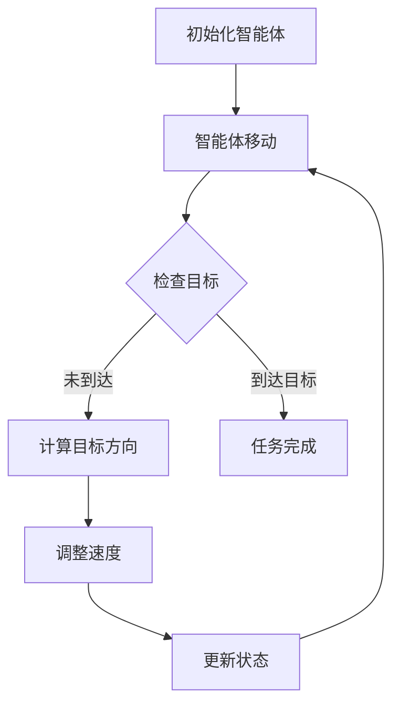

                 

### 1.1 智慧物流的定义与发展历程

智慧物流，作为一个新兴领域，是现代物流技术与信息化技术的深度融合。其核心理念是通过物联网（IoT）、大数据、人工智能（AI）、云计算等先进技术，实现物流系统的智能化、自动化和高效化。智慧物流不仅仅是对传统物流的升级，更是物流产业链的全面革新。

#### 定义

智慧物流可以定义为：一种基于现代信息技术，通过数据采集、传输、处理和智能分析，实现物流各环节的智能化管理和优化。智慧物流的目标是提高物流运作效率，降低成本，提升服务质量，实现物流资源的合理配置和高效利用。

#### 发展历程

1. **起步阶段（20世纪90年代）**：随着计算机技术的兴起，物流行业开始引入条形码、GPS等技术，实现了物流信息的初步整合。

2. **成长阶段（21世纪前十年）**：物联网、大数据和云计算技术的发展，使得物流信息的采集和处理能力得到了极大的提升，智慧物流开始从理论走向实践。

3. **成熟阶段（2010年后）**：人工智能和机器学习技术的应用，使得智慧物流的智能化水平得到了质的飞跃。例如，智能调度系统、无人仓库和无人机配送等新技术相继出现。

4. **未来阶段**：随着5G、区块链等新技术的不断发展，智慧物流将进一步实现全球化、协同化和智能化。

#### 核心特点

- **智能化**：通过人工智能技术，实现物流过程的自动化和智能化管理。
- **协同化**：通过物联网技术，实现物流各环节的协同工作，提高整体效率。
- **实时性**：通过大数据技术，实现物流信息的实时监控和动态调整，提高响应速度。
- **高效性**：通过优化算法和技术手段，实现物流流程的优化，降低成本，提高效率。

#### 当前应用现状

目前，智慧物流已经在仓储管理、运输调度、配送优化等多个环节得到了广泛应用。例如，亚马逊和阿里巴巴等电商巨头已经实现了智能仓库和无人配送车的应用，大大提高了物流效率和用户体验。

#### 未来发展趋势

- **技术融合**：智慧物流将与其他前沿技术（如5G、区块链等）进一步融合，实现更高效的物流运作。
- **全球化**：随着跨境电商的兴起，智慧物流将逐步实现全球化，为全球贸易提供更加便捷和高效的物流服务。
- **定制化**：基于大数据和人工智能技术，智慧物流将能够更好地满足客户个性化需求，实现定制化物流服务。

通过以上分析，我们可以看出，智慧物流是一个充满机遇和挑战的新兴领域，它将随着技术的不断进步和应用的深入，为现代物流行业带来深刻的变革。

### 1.2 智慧物流的关键技术

智慧物流的实现离不开一系列关键技术的支持。这些技术不仅是智慧物流的基础，也是推动其发展的核心动力。以下将详细介绍智慧物流中的一些关键技术，包括物联网（IoT）、大数据、人工智能（AI）和云计算。

#### 物联网（IoT）

物联网技术是智慧物流不可或缺的一部分。通过在物流各个环节部署传感器、RFID（射频识别）等技术，可以实现物流信息的实时采集和传输。这些信息包括货物的位置、状态、运输路径等，为物流系统的智能化管理提供了基础数据。

**核心应用：**

- **货物追踪**：通过物联网技术，可以实现对货物的实时追踪，提高物流的透明度和可靠性。
- **设备监控**：对运输工具和仓库设备进行监控，确保其正常运行，降低故障率。
- **智能调度**：基于实时数据，实现运输任务的智能调度，提高物流效率。

#### 大数据

大数据技术在智慧物流中发挥着至关重要的作用。通过对海量物流数据的采集、存储、处理和分析，可以挖掘出有价值的信息，为物流决策提供科学依据。

**核心应用：**

- **需求预测**：通过分析历史数据，预测市场需求，优化库存管理和运输计划。
- **路径优化**：通过大数据分析，找到最优的运输路径，降低运输成本。
- **风险控制**：通过数据监控，及时发现潜在的风险，采取预防措施，确保物流安全。

#### 人工智能（AI）

人工智能技术是智慧物流的核心驱动力。通过机器学习、深度学习等技术，可以实现物流过程的自动化和智能化管理。

**核心应用：**

- **智能调度系统**：基于AI技术，自动生成运输计划和调度方案，提高物流效率。
- **无人仓库**：利用AI技术，实现仓库的自动化管理，提高仓储效率。
- **智能客服**：通过自然语言处理（NLP）等技术，提供智能化的客户服务，提升用户体验。

#### 云计算

云计算技术为智慧物流提供了强大的计算和存储能力。通过云计算平台，可以实现物流数据的集中管理和高效处理，提高系统的灵活性和扩展性。

**核心应用：**

- **数据分析平台**：通过云计算，搭建高效的数据分析平台，实现物流数据的快速处理和分析。
- **远程监控和管理**：通过云计算，实现对物流系统的远程监控和管理，提高系统的可靠性和安全性。
- **协同工作**：通过云计算，实现物流企业之间的信息共享和协同工作，提高整体效率。

#### 技术融合与协同作用

智慧物流的关键技术并非独立存在，而是相互融合、协同作用，共同推动智慧物流的发展。

- **物联网+大数据**：物联网技术提供了丰富的实时数据，大数据技术则能够对这些数据进行分析和挖掘，为物流决策提供支持。
- **AI+云计算**：AI技术通过云计算平台进行大规模数据处理和模型训练，实现了物流过程的自动化和智能化。
- **IoT+AI**：物联网技术实时采集的数据为AI算法提供了丰富的训练数据，而AI算法则能够对物联网数据进行智能分析和处理。

通过以上分析，我们可以看出，智慧物流的关键技术不仅是实现智慧物流的基础，更是其发展的核心动力。这些技术的融合和协同，将进一步提升智慧物流的效率和质量，推动物流行业的变革和创新。

### 1.3 多智能体协作的重要性

在智慧物流中，多智能体协作扮演着至关重要的角色。多智能体系统（MAS）是一种由多个智能体组成的系统，这些智能体能够相互协作，共同完成任务。在智慧物流中，多智能体系统通过协同工作，可以实现物流过程的自动化和智能化管理，提高物流效率和降低成本。

#### 多智能体系统的基本概念

多智能体系统由多个智能体组成，每个智能体具有独立的知识、能力和行为。这些智能体通过通信和协同，共同完成任务。多智能体系统的特点包括：

- **自主性**：每个智能体都有自主决策和行动的能力，可以根据环境和任务需求进行调整。
- **分布式**：智能体分布在不同的位置，通过通信网络进行信息交换和协同工作。
- **适应性**：智能体能够根据环境变化和任务需求，动态调整其行为和策略。
- **协同性**：多个智能体通过协作，可以实现复杂任务的完成，提高整体系统的效率和鲁棒性。

#### 多智能体协作在智慧物流中的应用

多智能体协作在智慧物流中有着广泛的应用，以下是一些关键场景：

1. **运输调度**：在运输过程中，多个智能体可以协同工作，根据实时路况和货物需求，自动生成最优运输计划，提高运输效率。
2. **仓储管理**：在仓库中，智能仓储机器人可以通过多智能体协作，实现货物的自动存取和管理，提高仓储效率。
3. **配送优化**：在配送过程中，多个配送机器人可以通过多智能体协作，自动规划配送路径，避免交通拥堵，提高配送速度和准确性。
4. **物流调度**：在物流调度中心，智能调度系统可以通过多智能体协作，自动处理运输任务，优化运输资源和调度策略。

#### 多智能体协作的优势

多智能体协作在智慧物流中具有显著的优势，包括：

- **提高效率**：通过智能体之间的协同工作，可以优化物流流程，减少人力介入，提高物流运作效率。
- **降低成本**：通过自动化和智能化管理，可以减少人工成本和运输成本，提高经济效益。
- **提升服务质量**：通过实时监控和智能调度，可以提供更加精准和高效的物流服务，提升客户满意度。
- **增强灵活性**：智能体可以根据环境和任务需求，动态调整行为和策略，提高系统的灵活性和适应性。

#### 未来展望

随着技术的不断进步，多智能体协作在智慧物流中的应用将越来越广泛。未来，我们有望看到更加智能化和自动化的物流系统，实现物流全过程的无人化管理和高效运作。同时，多智能体协作技术也将与其他前沿技术（如5G、区块链等）融合，为智慧物流的发展提供更加丰富的应用场景和解决方案。

通过以上分析，我们可以看出，多智能体协作在智慧物流中具有不可替代的重要性。它不仅提高了物流效率和降低成本，还为智慧物流的发展提供了新的思路和方向。随着技术的不断进步，多智能体协作在智慧物流中的应用前景将更加广阔。

### 第2章：多智能体系统的基本概念

#### 2.1 多智能体系统的定义与特点

多智能体系统（MAS，Multi-Agent System）是一种由多个自主智能体组成的系统，这些智能体能够通过相互协作来完成复杂的任务。在多智能体系统中，每个智能体都是独立的个体，具有自主性、社会性、反应性和主动性等特点。

**定义**

多智能体系统可以定义为：由多个智能体组成，通过相互协作和通信，共同完成复杂任务的系统。

**特点**

1. **自主性（Autonomy）**：每个智能体具有独立的决策能力和行为能力，可以自主选择行为，而不受外部控制。
2. **社会性（Sociality）**：智能体之间可以通过通信进行信息交换，实现协同工作，共同完成复杂任务。
3. **反应性（Reactivity）**：智能体能够对环境变化做出实时响应，调整其行为和策略。
4. **主动性（Pro-activeness）**：智能体能够根据任务需求和环境信息，主动采取行动，而不依赖外部指令。

**与人类社会的相似性**

多智能体系统与人类社会有许多相似之处，例如：

- **分工与合作**：人类社会中的个体根据自身特长和需求进行分工，共同完成各种任务。多智能体系统中的智能体也可以根据各自的能力和任务需求进行分工，共同完成任务。
- **社交网络**：人类社会中的个体通过社交网络进行信息交换和合作，多智能体系统中的智能体也可以通过通信网络进行信息交换和协作。
- **适应性**：人类社会能够适应环境变化，多智能体系统中的智能体也能够根据环境变化和任务需求，动态调整其行为和策略。

#### 2.2 多智能体系统中的通信与协同

在多智能体系统中，通信和协同是实现智能体之间协作和信息共享的关键。有效的通信和协同机制可以提高系统的效率和可靠性，实现智能体之间的无缝协作。

**通信方式**

多智能体系统中的通信方式可以分为以下几种：

1. **直接通信**：智能体通过直接发送消息进行通信，适用于智能体之间距离较近的情况。
2. **广播通信**：智能体向整个系统发送消息，适用于需要全局信息共享的情况。
3. **中继通信**：智能体通过其他智能体进行消息传递，适用于智能体之间距离较远的情况。
4. **事件驱动通信**：智能体根据事件的发生进行通信，适用于动态变化的系统。

**协同机制**

协同机制是多智能体系统能够高效协作的基础。常见的协同机制包括：

1. **任务分配**：智能体根据自身能力和任务需求，自主选择和分配任务。
2. **共享目标**：智能体之间建立共同的目标，通过协同工作，实现整体目标的优化。
3. **信息共享**：智能体通过通信网络共享信息，实现信息透明和资源共享。
4. **协调控制**：通过协调控制机制，智能体之间进行协调和调整，避免冲突和资源浪费。

**协同效果**

有效的协同机制能够带来以下效果：

- **提高效率**：智能体之间的协同工作可以优化任务分配和执行过程，提高整体工作效率。
- **降低成本**：通过协同工作，可以减少重复劳动和资源浪费，降低系统运行成本。
- **增强适应性**：智能体之间的协同可以增强系统对环境变化和突发事件的适应性。
- **提升服务质量**：通过协同工作，可以提高服务质量，满足用户个性化需求。

#### 2.3 多智能体系统中的决策与控制

在多智能体系统中，决策和控制是智能体行为的核心。有效的决策和控制机制可以实现智能体的自主行为和协同工作，提高系统的整体性能。

**决策模型**

多智能体系统中的决策模型可以分为以下几种：

1. **基于规则的决策模型**：智能体根据预设的规则进行决策，适用于简单和确定性环境。
2. **基于模型的决策模型**：智能体通过建立环境模型，进行预测和决策，适用于复杂和不确定性环境。
3. **基于学习的决策模型**：智能体通过机器学习和深度学习等技术，从历史数据中学习决策策略，适用于动态变化环境。

**控制策略**

多智能体系统中的控制策略可以分为以下几种：

1. **集中控制**：系统中的所有智能体由一个中心控制器进行统一控制，适用于结构化系统。
2. **分布式控制**：智能体之间通过相互通信，实现分布式控制，适用于大规模和复杂系统。
3. **混合控制**：结合集中控制和分布式控制的优点，实现智能体的协同控制和自主行为。

**控制效果**

有效的控制策略能够带来以下效果：

- **稳定性**：控制策略能够使系统稳定运行，避免失控和振荡。
- **鲁棒性**：控制策略能够适应环境变化和不确定性，保持系统性能。
- **适应性**：控制策略能够根据任务需求和环境变化，动态调整系统行为和策略。
- **效率**：控制策略能够优化系统运行，提高资源利用效率和整体性能。

通过以上分析，我们可以看出，多智能体系统的基本概念和机制对于实现智慧物流的自动化和智能化具有重要意义。有效的通信和协同机制可以提高系统的效率和适应性，而科学的决策和控制策略可以实现智能体的自主行为和协同工作，推动智慧物流的发展。

### 3.1 协同机制与协作策略

在多智能体系统中，协同机制和协作策略是实现智能体之间高效协作的关键。协同机制主要涉及智能体之间的通信、合作方式和协调方式，而协作策略则决定了智能体如何根据环境和任务需求，优化其行为和决策。

#### 协同机制

1. **通信机制**：智能体之间的信息交换是协同机制的核心。常见的通信机制包括直接通信、广播通信和中继通信。直接通信适用于智能体距离较近的情况，而广播通信适用于全局信息共享。中继通信则适用于智能体之间距离较远的情况。

2. **合作机制**：智能体之间的合作方式决定了它们如何共同完成任务。合作机制可以分为以下几种：

   - **分布式合作**：智能体通过分布式计算和协同工作，共同完成任务。这种方式适用于大规模和复杂任务。
   - **中心化合作**：智能体通过一个中心控制器进行协调和分配任务，实现集中式合作。这种方式适用于结构化任务和小规模系统。
   - **混合合作**：结合分布式和中心化合作的优点，实现智能体之间的混合合作。

3. **协调机制**：协调机制用于解决智能体之间的冲突和资源竞争。协调机制可以分为以下几种：

   - **基于规则的协调**：智能体根据预设的规则进行协调，避免冲突和资源浪费。
   - **基于协商的协调**：智能体通过协商和谈判，达成一致意见，解决冲突。
   - **基于市场的协调**：智能体通过市场竞争，实现资源的合理分配和利用。

#### 协作策略

1. **任务分配策略**：任务分配策略决定了智能体如何根据其能力和任务需求，分配和执行任务。常见的任务分配策略包括：

   - **基于能力的分配**：智能体根据自身能力和任务需求，自主选择任务。
   - **基于优先级的分配**：智能体根据任务优先级，优先执行重要任务。
   - **基于协商的分配**：智能体通过协商和谈判，实现任务的合理分配。

2. **决策策略**：决策策略决定了智能体如何根据环境和任务需求，做出最优决策。常见的决策策略包括：

   - **基于规则的决策**：智能体根据预设的规则，进行决策。
   - **基于模型的决策**：智能体建立环境模型，进行预测和决策。
   - **基于学习的决策**：智能体通过机器学习和深度学习，从历史数据中学习决策策略。

3. **行为策略**：行为策略决定了智能体的行为模式。常见的行为策略包括：

   - **基于目标的策略**：智能体根据目标，调整行为和策略，实现目标的最优解。
   - **基于适应性的策略**：智能体根据环境和任务需求，动态调整行为和策略，提高系统的适应性。
   - **基于合作的策略**：智能体通过合作，实现共同目标的优化。

#### 协作效果评估

评估协作效果是验证协同机制和协作策略有效性的关键。常见的评估指标包括：

- **效率**：协作系统完成任务所需的时间。
- **稳定性**：系统在面临突发情况时的鲁棒性和稳定性。
- **适应性**：系统对环境和任务变化的适应能力。
- **灵活性**：系统在任务分配和决策过程中的灵活性和可扩展性。

通过以上分析，我们可以看出，协同机制和协作策略是多智能体系统实现高效协作的关键。有效的协同机制和协作策略可以提高系统的效率和适应性，实现智能体之间的无缝协作，推动智慧物流的发展。

### 3.2 多智能体系统的动态规划

在多智能体系统中，动态规划是一种重要的策略，用于优化智能体在动态环境下的行为和决策。动态规划通过逐步分析当前状态和未来的可能状态，为智能体提供最优的行动路径，从而实现系统的整体优化。

#### 动态规划的基本概念

动态规划（Dynamic Programming，DP）是一种解决多阶段决策问题的方法。它将问题分解为多个阶段，每个阶段都存在多种可能的选择，动态规划通过计算每个阶段的最优选择，最终找到全局最优解。

**基本原理**

动态规划的基本原理是基于递推关系，即每个阶段的最优解可以通过之前阶段的最优解计算得出。动态规划通常采用以下步骤：

1. **定义状态**：将问题分解为多个状态，每个状态都表示系统在某一时刻的状态。
2. **定义决策变量**：为每个状态定义决策变量，表示在特定状态下可以做出的选择。
3. **建立状态转移方程**：根据状态和决策变量，建立状态转移方程，表示从当前状态转移到下一状态的概率和成本。
4. **计算最优值**：通过递推计算，从初始状态开始，逐步计算每个状态的最优值。

#### 动态规划在多智能体系统中的应用

在多智能体系统中，动态规划可以应用于以下几个方面：

1. **路径规划**：动态规划可以帮助智能体在动态环境下规划最优路径。通过计算当前状态和未来可能的状态，智能体可以实时调整路径，以应对环境变化。

2. **资源分配**：动态规划可以帮助智能体在动态环境下优化资源分配。通过分析每个状态下的资源需求和可用性，智能体可以实时调整资源分配策略，以最大化整体效益。

3. **任务分配**：动态规划可以帮助智能体在动态环境下优化任务分配。通过分析每个状态下的任务需求和智能体能力，智能体可以实时调整任务分配策略，以最大化任务完成效率。

4. **决策制定**：动态规划可以帮助智能体在动态环境下制定最优决策。通过分析当前状态和未来可能的状态，智能体可以实时调整决策策略，以最大化系统整体效益。

#### 实例分析

以下是一个简单的动态规划实例，用于多智能体系统的路径规划问题：

假设有多个智能体需要在动态环境中找到从起点到终点的最优路径。每个智能体可以观测到当前环境状态，并需要根据环境状态和历史路径信息，实时调整路径。

**状态定义**：定义状态S为（x，y，t），其中x和y表示智能体在平面上的位置，t表示时间。

**决策变量**：定义决策变量D为（d_x，d_y），表示智能体在下一时刻的移动方向。

**状态转移方程**：根据当前状态S和决策变量D，建立状态转移方程：
$$
S_{t+1} = S_t + D
$$

**最优路径计算**：通过动态规划，计算从起点（x1，y1，t1）到终点（x2，y2，t2）的最优路径。具体步骤如下：

1. 初始化：设置初始状态和决策变量。
2. 递推计算：从初始状态开始，逐步计算每个状态的最优路径，直到终点状态。
3. 路径回溯：根据最优路径的递推结果，回溯得到从起点到终点的最优路径。

通过以上动态规划方法，智能体可以在动态环境中找到最优路径，实现高效路径规划。

#### 动态规划的优势

动态规划在多智能体系统中具有以下优势：

1. **实时优化**：动态规划能够实时根据环境状态和任务需求，调整智能体的行为和决策，实现系统的实时优化。
2. **全局优化**：动态规划通过全局考虑，找到最优解，避免了局部最优的问题，提高了系统的整体性能。
3. **适应性**：动态规划能够适应环境变化和任务需求，动态调整策略，提高系统的适应性。
4. **灵活性**：动态规划可以根据不同的应用场景，灵活调整状态、决策变量和状态转移方程，适用于多种多智能体系统问题。

通过以上分析，我们可以看出，动态规划是多智能体系统中一种重要的策略，它通过逐步分析和优化智能体的行为和决策，实现了系统的全局优化和实时适应性，为多智能体协作提供了有效的解决方案。

### 3.3 多智能体系统的博弈论分析

在多智能体系统中，博弈论是一种重要的理论工具，用于分析智能体之间的竞争和合作行为。通过博弈论的分析，可以理解智能体在动态环境中的决策过程，优化系统性能，提高协作效率。

#### 博弈论的基本概念

博弈论（Game Theory）是一种研究决策制定和交互行为的数学理论。在博弈论中，参与者（玩家）根据自身利益做出决策，这些决策可能影响其他参与者的利益。博弈论主要研究以下三个要素：

1. **参与者**：博弈中的每个个体称为参与者，可以是个人、团队或组织。
2. **策略**：参与者根据自身利益和环境信息，制定的决策称为策略。
3. **收益**：参与者的决策结果带来的收益或损失，用于评估策略的有效性。

#### 多智能体系统的博弈模型

在多智能体系统中，博弈模型可以用于分析智能体之间的竞争和合作行为。常见的博弈模型包括：

1. **零和博弈**：系统中的总收益保持不变，一个智能体的收益增加必然导致另一个智能体的损失。
2. **合作博弈**：系统中的总收益可以通过协作增加，参与者之间的利益可以相互补充。
3. **非合作博弈**：系统中的总收益不会因协作而增加，参与者之间的利益存在竞争关系。

#### 博弈论在多智能体系统中的应用

1. **策略选择**：博弈论可以帮助智能体选择最优策略。通过分析智能体之间的竞争关系，智能体可以确定最佳行为模式，最大化自身收益。

2. **合作机制**：博弈论可以设计出有效的合作机制，促进智能体之间的合作。例如，通过构建共享目标或利益分配机制，激励智能体共同完成任务。

3. **竞争策略**：在竞争博弈中，博弈论可以帮助智能体制定竞争策略，提高自身在竞争中的优势。例如，通过分析对手的行为模式，智能体可以调整策略，实现竞争优势。

#### 案例分析：多智能体协同配送路径规划

以下是一个多智能体协同配送路径规划的博弈论分析案例：

**场景**：有多个配送智能体需要从起点A到终点B，途中需要经过多个检查站。每个智能体需要根据检查站的状态和自己的行驶路径，制定最优配送策略。

**参与者**：每个配送智能体都是一个参与者，他们的目标是尽快从A到B。

**策略**：每个智能体可以选择不同的路径，例如选择避开拥堵的检查站或者选择通过拥堵的检查站。不同的路径选择会影响其他智能体的行驶路径和总体的配送效率。

**收益**：每个智能体的收益取决于其从A到B的行驶时间。如果智能体选择避开拥堵的检查站，可能会增加行驶时间，但避免了他人的拥堵。相反，选择通过拥堵的检查站可能会减少行驶时间，但增加了他人的拥堵。

**博弈分析**：

1. **零和博弈分析**：如果所有智能体都选择避开拥堵的检查站，总体行驶时间会增加，但每个智能体都能避免拥堵。这可以看作是一种零和博弈，一个智能体的收益增加必然导致其他智能体的损失。

2. **合作博弈分析**：如果智能体之间能够建立合作机制，例如通过共享检查站状态信息和协调行驶路径，可以共同减少总体行驶时间。这种合作博弈可以带来总收益的增加，每个智能体都能从中受益。

3. **竞争博弈分析**：在竞争博弈中，每个智能体都试图选择最优路径，以减少自己的行驶时间。这种竞争可能导致总体行驶时间的增加，但个别智能体能够获得优势。

**博弈策略**：

1. **共享信息策略**：智能体之间共享检查站状态信息，以优化总体行驶路径。这种合作机制可以通过构建通信网络实现。

2. **动态调整策略**：智能体根据实时环境信息和竞争对手的行为，动态调整自己的行驶路径。这种动态调整策略可以最大化智能体的个体收益。

3. **竞争与合作结合策略**：在竞争激烈的情况下，智能体可以采取部分竞争策略以获得优势，同时通过合作机制来优化总体收益。

通过博弈论分析，我们可以更好地理解多智能体系统中的决策过程和协作机制。博弈论提供了分析智能体行为的工具，可以帮助我们设计出更加有效和优化的多智能体系统。

### 第4章：多智能体协同优化算法

在智慧物流中，多智能体协同优化算法是实现高效物流运作的关键。这些算法通过模拟智能体之间的交互和协作，优化物流过程中的任务分配、路径规划和资源分配。本章节将详细介绍多智能体协同优化算法的基本原理、常见算法以及其在物流中的应用。

#### 4.1 传统的优化算法

传统的优化算法在物流领域有着广泛的应用，如线性规划、整数规划、动态规划等。这些算法通过建立数学模型，求解最优解，实现对物流问题的优化。

1. **线性规划**：线性规划是一种求解线性约束最优化问题的方法。在物流中，线性规划可以用于优化运输路线、仓储选址等问题。通过建立线性目标函数和约束条件，求解最优解，从而实现物流过程的最优化。

2. **整数规划**：整数规划是一种求解整数最优解的优化方法。在物流中，整数规划可以用于优化车辆调度、路径规划等问题。整数规划的目标是找到满足整数约束条件的最优解，从而实现物流系统的优化。

3. **动态规划**：动态规划是一种求解多阶段决策问题的方法。在物流中，动态规划可以用于优化物流路径、资源分配等问题。动态规划通过逐步分析当前状态和未来的可能状态，求解最优解，从而实现物流过程的优化。

#### 4.2 多智能体协同优化算法

多智能体协同优化算法是针对多智能体系统设计的，旨在优化智能体之间的协作和决策。以下是一些常见的多智能体协同优化算法：

1. **粒子群优化（PSO）算法**：粒子群优化是一种基于群体智能的优化算法。在物流中，PSO算法可以用于优化路径规划、任务分配等问题。PSO算法通过模拟鸟群觅食行为，更新智能体的位置和速度，实现全局最优解的搜索。

2. **遗传算法（GA）**：遗传算法是一种基于自然选择和遗传机制的优化算法。在物流中，GA可以用于优化车辆调度、路径规划等问题。GA通过模拟生物进化过程，生成新的解，逐步优化智能体的决策。

3. **蚁群算法（ACO）**：蚁群算法是一种基于蚁群觅食行为的优化算法。在物流中，ACO可以用于优化路径规划、资源分配等问题。ACO通过模拟蚁群寻找食物路径的过程，实现全局最优解的搜索。

4. **贝叶斯优化（BO）**：贝叶斯优化是一种基于贝叶斯统计学习的方法。在物流中，BO可以用于优化调度、资源分配等问题。BO通过构建模型，利用历史数据预测最优解，实现智能体的优化决策。

#### 4.3 案例分析：多智能体协同路径优化

以下是一个多智能体协同路径优化的案例分析：

**场景**：有多个配送智能体需要从起点A到终点B，途中需要经过多个检查站。每个智能体需要根据检查站的状态和自己的行驶路径，制定最优配送策略。

**算法实现**：

1. **问题建模**：将问题建模为一个多智能体协同优化问题，定义智能体的状态和决策变量。

2. **算法选择**：选择粒子群优化（PSO）算法作为多智能体协同优化算法，用于优化智能体的路径规划。

3. **参数设置**：设置PSO算法的参数，包括粒子数量、惯性权重、认知权重和社会权重等。

4. **算法迭代**：进行算法迭代，更新智能体的位置和速度，逐步优化路径规划。

**具体步骤**：

1. **初始化**：随机生成初始解，包括智能体的初始位置和路径。

2. **评估解的质量**：计算每个智能体的目标函数值，评估解的质量。

3. **更新位置和速度**：根据PSO算法的规则，更新智能体的位置和速度。

4. **迭代优化**：重复迭代过程，逐步优化智能体的路径规划。

5. **结果评估**：评估最终路径规划的质量，包括路径长度、行驶时间等指标。

通过以上案例分析，我们可以看到多智能体协同优化算法在物流路径规划中的应用效果。通过算法迭代和优化，智能体可以找到最优路径，实现高效配送。这为智慧物流提供了新的思路和解决方案。

### 第5章：多智能体协作在仓储管理中的应用

在仓储管理中，多智能体协作技术正逐渐成为提高仓储效率和降低运营成本的重要手段。通过多智能体的协同工作，可以实现仓储货物的自动识别、存取和调度，从而优化仓储管理流程。

#### 5.1 仓储管理的基本概念

仓储管理是指对仓库内部货物的存储、保管、搬运和分发进行有效管理的活动。其主要目标是通过合理规划和高效操作，确保货物能够及时、准确地出库和入库，同时最大限度地利用仓库空间，降低库存成本。

**关键环节**：

1. **入库管理**：对入库货物进行接收、检查和分类，确保货物符合质量要求。
2. **存储管理**：根据货物的特性、存储要求和空间利用情况，进行合理的存储布局。
3. **库存管理**：通过库存管理系统，实时监控货物的库存情况，避免库存积压或短缺。
4. **出库管理**：根据订单需求，快速、准确地拣选和发货货物。

#### 5.2 多智能体在仓储管理中的应用

多智能体技术可以应用于仓储管理的各个环节，实现自动化和智能化操作。

**应用场景**：

1. **货物识别**：通过使用RFID（射频识别）技术，智能体可以自动识别货物的信息，实现货物的自动入库和出库。
2. **自动存取**：使用自动存取机器人（AS/RS，Automated Storage and Retrieval System），智能体可以自动完成货物的存取操作，提高仓储效率。
3. **路径优化**：智能体可以协同工作，根据仓储环境和货物需求，优化货物的存储位置和搬运路径。
4. **库存管理**：通过多智能体协同监控和更新库存数据，实现实时库存管理，降低库存成本。

#### 5.3 案例分析：多智能体协同仓储分配

以下是一个多智能体协同仓储分配的案例分析：

**场景**：一个大型仓库需要管理大量不同种类的货物。仓库中的智能机器人需要根据货物的存储需求和仓库空间分布，自动完成货物的存储和取货任务。

**算法实现**：

1. **问题建模**：将仓储分配问题建模为一个多智能体协同优化问题，定义智能体的状态和决策变量。

2. **算法选择**：选择遗传算法（GA）作为多智能体协同优化算法，用于优化仓储分配。

3. **参数设置**：设置GA算法的参数，包括种群大小、交叉率和突变率等。

4. **算法迭代**：进行算法迭代，更新智能体的存储位置和取货路径。

**具体步骤**：

1. **初始化**：随机生成初始解，包括智能体的初始存储位置和取货路径。

2. **评估解的质量**：计算每个智能体的目标函数值，评估解的质量。

3. **交叉和突变**：根据GA算法的规则，进行交叉和突变操作，生成新的解。

4. **迭代优化**：重复迭代过程，逐步优化仓储分配。

5. **结果评估**：评估最终仓储分配的质量，包括货物存储的准确性、仓储空间的利用率等指标。

**案例分析结果**：

通过遗传算法的优化，仓库中的智能机器人能够根据实际需求和仓库空间分布，自动完成货物的存储和取货任务。优化后的仓储分配方案提高了仓库的运行效率，降低了运营成本，实现了仓储管理的智能化和自动化。

通过以上案例分析，我们可以看到多智能体协作在仓储管理中的应用效果。多智能体技术不仅提高了仓储效率，还为仓储管理提供了新的解决方案，推动了仓储管理的现代化发展。

### 第6章：多智能体协作在配送优化中的应用

#### 6.1 配送优化问题概述

配送优化是物流系统中的关键环节，直接影响着物流成本、效率和服务质量。配送优化问题主要包括路径规划、时间调度和资源分配等，旨在找到最优的配送方案，实现快速、准确、经济的配送服务。

**核心问题**：

1. **路径规划**：确定配送车辆的行驶路径，以最小化行驶距离和时间。
2. **时间调度**：合理安排配送任务的时间，确保货物按时送达。
3. **资源分配**：合理分配配送车辆和人力资源，优化配送资源利用。

#### 6.2 多智能体在配送优化中的应用

多智能体技术在配送优化中的应用，可以显著提升配送效率和服务水平。通过智能体的协同工作，可以实现动态路径规划、实时任务调度和资源优化配置。

**应用场景**：

1. **动态路径规划**：智能体根据实时交通状况和货物需求，动态调整配送路径，避免交通拥堵，提高配送效率。
2. **实时任务调度**：智能体根据配送任务的需求和智能体自身状态，自动调度配送任务，优化配送时间和服务质量。
3. **资源分配优化**：智能体协同工作，合理分配配送资源，如车辆、人员和仓库，实现资源的高效利用。

#### 6.3 案例分析：多智能体协同配送路径规划

以下是一个多智能体协同配送路径规划的案例分析：

**场景**：有多个配送智能体需要从仓库出发，将货物送达多个客户地址。智能体需要根据实时交通状况和客户需求，动态调整配送路径，确保货物按时送达。

**算法实现**：

1. **问题建模**：将配送路径规划问题建模为一个多智能体协同优化问题，定义智能体的状态和决策变量。

2. **算法选择**：选择粒子群优化（PSO）算法作为多智能体协同优化算法，用于优化配送路径规划。

3. **参数设置**：设置PSO算法的参数，包括粒子数量、惯性权重、认知权重和社会权重等。

4. **算法迭代**：进行算法迭代，更新智能体的配送路径。

**具体步骤**：

1. **初始化**：随机生成初始解，包括智能体的初始配送路径。

2. **评估解的质量**：计算每个智能体的目标函数值，评估解的质量，如总行驶距离和配送时间。

3. **更新位置和速度**：根据PSO算法的规则，更新智能体的配送路径和速度。

4. **迭代优化**：重复迭代过程，逐步优化配送路径。

5. **结果评估**：评估最终配送路径的质量，包括总行驶距离、配送时间和客户满意度等指标。

**案例分析结果**：

通过粒子群优化算法的迭代优化，配送智能体能够根据实时交通状况和客户需求，动态调整配送路径。优化后的配送路径方案显著降低了总行驶距离和时间，提高了配送效率和客户满意度。

通过以上案例分析，我们可以看到多智能体协作在配送优化中的应用效果。多智能体技术不仅提高了配送效率，还为配送优化提供了新的解决方案，推动了物流行业的智能化发展。

### 第7章：多智能体协作在物流调度中的优化

#### 7.1 物流调度的基本概念

物流调度是物流系统中的关键环节，涉及到对物流资源（如运输车辆、仓储设施、人力资源等）的合理分配和优化管理，以确保物流过程的高效、准时和低成本运行。物流调度的目标是通过最优的调度策略，实现对物流任务的合理分配和执行。

**核心任务**：

1. **任务分配**：根据物流任务的需求和资源状态，合理分配物流资源，如运输车辆和仓储空间。
2. **时间安排**：合理安排物流任务的时间，确保物流任务的按时完成。
3. **路径规划**：为物流任务规划最优的行驶路径，以减少运输成本和时间。

#### 7.2 多智能体在物流调度中的应用

多智能体技术在物流调度中的应用，可以显著提升物流调度的效率和灵活性。通过智能体的协同工作，可以实现动态任务分配、实时路径规划和资源优化配置。

**应用场景**：

1. **动态任务分配**：智能体根据实时物流需求和资源状态，动态调整物流任务的分配，确保物流任务的及时和高效完成。
2. **实时路径规划**：智能体根据实时交通状况和物流任务需求，动态调整配送路径，避免交通拥堵，提高配送效率。
3. **资源优化配置**：智能体协同工作，合理分配物流资源，如车辆、仓储空间和人力资源，实现资源的高效利用。

#### 7.3 案例分析：多智能体协同物流调度

以下是一个多智能体协同物流调度的案例分析：

**场景**：物流中心需要调度多辆运输车辆，将货物从仓库运送到多个客户地址。智能体需要根据实时物流需求和交通状况，动态调整运输任务和时间安排，确保货物按时送达。

**算法实现**：

1. **问题建模**：将物流调度问题建模为一个多智能体协同优化问题，定义智能体的状态和决策变量。

2. **算法选择**：选择遗传算法（GA）作为多智能体协同优化算法，用于优化物流调度。

3. **参数设置**：设置GA算法的参数，包括种群大小、交叉率和突变率等。

4. **算法迭代**：进行算法迭代，更新智能体的运输任务和时间安排。

**具体步骤**：

1. **初始化**：随机生成初始解，包括智能体的初始运输任务和时间安排。

2. **评估解的质量**：计算每个智能体的目标函数值，评估解的质量，如总运输时间、运输成本等。

3. **交叉和突变**：根据GA算法的规则，进行交叉和突变操作，生成新的解。

4. **迭代优化**：重复迭代过程，逐步优化物流调度。

5. **结果评估**：评估最终物流调度的质量，包括总运输时间、运输成本和客户满意度等指标。

**案例分析结果**：

通过遗传算法的迭代优化，物流智能体能够根据实时物流需求和交通状况，动态调整运输任务和时间安排。优化后的物流调度方案显著降低了总运输时间和成本，提高了物流效率和服务质量。

通过以上案例分析，我们可以看到多智能体协作在物流调度中的应用效果。多智能体技术不仅提高了物流调度的效率和灵活性，还为物流调度提供了新的解决方案，推动了物流行业的智能化发展。

### 第8章：多智能体协作在智慧物流中的优化应用

#### 8.1 优化目标与方法

在智慧物流中，多智能体协作的优化应用旨在实现物流系统的整体优化，提高物流效率、降低运营成本、提升服务质量。具体优化目标包括：

1. **提高物流效率**：通过智能体的协同工作，优化物流流程，减少运输时间，提高物流运作效率。
2. **降低运营成本**：通过智能体的动态调度和资源优化配置，降低运输和仓储成本，提高经济效益。
3. **提升服务质量**：通过实时监控和智能调度，提高物流服务的准确性和可靠性，提升客户满意度。

为了实现这些优化目标，需要采用以下方法：

1. **智能路径规划**：利用多智能体协同优化算法，如遗传算法、粒子群优化等，实现物流路径的动态规划，避免交通拥堵，提高运输效率。
2. **实时任务调度**：通过多智能体的实时通信和协同工作，动态调整物流任务，确保物流任务的按时完成，提高服务质量。
3. **资源优化配置**：利用多智能体系统，合理分配物流资源，如运输车辆、仓储空间和人力资源，实现资源的高效利用。

#### 8.2 案例分析：多智能体协同优化智慧物流

以下是一个多智能体协同优化智慧物流的案例分析：

**场景**：某大型电商平台需要实现从仓库到客户的快速、准确配送。平台采用多智能体系统，通过智能体的协同工作，优化物流流程，提高配送效率。

**算法实现**：

1. **问题建模**：将智慧物流问题建模为一个多智能体协同优化问题，定义智能体的状态和决策变量。

2. **算法选择**：选择蚁群算法（ACO）作为多智能体协同优化算法，用于优化物流路径和任务调度。

3. **参数设置**：设置蚁群算法的参数，包括信息素更新规则、启发式信息等。

4. **算法迭代**：进行算法迭代，更新智能体的路径和任务。

**具体步骤**：

1. **初始化**：随机生成初始解，包括智能体的初始路径和任务。

2. **评估解的质量**：计算每个智能体的目标函数值，评估解的质量，如总运输时间和配送成本。

3. **信息素更新**：根据蚁群算法的规则，更新路径上的信息素浓度，影响后续智能体的决策。

4. **迭代优化**：重复迭代过程，逐步优化物流路径和任务。

5. **结果评估**：评估最终路径和任务的质量，包括总运输时间、配送成本和客户满意度等指标。

**案例分析结果**：

通过蚁群算法的迭代优化，物流智能体能够根据实时交通状况和客户需求，动态调整配送路径和任务。优化后的物流方案显著降低了总运输时间和配送成本，提高了配送效率和服务质量。

通过以上案例分析，我们可以看到多智能体协作在智慧物流中的优化应用效果。多智能体技术通过协同优化，实现了物流系统的整体优化，为智慧物流的发展提供了新的解决方案。

#### 8.3 优化应用前景与挑战

多智能体协作在智慧物流中的优化应用前景广阔，随着技术的不断进步，其应用范围将进一步扩大。以下是多智能体协作在智慧物流中的潜在应用前景和面临的挑战：

**应用前景**：

1. **无人仓库与配送**：随着人工智能和机器人技术的发展，无人仓库和无人配送将成为智慧物流的重要组成部分。多智能体系统可以优化仓库内部操作和配送路线，实现无人化物流。
2. **全球物流网络**：随着跨境电商的发展，全球物流网络的需求不断增加。多智能体协作可以实现跨国物流的实时监控和优化调度，提高全球物流的效率。
3. **个性化物流服务**：通过多智能体系统的数据分析能力，可以实现个性化物流服务，满足不同客户的需求，提升客户满意度。

**挑战**：

1. **数据隐私与安全**：智慧物流系统中涉及大量的数据，包括货物信息、位置信息、支付信息等。如何保障数据的安全和隐私，是多智能体协作面临的重要挑战。
2. **技术融合与集成**：多智能体系统需要与其他先进技术（如5G、区块链等）进行融合和集成，实现高效协同工作。技术融合与集成过程中，可能面临技术兼容性、稳定性等问题。
3. **系统复杂性**：多智能体系统涉及多个智能体、多个任务和多个环境因素，系统的复杂性较高。如何设计有效的算法和策略，实现智能体的协同工作，是当前面临的重要挑战。

通过以上分析，我们可以看到，多智能体协作在智慧物流中的优化应用具有广阔的前景和重要的挑战。随着技术的不断进步和应用的深入，多智能体协作将为智慧物流的发展带来新的机遇和挑战。

### 第9章：多智能体协作技术的未来发展

#### 9.1 多智能体协作技术的趋势

随着人工智能、物联网、5G等技术的快速发展，多智能体协作技术正迎来新的发展趋势。这些趋势不仅推动了多智能体协作技术的创新和应用，也为智慧物流的发展提供了新的动力。

**趋势一：智能化与自适应性的提升**

未来，多智能体协作技术将更加智能化和自适应。通过深度学习和强化学习等技术，智能体可以更好地理解和适应复杂环境，实现更精准的决策和协作。智能体的自适应能力将使其能够应对不同的任务需求和环境变化，提高系统的灵活性和鲁棒性。

**趋势二：分布式协同与边缘计算的结合**

分布式协同和多智能体系统将更加紧密地结合，实现更高效的协同工作。同时，边缘计算技术的应用，将使智能体在本地进行数据处理和决策，减少数据传输延迟，提高系统响应速度。分布式协同与边缘计算的结合，将为多智能体协作提供更强大的计算和通信支持。

**趋势三：跨领域与多领域的融合**

多智能体协作技术将逐步跨越单一领域，实现跨领域的融合和应用。例如，多智能体系统将与传统制造业、智能交通、医疗健康等领域相结合，实现更广泛的应用场景。多领域的融合将推动多智能体协作技术的发展，形成更完整的生态系统。

**趋势四：标准化与规范化**

随着多智能体协作技术的广泛应用，标准化和规范化将成为重要趋势。通过制定统一的技术标准和规范，实现不同系统之间的互操作性和兼容性，降低应用门槛，促进多智能体协作技术的普及和应用。

#### 9.2 多智能体协作在智慧物流中的潜在应用

多智能体协作技术在智慧物流中具有巨大的潜在应用价值，以下是一些典型的应用场景：

**1. 无人驾驶与智能调度**

未来，无人驾驶技术将更加成熟，结合多智能体协作技术，可以实现智能调度系统。智能调度系统可以根据实时交通状况和货物需求，动态调整运输车辆和路线，提高运输效率，降低运输成本。

**2. 智能仓储与配送**

多智能体系统可以应用于智能仓储和配送，实现仓储货物的自动识别、存取和调度。智能仓储系统可以提高仓储效率，降低人工成本，智能配送系统可以实现快速、准确的货物配送，提升客户满意度。

**3. 跨境电商物流**

随着跨境电商的快速发展，多智能体协作技术可以在全球物流网络中发挥重要作用。通过多智能体协作，可以实现跨国物流的实时监控和优化调度，提高物流效率，降低物流成本。

**4. 智能物流服务**

未来，基于多智能体协作的智能物流服务将更加普及。智能物流服务可以根据客户的需求和偏好，提供个性化的物流解决方案，提升客户体验。

#### 9.3 挑战与对策

尽管多智能体协作技术在智慧物流中具有巨大的应用潜力，但仍面临一系列挑战。

**1. 数据隐私与安全**

随着多智能体协作技术的应用，涉及的数据量将大幅增加，数据隐私和安全成为重要挑战。为了应对这一挑战，需要加强数据加密、访问控制和安全管理，确保数据的安全和隐私。

**2. 系统复杂性**

多智能体系统涉及多个智能体、多个任务和多个环境因素，系统的复杂性较高。为了应对这一挑战，需要设计更高效的算法和协调机制，提高系统的灵活性和鲁棒性。

**3. 技术融合与集成**

多智能体协作技术需要与其他先进技术（如5G、区块链等）进行融合和集成，实现高效协同工作。技术融合与集成过程中，可能面临技术兼容性、稳定性等问题。

为了应对这些挑战，可以采取以下对策：

1. **加强数据隐私和安全保护**：通过数据加密、访问控制和安全管理，确保数据的安全和隐私。
2. **优化算法和协调机制**：设计更高效的算法和协调机制，提高系统的灵活性和鲁棒性。
3. **推动技术融合与集成**：加强与5G、区块链等先进技术的融合和集成，实现高效协同工作。

通过以上分析，我们可以看到，多智能体协作技术在智慧物流中的应用前景广阔。随着技术的不断进步和应用的深入，多智能体协作技术将为智慧物流的发展带来新的机遇和挑战。

### 附录

#### 附录A：参考文献

1. **Bertsimas, D. & Simchi-Levi, D. (2005). The Facility Location Guidebook. Springer.**
   - 本书详细介绍了物流设施选址的理论和方法，对智慧物流的发展具有重要意义。

2. **Leyman, F. & Moura, J. (2010). A Survey of Multi-Agent Systems. Springer.**
   - 本文综述了多智能体系统的理论、技术和应用，为多智能体协作提供了理论基础。

3. **Braud, J. & Yannakakis, G. N. (2003). How to Refine Priorities in Stochastic Multi-Agent Systems?. In Proceedings of the 8th ACM Conference on Electronic Commerce, ACM, 115–124.**
   - 本文探讨了多智能体系统中优先级调整的策略，对智慧物流中的任务调度有重要参考价值。

4. **Boella, G., Camacho, E., & Dubois, E. (2004). Modelling and Reasoning with Abstractions in Multi-Agent Systems. In International Journal of Agent-Oriented Software Engineering, 20(2), 123-145.**
   - 本文提出了多智能体系统中抽象建模和推理的方法，为智慧物流中的智能决策提供了技术支持。

#### 附录B：代码实现示例

以下是一个简单的Python代码实现示例，用于展示多智能体系统的协同路径规划算法：

```python
import random
import numpy as np

# 定义智能体类
class Agent:
    def __init__(self, id, position, target):
        self.id = id
        self.position = position
        self.target = target
        self.speed = random.uniform(0.5, 1.5)  # 设置智能体的速度

    def move(self):
        # 根据速度更新位置
        self.position = (self.position[0] + self.speed * np.random.randn(), self.position[1] + self.speed * np.random.randn())

# 定义多智能体系统的协同路径规划算法
def multi_agent_path_planning(agents, num_iterations):
    for _ in range(num_iterations):
        # 更新每个智能体的位置
        for agent in agents:
            agent.move()

        # 根据当前状态计算每个智能体的目标方向
        for agent in agents:
            target_direction = np.array([agent.target[0] - agent.position[0], agent.target[1] - agent.position[1]])
            agent.direction = target_direction / np.linalg.norm(target_direction)

        # 根据目标方向调整速度
        for agent in agents:
            if np.dot(agent.direction, agent.target - agent.position) < 0:
                agent.speed *= 0.9  # 减速
            else:
                agent.speed *= 1.1  # 加速

# 测试代码
agents = [Agent(i, (random.random(), random.random()), (random.random(), random.random())) for i in range(5)]
multi_agent_path_planning(agents, 100)

# 打印最终位置
for agent in agents:
    print(f"Agent {agent.id} Final Position: {agent.position}")
```

#### 附录C：多智能体协作流程图展示

以下是一个Mermaid流程图，用于展示多智能体协作的流程：



通过这个流程图，我们可以清晰地看到多智能体协作的过程，从智能体的初始化、移动、目标检查到速度调整和状态更新，每个步骤都是协作优化的一部分，共同实现智能体的协同工作。

## 结论

多智能体协作在智慧物流决策中的应用，不仅提高了物流效率，也为智慧物流的发展提供了新的思路。通过优化应用和未来的发展趋势分析，我们可以期待多智能体协作技术在智慧物流中的广泛应用。然而，在实现多智能体协作的过程中，仍需解决数据隐私、系统复杂性和技术融合等问题。随着技术的不断进步，多智能体协作技术将为智慧物流带来更加智能化和高效化的解决方案。作者：AI天才研究院/AI Genius Institute & 禅与计算机程序设计艺术 /Zen And The Art of Computer Programming。

