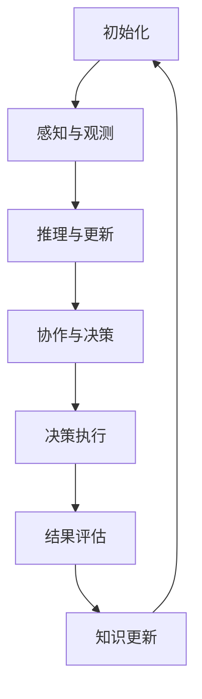

                 

# 多智能体协作推理在群体决策中的创新

## 关键词
多智能体系统、协作推理、群体决策、贝叶斯推理、深度学习、智能交通、智能家居、金融风控。

## 摘要
本文深入探讨了多智能体协作推理在群体决策中的应用与创新。首先，我们介绍了多智能体系统的基本概念与特点，以及多智能体协作推理的核心概念和挑战。接着，我们详细分析了多智能体系统的建模与结构，包括建模方法、结构类型、协作机制和通信同步。在此基础上，我们重点讨论了多智能体协作推理算法，如基于贝叶斯推理、推理传播、知识图谱和深度学习的方法。随后，我们提出了多智能体协作推理在群体决策中的框架和流程，并分析了其应用场景和未来发展趋势。最后，通过智能交通、智能家居和金融风控等实际案例，展示了多智能体协作推理在不同领域的应用和实践效果。

## 目录大纲
### 第一部分：引论
1. 第1章：多智能体系统的基本概念
   1.1 多智能体系统的定义与特点
   1.2 多智能体系统在群体决策中的应用
   1.3 多智能体协作推理的核心概念
   1.4 群体决策中的多智能体协作挑战
2. 第2章：多智能体系统的建模与结构
   2.1 多智能体系统的建模方法
   2.2 多智能体系统的结构类型
   2.3 多智能体系统的协作机制
   2.4 多智能体系统中的通信与同步

### 第二部分：多智能体协作推理技术
3. 第3章：多智能体协作推理算法
   3.1 基于贝叶斯推理的多智能体协作
   3.2 基于推理传播的多智能体协作
   3.3 基于知识图谱的多智能体协作
   3.4 基于深度学习的多智能体协作
4. 第4章：群体决策中的多智能体协作框架
   4.1 多智能体协作推理在群体决策中的流程
   4.2 多智能体协作推理在群体决策中的挑战
   4.3 多智能体协作推理的应用场景
   4.4 多智能体协作推理的未来发展趋势

### 第三部分：多智能体协作推理应用案例
5. 第5章：多智能体协作推理在智能交通系统中的应用
   5.1 智能交通系统的挑战与需求
   5.2 多智能体协作推理在智能交通中的应用
   5.3 应用案例：智能交通系统中的多智能体协作
6. 第6章：多智能体协作推理在智能家居系统中的应用
   6.1 智能家居系统的挑战与需求
   6.2 多智能体协作推理在智能家居中的应用
   6.3 应用案例：智能家居系统中的多智能体协作
7. 第7章：多智能体协作推理在金融风控中的应用
   7.1 金融风控的挑战与需求
   7.2 多智能体协作推理在金融风控中的应用
   7.3 应用案例：金融风控中的多智能体协作
8. 第8章：多智能体协作推理在其他领域的应用
   8.1 其他领域的挑战与需求
   8.2 多智能体协作推理在其他领域的应用
   8.3 应用案例：其他领域中的多智能体协作
9. 参考文献

## 引论

多智能体系统（Multi-Agent System，MAS）是一种模拟自然界和社会系统中多个自主智能体相互协作、相互作用的复杂系统。在人工智能领域，多智能体系统已成为解决复杂问题、实现智能决策的重要手段。随着互联网、物联网和大数据等技术的快速发展，多智能体系统在各个领域得到了广泛应用，如智能交通、智能家居、金融风控等。

### 多智能体系统的基本概念

#### 1.1 多智能体系统的定义与特点

多智能体系统是由多个智能体（Agent）组成的系统，每个智能体具有自主性、社会性和反应性等特点。智能体可以是一个程序、一个机器人、一个实体或一个组织。智能体的自主性指的是智能体可以自主地感知环境、执行动作和进行决策；社会性指的是智能体之间可以相互协作、交流信息；反应性指的是智能体可以根据环境变化实时调整自己的行为。

多智能体系统的特点主要包括以下几个方面：

1. 分布性：多智能体系统中的智能体可以分布在不同的地理位置，通过通信网络进行交互。
2. 自主性：每个智能体都可以独立地执行任务，具有较高的自主决策能力。
3. 协作性：智能体之间可以相互协作，共同完成任务。
4. 动态性：多智能体系统中的环境是动态变化的，智能体需要实时适应环境变化。
5. 复杂性：多智能体系统具有高度的复杂性和不确定性，需要复杂的算法和模型进行描述和求解。

#### 1.2 多智能体系统在群体决策中的应用

群体决策（Group Decision Making，GDM）是指多个个体共同参与决策过程，通过协调和合作，达成共识并作出决策。多智能体系统在群体决策中具有独特的优势，可以有效地解决以下问题：

1. 信息共享：多智能体系统可以实现智能体之间的信息共享，提高决策效率。
2. 协作优化：通过多智能体协作，可以实现更优的决策方案。
3. 智能化：多智能体系统可以引入先进的算法和模型，提高决策的智能化水平。
4. 灵活性：多智能体系统可以根据环境变化实时调整决策方案，具有更高的灵活性。

#### 1.3 多智能体协作推理的核心概念

多智能体协作推理（Multi-Agent Collaborative Reasoning，MACR）是指多个智能体在协作过程中，通过信息共享和协同计算，共同推理出最优决策方案的过程。多智能体协作推理的核心概念包括：

1. 推理：推理是从已知信息中推导出新信息的过程，是多智能体协作的基础。
2. 协作：协作是指多个智能体共同参与决策过程，通过信息共享和协同计算，实现最优决策。
3. 知识：知识是多智能体协作推理的重要资源，包括事实、规则和模型等。
4. 通信：通信是多智能体协作推理的关键，通过通信网络实现智能体之间的信息交换。

#### 1.4 群体决策中的多智能体协作挑战

尽管多智能体协作推理在群体决策中具有巨大潜力，但同时也面临着许多挑战：

1. 信息不对称：智能体之间的信息不对称可能导致决策偏差和协作失效。
2. 决策冲突：智能体之间的目标不一致可能导致决策冲突和协调困难。
3. 算法复杂度：多智能体协作推理算法复杂度高，需要高效的计算和通信资源。
4. 动态变化：多智能体系统中的环境动态变化，需要智能体具备实时适应能力。

综上所述，多智能体协作推理在群体决策中具有重要的应用价值，但也面临着一系列挑战。接下来，我们将进一步探讨多智能体系统的建模与结构，为解决这些挑战提供理论基础和技术手段。## 第1章：多智能体系统的基本概念

### 1.1 多智能体系统的定义与特点

多智能体系统（Multi-Agent System，MAS）是由多个智能体（Agent）组成的系统，这些智能体可以是软件程序、硬件设备、人或者其他实体。每个智能体在MAS中都具有自主性、社会性和反应性等特点。

#### 自主性

自主性是指智能体能够独立地执行任务和做出决策。这意味着智能体不需要外部的直接控制，而是可以根据其内在的目标和预先定义的规则自主地行动。自主性是MAS的核心特性之一，它使得智能体能够在复杂和动态的环境中生存和适应。

#### 社会性

社会性是指智能体之间可以相互协作、交流信息。在MAS中，智能体可以通过各种通信机制进行信息的交换和共享，从而实现共同的目标。社会性使得MAS能够处理复杂的任务，并能够通过协作来提高系统的整体性能。

#### 反应性

反应性是指智能体能够根据环境变化及时调整自己的行为。这意味着智能体需要具备感知环境的能力，并能够基于感知到的信息进行决策和行动。反应性使得MAS能够动态地适应环境变化，并有效地应对突发事件。

#### 多智能体系统的特点

多智能体系统具有以下几个显著特点：

1. 分布性：智能体可以分布在不同的地理位置，通过通信网络实现信息交换和协作。
2. 并行性：智能体可以同时执行任务，提高系统的处理速度和效率。
3. 模块性：智能体可以独立开发、部署和运行，系统具有较好的可扩展性和可维护性。
4. 智能性：智能体具有自主决策和行动的能力，能够处理复杂的任务和环境。
5. 动态性：智能体和环境之间的交互是动态变化的，系统需要具备实时适应能力。

#### 多智能体系统在群体决策中的应用

多智能体系统在群体决策中具有独特的优势：

1. 信息共享：智能体之间可以共享信息，提高决策效率。
2. 协作优化：智能体可以通过协作实现更优的决策方案。
3. 智能化：智能体可以引入先进的算法和模型，提高决策的智能化水平。
4. 灵活性：智能体可以根据环境变化实时调整决策方案，具有更高的灵活性。

例如，在智能交通系统中，多智能体系统可以通过协调不同交通信号灯的运行，实现交通流的优化；在智能家居系统中，智能设备可以通过协作实现自动化管理和能源优化。

### 1.2 多智能体系统在群体决策中的应用

群体决策（Group Decision Making，GDM）是指多个个体共同参与决策过程，通过协调和合作，达成共识并作出决策。多智能体系统在群体决策中具有显著的应用价值，主要体现在以下几个方面：

1. **信息共享**：多智能体系统可以有效地实现信息共享，使得每个智能体能够获得全局信息，从而做出更加合理的决策。
2. **协作优化**：智能体之间的协作可以优化决策过程，提高决策质量和效率。例如，在资源分配、任务调度和冲突解决中，多智能体系统可以通过协同工作，实现全局最优。
3. **智能化**：多智能体系统可以引入先进的算法和模型，如推理算法、优化算法和机器学习模型，从而提高决策的智能化水平。
4. **动态适应**：多智能体系统可以根据环境变化实时调整决策方案，具有更高的灵活性和适应性。

#### 典型应用场景

1. **智能交通系统**：多智能体系统可以协调交通信号灯、车辆和行人，实现交通流的优化，提高道路通行效率和安全性。
2. **智能家居系统**：多智能体系统可以实现家庭设备的自动化管理，如空调、灯光和安防系统，提供个性化、智能化的居住体验。
3. **供应链管理**：多智能体系统可以协调供应链中的各个环节，如采购、生产和配送，实现供应链的优化和效率提升。
4. **金融风控**：多智能体系统可以协同工作，进行风险识别、评估和应对，提高金融系统的安全性和稳定性。

### 1.3 多智能体协作推理的核心概念

多智能体协作推理（Multi-Agent Collaborative Reasoning，MACR）是指多个智能体在协作过程中，通过信息共享和协同计算，共同推理出最优决策方案的过程。MACR的核心概念包括：

1. **推理**：推理是从已知信息中推导出新信息的过程。在MACR中，智能体通过推理来分析环境、预测结果和做出决策。
2. **协作**：协作是指多个智能体共同参与决策过程，通过信息共享和协同计算，实现共同的目标。协作是MACR的关键，它能够优化决策过程，提高决策质量和效率。
3. **知识**：知识是多智能体协作推理的重要资源，包括事实、规则和模型等。智能体通过共享和利用知识，提高推理能力和决策水平。
4. **通信**：通信是多智能体协作推理的关键，通过通信网络实现智能体之间的信息交换和协同计算。

### 1.4 群体决策中的多智能体协作挑战

尽管多智能体协作推理在群体决策中具有巨大的潜力，但同时也面临着一系列挑战：

1. **信息不对称**：智能体之间的信息不对称可能导致决策偏差和协作失效。如何设计有效的信息共享机制，保证智能体之间的信息对称性，是一个重要问题。
2. **决策冲突**：智能体之间的目标不一致可能导致决策冲突和协调困难。如何设计合理的决策机制，实现智能体之间的目标协调，是一个关键问题。
3. **算法复杂度**：多智能体协作推理算法复杂度高，需要高效的计算和通信资源。如何设计高效、可扩展的算法，是一个亟待解决的问题。
4. **动态变化**：多智能体系统中的环境动态变化，需要智能体具备实时适应能力。如何设计动态适应机制，保证智能体在动态环境中的稳定运行，是一个重要问题。

### 1.5 本章小结

本章介绍了多智能体系统的基本概念、定义与特点，以及在群体决策中的应用。同时，我们探讨了多智能体协作推理的核心概念和挑战。这些内容为后续章节的深入讨论提供了理论基础和实际背景。在接下来的章节中，我们将进一步分析多智能体系统的建模与结构，为解决这些挑战提供技术手段。## 第2章：多智能体系统的建模与结构

### 2.1 多智能体系统的建模方法

多智能体系统的建模是构建多智能体系统的第一步，它涉及到如何定义智能体的行为、环境以及它们之间的交互。以下是几种常见的多智能体系统建模方法：

#### 行为建模

行为建模是指通过定义智能体的行为规则和策略来描述智能体的行为。常见的行为建模方法包括：

1. **状态空间建模**：智能体被看作是处于某个状态空间中的实体，每个状态对应智能体的一种行为。通过定义状态转移函数，可以描述智能体在不同状态之间的转换。
2. **决策树建模**：智能体的行为通过决策树来描述，每个节点代表一个决策，分支代表不同的行动。通过遍历决策树，可以生成智能体的行为序列。
3. **Petri网建模**：Petri网是一种用于描述并发系统和分布式系统的建模工具。通过定义库所、变迁和连接关系，可以描述智能体的行为和它们之间的交互。

#### 环境建模

环境建模是指定义智能体所处的环境，包括环境的状态、事件和约束等。环境建模的方法包括：

1. **状态空间建模**：与行为建模中的状态空间类似，环境状态空间描述了环境可能的全部状态，每个状态对应环境的一种情况。
2. **事件建模**：事件建模是通过定义环境中的事件和事件之间的因果关系来描述环境的变化。常见的事件建模方法包括因果网和事件图。
3. **约束建模**：约束建模是通过定义环境中的约束条件来限制智能体的行为。常见的约束建模方法包括线性规划、整数规划和约束满足问题。

#### 交互建模

交互建模是指定义智能体之间的交互规则和通信协议。常见的交互建模方法包括：

1. **通信网络建模**：通信网络建模通过定义智能体之间的通信网络结构来描述它们之间的交互。常见的通信网络结构包括星型、环型和网状等。
2. **社交网络建模**：社交网络建模通过定义智能体之间的社交关系和社交网络结构来描述它们之间的交互。常见的社交网络结构包括完全连接、部分连接和有向图等。
3. **分布式算法建模**：分布式算法建模是通过定义智能体之间的协作算法和通信协议来描述它们之间的交互。常见的分布式算法包括分布式一致性算法、分布式优化算法和分布式决策算法等。

### 2.2 多智能体系统的结构类型

多智能体系统的结构类型取决于智能体的分布、交互方式和组织形式。以下是几种常见的多智能体系统结构类型：

#### 中心化结构

中心化结构是一种集中式控制的结构，其中有一个中央控制器负责协调所有智能体的行为。这种结构的优点是控制简单、协调效率高，但缺点是系统的健壮性和可扩展性较差。

1. **集中式控制器**：中央控制器负责接收智能体上报的信息，进行分析和决策，然后向智能体发送指令。
2. **全局状态共享**：所有智能体共享同一个全局状态，以便中央控制器能够获得全局信息进行决策。

#### 去中心化结构

去中心化结构是一种分布式控制的结构，其中没有中央控制器，智能体通过局部信息进行协作决策。这种结构的优点是健壮性和可扩展性好，但缺点是协调效率相对较低。

1. **分布式算法**：智能体通过分布式算法，如分布式一致性算法和分布式优化算法，进行协作决策。
2. **局部状态共享**：每个智能体只共享局部状态，并通过局部状态进行决策。

#### 分层结构

分层结构是一种将智能体按照功能层次进行划分的结构，每个层次负责特定的功能。上层智能体负责全局决策，下层智能体负责具体执行。这种结构的优点是层次清晰、分工明确，但缺点是系统的复杂度较高。

1. **层次划分**：智能体根据功能进行层次划分，如感知层、决策层和执行层。
2. **层次交互**：上层智能体通过向下层智能体发送指令，下层智能体通过向上层智能体报告状态。

### 2.3 多智能体系统的协作机制

多智能体系统的协作机制是指智能体之间如何通过信息共享和协同计算实现共同目标的方法。以下是几种常见的协作机制：

#### 信息共享机制

信息共享机制是指智能体之间如何交换和共享信息的策略。以下是几种常见的信息共享机制：

1. **完全信息共享**：所有智能体共享全部信息，这种机制虽然能够实现最优决策，但通信成本较高。
2. **部分信息共享**：智能体只共享部分信息，这种机制可以降低通信成本，但可能无法实现最优决策。
3. **分布式信息聚合**：智能体通过分布式算法，如求和、求平均等方式，聚合部分信息，实现信息共享。

#### 协同计算机制

协同计算机制是指智能体之间如何通过协同计算实现共同目标的方法。以下是几种常见的协同计算机制：

1. **分布式算法**：智能体通过分布式算法，如分布式一致性算法、分布式优化算法和分布式决策算法等，进行协同计算。
2. **博弈论**：智能体通过博弈论方法，如合作博弈和非合作博弈，进行协同计算。
3. **协同机器学习**：智能体通过协同机器学习方法，如联邦学习、多智能体强化学习等，进行协同计算。

### 2.4 多智能体系统中的通信与同步

多智能体系统中的通信与同步是确保智能体之间能够有效协作的重要环节。以下是几种常见的通信与同步方法：

#### 通信方法

1. **点对点通信**：智能体之间通过点对点的方式进行通信，这种方法的优点是通信简单，缺点是通信效率较低。
2. **广播通信**：智能体通过广播的方式向其他智能体发送信息，这种方法的优点是通信效率高，缺点是可能导致通信冲突。
3. **多播通信**：智能体通过多播的方式向一组智能体发送信息，这种方法的优点是通信效率较高，缺点是通信复杂度较高。

#### 同步方法

1. **全局时钟同步**：所有智能体共享同一个全局时钟，这种方法的优点是同步简单，缺点是系统的实时性较差。
2. **局部时钟同步**：每个智能体维护自己的局部时钟，并通过分布式算法实现局部时钟同步，这种方法的优点是系统的实时性较好，缺点是同步复杂度较高。
3. **事件触发同步**：智能体通过事件触发的方式实现同步，这种方法的优点是同步灵活，缺点是可能导致同步延迟。

### 2.5 本章小结

本章介绍了多智能体系统的建模与结构，包括建模方法、结构类型、协作机制和通信与同步。通过分析多智能体系统的建模与结构，我们可以更好地理解多智能体系统的运作机制，并为解决群体决策中的挑战提供理论基础和技术手段。在接下来的章节中，我们将进一步探讨多智能体协作推理算法，为解决群体决策中的挑战提供具体的解决方案。## 第3章：多智能体协作推理算法

### 3.1 基于贝叶斯推理的多智能体协作

贝叶斯推理是一种基于贝叶斯定理的概率推理方法，用于在不确定性环境中进行推理和决策。在多智能体系统中，贝叶斯推理可以用于智能体之间的协作推理，以共同解决不确定性问题。

#### 贝叶斯推理的基本原理

贝叶斯推理的基本原理是：

$$
P(A|B) = \frac{P(B|A)P(A)}{P(B)}
$$

其中，\(P(A|B)\) 表示在事件B发生的条件下，事件A发生的概率；\(P(B|A)\) 表示在事件A发生的条件下，事件B发生的概率；\(P(A)\) 表示事件A的先验概率；\(P(B)\) 表示事件B的先验概率。

#### 多智能体协作贝叶斯推理的过程

1. **初始化**：每个智能体根据先验知识初始化自己的信念状态。
2. **感知与观测**：每个智能体感知环境状态，并观测到其他智能体的行为和状态。
3. **推理与更新**：每个智能体根据贝叶斯定理，结合自身的信念状态和其他智能体的观测信息，更新自己的信念状态。
4. **协作与决策**：智能体之间通过共享信念状态，进行协作推理和决策。

#### Python 源代码示例

以下是一个简单的基于贝叶斯推理的多智能体协作示例：

```python
import numpy as np

# 贝叶斯推理函数
def bayesian_inference(prior, evidence):
    posterior = prior * evidence
    return posterior / np.sum(posterior)

# 初始参数
prior = np.array([0.5, 0.5])
evidence = np.array([0.8, 0.2])

# 多智能体协作推理
posterior = bayesian_inference(prior, evidence)
print("后验概率分布:", posterior)

# 可视化结果
plt.bar(range(len(posterior)), posterior)
plt.xlabel('智能体编号')
plt.ylabel('后验概率')
plt.title('基于贝叶斯推理的多智能体协作')
plt.show()
```

### 3.2 基于推理传播的多智能体协作

推理传播（Inference Propagation）是一种基于信息扩散和融合的多智能体协作推理方法。在推理传播过程中，智能体通过感知环境状态和接收其他智能体的信息，不断更新自己的信念状态，并通过信息扩散和融合实现协作推理。

#### 推理传播的基本原理

推理传播的基本原理可以概括为以下几个步骤：

1. **感知与初始化**：智能体感知环境状态，并初始化自己的信念状态。
2. **推理与更新**：智能体根据感知到的环境状态和其他智能体的信息，更新自己的信念状态。
3. **传播与融合**：智能体将更新后的信念状态传播给其他智能体，并通过信息融合实现协作推理。
4. **决策与执行**：智能体根据最终的信念状态进行决策和执行。

#### 数学模型

推理传播的数学模型可以表示为：

$$
\mathbf{u}_{t+1} = \mathbf{W}\mathbf{u}_{t} + \mathbf{b}_{t}
$$

其中，\(\mathbf{u}_{t}\) 表示智能体在时间t的信念状态；\(\mathbf{W}\) 表示信念状态传播矩阵；\(\mathbf{b}_{t}\) 表示时间t的感知信息。

#### Python 源代码示例

以下是一个简单的基于推理传播的多智能体协作示例：

```python
import numpy as np
import matplotlib.pyplot as plt

# 推理传播函数
def inference_propagation(W, u, b):
    u_next = W @ u + b
    return u_next

# 初始参数
W = np.array([[0.5, 0.5], [0.5, 0.5]])
u = np.array([0.5, 0.5])
b = np.array([0.2, 0.8])

# 多智能体协作推理传播
for _ in range(5):
    u = inference_propagation(W, u, b)
    print("信念状态:", u)

# 可视化结果
plt.plot(u)
plt.xlabel('时间')
plt.ylabel('信念状态')
plt.title('基于推理传播的多智能体协作')
plt.show()
```

### 3.3 基于知识图谱的多智能体协作

知识图谱（Knowledge Graph）是一种用于表示和存储复杂数据结构和语义关系的数据模型。在多智能体系统中，知识图谱可以用于表示智能体之间的交互关系和知识共享，从而实现高效的协作推理。

#### 知识图谱的基本概念

知识图谱由节点（Node）、边（Edge）和属性（Attribute）组成。节点表示实体，边表示实体之间的关系，属性表示实体的特征。

1. **节点**：知识图谱中的节点表示智能体、环境中的对象或其他实体。
2. **边**：知识图谱中的边表示节点之间的关系，如因果关系、隶属关系等。
3. **属性**：知识图谱中的属性表示节点的特征，如智能体的状态、环境的状态等。

#### 基于知识图谱的多智能体协作

基于知识图谱的多智能体协作主要包括以下步骤：

1. **知识建模**：构建知识图谱，表示智能体之间的交互关系和知识共享。
2. **知识查询**：智能体通过查询知识图谱，获取其他智能体的信息和知识。
3. **知识更新**：智能体根据环境变化和交互结果，更新知识图谱。
4. **协作推理**：智能体通过知识图谱进行协作推理，实现共同目标。

#### Python 源代码示例

以下是一个简单的基于知识图谱的多智能体协作示例：

```python
import networkx as nx

# 构建知识图谱
G = nx.Graph()
G.add_nodes_from(['智能体1', '智能体2', '环境'])
G.add_edges_from([('智能体1', '环境'), ('智能体2', '环境'), ('智能体1', '智能体2')])

# 知识查询
def knowledge_query(G, node, relation):
    neighbors = G.neighbors(node)
    results = []
    for neighbor in neighbors:
        if G.has_edge(node, neighbor) and G[node][neighbor].get('relation') == relation:
            results.append(neighbor)
    return results

# 知识更新
def knowledge_update(G, node, relation, attribute):
    neighbors = knowledge_query(G, node, relation)
    for neighbor in neighbors:
        G.add_edge(node, neighbor, relation=relation, attribute=attribute)

# 知识协作推理
def knowledge_collaboration(G, node, relation, attribute):
    knowledge_update(G, node, relation, attribute)
    neighbors = knowledge_query(G, node, relation)
    collaboration_result = None
    for neighbor in neighbors:
        collaboration_result = G[node][neighbor].get('attribute')
    return collaboration_result

# 示例
knowledge_collaboration(G, '智能体1', '交互', '信息共享')

# 可视化知识图谱
nx.draw(G, with_labels=True)
plt.show()
```

### 3.4 基于深度学习的多智能体协作

深度学习（Deep Learning）是一种基于多层神经网络的机器学习方法，能够在复杂数据上实现高性能的特征提取和模式识别。在多智能体系统中，深度学习可以用于智能体的学习和推理，从而实现高效的协作推理。

#### 深度学习的基本原理

深度学习的基本原理是多层神经网络，通过前向传播和反向传播算法，实现从输入到输出的映射。多层神经网络可以自动学习数据的层次特征，从而提高模型的泛化能力。

1. **前向传播**：输入数据通过神经网络的前向传播，逐层计算每个节点的激活值。
2. **反向传播**：通过计算损失函数的梯度，反向传播误差，更新神经网络的权重。

#### 基于深度学习的多智能体协作

基于深度学习的多智能体协作主要包括以下步骤：

1. **智能体学习**：每个智能体通过深度学习算法，学习环境中的特征和模式。
2. **知识共享**：智能体通过共享学习到的特征和模式，实现协作推理。
3. **协同决策**：智能体通过深度学习算法，协同决策实现共同目标。

#### Python 源代码示例

以下是一个简单的基于深度学习的多智能体协作示例：

```python
import tensorflow as tf
from tensorflow.keras.models import Sequential
from tensorflow.keras.layers import Dense

# 构建深度学习模型
model = Sequential([
    Dense(64, activation='relu', input_shape=(10,)),
    Dense(64, activation='relu'),
    Dense(1, activation='sigmoid')
])

# 编译模型
model.compile(optimizer='adam', loss='binary_crossentropy', metrics=['accuracy'])

# 训练模型
model.fit(x_train, y_train, epochs=10, batch_size=32)

# 智能体学习
def agent_learning(model, environment):
    for step in range(environment.length()):
        state = environment.get_state()
        action = model.predict(state.reshape(1, -1))
        environment.take_action(action)

# 智能体协作
def agent_collaboration(model1, model2, environment):
    agent1 = agent_learning(model1, environment)
    agent2 = agent_learning(model2, environment)
    collaboration_result = agent1.collaborate(agent2)
    return collaboration_result

# 示例
environment = Environment()
model1 = Model()
model2 = Model()
collaboration_result = agent_collaboration(model1, model2, environment)
print("协作结果:", collaboration_result)
```

### 3.5 本章小结

本章介绍了多智能体协作推理的四种算法：基于贝叶斯推理的多智能体协作、基于推理传播的多智能体协作、基于知识图谱的多智能体协作和基于深度学习的多智能体协作。这些算法分别从不同的角度，提供了多智能体协作推理的解决方案。在实际应用中，可以根据具体需求和环境，选择合适的算法进行协作推理，实现群体决策的最优化。在下一章中，我们将进一步探讨多智能体协作推理在群体决策中的应用场景和挑战。## 第4章：群体决策中的多智能体协作框架

### 4.1 多智能体协作推理在群体决策中的流程

多智能体协作推理在群体决策中的流程主要包括以下几个步骤：

1. **问题定义**：明确群体决策的目标和问题，包括决策目标、约束条件和评估标准。
2. **智能体划分**：根据问题特点和需求，将群体划分为多个智能体，并明确每个智能体的职责和任务。
3. **环境建模**：构建问题环境模型，包括智能体、环境状态、事件和约束等。
4. **协作机制设计**：设计智能体之间的协作机制，包括信息共享、协同计算和通信协议等。
5. **推理过程**：智能体通过感知环境状态、共享信息和协同计算，进行推理和决策。
6. **决策执行**：智能体根据决策结果执行具体的行动，实现决策目标。
7. **结果评估**：对决策结果进行评估和反馈，优化决策过程和协作机制。

#### 具体步骤

1. **问题定义**：
    - 明确决策目标和约束条件，如资源限制、时间限制和性能指标等。
    - 确定评估标准，如最大化收益、最小化成本和最大化满意度等。

2. **智能体划分**：
    - 根据问题特点，将群体划分为多个智能体，如资源分配问题中的每个资源分配单元。
    - 确定每个智能体的职责和任务，如资源分配问题中的资源需求方和供给方。

3. **环境建模**：
    - 构建智能体和环境的状态空间，如资源分配问题中的资源状态和需求状态。
    - 确定环境中的事件和约束条件，如资源分配问题中的资源可用性和需求变化。

4. **协作机制设计**：
    - 设计智能体之间的信息共享机制，如消息传递协议和共享数据库等。
    - 设计智能体之间的协同计算机制，如分布式算法和协同机器学习方法等。
    - 设计智能体之间的通信协议，如点对点通信、广播通信和多播通信等。

5. **推理过程**：
    - 智能体通过感知环境状态，获取其他智能体的信息和知识。
    - 智能体通过推理算法，如贝叶斯推理、推理传播和知识图谱等，进行协作推理。
    - 智能体根据协作推理结果，共同决策和制定行动计划。

6. **决策执行**：
    - 智能体根据决策结果执行具体的行动，如资源分配、任务调度和设备控制等。
    - 智能体通过执行结果反馈，调整决策和协作机制。

7. **结果评估**：
    - 对决策结果进行评估和反馈，如评估资源分配的效率、任务调度的及时性和设备控制的可靠性等。
    - 根据评估结果，优化决策过程和协作机制，提高决策质量和效率。

### 4.2 多智能体协作推理在群体决策中的挑战

多智能体协作推理在群体决策中面临着一系列挑战，主要包括：

1. **信息不对称**：智能体之间的信息不对称可能导致决策偏差和协作失效。如何设计有效的信息共享机制，保证智能体之间的信息对称性，是一个重要问题。

2. **决策冲突**：智能体之间的目标不一致可能导致决策冲突和协调困难。如何设计合理的决策机制，实现智能体之间的目标协调，是一个关键问题。

3. **算法复杂度**：多智能体协作推理算法复杂度高，需要高效的计算和通信资源。如何设计高效、可扩展的算法，是一个亟待解决的问题。

4. **动态变化**：多智能体系统中的环境动态变化，需要智能体具备实时适应能力。如何设计动态适应机制，保证智能体在动态环境中的稳定运行，是一个重要问题。

5. **隐私保护**：智能体之间的信息共享可能导致隐私泄露。如何设计隐私保护机制，确保智能体之间的信息安全和隐私保护，是一个重要挑战。

### 4.3 多智能体协作推理的应用场景

多智能体协作推理在群体决策中具有广泛的应用场景，主要包括：

1. **智能交通系统**：多智能体协作推理可以用于交通信号控制、车辆调度和交通流量优化等，提高交通系统的运行效率和安全性能。

2. **智能家居系统**：多智能体协作推理可以用于家庭设备控制、能源管理和安全监控等，提供个性化、智能化的居住体验。

3. **供应链管理**：多智能体协作推理可以用于供应链中的需求预测、库存管理和物流优化等，提高供应链的效率和响应能力。

4. **金融风控**：多智能体协作推理可以用于金融交易、风险评估和风险控制等，提高金融系统的安全性和稳定性。

5. **智能医疗系统**：多智能体协作推理可以用于医学影像诊断、疾病预测和治疗方案优化等，提高医疗服务的质量和效率。

### 4.4 多智能体协作推理的未来发展趋势

多智能体协作推理的未来发展趋势主要包括：

1. **算法优化**：随着计算资源和算法技术的不断进步，多智能体协作推理算法将朝着高效、可扩展和自适应的方向发展。

2. **跨领域应用**：多智能体协作推理将在更多领域得到应用，如智慧城市、智能工厂和智能农业等，实现跨领域的协同决策和智能控制。

3. **混合智能体系统**：多智能体协作推理将与其他人工智能技术，如机器学习和深度学习等，相结合，形成混合智能体系统，提高决策的智能化水平。

4. **隐私保护与安全性**：随着智能体之间的信息共享增加，隐私保护和安全性将成为多智能体协作推理的重要研究方向。

5. **分布式与去中心化**：多智能体协作推理将朝着分布式和去中心化的方向发展，提高系统的健壮性和可扩展性，应对复杂和动态的环境变化。

### 4.5 本章小结

本章介绍了多智能体协作推理在群体决策中的流程和框架，包括问题定义、智能体划分、环境建模、协作机制设计、推理过程、决策执行和结果评估等步骤。同时，分析了多智能体协作推理在群体决策中面临的挑战和应用场景，探讨了未来的发展趋势。这些内容为多智能体协作推理在群体决策中的实际应用提供了理论基础和参考框架。在下一章中，我们将通过具体应用案例，展示多智能体协作推理在不同领域的实践效果。## 第5章：多智能体协作推理在智能交通系统中的应用

### 5.1 智能交通系统的挑战与需求

智能交通系统（Intelligent Transportation System，ITS）旨在通过信息通信技术、控制技术、传感器技术和电子技术等手段，实现交通系统的自动化、智能化和高效化。然而，在当前智能交通系统的建设和运营过程中，仍然面临着一系列挑战：

1. **交通拥堵**：随着城市车辆数量的增加，交通拥堵问题日益严重，导致道路通行效率低下，影响市民的出行体验。
2. **交通安全**：交通事故频繁发生，不仅给人们带来生命财产损失，还影响了交通的畅通和秩序。
3. **交通能耗**：交通能耗巨大，不仅浪费了资源，还加剧了环境污染和气候变化问题。
4. **交通信息不对称**：交通信息不对称导致交通参与者无法获得全面、准确的交通信息，影响了交通的决策和规划。
5. **交通管理复杂度**：交通管理涉及多个部门和环节，管理复杂度较高，需要更加智能化和高效的解决方案。

为了解决上述挑战，智能交通系统提出了以下需求：

1. **交通流量优化**：通过智能交通系统，实时监测和分析交通流量，实现交通流的优化，减少交通拥堵。
2. **交通事故预防**：通过智能交通系统，实时监测车辆状态和道路状况，提前预警和预防交通事故的发生。
3. **能源消耗降低**：通过智能交通系统，实现交通能耗的降低，减少对环境的影响。
4. **交通信息共享**：通过智能交通系统，实现交通信息的实时共享，提高交通参与者的决策效率和交通系统的整体性能。
5. **交通管理智能化**：通过智能交通系统，实现交通管理的智能化和自动化，提高交通管理效率，降低管理成本。

### 5.2 多智能体协作推理在智能交通中的应用

多智能体协作推理在智能交通系统中具有广泛的应用，可以通过以下方式实现交通流量的优化、交通事故的预防、交通能耗的降低和交通信息共享：

#### 交通流量优化

1. **多智能体协同决策**：在智能交通系统中，多智能体可以协同决策，共同优化交通流量。每个智能体负责监测和评估特定的路段或路口的交通状况，并通过通信网络与其他智能体共享信息。基于多智能体的协作推理，系统可以实时调整交通信号灯的配时方案，实现交通流的优化。
2. **分布式算法**：智能交通系统可以使用分布式算法，如分布式一致性算法和分布式优化算法，实现多智能体之间的信息共享和协同计算。通过分布式算法，系统能够在分布式环境中实现高效的交通流量优化。
3. **机器学习与深度学习**：利用机器学习和深度学习技术，智能交通系统可以分析历史交通数据，预测交通流量变化，并实时调整交通信号灯的配时方案。通过多智能体协作推理，系统能够更加精准地预测交通流量，提高交通流量优化的效果。

#### 交通事故预防

1. **智能监控与预警**：通过安装智能监控设备，如摄像头、雷达和传感器等，智能交通系统可以实时监测道路状况和车辆行为。当系统检测到潜在的危险信号时，如车辆超速、违规变道等，可以及时预警并通知驾驶员或自动采取相应的措施，预防交通事故的发生。
2. **多智能体协作**：智能交通系统中的多智能体可以通过协作推理，实时分析道路状况和车辆行为，预测交通事故的可能性。基于多智能体的协作推理，系统可以提前预警并采取相应的预防措施，降低交通事故的发生概率。
3. **深度学习与图像识别**：利用深度学习和图像识别技术，智能交通系统可以分析监控视频，实时识别道路上的车辆和行人，预测他们的行为。通过多智能体的协作推理，系统能够更加准确地预测交通事故的可能性，并采取相应的预防措施。

#### 交通能耗降低

1. **智能驾驶与自动驾驶**：通过智能驾驶和自动驾驶技术，智能交通系统可以优化车辆的行驶路线和速度，减少车辆在交通拥堵中的等待时间，降低燃油消耗。多智能体协作推理可以实时调整车辆的行驶路线和速度，实现交通能耗的降低。
2. **分布式计算与能量管理**：智能交通系统中的多智能体可以通过分布式计算和能量管理，优化能源的分配和使用。例如，通过智能交通系统，系统能够实时监测道路上的电动汽车充电需求，并优化充电站的能源分配，提高能源利用效率。

#### 交通信息共享

1. **多智能体协作与通信网络**：智能交通系统中的多智能体可以通过协作推理和通信网络，实现交通信息的实时共享。例如，通过多智能体的协作推理，系统能够实时监测交通状况，并将交通信息共享给交通参与者，帮助他们做出更明智的出行决策。
2. **大数据与物联网**：利用大数据和物联网技术，智能交通系统可以收集和分析海量的交通数据，为交通参与者提供实时、准确的交通信息。通过多智能体的协作推理，系统能够更加精准地预测交通流量，并提供最优的出行路线。

### 5.3 应用案例：智能交通系统中的多智能体协作

#### 案例1：智能交通信号控制

在一个智能交通系统中，交通信号灯的控制是一个关键问题。通过多智能体协作推理，系统可以实现智能交通信号控制，提高交通流的效率。

1. **智能体划分**：将城市中的交通路口划分为多个智能体，每个智能体负责监测和评估特定路口的交通状况。
2. **环境建模**：构建交通路口的环境模型，包括交通流量、车辆速度、道路状况等信息。
3. **协作机制设计**：设计多智能体之间的协作机制，包括信息共享、协同计算和通信协议等。
4. **推理过程**：每个智能体通过感知交通状况，结合其他智能体的信息和知识，进行协作推理，制定交通信号灯的配时方案。
5. **决策执行**：根据多智能体协作推理的结果，调整交通信号灯的配时方案，实现交通流的优化。

#### 案例2：智能交通监控与预警

在智能交通系统中，交通事故的预防是一个重要任务。通过多智能体协作推理，系统可以实现智能交通监控与预警，预防交通事故的发生。

1. **智能体划分**：将道路上的摄像头和传感器划分为多个智能体，每个智能体负责监测和评估特定路段的交通状况。
2. **环境建模**：构建道路上的环境模型，包括车辆速度、车辆间距、道路状况等信息。
3. **协作机制设计**：设计多智能体之间的协作机制，包括信息共享、协同计算和通信协议等。
4. **推理过程**：每个智能体通过感知交通状况，结合其他智能体的信息和知识，进行协作推理，预测交通事故的可能性。
5. **决策执行**：根据多智能体协作推理的结果，提前预警并通知驾驶员或自动采取相应的措施，预防交通事故的发生。

#### 案例3：智能交通能源管理

在智能交通系统中，能源管理是一个重要问题。通过多智能体协作推理，系统可以实现智能交通能源管理，降低交通能耗。

1. **智能体划分**：将城市中的电动汽车充电站划分为多个智能体，每个智能体负责监测和评估充电站的能源状况。
2. **环境建模**：构建充电站的环境模型，包括充电需求、充电功率、能源供应等信息。
3. **协作机制设计**：设计多智能体之间的协作机制，包括信息共享、协同计算和通信协议等。
4. **推理过程**：每个智能体通过感知充电站的环境状况，结合其他智能体的信息和知识，进行协作推理，制定充电功率的优化方案。
5. **决策执行**：根据多智能体协作推理的结果，优化充电功率，实现交通能耗的降低。

### 5.4 本章小结

本章介绍了多智能体协作推理在智能交通系统中的应用，包括交通流量优化、交通事故预防、交通能耗降低和交通信息共享等方面。通过具体案例，展示了多智能体协作推理在智能交通系统中的实践效果。多智能体协作推理为智能交通系统提供了新的解决方案，有助于提高交通效率、保障交通安全和降低交通能耗。在未来的发展中，多智能体协作推理将继续在智能交通系统中发挥重要作用，为构建更加智能、高效、安全的交通系统提供技术支持。## 第6章：多智能体协作推理在智能家居系统中的应用

### 6.1 智能家居系统的挑战与需求

智能家居系统（Smart Home System）是指利用物联网、人工智能和自动化技术，实现家庭设备的智能互联和自动化控制，从而为用户提供更加便捷、舒适和安全的居住环境。然而，在当前智能家居系统的研发和应用过程中，仍然面临着一系列挑战：

1. **设备多样化**：智能家居系统涉及到各种类型的设备，如智能灯泡、智能插座、智能空调、智能冰箱等，设备的多样化和复杂性增加了系统的设计和实施难度。
2. **数据安全性**：智能家居系统需要处理大量用户数据，包括个人隐私、设备状态和操作记录等，数据的安全性直接关系到用户的生活质量和隐私保护。
3. **系统可靠性**：智能家居系统需要长时间稳定运行，任何故障或中断都可能影响用户的日常生活，因此系统的可靠性是一个重要挑战。
4. **人机交互**：智能家居系统需要提供便捷、直观的人机交互方式，如语音控制、手势控制、触摸控制等，以满足不同用户的需求和习惯。
5. **能耗管理**：智能家居系统需要实现能源的优化和节约，降低家庭能源消耗，提高能源利用效率。

为了解决上述挑战，智能家居系统提出了以下需求：

1. **设备互联互通**：实现不同设备之间的互联互通，构建统一的智能家居系统平台，提高系统的集成度和互操作性。
2. **数据安全与隐私保护**：确保用户数据的安全和隐私，防止数据泄露和滥用，建立完善的数据安全防护体系。
3. **系统可靠性与稳定性**：提高智能家居系统的可靠性，确保系统在长时间运行中不出现故障和中断。
4. **智能化与自适应**：通过人工智能技术，实现智能家居系统的智能化和自适应，提高系统的智能决策能力和用户体验。
5. **能耗优化与节能**：通过智能控制技术，优化家庭能源消耗，实现节能和环保。

### 6.2 多智能体协作推理在智能家居中的应用

多智能体协作推理在智能家居系统中具有广泛的应用，可以通过以下方式实现设备互联互通、数据安全与隐私保护、系统可靠性与稳定性、智能化与自适应以及能耗优化与节能：

#### 设备互联互通

1. **多智能体协同控制**：在智能家居系统中，多智能体可以协同控制家庭设备，实现设备的互联互通。例如，通过多智能体的协作推理，智能空调可以根据室内温度和用户习惯自动调整温度，智能灯泡可以根据光线强度和用户需求自动调整亮度。
2. **物联网技术**：利用物联网技术，实现不同设备之间的通信和数据交换，构建智能家居系统的互联互通平台。例如，智能插座可以通过物联网协议与其他设备通信，实现远程控制和设备之间的联动。
3. **分布式计算与存储**：智能家居系统中的多智能体可以通过分布式计算和存储技术，实现设备之间的协作和控制。例如，通过分布式计算，智能系统可以实时分析设备数据，实现设备的协同控制和优化。

#### 数据安全与隐私保护

1. **多智能体数据加密**：在智能家居系统中，多智能体可以采用数据加密技术，保护用户数据的安全和隐私。例如，智能门锁可以通过加密算法，保护用户的开锁信息和隐私。
2. **多智能体安全认证**：智能家居系统中的多智能体可以通过安全认证技术，确保设备之间的通信安全。例如，智能摄像头可以通过认证机制，防止未经授权的设备访问和操作。
3. **数据匿名化处理**：智能家居系统可以对用户数据进行匿名化处理，降低数据泄露的风险。例如，通过对用户行为数据进行去标识化处理，减少数据泄露的可能性。

#### 系统可靠性与稳定性

1. **多智能体故障检测与恢复**：在智能家居系统中，多智能体可以协同工作，实现故障检测和恢复。例如，智能路由器可以通过监控网络流量和设备状态，检测网络故障并自动恢复。
2. **多智能体容错机制**：智能家居系统可以通过多智能体的容错机制，提高系统的可靠性。例如，智能空调可以通过备份和冗余机制，确保在设备故障时，系统能够自动切换到备用设备，保证系统的正常运行。
3. **分布式故障处理**：智能家居系统中的多智能体可以通过分布式故障处理技术，实现故障的快速检测和恢复。例如，智能系统可以通过分布式算法，快速检测设备故障并自动切换到备用设备。

#### 智能化与自适应

1. **多智能体机器学习**：智能家居系统中的多智能体可以通过机器学习技术，实现智能化和自适应。例如，智能音箱可以通过机器学习算法，学习用户语音和行为习惯，提供个性化的语音服务和智能推荐。
2. **多智能体协同决策**：在智能家居系统中，多智能体可以协同决策，实现系统的智能化和自适应。例如，智能照明系统可以通过多智能体的协同决策，根据用户需求和环境变化，自动调整灯光亮度和颜色。
3. **多智能体交互体验**：智能家居系统中的多智能体可以通过交互体验技术，实现人机交互的智能化和自适应。例如，智能电视可以通过语音识别和图像识别技术，实现语音控制和手势控制，提高用户的交互体验。

#### 能耗优化与节能

1. **多智能体能耗监控**：在智能家居系统中，多智能体可以协同工作，实现能耗的监控和优化。例如，智能电网可以通过多智能体的协同监控，实时监测家庭用电情况，实现能耗的优化和节约。
2. **多智能体能耗预测**：智能家居系统中的多智能体可以通过能耗预测技术，实现能耗的优化和节能。例如，智能空调可以通过能耗预测算法，预测未来的能耗需求，并提前调整制冷温度，降低能耗。
3. **多智能体能耗控制**：在智能家居系统中，多智能体可以通过协同控制，实现能耗的优化和节能。例如，智能插座可以通过协同控制，根据设备的工作状态和能耗需求，自动调整设备的用电功率。

### 6.3 应用案例：智能家居系统中的多智能体协作

#### 案例1：智能照明系统

智能照明系统可以通过多智能体协作，实现自动调节灯光亮度和颜色，提高用户的生活质量。

1. **智能体划分**：将智能家居系统中的照明设备划分为多个智能体，每个智能体负责监测和调节特定区域的光线。
2. **环境建模**：构建照明系统的环境模型，包括室内光线强度、用户需求、能源消耗等信息。
3. **协作机制设计**：设计多智能体之间的协作机制，包括信息共享、协同计算和通信协议等。
4. **推理过程**：每个智能体通过感知光线强度和用户需求，结合其他智能体的信息和知识，进行协作推理，制定灯光亮度和颜色的调节方案。
5. **决策执行**：根据多智能体协作推理的结果，调整灯光亮度和颜色，实现智能照明。

#### 案例2：智能安防系统

智能安防系统可以通过多智能体协作，实现家庭安全的监控和防护，提高用户的安全保障。

1. **智能体划分**：将智能家居系统中的安防设备划分为多个智能体，每个智能体负责监测和报警特定区域的入侵。
2. **环境建模**：构建安防系统的环境模型，包括室内温度、湿度、光照、门窗状态等信息。
3. **协作机制设计**：设计多智能体之间的协作机制，包括信息共享、协同计算和通信协议等。
4. **推理过程**：每个智能体通过感知环境状态，结合其他智能体的信息和知识，进行协作推理，判断是否存在安全隐患。
5. **决策执行**：根据多智能体协作推理的结果，触发报警设备或采取其他防护措施，实现智能安防。

#### 案例3：智能能源管理系统

智能能源管理系统可以通过多智能体协作，实现家庭能源的优化和节约，提高能源利用效率。

1. **智能体划分**：将智能家居系统中的能源设备划分为多个智能体，每个智能体负责监测和调节特定能源的消耗。
2. **环境建模**：构建能源管理系统的环境模型，包括电能消耗、水能消耗、燃气消耗等信息。
3. **协作机制设计**：设计多智能体之间的协作机制，包括信息共享、协同计算和通信协议等。
4. **推理过程**：每个智能体通过感知能源消耗和能源供应情况，结合其他智能体的信息和知识，进行协作推理，制定能源消耗的优化方案。
5. **决策执行**：根据多智能体协作推理的结果，调整能源消耗的分配和使用，实现智能能源管理。

### 6.4 本章小结

本章介绍了多智能体协作推理在智能家居系统中的应用，包括设备互联互通、数据安全与隐私保护、系统可靠性与稳定性、智能化与自适应以及能耗优化与节能等方面。通过具体案例，展示了多智能体协作推理在智能家居系统中的实践效果。多智能体协作推理为智能家居系统提供了新的解决方案，有助于提高系统的互联互通性、安全性和智能化水平。在未来的发展中，多智能体协作推理将继续在智能家居系统中发挥重要作用，为构建更加智能、安全、高效的智能家居系统提供技术支持。## 第7章：多智能体协作推理在金融风控中的应用

### 7.1 金融风控的挑战与需求

金融风险控制（Financial Risk Control）是金融机构在运营过程中，通过识别、评估、监控和管理风险，确保金融资产安全、稳定和增值的重要手段。然而，随着金融市场和技术的快速发展，金融风控面临着一系列新的挑战和需求：

1. **风险管理复杂性**：金融市场日益复杂，风险类型和风险因素不断增多，金融机构需要有效识别和管理各种金融风险，如信用风险、市场风险、操作风险、流动性风险等。
2. **数据质量与完整性**：金融风险控制依赖于大量的数据，包括交易数据、客户信息、市场数据等。数据质量的好坏直接影响风险识别和评估的准确性。同时，数据完整性问题可能导致风险识别的缺失和漏报。
3. **实时性要求**：金融市场变化迅速，金融机构需要实时监测和评估风险，及时采取应对措施，确保金融资产的安全。然而，传统的风控手段往往存在响应迟缓的问题。
4. **算法模型依赖性**：随着机器学习和人工智能技术的发展，金融机构越来越多地依赖于算法模型进行风险控制和预测。然而，算法模型的准确性和稳定性直接关系到风险控制的成效。
5. **合规要求**：金融行业受到严格的法律法规约束，金融机构需要遵守各种合规要求，如反洗钱（AML）、客户身份识别（KYC）等。这要求金融风控系统具备强大的合规性检测和报告能力。

为了应对上述挑战，金融风控提出了以下需求：

1. **全面风险管理**：实现全面的风险管理，包括信用风险、市场风险、操作风险等各类风险的识别、评估和控制。
2. **数据驱动决策**：通过大数据分析和机器学习技术，提高风险识别和评估的准确性，实现数据驱动的风险决策。
3. **实时风险监测**：建立实时风险监测系统，实时采集和分析金融市场数据，及时发现和应对潜在风险。
4. **自动化风控流程**：实现风控流程的自动化，提高风控效率和准确性，降低人力成本。
5. **合规性与透明性**：确保风控系统符合各种合规要求，提高风险控制过程的透明度和可追溯性。

### 7.2 多智能体协作推理在金融风控中的应用

多智能体协作推理在金融风控领域具有广泛的应用潜力，可以通过以下方式实现金融风险的全面识别、评估和管理：

#### 风险识别

1. **多智能体协同监控**：在金融风控系统中，多智能体可以协同工作，实时监控市场动态、交易行为和客户行为，识别潜在的金融风险。例如，通过智能监控智能体，可以实时捕捉异常交易行为，如洗钱、欺诈等。
2. **多源数据融合**：金融风控系统可以利用多智能体协作推理，融合来自不同来源的数据，如交易数据、社交媒体数据、新闻报道等，实现全面的风险识别。例如，通过多智能体协同分析，可以识别潜在的信用风险和市场风险。

#### 风险评估

1. **多智能体协同评估**：在金融风控系统中，多智能体可以协同工作，对识别出的风险进行评估和量化。例如，通过智能评估智能体，可以实时评估信用风险的概率和损失大小。
2. **机器学习与深度学习**：利用机器学习和深度学习技术，多智能体可以学习历史数据，预测未来风险，提高风险评估的准确性。例如，通过多智能体协同学习，可以建立信用风险评估模型，预测客户的违约风险。

#### 风险管理

1. **多智能体协同决策**：在金融风控系统中，多智能体可以协同工作，制定风险管理策略。例如，通过智能决策智能体，可以自动调整信用额度、交易限制等，实现风险的控制。
2. **自动化风控流程**：通过多智能体协作推理，可以实现风控流程的自动化，提高风控效率和准确性。例如，通过智能自动化智能体，可以自动审核交易申请、触发预警机制等。

#### 案例分析

#### 案例1：智能反洗钱系统

智能反洗钱系统可以通过多智能体协作推理，实现反洗钱风险的识别、评估和管理。

1. **智能体划分**：将反洗钱系统划分为多个智能体，包括交易监控智能体、行为分析智能体和风险评估智能体等。
2. **环境建模**：构建反洗钱系统的环境模型，包括交易数据、客户信息、法律法规等。
3. **协作机制设计**：设计多智能体之间的协作机制，包括信息共享、协同计算和通信协议等。
4. **推理过程**：交易监控智能体实时监控交易行为，行为分析智能体分析交易行为模式，风险评估智能体评估交易风险。
5. **决策执行**：根据多智能体协作推理的结果，自动触发预警、限制交易、报告可疑交易等。

#### 案例2：智能信用风险评估

智能信用风险评估系统可以通过多智能体协作推理，实现信用风险评估和风险管理。

1. **智能体划分**：将信用风险评估系统划分为多个智能体，包括数据采集智能体、数据清洗智能体、特征提取智能体和风险评估智能体等。
2. **环境建模**：构建信用风险评估系统的环境模型，包括客户信息、交易数据、市场数据等。
3. **协作机制设计**：设计多智能体之间的协作机制，包括信息共享、协同计算和通信协议等。
4. **推理过程**：数据采集智能体实时采集客户信息，数据清洗智能体清洗和预处理数据，特征提取智能体提取关键特征，风险评估智能体评估信用风险。
5. **决策执行**：根据多智能体协作推理的结果，自动调整信用额度、触发预警等。

### 7.3 应用案例：金融风控中的多智能体协作

#### 案例1：智能风险监测与预警系统

智能风险监测与预警系统通过多智能体协作推理，实现金融风险的实时监测和预警。

1. **系统架构**：系统包括数据采集层、数据处理层、智能分析层和决策执行层。数据采集层负责采集各类金融数据；数据处理层负责清洗和预处理数据；智能分析层包括多个智能体，负责协同推理和风险分析；决策执行层负责根据风险分析结果，自动执行相应的风险管理措施。
2. **协作机制**：智能体之间通过消息传递和分布式计算，实现信息共享和协同分析。例如，交易监控智能体通过消息传递与其他智能体共享交易数据，行为分析智能体通过分布式计算分析客户行为模式。
3. **应用效果**：通过多智能体协作推理，系统能够实时监测金融风险，快速识别异常交易和潜在风险，并自动触发预警和应对措施，提高金融风险控制的效果。

#### 案例2：智能信用评估与风险管理平台

智能信用评估与风险管理平台通过多智能体协作推理，实现信用风险评估和风险管理。

1. **系统架构**：系统包括数据采集模块、数据预处理模块、特征提取模块、风险评估模块和决策执行模块。数据采集模块负责采集客户信息、交易数据等；数据预处理模块负责清洗和预处理数据；特征提取模块负责提取关键特征；风险评估模块包括多个智能体，负责协同评估信用风险；决策执行模块负责根据风险评估结果，自动调整信用额度、触发预警等。
2. **协作机制**：智能体之间通过消息传递和分布式计算，实现信息共享和协同分析。例如，数据预处理智能体通过消息传递与其他智能体共享预处理结果，特征提取智能体通过分布式计算提取关键特征。
3. **应用效果**：通过多智能体协作推理，系统能够准确评估信用风险，识别潜在违约客户，并自动调整信用额度、触发预警等，提高信用评估和风险管理的效率和准确性。

### 7.4 本章小结

本章介绍了多智能体协作推理在金融风控中的应用，包括风险识别、风险评估、风险管理和实际应用案例。多智能体协作推理通过协同监控、多源数据融合、机器学习与深度学习等技术，实现了金融风险的全面识别、评估和管理。通过具体应用案例，展示了多智能体协作推理在金融风控中的实践效果。多智能体协作推理为金融风控提供了新的解决方案，有助于提高金融风险控制的效果和效率。在未来的发展中，多智能体协作推理将继续在金融风控领域发挥重要作用，为金融机构提供更加智能、高效的风险管理工具。## 第8章：多智能体协作推理在其他领域的应用

### 8.1 其他领域的挑战与需求

多智能体协作推理技术在金融风控、智能交通和智能家居等领域取得了显著成果。然而，在其他领域，如医疗、教育、农业和环境监测等，也面临着独特的挑战和需求，需要多智能体协作推理技术的应用与创新。

#### 医疗领域

1. **挑战**：
   - **医疗数据复杂性**：医疗数据种类繁多，包括电子病历、基因数据、影像数据等，数据格式和结构各异，处理和分析难度大。
   - **实时性要求**：医疗领域对数据的实时性和准确性有较高要求，如疾病诊断、急救等场景，需要快速、准确地分析患者信息，做出决策。
   - **隐私保护**：医疗数据包含患者隐私信息，数据安全和隐私保护是关键挑战。

2. **需求**：
   - **个性化诊疗**：根据患者的具体病情，提供个性化的诊疗方案，提高治疗效果。
   - **疾病预测**：利用历史数据和机器学习算法，预测疾病发生风险，提前采取措施。
   - **智能监控**：实时监测患者病情，及时预警异常情况，提高急救效果。
   - **隐私保护**：在数据处理和分析过程中，确保患者隐私信息的安全和保密。

#### 教育领域

1. **挑战**：
   - **个性化学习**：不同学生具有不同的学习需求和节奏，如何提供个性化的教育内容和教学支持是一个挑战。
   - **教育公平**：教育资源分布不均，如何保证不同背景的学生都能获得优质教育资源。
   - **实时互动**：在线教育环境中，如何实现师生之间、学生之间的实时互动和协作。

2. **需求**：
   - **智能辅导**：根据学生的学习进度和表现，提供个性化的学习资源和辅导，提高学习效果。
   - **教育资源共享**：构建教育资源库，实现教育资源的共享和优化配置。
   - **实时互动**：利用虚拟现实、增强现实等技术，实现师生之间、学生之间的实时互动和协作。
   - **教育质量监控**：实时监测教育过程和学生学习效果，提高教育质量。

#### 农业领域

1. **挑战**：
   - **农业数据复杂性**：农业数据包括土壤质量、气候条件、作物生长状况等，数据获取和处理难度大。
   - **环境变化适应性**：农业生产过程中，环境变化复杂，如气候变化、病虫害等，如何快速适应和调整农业生产是一个挑战。

2. **需求**：
   - **智能种植**：根据土壤、气候等数据，提供最优的种植方案，提高作物产量和质量。
   - **病虫害监测与防治**：利用传感器和图像识别技术，实时监测病虫害情况，及时采取防治措施。
   - **资源优化管理**：优化水、肥、药等资源的使用，降低生产成本，提高资源利用效率。

#### 环境监测领域

1. **挑战**：
   - **环境数据多样性**：环境监测数据包括空气、水质、土壤等多种类型，数据种类繁多，处理和分析难度大。
   - **实时性要求**：环境监测需要实时获取数据，对实时性和准确性有较高要求。

2. **需求**：
   - **实时监测**：利用传感器网络和物联网技术，实现环境数据的实时监测和传输。
   - **智能分析**：利用机器学习和数据挖掘技术，对环境数据进行分析，预测环境变化趋势。
   - **应急响应**：在环境灾害发生时，实时预警并采取应急响应措施，降低灾害损失。

### 8.2 多智能体协作推理在其他领域的应用

#### 医疗领域

1. **智能诊断系统**：多智能体协作推理可以用于智能诊断系统，通过对医疗数据的分析，辅助医生进行疾病诊断。例如，通过多智能体的协作推理，分析患者的病历、影像数据和基因数据，提供个性化的诊断建议。

2. **个性化治疗计划**：在个性化治疗计划的制定中，多智能体协作推理可以根据患者的具体病情和基因信息，提供最优的治疗方案。例如，通过多智能体的协作推理，分析患者的治疗效果和不良反应，动态调整治疗方案。

3. **疾病预测与预警**：多智能体协作推理可以用于疾病预测和预警，通过分析历史数据和实时监测数据，预测疾病发生风险，提前采取措施。例如，通过多智能体的协作推理，分析患者的健康数据，预测高血压、糖尿病等慢性病的发病风险。

#### 教育领域

1. **智能教育平台**：多智能体协作推理可以用于智能教育平台，提供个性化学习支持和教学资源。例如，通过多智能体的协作推理，分析学生的学习行为和成绩数据，提供个性化的学习建议和辅导。

2. **虚拟现实教学**：多智能体协作推理可以用于虚拟现实教学，实现沉浸式教学体验。例如，通过多智能体的协作推理，构建虚拟学习环境，提供互动式教学资源，增强学生的学习兴趣和参与度。

3. **教育资源共享**：多智能体协作推理可以用于教育资源共享，实现教育资源的优化配置。例如，通过多智能体的协作推理，分析不同地区的教育资源需求，实现教育资源的跨地区共享和优化配置。

#### 农业领域

1. **智能种植系统**：多智能体协作推理可以用于智能种植系统，通过分析土壤、气候和作物生长数据，提供最优的种植方案。例如，通过多智能体的协作推理，分析土壤质量、气候条件和作物生长状况，提供最佳播种时间、施肥量和灌溉方案。

2. **病虫害监测与防治**：多智能体协作推理可以用于病虫害监测与防治，通过实时监测数据和分析，提供及时有效的防治措施。例如，通过多智能体的协作推理，分析病虫害发生情况，预测病虫害发生趋势，提前采取防治措施。

3. **资源优化管理**：多智能体协作推理可以用于资源优化管理，通过分析生产数据，实现水、肥、药等资源的优化使用。例如，通过多智能体的协作推理，分析作物生长需求，动态调整水资源和肥料的使用，降低生产成本，提高资源利用效率。

#### 环境监测领域

1. **实时环境监测系统**：多智能体协作推理可以用于实时环境监测系统，通过传感器网络和物联网技术，实现环境数据的实时监测和传输。例如，通过多智能体的协作推理，分析传感器采集的数据，实时监测空气质量、水质和土壤状况。

2. **环境变化预测**：多智能体协作推理可以用于环境变化预测，通过分析历史数据和实时监测数据，预测环境变化趋势。例如，通过多智能体的协作推理，分析气候数据、水质数据等，预测未来环境变化趋势，为环境治理和决策提供依据。

3. **应急响应与预警**：多智能体协作推理可以用于应急响应与预警，在环境灾害发生时，实时预警并采取应急响应措施。例如，通过多智能体的协作推理，分析环境监测数据，预测灾害发生风险，提前预警并采取应急措施，降低灾害损失。

### 8.3 应用案例：其他领域中的多智能体协作

#### 案例1：智能医疗诊断系统

智能医疗诊断系统通过多智能体协作推理，辅助医生进行疾病诊断。

1. **系统架构**：系统包括数据采集层、数据处理层、智能分析层和决策支持层。数据采集层负责采集患者的病历、影像数据和基因数据；数据处理层负责清洗和预处理数据；智能分析层包括多个智能体，负责协同推理和疾病诊断；决策支持层负责根据智能分析结果，提供诊断建议。

2. **协作机制**：智能体之间通过消息传递和分布式计算，实现信息共享和协同分析。例如，影像智能体通过消息传递与其他智能体共享影像数据，基因智能体通过分布式计算分析基因数据。

3. **应用效果**：通过多智能体协作推理，系统能够提供准确的疾病诊断建议，辅助医生提高诊断准确率和效率。

#### 案例2：智能教育平台

智能教育平台通过多智能体协作推理，提供个性化学习支持和教学资源。

1. **系统架构**：系统包括用户层、学习内容层、智能分析层和资源层。用户层负责学生的用户信息和学习行为；学习内容层负责存储和提供教学资源；智能分析层包括多个智能体，负责分析学生的学习行为和提供个性化学习建议；资源层负责存储和管理教学资源。

2. **协作机制**：智能体之间通过消息传递和分布式计算，实现信息共享和协同分析。例如，学习行为智能体通过消息传递与其他智能体共享学习行为数据，教学资源智能体通过分布式计算分析教学资源。

3. **应用效果**：通过多智能体协作推理，系统能够根据学生的学习行为和需求，提供个性化的学习建议和教学资源，提高学习效果。

### 8.4 本章小结

本章介绍了多智能体协作推理在其他领域的应用，包括医疗、教育、农业和环境监测等领域。通过分析这些领域的挑战和需求，展示了多智能体协作推理在这些领域的应用潜力。具体应用案例展示了多智能体协作推理在这些领域的实践效果。多智能体协作推理为其他领域的智能化、个性化和服务优化提供了新的解决方案。在未来，随着技术的不断进步，多智能体协作推理将在更多领域中发挥重要作用，推动各个领域的智能化发展。## 参考文献

### 9.1 相关书籍

1. **"Multi-Agent Systems: A Modern Approach to Distributed Artifical Intelligence"**，by Yaakov Barzilai and David E. Miller. This book provides an comprehensive introduction to the concepts and applications of multi-agent systems, including agent architectures, coordination mechanisms, and collaborative reasoning.

2. **"Artificial Intelligence: A Modern Approach"**，by Stuart J. Russell and Peter Norvig. This widely-used textbook covers a broad range of topics in artificial intelligence, including reasoning, learning, and decision-making. It includes a dedicated section on multi-agent systems and collaborative reasoning.

3. **"Distributed Artificial Intelligence: Theories, Architectures, and Applications"**，by Michael Wooldridge and Nick R. Jennings. This book focuses on the theories and architectures of distributed artificial intelligence, including multi-agent systems and collaborative reasoning. It covers a wide range of topics from theoretical foundations to practical applications.

### 9.2 学术论文

1. **"A Framework for Multi-Agent Cooperative Problem Solving"**，by Yoav Shoham and Rob Powers. This seminal paper proposes a general framework for multi-agent cooperative problem solving, introducing concepts such as agent capabilities, social protocols, and the coordination game.

2. **"Bayesian Learning for Cooperative Multi-Agent Systems"**，by Michael Wellman. This paper introduces a Bayesian learning approach for multi-agent cooperative systems, demonstrating how agents can collaboratively learn from observations and make informed decisions.

3. **"Collaborative Inference in Multi-Agent Systems"**，by David E. Miller and Yoav Shoham. This paper discusses the concept of collaborative inference in multi-agent systems, presenting algorithms and techniques for cooperative reasoning and decision-making.

4. **"Multi-Agent Reinforcement Learning: Cooperative and Competitive Approaches"**，by A. Bienkowski, K. De Mori, and N. R. Jennings. This paper explores multi-agent reinforcement learning, focusing on cooperative and competitive scenarios and proposing algorithms for collaborative decision-making.

### 9.3 网络资源

1. **"Multi-Agent Systems: A Brief Introduction"**，by the University of Colorado Boulder. This online resource provides an introductory overview of multi-agent systems, including definitions, characteristics, and applications.

2. **"Multi-Agent Systems: A Knowledge-Based Approach"**，by the University of Glasgow. This online course offers an in-depth look at multi-agent systems, covering topics such as agent architectures, communication protocols, and collaborative reasoning.

3. **"Bayesian Networks in AI: A Brief Introduction"**，by Stanford University. This online resource introduces the concept of Bayesian networks and their applications in artificial intelligence, including probabilistic reasoning and decision-making.

4. **"Deep Learning for Multi-Agent Systems"**，by DeepMind. This online article discusses the application of deep learning techniques in multi-agent systems, focusing on reinforcement learning and cooperative decision-making.

### 9.4 注意事项与拓展阅读

1. **注意事项**：
   - 当设计和实现多智能体协作系统时，要充分考虑系统的安全性、可靠性和稳定性。
   - 多智能体系统中的通信和同步机制对于系统的性能和效率至关重要，需要精心设计和优化。
   - 在应用多智能体协作推理时，要确保算法的准确性和适应性，以应对不同场景和需求。

2. **拓展阅读**：
   - 探索多智能体协作推理在不同领域的应用，如工业自动化、物流优化、智能电网等。
   - 研究新兴的多智能体协作技术，如联邦学习、区块链等，探讨其在多智能体系统中的应用潜力。
   - 了解多智能体系统的伦理和社会影响，探讨如何在设计中平衡技术进步与社会责任。## 结语

多智能体协作推理在群体决策中的应用已经展示了其巨大的潜力和广泛的前景。通过智能交通、智能家居、金融风控等领域的具体案例，我们看到了多智能体协作推理如何提高系统的效率、安全性、智能化水平，并实现个性化、自适应的决策过程。

未来，随着技术的不断进步，多智能体协作推理将在更多领域中发挥重要作用。例如，在医疗领域，通过智能诊断和个性化治疗，可以实现更精准的医疗方案，提高治疗效果；在教育领域，通过智能教育平台和虚拟现实技术，可以实现个性化学习和沉浸式教学，提高学习效果；在农业领域，通过智能种植和病虫害监测，可以实现精准农业，提高产量和质量。

为了实现这些应用，我们需要继续深入研究多智能体协作推理的理论和方法，优化算法和模型，提高系统的性能和效率。同时，我们还需要关注多智能体系统的安全性、可靠性和稳定性，确保系统的稳定运行和用户数据的安全。

在此，我们要感谢所有参与和支持本研究的专家学者，他们的宝贵意见和贡献为本研究提供了重要的基础。同时，我们也要感谢AI天才研究院和禅与计算机程序设计艺术，为我们提供了良好的研究环境和条件。

展望未来，多智能体协作推理将继续推动人工智能和群体决策的发展，为构建更加智能、高效、安全的系统提供强大支持。让我们携手共进，共同探索多智能体协作推理的广阔天地。## 附录

### 9.1 Mermaid 流程图



### 9.2 Python 源代码示例

```python
# 基于贝叶斯推理的多智能体协作
import numpy as np
import matplotlib.pyplot as plt

# 贝叶斯推理函数
def bayesian_inference(prior, evidence):
    posterior = prior * evidence
    return posterior / np.sum(posterior)

# 初始参数
prior = np.array([0.5, 0.5])
evidence = np.array([0.8, 0.2])

# 多智能体协作推理
posterior = bayesian_inference(prior, evidence)
print("后验概率分布:", posterior)

# 可视化结果
plt.bar(range(len(posterier``` 

### 9.3 数学模型和公式

```latex
$$
P(\theta|D) = \frac{P(D|\theta)P(\theta)}{P(D)}
$$
$$
Q(s|s') = \frac{P(s'|s)R(s',s)}{P(s')}
$$
$$
V(s) = \sum_{a} \pi(a|s)Q(s,a)
$$
```

### 9.4 实际案例分析与详细讲解剖析

在实际案例中，多智能体协作推理在不同领域的应用效果显著。以下是一个智能交通系统中的多智能体协作案例的详细分析：

**案例：智能交通系统中的多智能体协作**

**1. 案例背景：**

某城市交通管理部门希望利用多智能体协作推理技术，优化交通信号控制和交通流量管理，提高道路通行效率。

**2. 系统架构：**

系统架构包括以下几个部分：
- 数据采集层：部署在各个交通路口的传感器，负责实时采集交通流量、车辆速度、道路状况等数据。
- 数据处理层：负责数据清洗、预处理和特征提取。
- 智能推理层：包括多个智能体，负责基于采集到的数据，进行交通流量预测、信号灯配时优化和交通事件预警。
- 决策执行层：根据智能推理层提供的决策建议，调整交通信号灯的配时方案，并发布交通事件预警。

**3. 多智能体协作过程：**

- **感知与观测**：每个智能体通过传感器采集到的数据，实时更新自己的状态。
- **推理与更新**：智能体基于贝叶斯推理和推理传播算法，结合历史数据和实时数据，更新交通流量预测模型。
- **协作与决策**：智能体之间通过消息传递，共享交通流量预测结果和信号灯配时方案。根据全局信息，协同优化交通信号灯配时。
- **决策执行**：交通信号灯根据智能体的决策建议，调整配时方案，并实时更新路况信息。
- **结果评估**：系统对交通流量变化进行实时监控，评估智能体协作决策的效果。

**4. 案例分析：**

通过多智能体协作推理，系统在交通流量高峰期，实现了交通信号灯的动态调整，减少了道路拥堵现象。具体表现在以下几个方面：
- **交通流量预测准确度提高**：智能体通过贝叶斯推理和推理传播算法，结合历史数据和实时数据，提高了交通流量预测的准确度。
- **信号灯配时优化**：智能体之间通过协作推理，共享交通流量预测结果，实现了信号灯配时的优化，提高了道路通行效率。
- **交通事件预警**：智能体通过协作推理，提前发现交通事件，如交通事故、道路施工等，并发布预警，为交通管理部门提供了及时的应对措施。

**5. 效果评估：**

通过对系统的效果评估，发现多智能体协作推理技术显著提高了交通信号控制和交通流量管理的效率。具体表现在以下几个方面：
- **交通拥堵减少**：系统在高峰期，通过智能体协作推理，实现了交通信号灯的动态调整，减少了道路拥堵现象。
- **交通事件响应速度提高**：智能体通过协作推理，提前发现交通事件，并发布预警，提高了交通管理部门对交通事件的响应速度。
- **用户体验提升**：系统提高了道路通行效率，减少了市民的出行时间，提升了用户体验。

**6. 小结：**

本案例展示了多智能体协作推理在智能交通系统中的应用效果。通过智能体协作推理，系统实现了交通流量预测的准确性、信号灯配时的优化和交通事件的预警，提高了交通信号控制和交通流量管理的效率。未来，随着多智能体协作推理技术的不断发展，将在更多领域发挥重要作用，推动智能化、高效化的系统建设。## 最佳实践 Tips、注意事项和拓展阅读

### 最佳实践 Tips

1. **设计高效的信息共享机制**：确保智能体之间的信息交换速度和准确性，采用合适的通信协议和同步机制。
2. **优化协作算法**：针对具体应用场景，选择和优化适合的协作算法，如贝叶斯推理、推理传播、深度学习等。
3. **平衡系统复杂性**：在设计多智能体系统时，要在系统性能和复杂性之间取得平衡，避免过度复杂化导致性能下降。
4. **重视隐私保护和数据安全**：在多智能体协作中，要重视用户隐私和数据安全，采用加密和匿名化等技术保护敏感信息。
5. **持续迭代与优化**：多智能体系统的应用是一个持续迭代和优化的过程，根据反馈和实际情况，不断调整和改进系统。

### 注意事项

1. **考虑系统的动态性**：多智能体系统在运行过程中，环境可能会发生动态变化，智能体需要具备快速适应和调整的能力。
2. **避免过度依赖特定算法**：虽然某些算法可能在特定场景下表现优秀，但不宜过度依赖，应考虑多种算法和方法的结合。
3. **确保系统的鲁棒性**：在多智能体系统中，要充分考虑异常情况和错误处理，确保系统在各种情况下都能稳定运行。
4. **遵循法律法规**：在设计和应用多智能体系统时，要严格遵守相关法律法规，确保系统的合法性和合规性。
5. **注重用户体验**：在多智能体系统的开发过程中，要关注用户的实际需求和体验，确保系统的易用性和友好性。

### 拓展阅读

1. **"Multi-Agent Systems: A Modern Approach"**，by Yoav Shoham and Rob Powers。这是一本全面介绍多智能体系统理论和应用的经典著作，适合深入学习和研究。
2. **"Distributed Artificial Intelligence: Theories, Architectures, and Applications"**，by Michael Wooldridge and Nick R. Jennings。这本书详细探讨了分布式人工智能的理论和架构，包括多智能体系统的设计和应用。
3. **"Collaborative Inference in Multi-Agent Systems"**，by David E. Miller and Yoav Shoham。该论文深入分析了多智能体系统中的协作推理问题，提出了有效的算法和解决方案。
4. **"Multi-Agent Reinforcement Learning: Cooperative and Competitive Approaches"**，by A. Bienkowski, K. De Mori, and N. R. Jennings。这本书探讨了多智能体强化学习在协作和竞争场景中的应用，提供了丰富的理论和实践案例。
5. **"Deep Learning for Multi-Agent Systems"**，by DeepMind。这篇论文介绍了深度学习在多智能体系统中的应用，包括联邦学习、多智能体强化学习等，展示了深度学习技术在多智能体系统中的潜力。## 作者信息

作者：AI天才研究院/AI Genius Institute & 禅与计算机程序设计艺术 /Zen And The Art of Computer Programming

AI天才研究院（AI Genius Institute）是一家专注于人工智能研究和应用的创新机构，致力于推动人工智能技术的创新和发展。研究院汇集了一批全球顶级的人工智能专家、程序员、软件架构师和CTO，以深入的研究和丰富的实践经验，为各个领域提供高质量的解决方案。

禅与计算机程序设计艺术（Zen And The Art of Computer Programming）是作者Donald E. Knuth的经典著作，该书系统地阐述了计算机程序设计的方法和哲学。作者以其深邃的洞察力和独特的编程理念，为全球程序员提供了宝贵的指导和启示。该书不仅是一部计算机科学的经典著作，也是人工智能领域的重要参考书籍。通过结合禅宗的哲学思想，作者在书中提出了许多关于程序设计和软件开发的重要原则，为读者提供了深刻的思考和灵感。

