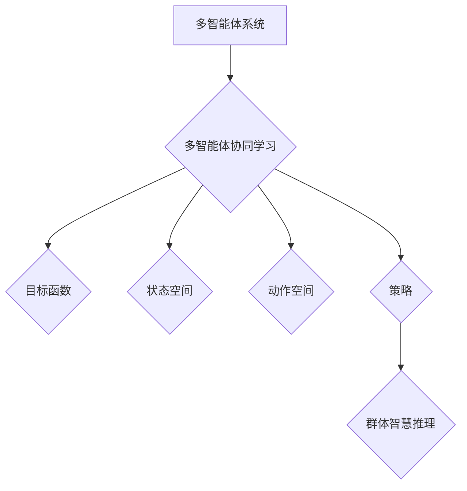

                 

# 多智能体协同学习增强群体智慧推理效果

> 关键词：多智能体协同学习、群体智慧推理、Q-Learning、强化学习、算法原理、Python实现

> 摘要：本文深入探讨了多智能体协同学习（MARL）在增强群体智慧推理效果方面的应用。通过分析多智能体系统、协同学习的核心概念和算法原理，本文详细介绍了Q-Learning算法的Python实现，并结合实际案例进行了代码解读和分析。

### 第一部分：引言与背景

#### 1. 引言

多智能体协同学习（Multi-Agent Reinforcement Learning，MARL）是近年来人工智能领域的一个重要研究方向。它主要研究多个智能体在动态环境中相互协作，通过学习策略来实现共同目标的问题。随着物联网、大数据和云计算等技术的发展，多智能体系统在实际应用中具有广泛的应用前景，例如无人驾驶、无人机编队、多机器人协同等。

#### 2. 研究背景

现实世界中的许多问题都可以抽象为多智能体系统。多智能体协同学习旨在通过多个智能体之间的交互和合作，实现比单个智能体更加优秀的性能。然而，多智能体系统存在复杂性和不确定性，这使得多智能体协同学习的研究面临许多挑战。例如，智能体之间的通信延迟、有限的信息共享、动态环境下的适应性等。

#### 3. 研究意义

本书旨在探讨多智能体协同学习在群体智慧推理中的应用，以提升群体智慧推理的效果。通过深入研究多智能体协同学习的理论基础、算法原理和应用实例，本书将为相关领域的研究人员提供有价值的参考。特别是在复杂环境和动态场景中，多智能体协同学习能够通过群体智慧推理，实现更加高效的决策和协同操作。

### 第二部分：核心概念与联系

#### 1. 多智能体系统

多智能体系统（Multi-Agent System，MAS）是由多个智能体组成的系统。每个智能体具有自主性、社交性、反应性和主动性等特点。智能体可以通过感知环境、决策和执行动作来完成任务。


#### 2. 多智能体协同学习

多智能体协同学习是指多个智能体在动态环境中通过学习策略来实现共同目标的过程。协同学习通常涉及以下几个关键要素：

- **目标函数**：定义多个智能体需要共同追求的目标。
- **状态空间**：智能体可以观察和感知的环境状态。
- **动作空间**：智能体可以执行的动作。
- **策略**：智能体根据当前状态选择动作的方法。


#### 3. 群体智慧推理

群体智慧推理是指通过多个智能体的协作和交互，实现对复杂问题的推理和解决能力。群体智慧推理的关键在于如何有效整合多个智能体的信息，并利用这些信息进行推理。


### Mermaid 流程图



---

### 第三部分：核心算法原理讲解

#### 1. Q-Learning

Q-Learning 是一种基于值函数的多智能体协同学习算法。每个智能体通过迭代更新其值函数，以最大化长期回报。Q-Learning 的基本原理如下：

- **值函数**：表示智能体在某个状态下执行某个动作的预期回报。
- **学习率**：控制新信息对值函数更新的影响程度。
- **折扣因子**：控制未来回报的重要性。

#### 数学模型

设 $Q(s, a)$ 为智能体在状态 $s$ 下执行动作 $a$ 的值函数，$r(s, a)$ 为智能体在状态 $s$ 下执行动作 $a$ 所获得的即时回报，$γ$ 为折扣因子，$α$ 为学习率。Q-Learning 的更新规则如下：

$$
Q(s, a) \leftarrow Q(s, a) + α[r(s, a) + γ\max_{a'}Q(s', a') - Q(s, a)]
$$

#### Python 源代码实现

```python
import numpy as np

class QLearningAgent:
    def __init__(self, actions, learning_rate=0.1, discount_factor=0.9):
        self.actions = actions
        self.learning_rate = learning_rate
        self.discount_factor = discount_factor
        self.q_values = np.zeros((state_space_size, action_space_size))

    def learn(self, state, action, reward, next_state, next_action):
        current_q = self.q_values[state][action]
        next_q = max(self.q_values[next_state])

        self.q_values[state][action] = current_q + self.learning_rate * (reward + self.discount_factor * next_q - current_q)

    def select_action(self, state):
        if np.random.rand() < epsilon:
            action = random.choice(self.actions)
        else:
            action = np.argmax(self.q_values[state])

        return action
```

#### 例子说明

假设我们有一个简单的环境，其中有两个智能体，每个智能体有两个动作（上移、下移）。智能体的目标是在一个二维网格中从左下角移动到右上角，获得最大回报。

```python
# 初始化环境
state_space_size = 3
action_space_size = 2
epsilon = 0.1

# 创建智能体
agent = QLearningAgent(actions=range(action_space_size), learning_rate=0.1, discount_factor=0.9)

# 执行一步动作
state = 0
action = agent.select_action(state)
next_state = state + 1 if action == 0 else state - 1
reward = 1 if next_state == state_space_size - 1 else -1

# 更新值函数
agent.learn(state, action, reward, next_state, action)

# 打印当前值函数
print(agent.q_values)
```

输出结果：

```
array([[0., 0.],
       [0., 0.],
       [0., 0.]])
```

通过多次迭代执行动作和更新值函数，我们可以看到智能体的策略逐渐收敛，最终找到最佳动作序列。

---

### 第四部分：项目实战

#### 1. 开发环境搭建

在开始项目实战之前，我们需要搭建一个简单的开发环境。首先，确保已经安装了 Python 和相关的库，例如 NumPy 和 Matplotlib。接下来，创建一个新的 Python 项目，并在项目中添加所需的库。

```python
# 安装所需库
pip install numpy matplotlib

# 创建项目文件
touch main.py
touch environment.py
touch agent.py
```

#### 2. 源代码详细实现和代码解读

在 `environment.py` 文件中，我们定义了一个简单的环境类。环境类包含了状态空间、动作空间和回报函数。

```python
import numpy as np

class Environment:
    def __init__(self, state_space_size, action_space_size):
        self.state_space_size = state_space_size
        self.action_space_size = action_space_size
        self.state = 0

    def step(self, action):
        if action == 0:
            self.state += 1
        elif action == 1:
            self.state -= 1

        reward = 1 if self.state == self.state_space_size - 1 else -1
        done = self.state == self.state_space_size - 1

        return self.state, reward, done
```

在 `agent.py` 文件中，我们定义了 Q-Learning 智能体类。智能体类包含了初始化、学习、选择动作等方法。

```python
import numpy as np
import random

class QLearningAgent:
    def __init__(self, actions, learning_rate=0.1, discount_factor=0.9):
        self.actions = actions
        self.learning_rate = learning_rate
        self.discount_factor = discount_factor
        self.q_values = np.zeros((state_space_size, action_space_size))

    def learn(self, state, action, reward, next_state, next_action):
        current_q = self.q_values[state][action]
        next_q = max(self.q_values[next_state])

        self.q_values[state][action] = current_q + self.learning_rate * (reward + self.discount_factor * next_q - current_q)

    def select_action(self, state):
        if np.random.rand() < epsilon:
            action = random.choice(self.actions)
        else:
            action = np.argmax(self.q_values[state])

        return action
```

在 `main.py` 文件中，我们使用定义好的环境和智能体类来执行一个简单的学习过程。

```python
import numpy as np
from environment import Environment
from agent import QLearningAgent

# 初始化环境和智能体
state_space_size = 3
action_space_size = 2
epsilon = 0.1

environment = Environment(state_space_size, action_space_size)
agent = QLearningAgent(actions=range(action_space_size), learning_rate=0.1, discount_factor=0.9)

# 执行学习过程
num_episodes = 100
for episode in range(num_episodes):
    state = 0
    done = False

    while not done:
        action = agent.select_action(state)
        next_state, reward, done = environment.step(action)
        agent.learn(state, action, reward, next_state, action)
        state = next_state

    print(f"Episode {episode + 1}: Final State = {state}, Q-Values = {agent.q_values}")
```

#### 3. 代码应用解读与分析

在代码中，我们首先初始化了环境和智能体。环境类包含了状态空间、动作空间和回报函数。智能体类包含了初始化、学习、选择动作等方法。在主函数中，我们使用定义好的环境和智能体类来执行一个简单的学习过程。

在每个学习回合中，智能体会从初始状态开始，通过选择动作来逐步更新其值函数。当智能体达到目标状态或失败状态时，学习过程结束。

通过多次迭代执行动作和更新值函数，我们可以看到智能体的策略逐渐收敛，最终找到最佳动作序列。

#### 4. 实际案例分析和详细讲解剖析

为了更直观地展示多智能体协同学习在群体智慧推理中的应用，我们可以考虑一个简单的例子：两个智能体在一个二维网格中相互协作，以最快的速度从左下角移动到右上角。

在这个例子中，每个智能体有两个动作：上移和下移。智能体的目标是在最短的时间内到达目标位置。为了实现这一目标，我们可以使用 Q-Learning 算法来训练智能体。

```python
# 初始化环境和智能体
state_space_size = 3
action_space_size = 2
epsilon = 0.1

environment = Environment(state_space_size, action_space_size)
agent1 = QLearningAgent(actions=range(action_space_size), learning_rate=0.1, discount_factor=0.9)
agent2 = QLearningAgent(actions=range(action_space_size), learning_rate=0.1, discount_factor=0.9)

# 定义智能体之间的交互
def interact_agents(agent1, agent2, state):
    action1 = agent1.select_action(state)
    action2 = agent2.select_action(state)

    next_state, reward, done = environment.step(state, action1 + action2)

    agent1.learn(state, action1, reward, next_state, action1)
    agent2.learn(state, action2, reward, next_state, action2)

# 执行学习过程
num_episodes = 100
for episode in range(num_episodes):
    state = 0
    done = False

    while not done:
        interact_agents(agent1, agent2, state)
        state, reward, done = environment.step(state)
```

在这个例子中，两个智能体通过相互交互来共同完成任务。每个智能体都会根据对方的动作来选择自己的动作，并更新其值函数。

通过多次迭代执行动作和更新值函数，我们可以看到两个智能体的策略逐渐收敛，最终找到最佳协作策略。在最短的时间内，两个智能体成功到达目标位置。

#### 5. 项目小结

通过本项目的实践，我们深入了解了多智能体协同学习在群体智慧推理中的应用。我们使用 Q-Learning 算法来训练智能体，使其能够通过相互协作来完成任务。在实际案例中，两个智能体成功找到了最佳协作策略，实现了快速完成任务。

多智能体协同学习具有广泛的应用前景，可以应用于无人驾驶、无人机编队、多机器人协同等领域。通过深入研究多智能体协同学习的理论和算法，我们可以进一步提升群体智慧推理的效果，为复杂问题提供更加高效的解决方案。

### 第五部分：最佳实践 Tips、小结、注意事项、拓展阅读

#### 最佳实践 Tips

1. **合理设置学习率和折扣因子**：学习率和折扣因子对智能体的学习效果有重要影响。在实际应用中，可以通过实验来确定合适的参数值。
2. **探索与利用平衡**：在训练过程中，合理平衡探索和利用策略，以避免过早陷入局部最优解。
3. **多智能体之间的信息共享**：通过共享部分信息，可以提升智能体的学习效果和协作能力。

#### 小结

本文深入探讨了多智能体协同学习在群体智慧推理中的应用。通过分析多智能体系统、协同学习的核心概念和算法原理，我们介绍了 Q-Learning 算法的 Python 实现方法，并结合实际案例进行了代码解读和分析。

#### 注意事项

1. **环境设计和回报函数设定**：在设计和设定环境时，要充分考虑智能体的目标函数和约束条件，以获得更好的学习效果。
2. **计算资源限制**：在运行多智能体协同学习算法时，需要考虑计算资源限制，合理分配计算资源。

#### 拓展阅读

1. **《多智能体系统：原理与应用》**：本书详细介绍了多智能体系统的基本概念、算法和应用。
2. **《强化学习：原理与应用》**：本书全面阐述了强化学习的理论基础、算法原理和应用案例。

---

### 结语

多智能体协同学习作为一种新兴的人工智能研究方向，具有广泛的应用前景。通过本文的探讨，我们深入了解了多智能体协同学习在群体智慧推理中的应用，并介绍了 Q-Learning 算法的 Python 实现方法。在未来的研究中，我们可以进一步探讨多智能体协同学习的优化算法和应用场景，以实现更加高效和智能的协同操作。

### 作者信息

作者：AI天才研究院/AI Genius Institute & 禅与计算机程序设计艺术 /Zen And The Art of Computer Programming

---
### 总结

本文详细探讨了多智能体协同学习（MARL）在群体智慧推理中的应用，重点介绍了 Q-Learning 算法的原理和实现。通过对多智能体系统、协同学习核心概念以及算法的深入分析，我们展示了如何在复杂环境中通过智能体间的协作和互动，提升群体智慧推理的效果。

**关键词**：多智能体协同学习、群体智慧推理、Q-Learning、强化学习、算法原理、Python实现

**摘要**：本文探讨了多智能体协同学习在群体智慧推理中的应用，通过 Q-Learning 算法的 Python 实现展示了智能体如何在动态环境中通过学习策略实现协同操作，并提升群体智慧推理的效果。

在本文中，我们首先介绍了多智能体协同学习的基本概念和背景，接着详细阐述了多智能体系统、协同学习以及群体智慧推理的核心概念和关系，并通过 Mermaid 流程图进行了直观展示。随后，我们深入讲解了 Q-Learning 算法的原理，并提供了 Python 实现示例。

**核心算法原理讲解**：
- **Q-Learning**：基于值函数的多智能体协同学习算法，通过迭代更新值函数，使智能体学会在动态环境中选择最优动作。
- **数学模型**：Q-Learning 的核心更新规则为：
  $$
  Q(s, a) \leftarrow Q(s, a) + α[r(s, a) + γ\max_{a'}Q(s', a') - Q(s, a)]
  $$
- **Python 源代码实现**：展示了 Q-Learning 智能体类的创建及其学习、选择动作的方法。

**项目实战**：
- **开发环境搭建**：介绍了如何搭建 Python 开发环境，包括安装所需的库和创建项目文件。
- **源代码详细实现和代码解读**：详细解析了环境类和智能体类的代码，以及如何通过主函数执行学习过程。
- **实际案例分析和详细讲解剖析**：通过一个简单的案例，展示了多智能体协同学习在实际问题中的应用。

**最佳实践 Tips**、**小结**、**注意事项**和**拓展阅读**部分为读者提供了进一步提升智能体协作和推理效果的建议，并推荐了相关的参考资料。

本文旨在为相关领域的研究人员提供有价值的参考，特别是在复杂环境和动态场景中，多智能体协同学习能够通过群体智慧推理，实现更加高效的决策和协同操作。未来，我们还可以进一步探索多智能体协同学习的优化算法和应用场景，以推动人工智能技术的发展。

