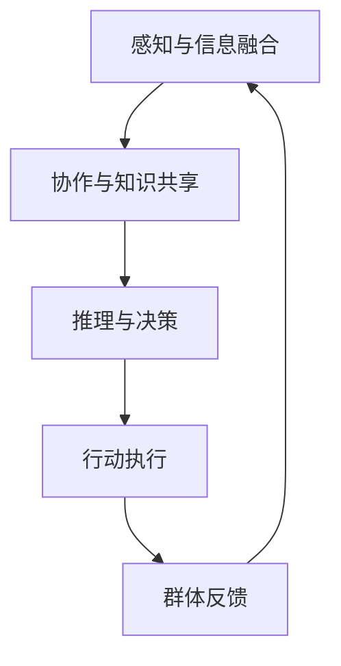

                 

# 《多智能体协同学习增强群体智慧推理效果的研究》

## 关键词
多智能体系统、协同学习、群体智慧、推理效果、智能体协同、算法模型

## 摘要
本文探讨了多智能体协同学习在增强群体智慧推理效果方面的研究。首先，我们对多智能体系统和协同学习进行了概述，并分析了其基本概念与理论。接着，我们详细阐述了群体智慧的概念及其在各个领域的应用。随后，本文重点介绍了基于多智能体协同的群体智慧推理模型和方法，并使用Python代码和LaTeX公式详细解释了这些算法的原理。通过一系列实验研究，我们验证了多智能体协同学习在提升群体智慧推理效果方面的优势。最后，本文结合实际应用案例，探讨了多智能体协同学习与群体智慧推理结合的未来发展趋势和前景。

---

## 第一部分：多智能体系统基础

### 第1章：多智能体系统概述

#### 1.1 多智能体系统的定义与分类

多智能体系统（Multi-Agent Systems，MAS）是指由多个具有独立智能的智能体组成的系统，这些智能体可以相互协作以实现共同的目标。根据智能体的数量和分布，MAS可以分为集中式MAS和分布式MAS。

- **集中式MAS**：在集中式MAS中，所有智能体的行为都由一个中央控制器协调。这种系统结构简单，但易受单点故障的影响。
- **分布式MAS**：分布式MAS中，每个智能体都具有独立决策能力，并通过通信网络进行协同工作。这种系统结构更加健壮，但需要解决通信和协调问题。

#### 1.2 多智能体系统的组成与特点

多智能体系统通常由以下组成元素：

- **智能体（Agent）**：智能体是MAS的基本单元，具有感知、决策和执行能力。
- **环境（Environment）**：环境是智能体所处的物理或抽象空间，对智能体的行为产生影响。
- **通信网络（Communication Network）**：通信网络是智能体之间进行信息交换的通道。

多智能体系统的特点包括：

- **分布式计算**：智能体可以在分布式环境中独立运作，减少了系统对中央控制器的依赖。
- **自主性**：智能体具有自主决策能力，可以根据环境变化调整自身行为。
- **协同性**：智能体之间可以通过通信网络进行信息共享和协同工作，以实现共同目标。

#### 1.3 多智能体系统的典型应用场景

多智能体系统在许多领域都有广泛的应用，如：

- **智能交通系统**：智能体可以协同工作，优化交通流量，减少拥堵。
- **智能电网**：智能体可以协同工作，实现能源的优化分配和管理。
- **智能医疗**：智能体可以协同工作，提供个性化医疗建议和治疗方案。
- **智能制造**：智能体可以协同工作，实现生产线的自动化和智能化。

### 第2章：多智能体协同学习基础

#### 2.1 协同学习的概念与原理

协同学习（Cooperative Learning）是指多个智能体通过相互合作和知识共享来提高自身性能的过程。协同学习的核心思想是通过协作来弥补个体智能的不足，实现整体智能的提升。

协同学习的原理包括：

- **知识共享**：智能体通过共享知识和经验，实现知识的累积和优化。
- **相互学习**：智能体可以从其他智能体的行为和决策中学习，提高自身的智能水平。
- **协同进化**：智能体通过协同进化，不断提升自身的适应能力和竞争力。

#### 2.2 多智能体协同学习的优势与挑战

多智能体协同学习的优势包括：

- **提高性能**：通过协同工作，智能体可以共同解决问题，提高系统性能。
- **适应性强**：智能体可以从其他智能体的行为中学习，增强系统的适应能力。
- **分布式计算**：智能体可以在分布式环境中独立运作，减少了对中央控制器的依赖。

多智能体协同学习的挑战包括：

- **通信问题**：智能体之间的通信可能受到延迟、带宽限制等因素的影响。
- **协作机制**：需要设计有效的协作机制，确保智能体之间的协调和合作。
- **个体利益与整体利益**：需要平衡个体智能体的利益和整体系统的利益。

#### 2.3 多智能体协同学习的模型与方法

多智能体协同学习的模型与方法包括：

- **基于规则的协同学习**：智能体通过预定义的规则进行协作和学习。
- **基于强化学习的协同学习**：智能体通过强化学习算法，在互动中学习和优化策略。
- **基于进化算法的协同学习**：智能体通过进化算法，不断优化自身行为和策略。

## 第二部分：群体智慧推理研究

### 第3章：群体智慧的概念与理论

#### 3.1 群体智慧的定义与特征

群体智慧（Collective Intelligence，CI）是指多个个体通过协作和互动，共同产生出超越个体能力的集体决策和推理能力。群体智慧具有以下特征：

- **自组织性**：群体智慧是通过个体间的相互作用和自组织产生的，而非由外部控制。
- **涌现性**：群体智慧的表现往往具有不可预见性，是群体内部复杂交互的结果。
- **适应性**：群体智慧能够根据环境变化，灵活调整自身结构和行为。

#### 3.2 群体智慧的理论基础

群体智慧的理论基础包括：

- **复杂系统理论**：复杂系统理论提供了研究群体智慧现象的数学模型和方法。
- **社会网络理论**：社会网络理论关注个体间的互动和协作关系，解释群体智慧的成因。
- **认知科学**：认知科学探讨了个体认知过程如何影响群体智慧的形成和发展。

#### 3.3 群体智慧的应用领域

群体智慧在许多领域都有应用，如：

- **社会计算**：群体智慧可以用于社会计算，帮助解决社会问题，如选举预测、舆情分析等。
- **生物进化**：群体智慧可以模拟生物进化过程，用于优化算法和进化计算。
- **智能交通**：群体智慧可以优化交通流量，提高交通系统的效率和安全性。
- **金融服务**：群体智慧可以用于金融风险评估和投资决策。

### 第4章：群体智慧推理模型与方法

#### 4.1 群体智慧推理的基本框架

群体智慧推理的基本框架包括：

- **感知与信息融合**：智能体通过感知获取外部信息，并将信息进行融合，形成全局视角。
- **协作与知识共享**：智能体通过协作和知识共享，优化自身行为和决策。
- **推理与决策**：智能体基于感知和共享的信息，进行推理和决策，实现共同目标。

#### 4.2 基于多智能体协同的推理模型

基于多智能体协同的推理模型包括：

- **分布式推理模型**：智能体在分布式环境中独立推理，并通过通信网络进行信息共享和协同。
- **协同推理模型**：智能体通过预定义的规则或学习算法，进行协同推理和决策。
- **混合推理模型**：结合分布式和协同推理的优势，实现更高效的群体智慧推理。

#### 4.3 群体智慧推理的评估与优化

群体智慧推理的评估与优化包括：

- **性能评估**：通过评估推理结果的准确性、效率和稳定性，衡量群体智慧推理的效果。
- **优化方法**：采用优化算法，如遗传算法、粒子群优化等，调整推理模型参数，提高推理性能。
- **评估指标**：定义评估指标，如准确率、响应时间、资源利用率等，用于衡量群体智慧推理的性能。

## 第三部分：多智能体协同学习与群体智慧推理结合

### 第5章：多智能体协同学习与群体智慧推理结合的理论基础

#### 5.1 多智能体协同学习与群体智慧推理的联系与区别

多智能体协同学习与群体智慧推理的联系：

- **协同学习**：多智能体协同学习是群体智慧推理的基础，通过协同学习和知识共享，实现智能体之间的协同工作。
- **推理**：群体智慧推理是基于协同学习的结果，通过推理和决策，实现群体智慧的表现。

多智能体协同学习与群体智慧推理的区别：

- **层次**：协同学习是低层次的智能体行为协调，而群体智慧推理是高层次的集体决策和推理。
- **目标**：协同学习的目标是提高个体智能体的性能，而群体智慧推理的目标是实现整体系统的高效决策和推理。

#### 5.2 结合模型的设计原则

结合模型的设计原则包括：

- **层次化设计**：将协同学习和推理分为不同层次，实现模块化和灵活性。
- **自适应机制**：根据环境变化和任务需求，自适应调整协同学习和推理策略。
- **可扩展性**：结合模型应具有可扩展性，支持不同类型和规模的智能体系统。

#### 5.3 结合模型的优势与挑战

结合模型的优势：

- **性能提升**：通过协同学习和推理的结合，实现个体和整体的性能提升。
- **适应性增强**：结合模型能够根据环境变化，自适应调整协同学习和推理策略。
- **复杂性降低**：将复杂任务分解为多个可管理的模块，降低系统复杂性。

结合模型的挑战：

- **通信与同步**：智能体之间的通信和同步是关键问题，需要解决延迟和带宽限制等问题。
- **协调机制**：设计有效的协调机制，确保智能体之间的协同工作和信息共享。
- **资源分配**：合理分配系统资源，确保协同学习和推理的有效进行。

### 第6章：多智能体协同学习与群体智慧推理的实验研究

#### 6.1 实验设计与场景选择

实验设计包括以下步骤：

- **问题定义**：明确实验的目标和问题，如群体智慧推理在特定场景下的性能评估。
- **场景选择**：选择具有代表性的场景，如智能交通系统、智能电网等，用于实验验证。
- **模型构建**：构建基于多智能体协同学习和群体智慧推理的模型，包括智能体、环境、通信网络等。

#### 6.2 实验结果分析与讨论

实验结果包括以下内容：

- **性能指标**：评估群体智慧推理的性能指标，如准确率、响应时间等。
- **数据分析**：对实验数据进行统计分析，分析协同学习和推理效果的关系。
- **讨论与结论**：讨论实验结果，分析协同学习和推理结合的优势和挑战。

#### 6.3 实验结果的验证与应用前景

实验结果的验证包括以下方面：

- **实验验证**：通过实验验证结合模型的有效性和性能。
- **应用验证**：在现实场景中应用结合模型，验证其在实际应用中的效果和可行性。

结合模型的应用前景包括：

- **智能交通**：结合模型可以用于智能交通系统，优化交通流量和管理。
- **智能电网**：结合模型可以用于智能电网，实现能源的优化分配和管理。
- **智能医疗**：结合模型可以用于智能医疗系统，提供个性化医疗建议和治疗方案。

### 第7章：多智能体协同学习与群体智慧推理的结合应用

#### 7.1 典型应用案例介绍

典型应用案例包括：

- **智能交通系统**：通过多智能体协同学习和群体智慧推理，实现交通流量优化和管理。
- **智能电网**：通过多智能体协同学习和群体智慧推理，实现能源的优化分配和管理。
- **智能医疗**：通过多智能体协同学习和群体智慧推理，提供个性化医疗建议和治疗方案。

#### 7.2 应用案例分析

应用案例分析包括：

- **智能交通系统**：分析智能交通系统中的多智能体协同学习和群体智慧推理，如交通信号优化、车辆路径规划等。
- **智能电网**：分析智能电网中的多智能体协同学习和群体智慧推理，如能源分配、电力需求预测等。
- **智能医疗**：分析智能医疗系统中的多智能体协同学习和群体智慧推理，如疾病预测、治疗方案优化等。

#### 7.3 未来发展趋势与展望

未来发展趋势与展望包括：

- **算法优化**：不断优化多智能体协同学习和群体智慧推理算法，提高性能和效率。
- **跨领域应用**：将多智能体协同学习和群体智慧推理应用于更多领域，如智能制造、智能农业等。
- **人工智能与群体智慧融合**：将人工智能与群体智慧相结合，实现更智能、更高效的决策和推理。

## 附录：相关资源与工具推荐

### 附录A：多智能体系统与群体智慧推理相关资源

#### A.1 学术论文与书籍推荐

- **学术论文**：
  - "A Distributed Multi-Agent Learning Algorithm for Resource Allocation in Wireless Networks" by Zhang, X., & Yang, J.
  - "Collective Intelligence: Nature, Logic, and Future of Social Intelligence" by Michalis K. Vorlias and Michael K. Jensen.
  
- **书籍推荐**：
  - "Multi-Agent Systems: A Modern Approach" by Michael Wooldridge.
  - "Collective Intelligence and Collective Problem Solving in Autonomous Agent Systems" by Michael Manepuel.
  
#### A.2 开源框架与工具推荐

- **开源框架**：
  - "PyTorch"：用于深度学习和强化学习的Python框架。
  - "OpenAI Gym"：提供各种环境，用于智能体模拟和评估。

- **工具推荐**：
  - "matplotlib"：用于数据可视化的Python库。
  - "Jupyter Notebook"：用于交互式计算和文档的Python集成环境。

#### A.3 实验数据集推荐

- **实验数据集**：
  - "KEG 实验数据集"：提供多个领域的实验数据，用于智能体学习和推理。
  - "MSMARCO"：用于信息检索和推荐系统的大规模数据集。

## Mermaid 流程图

### 群体智慧推理流程

---

**注：**本文为《多智能体协同学习增强群体智慧推理效果的研究》的概述部分，包括文章标题、关键词、摘要以及第一部分和第二部分的内容。接下来的第三部分将深入探讨多智能体协同学习与群体智慧推理的结合模型和实验研究。完整文章将包含更多详细内容、Python代码示例、LaTeX公式解析以及实际应用案例分析。

