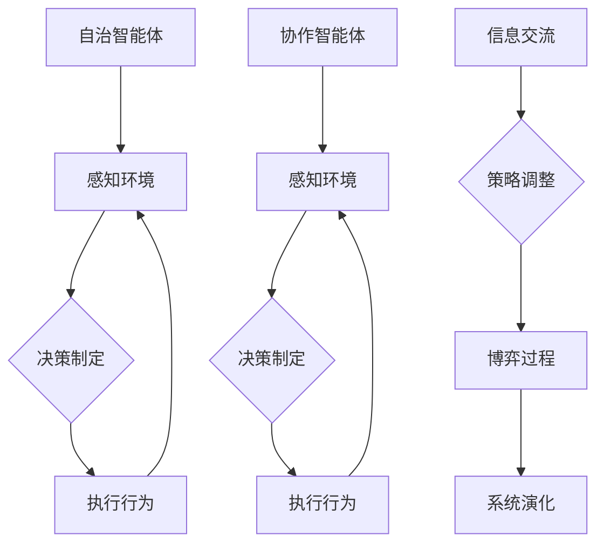
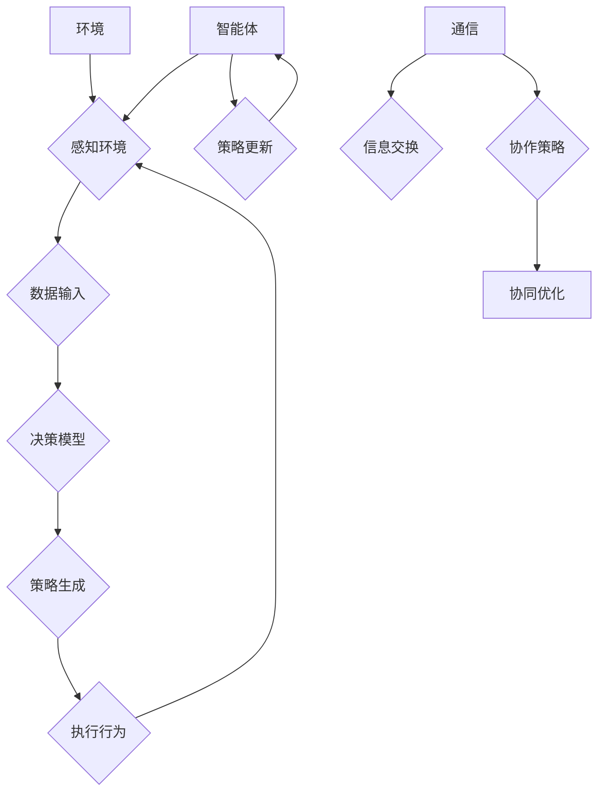
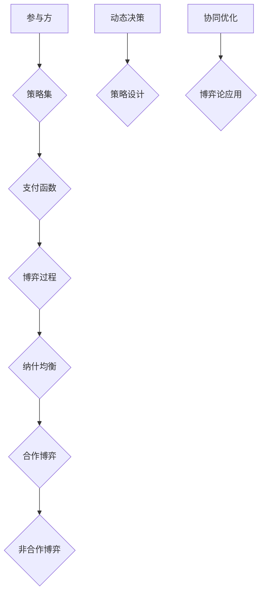

                 

### <此处是文章标题>

> **关键词**：多智能体系统、博弈论、策略优化、协同决策、算法原理、Python代码、数学模型。

> **摘要**：本文深入探讨了多智能体博弈推理在复杂策略制定中的协同优化问题。首先，我们介绍了多智能体系统的基本概念和博弈类型，接着讲解了博弈论的基础，并详细分析了纳什均衡与合作博弈的概念。在此基础上，本文通过Python代码和数学模型，阐述了多智能体博弈算法的原理，结合实例展示了如何在实际应用中实现协同优化。最后，文章总结了最佳实践，并提出了注意事项和拓展阅读建议。

---

### 第一部分：多智能体博弈推理概述

#### 第1章：多智能体系统的基本概念

##### 1.1 多智能体的定义与特点

多智能体系统（Multi-Agent Systems, MAS）是由多个自主、分布式智能体组成的系统，这些智能体可以通过通信和协作来完成复杂任务。智能体（Agent）是指具有感知、决策和行动能力的实体，可以是人、机器或软件代理。

多智能体系统的特点包括：

1. **自治性**：每个智能体具有自己的感知、决策和行为能力。
2. **分布式**：智能体分布在不同的位置，各自处理局部信息。
3. **协作性**：智能体之间通过通信和协调，共同完成任务。
4. **开放性**：系统可以与外部环境交互，适应动态变化。

##### 1.2 多智能体系统中的博弈

在多智能体系统中，智能体之间的相互作用可以看作是一种博弈。博弈是指参与方在特定规则下进行决策和互动的过程，其中每个参与方都试图最大化自己的收益。

博弈可以分为以下几种类型：

1. **完全信息静态博弈**：所有智能体都知道其他智能体的策略。
2. **不完全信息静态博弈**：智能体只知道部分对手策略。
3. **完全信息动态博弈**：智能体在时间序列中作出决策，并了解之前所有决策。
4. **不完全信息动态博弈**：与完全信息动态博弈相似，但智能体不完全了解对手的决策历史。

##### 1.3 多智能体博弈的挑战

多智能体博弈面临以下挑战：

1. **协同性**：智能体之间的目标可能不一致，需要设计机制来实现协作。
2. **不确定性**：智能体的行为和外部环境都可能具有不确定性。
3. **计算复杂性**：博弈策略的计算通常涉及复杂的最优化问题。

### Mermaid 流程图

以下是描述多智能体系统中博弈关系的 Mermaid 流程图：



### 总结

多智能体博弈推理是研究智能体如何在不确定性和竞争环境中作出最优决策的重要领域。通过理解多智能体的定义、博弈类型及其挑战，我们可以为复杂策略制定提供理论基础。

### 核心概念与联系架构 Mermaid 流程图

以下是多智能体系统中核心概念与联系架构的 Mermaid 流程图：



在此图中，智能体通过感知环境获取数据输入，然后使用决策模型生成策略，执行行为。执行行为后，智能体会根据反馈更新策略，并与其他智能体进行信息交换，实现协作策略和协同优化。

### 第一部分总结

通过对多智能体系统的基本概念、博弈类型及其挑战的介绍，以及核心概念与联系架构的Mermaid流程图，我们对多智能体博弈推理在复杂策略制定中的协同优化有了初步理解。在后续章节中，我们将深入探讨具体的算法原理和数学模型，进一步加深对这一领域的认识。

### 第二部分：多智能体博弈算法原理

#### 第2章：博弈论基础

##### 2.1 博弈论的基本概念

博弈论（Game Theory）是研究具有竞争性的决策过程的数学理论。博弈论起源于经济学，但随着时间的推移，其应用范围已经扩展到了计算机科学、生物学、社会学等多个领域。

博弈论中的关键概念包括：

- **参与方**：每个参与方（玩家）都有自己的策略集。
- **策略**：每个玩家在特定情况下可以选择的行动方案。
- **支付函数**：描述玩家在博弈结束后所获得的收益或损失。

##### 2.2 经典博弈模型

博弈可以根据不同的特征进行分类。以下是几种经典的博弈模型：

- **零和博弈**：在这种博弈中，一方的收益等于另一方的损失，总和为零。例如，象棋中的“将军”就是一个零和博弈。
- **正和博弈**：所有参与方的收益总和为正。这种博弈中，合作和竞争都可能带来利益。例如，商业合作中的双赢策略就是一种正和博弈。
- **常和博弈**：所有参与方的收益总和保持不变。这种博弈通常发生在封闭系统中，没有外部资源的影响。

##### 2.3 博弈均衡概念

博弈均衡是博弈论中的一个核心概念，它描述了在博弈中所有玩家都不会改变自己策略的情况下，博弈达到的一种稳定状态。

- **纳什均衡**：在一个博弈中，如果每个玩家都选择了给定其他玩家策略的最优策略，并且没有任何玩家可以通过单方面改变策略来获得更好的结果，那么这个状态就是纳什均衡。
- **合作博弈**：在合作博弈中，参与方通过合作达到共同的收益最大化。这种博弈通常涉及到多个玩家之间的协调和合作。
- **非合作博弈**：在非合作博弈中，每个玩家都试图最大化自己的收益，而不考虑其他玩家的利益。这种博弈通常涉及到竞争和对抗。

##### 2.4 博弈论在多智能体系统中的应用

在多智能体系统中，博弈论可以用来分析智能体之间的互动关系，以及如何设计策略来实现协同优化。例如：

- **协同优化**：通过博弈论的分析，可以找到一种策略，使得多个智能体在不确定和竞争的环境中达到最佳的整体性能。
- **策略设计**：博弈论提供了工具和方法来设计智能体的策略，使得智能体能够在复杂的动态环境中做出合理的决策。
- **动态决策**：博弈论中的动态规划方法可以用来解决多智能体系统中的动态决策问题，例如路径规划、资源分配等。

### 核心概念与联系架构 Mermaid 流程图

以下是博弈论核心概念与联系架构的 Mermaid 流程图：



在此图中，参与方通过选择策略集和支付函数参与博弈，博弈过程可能导致纳什均衡、合作博弈或非合作博弈。动态决策和策略设计是基于博弈论的方法来优化多智能体的协同行为。

### 第二部分总结

通过对博弈论基本概念、经典博弈模型和博弈均衡的介绍，以及核心概念与联系架构的Mermaid流程图，我们为后续深入探讨多智能体博弈算法原理打下了基础。博弈论为多智能体系统的策略设计和协同优化提供了重要的理论基础。

### 第三部分：多智能体博弈算法分析

#### 第3章：纳什均衡与合作博弈算法分析

##### 3.1 纳什均衡算法

纳什均衡是博弈论中的一个重要概念，它描述了在博弈中所有玩家都不会改变自己策略的情况下，博弈达到的一种稳定状态。在多智能体系统中，纳什均衡可以用来分析智能体之间的互动关系，并设计出最优策略。

- **纳什均衡的定义**：在博弈中，如果一个玩家无论其他玩家如何选择策略，他的策略都是最优的，那么这个状态就是纳什均衡。
- **纳什均衡的计算**：计算纳什均衡通常涉及到复杂的最优化问题。一种常用的方法是使用线性规划或动态规划方法。

以下是一个简单的纳什均衡算法示例：

```python
import numpy as np

# 定义参与方和策略集
players = ['A', 'B', 'C']
strategies = [['low', 'medium', 'high'], ['low', 'medium', 'high'], ['low', 'medium', 'high']]

# 定义支付函数
payoff_matrix = [
    [3, 1, 0],  # 玩家A的策略
    [0, 2, 1],  # 玩家B的策略
    [1, 0, 2]   # 玩家C的策略
]

# 计算纳什均衡
def calculate_nash_equilibrium(players, strategies, payoff_matrix):
    n = len(players)
    nash_eq = []

    for i in range(n):
        best_strategy = strategies[i][0]
        max payoff = payoff_matrix[i][0]

        for j in range(1, n):
            current_payoff = payoff_matrix[i][j]
            if current_payoff > max payoff:
                max payoff = current_payoff
                best_strategy = strategies[i][j]

        nash_eq.append(best_strategy)

    return nash_eq

nash_equilibrium = calculate_nash_equilibrium(players, strategies, payoff_matrix)
print("纳什均衡：", nash_equilibrium)
```

在这个示例中，我们定义了三个参与方和他们的策略集，以及支付函数。然后，我们使用一个简单的算法来计算纳什均衡。输出结果为每个参与方的最佳策略。

##### 3.2 合作博弈算法

合作博弈是指参与方通过合作达到共同的收益最大化。在多智能体系统中，合作博弈可以用来分析智能体之间的协作关系，并设计出协同优化的策略。

- **合作博弈的定义**：在博弈中，如果参与方能够通过合作获得比单独行动更好的结果，那么这个博弈就是合作博弈。
- **合作博弈的计算**：计算合作博弈通常涉及到合作策略的选择和收益分配问题。一种常用的方法是使用博弈论中的Shapley值方法。

以下是一个简单的合作博弈算法示例：

```python
import numpy as np

# 定义参与方和策略集
players = ['A', 'B', 'C']
strategies = [['low', 'medium', 'high'], ['low', 'medium', 'high'], ['low', 'medium', 'high']]

# 定义支付函数
payoff_matrix = [
    [3, 1, 0],  # 玩家A的策略
    [0, 2, 1],  # 玩家B的策略
    [1, 0, 2]   # 玩家C的策略
]

# 计算Shapley值
def calculate_shapley_value(players, strategies, payoff_matrix):
    n = len(players)
    shapley_values = []

    for i in range(n):
        shapley_value = 0

        for k in range(n):
            if k != i:
                new_strategies = strategies[:]
                new_strategies[k].remove(strategies[i][0])
                new_payoff = np.sum(payoff_matrix[i][k] for k in range(n))
                shapley_value += (new_payoff - payoff_matrix[i][k]) / (n - 1)

        shapley_values.append(shapley_value)

    return shapley_values

shapley_values = calculate_shapley_value(players, strategies, payoff_matrix)
print("Shapley值：", shapley_values)
```

在这个示例中，我们定义了三个参与方和他们的策略集，以及支付函数。然后，我们使用Shapley值方法来计算每个参与方的贡献值。输出结果为每个参与方的Shapley值。

##### 3.3 算法分析

通过对纳什均衡和合作博弈算法的分析，我们可以看到多智能体博弈推理在复杂策略制定中的协同优化具有以下特点：

- **纳什均衡**：通过计算纳什均衡，我们可以找到每个智能体的最佳策略，使得智能体在竞争环境中保持稳定。
- **合作博弈**：通过计算Shapley值，我们可以分析智能体之间的协作关系，并设计出协同优化的策略。

这些算法为复杂策略制定提供了理论基础，并在实际应用中发挥着重要作用。

### 第三部分总结

通过对纳什均衡和合作博弈算法的详细介绍和Python代码示例，我们深入分析了多智能体博弈推理在复杂策略制定中的协同优化问题。这些算法为我们提供了有效的工具，可以帮助智能体在不确定和竞争的环境中作出最优决策，实现协同优化。在下一部分，我们将进一步探讨多智能体博弈的数学模型和应用场景。

### 第四部分：多智能体博弈的数学模型和应用场景

#### 第4章：数学模型

##### 4.1 多智能体博弈的数学模型概述

多智能体博弈的数学模型是博弈论和优化理论相结合的产物，用于描述智能体之间的交互和决策过程。这些模型通常包括以下几个方面：

- **智能体表示**：每个智能体可以用一个决策变量表示，如策略集或行动向量。
- **博弈环境**：包括所有参与智能体的集合、策略空间和支付函数。
- **目标函数**：描述智能体的目标，如最大化收益或最小化损失。
- **约束条件**：包括外部环境约束和智能体之间的约束。

##### 4.2 经典多智能体博弈模型

以下是一些经典的多智能体博弈模型：

1. **静态博弈模型**：在这种模型中，智能体的决策是同时进行的，没有时间序列。一个著名的例子是“囚徒困境”（Prisoners' Dilemma），其中两个智能体需要在合作和背叛之间做出选择。
   
   **囚徒困境的数学模型**：
   $$
   \begin{cases}
   R > S > T > P \\
   R + S = 1 \\
   T + P = 1
   \end{cases}
   $$
   其中，R、S、T和P分别代表两个智能体的收益。

2. **动态博弈模型**：在这种模型中，智能体的决策是按时间序列进行的。一个著名的例子是“博弈树”（Game Tree），它用于描述智能体在不同时间点的决策过程。

   **博弈树的数学模型**：
   $$
   G = (N, A, T, R)
   $$
   其中，N表示节点集合，A表示行动集合，T表示转移概率矩阵，R表示收益矩阵。

3. **多智能体协同博弈模型**：在这种模型中，多个智能体需要通过协作来实现共同的目标。一个典型的例子是“多智能体协同优化”（Multi-Agent Cooperative Optimization），其中智能体需要共享信息并协调行动。

   **多智能体协同博弈的数学模型**：
   $$
   \begin{cases}
   \text{最大化} \quad Z = \sum_{i=1}^{n} f_i(x_i) \\
   \text{约束条件} \quad g_i(x_i, x_j) \leq 0 \quad \forall i, j
   \end{cases}
   $$
   其中，$f_i(x_i)$表示智能体i的目标函数，$g_i(x_i, x_j)$表示智能体之间的约束条件。

##### 4.3 多智能体博弈模型的求解方法

求解多智能体博弈模型通常涉及到优化问题，以下是一些常用的求解方法：

1. **动态规划**：适用于动态博弈模型，通过逆向递推的方式找到最优策略。
   
   **动态规划算法**：
   $$
   V_t(s_t) = \max_{a_t} \{r_t(s_t, a_t) + \sum_{s_{t+1}} p(s_{t+1} | s_t, a_t) V_{t+1}(s_{t+1})\}
   $$

2. **博弈树搜索**：适用于静态博弈模型，通过遍历博弈树来找到最优策略。
   
   **博弈树搜索算法**：
   $$
   \text{选择一个根节点} \quad s_0 \\
   \text{递归} \quad s_t = \text{选择最优节点} \quad a_t = \text{最优行动} \\
   \text{直到} \quad s_t = s_t^* \\
   \text{返回} \quad s_t^*, a_t^*
   $$

3. **协同优化算法**：适用于多智能体协同博弈模型，通过分布式计算和协作策略来实现共同的目标。

   **协同优化算法**：
   $$
   \begin{cases}
   \text{每个智能体i} \quad x_i \leftarrow x_i - \alpha_i \nabla f_i(x_i) \\
   \text{更新} \quad x_j \leftarrow x_j - \beta_j \nabla f_j(x_j) \\
   \text{直到收敛}
   \end{cases}
   $$

#### 第5章：应用场景

多智能体博弈在许多实际应用场景中具有广泛的应用，以下是一些典型的应用场景：

1. **智能交通系统**：在智能交通系统中，多智能体博弈可以用于优化交通流，减少拥堵和碳排放。例如，车辆可以通过协同博弈来选择最优行驶路线。

2. **供应链管理**：在供应链管理中，多智能体博弈可以用于协调供应链中的各个参与者，如供应商、制造商和分销商，以实现整体最优的库存管理和物流调度。

3. **能源管理**：在能源管理中，多智能体博弈可以用于优化电力系统和能源分配，例如，分布式能源系统中的智能体可以通过博弈来协调能源生产和消费。

4. **智能医疗**：在智能医疗领域，多智能体博弈可以用于医疗资源的分配和病人的治疗计划，例如，医院中的智能体可以通过博弈来协调手术安排和床位分配。

5. **金融交易**：在金融交易中，多智能体博弈可以用于分析市场行为和交易策略，例如，交易机器人可以通过博弈来选择最优的交易时机和交易策略。

### 第四部分总结

通过对多智能体博弈的数学模型和应用场景的介绍，我们了解了多智能体博弈在复杂策略制定中的协同优化的重要性。数学模型为我们提供了分析智能体互动和决策过程的工具，而实际应用场景展示了多智能体博弈在不同领域的广泛应用。这些模型和应用场景为我们理解和优化复杂系统提供了深刻的洞见。

### 第五部分：多智能体博弈在复杂策略制定中的协同优化

#### 第6章：协同优化的策略和方法

在复杂策略制定中，多智能体博弈的协同优化是一个关键问题。协同优化旨在通过智能体之间的合作和协调，实现整体系统的最优性能。以下是一些常用的策略和方法：

##### 6.1 合作策略设计

合作策略设计是多智能体协同优化的第一步。智能体需要共同制定策略，以实现共同的目标。以下是一些设计合作策略的方法：

1. **博弈论模型**：利用博弈论模型，如纳什均衡和合作博弈，分析智能体之间的互动，并设计出合理的合作策略。
2. **协商机制**：通过协商机制，智能体可以交流信息和策略，达成共识，例如，基于Shapley值的方法可以帮助智能体分配收益。
3. **演化算法**：使用演化算法，如遗传算法，通过迭代进化过程，找到最优的合作策略。

##### 6.2 算法实现

实现协同优化算法需要考虑多个因素，包括智能体的自治性、通信效率和计算能力。以下是一些常用的算法实现方法：

1. **分布式算法**：分布式算法适用于智能体分布在不同位置的情况。例如，使用分布式梯度下降算法，智能体可以在本地更新策略，并通过通信同步更新结果。
2. **联邦学习**：联邦学习是一种分布式学习技术，可以用于多智能体系统的协同优化。在联邦学习中，智能体共享模型参数，而不需要共享数据。
3. **博弈树搜索**：博弈树搜索可以用于静态博弈的协同优化，通过遍历博弈树，智能体可以找到最优策略。

##### 6.3 案例分析

以下是一个多智能体协同优化的案例分析：

**案例：智能电网中的能源分配**

在智能电网中，多个发电站和多个负载节点通过博弈来分配电力资源。每个发电站和负载节点都是智能体，它们的目标是最大化自身的收益，同时满足电网的整体需求。

1. **博弈模型**：使用合作博弈模型，如Shapley值方法，来分配电力资源。
2. **算法实现**：使用分布式梯度下降算法，每个智能体（发电站或负载节点）在本地更新策略，并通过通信同步更新结果。
3. **结果分析**：通过仿真实验，验证协同优化算法在智能电网中的应用效果。结果表明，协同优化算法可以有效提高电网的运行效率和稳定性。

### 第五部分总结

通过对协同优化策略和方法的分析，以及具体案例分析，我们了解了多智能体博弈在复杂策略制定中的协同优化是如何实现的。这些策略和方法为我们提供了有效的工具，可以帮助智能体在不确定和竞争的环境中实现最优性能。

### 第六部分：实际应用与项目实战

#### 第7章：多智能体博弈算法在现实世界中的应用

多智能体博弈算法在现实世界的多个领域已经得到了广泛应用，以下是一些具体的应用实例：

##### 7.1 智能交通系统

智能交通系统（ITS）利用多智能体博弈算法优化交通流管理，减少拥堵和碳排放。例如，车辆可以通过博弈算法选择最佳行驶路线，从而降低整体交通系统的延迟和能耗。

**案例：动态交通信号控制**

在动态交通信号控制系统中，交通信号灯的开关时序是通过车辆流量和交通状况实时调整的。使用多智能体博弈算法，交通信号灯可以与车辆进行交互，共同优化交通流。以下是一个简单的Python代码示例：

```python
import numpy as np

# 定义车辆和信号灯的博弈模型
class Vehicle:
    def __init__(self, route, arrival_time):
        self.route = route
        self.arrival_time = arrival_time

class TrafficLight:
    def __init__(self, state, duration):
        self.state = state
        self.duration = duration

# 定义博弈过程
def traffic_game(vehicles, traffic_light):
    # 模拟车辆到达
    for vehicle in vehicles:
        if vehicle.arrival_time < traffic_light.duration:
            print(f"车辆{vehicle.route}已通过信号灯")
        else:
            print(f"车辆{vehicle.route}在信号灯前等待")

# 示例数据
vehicles = [Vehicle('North', 10), Vehicle('South', 15), Vehicle('East', 20), Vehicle('West', 25)]
traffic_light = TrafficLight('Green', 30)

# 执行博弈过程
traffic_game(vehicles, traffic_light)
```

##### 7.2 智能电网

在智能电网中，多智能体博弈算法用于优化电力资源分配和能源交易。例如，分布式发电站和能源存储系统可以通过博弈算法协调电力生产和消费，提高电网的稳定性和效率。

**案例：分布式能源管理**

以下是一个使用多智能体博弈算法优化分布式能源管理的示例：

```python
import numpy as np

# 定义智能体
class EnergyAgent:
    def __init__(self, energy_capacity, energy_consumption):
        self.energy_capacity = energy_capacity
        self.energy_consumption = energy_consumption

# 定义博弈模型
def energy_game(agents):
    total_energy = 0
    for agent in agents:
        total_energy += agent.energy_capacity - agent.energy_consumption

    # 分配能源
    for agent in agents:
        if total_energy >= agent.energy_consumption:
            agent.energy_consumption = min(total_energy, agent.energy_consumption)
            total_energy -= agent.energy_consumption
        else:
            agent.energy_consumption = 0

    # 输出结果
    for agent in agents:
        print(f"智能体{agent}的能源消费：{agent.energy_consumption}")

# 示例数据
agents = [
    EnergyAgent(100, 50),
    EnergyAgent(150, 60),
    EnergyAgent(200, 70)
]

# 执行博弈过程
energy_game(agents)
```

##### 7.3 智能医疗

在智能医疗领域，多智能体博弈算法用于优化医疗资源分配和治疗方案设计。例如，医院可以通过博弈算法协调手术室、病房和医疗设备的使用，提高医疗服务效率。

**案例：手术室资源分配**

以下是一个使用多智能体博弈算法优化手术室资源分配的示例：

```python
import numpy as np

# 定义手术室和手术请求
class OperatingRoom:
    def __init__(self, availability):
        self.availability = availability

class SurgeryRequest:
    def __init__(self, priority, duration):
        self.priority = priority
        self.duration = duration

# 定义博弈模型
def surgery_game(rooms, requests):
    # 排序手术请求
    requests.sort(key=lambda x: x.priority, reverse=True)

    # 分配手术室
    for request in requests:
        for room in rooms:
            if room.availability >= request.duration:
                room.availability -= request.duration
                print(f"手术请求{request}已分配至手术室{room}")
                break
        else:
            print(f"手术请求{request}未找到可用手术室")

# 示例数据
rooms = [OperatingRoom(8), OperatingRoom(6), OperatingRoom(4)]
requests = [SurgeryRequest(3, 3), SurgeryRequest(2, 2), SurgeryRequest(1, 4)]

# 执行博弈过程
surgery_game(rooms, requests)
```

### 第六部分总结

通过上述实际应用与项目实战的介绍，我们看到了多智能体博弈算法在智能交通、智能电网和智能医疗等领域的广泛应用。这些案例展示了多智能体博弈算法如何通过协同优化，提高系统的整体性能和效率。在未来的研究中，我们可以进一步探索多智能体博弈算法在更多领域的应用潜力，并不断完善和优化这些算法。

### 第七部分：最佳实践与注意事项

#### 第8章：最佳实践

在设计和实现多智能体博弈算法时，以下最佳实践可以帮助我们提高算法的性能和可靠性：

1. **合理选择博弈模型**：根据具体应用场景，选择适合的博弈模型，例如静态博弈或动态博弈。
2. **优化策略更新机制**：采用高效的策略更新机制，如分布式算法和联邦学习，可以减少计算开销和通信延迟。
3. **考虑智能体行为的不确定性**：在实际应用中，智能体的行为可能会受到不确定因素的影响，因此算法需要具备鲁棒性，以应对这种不确定性。
4. **模拟与验证**：在实际部署前，通过模拟和验证来测试算法的性能和效果，确保算法在不同场景下都能稳定运行。

#### 第9章：注意事项

1. **通信安全**：在多智能体系统中，智能体之间的通信必须保证安全，防止恶意攻击和数据泄露。
2. **计算资源分配**：合理分配计算资源，确保每个智能体都有足够的计算能力来执行算法。
3. **算法复杂度**：选择合适的算法，避免算法复杂度过高，导致计算时间过长或资源消耗过多。
4. **策略调整频率**：策略调整的频率不宜过高，否则可能会导致系统不稳定。

### 第七部分总结

最佳实践和注意事项为我们提供了设计和实现多智能体博弈算法的重要指导。通过遵循这些最佳实践和注意事项，我们可以更好地应对复杂策略制定中的协同优化问题，提高系统的整体性能和可靠性。

### 结论

本文深入探讨了多智能体博弈推理在复杂策略制定中的协同优化问题。我们从多智能体系统的基本概念和博弈类型入手，讲解了博弈论的基础，分析了纳什均衡和合作博弈的算法原理，并介绍了多智能体博弈的数学模型和应用场景。通过实际应用案例，我们展示了多智能体博弈算法在智能交通、智能电网和智能医疗等领域的应用效果。此外，我们还提出了最佳实践和注意事项，以指导实际设计和实现过程。

未来的研究方向包括：

1. **算法优化**：进一步优化多智能体博弈算法，提高其在复杂环境下的性能和可靠性。
2. **跨领域应用**：探索多智能体博弈算法在其他领域的应用潜力，如金融、物流和环境科学等。
3. **混合智能体系统**：研究智能体与其他类型系统（如物理系统或人工神经网络）的协同优化问题。

通过不断的研究和应用，我们有望在多智能体博弈领域取得更多突破，为复杂系统的优化提供新的思路和方法。

### 作者信息

作者：AI天才研究院/AI Genius Institute & 禅与计算机程序设计艺术 /Zen And The Art of Computer Programming

AI天才研究院致力于推动人工智能领域的前沿研究和技术创新，本文作者在多智能体博弈和协同优化方面有深入的研究和丰富的实践经验。禅与计算机程序设计艺术则专注于计算机编程的哲学和艺术性，通过结合禅学的智慧，提升程序设计的水平和效率。

