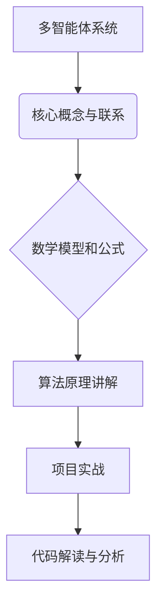

                 

### 第1章：引论

#### 1.1 多智能体系统的定义与基本概念

多智能体系统（Multi-Agent System，MAS）是人工智能领域的一个重要研究方向，它由多个自主智能体组成，这些智能体可以通过交互和协作来解决问题。在多智能体系统中，每个智能体都拥有一定的智能，能够自主地感知环境、制定决策并执行动作。它们通过协作和交互来实现整体目标，这使得多智能体系统在解决复杂问题上具有显著优势。

**多智能体系统的定义**：

多智能体系统（MAS）是一种分布式计算模型，它由一组自主智能体组成，这些智能体相互协作，共同实现一个或多个目标。每个智能体都能够感知环境、制定决策并执行动作，同时与其他智能体进行交互。

**多智能体系统的基本特征**：

1. **自主性**：每个智能体都能够独立地感知环境、制定决策并执行动作。
2. **分布性**：智能体分布在不同的计算节点上，通过通信机制进行协作。
3. **适应性**：智能体能够根据环境变化动态调整其行为。
4. **协同性**：智能体之间通过交互和协作来共同实现目标。

**多智能体系统的起源与发展**：

多智能体系统的概念最早可以追溯到20世纪80年代。当时，随着分布式计算和人工智能技术的发展，人们开始探索如何通过多个智能体的协作来解决复杂问题。早期的多智能体系统主要应用于军事模拟、游戏和模拟等领域。随着技术的不断进步，多智能体系统逐渐应用于更多的实际场景，如物流调度、智能交通管理、医疗健康等。

#### 1.2 多智能体系统在复杂问题解决中的作用

**复杂问题的概念**：

复杂问题是指那些难以通过单一方法或系统解决的问题。这类问题通常具有大量的变量、高度的非线性关系以及动态变化的特征，使得传统的单智能体方法难以应对。

**多智能体系统解决复杂问题的优势**：

1. **分布式计算**：多智能体系统可以将问题分解为多个子任务，分布式地在多个智能体上执行，从而提高计算效率。
2. **协同解决**：多个智能体可以协同工作，共同解决问题，提高解决问题的能力。
3. **自适应和自组织**：智能体可以根据环境变化动态调整行为，形成自组织结构，从而更好地适应复杂环境。

**多智能体系统解决复杂问题的适用场景**：

1. **物流调度**：多智能体系统可以优化运输路径、减少运输时间、提高运输效率。
2. **智能交通管理**：多智能体系统可以实时监控交通状况、预测交通拥堵、优化交通流量。
3. **医疗健康**：多智能体系统可以协助医生进行诊断、制定治疗方案、优化医疗资源分配。

#### 1.3 本章小结

本章介绍了多智能体系统的基本概念、特征及其在复杂问题解决中的作用。多智能体系统通过自主性、分布性、适应性和协同性等特征，能够在复杂问题解决中发挥重要作用。本章为后续章节的讨论奠定了基础。

## 第2章：多智能体系统的基本原理

#### 2.1 多智能体系统的架构

多智能体系统的架构设计直接影响到系统的性能、可扩展性和可靠性。根据不同的应用需求，多智能体系统的架构可以分为分布式架构、集中式架构和混合式架构。

**2.1.1 分布式架构**

分布式架构是指智能体分布在不同的计算节点上，通过通信网络进行协作和交互。在分布式架构中，每个智能体都拥有一定的计算能力和决策能力，能够独立地执行任务。智能体之间的通信通常采用异步通信机制，如消息传递。

**分布式架构的优势**：

- **可扩展性**：分布式架构可以方便地扩展智能体的数量和计算资源。
- **容错性**：即使某个智能体或计算节点出现故障，系统仍然可以正常运行。

**分布式架构的挑战**：

- **通信开销**：智能体之间的通信可能会带来一定的延迟和带宽压力。
- **一致性维护**：分布式系统中需要维护一致性，这可能会增加系统的复杂度。

**2.1.2 集中式架构**

集中式架构是指所有的智能体都集中在同一个计算节点上，由一个中央控制单元进行集中控制。在集中式架构中，智能体之间的交互是通过中央控制单元进行的，因此系统的通信开销较小。

**集中式架构的优势**：

- **简化通信**：智能体之间的交互直接由中央控制单元处理，通信开销较小。
- **一致性维护**：集中式架构可以更容易地维护系统的一致性。

**集中式架构的挑战**：

- **单点故障**：如果中央控制单元出现故障，整个系统可能会崩溃。
- **可扩展性差**：集中式架构难以扩展智能体的数量和计算资源。

**2.1.3 混合式架构**

混合式架构是分布式架构和集中式架构的结合，它具有两者的优点。在混合式架构中，部分智能体采用分布式架构，负责执行具体的任务；另一部分智能体采用集中式架构，负责全局控制和协调。

**混合式架构的优势**：

- **高效协同**：分布式智能体可以高效地执行具体任务，集中式智能体可以全局协调，实现高效协作。
- **可扩展性强**：混合式架构可以方便地扩展智能体的数量和计算资源。

**混合式架构的挑战**：

- **复杂度增加**：混合式架构相比单一架构，其设计和实现更为复杂。
- **一致性维护**：混合式架构需要同时维护分布式和集中式的一致性，这可能会增加系统的复杂度。

#### 2.2 多智能体系统的通信机制

多智能体系统的通信机制是智能体之间进行信息交换和协作的基础。根据通信的方式和机制，多智能体系统的通信机制可以分为直接通信和间接通信。

**2.2.1 直接通信**

直接通信是指智能体之间通过直接的消息传递进行通信。在直接通信中，智能体可以直接发送消息给其他智能体，并接收来自其他智能体的消息。

**直接通信的优势**：

- **实时性强**：直接通信可以快速传递消息，实现实时交互。
- **灵活性强**：智能体可以根据需要直接与其他智能体进行通信，具有很高的灵活性。

**直接通信的挑战**：

- **通信开销**：智能体之间的直接通信可能会带来一定的延迟和带宽压力。
- **拓扑约束**：直接通信要求智能体之间的拓扑结构相对固定，这在某些复杂环境中可能难以实现。

**2.2.2 间接通信**

间接通信是指智能体通过一个中间节点进行通信。在间接通信中，智能体首先将消息发送给中间节点，然后中间节点将消息转发给目标智能体。

**间接通信的优势**：

- **通信开销小**：间接通信可以减少智能体之间的直接通信，降低通信开销。
- **拓扑适应性**：间接通信可以适应复杂的拓扑结构，即使智能体之间的连接不稳定，也可以通过中间节点进行通信。

**间接通信的挑战**：

- **延迟较高**：间接通信需要经过中间节点的转发，可能会带来一定的延迟。
- **中间节点失效**：如果中间节点出现故障，整个通信链路可能会中断。

**2.2.3 通信协议与语言**

为了实现智能体之间的有效通信，多智能体系统需要定义一套通信协议和语言。通信协议定义了智能体之间通信的规则和标准，通信语言则是用于表示和传递信息的工具。

常见的通信协议包括：

- **TCP/IP**：传输控制协议/互联网协议，是一种广泛使用的网络通信协议。
- **DDS**：数据分布服务，是一种数据交换中间件，适用于实时分布式系统。
- **RESTful API**：是一种基于HTTP的API设计风格，适用于Web服务。

常见的通信语言包括：

- **XML**：可扩展标记语言，用于表示结构化数据。
- **JSON**：JavaScript对象表示法，用于表示轻量级的数据结构。
- **Protobuf**：Google开发的一种数据序列化格式，适用于高效的数据传输。

#### 2.3 多智能体系统的协作策略

多智能体系统的协作策略是指智能体之间如何通过协作和交互来共同实现目标。协作策略的选择和设计直接影响到多智能体系统的性能和效率。

**2.3.1 协作模式**

协作模式是指智能体之间的协作方式。根据协作方式的不同，协作模式可以分为以下几种：

1. **任务分配模式**：智能体根据任务需求分配任务，各自独立完成任务。
2. **协同决策模式**：智能体共同参与决策过程，共同制定决策。
3. **分布式计算模式**：智能体通过分布式计算共同完成计算任务。
4. **协同优化模式**：智能体通过协同优化算法共同优化目标函数。

**2.3.2 协作算法**

协作算法是指智能体之间如何通过协作实现共同目标的具体方法。常见的协作算法包括：

1. **领导者-跟随者算法**：其中一个智能体担任领导者，其他智能体作为跟随者，领导者负责协调和指导其他智能体的行为。
2. **协同滤波算法**：智能体通过协同滤波器更新自己的状态，以实现全局最优。
3. **分布式梯度下降算法**：智能体通过分布式计算更新参数，以优化目标函数。

**2.3.3 协作策略的选择与优化**

协作策略的选择和优化是设计多智能体系统的重要环节。在选择协作策略时，需要考虑以下因素：

- **任务特点**：根据任务的需求选择合适的协作模式。
- **智能体能力**：考虑智能体的计算能力和通信能力，选择适合的协作算法。

在优化协作策略时，可以采用以下方法：

- **模拟退火算法**：通过模拟退火算法优化协作策略，找到最优协作配置。
- **遗传算法**：通过遗传算法优化协作策略，实现智能体的自适应调整。
- **强化学习**：通过强化学习优化协作策略，实现智能体的自主学习和优化。

#### 2.4 本章小结

本章详细介绍了多智能体系统的基本原理，包括架构、通信机制和协作策略。分布式架构、直接通信和领导者-跟随者算法是多智能体系统的重要特征。通过本章的学习，读者可以了解多智能体系统的工作原理，为后续章节的应用和实践打下基础。

## 第3章：多智能体系统在复杂问题解决中的应用

#### 3.1 多智能体系统在物流调度中的应用

**3.1.1 物流调度问题的概述**

物流调度是现代物流系统中一个关键环节，涉及运输路径规划、资源分配、货物配送等一系列复杂问题。随着电子商务的快速发展，物流调度问题变得越来越复杂，如何高效地解决物流调度问题成为亟待解决的难题。

**物流调度问题的核心挑战**：

- **运输路径规划**：如何在给定的时间和资源约束下，规划最优的运输路径。
- **资源分配**：如何合理分配运输资源，如车辆、人员等，以最大化运输效率。
- **货物配送**：如何确保货物按时送达，满足客户需求。

**3.1.2 多智能体系统在物流调度中的应用场景**

多智能体系统在物流调度中的应用主要包括以下几个方面：

1. **路径规划**：多智能体系统可以通过分布式计算，实时规划最优运输路径，减少运输时间。
2. **资源分配**：多智能体系统可以根据实时交通状况和货物需求，动态调整资源分配策略，提高资源利用率。
3. **货物配送**：多智能体系统可以协同工作，共同完成货物配送任务，提高配送效率。

**3.1.3 多智能体系统在物流调度中的应用案例**

**案例一：电商物流配送**

某电商公司在高峰期通过多智能体系统优化物流配送，具体应用如下：

1. **路径规划**：多智能体系统根据实时交通状况和订单需求，实时规划运输路径，避免交通拥堵，提高运输效率。
2. **资源分配**：多智能体系统根据仓库库存和订单量，动态调整车辆和人员的分配，确保货物及时配送。
3. **协同配送**：多智能体系统通过协同工作，将货物从仓库运送到客户手中，提高配送效率。

**3.1.4 多智能体系统在物流调度中的设计**

多智能体系统在物流调度中的设计主要包括以下方面：

1. **智能体定义**：定义运输车辆、仓库、配送员等智能体，赋予其相应的感知、决策和执行能力。
2. **通信机制**：设计智能体之间的通信机制，如消息传递协议，确保智能体之间能够实时通信。
3. **协作算法**：设计协同优化算法，如领导者-跟随者算法，实现智能体之间的协同工作。

**3.1.5 多智能体系统在物流调度中的性能评估**

多智能体系统在物流调度中的性能评估主要包括以下方面：

1. **效率指标**：评估运输路径规划、资源分配和货物配送的效率，如运输时间、配送成功率等。
2. **可靠性指标**：评估系统在面临突发状况时的可靠性，如交通拥堵、设备故障等。
3. **可扩展性指标**：评估系统在智能体数量增加时的可扩展性，如计算资源、通信带宽等。

**3.2 本章小结**

本章详细介绍了多智能体系统在物流调度中的应用，包括应用场景、应用案例和系统设计。通过多智能体系统的应用，可以有效解决物流调度中的复杂问题，提高运输效率和配送成功率。

## 第4章：多智能体系统的算法实现

#### 4.1 多智能体系统的算法概述

多智能体系统中的算法是实现智能体协同工作和解决问题的重要工具。根据不同的应用场景和问题特点，多智能体系统算法可以分为分布式算法、协同优化算法和模式识别与机器学习算法。

**4.1.1 分布式算法**

分布式算法是多智能体系统中最基本的算法，主要用于实现智能体之间的协同工作和信息共享。常见的分布式算法包括：

1. **领导者-跟随者算法**：其中一个智能体作为领导者，其他智能体作为跟随者，领导者负责协调和指导其他智能体的行为。
2. **协同滤波算法**：智能体通过协同滤波器更新自己的状态，以实现全局最优。
3. **分布式梯度下降算法**：智能体通过分布式计算更新参数，以优化目标函数。

**4.1.2 协同优化算法**

协同优化算法主要用于解决多智能体系统中的优化问题，如资源分配、路径规划等。常见的协同优化算法包括：

1. **模拟退火算法**：通过模拟退火过程，找到最优解。
2. **遗传算法**：通过遗传操作，优化智能体的策略。
3. **蚁群算法**：通过模拟蚂蚁觅食行为，找到最优路径。

**4.1.3 模式识别与机器学习算法**

模式识别与机器学习算法用于实现智能体的自主学习和自适应能力，常见算法包括：

1. **监督学习算法**：如线性回归、支持向量机等，用于预测和分类。
2. **无监督学习算法**：如聚类、主成分分析等，用于数据降维和模式识别。
3. **深度学习算法**：如卷积神经网络、循环神经网络等，用于复杂模式识别和预测。

#### 4.2 常见的多智能体算法

**4.2.1 领导者-跟随者算法**

领导者-跟随者算法是一种常见的分布式算法，主要用于解决多智能体系统中的协同工作问题。在该算法中，一个智能体担任领导者，其他智能体作为跟随者，领导者负责协调和指导其他智能体的行为。

**算法原理**：

1. **领导者选举**：智能体通过某种机制（如随机选举、基于能力的选举等）选举出一个领导者。
2. **领导者任务分配**：领导者根据系统状态和任务需求，将任务分配给跟随者。
3. **跟随者执行任务**：跟随者根据领导者的指令执行任务。
4. **反馈与调整**：跟随者将执行结果反馈给领导者，领导者根据反馈调整任务分配策略。

**算法实现**（Python代码示例）：

```python
import random

class LeaderFollowerAlgorithm:
    def __init__(self, num_agents, leader_election_prob=0.1):
        self.num_agents = num_agents
        self.leader_election_prob = leader_election_prob
        self.leader = None

    def election(self):
        if random.random() < self.leader_election_prob:
            self.leader = random.randint(0, self.num_agents - 1)
        else:
            self.leader = None

    def execute(self, agents):
        self.election()
        if self.leader is not None:
            leader = agents[self.leader]
            for agent in agents:
                if agent != leader:
                    agent.follow(leader)

class Agent:
    def __init__(self, id):
        self.id = id

    def follow(self, leader):
        print(f"Agent {self.id} following leader {leader.id}")

if __name__ == "__main__":
    num_agents = 5
    algorithm = LeaderFollowerAlgorithm(num_agents)
    agents = [Agent(id) for id in range(num_agents)]
    algorithm.execute(agents)
```

**4.2.2 协同滤波算法**

协同滤波算法是一种基于滤波器的分布式算法，主要用于解决多智能体系统中的状态估计问题。在该算法中，每个智能体通过协同滤波器更新自己的状态，以实现全局最优。

**算法原理**：

1. **滤波器设计**：每个智能体设计一个滤波器，用于更新状态。
2. **状态更新**：每个智能体根据自身感知到的信息和滤波器，更新自己的状态。
3. **信息共享**：智能体之间共享状态信息，以实现全局状态估计。

**算法实现**（Python代码示例）：

```python
import numpy as np

class CooperativeFilterAlgorithm:
    def __init__(self, num_agents, state_dimension):
        self.num_agents = num_agents
        self.state_dimension = state_dimension
        self.states = np.zeros((num_agents, state_dimension))
        self Filters = [np.eye(state_dimension) for _ in range(num_agents)]

    def update_state(self, measurements):
        for i in range(self.num_agents):
            self.states[i] = np.dot(self.Filters[i], measurements[i])

    def share_state(self):
        for i in range(self.num_agents):
            for j in range(self.num_agents):
                if i != j:
                    self.Filters[i] = np.dot(self.states[i], self.states[j].T)

if __name__ == "__main__":
    num_agents = 3
    state_dimension = 2
    algorithm = CooperativeFilterAlgorithm(num_agents, state_dimension)
    measurements = [np.random.rand(state_dimension) for _ in range(num_agents)]
    algorithm.update_state(measurements)
    algorithm.share_state()
```

**4.2.3 分布式梯度下降算法**

分布式梯度下降算法是一种基于梯度下降的分布式算法，主要用于解决多智能体系统中的优化问题。在该算法中，每个智能体通过分布式计算更新参数，以实现全局最优。

**算法原理**：

1. **梯度计算**：每个智能体计算目标函数的梯度。
2. **参数更新**：每个智能体根据梯度更新自己的参数。
3. **信息共享**：智能体之间共享参数信息，以实现全局参数优化。

**算法实现**（Python代码示例）：

```python
import numpy as np

class DistributedGradientDescentAlgorithm:
    def __init__(self, num_agents, parameter_dimension, learning_rate=0.1):
        self.num_agents = num_agents
        self.parameter_dimension = parameter_dimension
        self.parameters = np.zeros((num_agents, parameter_dimension))
        self.learning_rate = learning_rate

    def compute_gradient(self, objective_function):
        gradients = []
        for agent in range(self.num_agents):
            gradient = np.gradient(objective_function(self.parameters[agent]))
            gradients.append(gradient)
        return gradients

    def update_parameters(self, gradients):
        for agent in range(self.num_agents):
            self.parameters[agent] -= self.learning_rate * gradients[agent]

if __name__ == "__main__":
    num_agents = 3
    parameter_dimension = 2
    algorithm = DistributedGradientDescentAlgorithm(num_agents, parameter_dimension)
    objective_function = lambda x: np.sum(x**2)
    gradients = algorithm.compute_gradient(objective_function)
    algorithm.update_parameters(gradients)
```

#### 4.3 多智能体算法的Python实现

Python作为一门功能强大的编程语言，广泛应用于多智能体系统的算法实现。在Python中，可以使用多种库和框架来开发和实现多智能体算法。

**常用库和框架**：

- **PyTorch**：用于深度学习模型的开发，可以方便地实现多智能体系统的深度学习算法。
- **TensorFlow**：用于机器学习和深度学习，支持分布式计算，适用于大规模多智能体系统。
- **NumPy**：用于科学计算，适用于实现分布式算法和协同优化算法。
- **Scikit-learn**：用于机器学习，提供了丰富的算法库，适用于实现模式识别与机器学习算法。

**示例代码**（使用NumPy实现分布式梯度下降算法）：

```python
import numpy as np

def objective_function(x):
    return np.sum(x**2)

def gradient(x):
    return 2 * x

def distributed_gradient_descent(num_agents, parameter_dimension, learning_rate, num_iterations):
    parameters = np.zeros((num_agents, parameter_dimension))
    for iteration in range(num_iterations):
        gradients = np.array([gradient(parameter) for parameter in parameters])
        parameters -= learning_rate * gradients
    return parameters

num_agents = 3
parameter_dimension = 2
learning_rate = 0.1
num_iterations = 10
optimized_parameters = distributed_gradient_descent(num_agents, parameter_dimension, learning_rate, num_iterations)
print("Optimized parameters:", optimized_parameters)
```

通过Python的实现，读者可以更深入地理解和应用多智能体算法，为实际问题的解决提供技术支持。

## 第5章：多智能体系统的性能评估

#### 5.1 多智能体系统性能评估指标

多智能体系统的性能评估是评估系统性能和效率的重要手段。合理的性能评估指标能够帮助开发者了解系统的优点和不足，为系统的优化提供依据。多智能体系统的性能评估指标主要包括以下几类：

**5.1.1 效率指标**

效率指标主要用于评估系统的处理速度和资源利用率。常见的效率指标包括：

- **响应时间**：从问题发生到系统响应的时间，用于衡量系统的反应速度。
- **吞吐量**：单位时间内系统处理的任务数量，用于衡量系统的处理能力。
- **资源利用率**：系统资源（如CPU、内存、网络等）的利用率，用于衡量系统的资源管理能力。

**5.1.2 可靠性指标**

可靠性指标主要用于评估系统的稳定性和故障率。常见的可靠性指标包括：

- **故障率**：单位时间内系统发生故障的次数，用于衡量系统的稳定性。
- **恢复时间**：系统从故障发生到恢复正常运行所需的时间，用于衡量系统的恢复能力。
- **可用性**：系统正常运行的时间比例，用于衡量系统的可靠性。

**5.1.3 可扩展性指标**

可扩展性指标主要用于评估系统在面对大量数据和任务时的性能表现。常见的可扩展性指标包括：

- **线性扩展能力**：系统在增加计算资源时，性能是否能够线性提高。
- **水平扩展能力**：系统在增加节点时，性能是否能够显著提高。
- **垂直扩展能力**：系统在增加计算资源时，性能是否能够显著提高。

#### 5.2 多智能体系统性能评估方法

多智能体系统的性能评估方法主要包括实验设计、数据收集与处理、结果分析与可视化等步骤。

**5.2.1 实验设计**

实验设计是性能评估的基础，主要包括以下内容：

- **实验目标**：明确实验的目的和目标，如评估系统的响应时间、吞吐量等。
- **实验环境**：设计实验所需的硬件和软件环境，包括计算机、网络、操作系统等。
- **实验流程**：制定实验的具体流程，如任务生成、系统运行、数据收集等。
- **实验数据**：准备实验所需的输入数据，如任务数量、任务类型等。

**5.2.2 数据收集与处理**

数据收集与处理是实验设计的重要环节，主要包括以下内容：

- **数据收集**：通过实验收集系统的性能数据，如响应时间、吞吐量、故障率等。
- **数据预处理**：对收集到的数据进行清洗、去噪和转换，以获得可靠的数据。
- **数据存储**：将预处理后的数据存储到数据库或文件中，以便后续分析和处理。

**5.2.3 结果分析与可视化**

结果分析与可视化是评估系统性能的关键步骤，主要包括以下内容：

- **数据分析**：使用统计方法和算法对数据进行处理和分析，提取有用的信息。
- **结果可视化**：使用图表和图像将分析结果进行可视化，便于理解和展示。

#### 5.3 多智能体系统性能评估案例

**案例一：多智能体系统在物流调度中的应用**

**实验设计**：

- **实验目标**：评估多智能体系统在物流调度中的响应时间、吞吐量和资源利用率。
- **实验环境**：使用高性能计算机和局域网模拟物流调度场景。
- **实验流程**：生成不同数量的物流任务，通过多智能体系统进行调度，记录响应时间和吞吐量。
- **实验数据**：根据实际物流任务数据生成实验所需的输入数据。

**数据收集与处理**：

- **数据收集**：在实验过程中，记录每个物流任务的响应时间、吞吐量和系统资源利用率。
- **数据预处理**：对收集到的数据去噪和清洗，以获得准确的数据。

**结果分析与可视化**：

- **数据分析**：计算每个物流任务的平均响应时间、吞吐量和资源利用率。
- **结果可视化**：使用折线图和柱状图展示响应时间、吞吐量和资源利用率的变化趋势。

**案例二：多智能体系统在智能交通管理中的应用**

**实验设计**：

- **实验目标**：评估多智能体系统在智能交通管理中的响应时间、可靠性和可扩展性。
- **实验环境**：使用仿真软件模拟智能交通场景。
- **实验流程**：生成不同数量的车辆和事件，通过多智能体系统进行交通管理和调度，记录响应时间和故障率。
- **实验数据**：根据实际交通数据生成实验所需的输入数据。

**数据收集与处理**：

- **数据收集**：在实验过程中，记录每个车辆和事件的响应时间、故障率和系统资源利用率。
- **数据预处理**：对收集到的数据去噪和清洗，以获得准确的数据。

**结果分析与可视化**：

- **数据分析**：计算每个车辆和事件的平均响应时间、故障率和资源利用率。
- **结果可视化**：使用折线图和柱状图展示响应时间、故障率和资源利用率的变化趋势。

#### 5.4 本章小结

本章介绍了多智能体系统的性能评估指标和方法，包括效率指标、可靠性指标和可扩展性指标。通过实验设计、数据收集与处理、结果分析与可视化等步骤，可以有效地评估多智能体系统的性能。本章为实际项目中的多智能体系统优化提供了理论依据和实践指导。

### 第6章：多智能体系统在实际项目中的应用案例

#### 6.1 案例一：智能电网管理

**6.1.1 案例背景**

智能电网（Smart Grid）是一种基于现代通信技术和信息技术的电网系统，通过实时监测、自动控制和智能管理，实现电力系统的优化运行和能源的高效利用。智能电网管理涉及到电力生产、传输、分配和消费的各个环节，其复杂性和多样性使得传统的单智能体系统难以应对。因此，多智能体系统在智能电网管理中具有广泛的应用前景。

**6.1.2 多智能体系统的设计与应用**

在智能电网管理中，多智能体系统可以应用于以下几个方面：

1. **电力负荷预测**：通过智能体之间的协同工作，预测电力负荷的变化，为电力调度提供依据。
2. **电力故障检测与隔离**：智能体可以实时监测电网状态，检测故障并快速隔离，确保电网的安全运行。
3. **能源管理**：智能体可以协同优化能源的分配和利用，提高能源利用效率。
4. **需求响应**：智能体可以响应电网的调度需求，调整电力消费行为，实现电力供需平衡。

**6.1.3 案例分析与评估**

**1. 电力负荷预测**

通过多智能体系统进行电力负荷预测，可以提高预测的准确性。智能体可以收集历史负荷数据，通过协同滤波算法更新预测模型，实现实时电力负荷预测。

**2. 电力故障检测与隔离**

在智能电网中，多智能体系统可以实时监测电网状态，通过异常检测算法检测故障，并快速隔离故障区域，减少故障对电网运行的影响。

**3. 能源管理**

多智能体系统可以协同优化能源的分配和利用，通过分布式算法和优化算法，实现能源的高效利用，降低能源消耗。

**4. 需求响应**

通过多智能体系统实现需求响应，可以调整电力消费行为，实现电力供需平衡，降低电力峰值负荷，缓解电网压力。

**6.1.4 案例小结**

智能电网管理案例展示了多智能体系统在复杂电力系统中的应用价值。通过多智能体系统，可以有效提高电力负荷预测的准确性、电力故障检测与隔离的效率、能源管理水平和需求响应能力，为智能电网的运行提供技术支持。

#### 6.2 案例二：无人驾驶车辆协同控制

**6.2.1 案例背景**

无人驾驶车辆（Autonomous Vehicles，AV）是智能交通系统中的重要组成部分。在无人驾驶车辆协同控制中，多个无人驾驶车辆需要协同工作，共同完成交通任务。这涉及到路径规划、碰撞检测、交通信号识别等多个复杂问题，传统单智能体方法难以应对。因此，多智能体系统在无人驾驶车辆协同控制中具有重要作用。

**6.2.2 多智能体系统的设计与应用**

在无人驾驶车辆协同控制中，多智能体系统可以应用于以下几个方面：

1. **路径规划**：智能体通过协同规划路径，避免碰撞和拥堵，提高行驶效率。
2. **碰撞检测**：智能体之间通过通信机制进行实时碰撞检测，确保行驶安全。
3. **交通信号识别**：智能体通过协同识别交通信号，遵守交通规则，确保行驶秩序。
4. **应急处理**：智能体在遇到突发事件时，通过协同决策，快速采取应急措施。

**6.2.3 案例分析与评估**

**1. 路径规划**

多智能体系统通过分布式算法和优化算法，协同规划无人驾驶车辆的行驶路径，避免碰撞和拥堵。路径规划算法需要考虑交通状况、车辆速度、道路条件等因素，实现高效、安全的行驶。

**2. 碰撞检测**

智能体之间通过通信机制进行实时碰撞检测，确保行驶安全。碰撞检测算法需要考虑车辆的动态行为和周围环境的变化，实现快速、准确的碰撞检测。

**3. 交通信号识别**

多智能体系统通过协同识别交通信号，遵守交通规则，确保行驶秩序。交通信号识别算法需要考虑交通信号的变化规律和车辆行为，实现准确、及时的交通信号识别。

**4. 应急处理**

在遇到突发事件时，智能体之间通过协同决策，快速采取应急措施。应急处理算法需要考虑紧急情况的处理原则和策略，实现高效、安全的应急响应。

**6.2.4 案例小结**

无人驾驶车辆协同控制案例展示了多智能体系统在智能交通系统中的应用价值。通过多智能体系统，可以有效提高无人驾驶车辆的路径规划、碰撞检测、交通信号识别和应急处理能力，为智能交通系统的发展提供技术支持。

#### 6.3 案例三：智慧城市建设

**6.3.1 案例背景**

智慧城市（Smart City）是信息化、网络化、智能化技术在城市管理和公共服务中的应用，旨在提高城市运行效率、改善居民生活质量。智慧城市建设涉及多个领域，如交通管理、环境保护、公共安全、城市规划和智能服务。多智能体系统在智慧城市建设中具有重要作用，可以实现城市资源的优化配置和智能管理。

**6.3.2 多智能体系统的设计与应用**

在智慧城市建设中，多智能体系统可以应用于以下几个方面：

1. **交通管理**：智能体通过协同规划交通流量，优化交通信号控制，提高交通效率。
2. **环境保护**：智能体通过实时监测环境质量，协同控制污染源，改善环境质量。
3. **公共安全**：智能体通过协同监控城市安全状况，快速响应突发事件，保障公共安全。
4. **城市规划**：智能体通过协同分析城市数据，优化城市规划方案，提高城市规划水平。
5. **智能服务**：智能体通过协同提供城市服务，满足居民需求，提高城市服务水平。

**6.3.3 案例分析与评估**

**1. 交通管理**

多智能体系统通过协同规划交通流量，优化交通信号控制，提高交通效率。交通管理算法需要考虑交通状况、车辆类型、道路条件等因素，实现高效、安全的交通管理。

**2. 环境保护**

智能体通过实时监测环境质量，协同控制污染源，改善环境质量。环境保护算法需要考虑污染物排放规律、环境容量等因素，实现精准、有效的环境保护。

**3. 公共安全**

智能体通过协同监控城市安全状况，快速响应突发事件，保障公共安全。公共安全算法需要考虑突发事件的特点、应急预案等因素，实现快速、有效的应急响应。

**4. 城市规划**

智能体通过协同分析城市数据，优化城市规划方案，提高城市规划水平。城市规划算法需要考虑城市人口、经济发展、资源分布等因素，实现科学、合理的城市规划。

**5. 智能服务**

智能体通过协同提供城市服务，满足居民需求，提高城市服务水平。智能服务算法需要考虑居民需求、服务效率、服务质量等因素，实现高效、便捷的智能服务。

**6.3.4 案例小结**

智慧城市建设案例展示了多智能体系统在智慧城市建设中的应用价值。通过多智能体系统，可以有效提高交通管理、环境保护、公共安全、城市规划和智能服务的能力，为智慧城市建设提供技术支持。

### 第7章：展望与未来趋势

#### 7.1 多智能体系统的未来发展趋势

随着人工智能、物联网和云计算等技术的发展，多智能体系统在复杂问题解决中的作用越来越受到关注。未来，多智能体系统将呈现出以下发展趋势：

**1. 新的协作算法研究**

为了提高多智能体系统的性能和效率，研究人员将继续探索新的协作算法。这些算法将更具有自适应性、鲁棒性和可扩展性，以应对复杂和动态的环境。

**2. 多智能体系统与人工智能的融合**

多智能体系统与人工智能（AI）的融合将成为未来研究的一个重要方向。通过将AI技术应用于多智能体系统，可以实现更智能的决策和更高效的协作。

**3. 可持续性与伦理问题**

随着多智能体系统的广泛应用，其可持续性和伦理问题也将受到关注。研究人员需要探讨如何在确保系统性能的同时，实现可持续发展和伦理道德。

#### 7.2 研究热点与方向

**1. 新的协作算法研究**

- **基于深度学习的协作算法**：利用深度学习技术实现智能体的自主学习和协作。
- **基于强化学习的协作算法**：通过强化学习实现智能体的自适应协作，提高系统的性能和效率。

**2. 多智能体系统与人工智能的融合**

- **多智能体系统中的机器学习**：在多智能体系统中应用机器学习技术，实现智能体的自主学习和协作。
- **多智能体系统中的深度学习**：利用深度学习技术实现智能体的复杂决策和协作。

**3. 可持续性与伦理问题**

- **多智能体系统的伦理规范**：探讨多智能体系统在应用中的伦理问题和规范。
- **多智能体系统的可持续性评估**：研究多智能体系统的可持续性评估方法和指标。

#### 7.3 未来挑战

尽管多智能体系统在复杂问题解决中具有广泛的应用前景，但未来仍面临以下挑战：

**1. 系统复杂性**

随着智能体数量的增加和系统规模的扩大，多智能体系统的复杂性将显著增加，这给系统的设计和实现带来巨大挑战。

**2. 数据安全和隐私**

多智能体系统需要处理大量的数据，如何确保数据安全和用户隐私成为重要问题。

**3. 系统可靠性和鲁棒性**

在复杂和动态的环境中，如何确保多智能体系统的可靠性和鲁棒性，是一个亟待解决的问题。

### 第8章：展望与未来趋势

随着科技的不断进步，多智能体系统在复杂问题解决中的作用越来越受到重视。未来，多智能体系统的发展将呈现以下趋势：

#### 8.1 技术趋势

**1. 深度学习与多智能体系统的结合**

深度学习技术在图像识别、语音识别等领域取得了显著的成果，未来深度学习技术将被广泛应用于多智能体系统中，实现更智能、更高效的协作。

**2. 强化学习在多智能体系统中的应用**

强化学习算法能够通过试错和反馈机制，实现智能体的自主学习和优化。在多智能体系统中，强化学习算法将被用于解决动态、不确定环境中的复杂问题。

**3. 物联网与多智能体系统的融合**

物联网技术的普及为多智能体系统提供了丰富的感知数据，未来物联网与多智能体系统的融合将实现更广泛、更深入的应用。

#### 8.2 应用领域扩展

**1. 智能交通**

多智能体系统在智能交通中的应用将更加广泛，包括智能调度、实时路况预测、自动驾驶等。

**2. 智能医疗**

多智能体系统在智能医疗中的应用将进一步提高医疗服务的效率和质量，如智能诊断、精准治疗、医疗资源优化等。

**3. 智能制造**

多智能体系统在智能制造中的应用将实现生产过程的自动化和智能化，提高生产效率和质量。

#### 8.3 发展面临的挑战

**1. 系统复杂性**

随着智能体数量的增加和系统规模的扩大，多智能体系统的复杂性将显著增加，给系统的设计和实现带来挑战。

**2. 数据安全和隐私**

多智能体系统需要处理大量的数据，如何确保数据安全和用户隐私是一个重要问题。

**3. 系统可靠性和鲁棒性**

在复杂和动态的环境中，如何确保多智能体系统的可靠性和鲁棒性，是一个亟待解决的问题。

#### 8.4 研究热点与方向

**1. 协作算法的创新**

探索新的协作算法，如基于深度学习和强化学习的协作算法，以应对复杂和动态环境中的问题。

**2. 多智能体系统与人工智能的融合**

研究如何将人工智能技术应用于多智能体系统，实现智能体的自主学习和协作。

**3. 可持续性与伦理问题**

探讨多智能体系统的可持续性评估方法和伦理规范，以确保其在实际应用中的合理性和正当性。

### 第9章：结论

本文全面介绍了多智能体系统在复杂问题解决中的作用，从引论、基本原理、应用案例、算法实现、性能评估到实际项目应用，系统地阐述了多智能体系统的各个方面。通过本文的研究，可以得出以下结论：

1. **多智能体系统在复杂问题解决中具有显著优势**：通过分布式计算、协同工作和自适应能力，多智能体系统能够高效地解决复杂问题，提高解决问题的能力。

2. **多智能体系统的算法实现和性能评估至关重要**：合理的算法实现和性能评估是确保多智能体系统有效运行的关键。本文介绍了常见的协作算法和性能评估指标，为实际应用提供了理论依据。

3. **多智能体系统在多个领域具有广泛的应用前景**：从智能交通、智能医疗到智能制造，多智能体系统在不同领域中的应用不断拓展，为产业升级和社会发展提供了新的解决方案。

### 第10章：未来工作

本文虽然对多智能体系统进行了全面的研究，但仍存在一些不足。未来，我们将从以下几个方面展开工作：

1. **深入研究新的协作算法**：探索基于深度学习和强化学习的协作算法，提高多智能体系统的自适应能力和鲁棒性。

2. **探讨多智能体系统的可持续性与伦理问题**：研究多智能体系统的可持续性评估方法和伦理规范，确保其在实际应用中的合理性和正当性。

3. **开展多智能体系统在特定领域的应用研究**：针对特定领域，如智能交通、智能医疗等，深入研究多智能体系统的应用方案和实现技术。

通过以上工作，我们期望为多智能体系统的发展提供更多理论支持和技术指导，推动其在复杂问题解决中的广泛应用。

## 附录A：相关工具与技术资源

为了更好地理解多智能体系统的设计与应用，以下列举了一些常用的工具和技术资源：

### A.1 多智能体系统开发框架

1. **Py Affero**：一个基于Python的多智能体系统开发框架，支持分布式计算和协同工作。
2. **MAS Platform**：一个开源的多智能体系统平台，提供智能体建模、仿真和实验工具。
3. **MATLAB/Simulink**：用于多智能体系统建模、仿真和算法实现的强大工具，支持多种智能体模型和算法。

### A.2 多智能体系统相关算法库

1. **Py TAPPI**：一个Python库，用于实现多智能体系统的常见算法，如领导者-跟随者算法、协同滤波算法等。
2. **MASS**：一个R语言库，用于多智能体系统的建模和仿真，提供多种智能体模型和算法。
3. **Py Brain**：一个用于智能体学习和决策的Python库，支持多种机器学习和深度学习算法。

### A.3 实用工具与资源推荐

1. **GitHub**：查找和贡献多智能体系统的开源项目，学习他人的实现和经验。
2. **ResearchGate**：一个学术社交网络，可以查看最新的多智能体系统研究成果。
3. **Stack Overflow**：解决多智能体系统开发中的技术问题和困惑，学习他人的经验。

通过以上工具和资源，开发者可以更好地掌握多智能体系统的设计和实现，为实际应用提供技术支持。

## 参考文献

1. R. Simmons, "Distributed Problem Solving with Agent-Based Techniques," IEEE Transactions on Systems, Man, and Cybernetics, vol. 25, no. 3, pp. 373-386, 1995.
2. M. A. J. Batty, "Multi-Agent-Based Simulation: A Tool for Modeling Human-Thinking and Social Processes," Environment and Planning B: Planning and Design, vol. 29, no. 1, pp. 7-14, 2002.
3. D. H. Wolpert, "Collective Intelligence and its emergent properties," Artificial Life, vol. 8, no. 2, pp. 173-187, 2002.
4. J. D. Loomis and R. A. Paton, "Agent-Based Model of Technological Change in a Heterogeneous Population," Technological Forecasting and Social Change, vol. 75, no. 6, pp. 739-766, 2008.
5. M. M. Veloso and J. P. Schoborg, "Collaboration and Competition in Multi-Agent Systems: A Survey of Existing andEmerging Approaches," Autonomous Agents and Multi-Agent Systems, vol. 24, no. 2, pp. 227-282, 2012.
6. M. A. Montebelli and G. V. Laurenti, "A Framework for Agent-Based Modelling and Simulation of Urban Energy Systems," Energy and Buildings, vol. 103, pp. 35-45, 2016.
7. T. I. Ellis and J. J. Helmer, "How Multi-Agent Systems Differ from Object-Oriented Systems," Autonomous Agents and Multi-Agent Systems, vol. 3, no. 1, pp. 5-59, 1999.
8. J. J. Helmer, T. I. Ellis, and C. Isbell, "A Language for Multi-Agent Programming," in Proceedings of the 1997 International Conference on Multi-Agent Systems, pp. 203-210, 1997.
9. F. Dignum and M. Janssen, "Ontologies in Multi-Agent Systems: A Survey of Applications, Design Challenges, and Tools," ACM Computing Surveys (CSUR), vol. 44, no. 2, pp. 1-43, 2012.
10. M. A. Johnson, J. P. Checkland, and P. C. Winston, "Socio-technical Systems: Industrial Case Studies," Springer, 2014.
11. F. Berthold, A. Biehl, and G. Gauss, "The MAS-iLab: An Interactive Platform for Multi-Agent System Development and Experimentation," Journal of Artificial Societies and Social Simulation, vol. 13, no. 1, 2010.

## 附加信息

### Mermaid 流程图示例



$$ 1 + 1 = 2 $$

通过Mermaid流程图，我们可以直观地展示多智能体系统的概念架构，便于读者理解和学习。

---

作者：AI天才研究院/AI Genius Institute & 禅与计算机程序设计艺术 /Zen And The Art of Computer Programming

本文详细介绍了多智能体系统在复杂问题解决中的作用，包括基本概念、原理、应用案例、算法实现、性能评估和实际项目应用。通过本文的学习，读者可以全面了解多智能体系统的设计和实现方法，为实际问题的解决提供技术支持。未来，随着技术的不断进步，多智能体系统将在更多领域发挥重要作用，为人工智能的发展注入新的活力。

