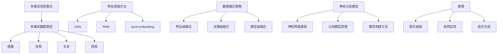

                 

### 第一部分：引论

#### 第1章：多模态信息整合与推理概述

在当今的信息时代，数据的多样性和复杂性日益增加。多模态信息整合作为人工智能领域的一个重要研究方向，旨在将不同类型的信息源（如文本、图像、音频、视频等）进行融合，以提取出更深层次的语义信息和知识。这种整合不仅有助于提升系统的智能水平，还为各个领域的应用带来了革命性的变化。

**1.1 多模态信息整合的背景与意义**

多模态信息整合的概念源于人类感知和认知的自然过程。人类的感官系统可以同时处理多种类型的信息，如视觉、听觉、触觉等，从而形成一个综合性的感知体验。例如，当我们听到一首歌时，不仅能够感受到旋律和节奏，还能通过视觉来欣赏歌手的表情和动作。这种多感官的信息整合使得人类的认知能力大大增强。

在人工智能领域，多模态信息整合的目标是模拟人类的这种综合性感知能力，使机器能够处理和理解更加复杂和多样化的信息。随着深度学习技术的不断发展，多模态信息整合在图像识别、自然语言处理、语音识别、人机交互等多个领域取得了显著的成果。例如，多模态图像识别系统可以通过结合视觉和文本信息来提高识别的准确性；多模态语音识别系统可以通过结合语音和文本信息来提升语音识别的鲁棒性。

**1.2 多模态信息整合的技术框架**

多模态信息整合的技术框架主要包括数据采集、数据预处理、特征提取、数据融合和模型训练等几个关键步骤。

1. **数据采集**：从不同来源获取多种类型的数据，如图像、音频、文本等。这些数据可以是结构化的，也可以是非结构化的。

2. **数据预处理**：对采集到的数据进行清洗、归一化和标注等处理，以便后续的特征提取和分析。数据预处理是保证多模态信息整合质量的重要环节。

3. **特征提取**：根据不同类型的数据特点，采用相应的特征提取方法。例如，对于图像数据，可以采用卷积神经网络（CNN）提取视觉特征；对于文本数据，可以采用词嵌入（word embedding）提取语义特征。

4. **数据融合**：将不同类型的数据特征进行整合，形成统一的多模态特征表示。数据融合的方法包括特征级融合、决策级融合和模型级融合等。

5. **模型训练**：利用整合后的多模态特征训练深度学习模型，如多模态神经网络（MMNN）、多任务学习（MTL）等。

**1.3 神经认知模型构建的重要性**

神经认知模型是基于神经网络的模型，旨在模拟人类大脑的认知过程。在多模态信息整合中，神经认知模型的构建具有重要意义。

首先，神经认知模型可以处理复杂的多模态信息，提取出深层次的语义信息。通过模拟人类大脑的信息处理机制，神经认知模型能够更好地理解多模态数据中的关联和交互。

其次，神经认知模型具有良好的泛化能力。通过大规模的数据训练，神经认知模型可以适应不同的应用场景和数据分布，从而提高系统的鲁棒性和实用性。

最后，神经认知模型的构建有助于推动人工智能技术的发展。通过研究神经认知模型的工作原理和优化方法，可以不断改进多模态信息整合的技术框架，提高人工智能系统的性能和智能化水平。

综上所述，多模态信息整合与推理的神经认知模型构建是一个具有重要意义的研究方向。在接下来的章节中，我们将深入探讨多模态信息处理的数学与算法基础，以及神经认知模型的构建方法和应用实例。

---

**核心概念与联系**

### 多模态信息整合
多模态信息整合是指将不同类型的信息源（如图像、音频、文本等）进行结合，以提取出更丰富的语义信息。其核心概念包括：

1. **多模态数据类型**：包括图像、音频、文本、视频等。
2. **特征提取方法**：针对不同类型的数据，采用相应的特征提取技术，如卷积神经网络（CNN）、循环神经网络（RNN）、词嵌入等。
3. **数据融合策略**：将不同类型的数据特征进行整合，形成统一的多模态特征表示。

### 神经认知模型
神经认知模型是一种基于神经网络的模型，旨在模拟人类大脑的认知过程。其核心概念包括：

1. **神经网络基础**：包括神经网络的基本结构、常见的神经网络模型（如CNN、RNN）和深度学习优化算法。
2. **认知模型原理**：神经认知模型的基本框架、构建方法以及其特点与挑战。
3. **模型构建方法**：利用深度学习技术构建神经认知模型的方法和流程。

### 推理
推理是指基于已知事实和规则推导出新的结论。在多模态信息整合中，推理有助于从多模态数据中提取出更深层次的语义信息。推理的过程包括：

1. **事实抽取**：从多模态数据中提取关键信息。
2. **规则应用**：将提取的事实应用于预定的规则中。
3. **结论生成**：通过推理规则生成新的结论。

**Mermaid 流程图**

### 数学模型和数学公式

#### 多模态特征提取

假设我们有多模态数据集 \(X = \{x_1, x_2, ..., x_n\}\)，其中 \(x_i\) 表示第 \(i\) 个样本。对于图像数据 \(I\)，我们可以使用卷积神经网络（CNN）提取特征表示 \(f(I)\)。对于文本数据 \(T\)，我们可以使用词嵌入（word embedding）提取特征表示 \(g(T)\)。对于音频数据 \(A\)，我们可以使用循环神经网络（RNN）提取特征表示 \(h(A)\)。

$$
f(I) = \text{CNN}(I) \\
g(T) = \text{word\_embedding}(T) \\
h(A) = \text{RNN}(A)
$$

#### 数据融合策略

假设我们得到了图像特征表示 \(f(I)\)、文本特征表示 \(g(T)\) 和音频特征表示 \(h(A)\)。我们可以采用以下策略进行数据融合：

1. **特征级融合**：将不同类型的数据特征进行拼接或加权融合。
   $$
   F_{\text{feature}} = [f(I), g(T), h(A)]
   $$
   
2. **决策级融合**：在特征级融合的基础上，使用统一模型进行分类或回归。
   $$
   \text{softmax}(F_{\text{feature}}) = P(y \mid F_{\text{feature}})
   $$

3. **模型级融合**：使用多个独立的模型分别处理不同类型的数据，然后融合其预测结果。
   $$
   \text{ensemble}(\{M_1, M_2, M_3\}) = \text{weighted\_average}(\{M_1(F_{\text{feature}}), M_2(F_{\text{feature}}), M_3(F_{\text{feature}})\})
   $$

---

在接下来的章节中，我们将深入探讨多模态信息处理的数学与算法基础，详细讲解多模态数据表示、神经网络基础和认知模型原理。这将为我们理解多模态信息整合推理的神经认知模型构建打下坚实的基础。

---

**注意事项**

1. **数据预处理**：在进行多模态特征提取之前，确保数据预处理的质量。数据预处理包括数据清洗、归一化和标注等步骤，这些步骤直接影响后续的特征提取和模型训练效果。

2. **特征提取方法选择**：根据具体应用场景和数据类型，选择合适的特征提取方法。例如，对于图像数据，CNN 是常用的特征提取方法；对于文本数据，词嵌入是常用的特征提取方法。

3. **数据融合策略**：数据融合策略的选择应考虑模型的复杂度和计算效率。特征级融合和决策级融合较为简单，但可能无法充分利用不同类型数据的信息；模型级融合能够充分利用不同类型数据的信息，但计算复杂度较高。

4. **模型训练与调参**：在构建神经认知模型时，模型训练和调参是关键环节。选择合适的训练策略和优化算法，并合理调整模型参数，以获得最佳的模型性能。

5. **模型评估与优化**：在模型训练完成后，对模型进行评估和优化。常用的评估指标包括准确率、召回率、F1 值等。通过优化模型结构和参数，可以提高模型的性能和泛化能力。

**拓展阅读**

- 《深度学习》（Goodfellow, Bengio, Courville）：详细介绍了深度学习的基本原理和应用，包括神经网络模型、优化算法和训练技巧。

- 《多模态信息融合技术与应用》（吴波，等）：介绍了多模态信息融合的基本概念、方法和技术，以及其在各个领域的应用。

- 《认知图谱：技术与实践》（陈恩红）：探讨了认知图谱的概念、构建方法和应用，为理解神经认知模型的构建提供了有益的参考。

---

在第一部分引论中，我们概述了多模态信息整合与推理的背景、意义和技术框架，并提出了神经认知模型构建的重要性。接下来，我们将深入探讨多模态信息处理的数学与算法基础，为理解神经认知模型构建提供理论基础。敬请期待第二部分的精彩内容。

