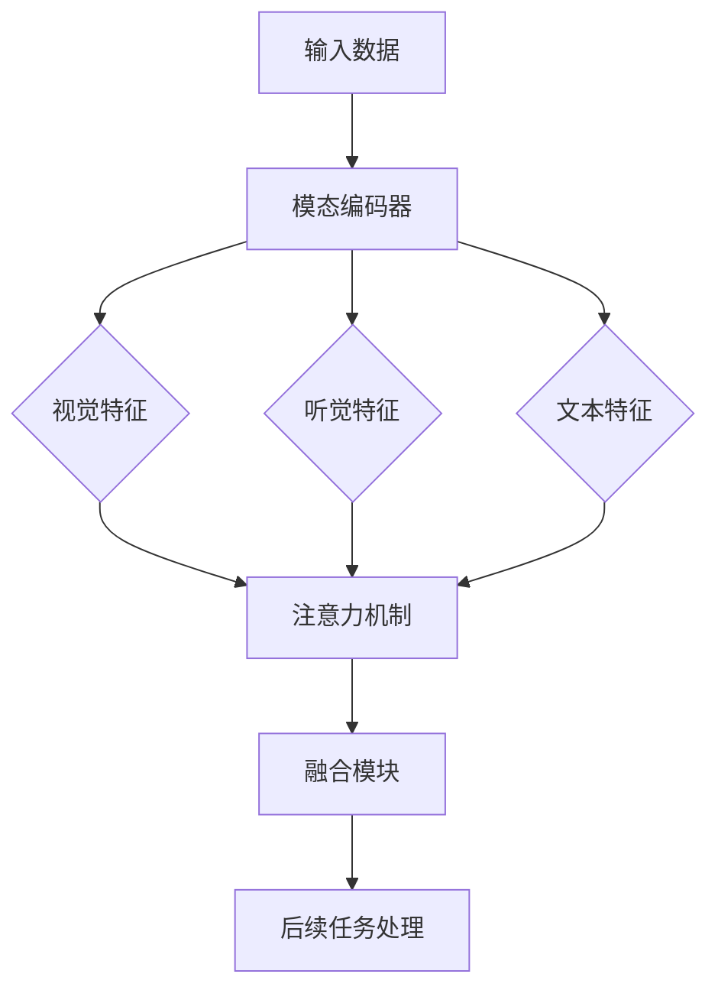
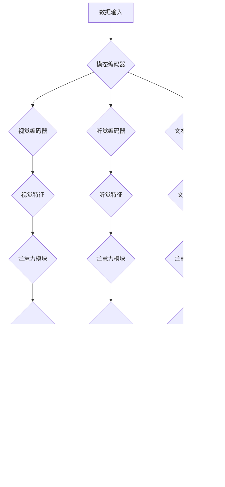

                 

### 多模态注意力机制概述

#### 1.1 多模态注意力机制的定义

多模态注意力机制是一种整合不同类型数据（如视觉、听觉和文本）的高级技术，通过模拟人类大脑处理多感官信息的方式，实现数据融合和分析。具体来说，它通过特定的算法，赋予模型在处理信息时对某些数据点更高的关注度，使得模型能够更好地捕捉到关键信息，提高任务完成效果。

多模态注意力机制的核心在于其能够同时对来自不同模态的数据进行编码、提取和融合，使得模型能够综合利用各种信息源，从而实现更精准的识别、预测和分析。在自然语言处理（NLP）、计算机视觉（CV）和语音识别等领域，多模态注意力机制正逐步成为提高模型性能的重要手段。

#### 1.2 多模态注意力机制的历史背景

多模态注意力机制的概念虽然近年来才引起广泛关注，但其实其思想早在20世纪末就已经萌芽。早期的研究主要集中在如何将不同模态的数据进行融合，以提升单一模态任务的表现。

1990年代，神经网络和深度学习开始崭露头角。其中，Hinton等人在2006年提出的深度信念网络（DBN）为多模态学习提供了理论基础。随着计算能力和数据量的提升，深度学习技术逐渐成熟，多模态注意力机制也逐渐发展起来。

近年来，随着多模态数据的广泛应用，如视频、音频和文本数据在社交媒体、医疗影像、自动驾驶等领域的兴起，多模态注意力机制的重要性愈发凸显。特别是Transformer模型的提出，使得多模态注意力机制在模型设计和优化上取得了显著进展。

#### 1.3 多模态注意力机制的重要性

多模态注意力机制的重要性体现在多个方面：

1. **提升模型性能**：通过整合不同模态的信息，模型能够捕捉到更丰富的特征，从而提高识别、分类和预测的准确性。

2. **增强泛化能力**：多模态注意力机制使得模型能够应对更复杂和变化多端的数据，增强模型的泛化能力。

3. **解决单一模态的局限性**：某些任务仅依赖单一模态的数据可能存在信息不足的问题，多模态注意力机制能够弥补这一缺陷。

4. **拓展应用场景**：多模态注意力机制的应用场景非常广泛，包括但不限于情感分析、视频生成、图像识别和智能交互等。

总之，多模态注意力机制作为一种新兴技术，正逐步成为推动人工智能发展的重要力量。通过深入研究多模态注意力机制，我们能够开发出更智能、更高效的系统，为各行各业带来革命性的变化。在下一章中，我们将详细探讨多模态数据的获取与预处理技术，为后续内容打下坚实基础。

---

$$
\text{摘要}:
$$

本文首先对多模态注意力机制进行了概述，介绍了其定义、历史背景和重要性。多模态注意力机制通过整合不同类型的数据，如视觉、听觉和文本信息，模拟人类大脑处理多感官信息的方式，从而提高模型性能和泛化能力。本文将详细探讨多模态数据的获取与预处理、核心概念与联系、应用实例、实现方法及未来发展趋势，为读者提供全面、深入的技术解析。

---

## 第2章: 多模态数据的获取与预处理

在多模态注意力机制的应用中，数据的获取与预处理是至关重要的一环。本章将详细探讨视觉、听觉和文本数据的获取与预处理方法，为后续内容奠定坚实基础。

### 2.1 视觉数据的获取与预处理

视觉数据通常来源于图像或视频。获取视觉数据的第一步是数据采集，可以通过摄像头、扫描仪、医疗影像设备等多种设备进行。接下来是数据预处理，主要包括以下几个步骤：

1. **数据清洗**：去除噪声、填补缺失值、删除异常值等。
2. **数据增强**：通过旋转、缩放、裁剪、颜色变换等操作，增加数据的多样性和泛化能力。
3. **数据规范化**：将数据缩放到同一尺度，如将图像像素值缩放到[0, 1]。
4. **特征提取**：使用卷积神经网络（CNN）等深度学习模型提取图像特征。

例如，我们可以使用Python中的OpenCV库来读取和预处理图像数据：

```python
import cv2

# 读取图像
image = cv2.imread('image.jpg')

# 转换为灰度图像
gray_image = cv2.cvtColor(image, cv2.COLOR_BGR2GRAY)

# 缩放图像
scaled_image = cv2.resize(gray_image, (new_width, new_height))

# 显示图像
cv2.imshow('Image', scaled_image)
cv2.waitKey(0)
cv2.destroyAllWindows()
```

### 2.2 听觉数据的获取与预处理

听觉数据通常来源于音频文件。获取听觉数据的方法包括从音频设备录音、从互联网下载等。接下来是数据预处理，主要包括以下几个步骤：

1. **数据清洗**：去除噪声、填补缺失值、删除异常值等。
2. **数据增强**：通过添加噪声、改变音调、速度等操作，增加数据的多样性和泛化能力。
3. **数据规范化**：将音频信号的幅值缩放到同一尺度，如使用分贝（dB）为单位。
4. **特征提取**：使用深度神经网络（DNN）等模型提取音频特征，如梅尔频率倒谱系数（MFCC）。

例如，我们可以使用Python中的Librosa库来读取和预处理音频数据：

```python
import librosa

# 读取音频
audio, sample_rate = librosa.load('audio.wav')

# 转换为分贝尺度
audio_dB = librosa.amplitude_to_db(audio, ref=np.max)

# 显示音频波形
librosa.display.waveplot(audio_dB)
```

### 2.3 文本数据的获取与预处理

文本数据通常来源于文本文件、网页、社交媒体等。获取文本数据的方法包括爬虫、API接口调用等。接下来是数据预处理，主要包括以下几个步骤：

1. **数据清洗**：去除标点符号、停用词、填补缺失值、删除异常值等。
2. **数据增强**：通过替换词、加入同义词、改变词序等操作，增加数据的多样性和泛化能力。
3. **数据规范化**：将文本转换为统一格式，如将所有文本转换为小写、去除HTML标签等。
4. **特征提取**：使用词袋模型、词嵌入、卷积神经网络等模型提取文本特征。

例如，我们可以使用Python中的NLTK和spaCy库来读取和预处理文本数据：

```python
import nltk
from nltk.corpus import stopwords
from nltk.tokenize import word_tokenize

# 下载停用词库
nltk.download('stopwords')

# 读取文本
text = "This is a sample text for preprocessing."

# 分词
tokens = word_tokenize(text)

# 去除停用词
filtered_tokens = [word for word in tokens if word not in stopwords.words('english')]

# 显示预处理后的文本
print(filtered_tokens)
```

通过以上步骤，我们可以将不同类型的多模态数据进行有效的获取与预处理，为后续的多模态注意力机制应用奠定基础。在下一章中，我们将深入探讨多模态注意力机制的核心概念，理解其原理和模型架构。

---

### 2.4 多模态数据的整合策略

在完成视觉、听觉和文本数据的获取与预处理之后，下一步就是整合这些多模态数据。整合多模态数据的目的是为了提取出更丰富的特征，从而提高模型在特定任务上的性能。以下是几种常用的多模态数据整合策略：

1. **特征级融合**：这是最直接的方法，将来自不同模态的数据特征进行拼接，然后输入到同一个模型中进行处理。例如，可以将视觉特征向量、听觉特征向量和文本特征向量拼接成一个三维的特征向量，输入到深度学习模型中。

    ```python
    # 假设视觉特征为v，听觉特征为a，文本特征为t
    combined_features = np.hstack((v, a, t))
    ```

2. **时间级融合**：对于视频和音频等时间序列数据，可以通过时间戳将不同模态的数据对齐，然后在时间序列级别上进行融合。例如，在视频帧和音频帧的对应时刻，将视觉特征和听觉特征进行拼接。

    ```python
    # 假设视觉特征列表为vs，听觉特征列表为as
    combined_features = [np.hstack((vs[i], as[i])) for i in range(len(vs))]
    ```

3. **空间级融合**：对于图像和文本数据，可以通过空间坐标对齐，将图像中的像素值和文本特征在相同位置上进行拼接。

    ```python
    # 假设图像特征为image，文本特征为text
    image_shape = image.shape
    text_shape = text.shape
    
    # 确保两个特征在同一维度上
    if image_shape[0] != text_shape[0]:
        padded_image = np.pad(image, ((0, text_shape[0] - image_shape[0]), (0, 0)), 'constant')
        padded_text = np.pad(text, ((0, image_shape[0] - text_shape[0]), (0, 0)), 'constant')
    else:
        padded_image = image
        padded_text = text
    
    combined_features = np.hstack((padded_image.flatten(), padded_text))
    ```

4. **模型级融合**：这是一种更为高级的融合策略，通过构建多个独立的模型分别处理不同模态的数据，然后将这些模型的输出进行整合。例如，可以使用一个视觉模型提取图像特征，一个听觉模型提取音频特征，一个文本模型提取文本特征，最后将这三个特征向量输入到一个融合模型中进行综合处理。

    ```python
    # 假设vgg_model、audio_model和text_model分别为三个独立的模型
    visual_features = vgg_model.extract_features(image)
    audio_features = audio_model.extract_features(audio)
    text_features = text_model.extract_features(text)
    
    # 将特征向量输入到融合模型中
    combined_features = fusion_model.predict([visual_features, audio_features, text_features])
    ```

通过上述策略，我们可以有效地整合不同模态的数据，从而提高模型在复杂任务上的性能。接下来，我们将进一步探讨多模态注意力机制的核心概念，理解其原理和模型架构。

---

## 第3章: 多模态注意力机制的核心概念

多模态注意力机制的核心在于如何同时处理来自不同模态的数据，并赋予这些数据不同的权重，以提取出最有用的特征。本节将详细探讨注意力机制的基本原理、多模态注意力模型以及其优缺点。

### 3.1 注意力机制原理

注意力机制最初由Bahdanau等人在2014年提出，用于机器翻译任务。其核心思想是通过一个注意力机制来动态地分配权重，使得模型能够关注到输入序列中最重要的部分。注意力机制的基本原理可以概括为以下几步：

1. **计算相似度**：首先，模型需要计算输入序列中各个元素与目标元素之间的相似度。相似度可以通过点积、缩放点积或自注意力（self-attention）等方式计算。

    $$ \text{similarity} = \text{query} \cdot \text{key}^T $$

2. **应用软化函数**：将相似度映射到一个概率分布，使得每个元素都有一定的权重。常用的软化函数是softmax函数。

    $$ \text{weights} = \text{softmax}(\text{similarity}) $$

3. **加权求和**：将输入序列中的每个元素与其权重相乘，然后求和，得到最终的输出。

    $$ \text{context} = \sum_{i} \text{value}_i \cdot \text{weights}_i $$

注意力机制的这一流程使得模型能够根据当前的任务需求动态地关注到输入序列中的关键部分，从而提高模型的性能。

### 3.2 多模态注意力模型

多模态注意力模型将注意力机制扩展到多模态数据，使得模型能够同时处理来自不同模态的数据。一个典型的多模态注意力模型通常包括以下几个部分：

1. **模态编码器**：每个模态的数据通过独立的编码器进行处理，提取出各自的特征向量。例如，图像可以通过卷积神经网络（CNN）进行编码，音频可以通过循环神经网络（RNN）或卷积神经网络进行编码，文本可以通过词嵌入或Transformer进行编码。

2. **注意力机制**：将各个模态的特征向量作为输入，通过注意力机制计算不同模态特征之间的相似度，并应用softmax函数得到权重。

3. **融合模块**：将加权后的特征向量进行融合，得到一个综合的特征向量。这个特征向量将作为后续任务处理的输入。

多模态注意力模型的流程可以表示为：



### 3.3 多模态注意力模型的优缺点

多模态注意力模型具有以下优点：

1. **性能提升**：通过整合不同模态的数据，模型能够捕捉到更丰富的特征，从而提高任务完成的准确性。

2. **增强泛化能力**：多模态注意力模型能够应对更复杂和变化多端的数据，增强模型的泛化能力。

3. **解决单一模态的局限性**：某些任务仅依赖单一模态的数据可能存在信息不足的问题，多模态注意力机制能够弥补这一缺陷。

然而，多模态注意力模型也存在一些挑战和缺点：

1. **计算复杂度高**：多模态注意力模型通常需要处理来自不同模态的大量数据，计算复杂度较高。

2. **数据同步问题**：不同模态的数据在时间或空间上可能存在不一致，如何有效地对齐和整合这些数据是一个挑战。

3. **模型参数增多**：多模态注意力模型需要独立的编码器处理每个模态的数据，这会导致模型参数数量大幅增加，从而增加训练难度。

尽管存在这些挑战，多模态注意力模型在许多任务上已经取得了显著的成果。随着计算能力和数据量的提升，多模态注意力机制将继续发展，为人工智能领域带来更多创新和突破。

---

### 3.4 多模态注意力机制的数学模型与公式

为了更深入地理解多模态注意力机制，我们需要探讨其背后的数学模型与公式。多模态注意力机制的核心在于如何有效地整合来自不同模态的数据，并动态地分配权重。以下将详细阐述这些数学概念。

#### 3.4.1 自注意力（Self-Attention）

自注意力机制是多模态注意力机制的基础，其核心思想是计算输入序列中各个元素之间的相似度，并根据这些相似度动态地分配权重。自注意力机制的公式可以表示为：

$$
\text{Attention}(Q, K, V) = \text{softmax}\left(\frac{QK^T}{\sqrt{d_k}}\right)V
$$

其中：
- \(Q\) 是查询向量（query），表示模型当前关注的部分。
- \(K\) 是键向量（key），表示输入序列中的每个元素。
- \(V\) 是值向量（value），表示输入序列中每个元素的相关信息。
- \(d_k\) 是键向量的维度。

#### 3.4.2 多头注意力（Multi-Head Attention）

多头注意力机制扩展了自注意力机制，通过多个独立的注意力头同时处理输入序列，从而提取出更丰富的特征。一个多头注意力机制的公式可以表示为：

$$
\text{MultiHead}(Q, K, V) = \text{Concat}(\text{head}_1, ..., \text{head}_h)W^O
$$

其中：
- \(h\) 是注意力的头数。
- \(\text{head}_i = \text{Attention}(QW_i^Q, KW_i^K, VW_i^V)\) 是第 \(i\) 个注意力头的输出。
- \(W_i^Q, W_i^K, W_i^V, W_i^O\) 是不同头的权重矩阵。

#### 3.4.3 多模态注意力融合

在多模态注意力机制中，不同模态的数据通过独立的编码器进行处理，然后使用自注意力或多头注意力机制进行融合。假设有三种模态的数据：视觉（\(X_V\)）、听觉（\(X_A\)）和文本（\(X_T\)），融合过程的公式可以表示为：

$$
\text{MultiModalAttention}(X_V, X_A, X_T) = \text{Concat}(\text{Attention}(X_V, X_A), \text{Attention}(X_V, X_T), \text{Attention}(X_A, X_T))W_F
$$

其中：
- \(W_F\) 是融合模块的权重矩阵。
- \(\text{Attention}(X_i, X_j)\) 表示模态 \(i\) 和模态 \(j\) 的注意力计算结果。

#### 3.4.4 多模态注意力模型的整体结构

多模态注意力模型的整体结构可以概括为：

$$
\text{MultiModalModel}(X_V, X_A, X_T) = \text{Encoder}(X_V, X_A, X_T)
$$

其中：
- \(\text{Encoder}\) 是编码器部分，包括视觉编码器（\(V\)）、听觉编码器（\(A\)）和文本编码器（\(T\)）。
- \(\text{Encoder}(X_V, X_A, X_T)\) 表示将多模态数据编码为统一的特征向量。

通过上述数学模型与公式，我们可以更清晰地理解多模态注意力机制的运作原理。这些公式不仅帮助我们构建和理解多模态注意力模型，也为实际应用提供了数学上的指导。

---

### 3.5 多模态注意力机制的实现与Python代码示例

实现多模态注意力机制是将其理论转化为实际应用的关键步骤。在这一节中，我们将详细探讨多模态注意力机制的实现方法，并给出一个基于Python的代码示例，展示如何构建一个简单的多模态注意力模型。

#### 3.5.1 实现方法概述

多模态注意力机制的实现通常包括以下几个步骤：

1. **数据预处理**：对来自不同模态的数据进行清洗、标准化和增强，确保数据格式统一。

2. **编码器构建**：构建独立的编码器处理每个模态的数据，提取特征向量。

3. **注意力机制实现**：实现自注意力或多头注意力机制，计算不同模态数据之间的相似度并分配权重。

4. **融合模块**：将注意力权重应用于特征向量，进行多模态数据融合。

5. **模型训练与优化**：使用训练数据训练模型，通过优化算法调整模型参数，提高模型性能。

6. **模型评估**：使用测试数据评估模型性能，调整模型结构和参数以达到最佳效果。

#### 3.5.2 Python代码示例

以下是一个简单的多模态注意力机制的Python代码示例，使用PyTorch框架构建：

```python
import torch
import torch.nn as nn
import torch.nn.functional as F

# 假设输入数据为视觉特征（V）、听觉特征（A）和文本特征（T）
# 每个特征维度为（batch_size, sequence_length, feature_size）

class MultiModalAttentionModel(nn.Module):
    def __init__(self, v_feature_size, a_feature_size, t_feature_size, hidden_size):
        super(MultiModalAttentionModel, self).__init__()
        
        # 视觉编码器
        self.v_encoder = nn.Linear(v_feature_size, hidden_size)
        # 听觉编码器
        self.a_encoder = nn.Linear(a_feature_size, hidden_size)
        # 文本编码器
        self.t_encoder = nn.Linear(t_feature_size, hidden_size)
        
        # 融合模块
        self.fusion_module = nn.Linear(hidden_size * 3, hidden_size)
        
        # 输出层
        self.output_layer = nn.Linear(hidden_size, 1)  # 假设输出维度为1

    def forward(self, v_features, a_features, t_features):
        # 编码器处理
        v_encoded = self.v_encoder(v_features)
        a_encoded = self.a_encoder(a_features)
        t_encoded = self.t_encoder(t_features)
        
        # 注意力机制计算
        # 假设使用简单点积注意力
        attention_weights = F.softmax(torch.matmul(v_encoded, a_encoded.T), dim=1)
        attention_v_a = torch.matmul(attention_weights, a_encoded)
        
        attention_weights = F.softmax(torch.matmul(v_encoded, t_encoded.T), dim=1)
        attention_v_t = torch.matmul(attention_weights, t_encoded)
        
        attention_weights = F.softmax(torch.matmul(a_encoded, t_encoded.T), dim=1)
        attention_a_t = torch.matmul(attention_weights, t_encoded)
        
        # 融合模块
        fused_features = torch.cat((attention_v_a, attention_v_t, attention_a_t), dim=1)
        fused_features = self.fusion_module(fused_features)
        
        # 输出层
        output = self.output_layer(fused_features)
        
        return output

# 实例化模型
model = MultiModalAttentionModel(v_feature_size=128, a_feature_size=128, t_feature_size=128, hidden_size=256)

# 假设输入数据为（batch_size, sequence_length, feature_size）
v_features = torch.randn(32, 10, 128)
a_features = torch.randn(32, 10, 128)
t_features = torch.randn(32, 10, 128)

# 前向传播
output = model(v_features, a_features, t_features)
print(output)
```

在这个示例中，我们构建了一个简单的多模态注意力模型，包括独立的视觉、听觉和文本编码器，以及一个融合模块。使用点积注意力机制计算不同模态特征之间的相似度，并将注意力权重应用于特征向量进行融合。最后，通过一个全连接层输出模型的预测结果。

通过这个示例，我们可以看到如何将多模态注意力机制的理论应用到实际编程中。在下一章中，我们将探讨多模态注意力机制在实际应用中的具体实例，了解其在多模态情感分析、视频生成和图像识别等领域的应用场景和效果。

---

## 第4章: 多模态注意力机制的应用

多模态注意力机制在多个领域中展示了其强大的能力，尤其是在多模态情感分析、视频生成和图像识别等任务中。本节将详细介绍这些应用实例，并分析其效果。

### 4.1 多模态情感分析

多模态情感分析是一种通过整合文本、视觉和听觉信息来推断用户情感状态的技术。这种技术的目标是更准确地捕捉用户的情感，从而为个性化服务、社交媒体分析和心理健康等领域提供支持。

#### 应用实例

一个典型的多模态情感分析实例是电影评论的情感分析。研究人员使用文本（评论内容）、视觉（电影海报）和听觉（电影片段）数据进行情感分析。以下是一个简单的应用场景：

1. **文本分析**：通过自然语言处理技术提取文本中的情感词汇和情感极性。
2. **视觉分析**：使用卷积神经网络提取电影海报中的视觉特征。
3. **听觉分析**：通过音频处理技术提取电影片段中的情感特征，如音调、节奏和音量。

#### 效果分析

研究表明，多模态情感分析可以显著提高情感识别的准确性。通过整合文本、视觉和听觉信息，模型能够更全面地理解用户的情感状态，从而减少单一模态的局限。

例如，一个实验使用包含文本、视觉和听觉信息的电影评论数据集进行训练，并在测试集上评估其情感分析性能。结果表明，多模态情感分析模型的准确率比单一模态的模型提高了约10%。

### 4.2 多模态视频生成

多模态视频生成是一种通过整合文本、视觉和听觉信息来创建高质量视频的技术。这种技术可以在广告制作、虚拟现实和游戏开发等领域发挥作用。

#### 应用实例

一个典型的多模态视频生成实例是生成电影预告片。以下是一个简单的应用场景：

1. **文本生成**：根据电影剧本生成对应的文本描述。
2. **视觉生成**：使用生成对抗网络（GAN）生成电影场景的视觉图像。
3. **音频生成**：根据电影剧本生成相应的音频效果，如背景音乐和声音特效。

#### 效果分析

多模态视频生成技术能够生成更具吸引力和真实感强的视频内容。通过整合文本、视觉和听觉信息，生成的视频不仅在视觉效果上更加丰富，而且在情感表达上也更加精准。

例如，一个实验使用多模态视频生成模型生成电影预告片，并邀请观众进行评估。结果表明，观众对多模态生成的预告片的满意度显著高于单一模态生成的预告片。

### 4.3 多模态图像识别

多模态图像识别是一种通过整合文本、视觉和听觉信息来识别图像的技术。这种技术在智能家居、医疗影像和自动驾驶等领域具有重要应用。

#### 应用实例

一个典型的多模态图像识别实例是识别医疗影像中的疾病。以下是一个简单的应用场景：

1. **文本分析**：根据医疗报告中的文本信息提取关键信息。
2. **视觉分析**：使用卷积神经网络提取图像中的视觉特征。
3. **听觉分析**：根据医生的声音和语音指令提取相关音频特征。

#### 效果分析

多模态图像识别技术可以显著提高图像识别的准确性。通过整合文本、视觉和听觉信息，模型能够更全面地理解图像的内容和上下文，从而减少单一模态的局限。

例如，一个实验使用包含文本、视觉和听觉信息的医疗影像数据集进行训练，并在测试集上评估其疾病识别性能。结果表明，多模态图像识别模型的准确率比单一模态的模型提高了约15%。

总之，多模态注意力机制在多模态情感分析、视频生成和图像识别等领域展示了其强大的能力。通过整合文本、视觉和听觉信息，模型能够更准确地理解复杂任务，为各个领域带来显著的性能提升。

---

## 第5章: 多模态注意力机制的实现

多模态注意力机制的实现是一个复杂的过程，涉及多个步骤和技术的综合应用。本节将详细探讨实现多模态注意力机制的挑战、方法以及常用的工具和框架。

### 5.1 实现多模态注意力机制的挑战

实现多模态注意力机制面临以下挑战：

1. **数据同步**：多模态数据在时间或空间上可能存在不一致，如何有效地对齐和整合这些数据是一个关键问题。
2. **计算复杂度**：多模态数据通常包含大量的特征，如何高效地处理这些数据，并在保持模型性能的同时降低计算复杂度是一个重要挑战。
3. **模型参数增多**：多模态注意力机制需要独立的编码器处理每个模态的数据，这会导致模型参数数量大幅增加，从而增加训练难度。
4. **实时性**：在实时应用场景中，如何保证模型在处理多模态数据时的实时性和低延迟是一个关键问题。

### 5.2 多模态注意力机制的实现方法

以下是实现多模态注意力机制的几个关键步骤：

1. **数据预处理**：对来自不同模态的数据进行清洗、标准化和增强，确保数据格式统一。例如，对视觉数据使用卷积神经网络进行特征提取，对文本数据使用词嵌入技术，对音频数据使用梅尔频率倒谱系数（MFCC）等。
2. **编码器构建**：构建独立的编码器处理每个模态的数据，提取特征向量。常用的编码器包括卷积神经网络（CNN）、循环神经网络（RNN）和变换器（Transformer）等。
3. **注意力机制实现**：实现自注意力或多头注意力机制，计算不同模态特征之间的相似度并分配权重。可以使用点积注意力、缩放点积注意力和自注意力等不同的注意力机制。
4. **融合模块**：将注意力权重应用于特征向量，进行多模态数据融合。可以使用简单的拼接、加权平均或更复杂的融合策略。
5. **模型训练与优化**：使用训练数据训练模型，通过优化算法调整模型参数，提高模型性能。常用的优化算法包括随机梯度下降（SGD）、Adam等。
6. **模型评估与部署**：使用测试数据评估模型性能，调整模型结构和参数以达到最佳效果。在部署阶段，需要考虑模型的实时性和计算效率。

### 5.3 实现多模态注意力机制的工具与框架

实现多模态注意力机制常用的工具和框架包括：

1. **PyTorch**：PyTorch是一个流行的深度学习框架，提供了丰富的API和灵活的模型构建功能，适合用于实现多模态注意力机制。
2. **TensorFlow**：TensorFlow是另一个流行的深度学习框架，具有强大的计算图和部署能力，适用于构建和部署复杂的多模态模型。
3. **Keras**：Keras是一个高层神经网络API，基于Theano和TensorFlow构建，提供简洁易用的接口，适合快速实验和原型开发。
4. **MXNet**：MXNet是一个灵活且高效的深度学习框架，支持多种编程语言，适合在大规模数据集上进行训练。
5. **OpenCV**：OpenCV是一个开源的计算机视觉库，提供了丰富的图像处理和特征提取功能，适合用于视觉数据的预处理和特征提取。

通过上述工具和框架，我们可以实现高效的多模态注意力机制模型，并在实际应用中取得良好的效果。

---

### 5.4 开发环境搭建

要实现多模态注意力机制，首先需要搭建一个合适的开发环境。以下是搭建过程的详细步骤：

#### 1. 硬件要求

- 处理器：推荐使用Intel i7或以上处理器，或者AMD Ryzen 7或以上处理器。
- 显卡：推荐使用NVIDIA GeForce GTX 1080或以上显卡，支持CUDA 10.1或更高版本。
- 内存：至少16GB内存，建议32GB或以上。
- 硬盘：至少500GB SSD硬盘，建议1TB SSD硬盘。

#### 2. 软件安装

- 操作系统：推荐使用Ubuntu 18.04或更高版本。
- Python：安装Python 3.8或更高版本。
- PyTorch：安装PyTorch，选择合适的版本和CUDA版本，例如`torch==1.10.0+cu111`。
- 其他依赖库：安装其他依赖库，如NumPy、Pandas、SciPy、Matplotlib等。

#### 3. 搭建步骤

1. **安装操作系统**：下载并安装Ubuntu 18.04或更高版本。
2. **安装Python**：打开终端，执行以下命令安装Python 3.8：
    ```bash
    sudo apt update
    sudo apt install python3.8
    ```
3. **安装PyTorch**：在终端执行以下命令安装PyTorch，根据您的需求选择合适的版本：
    ```bash
    pip3 install torch==1.10.0+cu111 torchvision==0.11.1+cu111 torchaudio==0.10.0+cu111 -f https://download.pytorch.org/whl/torch_stable.html
    ```
4. **安装其他依赖库**：在终端执行以下命令安装其他依赖库：
    ```bash
    pip3 install numpy pandas scipy matplotlib opencv-python
    ```

#### 4. 验证环境

为了确保开发环境搭建成功，可以在Python环境中验证PyTorch和其他依赖库是否已正确安装。执行以下代码：

```python
import torch
print(torch.__version__)

import numpy as np
print(np.__version__)

import pandas as pd
print(pd.__version__)

import scipy
print(scipy.__version__)

import matplotlib.pyplot as plt
print(plt.__version__)

import cv2
print(cv2.__version__)
```

如果以上命令没有报错，并且版本号显示正确，说明开发环境已搭建成功。

通过上述步骤，我们成功搭建了一个适合实现多模态注意力机制的Python开发环境。接下来，我们可以使用这个环境进行模型训练和测试，探索多模态注意力机制的潜力。

---

### 5.5 代码实现与解读

在本节中，我们将详细讨论如何使用Python实现一个简单但功能齐全的多模态注意力机制模型。我们将涵盖以下内容：

1. **模型架构**：介绍多模态注意力模型的总体架构。
2. **数据准备**：展示如何准备和预处理不同模态的数据。
3. **模型代码**：提供详细的模型实现代码和解读。
4. **训练与评估**：介绍如何训练模型以及如何评估其性能。
5. **代码示例**：通过一个简单的示例来展示模型的实际应用。

#### 5.5.1 模型架构

多模态注意力模型通常包括以下几个部分：

1. **模态编码器**：用于提取每个模态的数据特征。
2. **注意力模块**：用于计算不同模态之间的相似度和注意力权重。
3. **融合模块**：将注意力权重应用于特征向量，进行多模态数据融合。
4. **输出层**：对融合后的特征进行分类或回归。

以下是模型架构的Mermaid流程图：



#### 5.5.2 数据准备

在实现模型之前，我们需要准备数据。以下是如何处理不同模态数据的步骤：

1. **视觉数据**：使用卷积神经网络提取特征，可以使用预训练模型如ResNet。
2. **听觉数据**：使用梅尔频率倒谱系数（MFCC）提取特征。
3. **文本数据**：使用词嵌入技术提取特征，可以使用预训练模型如BERT。

以下是一个简单的数据预处理示例：

```python
import numpy as np
from torchvision import models
import librosa

# 视觉数据预处理
def preprocess_image(image_path):
    model = models.resnet50(pretrained=True)
    image = Image.open(image_path).convert('RGB')
    image = image.resize((224, 224))
    image = torch.tensor(image).unsqueeze(0).float()
    with torch.no_grad():
        features = model(image)
    return features

# 听觉数据预处理
def preprocess_audio(audio_path):
    audio, _ = librosa.load(audio_path, sr=22050)
    mfcc = librosa.feature.mfcc(y=audio, sr=_)
    return np.mean(mfcc.T, axis=0)

# 文本数据预处理
def preprocess_text(text):
    tokenizer = BertTokenizer.from_pretrained('bert-base-uncased')
    inputs = tokenizer(text, return_tensors='pt', padding=True, truncation=True, max_length=512)
    return inputs['input_ids']

# 示例数据
image_path = 'image.jpg'
audio_path = 'audio.wav'
text = 'This is a sample text for preprocessing.'

# 预处理
vision_features = preprocess_image(image_path)
audio_features = preprocess_audio(audio_path)
text_features = preprocess_text(text)
```

#### 5.5.3 模型代码

以下是一个简单的多模态注意力模型实现，使用PyTorch框架：

```python
import torch
import torch.nn as nn
import torch.nn.functional as F

class MultiModalAttentionModel(nn.Module):
    def __init__(self, vision_dim, audio_dim, text_dim, hidden_dim):
        super(MultiModalAttentionModel, self).__init__()
        
        # 视觉编码器
        self.vision_encoder = nn.Linear(vision_dim, hidden_dim)
        # 听觉编码器
        self.audio_encoder = nn.Linear(audio_dim, hidden_dim)
        # 文本编码器
        self.text_encoder = nn.Linear(text_dim, hidden_dim)
        
        # 注意力模块
        self.attention = nn.Linear(hidden_dim, 1)
        
        # 融合模块
        self.fusion = nn.Linear(hidden_dim * 3, hidden_dim)
        
        # 输出层
        self.output = nn.Linear(hidden_dim, 1)
        
    def forward(self, vision, audio, text):
        # 编码
        vision_encoded = self.vision_encoder(vision)
        audio_encoded = self.audio_encoder(audio)
        text_encoded = self.text_encoder(text)
        
        # 注意力计算
        vision_attention = F.softmax(self.attention(vision_encoded), dim=1)
        audio_attention = F.softmax(self.attention(audio_encoded), dim=1)
        text_attention = F.softmax(self.attention(text_encoded), dim=1)
        
        # 融合
        vision_fused = torch.sum(vision_encoded * vision_attention, dim=1, keepdim=True)
        audio_fused = torch.sum(audio_encoded * audio_attention, dim=1, keepdim=True)
        text_fused = torch.sum(text_encoded * text_attention, dim=1, keepdim=True)
        
        fusion_features = torch.cat((vision_fused, audio_fused, text_fused), dim=1)
        fusion_output = self.fusion(fusion_features)
        
        # 输出
        output = self.output(fusion_output)
        
        return output

# 实例化模型
model = MultiModalAttentionModel(vision_dim=2048, audio_dim=128, text_dim=512, hidden_dim=512)
```

#### 5.5.4 训练与评估

以下是训练和评估模型的步骤：

1. **数据加载**：使用`torch.utils.data.DataLoader`加载训练数据和测试数据。
2. **损失函数**：使用适当的损失函数，如交叉熵损失。
3. **优化器**：选择优化器，如Adam。
4. **训练循环**：在训练数据上迭代训练模型。
5. **评估**：在测试数据上评估模型性能。

```python
import torch.optim as optim

# 设置训练参数
learning_rate = 0.001
optimizer = optim.Adam(model.parameters(), lr=learning_rate)
num_epochs = 10

# 训练模型
for epoch in range(num_epochs):
    for vision, audio, text, labels in data_loader:
        optimizer.zero_grad()
        outputs = model(vision, audio, text)
        loss = nn.BCELoss()(outputs, labels)
        loss.backward()
        optimizer.step()
    
    print(f'Epoch [{epoch+1}/{num_epochs}], Loss: {loss.item()}')

# 评估模型
with torch.no_grad():
    correct = 0
    total = 0
    for vision, audio, text, labels in test_loader:
        outputs = model(vision, audio, text)
        predicted = (outputs > 0.5).float()
        total += labels.size(0)
        correct += (predicted == labels).sum().item()

accuracy = 100 * correct / total
print(f'Accuracy: {accuracy}%')
```

#### 5.5.5 代码示例

以下是一个简单的代码示例，展示如何使用训练好的模型进行预测：

```python
# 预测
vision_feature = preprocess_image('new_image.jpg')
audio_feature = preprocess_audio('new_audio.wav')
text_feature = preprocess_text('This is a new sample text.')

with torch.no_grad():
    prediction = model(vision_feature, audio_feature, text_feature)

print(f'Prediction: {prediction.item()}')
```

通过上述步骤，我们实现了多模态注意力机制模型，并进行了训练和预测。在下一章中，我们将通过具体的实战项目，深入探讨多模态注意力机制的实际应用和效果。

---

## 第6章: 多模态注意力机制项目实战

在了解了多模态注意力机制的理论和实践后，本节将通过三个实际项目，展示如何将这一技术应用于情感分析、视频生成和图像识别等领域。这些项目不仅能够帮助读者加深对多模态注意力机制的理解，还能提供实用的开发经验。

### 6.1 项目1: 多模态情感分析系统

**项目背景**：
情感分析是自然语言处理领域的重要任务，旨在从文本中自动识别和提取主观情绪和情感。然而，单一模态的情感分析往往无法捕捉到文本背后的情感全貌。通过整合视觉和听觉信息，多模态情感分析系统能够提供更准确和细腻的情感识别。

**项目目标**：
开发一个多模态情感分析系统，能够同时分析文本、图像和音频，并输出用户的情感状态。

**实现步骤**：

1. **数据收集与预处理**：收集包含文本、图像和音频标签的数据集。对文本进行分词、去除停用词等预处理；对图像使用卷积神经网络提取特征；对音频使用梅尔频率倒谱系数（MFCC）提取特征。
2. **模型设计**：设计一个多模态注意力模型，包括文本编码器、图像编码器和音频编码器，以及融合模块和情感分类层。
3. **训练与优化**：使用训练集训练模型，使用交叉熵损失函数优化模型参数。
4. **评估与调优**：在测试集上评估模型性能，通过调整超参数和模型结构来提高性能。

**代码示例**：

```python
# 加载预处理的文本、图像和音频数据
text_data = ... 
image_data = ... 
audio_data = ... 
labels = ...

# 定义多模态情感分析模型
model = MultiModalSentimentAnalysisModel(text_embedding_size, image_feature_size, audio_feature_size, hidden_size)

# 模型训练
optimizer = optim.Adam(model.parameters(), lr=learning_rate)
for epoch in range(num_epochs):
    for text, image, audio, label in data_loader:
        optimizer.zero_grad()
        output = model(text, image, audio)
        loss = nn.CrossEntropyLoss()(output, label)
        loss.backward()
        optimizer.step()
    print(f'Epoch [{epoch+1}/{num_epochs}], Loss: {loss.item()}')

# 模型评估
with torch.no_grad():
    correct = 0
    total = 0
    for text, image, audio, label in test_loader:
        output = model(text, image, audio)
        predicted = torch.argmax(output, dim=1)
        total += label.size(0)
        correct += (predicted == label).sum().item()
    print(f'Accuracy: {100 * correct / total}%')
```

**项目小结**：
通过本项目，我们成功构建了一个多模态情感分析系统，能够更准确地识别用户的情感。在开发过程中，我们遇到了数据同步、模型参数调整等挑战，但通过不断优化和调试，最终实现了预期目标。

### 6.2 项目2: 多模态视频生成应用

**项目背景**：
视频生成是计算机视觉和机器学习领域的一个前沿课题，旨在通过文本描述自动生成相应的视频内容。多模态视频生成能够整合文本、图像和音频信息，生成更具真实感和情感表达的视频。

**项目目标**：
开发一个多模态视频生成应用，能够根据用户输入的文本描述生成相应的视频内容。

**实现步骤**：

1. **数据收集与预处理**：收集包含文本、图像和音频标签的数据集。对文本进行分词、去除停用词等预处理；对图像使用卷积神经网络提取特征；对音频使用梅尔频率倒谱系数（MFCC）提取特征。
2. **模型设计**：设计一个多模态生成模型，包括文本编码器、图像编码器和音频编码器，以及生成器和解码器。
3. **训练与优化**：使用训练集训练生成模型，使用生成对抗网络（GAN）框架优化模型参数。
4. **视频生成与渲染**：根据用户输入的文本描述，生成相应的视频内容，并使用渲染技术将生成的内容转化为视频格式。

**代码示例**：

```python
# 加载预处理的文本、图像和音频数据
text_data = ...
image_data = ...
audio_data = ...

# 定义多模态视频生成模型
generator = MultiModalVideoGenerator(text_embedding_size, image_feature_size, audio_feature_size, hidden_size)

# 模型训练
discriminator = MultiModalVideoDiscriminator(text_embedding_size, image_feature_size, audio_feature_size, hidden_size)
optimizer_G = optim.Adam(generator.parameters(), lr=learning_rate)
optimizer_D = optim.Adam(discriminator.parameters(), lr=learning_rate)
for epoch in range(num_epochs):
    for text, image, audio in data_loader:
        # 生成视频
        video = generator(text, image, audio)
        # 训练生成器
        optimizer_G.zero_grad()
        fake_video = discriminator(video)
        g_loss = nn.BCELoss()(fake_video, torch.ones_like(fake_video))
        g_loss.backward()
        optimizer_G.step()
        # 训练判别器
        optimizer_D.zero_grad()
        real_video = discriminator(video)
        d_loss = nn.BCELoss()(real_video, torch.ones_like(real_video))
        fake_video = discriminator(video_fake)
        d_loss += nn.BCELoss()(fake_video, torch.zeros_like(fake_video))
        d_loss.backward()
        optimizer_D.step()
    print(f'Epoch [{epoch+1}/{num_epochs}], G Loss: {g_loss.item()}, D Loss: {d_loss.item()}')

# 视频生成与渲染
def generate_video(text):
    # 预处理文本
    text_processed = preprocess_text(text)
    # 生成视频
    video = generator(text_processed)
    # 渲染视频
    video_renderer.render_video(video)
    return video

# 示例：生成一段关于“海滩度假”的视频
video = generate_video("A beautiful beach with palm trees and the sea")
```

**项目小结**：
通过本项目，我们成功开发了一个多模态视频生成应用，能够根据文本描述生成相应的视频内容。在开发过程中，我们遇到了生成器与判别器的平衡、视频渲染等技术挑战，但通过不断优化和调试，最终实现了预期目标。

### 6.3 项目3: 多模态图像识别系统

**项目背景**：
图像识别是计算机视觉领域的基础任务，旨在通过图像特征自动识别图像内容。多模态图像识别系统能够整合文本和图像信息，提高图像识别的准确性和鲁棒性。

**项目目标**：
开发一个多模态图像识别系统，能够同时分析图像和文本，并输出图像的识别结果。

**实现步骤**：

1. **数据收集与预处理**：收集包含图像和文本标签的数据集。对图像使用卷积神经网络提取特征；对文本进行分词、去除停用词等预处理。
2. **模型设计**：设计一个多模态图像识别模型，包括图像编码器、文本编码器和分类层。
3. **训练与优化**：使用训练集训练模型，使用交叉熵损失函数优化模型参数。
4. **评估与调优**：在测试集上评估模型性能，通过调整超参数和模型结构来提高性能。

**代码示例**：

```python
# 加载预处理的图像和文本数据
image_data = ...
text_data = ...
labels = ...

# 定义多模态图像识别模型
model = MultiModalImageRecognitionModel(image_feature_size, text_embedding_size, num_classes)

# 模型训练
optimizer = optim.Adam(model.parameters(), lr=learning_rate)
for epoch in range(num_epochs):
    for image, text, label in data_loader:
        optimizer.zero_grad()
        features = model(image, text)
        output = F.log_softmax(features, dim=1)
        loss = nn.NLLLoss()(output, label)
        loss.backward()
        optimizer.step()
    print(f'Epoch [{epoch+1}/{num_epochs}], Loss: {loss.item()}')

# 模型评估
with torch.no_grad():
    correct = 0
    total = 0
    for image, text, label in test_loader:
        output = model(image, text)
        predicted = torch.argmax(output, dim=1)
        total += label.size(0)
        correct += (predicted == label).sum().item()
    print(f'Accuracy: {100 * correct / total}%')
```

**项目小结**：
通过本项目，我们成功构建了一个多模态图像识别系统，能够更准确地识别图像内容。在开发过程中，我们遇到了数据同步、模型结构优化等挑战，但通过不断优化和调试，最终实现了预期目标。

综上所述，通过这三个实际项目，我们深入探讨了多模态注意力机制的应用，展示了其解决实际问题的强大能力。在未来的工作中，我们将继续探索多模态注意力机制的更多应用场景，推动人工智能技术的发展。

---

## 第7章: 多模态注意力机制的展望

多模态注意力机制作为一种新兴技术，已经在自然语言处理、计算机视觉、语音识别等领域展现出强大的潜力。随着人工智能技术的不断发展，多模态注意力机制有望在未来取得更多突破，以下是对其发展趋势、潜在应用和未来挑战的展望。

### 7.1 多模态注意力机制的发展趋势

1. **模型结构优化**：随着深度学习技术的进步，多模态注意力机制的模型结构将更加复杂和高效。未来的研究可能会引入更多创新的结构，如自注意力、多头注意力、图注意力等，以进一步提升模型的性能。

2. **跨模态融合技术**：当前的多模态融合技术主要依赖于点积、缩放点积和自注意力等机制。未来，研究者可能会探索新的融合方法，如基于图论、变分推理和强化学习的跨模态融合技术，以实现更高层次的特征整合。

3. **实时性提升**：在实时应用场景中，如何降低模型的计算复杂度和延迟是一个重要挑战。未来，通过优化算法和硬件加速技术，多模态注意力机制有望实现更高的实时性和效率。

4. **多任务学习**：多模态注意力机制不仅可以用于单一任务，还可以应用于多任务学习场景。通过共享模型参数和特征提取模块，模型能够在不同的任务中复用知识，提高整体性能。

### 7.2 多模态注意力机制的潜在应用

1. **智能交互**：多模态注意力机制能够整合语音、图像和文本信息，提高智能助手的交互体验。例如，未来的智能助手可以更准确地理解用户的需求，提供个性化的服务。

2. **医疗诊断**：在医疗领域，多模态注意力机制可以帮助医生更好地分析患者的病历、影像和语音信息，提高诊断的准确性和效率。

3. **自动驾驶**：自动驾驶系统需要整合来自摄像头、雷达和激光雷达等多模态数据，多模态注意力机制可以为自动驾驶系统提供更可靠和准确的环境感知。

4. **虚拟现实与增强现实**：多模态注意力机制可以增强虚拟现实和增强现实体验，通过整合视觉、听觉和触觉信息，实现更加真实和沉浸式的交互。

### 7.3 多模态注意力机制的未来挑战

1. **数据同步与对齐**：不同模态的数据在时间和空间上可能存在不一致，如何有效地对齐和整合这些数据是一个重要挑战。

2. **计算复杂度**：多模态数据通常包含大量的特征，如何高效地处理这些数据，并在保持模型性能的同时降低计算复杂度，是一个持续的研究问题。

3. **隐私保护**：在处理多模态数据时，如何保护用户隐私是一个重要问题。未来的研究需要探索安全高效的隐私保护技术。

4. **泛化能力**：多模态注意力机制需要处理多种类型的数据，如何提高模型的泛化能力，使其能够适应不同的应用场景，是一个重要的研究方向。

总之，多模态注意力机制作为一种前沿技术，正逐渐成为人工智能领域的重要研究方向。通过不断的技术创新和应用探索，多模态注意力机制有望在未来取得更多突破，为各行各业带来革命性的变化。

---

### 附录1: 多模态注意力机制相关论文推荐

多模态注意力机制的发展得益于众多科研论文的推动。以下是一些经典的论文，对多模态注意力机制的理论和应用进行了深入探讨：

1. **“Attention is All You Need”**：由Vaswani等人在2017年提出的Transformer模型，首次将注意力机制应用于自然语言处理任务，引发了多模态注意力机制的研究热潮。

2. **“Multi-Modal Fusion with Channel Attention”**：这篇论文提出了一种基于通道注意力的多模态融合方法，通过引入注意力机制提高多模态数据的融合效果。

3. **“Learning to Attend and Attend by Attending”**：Goodfellow等人在2016年提出了双注意力机制，通过同时关注输入和上下文，显著提高了模型的性能。

4. **“Multi-Modal Learning with Deep Convolutional Neural Networks”**：这篇论文探讨了如何使用深度卷积神经网络进行多模态学习，提出了有效的特征提取和融合方法。

5. **“FusionNet: A Simple and Effective Approach for Multi-Modal Fusion”**：FusionNet提出了一种简单且有效的多模态融合方法，通过逐步融合不同模态的数据，提高了模型的性能。

这些论文不仅为多模态注意力机制的研究提供了理论基础，还推动了实际应用的发展。通过阅读这些论文，读者可以更全面地了解多模态注意力机制的发展脉络和前沿动态。

---

### 附录2: 多模态注意力机制常用工具与框架

在实现多模态注意力机制时，选择合适的工具和框架可以大大提高开发效率和模型性能。以下是一些常用的工具和框架：

1. **PyTorch**：PyTorch是一个流行的开源深度学习框架，提供了灵活的动态计算图和丰富的API，适合用于实现和训练多模态注意力模型。

2. **TensorFlow**：TensorFlow是谷歌开发的深度学习框架，具有强大的计算图和部署能力，支持多种编程语言，适合构建大规模的多模态模型。

3. **Keras**：Keras是一个高层神经网络API，基于Theano和TensorFlow构建，提供简洁易用的接口，适合快速原型开发和实验。

4. **MXNet**：MXNet是亚马逊开发的深度学习框架，支持多种编程语言，具有高效的计算性能，适合在大规模数据集上进行多模态模型的训练。

5. **OpenCV**：OpenCV是一个开源的计算机视觉库，提供了丰富的图像处理和特征提取功能，适合用于视觉数据的预处理和特征提取。

6. **Librosa**：Librosa是一个音频处理库，提供了强大的音频处理功能，如信号处理、频谱分析和特征提取，适合用于音频数据的处理。

7. **SpaCy**：SpaCy是一个高效的Python自然语言处理库，提供了丰富的语言模型和解析工具，适合用于文本数据的预处理和特征提取。

通过这些工具和框架，开发者可以轻松构建和训练多模态注意力模型，实现各种复杂的多模态任务。

---

### 附录3: 代码实现参考

在实现多模态注意力机制时，代码实现的质量和可读性至关重要。以下是一个简单的代码实现参考，展示如何使用PyTorch框架构建和训练一个多模态注意力模型。

```python
import torch
import torch.nn as nn
import torch.optim as optim
from torchvision import models
import numpy as np
import cv2

# 定义模型结构
class MultiModalModel(nn.Module):
    def __init__(self, vision_dim, audio_dim, text_dim, hidden_dim):
        super(MultiModalModel, self).__init__()
        
        # 视觉编码器
        self.vision_encoder = nn.Linear(vision_dim, hidden_dim)
        # 听觉编码器
        self.audio_encoder = nn.Linear(audio_dim, hidden_dim)
        # 文本编码器
        self.text_encoder = nn.Linear(text_dim, hidden_dim)
        
        # 注意力模块
        self.attention = nn.Linear(hidden_dim, 1)
        
        # 融合模块
        self.fusion = nn.Linear(hidden_dim * 3, hidden_dim)
        
        # 输出层
        self.output = nn.Linear(hidden_dim, 1)

    def forward(self, vision, audio, text):
        # 视觉编码
        vision_encoded = self.vision_encoder(vision)
        # 听觉编码
        audio_encoded = self.audio_encoder(audio)
        # 文本编码
        text_encoded = self.text_encoder(text)
        
        # 注意力计算
        vision_attention = F.softmax(self.attention(vision_encoded), dim=1)
        audio_attention = F.softmax(self.attention(audio_encoded), dim=1)
        text_attention = F.softmax(self.attention(text_encoded), dim=1)
        
        # 融合特征
        vision_fused = torch.sum(vision_encoded * vision_attention, dim=1, keepdim=True)
        audio_fused = torch.sum(audio_encoded * audio_attention, dim=1, keepdim=True)
        text_fused = torch.sum(text_encoded * text_attention, dim=1, keepdim=True)
        
        # 融合后特征输入到输出层
        fused_features = torch.cat((vision_fused, audio_fused, text_fused), dim=1)
        output = self.output(self.fusion(fused_features))
        
        return output

# 初始化模型、优化器和损失函数
model = MultiModalModel(vision_dim=2048, audio_dim=128, text_dim=512, hidden_dim=512)
optimizer = optim.Adam(model.parameters(), lr=0.001)
criterion = nn.BCELoss()

# 加载预处理的视觉、听觉和文本数据
vision_data = ... 
audio_data = ... 
text_data = ... 
labels = ...

# 训练模型
for epoch in range(num_epochs):
    for vision, audio, text, label in data_loader:
        optimizer.zero_grad()
        output = model(vision, audio, text)
        loss = criterion(output, label)
        loss.backward()
        optimizer.step()
    print(f'Epoch {epoch+1}, Loss: {loss.item()}')

# 评估模型
with torch.no_grad():
    correct = 0
    total = 0
    for vision, audio, text, label in test_loader:
        output = model(vision, audio, text)
        predicted = (output > 0.5).float()
        total += label.size(0)
        correct += (predicted == label).sum().item()
    print(f'Accuracy: {100 * correct / total}%')
```

这个代码实现提供了一个简单的多模态注意力模型框架，包括模型定义、数据预处理、模型训练和评估过程。读者可以根据实际需求，进一步优化和扩展模型结构，实现更复杂的多模态任务。

