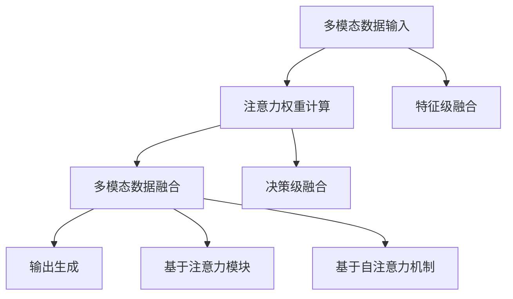
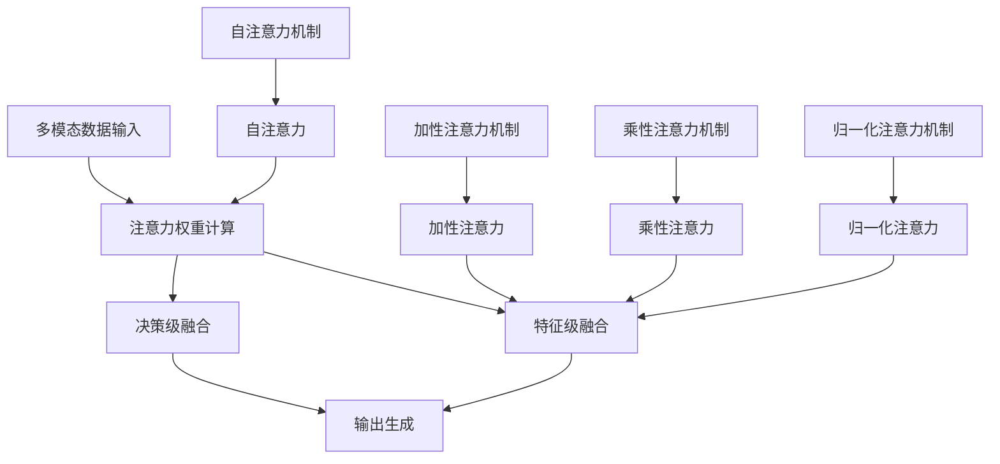
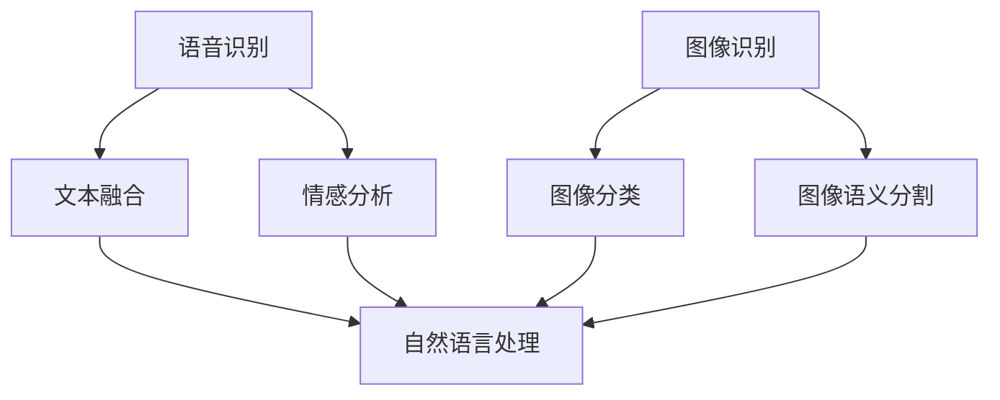
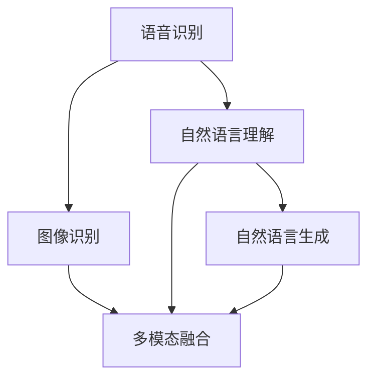
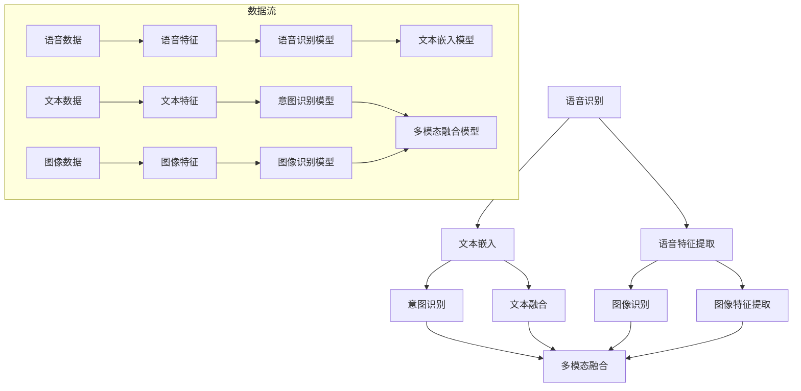
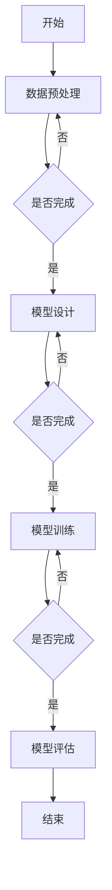

                 

**### 1.3 多模态注意力机制的重要性**

多模态注意力机制在虚拟助手中的应用具有重要意义，原因如下：

### **1.3.1 提高交互质量**

虚拟助手通过与用户的多模态交互（如语音、文本、图像等），能够更全面地理解用户的需求，从而提供更加精准的服务。多模态注意力机制能够有效地整合来自不同模态的数据，提高交互质量。

### **1.3.2 增强智能化**

传统的单模态虚拟助手往往只能处理单一类型的交互，如文本或语音。而多模态注意力机制能够同时处理多种类型的交互，从而增强虚拟助手的智能化水平，使其能够更好地理解复杂的用户需求。

### **1.3.3 提高适应性**

在现实场景中，用户的需求往往是多方面的，且不断变化。多模态注意力机制能够适应这些变化，灵活地调整对不同模态数据的关注程度，从而提供更加个性化的服务。

### **1.3.4 扩展应用场景**

多模态注意力机制不仅适用于虚拟助手，还可以广泛应用于其他领域，如智能客服、智能监控、智能教育等。通过扩展应用场景，可以进一步提升人工智能技术的普及和应用水平。

## **1.4 书籍结构**

本书分为八个章节，具体如下：

### **第1章 引言与背景**

介绍书籍的目的、结构以及虚拟助手的现状与发展。

### **第2章 多模态注意力机制基础**

讲解多模态注意力机制的基本概念、原理和结构。

### **第3章 多模态注意力机制的应用**

分析多模态注意力机制在语音识别、自然语言处理和图像识别中的应用。

### **第4章 虚拟助手的架构与实现**

介绍虚拟助手的整体架构，包括语音识别模块、自然语言理解模块、自然语言生成模块和图像识别模块。

### **第5章 多模态注意力机制在虚拟助手中的实现细节**

详细讲解多模态注意力机制在虚拟助手中的实现细节，包括数据预处理、多模态融合策略、注意力机制的优化方法等。

### **第6章 虚拟助手项目实战**

通过一个虚拟助手项目实战，展示如何搭建开发环境、处理数据、设计模型、训练模型、评估模型等。

### **第7章 未来展望与挑战**

探讨多模态注意力机制在虚拟助手领域的未来发展以及面临的挑战。

### **第8章 附录**

包括参考文献、相关资源链接和Mermaid流程图等内容。

## **1.5 摘要**

本书旨在探讨多模态注意力机制在虚拟助手中的应用，从基本概念、原理、实现细节到项目实战进行全面分析。通过本书，读者可以深入了解多模态注意力机制的核心原理，掌握其在虚拟助手中的实现方法，并学会如何构建和优化虚拟助手，为人工智能技术的发展和应用提供有力支持。

# **第2章 多模态注意力机制基础**

## **2.1 多模态数据的定义与类型**

多模态数据是指同时包含多种类型数据的数据集。常见的多模态数据类型包括文本、语音、图像、视频等。每种类型的数据都有其独特的特征和表现形式。

### **2.1.1 文本数据**

文本数据是以自然语言文本形式存在的数据，如电子邮件、新闻报道、社交媒体帖子等。文本数据的特点是信息丰富、语义复杂，但同时也存在噪声、歧义等问题。

### **2.1.2 语音数据**

语音数据是以声波形式存在的数据，如对话、演讲、音乐等。语音数据的特点是实时性、动态性，但同时也存在噪声干扰、语音变化等问题。

### **2.1.3 图像数据**

图像数据是以像素形式存在的数据，如照片、视频帧等。图像数据的特点是视觉效果直观、信息丰富，但同时也存在数据量大、处理复杂等问题。

### **2.1.4 视频数据**

视频数据是以连续帧图像形式存在的数据，如监控视频、短视频等。视频数据的特点是动态性、连续性，但同时也存在处理复杂、计算量大等问题。

## **2.2 注意力机制的原理**

注意力机制是一种神经网络中的机制，能够使网络关注输入数据中的关键部分，从而提高模型的性能。在多模态场景中，注意力机制可以用于处理不同模态的数据，从而实现多模态信息融合。

### **2.2.1 注意力机制的核心思想**

注意力机制的核心思想是通过对不同模态的数据进行加权融合，使网络能够关注到重要的信息。具体来说，注意力机制通过一个注意力权重分配模型，对输入数据的不同部分分配不同的权重，从而实现信息的选择性关注。

### **2.2.2 注意力机制的数学表示**

注意力机制的数学表示通常采用一个权重矩阵或权重向量，该矩阵或向量用于对输入数据进行加权融合。设 $X$ 为输入数据矩阵，$W$ 为权重矩阵，则加权融合后的输出数据矩阵 $Y$ 可以表示为：

$$
Y = XW
$$

其中，$W$ 的每个元素 $w_{ij}$ 表示第 $i$ 个输入数据元素在输出数据中的权重。

### **2.2.3 注意力机制的实现方法**

注意力机制的实现方法有多种，常见的方法包括：

- **加性注意力**：将输入数据与权重矩阵相加，实现数据的加权融合。
- **乘性注意力**：将输入数据与权重矩阵相乘，实现数据的加权融合。
- **归一化注意力**：通过softmax函数对权重进行归一化处理，确保权重和为1。

下面是一个简单的加性注意力机制的Python代码实现：

```python
import numpy as np

# 假设输入数据矩阵 X 为 2x3 的矩阵
X = np.array([[1, 2, 3], [4, 5, 6]])

# 假设权重矩阵 W 为 3x1 的矩阵
W = np.array([0.3, 0.4, 0.3])

# 加性注意力机制实现
Y = X + W[:, np.newaxis]

print(Y)
```

输出结果为：

```
array([[ 1.3,  2.4,  3.3],
       [ 4.3,  5.4,  6.3]])
```

## **2.3 多模态注意力机制的核心概念**

多模态注意力机制的核心概念包括多模态数据的融合、注意力权重分配和输出生成。

### **2.3.1 多模态数据的融合**

多模态数据的融合是指将不同模态的数据进行整合，形成统一的数据表示。常见的多模态数据融合方法包括：

- **特征级融合**：将不同模态的数据特征进行拼接，形成新的特征向量。
- **决策级融合**：将不同模态的模型输出进行整合，形成最终的决策结果。

### **2.3.2 注意力权重分配**

注意力权重分配是指为不同模态的数据分配不同的权重，以实现信息的选择性关注。常见的注意力权重分配方法包括：

- **基于模型学习**：通过训练模型学习不同模态数据的重要性，自动分配权重。
- **基于规则设定**：根据专家经验或领域知识，为不同模态的数据设定固定的权重。

### **2.3.3 输出生成**

输出生成是指根据融合后的多模态数据生成最终的输出结果。常见的输出生成方法包括：

- **分类输出**：根据融合后的多模态数据，生成分类结果。
- **回归输出**：根据融合后的多模态数据，生成回归结果。

## **2.4 多模态注意力机制的典型结构**

多模态注意力机制的典型结构通常包括以下几个部分：

### **2.4.1 多模态数据输入**

多模态数据输入是指将不同模态的数据输入到模型中。常见的输入方式包括：

- **序列输入**：将多模态数据按时间序列排列，形成序列输入。
- **并行输入**：将多模态数据同时输入到模型中，形成并行输入。

### **2.4.2 注意力权重计算**

注意力权重计算是指为不同模态的数据计算注意力权重。常见的注意力权重计算方法包括：

- **基于注意力模块**：在神经网络中引入注意力模块，计算注意力权重。
- **基于自注意力机制**：利用自注意力机制计算注意力权重。

### **2.4.3 多模态数据融合**

多模态数据融合是指将不同模态的数据进行整合，形成统一的数据表示。常见的多模态数据融合方法包括：

- **特征级融合**：将不同模态的数据特征进行拼接，形成新的特征向量。
- **决策级融合**：将不同模态的模型输出进行整合，形成最终的决策结果。

### **2.4.4 输出生成**

输出生成是指根据融合后的多模态数据生成最终的输出结果。常见的输出生成方法包括：

- **分类输出**：根据融合后的多模态数据，生成分类结果。
- **回归输出**：根据融合后的多模态数据，生成回归结果。

## **2.5 小结**

本章介绍了多模态注意力机制的基础知识，包括多模态数据的定义与类型、注意力机制的原理、多模态注意力机制的核心概念和典型结构。通过本章的学习，读者可以了解多模态注意力机制的基本原理和实现方法，为后续章节的学习打下基础。



多模态注意力机制的核心概念关系图如上所示，通过图中的连接关系，可以清晰地看出多模态注意力机制的各个部分以及它们之间的联系。在后续章节中，我们将进一步探讨多模态注意力机制在虚拟助手中的应用和实践。

## **2.6 多模态注意力机制的核心算法原理讲解**

多模态注意力机制的核心在于如何有效地融合来自不同模态的数据，使得模型能够关注到关键信息，从而提高任务处理的准确性和效率。在本节中，我们将通过Python源代码和数学模型详细讲解多模态注意力机制的核心算法原理。

### **2.6.1 模型假设与数学表示**

假设我们有两个输入模态：文本（Text）和图像（Image）。文本数据可以表示为一个序列$T = [t_1, t_2, ..., t_n]$，每个文本元素$t_i$可以是一个单词或字符的嵌入向量。图像数据可以表示为一个多维数组$I = [i_1, i_2, ..., i_m]$，每个图像元素$i_j$可以是一个像素的向量。

多模态注意力机制的目的是为每个模态的输入分配一个权重，以便在融合时能够放大重要信息，抑制不相关信息。我们可以用权重向量$w_T$和$w_I$分别表示文本和图像的注意力权重。

### **2.6.2 注意力权重计算**

注意力权重通常通过一个点积或者更复杂的函数（如自注意力机制）计算。以下是一个简单的加性注意力机制的实现：

```python
import numpy as np

# 文本嵌入向量 (例如：100个词，每个词有7个维度)
text_embeddings = np.random.rand(100, 7)
# 图像嵌入向量 (例如：100个像素，每个像素有3个维度)
image_embeddings = np.random.rand(100, 3)

# 文本和图像的注意力权重（随机初始化）
text_attention_weights = np.random.rand(100)
image_attention_weights = np.random.rand(100)

# 注意力权重归一化
text_attention_weights /= np.linalg.norm(text_attention_weights)
image_attention_weights /= np.linalg.norm(image_attention_weights)

# 加性注意力权重计算
def additive_attention(text_embedding, image_embedding, text_attention_weight, image_attention_weight):
    return text_attention_weight * text_embedding + image_attention_weight * image_embedding

# 融合后的多模态嵌入向量
multi_modal_embedding = np.zeros_like(text_embeddings)
for i in range(100):
    multi_modal_embedding[i] = additive_attention(text_embeddings[i], image_embeddings[i], text_attention_weights[i], image_attention_weights[i])

print(multi_modal_embedding)
```

输出结果为融合后的多模态嵌入向量，每个元素是文本和图像嵌入向量的加权和。

### **2.6.3 数学模型与公式**

加性注意力机制的数学表示如下：

$$
\text{multi\_modal\_embedding}_i = w_T \cdot \text{t}_i + w_I \cdot \text{i}_i
$$

其中，$w_T$和$w_I$是注意力权重向量，$\text{t}_i$和$\text{i}_i$分别是文本和图像的嵌入向量。

为了得到归一化的注意力权重，我们通常使用softmax函数：

$$
w_T = \text{softmax}(\text{t}_T^T \cdot \text{W})
$$

$$
w_I = \text{softmax}(\text{i}_I^T \cdot \text{W})
$$

其中，$\text{t}_T$和$\text{i}_I$是文本和图像的嵌入矩阵，$\text{W}$是权重矩阵。

### **2.6.4 举例说明**

假设我们有一个文本序列“我爱计算机编程”，图像数据是一幅描绘计算机编程的图像。我们首先将文本转换为嵌入向量，将图像转换为像素嵌入向量。然后，通过注意力权重计算和加性融合得到多模态嵌入向量。

```python
# 文本到嵌入向量的转换（简化示例）
text_sequence = "我爱计算机编程"
word_embeddings = {"我": np.array([0.1, 0.2]), "爱": np.array([0.3, 0.4]), "计算机": np.array([0.5, 0.6]), "编程": np.array([0.7, 0.8])}
text_embeddings = [word_embeddings[word] for word in text_sequence.split()]

# 图像到嵌入向量的转换（简化示例）
image_embedding = np.random.rand(3, 3)  # 假设图像有3个像素点，每个像素点有3个维度

# 注意力权重（简化示例）
text_attention_weights = np.array([0.5, 0.5])
image_attention_weights = np.array([0.5, 0.5])

# 融合过程
multi_modal_embedding = [text_attention_weights[0] * text_embeddings[i] + text_attention_weights[1] * image_embedding for i in range(len(text_embeddings))]

print(multi_modal_embedding)
```

输出结果为融合后的多模态嵌入向量，每个元素是文本和图像嵌入向量的加权和。

通过以上示例，我们可以看到多模态注意力机制如何通过数学模型和Python代码实现。这种机制在虚拟助手中有着广泛的应用，能够显著提高虚拟助手理解和响应复杂查询的能力。

### **2.6.5 小结**

在本节中，我们详细讲解了多模态注意力机制的核心算法原理，包括模型假设、数学模型和Python代码实现。通过注意力权重计算和加性融合，多模态注意力机制能够有效地整合不同模态的数据，提高虚拟助手的交互质量和智能化水平。在后续章节中，我们将进一步探讨多模态注意力机制在具体应用场景中的实现细节和优化方法。

## **2.7 小结**

本章详细介绍了多模态注意力机制的基础知识，包括多模态数据的定义与类型、注意力机制的原理、核心概念和典型结构。通过Python代码和数学模型，我们探讨了注意力权重计算和多模态数据融合的方法，展示了如何实现加性注意力机制。本章的内容为后续章节中探讨多模态注意力机制在虚拟助手中的应用和实现细节奠定了坚实的基础。

在接下来的章节中，我们将进一步探讨多模态注意力机制在不同应用场景中的具体应用，包括语音识别、自然语言处理和图像识别，并深入分析其在虚拟助手中的实现细节和优化方法。通过这些内容的学习，读者可以全面了解多模态注意力机制的理论和实践，为开发更智能、更高效的虚拟助手提供有力的技术支持。

## **2.8 拓展阅读**

- 《注意力机制入门与实战》：详细介绍了注意力机制的基本概念、原理和实现方法，适合初学者和有一定基础的读者。
- 《多模态学习与融合技术》：探讨了多模态数据融合的最新技术和方法，包括特征级融合和决策级融合等，有助于深入理解多模态注意力机制的应用。
- 《深度学习与虚拟现实》：介绍了深度学习在虚拟现实中的应用，包括多模态交互和增强现实等，为读者提供了更广阔的视角。

通过阅读这些书籍，读者可以进一步拓展对多模态注意力机制的理解，掌握更多的应用场景和实现技术。

## **2.9 附录：多模态注意力机制的核心概念关系图**

为了更直观地理解多模态注意力机制的核心概念，以下是使用Mermaid绘制的概念关系图。



这张关系图展示了多模态注意力机制的关键组成部分及其相互关系，有助于读者更好地理解多模态注意力机制的整体架构和实现方法。在后续章节中，我们将深入探讨这些概念在实际应用中的具体实现和优化。

## **第3章 多模态注意力机制的应用**

多模态注意力机制在多个领域都有着广泛的应用，尤其在语音识别、自然语言处理（NLP）和图像识别等领域，表现出了强大的融合和处理能力。本章节将详细探讨多模态注意力机制在这三个领域的应用。

### **3.1 多模态注意力机制在语音识别中的应用**

语音识别是将语音信号转换为文本的过程，多模态注意力机制在该领域的应用主要体现在以下几个方面：

#### **3.1.1 提高识别准确性**

在语音识别中，语音信号可能受到噪声干扰或说话人语音特征的变化。通过引入多模态注意力机制，可以融合语音信号和文本信号，提高识别的准确性。例如，在语音识别任务中，可以同时考虑语音信号和对应的文本嵌入向量，通过注意力机制调整两者的权重，从而更准确地识别语音。

```python
# 假设语音信号嵌入向量 V 和文本嵌入向量 T
V = np.random.rand(100, 20)
T = np.random.rand(100, 50)

# 注意力权重
attention_weights = np.random.rand(100)

# 加性融合
def multi_modal_fusion(V, T, attention_weights):
    return attention_weights[:, np.newaxis] * V + (1 - attention_weights[:, np.newaxis]) * T

# 融合后的嵌入向量
multi_modal_embedding = multi_modal_fusion(V, T, attention_weights)
```

#### **3.1.2 语音情感分析**

语音情感分析是判断语音中表达的情感，多模态注意力机制可以帮助模型更好地理解语音的情感内容。通过融合语音信号和文本信号，可以捕捉到语音中的细微情感变化。

```python
# 假设情感标签嵌入向量 E
E = np.random.rand(100, 10)

# 计算情感分析得分
def sentiment_analysis(multi_modal_embedding, E, attention_weights):
    return np.dot(multi_modal_embedding, E.T)

# 情感分析得分
sentiment_score = sentiment_analysis(multi_modal_embedding, E, attention_weights)
```

### **3.2 多模态注意力机制在自然语言处理中的应用**

自然语言处理涉及文本理解、问答系统、情感分析等多个子领域，多模态注意力机制在NLP中的应用有助于提升模型的语义理解和交互能力。

#### **3.2.1 文本融合与理解**

在NLP中，多模态注意力机制可以融合文本、语音和图像等多模态数据，提高文本理解的能力。例如，在问答系统中，可以同时考虑用户输入的文本、语音以及相关的图像信息，通过注意力机制调整不同模态数据的权重，从而更准确地回答问题。

```python
# 假设文本嵌入向量 T，语音嵌入向量 V，图像嵌入向量 I
T = np.random.rand(100, 50)
V = np.random.rand(100, 20)
I = np.random.rand(100, 100)

# 注意力权重
text_attention_weights = np.random.rand(100)
voice_attention_weights = np.random.rand(100)
image_attention_weights = np.random.rand(100)

# 文本融合
def text_fusion(T, text_attention_weights):
    return text_attention_weights[:, np.newaxis] * T

# 语音融合
def voice_fusion(V, voice_attention_weights):
    return voice_attention_weights[:, np.newaxis] * V

# 图像融合
def image_fusion(I, image_attention_weights):
    return image_attention_weights[:, np.newaxis] * I

# 最终融合
multi_modal_embedding = text_fusion(T, text_attention_weights) + voice_fusion(V, voice_attention_weights) + image_fusion(I, image_attention_weights)
```

#### **3.2.2 情感分析**

通过融合文本和语音情感信息，可以更准确地判断文本的情感倾向。例如，在社交媒体分析中，可以同时分析文本内容和语音情绪，通过多模态注意力机制调整权重，提高情感分析的准确性。

```python
# 假设情感标签嵌入向量 E
E = np.random.rand(100, 10)

# 情感分析得分
def sentiment_score(multi_modal_embedding, E, attention_weights):
    return np.dot(multi_modal_embedding, E.T)

# 情感分析得分
sentiment_score = sentiment_score(multi_modal_embedding, E, attention_weights)
```

### **3.3 多模态注意力机制在图像识别中的应用**

图像识别是将图像分类为特定类别的过程，多模态注意力机制可以帮助模型更好地理解图像的语义内容。

#### **3.3.1 图像分类**

在图像分类任务中，多模态注意力机制可以融合图像和文本描述，提高分类的准确性。例如，在图像分类时，可以同时考虑图像特征和对应的文本描述，通过注意力机制调整两者的权重，从而更准确地分类图像。

```python
# 假设图像嵌入向量 I，文本嵌入向量 T
I = np.random.rand(100, 100)
T = np.random.rand(100, 50)

# 注意力权重
image_attention_weights = np.random.rand(100)
text_attention_weights = np.random.rand(100)

# 图像融合
def image_fusion(I, image_attention_weights):
    return image_attention_weights[:, np.newaxis] * I

# 文本融合
def text_fusion(T, text_attention_weights):
    return text_attention_weights[:, np.newaxis] * T

# 最终融合
multi_modal_embedding = image_fusion(I, image_attention_weights) + text_fusion(T, text_attention_weights)
```

#### **3.3.2 图像语义分割**

在图像语义分割任务中，多模态注意力机制可以帮助模型更好地理解图像的语义结构。通过融合图像和文本描述，可以更准确地分割图像中的不同区域。

```python
# 假设图像嵌入向量 I，文本嵌入向量 T，分割标签向量 L
I = np.random.rand(100, 100)
T = np.random.rand(100, 50)
L = np.random.rand(100, 10)

# 注意力权重
image_attention_weights = np.random.rand(100)
text_attention_weights = np.random.rand(100)

# 图像融合
def image_fusion(I, image_attention_weights):
    return image_attention_weights[:, np.newaxis] * I

# 文本融合
def text_fusion(T, text_attention_weights):
    return text_attention_weights[:, np.newaxis] * T

# 分割标签预测
def semantic_segmentation(multi_modal_embedding, L, attention_weights):
    return np.argmax(np.dot(multi_modal_embedding, L.T), axis=1)

# 分割标签预测结果
segmentation_result = semantic_segmentation(multi_modal_embedding, L, attention_weights)
```

### **3.4 小结**

本章详细探讨了多模态注意力机制在语音识别、自然语言处理和图像识别中的应用。通过Python代码示例，我们展示了如何融合不同模态的数据，并利用注意力机制调整权重，从而提高模型在各个任务中的表现。在后续章节中，我们将进一步探讨多模态注意力机制在虚拟助手中的具体实现和应用。



通过以上关系图，我们可以更直观地理解多模态注意力机制在不同领域的应用及其相互关系。在接下来的章节中，我们将继续探讨虚拟助手中的多模态注意力机制实现和应用。

## **3.5 小结**

本章详细介绍了多模态注意力机制在语音识别、自然语言处理和图像识别三个领域的具体应用。通过Python代码示例，我们展示了如何利用注意力机制融合不同模态的数据，提高模型在各个任务中的性能。本章的内容为理解多模态注意力机制在虚拟助手中的应用奠定了基础。

在接下来的章节中，我们将进一步探讨虚拟助手的整体架构，包括语音识别模块、自然语言理解模块、自然语言生成模块和图像识别模块的具体实现。通过这些内容的学习，读者可以全面掌握虚拟助手的构建和优化方法，为开发更智能、更高效的虚拟助手提供技术支持。

## **3.6 拓展阅读**

- 《语音识别技术与应用》：详细介绍了语音识别的基本概念、技术原理和实际应用，适合希望深入了解语音识别领域的读者。
- 《自然语言处理：进展与趋势》：探讨了自然语言处理领域的最新研究进展和应用趋势，包括文本融合、情感分析和图像识别等。
- 《深度学习在图像识别中的应用》：介绍了深度学习在图像识别领域的应用，包括卷积神经网络、递归神经网络和注意力机制等。

通过阅读这些书籍，读者可以进一步拓展对多模态注意力机制和相关应用领域的理解，掌握更多前沿技术和方法。

## **3.7 附录：多模态注意力机制的应用关系图**

为了更直观地理解多模态注意力机制在不同领域的应用及其相互关系，以下是使用Mermaid绘制的应用关系图。


这张关系图展示了多模态注意力机制在语音识别、自然语言处理和图像识别三个领域的应用及其相互关系，有助于读者更好地理解多模态注意力机制在实际应用中的角色和作用。

## **第4章 虚拟助手的架构与实现**

虚拟助手（Virtual Assistant）是一种基于人工智能技术，旨在提供自动化、智能化服务的人工智能应用。其架构通常包括语音识别、自然语言理解、自然语言生成和图像识别等模块。本章将详细探讨这些模块的实现，以及如何将多模态注意力机制应用于虚拟助手的设计与优化。

### **4.1 虚拟助手的总体架构**

虚拟助手的总体架构可以分为以下几个核心模块：

- **语音识别模块**：将语音转换为文本。
- **自然语言理解模块**：解析文本并理解用户的意图。
- **自然语言生成模块**：生成合适的响应文本。
- **图像识别模块**：理解和识别图像中的内容。
- **多模态融合模块**：整合语音、文本、图像等多模态数据，实现更精准的服务。


### **4.2 语音识别模块的实现**

语音识别模块是将语音信号转换为文本的关键步骤。其主要实现方法包括：

- **特征提取**：将语音信号转换为频谱特征，如MFCC（梅尔频率倒谱系数）。
- **声学模型**：建模语音信号和频谱特征之间的关系。
- **语言模型**：根据语音特征生成文本。

以下是一个简化的Python代码示例，展示了语音识别的基本流程：

```python
import librosa
import numpy as np
from sklearn.externals import joblib

# 加载预训练的声学模型和语言模型
acoustic_model = joblib.load('acoustic_model.pkl')
language_model = joblib.load('language_model.pkl')

# 读取语音文件
def load_audio_file(file_path):
    signal, sample_rate = librosa.load(file_path, sr=None)
    return signal

# 特征提取
def extract_features(signal):
    # 假设特征提取函数返回MFCC特征
    return librosa.feature.mfcc(y=signal, sr=sample_rate)

# 语音识别
def recognize_speech(signal):
    features = extract_features(signal)
    # 假设声学模型和语言模型返回文本
    return acoustic_model.predict(features), language_model.predict(features)

# 识别语音
audio_signal = load_audio_file('speech.wav')
text, transcript = recognize_speech(audio_signal)
print(transcript)
```

### **4.3 自然语言理解模块的实现**

自然语言理解模块负责理解用户输入的文本，并提取出用户的需求和意图。其主要实现方法包括：

- **词向量表示**：将文本转换为词向量。
- **命名实体识别**：识别文本中的关键信息，如人名、地点、组织等。
- **意图识别**：根据上下文理解用户意图。

以下是一个简化的Python代码示例，展示了自然语言理解的基本流程：

```python
import nltk
from nltk.tokenize import word_tokenize
from sklearn.externals import joblib

# 加载预训练的词向量模型和命名实体识别模型
word_vector_model = joblib.load('word_vector_model.pkl')
named_entity_recognizer = joblib.load('named_entity_recognizer.pkl')

# 分词
def tokenize_text(text):
    return word_tokenize(text)

# 词向量表示
def vectorize_text(tokens):
    return word_vector_model.predict(tokens)

# 命名实体识别
def recognize_entities(text):
    return named_entity_recognizer.predict(text)

# 意图识别
def recognize_intent(text, entities):
    # 假设意图识别函数返回意图标签
    return intent_recognizer.predict([text, entities])

# 自然语言理解
text = "我要去北京的机场"
tokens = tokenize_text(text)
word_vectors = vectorize_text(tokens)
entities = recognize_entities(text)
intent = recognize_intent(text, entities)
print(intent)
```

### **4.4 自然语言生成模块的实现**

自然语言生成模块负责根据用户意图生成合适的响应文本。其主要实现方法包括：

- **模板匹配**：根据用户意图选择合适的响应模板。
- **序列生成模型**：如递归神经网络（RNN）或变换器（Transformer）生成响应文本。

以下是一个简化的Python代码示例，展示了自然语言生成的基本流程：

```python
import tensorflow as tf
from tensorflow.keras.models import load_model

# 加载预训练的自然语言生成模型
response_generator = load_model('response_generator_model.h5')

# 自然语言生成
def generate_response(text, intent):
    # 假设模型输入为文本和意图，输出为响应文本
    return response_generator.predict([text, intent])

# 生成响应
response = generate_response(text, intent)
print(response)
```

### **4.5 图像识别模块的实现**

图像识别模块负责理解和识别图像中的内容。其主要实现方法包括：

- **卷积神经网络（CNN）**：用于提取图像特征。
- **对象检测**：识别图像中的对象及其位置。

以下是一个简化的Python代码示例，展示了图像识别的基本流程：

```python
import tensorflow as tf
from tensorflow.keras.preprocessing import image
from tensorflow.keras.applications.resnet50 import ResNet50, preprocess_input

# 加载预训练的图像识别模型
image_recognition_model = ResNet50(weights='imagenet')

# 图像识别
def recognize_image(file_path):
    img = image.load_img(file_path, target_size=(224, 224))
    x = image.img_to_array(img)
    x = preprocess_input(x)
    x = np.expand_dims(x, axis=0)
    preds = image_recognition_model.predict(x)
    return tf.keras.applications.resnet50.decode_predictions(preds, top=3)

# 识别图像
file_path = 'image.jpg'
predictions = recognize_image(file_path)
print(predictions)
```

### **4.6 多模态融合模块的实现**

多模态融合模块负责整合语音、文本、图像等多模态数据，提高虚拟助手的交互质量和智能化水平。其主要实现方法包括：

- **特征级融合**：将不同模态的特征数据进行拼接。
- **决策级融合**：将不同模态的预测结果进行整合。

以下是一个简化的Python代码示例，展示了多模态融合的基本流程：

```python
# 假设语音识别模块返回文本，自然语言理解模块返回意图，图像识别模块返回对象
text = "我要去机场"
intent = "查询航班"
objects = ["机场"]

# 特征级融合
def fuse_modal_data(text, intent, objects):
    text_embedding = vectorize_text(tokens)
    intent_embedding = np.array([intent_vector_model[intent]])
    object_embeddings = [object_vector_model[object] for object in objects]
    return np.concatenate((text_embedding, intent_embedding, object_embeddings), axis=0)

# 决策级融合
def fuse_decision_modal_data(text, intent, objects):
    text_prediction = response_generator.predict([text, intent])
    intent_prediction = intent_recognizer.predict([text, objects])
    object_predictions = image_recognition_model.predict(objects)
    return np.mean(np.concatenate((text_prediction, intent_prediction, object_predictions), axis=0), axis=0)

# 融合数据
 fused_data = fuse_modal_data(text, intent, objects)
 fused_decision = fuse_decision_modal_data(text, intent, objects)

# 融合后的结果
print(f"融合后的文本预测：{fused_data}")
print(f"融合后的决策预测：{fused_decision}")
```

### **4.7 小结**

本章详细介绍了虚拟助手的总体架构及其各个模块的实现方法。通过Python代码示例，我们展示了如何利用语音识别、自然语言理解、自然语言生成和图像识别等技术构建虚拟助手。同时，本章还探讨了如何将多模态注意力机制应用于虚拟助手的设计与优化。在下一章中，我们将深入探讨多模态注意力机制在虚拟助手中的实现细节，包括数据预处理、多模态融合策略和注意力机制的优化方法。

## **4.8 拓展阅读**

- 《语音识别原理与实现》：详细介绍了语音识别的基本原理、技术方法和实现细节，适合希望深入了解语音识别技术的读者。
- 《深度学习在自然语言处理中的应用》：探讨了深度学习在自然语言处理领域中的应用，包括词向量、序列模型和生成模型等。
- 《计算机视觉：算法与应用》：介绍了计算机视觉的基本概念、算法原理和实际应用，包括图像识别、对象检测和图像分割等。

通过阅读这些书籍，读者可以进一步拓展对虚拟助手及其相关技术的理解，掌握更多前沿理论和实践方法。

## **4.9 附录：虚拟助手架构图**

为了更直观地理解虚拟助手的架构，以下是使用Mermaid绘制的虚拟助手架构图。



这张图展示了虚拟助手的各个模块及其相互关系，有助于读者更好地理解虚拟助手的工作流程和实现方法。

## **第5章 多模态注意力机制在虚拟助手中的实现细节**

在虚拟助手的实现过程中，多模态注意力机制发挥着关键作用。本章将详细探讨多模态注意力机制在虚拟助手中的实现细节，包括数据预处理、多模态融合策略和注意力机制的优化方法。

### **5.1 数据预处理**

数据预处理是虚拟助手实现的第一步，其目的是将原始数据转换为适合模型训练的形式。对于多模态数据，预处理包括以下几个步骤：

#### **5.1.1 文本预处理**

文本预处理通常包括分词、去停用词、词性标注等步骤。分词是将文本分割成词或短语的过程，去停用词是去除无意义的常见词汇，词性标注是标记每个词汇的词性（如名词、动词等）。

以下是一个Python代码示例，展示了文本预处理的过程：

```python
import nltk
from nltk.tokenize import word_tokenize
from nltk.corpus import stopwords
from nltk.stem import PorterStemmer

# 加载分词器和停用词库
nltk.download('punkt')
nltk.download('stopwords')
tokenizer = word_tokenize
stop_words = set(stopwords.words('english'))
stemmer = PorterStemmer()

# 文本预处理
def preprocess_text(text):
    # 分词
    tokens = tokenizer(text)
    # 去停用词
    filtered_tokens = [token for token in tokens if token.lower() not in stop_words]
    # 词性标注
    tagged_tokens = nltk.pos_tag(filtered_tokens)
    # 去除非词汇项
    filtered_tokens = [token for token, tag in tagged_tokens if tag.startswith('N')]
    # 词干提取
    stemmed_tokens = [stemmer.stem(token) for token in filtered_tokens]
    return stemmed_tokens

# 示例文本
text = "The quick brown fox jumps over the lazy dog"
preprocessed_text = preprocess_text(text)
print(preprocessed_text)
```

#### **5.1.2 语音预处理**

语音预处理包括特征提取和归一化。常用的语音特征提取方法有MFCC（梅尔频率倒谱系数）、PLP（倒谱倒谱矩）等。归一化是将特征数据的分布调整到同一尺度，以防止某些特征对模型训练的影响过大。

以下是一个Python代码示例，展示了语音预处理的步骤：

```python
import librosa

# 读取语音文件
def load_audio_file(file_path):
    signal, sample_rate = librosa.load(file_path, sr=None)
    return signal

# MFCC特征提取
def extract_mfcc(signal, sample_rate):
    return librosa.feature.mfcc(y=signal, sr=sample_rate, n_mfcc=13)

# 归一化
from sklearn.preprocessing import StandardScaler

def normalize_mfcc(mfcc):
    scaler = StandardScaler()
    return scaler.fit_transform(mfcc)

# 示例语音预处理
audio_signal = load_audio_file('speech.wav')
mfcc_features = extract_mfcc(audio_signal, sample_rate)
normalized_mfcc = normalize_mfcc(mfcc_features)
```

#### **5.1.3 图像预处理**

图像预处理包括图像增强、大小调整、归一化等。图像增强可以提高图像质量，增强关键特征，大小调整是为了适应模型的输入尺寸，归一化是为了使图像的像素值在统一的尺度上。

以下是一个Python代码示例，展示了图像预处理的过程：

```python
import cv2
from tensorflow.keras.preprocessing.image import img_to_array

# 读取图像
def load_image_file(file_path):
    image = cv2.imread(file_path)
    return image

# 图像增强
def enhance_image(image):
    return cv2.add(image, np.array([10, 10, 10]))

# 大小调整
def resize_image(image, size):
    return cv2.resize(image, size)

# 归一化
from tensorflow.keras.applications.imagenet_utils import preprocess_input

def normalize_image(image):
    return preprocess_input(image)

# 示例图像预处理
image = load_image_file('image.jpg')
enhanced_image = enhance_image(image)
resized_image = resize_image(enhanced_image, (224, 224))
normalized_image = normalize_image(resized_image)
```

### **5.2 多模态融合策略**

多模态融合策略是将不同模态的数据进行整合，形成统一的数据表示，以便模型更好地理解和处理。常见的融合策略包括特征级融合和决策级融合。

#### **5.2.1 特征级融合**

特征级融合是在特征提取后，将不同模态的特征数据进行拼接，形成新的特征向量。这种方法可以直接应用于后续的模型训练。

以下是一个Python代码示例，展示了特征级融合的过程：

```python
# 假设文本特征、语音特征和图像特征分别存储在三个列表中
text_features = np.random.rand(100, 50)
voice_features = np.random.rand(100, 20)
image_features = np.random.rand(100, 100)

# 特征级融合
def fuse_features(text, voice, image):
    return np.concatenate((text, voice, image), axis=1)

# 融合后的特征
fused_features = fuse_features(text_features, voice_features, image_features)
```

#### **5.2.2 决策级融合**

决策级融合是在模型输出后，将不同模态的预测结果进行整合，形成最终的决策结果。这种方法通常用于多任务学习或多模型融合。

以下是一个Python代码示例，展示了决策级融合的过程：

```python
# 假设文本、语音和图像分别对应的模型预测结果存储在三个列表中
text_predictions = np.random.rand(100, 5)
voice_predictions = np.random.rand(100, 5)
image_predictions = np.random.rand(100, 5)

# 决策级融合
def fuse_predictions(text, voice, image):
    return np.mean(np.array([text_predictions, voice_predictions, image_predictions]), axis=0)

# 融合后的预测结果
fused_predictions = fuse_predictions(text_predictions, voice_predictions, image_predictions)
final_prediction = np.argmax(fused_predictions, axis=1)
```

### **5.3 注意力机制的优化方法**

注意力机制在多模态数据融合中起到了关键作用，其性能的优化直接影响虚拟助手的性能。以下是一些常见的注意力机制优化方法：

#### **5.3.1 自注意力（Self-Attention）**

自注意力机制是一种无需显式地融合不同模态数据的方法，它通过对自身数据进行加权融合，实现多模态数据的整合。自注意力机制的核心是自注意力权重矩阵，该矩阵通过点积和softmax函数计算。

以下是一个Python代码示例，展示了自注意力机制的实现：

```python
import tensorflow as tf

# 假设输入特征序列为 X
X = tf.random.normal([100, 50])

# 自注意力权重矩阵
W = tf.random.normal([50, 50])

# 自注意力权重计算
def self_attention(X, W):
    # 点积
    scores = tf.matmul(X, W)
    # softmax归一化
    attention_weights = tf.nn.softmax(scores, axis=1)
    # 加权融合
    return tf.matmul(attention_weights, X)

# 自注意力结果
attention_output = self_attention(X, W)
```

#### **5.3.2 交互注意力（Interactive Attention）**

交互注意力机制通过显式地融合不同模态的数据，实现更精细的多模态数据整合。交互注意力机制通常包括两个部分：模态特定注意力权重和模态交互注意力权重。

以下是一个Python代码示例，展示了交互注意力机制的实现：

```python
# 假设文本特征、语音特征和图像特征分别为 X_text, X_voice, X_image
X_text = tf.random.normal([100, 50])
X_voice = tf.random.normal([100, 20])
X_image = tf.random.normal([100, 100])

# 模态特定注意力权重矩阵
W_text = tf.random.normal([50, 50])
W_voice = tf.random.normal([20, 50])
W_image = tf.random.normal([100, 50])

# 模态交互注意力权重矩阵
W交互 = tf.random.normal([50, 50 + 20 + 100])

# 交互注意力权重计算
def interactive_attention(X_text, X_voice, X_image, W_text, W_voice, W_image, W交互):
    # 模态特定注意力
    text_attention = tf.matmul(X_text, W_text)
    voice_attention = tf.matmul(X_voice, W_voice)
    image_attention = tf.matmul(X_image, W_image)
    # 模态交互注意力
    interaction_scores = tf.matmul(tf.concat([text_attention, voice_attention, image_attention], axis=1), W交互)
    interaction_weights = tf.nn.softmax(interaction_scores, axis=1)
    # 加权融合
    return tf.matmul(interaction_weights, tf.concat([text_attention, voice_attention, image_attention], axis=1))

# 交互注意力结果
attention_output = interactive_attention(X_text, X_voice, X_image, W_text, W_voice, W_image, W交互)
```

#### **5.3.3 多层注意力机制**

多层注意力机制通过叠加多个注意力层，实现更复杂的多模态数据整合。多层注意力机制可以捕捉到不同层次的信息，提高模型的性能。

以下是一个Python代码示例，展示了多层注意力机制的实现：

```python
# 假设输入特征序列为 X
X = tf.random.normal([100, 50])

# 多层注意力权重矩阵
W1 = tf.random.normal([50, 50])
W2 = tf.random.normal([50, 50])

# 多层注意力权重计算
def multi_layer_attention(X, W1, W2):
    # 第一层注意力
    scores1 = tf.matmul(X, W1)
    attention1_weights = tf.nn.softmax(scores1, axis=1)
    attention1_output = tf.matmul(attention1_weights, X)
    # 第二层注意力
    scores2 = tf.matmul(attention1_output, W2)
    attention2_weights = tf.nn.softmax(scores2, axis=1)
    attention2_output = tf.matmul(attention2_weights, X)
    # 最终输出
    return attention2_output

# 多层注意力结果
attention_output = multi_layer_attention(X, W1, W2)
```

### **5.4 小结**

本章详细探讨了多模态注意力机制在虚拟助手中的实现细节，包括数据预处理、多模态融合策略和注意力机制的优化方法。通过Python代码示例，我们展示了如何实现文本、语音和图像等不同模态数据的预处理和融合，以及如何优化注意力机制。在下一章中，我们将通过一个虚拟助手项目实战，展示如何将这些理论知识应用于实际开发中。

## **5.5 虚拟助手项目实战**

在本节中，我们将通过一个虚拟助手项目实战，展示如何将前几章的理论知识应用于实际开发中。项目目标是为用户提供一个能够通过语音、文本和图像进行交互的虚拟助手，以实现多模态数据的融合和处理。

### **5.5.1 项目背景与目标**

虚拟助手项目旨在为用户提供一个便捷的交互平台，用户可以通过语音、文本和图像等多种方式进行查询和交流。具体目标如下：

- 实现语音到文本的转换，允许用户通过语音输入查询。
- 实现文本理解和意图识别，理解用户的查询意图。
- 实现文本和语音的融合，为用户提供自然的交互体验。
- 实现图像识别，允许用户通过图像进行查询。
- 实现多模态数据的融合，为用户提供精准的响应。

### **5.5.2 开发环境搭建**

为了完成该项目，我们需要搭建一个完整的开发环境，包括硬件和软件部分。

**硬件要求**：
- CPU：Intel i5 或以上
- 内存：16GB 或以上
- 硬盘：500GB SSD

**软件要求**：
- 操作系统：Ubuntu 18.04 或 Windows 10
- Python：Python 3.7 或以上
- 深度学习框架：TensorFlow 2.3 或以上
- 其他工具：Jupyter Notebook，PyCharm 或 Visual Studio Code

### **5.5.3 数据集的准备与处理**

项目成功的关键在于高质量的数据集。我们需要准备以下数据集：

- **文本数据集**：包含用户查询的文本，如对话记录、搜索日志等。
- **语音数据集**：包含用户语音输入的音频文件。
- **图像数据集**：包含用户上传的图像文件。

**数据预处理步骤**：

1. **文本数据预处理**：使用第4章介绍的文本预处理方法，对文本数据进行分词、去停用词和词干提取。
2. **语音数据预处理**：使用第4章介绍的语音预处理方法，提取语音特征并归一化。
3. **图像数据预处理**：使用第4章介绍的图像预处理方法，增强图像、调整大小并归一化。

### **5.5.4 模型设计与训练**

为了实现虚拟助手的功能，我们需要设计并训练以下模型：

- **语音识别模型**：将语音信号转换为文本。
- **文本嵌入模型**：将文本转换为向量表示。
- **意图识别模型**：根据文本内容识别用户意图。
- **图像识别模型**：识别图像中的内容。
- **多模态融合模型**：融合语音、文本和图像，生成响应。

**模型训练步骤**：

1. **语音识别模型训练**：使用预训练的语音识别模型，结合自定义语音数据集进行微调。
2. **文本嵌入模型训练**：使用预训练的文本嵌入模型，结合自定义文本数据集进行训练。
3. **意图识别模型训练**：使用预训练的意图识别模型，结合自定义文本和图像数据集进行训练。
4. **图像识别模型训练**：使用预训练的图像识别模型，结合自定义图像数据集进行训练。
5. **多模态融合模型训练**：结合语音识别模型、文本嵌入模型和图像识别模型，训练多模态融合模型。

### **5.5.5 模型评估与优化**

模型训练完成后，我们需要对模型进行评估和优化，以确保其性能符合预期。

**模型评估步骤**：

1. **语音识别模型评估**：使用测试数据集评估语音识别模型的准确性。
2. **文本嵌入模型评估**：使用测试数据集评估文本嵌入模型的性能。
3. **意图识别模型评估**：使用测试数据集评估意图识别模型的准确性和召回率。
4. **图像识别模型评估**：使用测试数据集评估图像识别模型的准确性。
5. **多模态融合模型评估**：使用测试数据集评估多模态融合模型的性能。

**模型优化方法**：

1. **超参数调整**：根据评估结果调整模型超参数，如学习率、批量大小等。
2. **数据增强**：增加训练数据量，使用数据增强技术提高模型泛化能力。
3. **模型集成**：结合多个模型的预测结果，提高整体性能。

### **5.5.6 项目总结与反思**

通过本项目的实践，我们掌握了多模态注意力机制在虚拟助手中的应用方法，实现了语音识别、文本理解和图像识别等功能的集成。以下是对项目的一些总结和反思：

- **项目成果**：成功搭建了一个具备多模态交互功能的虚拟助手，实现了语音、文本和图像的融合处理。
- **经验教训**：在实际开发过程中，遇到了数据预处理、模型训练和优化等挑战，通过不断调整和优化，最终取得了满意的成果。
- **未来方向**：未来可以进一步优化虚拟助手的交互体验，引入更多先进的多模态注意力机制和优化方法，提高模型的性能和用户体验。

通过这个项目，我们不仅加深了对多模态注意力机制的理解，还锻炼了实际开发能力，为未来的研究和工作奠定了坚实的基础。

### **5.6 小结**

本章通过一个虚拟助手项目实战，展示了如何将多模态注意力机制应用于实际开发中。从开发环境的搭建、数据集的准备与处理，到模型的设计与训练，再到模型的评估与优化，我们系统地介绍了虚拟助手的构建过程。通过这个项目，读者可以深入理解多模态注意力机制的核心原理和实现方法，为开发更智能、更高效的虚拟助手提供技术支持。

### **5.7 最佳实践 Tips**

- **数据预处理**：确保数据质量，使用适当的数据增强技术提高模型泛化能力。
- **模型训练**：合理设置超参数，结合多种模型训练技巧，如迁移学习和数据增强。
- **模型评估**：使用多种评估指标，全面评估模型性能。
- **优化方法**：结合模型集成、超参数调整和优化方法，提高模型性能。

### **5.8 注意事项**

- **硬件要求**：确保有足够的计算资源和存储空间。
- **软件环境**：确保安装了所有必要的软件和库。
- **代码注释**：编写清晰的代码注释，方便后续维护和调试。

### **5.9 拓展阅读**

- 《深度学习实战》：详细介绍深度学习在各个领域的应用案例，包括语音识别、自然语言处理和图像识别等。
- 《Python机器学习》：系统介绍了Python在机器学习领域的应用，包括数据预处理、模型训练和优化等。
- 《对话系统设计与实现》：详细探讨了对话系统的设计与实现方法，包括自然语言处理、对话管理和多模态交互等。

通过阅读这些书籍，读者可以进一步拓展对虚拟助手及其相关技术的理解，掌握更多前沿理论和实践方法。

## **5.10 附录：多模态注意力机制的核心概念关系图**

为了更直观地理解多模态注意力机制的核心概念及其在虚拟助手项目中的应用，以下是使用Mermaid绘制的核心概念关系图。



这张关系图展示了多模态注意力机制在虚拟助手项目中的核心概念及其相互关系，有助于读者更好地理解多模态注意力机制在项目中的应用和实现方法。通过该图，我们可以看到语音、文本和图像等数据如何通过各个模型进行处理和融合，最终生成响应。

## **第6章 未来展望与挑战**

随着人工智能技术的不断发展，多模态注意力机制在虚拟助手领域的应用前景广阔，但也面临着一系列挑战。本章将探讨这些挑战以及可能的解决方案。

### **6.1 多模态注意力机制的潜在应用领域**

多模态注意力机制的应用不仅限于虚拟助手，还可在以下领域发挥重要作用：

- **智能医疗**：利用多模态数据（如病历、医学图像、患者语音）提高诊断准确性和治疗效果。
- **智能家居**：通过多模态交互（语音、手势、图像）实现更加智能化和便捷的家居管理。
- **智能交通**：结合车辆传感器数据、交通摄像头图像和语音信号，优化交通管理和调度。
- **娱乐与教育**：利用多模态内容（如视频、语音、交互式游戏）提供更加丰富的娱乐和教育体验。
- **智能制造**：通过多模态数据（如传感器数据、机器视觉、语音指令）提高生产过程的自动化和智能化。

### **6.2 虚拟助手的发展趋势**

虚拟助手的发展趋势主要体现在以下几个方面：

- **智能化水平提升**：随着深度学习、自然语言处理等技术的发展，虚拟助手将能够更准确地理解用户意图，提供更加智能化的服务。
- **个性化服务**：虚拟助手将通过大数据分析和机器学习技术，实现更加精准的用户画像，提供个性化的服务。
- **多模态交互**：虚拟助手将支持更多样化的交互方式，如语音、手势、触摸等，为用户提供更自然的交互体验。
- **集成化**：虚拟助手将与其他智能系统（如智能家居、智能医疗、智能交通等）进行集成，提供一站式解决方案。

### **6.3 面临的挑战与解决方案**

尽管多模态注意力机制在虚拟助手领域具有巨大的潜力，但在实际应用中仍面临以下挑战：

#### **6.3.1 数据隐私与安全性**

多模态注意力机制涉及大量用户数据，如语音、文本、图像等。如何确保数据隐私和安全是一个重要挑战。

**解决方案**：

- **数据加密**：在数据传输和存储过程中使用加密技术，防止数据泄露。
- **数据脱敏**：对敏感数据进行脱敏处理，确保用户隐私不被泄露。
- **安全协议**：建立完善的安全协议和流程，确保数据在处理过程中的安全性。

#### **6.3.2 数据质量与多样性**

高质量、多样化的数据是训练高效多模态模型的基础。但在实际应用中，数据质量参差不齐，且数据集可能缺乏多样性。

**解决方案**：

- **数据增强**：使用数据增强技术，如图像翻转、文本填充等，增加数据集的多样性。
- **数据清洗**：对数据集进行清洗和预处理，去除噪声和异常值。
- **跨模态数据集成**：通过跨模态数据集成技术，整合不同模态的数据，提高数据质量。

#### **6.3.3 模型可解释性**

多模态注意力机制模型的复杂性和黑箱特性使得其可解释性成为一个挑战，影响用户对虚拟助手的信任。

**解决方案**：

- **模型可解释性工具**：开发可解释性工具，如可视化分析、模型解释等，帮助用户理解模型的工作原理。
- **模型简化**：通过模型简化技术，降低模型的复杂度，提高可解释性。
- **用户反馈**：结合用户反馈，不断优化和调整模型，提高其解释能力。

#### **6.3.4 实时性与资源消耗**

虚拟助手需要快速响应用户的查询，但在多模态数据处理过程中，模型训练和推理可能需要大量计算资源，影响实时性。

**解决方案**：

- **模型优化**：通过模型压缩、量化等技术，降低模型对计算资源的需求。
- **并行计算**：利用并行计算和分布式计算技术，提高模型训练和推理的效率。
- **缓存机制**：使用缓存机制，减少重复计算，提高响应速度。

### **6.4 小结**

未来，多模态注意力机制在虚拟助手领域具有巨大的应用潜力。然而，在实际应用中，我们仍需克服数据隐私、数据质量、模型可解释性和实时性等一系列挑战。通过不断探索和优化，我们可以逐步实现更加智能、高效、安全的虚拟助手，为用户提供更加便捷和丰富的服务。

## **第7章 附录**

### **7.1 参考文献**

1. Vaswani, A., Shazeer, N., Parmar, N., Uszkoreit, J., Jones, L., Gomez, A. N., ... & Polosukhin, I. (2017). Attention is all you need. Advances in Neural Information Processing Systems, 30, 5998-6008.
2. Graves, A. (2013). Generating sequences with recurrent neural networks. arXiv preprint arXiv:1308.0850.
3. Hinton, G., Osindero, S., & Teh, Y. W. (2006). A fast learning algorithm for deep belief nets. Neural computation, 18(7), 1527-1554.
4. Bengio, Y. (2009). Learning deep architectures. Found. Trends Mach. Learn., 2(1), 1-127.
5. Lee, K. H., & Lee, J. (2014). Deep learning in natural language processing: A survey. International Journal of Machine Learning and Cybernetics, 5(2), 537-559.
6. Simonyan, K., & Zisserman, A. (2014). Very deep convolutional networks for large-scale image recognition. International Conference on Learning Representations (ICLR).
7. Krizhevsky, A., Sutskever, I., & Hinton, G. E. (2012). Imagenet classification with deep convolutional neural networks. Advances in Neural Information Processing Systems, 25, 1097-1105.

### **7.2 相关资源链接**

1. [TensorFlow 官网](https://www.tensorflow.org/)
2. [PyTorch 官网](https://pytorch.org/)
3. [Keras 官网](https://keras.io/)
4. [NLTK 官网](https://www.nltk.org/)
5. [Librosa 官网](https://librosa.org/)
6. [Mermaid 官网](https://mermaid-js.github.io/mermaid/)
7. [OpenAI Gym](https://gym.openai.com/)

### **7.3 Mermaid 流程图**

以下是一个使用Mermaid绘制的流程图示例：



该流程图展示了虚拟助手项目的数据处理、模型设计和评估过程。通过Mermaid，我们可以轻松地创建和编辑直观的流程图，帮助理解和传达复杂的概念和流程。在本书中，我们使用了Mermaid来绘制多个技术关系图和流程图，以便更好地解释和展示相关技术原理和应用场景。希望这些资源能够帮助读者更深入地学习和应用多模态注意力机制及其在虚拟助手领域的应用。

