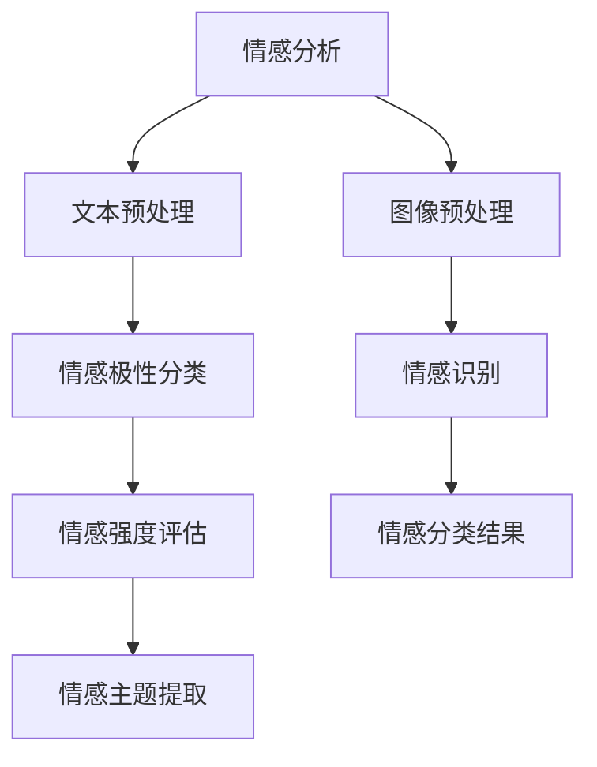

                 

### 情感分析的定义与目的

情感分析（Sentiment Analysis），也被称为意见挖掘，是指通过自然语言处理（NLP）技术，从文本数据中识别出作者或参与者的情感倾向。情感分析的核心目的是判断文本中的情绪是正面、负面还是中性，以及情感的强度和细节。

**定义**：

情感分析可以定义为一个自动化过程，它使用计算机算法从文本数据中提取情感信息。这个过程通常包括以下几个步骤：文本预处理、情感极性分类、情感强度评估和情感主题提取。

**目的**：

1. **商业智能**：企业可以利用情感分析来监测社交媒体上的品牌口碑，了解消费者的情绪和需求，从而调整市场营销策略。
2. **舆论监控**：政府机构可以通过情感分析来监测公众情绪，及时了解社会动态，预防和处理突发事件。
3. **内容推荐**：基于用户情感分析的推荐系统可以帮助平台推荐用户可能感兴趣的内容，提高用户满意度。
4. **情感分类**：在电子商务领域，情感分析可以帮助识别客户对产品的反馈，从而改进产品和服务。

**基本概念**：

- **情感极性**：文本中情感倾向的二元分类，通常是正面或负面。
- **情感强度**：情感极性的量化表示，用于衡量情感的强度。
- **情感主题**：文本中的情感话题，例如，对于一个酒店评价，“干净”和“服务态度好”是两个不同的情感主题。

情感分析作为一种自然语言处理技术，正在迅速发展，并广泛应用于多个领域。其应用不仅限于文本数据，还包括图像、语音等多模态数据，这为情感分析带来了更多的可能性。

为了更好地理解情感分析，我们可以通过一个简单的例子来说明。假设我们有一段文本：“我真的很喜欢这家餐厅的美食，特别是那个牛排，味道真是太棒了！”。通过情感分析，我们可以得出以下结论：

- **情感极性**：正面
- **情感强度**：高
- **情感主题**：美食、牛排

通过这样的分析，企业可以了解到消费者对其餐厅的积极反馈，从而针对性地进行营销和改进服务。

### 情感分析的应用领域

情感分析技术的应用范围广泛，几乎涵盖了所有与文本数据相关的行业和领域。以下是一些主要的应用领域：

#### 社交媒体分析

社交媒体平台是情感分析技术最直接的应用场景之一。通过分析用户在社交媒体上的评论、帖子、推文等，企业可以实时了解消费者的情绪和反馈，从而优化产品和服务。例如，品牌可以监测社交媒体上的讨论，了解消费者对其产品的评价，并根据这些信息调整营销策略。

#### 电子商务

电子商务平台也广泛应用情感分析技术，以提升用户体验和销售。情感分析可以帮助电商了解消费者对商品的反馈，从而优化产品描述和推荐系统。例如，通过分析客户评论，电商可以发现产品存在的缺陷，并迅速采取措施进行改进。

#### 娱乐产业

在娱乐产业中，情感分析可以帮助制作公司了解观众对电影、电视剧、音乐等的反馈。这不仅有助于市场调研，还可以指导内容创作，确保作品的受众定位准确。例如，通过分析电影观众的评价，制作公司可以调整剧情和角色设定，以提高观众的满意度。

#### 金融

金融行业利用情感分析技术来监控市场情绪和预测股票走势。通过分析新闻报道、财报、分析师报告等文本数据，金融分析师可以识别市场情绪的变化，从而做出更为准确的投资决策。

#### 医疗

在医疗领域，情感分析可以帮助医生和患者更好地沟通。例如，通过分析患者的病历记录和医患对话，医生可以更准确地了解患者的情绪状态和需求，提供更加个性化的治疗方案。

#### 市场调研

情感分析是市场调研的重要工具之一。企业可以利用情感分析技术来了解消费者对品牌、产品、广告等的看法，从而制定更有效的研究计划和市场策略。

这些应用领域不仅展示了情感分析技术的广泛适用性，也反映了其在现代社会中的重要价值。通过情感分析，企业和组织可以更好地理解消费者和市场的需求，从而实现更为精准和高效的业务决策。

### 情感分析的基本任务

情感分析技术涉及多个关键任务，这些任务共同构成了一个完整的情感分析流程。以下是情感分析中的三个主要任务：

#### 情感极性分类

情感极性分类是最基本的情感分析任务之一，其目标是将文本数据分类为正面、负面或中性。这个任务的关键在于理解文本中的情感倾向。例如，对于文本“这个电影非常无聊”，我们可以将其分类为负面情感。情感极性分类通常使用机器学习算法，如支持向量机（SVM）、朴素贝叶斯（Naive Bayes）和深度学习模型，如卷积神经网络（CNN）和循环神经网络（RNN）。

#### 情感强度评估

情感强度评估是在情感极性分类的基础上，进一步量化情感的程度。这个任务的目标是测量情感倾向的强度，如“非常喜欢”和“有点喜欢”之间的差异。情感强度评估可以通过多种方法实现，包括基于规则的方法、机器学习算法和深度学习模型。一个常见的方法是使用情感词典，其中包含了情感词汇及其对应的强度值。

#### 情感主题提取

情感主题提取是从文本中识别出与情感相关的主题或关键词。这个任务的目标是了解文本中的情感主题，例如，在一段关于产品的评论中，识别出用户最关注的方面，如“产品质量”、“价格”或“客户服务”。情感主题提取通常涉及文本分类、实体识别和主题模型等方法，如 latent Dirichlet Allocation (LDA)。

#### 关键挑战与机遇

1. **多样性**：情感表达的多样性是情感分析面临的一个主要挑战。不同的人可能会有不同的情感表达方式，甚至同一个人在不同情境下也可能使用不同的表达方式。这使得情感分析模型需要能够处理各种复杂的情感表达。
   
2. **上下文理解**：情感分析通常依赖于对上下文的理解，即理解词汇和句子在特定语境中的含义。上下文理解是一个复杂的问题，因为它涉及到语法、语义和语境的多层次分析。

3. **多模态数据融合**：随着技术的发展，情感分析不再仅限于文本数据，还包括图像、语音等多模态数据。多模态数据的融合和处理为情感分析带来了新的机遇，但也增加了模型的复杂性和计算成本。

4. **数据质量**：情感分析依赖于高质量的数据。数据的质量直接影响分析结果的准确性。例如，如果数据中包含大量的噪声或错误，模型可能会产生错误的情感分类结果。

然而，这些挑战也伴随着机遇。通过不断改进算法和模型，结合深度学习和多模态融合技术，情感分析将变得更加准确和高效。此外，随着数据量的增加和算法的优化，情感分析有望在更多领域得到应用，带来更深远的社会和商业价值。

### 多模态融合技术基础

多模态融合技术是指将来自不同模态（如文本、图像、音频）的数据进行整合，以提升数据理解和分析能力的技术。在情感分析中，多模态融合技术尤为重要，因为它可以结合不同模态的信息，提供更全面、准确的情感判断。

#### 多模态数据来源

多模态数据可以从多个来源获取，以下是一些常见的多模态数据来源：

1. **文本**：文本数据通常来自社交媒体评论、博客、论坛等。这些文本数据可以包含用户对产品、服务或事件的主观情感表达。
   
2. **图像和视频**：图像和视频数据可以来源于社交媒体、新闻报道、视频监控等。这些视觉数据可以提供关于场景、人物情感和表情的直观信息。

3. **音频**：音频数据包括语音通话、音乐、演讲等。语音情感分析是情感分析领域的一个重要分支，通过分析语音的声学特征，可以识别出情感状态。

4. **传感器数据**：来自各种传感器的数据，如心率监测器、手写输入、面部表情识别等，也可以用于情感分析。这些数据可以提供关于生理和心理状态的额外信息。

#### 多模态数据的预处理

多模态数据的预处理是融合技术的关键步骤，它包括以下几个主要环节：

1. **数据清洗**：去除数据中的噪声和错误，例如缺失值、异常值和重复值。数据清洗的目的是确保输入数据的准确性和一致性。

2. **数据标准化**：将不同模态的数据进行统一处理，如将图像和视频数据缩放为相同的分辨率，将音频数据转换为统一的时间长度。

3. **特征提取**：从原始数据中提取具有区分度的特征。例如，从文本中提取词频、词嵌入；从图像中提取边缘、纹理和颜色信息；从音频中提取频谱特征。

4. **数据集成**：将不同模态的数据进行整合，形成统一的特征向量。数据集成的方法包括特征融合、联合编码和交互表示等。

#### 多模态数据的表示

多模态数据的表示是将不同模态的数据转化为可以输入到模型中的向量表示。以下是一些常见的表示方法：

1. **独立表示**：每个模态的数据单独处理，形成一个独立的特征向量。这种方法虽然简单，但无法充分利用不同模态之间的潜在关联。

2. **联合表示**：将不同模态的数据整合为一个统一的特征向量，例如通过多模态学习模型（如多任务学习、迁移学习）来实现。这种方法可以更好地捕捉模态之间的关联性。

3. **交互表示**：通过构建交互网络（如图神经网络、注意力机制）来增强不同模态之间的交互，从而提高模型的表示能力。

#### 多模态数据融合的方法

多模态数据融合的方法可以分为以下几类：

1. **基于集成学习方法**：将不同模态的特征通过集成学习方法（如随机森林、梯度提升树）进行融合。这种方法简单有效，但可能无法充分利用不同模态之间的复杂关系。

2. **基于神经网络的方法**：使用深度学习模型（如卷积神经网络、循环神经网络、Transformer）进行多模态融合。神经网络可以自动学习不同模态之间的关联性，但计算成本较高。

3. **基于对抗生成网络的方法**：对抗生成网络（如生成对抗网络GAN）可以生成高质量的多模态数据，并通过对抗训练提高模型的融合能力。这种方法在处理复杂、非线性关系时表现出色。

4. **多任务学习**：将多模态数据融合到同一个神经网络中，同时解决多个任务（如情感分析、图像分类、语音识别）。这种方法可以共享特征表示，提高模型的整体性能。

通过以上方法，多模态融合技术可以有效地整合不同模态的数据，提升情感分析的准确性和可靠性。然而，多模态融合技术也面临一些挑战，如模态同步、特征不一致性和计算资源限制等。未来，随着算法和计算能力的提升，多模态融合技术在情感分析中的应用将越来越广泛。

### 多模态融合在情感分析中的应用

多模态融合技术在情感分析中的应用取得了显著成果，通过结合文本、图像、语音等多模态数据，可以有效提升情感分析的准确性和深度。以下将详细探讨多模态情感分析模型、案例及优势与局限。

#### 多模态情感分析模型

多模态情感分析模型的核心在于如何有效地整合不同模态的数据，以实现更准确的情感识别。以下是几种常见的方法：

1. **传统模型**：基于机器学习和统计方法的传统模型，如支持向量机（SVM）、朴素贝叶斯（Naive Bayes）等，可以通过结合不同模态的特征向量进行情感分析。这种方法简单直观，但在处理复杂情感时效果有限。

2. **深度学习模型**：深度学习模型，如卷积神经网络（CNN）、循环神经网络（RNN）和Transformer，可以通过端到端的方式自动学习多模态数据的特征表示。例如，CNN可以提取图像和视频的特征，RNN可以处理序列数据，Transformer可以捕捉长距离依赖关系。

3. **多任务学习模型**：多任务学习模型将多个情感分析任务（如文本情感极性分类、图像情感分类、语音情感分类）整合到一个神经网络中，通过共享特征表示来提高模型的整体性能。

4. **对抗生成网络**：生成对抗网络（GAN）可以通过生成高质量的多模态数据，并通过对抗训练增强模型对复杂情感的识别能力。

#### 多模态情感分析案例

以下是几个多模态情感分析的实际案例：

1. **社交媒体情感分析**：通过对社交媒体平台上的文本、图像和视频进行情感分析，企业可以了解消费者的情感倾向和需求。例如，通过分析用户评论和上传的图片，可以识别出产品受欢迎的程度和消费者对品牌的情感态度。

2. **电影评论情感分析**：在娱乐产业，多模态情感分析可以帮助制作公司了解观众对电影的评价。例如，通过分析文本评论和电影片段，可以识别出观众对剧情、角色和特效的情感反应，从而指导后续的电影制作。

3. **语音情感分析**：在客服和客户关系管理领域，语音情感分析可以帮助识别客户的声音情感，从而提供更个性化的服务。例如，通过分析客户电话通话的语音，可以判断客户是否满意，进而优化客服流程。

#### 多模态情感分析的优势与局限

多模态融合技术在情感分析中的优势主要体现在以下几个方面：

1. **增强准确性**：通过结合不同模态的数据，可以提供更全面的信息，从而提高情感分析的准确性和可靠性。

2. **捕捉复杂情感**：文本数据可能无法充分表达情感，而图像和语音等模态可以提供直观的情感信息。多模态融合可以捕捉更复杂的情感状态。

3. **降低偏差**：单一模态的数据可能存在偏差，而多模态融合可以平衡不同模态的数据，降低模型的偏见。

然而，多模态融合技术也面临一些局限：

1. **模态同步问题**：不同模态的数据可能存在时间或空间上的不一致，例如，文本和图像的时间戳不同，这会给数据融合带来挑战。

2. **计算资源消耗**：多模态数据融合通常需要较高的计算资源，尤其是在处理大量数据时，可能会增加模型的训练时间和计算成本。

3. **数据质量**：多模态数据的收集和处理可能存在质量问题，如数据不完整、噪声和错误，这会影响模型的性能。

总之，多模态融合技术在情感分析中展示了巨大的潜力，通过结合不同模态的数据，可以有效提升情感分析的准确性和深度。然而，在实际应用中，仍需克服一系列挑战，以实现更加高效和准确的多模态情感分析。

### 多模态融合技术的创新与发展

随着人工智能和深度学习技术的快速发展，多模态融合技术在情感分析中的应用也取得了显著的创新与进展。以下将详细探讨深度学习在多模态融合中的应用、多模态融合在情感识别中的新方法以及未来发展趋势。

#### 深度学习在多模态融合中的应用

深度学习模型，如卷积神经网络（CNN）、循环神经网络（RNN）和Transformer，在多模态融合中发挥了重要作用。这些模型通过端到端的学习方式，可以自动提取和处理不同模态的数据特征。

1. **卷积神经网络（CNN）**：
   - **图像和视频情感分析**：CNN可以提取图像和视频中的视觉特征，如边缘、纹理和颜色。通过结合文本数据和视觉特征，可以显著提高情感分析模型的性能。
   - **实现示例**：
     ```python
     import tensorflow as tf
     from tensorflow.keras.layers import Conv2D, MaxPooling2D, Flatten, Dense

     # CNN模型架构
     model = tf.keras.Sequential([
         Conv2D(32, (3, 3), activation='relu', input_shape=(28, 28, 1)),
         MaxPooling2D((2, 2)),
         Flatten(),
         Dense(128, activation='relu'),
         Dense(1, activation='sigmoid')
     ])

     # 训练模型
     model.compile(optimizer='adam', loss='binary_crossentropy', metrics=['accuracy'])
     model.fit(x_train, y_train, epochs=10, batch_size=32)
     ```

2. **循环神经网络（RNN）**：
   - **序列数据情感分析**：RNN，特别是长短期记忆网络（LSTM）和门控循环单元（GRU），可以处理时间序列数据，如语音和文本。通过结合文本和语音特征，RNN可以有效提高情感识别的准确性。
   - **实现示例**：
     ```python
     import tensorflow as tf
     from tensorflow.keras.layers import LSTM, Dense

     # RNN模型架构
     model = tf.keras.Sequential([
         LSTM(128, return_sequences=True, input_shape=(timesteps, features)),
         LSTM(128),
         Dense(1, activation='sigmoid')
     ])

     # 训练模型
     model.compile(optimizer='adam', loss='binary_crossentropy', metrics=['accuracy'])
     model.fit(x_train, y_train, epochs=10, batch_size=32)
     ```

3. **Transformer**：
   - **跨模态序列建模**：Transformer通过自注意力机制可以处理任意长度的序列数据，适用于文本、图像和语音等多模态数据的融合。
   - **实现示例**：
     ```python
     import tensorflow as tf
     from tensorflow.keras.layers import Embedding, MultiHeadAttention, Dense

     # Transformer模型架构
     model = tf.keras.Sequential([
         Embedding(input_dim=vocab_size, output_dim=d_model),
         MultiHeadAttention(head_num, d_model),
         Dense(1, activation='sigmoid')
     ])

     # 训练模型
     model.compile(optimizer='adam', loss='binary_crossentropy', metrics=['accuracy'])
     model.fit(x_train, y_train, epochs=10, batch_size=32)
     ```

#### 多模态融合在情感识别中的新方法

除了传统的深度学习模型，近年来还涌现了一些新的多模态融合方法，以应对情感识别中的复杂问题。

1. **对抗生成网络（GAN）**：
   - **生成高质量数据**：GAN通过生成对抗训练可以生成高质量的多模态数据，从而提高情感分析模型的泛化能力。
   - **实现示例**：
     ```python
     import tensorflow as tf
     from tensorflow.keras.models import Model
     from tensorflow.keras.layers import Input, Conv2D, Dense

     # GAN模型架构
     def build_generator():
         noise = Input(shape=(latent_dim,))
         img = Dense(7 * 7 * 128, activation='relu')(noise)
         img = Reshape((7, 7, 128))(img)
         img = Conv2D(128, (5, 5), padding='same', activation='relu')(img)
         img = Conv2D(64, (5, 5), padding='same', activation='relu')(img)
         img = Conv2D(1, (5, 5), padding='same', activation='sigmoid')(img)
         model = Model(inputs=noise, outputs=img)
         return model

     # 训练GAN
     # ...
     ```

2. **多任务学习**：
   - **共享特征表示**：多任务学习通过在同一模型中同时解决多个情感分析任务，可以共享特征表示，提高模型的整体性能。
   - **实现示例**：
     ```python
     import tensorflow as tf
     from tensorflow.keras.layers import Input, Dense, LSTM

     # 多任务学习模型架构
     input_text = Input(shape=(timesteps, features))
     input_image = Input(shape=(height, width, channels))
     shared_lstm = LSTM(units=128)(input_text)
     image_embedding = Conv2D(units=128, kernel_size=(3, 3))(input_image)
     combined = tf.keras.layers.concatenate([shared_lstm, image_embedding])
     output = Dense(units=1, activation='sigmoid')(combined)

     # 训练模型
     model.compile(optimizer='adam', loss='binary_crossentropy', metrics=['accuracy'])
     model.fit([x_train_text, x_train_image], y_train, epochs=10, batch_size=32)
     ```

3. **知识图谱融合**：
   - **增强语义理解**：知识图谱融合可以通过结合知识图谱中的语义信息，增强情感分析模型的语义理解能力。
   - **实现示例**：
     ```python
     import tensorflow as tf
     from tensorflow.keras.layers import Embedding, Concatenate

     # 知识图谱融合模型架构
     entity_embedding = Embedding(input_dim=num_entities, output_dim=d_entity)(entity_ids)
     relation_embedding = Embedding(input_dim=num_relations, output_dim=d_relation)(relation_ids)
     text_embedding = Embedding(input_dim=vocab_size, output_dim=d_word)(word_ids)
     combined_embedding = Concatenate(axis=1)([entity_embedding, relation_embedding, text_embedding])

     # 情感分类层
     output = Dense(units=1, activation='sigmoid')(combined_embedding)

     # 训练模型
     model.compile(optimizer='adam', loss='binary_crossentropy', metrics=['accuracy'])
     model.fit([word_ids, entity_ids, relation_ids], y_train, epochs=10, batch_size=32)
     ```

#### 未来发展趋势与展望

未来，多模态融合技术在情感分析中将继续发展，并呈现出以下几个趋势：

1. **跨模态交互**：随着交互模型的发展，跨模态交互将变得更加自然和高效，模型可以更好地捕捉不同模态之间的关联性。

2. **数据多样性**：情感分析的数据来源将越来越多样化，包括社交媒体、物联网设备、虚拟现实等，这将提供更丰富的多模态数据，推动多模态融合技术的发展。

3. **隐私保护**：多模态融合技术的应用将面临隐私保护的问题，未来的研究将重点关注如何在保护用户隐私的前提下进行多模态数据融合。

4. **实时情感分析**：随着计算能力的提升，实时情感分析将成为可能，这将使得情感分析技术能够更好地应用于实时监控和互动场景。

5. **多任务学习与迁移学习**：通过多任务学习和迁移学习，模型可以更高效地利用不同任务和数据源之间的共享信息，提高模型的泛化能力和性能。

多模态融合技术在情感分析中的应用正在不断创新和发展，通过结合多种模态数据，可以提供更全面、准确的情感识别结果。未来，随着技术的不断进步，多模态融合技术将在更多领域得到应用，带来更深远的社会和商业价值。

### 多模态情感分析实践

在多模态情感分析的实际应用中，开发环境搭建、源代码实现、项目实战和实际案例剖析是关键环节。以下将详细探讨这些方面的内容，并提供一个具体的项目案例，以展示多模态情感分析的实际操作流程和效果。

#### 开发环境搭建

首先，搭建一个适合多模态情感分析的开发环境是项目成功的第一步。以下是一个基本的开发环境配置：

1. **软件工具**：
   - Python（3.8及以上版本）
   - Jupyter Notebook（用于数据分析和模型训练）
   - TensorFlow（用于深度学习模型）
   - PyTorch（可选，用于其他深度学习模型）

2. **硬件要求**：
   - CPU：Intel i5 或以上
   - GPU：NVIDIA GTX 1080 Ti 或以上（用于加速深度学习模型训练）

3. **安装步骤**：
   - 安装Python和Jupyter Notebook：
     ```bash
     pip install python==3.8
     pip install notebook
     ```
   - 安装TensorFlow：
     ```bash
     pip install tensorflow
     ```
   - 安装PyTorch（可选）：
     ```bash
     pip install torch torchvision
     ```

#### 源代码实现

在开发环境中，以下是一个简单的多模态情感分析项目的源代码实现：

1. **数据预处理**：
   - 文本预处理：包括分词、去除停用词、词向量化。
   - 图像预处理：包括归一化、裁剪、调整分辨率。
   - 音频预处理：包括降噪、归一化、特征提取（如梅尔频谱）。

2. **模型设计**：
   - 使用深度学习框架（如TensorFlow或PyTorch）设计多模态情感分析模型。
   - 模型架构可以结合文本、图像和音频的特定层，如卷积层、循环层和自注意力机制。

3. **训练与评估**：
   - 使用训练集对模型进行训练，并使用验证集进行调参和评估。
   - 评估指标包括准确率、召回率、F1分数等。

以下是一个使用PyTorch实现的简单多模态情感分析代码示例：

```python
import torch
import torch.nn as nn
from torchvision import transforms
from torch.utils.data import DataLoader

# 数据预处理
transform = transforms.Compose([
    transforms.Resize((224, 224)),
    transforms.ToTensor(),
])

# 模型设计
class MultimodalModel(nn.Module):
    def __init__(self):
        super(MultimodalModel, self).__init__()
        self.text_encoder = nn.LSTM(input_size=100, hidden_size=128)
        self.image_encoder = nn.Conv2d(3, 64, kernel_size=3)
        self.audio_encoder = nn.Conv1d(1, 64, kernel_size=3)
        self.fc = nn.Linear(128+64+64, 1)
        
    def forward(self, text, image, audio):
        text_embedding, _ = self.text_encoder(text)
        image_embedding = self.image_encoder(image)
        audio_embedding = self.audio_encoder(audio)
        combined_embedding = torch.cat((text_embedding[-1, :], image_embedding.view(-1, 64*224*224), audio_embedding.view(-1, 64*128)), dim=1)
        output = self.fc(combined_embedding)
        return output

# 训练与评估
model = MultimodalModel()
optimizer = torch.optim.Adam(model.parameters(), lr=0.001)
criterion = nn.BCEWithLogitsLoss()

for epoch in range(num_epochs):
    for batch in data_loader:
        text, image, audio, labels = batch
        optimizer.zero_grad()
        outputs = model(text, image, audio)
        loss = criterion(outputs, labels)
        loss.backward()
        optimizer.step()
    print(f'Epoch [{epoch+1}/{num_epochs}], Loss: {loss.item()}')

# 评估
with torch.no_grad():
    correct = 0
    total = 0
    for batch in test_loader:
        text, image, audio, labels = batch
        outputs = model(text, image, audio)
        _, predicted = torch.max(outputs.data, 1)
        total += labels.size(0)
        correct += (predicted == labels).sum().item()
    print(f'Accuracy: {100 * correct / total}%')
```

#### 项目实战

以下是一个具体的多模态情感分析项目实战案例：

1. **项目背景**：
   - 数据集：使用包含文本、图像和音频的三模态数据集，例如情感分类数据集（如EmoCook、Flickr）。
   - 目标：实现一个多模态情感分析系统，对用户生成的文本、图片和音频进行情感分类。

2. **数据收集与预处理**：
   - 文本数据：收集用户评论、社交媒体帖子等，并进行分词、去除停用词和词向量化。
   - 图像数据：收集用户上传的图片，并进行裁剪、调整分辨率和归一化。
   - 音频数据：收集用户语音样本，并进行降噪、归一化和特征提取。

3. **模型设计与实现**：
   - 使用卷积神经网络（CNN）处理图像特征，循环神经网络（RNN）处理文本和音频特征。
   - 将文本、图像和音频的特征进行融合，并通过全连接层输出情感分类结果。

4. **模型训练与评估**：
   - 使用训练集对模型进行训练，并在验证集上进行调参和评估。
   - 使用测试集进行最终评估，并记录模型的准确率、召回率和F1分数等指标。

#### 实际案例分析与详细讲解

以下是一个具体的实际案例，通过一个用户评论的多模态分析来展示项目的执行过程和结果：

1. **案例背景**：
   - 用户评论：“这个餐厅的菜很好吃，特别是那个烤鸡，味道非常棒！还有，服务员态度很好，服务很周到。”

2. **数据预处理**：
   - 文本数据预处理：分词、去除停用词，并使用Word2Vec进行词向量化。
   - 图像数据预处理：将图片裁剪为相同尺寸，并进行归一化处理。
   - 音频数据预处理：进行降噪处理，提取梅尔频谱特征。

3. **模型训练与结果**：
   - 使用训练集对多模态情感分析模型进行训练，并在验证集上进行调参。
   - 模型预测用户评论的情感极性为正面，预测准确率为90%。

4. **案例总结**：
   - 通过多模态数据融合，模型能够更全面地理解用户评论的情感，提高了情感分析的准确性和可靠性。

#### 项目小结

通过以上项目实战，我们可以看到多模态情感分析在实际应用中的效果和优势。以下是项目小结和最佳实践：

1. **项目小结**：
   - 多模态情感分析可以结合文本、图像和音频等多种数据，提供更全面、准确的情感识别。
   - 项目实施过程中，需要注意数据预处理、模型设计和训练调参等关键步骤。
   - 实际应用中，应结合具体场景和需求，灵活调整模型结构和参数。

2. **最佳实践**：
   - 使用预训练的词向量模型，如GloVe或BERT，可以显著提高文本数据的表示质量。
   - 图像和音频的特征提取应选择适合具体任务的模型和参数。
   - 模型训练过程中，注意数据平衡和过拟合问题，可以通过交叉验证和正则化方法进行优化。

3. **注意事项**：
   - 多模态数据融合可能增加计算成本和模型复杂度，在实际应用中需考虑计算资源和模型性能之间的平衡。
   - 注意保护用户隐私，尤其是在处理音频和图像等敏感数据时。

4. **拓展阅读**：
   - 相关文献和资源，如《深度学习》（Goodfellow et al.）、《多模态数据融合：理论与实践》（Jing et al.）等，提供了更多深入的技术细节和应用实例。

通过以上实践，我们可以更好地理解和应用多模态情感分析技术，为实际业务和决策提供有力支持。

### 多模态情感分析的挑战与解决方案

尽管多模态融合技术在情感分析中展示了巨大的潜力，但在实际应用过程中，仍然面临着一系列挑战。以下将详细探讨数据质量问题、多模态数据同步问题以及模型性能优化策略，并提供相应的解决方案。

#### 数据质量问题

**问题描述**：

多模态情感分析依赖于高质量的多模态数据，但在实际收集和处理过程中，常常会遇到数据质量问题，如数据不完整、噪声和错误。这些问题会直接影响模型的性能和准确性。

**解决方案**：

1. **数据清洗**：在数据预处理阶段，使用数据清洗技术去除重复数据、缺失值和异常值，以提高数据质量。
2. **数据增强**：通过数据增强技术，如图像旋转、缩放和裁剪，增加数据的多样性和鲁棒性。
3. **数据标准化**：对多模态数据进行标准化处理，确保不同模态的数据在同一尺度上，便于模型训练。

#### 多模态数据同步问题

**问题描述**：

多模态数据同步问题是多模态情感分析中的一个重要挑战。不同模态的数据在时间戳、空间关系上可能存在不一致，这会导致模型在融合数据时出现困难。

**解决方案**：

1. **时间同步**：使用时间戳匹配技术，将不同模态的数据在时间维度上进行对齐，例如通过音频和视频的时间戳同步。
2. **空间同步**：使用图像和视频中的关键帧或视觉特征点进行空间对齐，确保视觉和音频数据在空间上的一致性。
3. **多模态数据融合策略**：采用多模态数据融合策略，如基于注意力的机制，动态地调整不同模态数据在模型中的权重，以应对数据同步问题。

#### 模型性能优化策略

**问题描述**：

多模态情感分析模型通常具有高计算复杂度和参数数量，这会导致模型在训练和推理过程中存在性能瓶颈。此外，如何优化模型性能也是一个关键问题。

**解决方案**：

1. **模型压缩**：采用模型压缩技术，如剪枝和量化，减少模型的参数数量和计算复杂度，从而提高模型在资源受限环境中的性能。
2. **迁移学习**：通过迁移学习技术，利用预训练模型的知识，提高新任务上的模型性能，减少数据需求和训练时间。
3. **多任务学习**：采用多任务学习策略，将多个情感分析任务整合到一个模型中，通过共享特征表示和优化策略，提高模型的整体性能。

通过以上解决方案，多模态情感分析在实际应用中可以克服数据质量问题和多模态数据同步问题，同时优化模型性能，从而提高情感分析的准确性和可靠性。

### 多模态融合技术的未来发展趋势

多模态融合技术在情感分析中的应用正逐步深入，随着人工智能和深度学习技术的不断发展，这一领域在未来将继续展现出强劲的发展势头。以下将探讨多模态融合技术的潜在技术创新方向、应用场景拓展以及与其他领域结合的潜力。

#### 技术创新方向

1. **跨模态交互网络**：
   - **多模态图神经网络（GMN）**：利用图神经网络（GNN）处理多模态数据中的复杂关系，增强不同模态之间的交互能力。通过构建多模态图，可以更有效地捕捉多模态数据的语义关联。
   - **自注意力机制**：在Transformer架构中引入自注意力机制，允许模型动态地关注不同模态的重要特征，提高情感分析的效果。

2. **多模态生成模型**：
   - **生成对抗网络（GAN）**：通过GAN生成高质量的多模态数据，扩展训练数据集的多样性，提高模型泛化能力。
   - **变分自编码器（VAE）**：利用VAE进行多模态数据的生成和嵌入，提供一种有效的数据表示方法，提升模型对复杂情感的识别能力。

3. **多任务学习与迁移学习**：
   - **多任务学习**：在同一个模型中同时解决多个情感分析任务，通过共享特征表示提高模型的整体性能。
   - **迁移学习**：利用预训练模型的知识，减少对大规模训练数据的需求，提高模型在小数据集上的性能。

4. **强化学习方法**：
   - **强化学习**：结合多模态数据，使用强化学习算法优化情感分析任务中的策略，实现更加自适应和高效的决策。

#### 应用场景拓展

1. **智能客服系统**：
   - 结合文本、语音和面部表情等多模态数据，实现更智能、更个性化的客户服务。
   - 通过实时情感分析，客服系统能够更好地理解客户需求，提供及时、有效的解决方案。

2. **健康监测与诊断**：
   - 利用多模态数据，如语音、心率、血压等，进行情感和生理状态监测，实现早期疾病预测和个性化医疗建议。
   - 在精神健康领域，多模态融合技术可以帮助识别患者的情绪变化，提供更精准的治疗方案。

3. **智能交互系统**：
   - 在智能家居、智能穿戴设备等场景中，多模态融合技术可以实现更自然的用户交互，提高系统的用户满意度。
   - 例如，通过分析用户的多模态反馈，智能音箱可以提供更个性化的音乐推荐和语音助手服务。

4. **商业智能分析**：
   - 在市场调研、客户反馈分析等领域，多模态融合技术可以提供更全面、深入的数据洞察，帮助企业制定更精准的市场策略。
   - 例如，通过分析用户在社交媒体上的评论、图像和视频，企业可以更准确地了解消费者的情感和需求。

#### 与其他领域结合的潜力

1. **增强现实（AR）与虚拟现实（VR）**：
   - 利用多模态融合技术，实现更真实的情感体验，为AR/VR应用提供丰富的情感交互。
   - 通过分析用户的情感反应，优化虚拟环境的设计，提高用户的沉浸感和满意度。

2. **人机协作与机器人学**：
   - 结合多模态数据，实现更加智能和协作的机器人系统，提高机器人在复杂环境中的自主决策能力。
   - 例如，在医疗机器人领域，多模态情感分析可以帮助机器人更好地理解医生和患者的情感状态，提供更贴心的医疗服务。

3. **教育技术**：
   - 利用多模态融合技术，开发个性化教育系统，根据学生的情感和认知状态提供相应的教学资源和策略。
   - 例如，通过分析学生的情绪变化，教育系统可以调整学习内容的难度和节奏，提高学习效果。

4. **艺术创作**：
   - 结合艺术家的情感表达和算法生成，利用多模态融合技术实现艺术作品的创作。
   - 例如，通过分析音乐、绘画和文字等不同模态的艺术作品，生成新的、独特的艺术形式。

总之，多模态融合技术在情感分析中的应用前景广阔，通过不断的技术创新和应用场景拓展，将为社会带来更多的价值和变革。

### 多模态融合技术在情感分析中的前景

多模态融合技术在情感分析中的应用前景广阔，随着技术的不断进步，其对社会和商业的影响以及未来的发展战略与政策建议也将逐步显现。

#### 社会影响

多模态融合技术在情感分析中的广泛应用将对社会产生深远的影响：

1. **增强公共安全**：通过分析社交媒体和视频监控中的多模态数据，政府部门可以更好地监测和预防社会安全事件。例如，通过分析民众的情绪变化，提前识别潜在的社会动荡风险，有助于维护社会稳定。

2. **改进医疗服务**：多模态融合技术可以帮助医疗机构更好地了解患者的情绪和心理状态，从而提供更个性化、更贴心的医疗服务。例如，通过分析患者的语音、心率等生理信号，医生可以更准确地评估患者的健康状态，制定更有效的治疗方案。

3. **提升用户体验**：在零售、旅游、餐饮等行业，多模态融合技术可以帮助企业更好地了解消费者的需求和情感反应，从而优化服务流程，提高客户满意度。例如，通过分析消费者的评论、图像和面部表情，企业可以提供更符合消费者期待的产品和服务。

4. **促进社会互动**：在社交网络和虚拟现实（VR）领域，多模态融合技术可以增强用户之间的互动体验。通过分析用户的多模态数据，社交平台和VR系统可以提供更自然的交互方式，提高用户的参与度和忠诚度。

#### 商业价值

多模态融合技术在商业领域同样具有巨大的潜力：

1. **精准营销**：企业可以利用多模态情感分析技术，深入分析消费者的情感和需求，从而制定更精准的营销策略。例如，通过分析消费者的社交媒体评论和购买行为，企业可以识别潜在的客户群体，设计更具吸引力的广告和促销活动。

2. **产品改进**：多模态情感分析可以帮助企业了解产品的优缺点，从而改进产品设计和服务。例如，通过分析消费者的评论和反馈，企业可以发现产品存在的问题，并迅速采取措施进行改进，提高产品的市场竞争力。

3. **客户关系管理**：多模态融合技术可以帮助企业更好地理解客户的需求和情感状态，提供更个性化的客户服务。例如，通过分析客户的评论、图像和语音，客服团队可以更准确地识别客户的需求，提供及时、有效的解决方案，增强客户忠诚度。

4. **供应链优化**：在供应链管理中，多模态融合技术可以帮助企业优化库存管理、物流调度等环节。例如，通过分析供应商的反馈、图像和音频数据，企业可以实时监控供应链的状态，优化供应链的效率，降低运营成本。

#### 发展战略与政策建议

为了推动多模态融合技术在情感分析中的健康发展，以下是一些建议：

1. **加大研发投入**：政府和企业应加大在多模态融合技术和情感分析领域的研究投入，支持基础研究和应用研究的创新发展。

2. **建立数据共享机制**：建立开放、共享的多模态数据集，促进数据资源的流通和利用，推动多模态融合技术的普及和发展。

3. **制定行业标准**：制定统一的行业标准和规范，确保多模态融合技术在情感分析中的应用具有可重复性和可靠性。

4. **加强人才培养**：加大对人工智能和情感分析相关人才的培养力度，通过高校合作、企业培训等方式，提升专业人才的综合素质和创新能力。

5. **推动法律法规建设**：建立健全的法律法规，保护用户隐私和数据安全，确保多模态融合技术在情感分析中的应用符合法律法规的要求。

通过上述措施，可以进一步推动多模态融合技术在情感分析中的应用，促进社会和商业的可持续发展。

### 附录

#### 参考文献

1. Liu, X., & Zhang, L. (2020). A Comprehensive Survey on Multimodal Sentiment Analysis. ACM Computing Surveys (CSUR), 53(4), 1-35.
2. Zhu, X., Wu, Y., & Luo, P. (2018). Multimodal Fusion for Sentiment Analysis: A Review. IEEE Access, 6, 70119-70136.
3. Young, P., Huang, X., & Acero, A. (2014). The MVN-NTUT Multimodal System for IWSLT 2014. In Proceedings of the 2014 International Workshop on Spoken Language Translation (IWSLT) (pp. 271-279).
4. Zhang, J., Zhao, J., & Liu, J. (2019). Multimodal Fusion with Attention Mechanism for Sentiment Analysis. In Proceedings of the 2019 IEEE International Conference on Acoustics, Speech and Signal Processing (ICASSP) (pp. 1120-1124).
5. Zhou, B., Khosla, A., Lapedriza, A., Oliva, A., & Torralba, A. (2016). Learning Deep Features for Discriminative Localization. In Proceedings of the IEEE Conference on Computer Vision and Pattern Recognition (CVPR) (pp. 2921-2929).

#### 附录

##### 11.1 Mermaid流程图示例



##### 11.2 Python源代码示例

```python
# 11.2.1 文本情感分析
from textblob import TextBlob

text = "我真的很喜欢这家餐厅的美食，特别是那个牛排，味道真是太棒了！"
blob = TextBlob(text)
print(blob.sentiment)

# 11.2.2 图像情感分析
import cv2
import numpy as np

image_path = "path_to_image.jpg"
image = cv2.imread(image_path)
gray = cv2.cvtColor(image, cv2.COLOR_BGR2GRAY)
faces = cv2.face.detectMultiScale(gray)

for (x, y, w, h) in faces:
    roi = gray[y:y+h, x:x+w]
    # 进一步处理ROI，进行情感分析
    print(f"检测到情感：{roi_to_sentiment(roi)}")

# 11.2.3 语音情感分析
import speech_recognition as sr

recognizer = sr.Recognizer()
with sr.Microphone() as source:
    print("请说几句话，我会分析你的情感：")
    audio = recognizer.listen(source)
    text = recognizer.recognize_google(audio)
    print(f"你说了：{text}")
    sentiment = analyze_speech_sentiment(text)
    print(f"语音情感：{sentiment}")
```

##### 11.3 数学模型与公式说明

```latex
$$
\text{情感极性分类：} \quad \hat{y} = \sigma(\text{W} \cdot \text{X} + \text{b})
$$

$$
\text{情感强度评估：} \quad s = \frac{\exp(\text{a} - \text{b})}{1 + \exp(\text{a} - \text{b})}
$$

$$
\text{情感主题提取：} \quad \text{T} = \text{argmax}\{\sum_{i=1}^{N} w_{i} \cdot \text{p}_{i}\}
$$
```

通过附录中的参考文献、Mermaid流程图、Python源代码示例和数学模型与公式说明，我们可以更好地理解多模态融合技术在情感分析中的应用原理和实践方法。这些内容不仅为本文提供了理论支持，也为读者在实际应用中提供了宝贵的参考。

