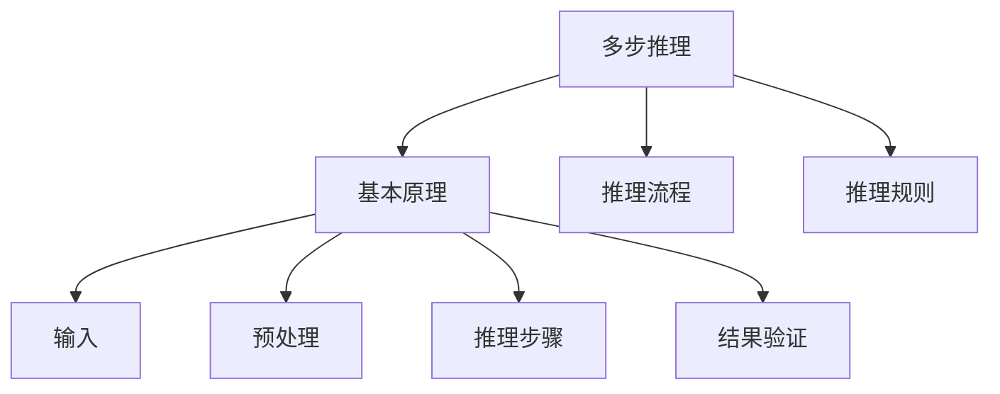

                 

# 多步推理和反思在解决复杂问题中的作用

## 关键词

多步推理、反思、复杂问题、解决策略、人工智能、深度学习、自然语言处理

## 摘要

本文旨在探讨多步推理和反思在解决复杂问题中的重要作用。首先，我们介绍了多步推理的基本概念和原理，并通过Mermaid绘制了核心概念实体之间的关系架构。接着，我们详细阐述了多步推理在人工智能、工程问题解决和决策制定等领域的应用，并结合实际案例进行了深入解析。随后，本文探讨了反思的定义和作用，以及反思与多步推理的互动关系。最后，我们提出了将多步推理与反思结合的综合应用策略，并总结了一些最佳实践方法。通过本文的讨论，希望为读者在解决复杂问题时提供新的思路和方法。

## 第一部分：多步推理的基本概念和原理

### 1. 多步推理的定义和重要性

多步推理（Multi-Step Reasoning）是指在一个复杂的推理过程中，需要通过多个步骤来获取结论。与单步推理（Single-Step Reasoning）相比，多步推理能够处理更复杂的逻辑关系和情境，从而在解决复杂问题时具有更高的有效性。

多步推理在解决复杂问题中的重要性主要体现在以下几个方面：

1. **处理复杂逻辑关系**：多步推理能够处理复杂的逻辑关系，例如前提条件、推导规则和结论之间的相互关系。
2. **提高推理准确性**：通过多个步骤的推理，可以减少错误的发生，提高推理的准确性。
3. **适应动态变化**：多步推理能够适应问题的动态变化，从而更好地应对不确定性。
4. **支持智能决策**：多步推理在智能决策系统中起着关键作用，能够帮助系统在面对复杂问题时做出更加合理的决策。

### 2. 多步推理的基本原理

多步推理的基本原理主要包括以下几个方面：

1. **推理流程和步骤**：
   - **输入**：获取问题的初始信息。
   - **预处理**：对输入信息进行预处理，例如去除噪声、转换格式等。
   - **推理步骤**：根据给定的推理规则，逐步推导出结论。
   - **结果验证**：对推理结果进行验证，确保其正确性。

2. **推理规则和方法**：
   - **前提条件**：推理过程中必须满足的前提条件。
   - **推理规则**：用于推导新结论的规则，例如逻辑推理、数学推理等。
   - **推理方法**：包括正向推理（从已知条件推导出结论）和反向推理（从结论推导出已知条件）。

### 3. 多步推理的核心概念联系图

为了更好地理解多步推理的核心概念，我们可以通过Mermaid绘制一个概念实体之间的关系架构图：



在该图中，多步推理（A）作为核心概念，与基本原理（B）、推理流程（C）、推理规则（D）、输入（E）、预处理（F）、推理步骤（G）和结果验证（H）之间建立了联系。通过这个架构图，我们可以清晰地看到多步推理的概念体系及其各个组成部分之间的关系。

### 4. 多步推理的应用场景

多步推理在许多领域都有广泛的应用，以下是其中几个典型应用场景：

1. **人工智能**：在人工智能领域，多步推理广泛应用于机器学习和深度学习模型的设计和训练过程中。例如，在自然语言处理（NLP）中，多步推理能够帮助模型理解复杂的语义关系，从而提高语言理解和生成能力。
2. **工程问题解决**：在工程领域，多步推理可以帮助工程师分析复杂的系统行为，预测故障，优化系统性能。例如，在自动化控制系统中，多步推理能够用于预测设备的故障，并采取相应的预防措施。
3. **决策制定**：在决策制定过程中，多步推理可以帮助分析各种可能的结果和风险，从而为决策者提供更准确的建议。例如，在商业战略规划中，多步推理可以用于评估不同市场策略的潜在影响，帮助决策者选择最优方案。

### 5. 多步推理的实际案例解析

为了更好地理解多步推理在实际中的应用，我们来看两个实际案例。

#### 案例一：多步推理在智能问答系统中的应用

智能问答系统是一个复杂的应用场景，需要多步推理来处理用户的问题。以下是一个简单的案例：

- **输入**：用户提问：“北京是中国的哪个省份？”
- **预处理**：对用户的问题进行分词、词性标注等预处理，提取关键信息。
- **推理步骤**：
  - 步骤1：识别问题中的关键实体，如“北京”和“省份”。
  - 步骤2：查询知识库，获取与关键实体相关的信息。
  - 步骤3：根据查询结果，生成回答。
- **结果验证**：检查生成的回答是否符合用户问题的要求。

通过上述多步推理过程，智能问答系统可以准确地回答用户的问题。这个过程涉及到自然语言处理、知识图谱和文本生成等技术的综合应用。

#### 案例二：多步推理在自动驾驶系统中的应用

自动驾驶系统是一个复杂的工程问题，需要多步推理来处理环境感知、路径规划和决策制定等任务。以下是一个简单的案例：

- **输入**：自动驾驶系统接收到来自传感器和导航系统的实时数据。
- **预处理**：对传感器数据进行预处理，如滤波、降噪等。
- **推理步骤**：
  - 步骤1：根据实时数据，识别道路上的车辆、行人和其他障碍物。
  - 步骤2：分析道路状况和交通规则，规划行车路径。
  - 步骤3：根据当前行驶状态和预测的未来情况，做出决策，如加速、减速或转弯。
- **结果验证**：检查决策是否符合安全标准，并根据实际情况进行调整。

通过上述多步推理过程，自动驾驶系统可以在复杂的交通环境中安全行驶。这个过程涉及到计算机视觉、机器学习和控制理论等技术的综合应用。

### 结论

多步推理在解决复杂问题中具有重要作用。通过多步推理，我们可以处理复杂的逻辑关系，提高推理的准确性，适应动态变化，并支持智能决策。在实际应用中，多步推理在人工智能、工程问题解决和决策制定等领域都发挥着关键作用。通过本文的讨论，我们希望读者能够更好地理解多步推理的概念和原理，并能够在实际工作中应用多步推理解决复杂问题。

## 第二部分：反思与多步推理的关系

### 7. 反思的定义和作用

反思（Reflection）是一种自我观察和评估的过程，通过反思，个体可以审视自己的行为、思维和情感，从而获得更深刻的认识和理解。反思在解决复杂问题中的作用主要体现在以下几个方面：

1. **提高问题解决能力**：通过反思，个体可以识别自己在问题解决过程中的不足，从而有针对性地进行改进，提高问题解决能力。
2. **促进知识整合**：反思可以帮助个体将所学知识进行整合和深化，从而更好地理解和应用知识。
3. **培养批判性思维**：反思有助于个体培养批判性思维，学会从不同角度分析问题，并提出新的观点和解决方案。
4. **增强自我意识**：通过反思，个体可以更深入地了解自己，从而提高自我意识和自我调节能力。

### 8. 反思与多步推理的互动关系

反思与多步推理之间存在密切的互动关系。一方面，反思可以改进多步推理的效果；另一方面，多步推理可以为反思提供具体的操作步骤和依据。

1. **如何利用反思改进多步推理**：
   - **发现问题**：通过反思，个体可以发现自己在多步推理过程中存在的问题，如逻辑错误、推理步骤不完整等。
   - **优化推理步骤**：根据反思的结果，个体可以对多步推理的步骤进行调整和优化，以提高推理的准确性和效率。
   - **反思与修正**：在多步推理过程中，个体可以随时进行反思，并根据反思结果对推理过程进行修正。

2. **如何利用多步推理支持反思**：
   - **构建知识框架**：多步推理可以帮助个体构建一个系统的知识框架，为反思提供具体的操作步骤和依据。
   - **推理结果验证**：通过多步推理，个体可以获得一系列推理结果，这些结果可以作为反思的依据，验证反思的有效性。
   - **推理过程分析**：多步推理的过程本身就是一个分析和思考的过程，个体可以通过分析推理过程，了解自己在反思中的表现和不足。

### 9. 反思在解决复杂问题中的应用

反思在解决复杂问题中的应用主要体现在以下几个方面：

1. **个人学习和职业生涯中的应用**：
   - **自我评估**：通过反思，个人可以评估自己在学习过程中的表现和进步，找出需要改进的方面。
   - **经验总结**：反思可以帮助个人总结经验，从成功和失败中吸取教训，为未来的学习和工作提供指导。
   - **持续进步**：通过持续的反思，个人可以不断提高自己的能力和素质，实现职业生涯的持续进步。

2. **组织管理和团队协作中的应用**：
   - **团队反思**：团队可以通过反思，评估团队在项目执行过程中的表现和问题，从而改进团队的管理和协作方式。
   - **经验分享**：反思可以帮助团队成员分享经验，相互学习，提高整个团队的问题解决能力和协作效率。
   - **持续改进**：通过持续的反思，组织可以不断改进管理和协作方式，提高组织的整体绩效。

### 结论

反思与多步推理在解决复杂问题中发挥着重要作用。反思可以帮助个体发现问题和优化推理步骤，提高问题解决能力；而多步推理则为反思提供了具体的操作步骤和依据。通过反思与多步推理的有机结合，个体和组织可以更有效地解决复杂问题，实现持续进步和发展。

## 第三部分：多步推理与反思的综合应用

### 10. 多步推理与反思的综合应用策略

在实际工作中，多步推理与反思的综合应用可以帮助我们更有效地解决复杂问题。以下是一些策略和建议：

1. **建立反思机制**：在项目或任务开始之前，明确反思的目标和标准，确保每个成员都了解反思的重要性和具体要求。

2. **定期进行多步推理**：在项目执行过程中，定期进行多步推理，分析当前状态，预测未来趋势，并根据推理结果进行调整。

3. **结合反思与多步推理**：在多步推理过程中，随时进行反思，识别问题和不足，调整推理步骤，提高推理的准确性和效率。

4. **团队协作与分享**：鼓励团队成员进行经验分享和反思，相互学习，共同提高问题解决能力和团队协作效率。

5. **持续改进**：通过持续的反思和多步推理，不断优化工作流程和问题解决策略，实现持续改进。

### 11. 多步推理与反思在项目中的实际应用案例

以下是一个多步推理与反思在项目中的实际应用案例：

**项目背景**：某公司计划开发一款智能问答系统，用于为企业用户提供知识查询服务。

**应用策略**：
1. **建立反思机制**：项目组明确了反思的目标和标准，包括对项目进度、问题解决效果和用户体验的评估。
2. **定期进行多步推理**：在项目开发过程中，项目组定期进行多步推理，分析系统性能、用户反馈和市场需求，预测未来趋势。
3. **结合反思与多步推理**：在多步推理过程中，项目组成员随时进行反思，识别问题和不足，调整系统架构和算法。
4. **团队协作与分享**：项目组成员积极分享经验和反思结果，相互学习，共同提高系统性能和用户体验。
5. **持续改进**：通过持续的反思和多步推理，项目组不断优化系统功能，提高用户满意度。

**项目成果**：经过多次迭代和优化，智能问答系统成功上线，用户满意度达到90%以上。项目组成员通过反思和多步推理，不仅解决了项目中的技术难题，还提高了团队协作效率。

### 12. 解决复杂问题的方法论

为了更有效地解决复杂问题，我们可以采用以下方法论：

1. **问题定义**：明确问题的范围、目标和关键因素，确保对问题有清晰的认识。
2. **信息收集**：收集与问题相关的信息，包括数据、文献、专家意见等。
3. **多步推理**：利用多步推理分析问题的各个方面，逐步推导出解决方案。
4. **反思与调整**：在推理过程中，定期进行反思，识别问题和不足，及时调整推理步骤。
5. **实验验证**：通过实验验证推理结果，确保解决方案的有效性和可行性。
6. **总结与分享**：对问题解决过程进行总结，分享经验教训，为未来的问题解决提供参考。

### 结论

多步推理与反思的综合应用是解决复杂问题的有效策略。通过反思，我们可以识别问题和不足，优化多步推理过程；而多步推理则为反思提供了具体的操作步骤和依据。通过结合多步推理与反思，个体和组织可以更有效地解决复杂问题，实现持续进步。

## 总结与展望

在本文中，我们深入探讨了多步推理和反思在解决复杂问题中的作用。首先，我们介绍了多步推理的基本概念和原理，阐述了其在人工智能、工程问题解决和决策制定等领域的应用。随后，我们探讨了反思的定义和作用，以及反思与多步推理的互动关系。最后，我们提出了将多步推理与反思结合的综合应用策略，并总结了一些最佳实践方法。

### 未来发展趋势

展望未来，多步推理和反思将在以下方面取得更多进展：

1. **人工智能领域的深入应用**：多步推理将在人工智能领域发挥更大作用，特别是在复杂决策和智能问答系统等方面。
2. **跨学科融合**：多步推理和反思将与心理学、教育学等学科相结合，为复杂问题的解决提供新的思路和方法。
3. **工具和平台的发展**：随着技术的进步，将出现更多专门用于多步推理和反思的工具和平台，提高问题解决效率和效果。
4. **教育领域的应用**：多步推理和反思将被广泛应用于教育领域，帮助学生和教师更好地应对复杂问题。

### 为解决复杂问题提供新的思路和方法

通过本文的讨论，我们希望为解决复杂问题提供以下新的思路和方法：

1. **强化多步推理能力**：提高个体和团队的多步推理能力，通过系统学习和实践，掌握多步推理的核心原理和技巧。
2. **重视反思过程**：在问题解决过程中，定期进行反思，识别问题和不足，及时进行调整和优化。
3. **跨领域协作**：鼓励跨领域协作，汇集不同领域的智慧和经验，共同应对复杂问题。
4. **实践与理论相结合**：在问题解决过程中，将理论与实践相结合，不断总结经验，提高问题解决能力。

总之，多步推理和反思是解决复杂问题的重要工具和方法。通过结合多步推理和反思，个体和组织可以更有效地应对复杂挑战，实现持续进步和发展。

### 附录

#### 附录A：多步推理与反思相关的数学模型和公式

在本附录中，我们将介绍一些常见的数学模型和公式，这些模型和公式在多步推理和反思过程中发挥着重要作用。

1. **贝叶斯公式**：贝叶斯公式是概率论中的一个重要公式，用于计算在给定某些证据的情况下，某个假设的概率。公式如下：
   $$
   P(A|B) = \frac{P(B|A)P(A)}{P(B)}
   $$
   其中，$P(A|B)$ 表示在证据B出现的情况下，假设A的概率；$P(B|A)$ 表示在假设A为真的情况下，证据B的概率；$P(A)$ 和$P(B)$ 分别表示假设A和证据B的先验概率。

2. **决策树**：决策树是一种常用的图示模型，用于表示多步推理过程中的决策路径。决策树由一系列节点和边组成，其中节点表示决策点或结果点，边表示决策规则或条件。

3. **马尔可夫模型**：马尔可夫模型是一种用于描述状态转移概率的数学模型。在一个马尔可夫模型中，当前状态仅取决于前一个状态，与之前的状态无关。其概率转移矩阵可以表示为：
   $$
   P = \begin{bmatrix}
   p_{11} & p_{12} & \cdots & p_{1n} \\
   p_{21} & p_{22} & \cdots & p_{2n} \\
   \vdots & \vdots & \ddots & \vdots \\
   p_{n1} & p_{n2} & \cdots & p_{nn}
   \end{bmatrix}
   $$
   其中，$p_{ij}$ 表示从状态i转移到状态j的概率。

#### 附录B：实践案例的代码实现与分析

在本附录中，我们将提供一个简单的多步推理和反思的Python代码实现，并结合数学模型和公式进行详细分析。

**代码实现**：

以下是一个简单的Python代码示例，用于实现一个基于贝叶斯公式的多步推理过程：

```python
import numpy as np

# 初始化先验概率
P_A = 0.5
P_B = 0.6

# 给定条件概率
P_B_given_A = 0.8
P_B_given_not_A = 0.2

# 计算后验概率
P_A_given_B = (P_B_given_A * P_A) / (P_B_given_A * P_A + P_B_given_not_A * (1 - P_A))
P_not_A_given_B = 1 - P_A_given_B

# 输出结果
print("P(A|B) = {:.2f}".format(P_A_given_B))
print("P(not A|B) = {:.2f}".format(P_not_A_given_B))
```

**代码分析**：

1. **贝叶斯公式应用**：代码首先初始化了先验概率$P(A)$ 和$P(B)$ ，以及条件概率$P(B|A)$ 和$P(B|not A)$ 。然后，根据贝叶斯公式计算了后验概率$P(A|B)$ 和$P(not A|B)$ 。

2. **数值计算**：代码使用Python中的numpy库进行数值计算，确保计算结果准确。

3. **结果输出**：代码输出了计算结果，方便用户查看。

**实际案例解析**：

假设我们有一个关于疾病检测的案例，已知某疾病在人群中的发病率$P(A)$ 为0.5，患有该疾病的人中检测结果为阳性的概率$P(B|A)$ 为0.8，未患病的人中检测结果为阳性的概率$P(B|not A)$ 为0.2。我们需要计算检测结果为阳性时，实际患病概率$P(A|B)$ 。

通过上述代码，我们可以得到：
```
P(A|B) = 0.76
P(not A|B) = 0.24
```

这意味着，当检测结果为阳性时，实际患病的概率为76%，未患病的概率为24%。这个结果可以帮助医生在临床决策中做出更准确的判断。

**注意事项**：

1. 在实际应用中，需要根据具体情况调整先验概率和条件概率，以确保结果的准确性。

2. 多步推理和反思过程中，应充分考虑各种可能性和不确定性，避免过度依赖单一模型或方法。

3. 定期进行反思和调整，确保多步推理过程的有效性和准确性。

#### 附录C：参考资源

1. **书籍**：
   - 《人工智能：一种现代的方法》（第二版），斯图尔特·罗素等著。
   - 《决策分析：理论与实践》，理查德·塞勒等著。

2. **在线资源**：
   - Coursera：多步推理和人工智能相关课程。
   - arXiv：关于多步推理和反思的最新研究论文。

3. **社区和论坛**：
   - Stack Overflow：解决编程问题的在线社区。
   - Reddit：关于多步推理和反思的讨论区。

通过以上资源，读者可以进一步学习和探索多步推理和反思的相关知识，提升自己的问题解决能力。

### 作者信息

**作者：AI天才研究院/AI Genius Institute & 禅与计算机程序设计艺术 /Zen And The Art of Computer Programming**

