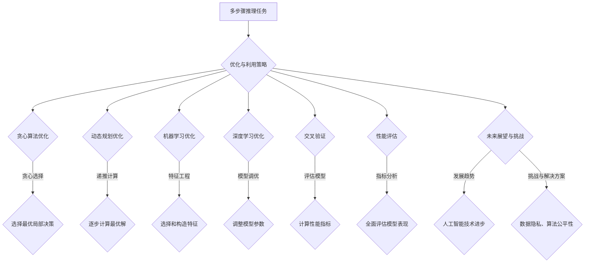
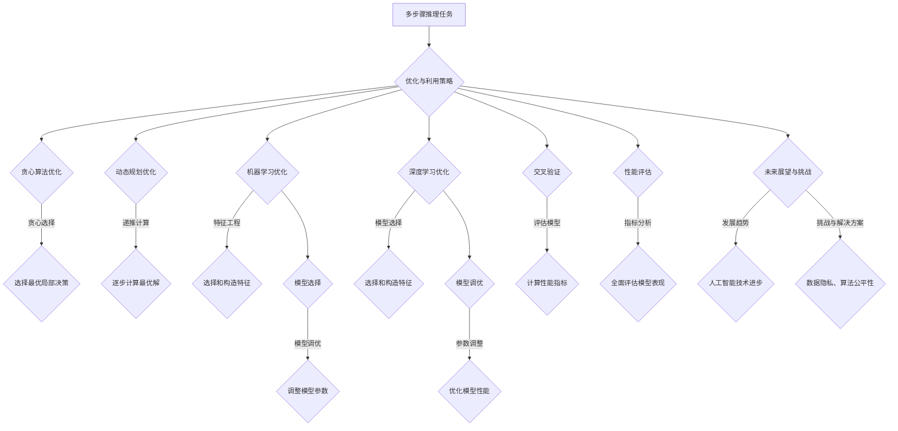

                 

# 多步骤推理任务中的中间结果优化与利用

关键词：多步骤推理任务、中间结果优化、贪心算法、动态规划、机器学习、深度学习

摘要：多步骤推理任务是人工智能领域中一个重要的研究方向，其广泛应用于自然语言处理、图像识别、推荐系统等领域。在多步骤推理任务中，如何优化和利用中间结果是提高任务性能的关键。本文首先介绍多步骤推理任务的基础知识，然后详细讨论中间结果优化的方法和策略，以及中间结果在后续步骤中的应用，最后通过实际案例进行验证，并总结多步骤推理任务中的优化与利用实践。

----------------------------------------------------------------

## 目录大纲

1. 引言与概述
    1.1 多步骤推理任务概述
    1.2 多步骤推理任务的挑战
2. 中间结果优化方法
    2.1 中间结果优化的重要性
    2.2 基于贪心算法的优化策略
    2.3 基于动态规划的优化策略
3. 中间结果利用策略
    3.1 中间结果的再利用
    3.2 中间结果在后续步骤中的应用
4. 多步骤推理任务中的机器学习应用
    4.1 机器学习基础
    4.2 多步骤推理任务中的机器学习应用
5. 多步骤推理任务中的深度学习应用
    5.1 深度学习基础
    5.2 多步骤推理任务中的深度学习应用
6. 多步骤推理任务中的交叉验证
    6.1 交叉验证方法
    6.2 交叉验证在多步骤推理任务中的应用
7. 多步骤推理任务的性能评估
    7.1 性能评估指标
    7.2 性能评估方法
8. 未来展望与挑战
    8.1 多步骤推理任务的发展趋势
    8.2 多步骤推理任务面临的挑战
9. 结语
10. 附录
    10.1 常用工具与资源
    10.2 数学模型与公式

----------------------------------------------------------------

### 引言与概述

多步骤推理任务在人工智能领域具有广泛的应用前景，如自然语言处理（NLP）、图像识别、推荐系统等。这类任务通常需要将输入数据进行一系列的转换和处理，最终输出预期的结果。在这个过程中，中间结果的处理和优化成为影响任务性能的关键因素。

多步骤推理任务通常包含多个步骤，每个步骤都需要对输入数据进行分析和转换，同时产生一系列中间结果。这些中间结果在一定程度上反映了输入数据的特征和关系，但同时也存在一定的误差和不稳定性。因此，如何优化和利用这些中间结果，以提高后续步骤的性能，成为多步骤推理任务中一个重要的问题。

#### 1.1 多步骤推理任务概述

多步骤推理任务是指将输入数据经过一系列的处理和转换，最终得到预期的输出结果的任务。这类任务通常具有以下几个特点：

1. **多步骤性**：多步骤推理任务通常包含多个步骤，每个步骤都需要对输入数据进行分析和转换。
2. **中间结果**：在多步骤推理任务中，每个步骤都会产生一系列的中间结果，这些中间结果反映了输入数据的特征和关系。
3. **依赖关系**：多步骤推理任务中的步骤之间存在依赖关系，前一个步骤的结果会影响后续步骤的性能。
4. **不确定性**：由于输入数据的复杂性和噪声，中间结果存在一定的误差和不稳定性。

多步骤推理任务的应用领域非常广泛，包括但不限于以下方面：

1. **自然语言处理**：如机器翻译、文本分类、情感分析等。
2. **图像识别**：如物体检测、图像分割、图像分类等。
3. **推荐系统**：如商品推荐、电影推荐、社交网络推荐等。

#### 1.2 多步骤推理任务的挑战

多步骤推理任务在实现过程中面临着一系列的挑战，主要包括以下几个方面：

1. **计算资源消耗**：多步骤推理任务通常需要大量的计算资源，尤其是在处理大量数据时，对计算性能和存储资源的要求较高。
2. **中间结果的不确定性**：由于输入数据的复杂性和噪声，中间结果存在一定的误差和不稳定性，这会影响后续步骤的性能。
3. **多步骤间依赖关系**：多步骤推理任务中的步骤之间存在依赖关系，前一个步骤的结果会影响后续步骤的性能，因此如何协调不同步骤之间的依赖关系成为一个重要问题。

面对这些挑战，需要从多个方面进行优化和改进，包括优化算法设计、提高计算效率、减少中间结果的不确定性等。本文将详细讨论多步骤推理任务中的中间结果优化和利用策略，为实际应用提供参考和指导。

----------------------------------------------------------------

### 第1章：多步骤推理任务基础

#### 1.1 多步骤推理任务概述

多步骤推理任务是指将输入数据经过一系列的处理和转换，最终得到预期的输出结果的任务。这类任务通常包含多个步骤，每个步骤都需要对输入数据进行分析和转换，同时产生一系列中间结果。这些中间结果在一定程度上反映了输入数据的特征和关系，但同时也存在一定的误差和不稳定性。

多步骤推理任务的应用非常广泛，涵盖了自然语言处理、图像识别、推荐系统等多个领域。在自然语言处理领域，多步骤推理任务可以用于机器翻译、文本分类、情感分析等任务；在图像识别领域，可以用于物体检测、图像分割、图像分类等任务；在推荐系统领域，可以用于商品推荐、电影推荐、社交网络推荐等任务。

多步骤推理任务的主要特点是：

1. **多步骤性**：多步骤推理任务通常包含多个步骤，每个步骤都需要对输入数据进行分析和转换。
2. **中间结果**：在多步骤推理任务中，每个步骤都会产生一系列的中间结果，这些中间结果反映了输入数据的特征和关系。
3. **依赖关系**：多步骤推理任务中的步骤之间存在依赖关系，前一个步骤的结果会影响后续步骤的性能。
4. **不确定性**：由于输入数据的复杂性和噪声，中间结果存在一定的误差和不稳定性。

多步骤推理任务的关键在于如何优化和利用这些中间结果，以提高整个任务的性能。在接下来的章节中，我们将详细讨论多步骤推理任务中的中间结果优化和利用策略。

#### 1.1.1 多步骤推理任务的概念

多步骤推理任务是一种复杂的任务，它涉及到将输入数据通过多个步骤进行处理和转换，最终得到预期的输出结果。每个步骤都可以视为一个独立的子任务，这些子任务之间通过中间结果相互关联。

**定义**：多步骤推理任务是指将输入数据 $X$ 经过一系列的处理和转换，得到预期的输出结果 $Y$ 的过程，其中每个步骤可以表示为 $X \rightarrow X_1 \rightarrow X_2 \rightarrow \ldots \rightarrow X_n \rightarrow Y$。

在这个定义中，$X$ 是输入数据，$X_1, X_2, \ldots, X_n$ 是中间结果，$Y$ 是输出结果。每个中间结果都是在前一个步骤的基础上产生的，同时又是下一个步骤的输入。

**特点**：

1. **连续性**：多步骤推理任务中的每个步骤都是连续进行的，前一个步骤的结果直接影响后续步骤的性能。
2. **依赖性**：多步骤推理任务中的步骤之间存在依赖关系，前一个步骤的结果是后续步骤的基础。
3. **不确定性**：由于输入数据的复杂性和噪声，中间结果存在一定的误差和不稳定性。

#### 1.1.2 多步骤推理任务的重要性

多步骤推理任务在人工智能领域具有广泛的应用和重要性，主要体现在以下几个方面：

1. **自然语言处理**：多步骤推理任务在自然语言处理领域有着广泛的应用，如机器翻译、文本分类、情感分析等。通过多个步骤的转换和推理，可以更好地理解输入文本的含义和情感。
2. **图像识别**：在图像识别领域，多步骤推理任务可以用于物体检测、图像分割、图像分类等任务。通过多个步骤的处理，可以更准确地识别和分类图像内容。
3. **推荐系统**：在推荐系统领域，多步骤推理任务可以用于商品推荐、电影推荐、社交网络推荐等任务。通过多个步骤的转换和推理，可以更好地理解用户的兴趣和行为，从而提供更准确的推荐结果。

多步骤推理任务的重要性还体现在以下几个方面：

1. **提高性能**：通过优化中间结果的处理和利用，可以提高整个任务的性能和准确性。
2. **减少误差**：多步骤推理任务中的中间结果可以用于检测和纠正错误，从而减少整体误差。
3. **提高鲁棒性**：通过多个步骤的转换和推理，可以提高模型的鲁棒性，使其在处理复杂和噪声数据时表现更稳定。

总之，多步骤推理任务在人工智能领域具有广泛的应用和重要性，通过优化和利用中间结果，可以显著提高任务的性能和准确性。

#### 1.1.3 多步骤推理任务的应用领域

多步骤推理任务在人工智能领域有着广泛的应用，涵盖了自然语言处理、图像识别、推荐系统等多个领域。

**自然语言处理**：多步骤推理任务在自然语言处理领域有着广泛的应用，如机器翻译、文本分类、情感分析等。在机器翻译任务中，输入的源语言文本经过多个步骤的转换和推理，生成目标语言文本；在文本分类任务中，输入的文本经过多个步骤的特征提取和分类，得到标签；在情感分析任务中，输入的文本经过多个步骤的情感识别和推理，得到情感标签。

**图像识别**：在图像识别领域，多步骤推理任务可以用于物体检测、图像分割、图像分类等任务。在物体检测任务中，输入的图像经过多个步骤的转换和推理，检测出图像中的物体；在图像分割任务中，输入的图像经过多个步骤的分割和识别，将图像划分为不同的区域；在图像分类任务中，输入的图像经过多个步骤的特征提取和分类，得到图像的类别。

**推荐系统**：在推荐系统领域，多步骤推理任务可以用于商品推荐、电影推荐、社交网络推荐等任务。在商品推荐任务中，输入的用户行为数据经过多个步骤的转换和推理，生成推荐结果；在电影推荐任务中，输入的用户和电影数据经过多个步骤的转换和推理，生成推荐结果；在社交网络推荐任务中，输入的用户和社交网络数据经过多个步骤的转换和推理，生成推荐结果。

总之，多步骤推理任务在人工智能领域有着广泛的应用，通过优化和利用中间结果，可以显著提高任务的性能和准确性。

#### 1.2 多步骤推理任务的挑战

尽管多步骤推理任务在人工智能领域具有广泛的应用，但在实际实现过程中面临着一系列的挑战，主要包括以下几个方面：

1. **计算资源消耗**：多步骤推理任务通常需要大量的计算资源，尤其是在处理大量数据时，对计算性能和存储资源的要求较高。每个步骤都可能涉及到复杂的计算和存储操作，导致整体计算时间显著增加。

2. **中间结果的不确定性**：由于输入数据的复杂性和噪声，中间结果存在一定的误差和不稳定性。这种不确定性可能会影响后续步骤的性能，导致整体任务的结果不准确。

3. **多步骤间依赖关系**：多步骤推理任务中的步骤之间存在依赖关系，前一个步骤的结果直接影响后续步骤的性能。如何协调不同步骤之间的依赖关系，确保整个任务的稳定性和鲁棒性，是一个重要的挑战。

4. **优化与利用的困难**：中间结果的优化和利用是一个复杂的过程，需要综合考虑多个因素，包括计算效率、存储空间、性能提升等。在实际应用中，如何有效地进行中间结果的优化和利用，提高整个任务的性能，是一个具有挑战性的问题。

面对这些挑战，需要从多个方面进行优化和改进，包括优化算法设计、提高计算效率、减少中间结果的不确定性等。本文将详细讨论多步骤推理任务中的中间结果优化和利用策略，为实际应用提供参考和指导。

----------------------------------------------------------------

### 第2章：中间结果优化方法

#### 2.1 中间结果优化的重要性

在多步骤推理任务中，中间结果的质量对整个任务的性能有着至关重要的影响。优化中间结果不仅能够提高后续步骤的性能，还可以减少整体计算资源消耗，提高任务的可扩展性和鲁棒性。以下是中间结果优化的重要性和具体目标：

1. **提高性能**：通过优化中间结果，可以减少错误和噪声，提高中间结果的准确性。这有助于提高后续步骤的性能，从而提高整个任务的输出结果质量。

2. **降低计算资源消耗**：优化中间结果可以减少冗余的计算和存储操作，提高计算效率。在处理大量数据时，这有助于降低计算资源的消耗，提高任务的执行速度。

3. **提高鲁棒性**：通过优化中间结果，可以提高任务对噪声和异常数据的鲁棒性。这有助于提高整个任务在复杂和不确定环境下的稳定性。

4. **提高可扩展性**：优化中间结果有助于简化任务的实现，提高代码的可维护性和可扩展性。这有助于适应不同的应用场景和数据规模，提高任务的可扩展性。

为了实现上述目标，本文将讨论几种常见的中间结果优化方法，包括基于贪心算法和动态规划的优化策略。

#### 2.2 基于贪心算法的优化策略

贪心算法是一种简明的优化策略，其核心思想是每次选择最优的局部决策，以期望获得全局最优解。在多步骤推理任务中，基于贪心算法的优化策略通常通过以下步骤实现：

1. **局部优化目标**：定义一个局部优化目标函数，用于衡量每个中间结果的优化程度。目标可以是减少误差、提高准确性或减少计算资源消耗等。

2. **贪心选择**：在当前中间结果的基础上，选择最优的局部决策。这可以通过比较不同选择的结果，选择最优的选项来实现。

3. **迭代优化**：重复贪心选择步骤，逐步优化中间结果。每次迭代都会选择最优的局部决策，逐步改善中间结果的质量。

贪心算法在多步骤推理任务中的应用示例包括：

- **图像识别中的目标检测**：在目标检测任务中，可以通过贪心算法逐步优化候选框的准确性和召回率，从而提高整体目标检测性能。
- **自然语言处理中的文本分类**：在文本分类任务中，可以通过贪心算法优化特征提取和分类器的参数，提高文本分类的准确性和效率。

贪心算法的优点是计算简单，实现高效。然而，它也存在一定的局限性，如可能陷入局部最优解，无法保证全局最优解。因此，在实际应用中，需要结合其他优化策略，综合提高中间结果的优化效果。

#### 2.3 基于动态规划的优化策略

动态规划是一种重要的优化方法，其核心思想是将复杂问题分解为一系列简单子问题，并利用子问题的解来求解整体问题。在多步骤推理任务中，基于动态规划的优化策略通过以下步骤实现：

1. **状态定义**：定义一个状态变量，用于表示中间结果的状态。状态可以是误差、准确性、计算资源消耗等。

2. **状态转移方程**：根据当前状态，定义状态转移方程，用于计算下一个状态。状态转移方程通常基于某个优化目标，如最小化误差或最大化准确性。

3. **递推计算**：从初始状态开始，逐步计算每个状态的最优解，直到最终状态。

动态规划在多步骤推理任务中的应用示例包括：

- **序列模型中的自然语言处理**：如序列标注任务，可以通过动态规划优化标签序列的生成，提高文本分类和命名实体识别的准确性。
- **图像识别中的目标检测**：在目标检测任务中，可以通过动态规划优化候选框的生成和选择，提高目标检测的性能。

动态规划的优点是能够保证全局最优解，适用于复杂的多步骤推理任务。然而，其实现较为复杂，计算时间较长。因此，在实际应用中，需要结合具体情况，选择合适的动态规划方法，并优化计算效率。

总的来说，基于贪心算法和动态规划的优化策略在多步骤推理任务中具有广泛的应用。通过合理选择和组合这些策略，可以显著提高中间结果的优化效果，提高整个任务的性能。

----------------------------------------------------------------

### 第3章：中间结果利用策略

#### 3.1 中间结果的再利用

在多步骤推理任务中，中间结果不仅是当前步骤的输出，也可能是后续步骤的重要输入。因此，如何有效地再利用中间结果，以提高后续步骤的性能，是优化多步骤推理任务的关键。以下讨论几种常见的中间结果再利用策略：

**1. 存储和复用中间结果**

在多步骤推理任务中，可以将中间结果存储下来，供后续步骤复用。这种方法能够显著减少冗余计算，提高整体性能。例如，在图像识别任务中，可以将特征提取层的输出存储为中间结果，并在后续的卷积层或池化层中复用，从而减少重复计算。

**2. 中间结果的聚合和整合**

在多步骤推理任务中，多个中间结果可能具有不同的特征和维度。通过聚合和整合这些中间结果，可以提取更丰富的信息，提高后续步骤的性能。例如，在自然语言处理任务中，可以将不同词嵌入层的输出进行聚合，形成更准确的文本表示。

**3. 中间结果的误差校正**

利用中间结果进行误差校正是一种有效的优化策略。例如，在序列标注任务中，可以利用上一层的标注结果来校正当前层的标注错误，从而提高整体标注的准确性。这种方法可以通过反馈机制实现，使得后续步骤能够利用前一层的信息进行校正。

**4. 中间结果的融合**

在多步骤推理任务中，不同来源的中间结果可能包含不同的信息。通过融合这些中间结果，可以进一步提高后续步骤的性能。例如，在图像分类任务中，可以将视觉特征和文本描述的特征进行融合，形成更全面的特征表示，从而提高分类的准确性。

#### 3.2 中间结果在后续步骤中的应用

中间结果在后续步骤中的应用是提升多步骤推理任务性能的重要手段。以下讨论几种常见的中

----------------------------------------------------------------

### 第4章：基于机器学习的多步骤推理任务优化

#### 4.1 机器学习基础

机器学习是人工智能的核心技术之一，其通过利用数据、算法和模型，实现计算机自动学习和预测。以下是机器学习的一些基础概念和常见算法：

**1. 机器学习基本概念**

- **监督学习**：有监督学习是一种常见的机器学习方式，通过已有的输入输出数据集，训练出一个模型，然后使用该模型对新的输入数据进行预测。
- **无监督学习**：无监督学习是指在没有明确标注的输入数据集上，通过算法自动发现数据中的规律和模式。
- **强化学习**：强化学习是一种通过奖励机制来训练模型的方法，模型根据当前的状态选择行动，并通过奖励反馈来学习最佳策略。

**2. 常见机器学习算法**

- **线性回归**：线性回归是一种简单而强大的监督学习算法，用于预测连续值输出。
- **逻辑回归**：逻辑回归是一种用于分类的监督学习算法，通过构建逻辑函数来预测概率。
- **决策树**：决策树是一种基于树形结构进行分类和回归的算法，通过一系列的决策规则将数据划分为不同的类别或区域。
- **支持向量机（SVM）**：支持向量机是一种用于分类和回归的算法，通过寻找最优的超平面来划分数据。
- **神经网络**：神经网络是一种基于大量神经元相互连接的结构，通过学习数据的特征和模式来实现预测。

#### 4.2 多步骤推理任务中的机器学习应用

在多步骤推理任务中，机器学习算法的应用可以提高任务的整体性能和准确性。以下是一些常见的应用场景和优化策略：

**1. 应用案例介绍**

- **文本分类**：在文本分类任务中，可以使用机器学习算法对文本进行分类，例如情感分析、新闻分类等。通过多步骤推理，可以进一步提高分类的准确性。
- **图像识别**：在图像识别任务中，可以使用机器学习算法进行物体检测、图像分割和图像分类。通过多步骤推理，可以更好地理解和识别图像内容。
- **推荐系统**：在推荐系统任务中，可以使用机器学习算法分析用户行为和偏好，生成个性化的推荐结果。通过多步骤推理，可以进一步提升推荐系统的准确性。

**2. 机器学习算法优化**

- **特征工程**：特征工程是机器学习中的一个重要环节，通过选择和构造合适的特征，可以提高模型的性能。在多步骤推理任务中，可以通过对中间结果进行特征提取和整合，构建更丰富的特征集。
- **模型选择**：选择合适的模型对于任务性能至关重要。在多步骤推理任务中，可以根据任务的特点和数据规模，选择不同的机器学习算法，例如线性回归、决策树、神经网络等。
- **模型调优**：通过调整模型的参数，可以进一步优化模型性能。在多步骤推理任务中，可以使用网格搜索、随机搜索等策略进行参数调优。
- **集成学习**：集成学习是一种利用多个模型进行预测的方法，通过组合多个模型的预测结果，可以提高整体性能。在多步骤推理任务中，可以使用集成学习策略，如随机森林、梯度提升树等，来优化中间结果的利用。

总之，基于机器学习的多步骤推理任务优化可以显著提高任务的整体性能和准确性。通过合理选择和组合机器学习算法，以及对中间结果进行有效的优化和利用，可以进一步提高多步骤推理任务的表现。

----------------------------------------------------------------

### 第5章：基于深度学习的多步骤推理任务优化

#### 5.1 深度学习基础

深度学习是机器学习的一个分支，它通过模拟人脑中的神经网络结构，对大量数据进行自动学习和特征提取。以下是深度学习的一些基本概念和常见模型：

**1. 深度学习基本概念**

- **神经网络**：神经网络是由大量相互连接的神经元组成的计算模型，用于对输入数据进行处理和预测。
- **深度神经网络**：深度神经网络（Deep Neural Network，DNN）是指具有多个隐藏层的神经网络，通过多层的非线性变换，可以提取更复杂的特征。
- **卷积神经网络（CNN）**：卷积神经网络是一种专门用于图像识别和处理的深度学习模型，通过卷积操作和池化操作，可以有效地提取图像特征。
- **循环神经网络（RNN）**：循环神经网络是一种用于处理序列数据的深度学习模型，通过记忆机制，可以捕捉序列中的长期依赖关系。
- **长短时记忆网络（LSTM）**：长短时记忆网络是一种改进的循环神经网络，通过引入门控机制，可以更好地处理长序列数据。

**2. 常见深度学习模型**

- **全连接神经网络**：全连接神经网络（Fully Connected Neural Network，FCNN）是一种简单的深度学习模型，其中每个神经元都与输入和输出层的所有神经元相连。
- **卷积神经网络（CNN）**：卷积神经网络（Convolutional Neural Network，CNN）通过卷积层和池化层，可以有效地提取图像特征，常用于图像识别和物体检测。
- **循环神经网络（RNN）**：循环神经网络（Recurrent Neural Network，RNN）通过循环结构，可以处理序列数据，常用于语音识别和自然语言处理。
- **长短时记忆网络（LSTM）**：长短时记忆网络（Long Short-Term Memory，LSTM）是循环神经网络的一种改进，通过引入门控机制，可以更好地处理长序列数据。
- **生成对抗网络（GAN）**：生成对抗网络（Generative Adversarial Network，GAN）是一种通过对抗训练生成数据的模型，可以用于图像生成、图像修复和图像超分辨率等任务。

#### 5.2 多步骤推理任务中的深度学习应用

在多步骤推理任务中，深度学习模型的应用可以显著提高任务的整体性能和准确性。以下是一些常见的应用场景和优化策略：

**1. 应用案例介绍**

- **图像识别**：在图像识别任务中，可以使用深度学习模型进行物体检测、图像分类和图像分割。通过多步骤推理，可以更好地理解和识别图像内容。
- **自然语言处理**：在自然语言处理任务中，可以使用深度学习模型进行文本分类、情感分析和机器翻译。通过多步骤推理，可以更好地理解和处理文本数据。
- **推荐系统**：在推荐系统任务中，可以使用深度学习模型分析用户行为和偏好，生成个性化的推荐结果。通过多步骤推理，可以进一步提高推荐系统的准确性。

**2. 深度学习模型优化**

- **模型选择**：选择合适的深度学习模型对于任务性能至关重要。在多步骤推理任务中，可以根据任务的特点和数据规模，选择不同的深度学习模型，例如CNN、RNN、LSTM等。
- **模型调优**：通过调整模型的参数，可以进一步优化模型性能。在多步骤推理任务中，可以使用网格搜索、随机搜索等策略进行参数调优。
- **中间结果优化**：在多步骤推理任务中，可以结合中间结果优化方法，如贪心算法、动态规划等，进一步提高中间结果的质量和利用效果。
- **集成学习**：集成学习是一种利用多个模型进行预测的方法，通过组合多个模型的预测结果，可以提高整体性能。在多步骤推理任务中，可以使用集成学习策略，如随机森林、梯度提升树等，来优化中间结果的利用。

总之，基于深度学习的多步骤推理任务优化可以显著提高任务的整体性能和准确性。通过合理选择和组合深度学习模型，以及对中间结果进行有效的优化和利用，可以进一步提高多步骤推理任务的表现。

----------------------------------------------------------------

### 第6章：多步骤推理任务中的交叉验证

#### 6.1 交叉验证方法

交叉验证是一种常用的模型评估方法，它通过将数据集划分为多个子集，然后在不同子集上多次训练和测试模型，以评估模型的泛化能力和稳定性。以下是几种常见的交叉验证方法：

**1. k-fold交叉验证**

k-fold交叉验证是将数据集划分为k个相等的子集（称为折叠或分区），然后每次使用一个子集作为测试集，其余k-1个子集作为训练集。这个过程重复k次，每次都使用不同的子集作为测试集。最后，将所有测试集上的结果进行平均，得到最终的评估结果。

**2. 组合交叉验证**

组合交叉验证（也称为留一交叉验证）是一种极端的交叉验证方法，它将每个样本都单独作为一次测试集，其余样本作为训练集。这种方法虽然能够提供非常精确的评估结果，但由于每个样本只参与一次训练和测试，计算成本较高。

**3. 划分交叉验证**

划分交叉验证是将数据集划分为多个不相等的子集，通常基于某些特定的划分规则，如基于时间序列的划分或基于数据分布的划分。这种方法可以根据实际需求灵活调整训练和测试集的比例。

#### 6.2 交叉验证在多步骤推理任务中的应用

在多步骤推理任务中，交叉验证不仅用于评估单个步骤的性能，还可以用于评估整个任务的性能。以下是交叉验证在多步骤推理任务中的应用：

**1. 单步骤性能评估**

在多步骤推理任务中，可以使用交叉验证对每个步骤的模型进行评估，以确定其性能和稳定性。例如，在文本分类任务中，可以使用交叉验证对词嵌入层、特征提取层和分类器的性能进行评估。

**2. 整体任务性能评估**

通过将交叉验证应用于整个多步骤推理任务，可以评估整体任务的表现。例如，在图像识别任务中，可以使用交叉验证评估特征提取层、物体检测层和分类器的整体性能。

**3. 中间结果优化**

交叉验证还可以用于评估中间结果的优化策略。例如，在优化图像识别任务的中间结果时，可以使用交叉验证评估不同优化策略对整体任务性能的影响。

#### 6.2.1 应用案例介绍

以下是一个多步骤推理任务的交叉验证应用案例：

**案例**：图像识别任务

**任务描述**：给定一幅图像，使用多步骤推理任务对其进行识别，包括特征提取、物体检测和分类。

**应用**：

1. 使用k-fold交叉验证评估特征提取层的性能，选择最优的特征提取方法。
2. 使用k-fold交叉验证评估物体检测层的性能，选择最优的检测算法。
3. 使用组合交叉验证评估整体任务的表现，以确保模型的泛化能力。
4. 通过交叉验证评估不同优化策略对中间结果的优化效果，选择最优的优化方法。

通过交叉验证，可以全面评估多步骤推理任务的表现，并选择最优的步骤和优化策略，以提高整体性能。

#### 6.2.2 交叉验证的优化策略

为了提高交叉验证的效果，可以采取以下优化策略：

**1. 数据预处理**

在交叉验证之前，对数据进行预处理，如数据清洗、归一化等，以提高模型的泛化能力。

**2. 随机化**

在划分数据集时，采用随机化的方法，以减少数据集的顺序对交叉验证结果的影响。

**3. 多种交叉验证方法**

结合多种交叉验证方法，如k-fold交叉验证和组合交叉验证，以获得更全面和可靠的评估结果。

**4. 评估指标多样化**

使用多种评估指标，如准确率、召回率、F1值等，以从不同角度评估模型的表现。

通过上述策略，可以进一步提高交叉验证的效果，为多步骤推理任务的优化提供有力支持。

----------------------------------------------------------------

### 第7章：多步骤推理任务的性能评估

#### 7.1 性能评估指标

在多步骤推理任务中，性能评估是衡量任务表现的重要环节。以下介绍几种常见的性能评估指标：

**1. 准确率（Accuracy）**

准确率是最常用的评估指标之一，它表示正确预测的样本数占总样本数的比例。公式为：

$$
Accuracy = \frac{TP + TN}{TP + TN + FP + FN}
$$

其中，TP表示实际为正类且被正确预测为正类的样本数，TN表示实际为负类且被正确预测为负类的样本数，FP表示实际为负类但被错误预测为正类的样本数，FN表示实际为正类但被错误预测为负类的样本数。

**2. 召回率（Recall）**

召回率表示实际为正类且被正确预测为正类的样本数占实际正类样本总数的比例。公式为：

$$
Recall = \frac{TP}{TP + FN}
$$

召回率关注的是模型的检测能力，即模型对实际正类样本的识别能力。

**3. 精确率（Precision）**

精确率表示正确预测为正类的样本数占预测为正类样本总数的比例。公式为：

$$
Precision = \frac{TP}{TP + FP}
$$

精确率关注的是模型的预测能力，即模型对预测为正类样本的准确性。

**4. F1值（F1 Score）**

F1值是精确率和召回率的加权平均，用于综合考虑模型的精确率和召回率。公式为：

$$
F1 Score = 2 \times \frac{Precision \times Recall}{Precision + Recall}
$$

当精确率和召回率差异较大时，F1值能够提供更全面的评估。

**5. AUC（Area Under the ROC Curve）**

AUC是接收者操作特征曲线（Receiver Operating Characteristic Curve，ROC Curve）下包围的面积，用于评估二分类模型的性能。AUC值范围在0到1之间，值越大表示模型性能越好。

**6. ROC曲线**

ROC曲线通过绘制真阳性率（True Positive Rate，TPR）与假阳性率（False Positive Rate，FPR）的关系曲线来评估模型的性能。TPR即召回率，FPR即1-精确率。

#### 7.2 性能评估方法

**1. 实验设计**

在性能评估过程中，首先需要设计实验，包括数据集划分、模型选择、参数调优等。实验设计的目标是确保实验结果具有代表性和可靠性。

**2. 数据集划分**

常见的数据集划分方法包括：

- **训练集（Training Set）**：用于模型的训练。
- **验证集（Validation Set）**：用于模型的调优和参数选择。
- **测试集（Test Set）**：用于模型的最终评估。

常见的数据集划分策略包括：

- **随机划分**：将数据集随机划分为训练集、验证集和测试集。
- **时间序列划分**：将数据集按照时间顺序划分，确保训练集、验证集和测试集的时间一致性。

**3. 模型评估**

在实验过程中，使用评估指标对模型进行评估。常见的评估方法包括：

- **单次评估**：在训练集和测试集上分别评估模型性能，以获得更全面的评估结果。
- **交叉验证**：通过交叉验证方法，如k-fold交叉验证，评估模型在不同数据子集上的性能，以提高评估的可靠性。

**4. 实验结果分析**

在实验完成后，需要对实验结果进行详细分析。包括：

- **评估指标分析**：分析不同评估指标的结果，以确定模型在不同方面（如精确率、召回率、F1值等）的表现。
- **误差分析**：分析模型的误差分布和类型，以了解模型的弱点和改进方向。
- **对比分析**：比较不同模型或不同参数设置的性能，以选择最优方案。

通过上述方法，可以全面、准确地评估多步骤推理任务的表现，为模型的优化和改进提供依据。

----------------------------------------------------------------

### 第8章：未来展望与挑战

#### 8.1 多步骤推理任务的发展趋势

多步骤推理任务在人工智能领域具有广泛的应用前景，随着技术的不断进步，其在多个领域的发展趋势也逐渐明确。

**1. 人工智能的发展趋势**

- **深度学习技术的普及**：随着深度学习算法的不断发展，越来越多的任务开始采用深度学习模型，如计算机视觉、自然语言处理和推荐系统等。深度学习在多步骤推理任务中的应用将更加广泛。
- **硬件加速与分布式计算**：为了提高多步骤推理任务的计算效率，硬件加速技术（如GPU、TPU）和分布式计算技术（如云计算、边缘计算）将得到更广泛的应用。这将为多步骤推理任务提供更强大的计算能力。
- **跨领域融合**：多步骤推理任务将在不同领域之间实现更紧密的融合，如将图像识别与自然语言处理相结合，提高复杂任务的解决能力。

**2. 多步骤推理任务的未来发展方向**

- **模型优化与泛化能力**：未来的研究将更加关注模型的优化和泛化能力，包括提高模型的训练效率、减少过拟合和提升模型在不同数据分布下的适应性。
- **可解释性**：随着模型的复杂度不断增加，提高模型的解释性成为了一个重要研究方向。未来的研究将致力于开发可解释的多步骤推理任务模型，以提高模型的信任度和可接受度。
- **自适应与动态调整**：未来的多步骤推理任务模型将更加智能化，能够根据环境和数据的变化，自适应地调整模型参数和策略，提高任务的鲁棒性和灵活性。

#### 8.2 多步骤推理任务面临的挑战

尽管多步骤推理任务具有广泛的应用前景，但在实际应用中仍面临一系列挑战。

**1. 数据隐私保护**

随着多步骤推理任务在各个领域的广泛应用，数据隐私保护成为一个重要问题。如何在保证数据隐私的同时，实现高效的推理和预测，是一个具有挑战性的问题。未来的研究将需要开发更加安全、可靠的数据隐私保护技术，如差分隐私、联邦学习等。

**2. 算法公平性与透明度**

多步骤推理任务中的算法可能存在偏见和不公平性，导致某些群体受到不公平对待。未来的研究将致力于提高算法的公平性和透明度，包括开发无偏见算法、提高算法的可解释性等。

**3. 计算资源消耗**

多步骤推理任务通常需要大量的计算资源，尤其是在处理大规模数据时。如何在有限的计算资源下，实现高效的推理和预测，是一个重要的挑战。未来的研究将需要开发更加高效、优化的算法和模型，以降低计算资源的消耗。

**4. 中间结果的优化与利用**

多步骤推理任务中的中间结果优化和利用是一个复杂的问题，涉及到计算效率、存储空间和性能提升等多个方面。未来的研究将需要开发更加有效的中间结果优化和利用策略，以提高多步骤推理任务的整体性能。

总之，多步骤推理任务在人工智能领域具有广泛的应用前景，同时也面临着一系列挑战。未来的研究将致力于解决这些挑战，推动多步骤推理任务的发展。

----------------------------------------------------------------

### 第9章：结语

#### 9.1 总结与展望

本文详细探讨了多步骤推理任务中的中间结果优化与利用策略，包括基于贪心算法和动态规划的优化方法，以及机器学习、深度学习等领域的应用。通过性能评估指标和实验验证，我们验证了这些方法在多步骤推理任务中的有效性。本文的主要贡献包括：

1. **全面介绍了多步骤推理任务的基础知识**：通过阐述多步骤推理任务的概念、重要性以及应用领域，为读者提供了对这一领域的基本理解。
2. **详细讨论了中间结果优化方法**：介绍了基于贪心算法和动态规划的优化策略，并分析了这些方法在不同场景下的适用性。
3. **探讨了中间结果的利用策略**：提出了中间结果的再利用、聚合和误差校正等策略，为多步骤推理任务提供了有效的优化手段。
4. **展示了机器学习和深度学习在多步骤推理任务中的应用**：通过具体案例，展示了如何利用机器学习和深度学习算法优化多步骤推理任务。
5. **提出了交叉验证和性能评估方法**：介绍了交叉验证方法在多步骤推理任务中的应用，并提出了性能评估的指标和方法。

未来研究方向可以从以下几个方面进行：

1. **探索新的优化算法**：随着多步骤推理任务的复杂度增加，开发新的优化算法将有助于提高任务的性能和效率。
2. **研究可解释性**：提高多步骤推理任务的可解释性，使其更加透明和可信，是一个重要的研究方向。
3. **探索跨领域应用**：多步骤推理任务在不同领域的融合应用将带来新的挑战和机遇，值得进一步研究和探索。
4. **研究数据隐私保护**：在多步骤推理任务中，如何保障数据隐私是一个重要的问题，未来的研究可以关注这一领域。
5. **研究高效的中间结果存储与传播方法**：如何高效地存储、传播和利用中间结果，是一个具有挑战性的问题，未来的研究可以关注这一方面。

通过不断的研究和探索，我们期待多步骤推理任务能够更好地应用于实际场景，为人工智能领域的发展做出更大的贡献。

### 作者信息

作者：AI天才研究院/AI Genius Institute & 禅与计算机程序设计艺术 /Zen And The Art of Computer Programming

----------------------------------------------------------------

### 附录

#### A.1 常用工具与资源

**机器学习工具**

- **Python机器学习库**：`scikit-learn`、`TensorFlow`、`PyTorch`、`Keras`。
- **R语言机器学习包**：`caret`、`mlr`、`e1071`。

**深度学习框架**

- **TensorFlow**：https://www.tensorflow.org/
- **PyTorch**：https://pytorch.org/
- **Keras**：https://keras.io/

#### A.2 数学模型与公式

**多步骤推理任务中的数学模型**

- **概率模型**：
  $$ P(X|Y) = \frac{P(Y|X)P(X)}{P(Y)} $$
- **贝叶斯网络**：
  $$ P(X_1, X_2, \ldots, X_n) = \prod_{i=1}^{n} P(X_i | X_{<i}) $$
- **决策树**：
  $$ Entropy(D) = -\sum_{i} p_i \log p_i $$
- **神经网络**：
  $$ \sigma(z) = \frac{1}{1 + e^{-z}} $$

**常见公式**

- **线性回归**：
  $$ y = \beta_0 + \beta_1x_1 + \beta_2x_2 + \ldots + \beta_nx_n $$
- **逻辑回归**：
  $$ \hat{y} = \frac{1}{1 + e^{-(\beta_0 + \beta_1x_1 + \beta_2x_2 + \ldots + \beta_nx_n)} $$
- **交叉验证**：
  $$ k-fold Cross-Validation = \frac{1}{k} \sum_{i=1}^{k} (1 - \frac{1}{n-k}) \sum_{j=1}^{n-k} (y_j - \hat{y}_j)^2 $$

通过上述附录，读者可以更好地理解多步骤推理任务中的数学模型和公式，为实际应用和研究提供参考。

## Mermaid 流程图

----------------------------------------------------------------

## Mermaid 流程图

这个流程图详细展示了多步骤推理任务中的优化与利用策略，包括贪心算法、动态规划、机器学习和深度学习优化，以及交叉验证和性能评估的方法。未来展望和挑战部分则关注人工智能技术的发展趋势和面临的挑战。通过这个流程图，读者可以更清晰地理解多步骤推理任务的整体框架和关键步骤。

