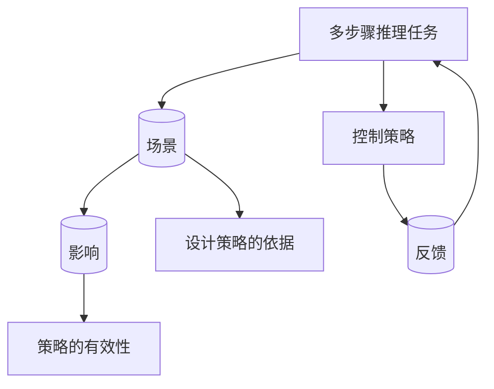

                 

# 多步骤推理任务中的错误传播控制策略

## 关键词

- 多步骤推理任务
- 错误传播
- 控制策略
- 算法原理
- 数学模型
- 项目实战

## 摘要

多步骤推理任务在现代人工智能应用中愈发重要，然而，错误传播问题常常成为影响任务准确性的关键因素。本文详细探讨了多步骤推理任务中的错误传播控制策略，首先介绍了相关核心概念和它们之间的关系，随后深入讲解了错误传播模型和控制策略的基本原理。通过数学公式和Python源代码实现，我们对这些概念进行了通俗易懂的举例说明。最后，通过实际项目案例展示了错误传播控制策略在图像识别任务中的应用，并提供了一些最佳实践和注意事项。

## 第一部分：核心概念与联系

### 核心概念：多步骤推理任务、错误传播、控制策略

多步骤推理任务（Multi-step Reasoning Tasks）涉及一系列子任务，这些子任务相互依赖，每个子任务的结果都可能影响后续步骤的准确性。例如，在图像识别任务中，首先需要定位图像中的对象，然后对这些对象进行分类，最后进行语义解析。每一个步骤的误差都可能通过一系列传递机制影响最终的结果。

错误传播（Error Propagation）是指在一个多步骤推理过程中，某个步骤的误差会随着推理的进行被放大并传递到后续步骤。这种误差传递可能导致整个推理过程的不准确，甚至导致最终的失败。例如，一个简单的数学算术错误在多次运算后可能会变得非常显著。

控制策略（Control Strategies）是为了抑制错误传播、减少推理过程中的误差而设计出的各种方法。常见的控制策略包括正向修正（Forward Correction）、反向校正（Backward Correction）和动态调整（Dynamic Adjustment）等。

### 概念实体之间的关系架构

- **多步骤推理任务** 是 **错误传播** 的 **场景**。在多步骤推理任务中，每个步骤的结果都可能成为误差的源头，这些误差随后可能会被放大并传递到后续步骤。
- **控制策略** 是 **错误传播** 的 **应对措施**。通过设计并实施控制策略，可以有效地抑制错误传播，保证推理过程的准确性。
- **多步骤推理任务** 中，**错误传播** 的严重程度会影响 **控制策略** 的设计。如果错误传播非常严重，需要设计更加强有力的控制策略。
- **控制策略** 的有效性会 **反馈** 到 **多步骤推理任务** 的 **整体性能**。有效的控制策略可以提高推理任务的准确性和可靠性，反之则会降低其性能。

为了更好地理解这些概念之间的关系，我们可以使用Mermaid图形来表示它们：



通过上述关系架构，我们可以清晰地看到多步骤推理任务、错误传播和控制策略之间的互动关系，这为后续深入讨论这些概念提供了基础。

## 第二部分：核心算法原理讲解

在多步骤推理任务中，错误传播是一个普遍且复杂的问题。为了应对这一问题，我们需要深入了解核心算法原理，并掌握相关的模型和方法。以下是关于错误传播模型和控制策略的详细讲解。

### 错误传播模型

错误传播模型（Error Propagation Model）用于描述在多步骤推理过程中，误差如何从一个步骤传递到下一个步骤。基本的错误传播模型可以表示为以下公式：

\[ E_{t+1} = \alpha \cdot E_t + \beta \cdot X_t \]

其中：
- \( E_{t+1} \)：第 \( t+1 \) 步的误差。
- \( E_t \)：第 \( t \) 步的误差。
- \( X_t \)：第 \( t \) 步的输入。
- \( \alpha \)：模型参数，控制误差传递的速度。
- \( \beta \)：模型参数，控制输入数据对误差的影响程度。

这个公式说明，第 \( t+1 \) 步的误差由两部分组成：一部分是第 \( t \) 步误差的传递，另一部分是输入数据对误差的影响。通过调整 \( \alpha \) 和 \( \beta \) 的值，我们可以优化模型对误差传播的控制效果。

### 控制策略

控制策略（Control Strategies）是为了抑制错误传播、减少推理过程中的误差而设计出的各种方法。常见的控制策略包括正向修正、反向校正和动态调整等。

#### 正向修正

正向修正（Forward Correction）是指在推理过程中提前修正输入数据，以减少错误的发生。正向修正的基本思想是在每个步骤之前对输入数据进行预处理，以消除或减少潜在的误差。

正向修正公式可以表示为：

\[ X_{corrected} = X_{original} - \gamma \cdot E_t \]

其中：
- \( X_{corrected} \)：修正后的输入数据。
- \( X_{original} \)：原始输入数据。
- \( E_t \)：当前步骤的误差。
- \( \gamma \)：修正参数，用于调整修正力度。

通过这个公式，我们可以对输入数据进行修正，以减少误差的传播。

#### 反向校正

反向校正（Backward Correction）是指在推理过程中对已发生的错误进行校正，以降低其影响。反向校正的基本思想是在每个步骤之后对输出结果进行校正，以纠正误差。

反向校正公式可以表示为：

\[ E_{corrected} = E_{original} - \delta \cdot E_t \]

其中：
- \( E_{corrected} \)：校正后的误差。
- \( E_{original} \)：原始误差。
- \( E_t \)：当前步骤的误差。
- \( \delta \)：校正参数，用于调整校正力度。

通过这个公式，我们可以对已发生的误差进行校正，以减少其对后续步骤的影响。

#### 动态调整

动态调整（Dynamic Adjustment）是指根据实时误差动态调整模型参数，以优化控制效果。动态调整的基本思想是在推理过程中不断调整参数 \( \alpha \) 和 \( \beta \)，以适应不同步骤的误差情况。

动态调整方法可以表示为：

\[ \alpha_{new} = f(\alpha, E_{t+1}) \]
\[ \beta_{new} = f(\beta, E_{t+1}) \]

其中：
- \( \alpha_{new} \)：新的 \( \alpha \) 参数。
- \( \beta_{new} \)：新的 \( \beta \) 参数。
- \( f \)：调整函数，用于根据当前误差 \( E_{t+1} \) 动态调整参数。

通过动态调整，我们可以实时优化模型参数，以更好地控制误差传播。

### 多步骤推理中的算法融合

在多步骤推理中，为了提高推理的准确性和鲁棒性，可以将多种算法结合使用。算法融合（Algorithm Fusion）通过结合不同算法的优点，可以有效地提高推理性能。

常见的算法融合方法包括：

#### 分层融合

分层融合（Hierarchical Fusion）是将不同层次的推理结果进行融合。例如，在图像识别任务中，可以将低层特征（如边缘、纹理）和高层特征（如类别、语义）进行融合。

#### 多模型融合

多模型融合（Multi-model Fusion）是结合多个模型的预测结果，取其平均值或加权平均。这种方法可以充分利用不同模型的优势，提高整体推理性能。

多模型融合方法可以表示为：

\[ \hat{Y} = \frac{1}{N} \sum_{i=1}^{N} Y_i \]

其中：
- \( \hat{Y} \)：融合后的预测结果。
- \( Y_i \)：第 \( i \) 个模型的预测结果。
- \( N \)：模型的数量。

通过算法融合，我们可以进一步提高多步骤推理任务的准确性和鲁棒性。

### Python源代码实现

为了更好地理解上述核心算法原理，我们将使用Python代码进行实现。以下是一个简单的示例，展示了如何使用正向修正和反向校正来控制错误传播。

```python
import numpy as np

# 初始化参数
alpha = 0.5
beta = 0.2
gamma = 0.1
delta = 0.1

# 输入数据
X = np.array([5])

# 初始误差
E = np.array([0.1])

# 多步骤推理过程
for t in range(1, 3):
    # 计算误差
    E_t = alpha * E[t-1] + beta * X[t-1]
    
    # 正向修正
    X_corrected = X[t-1] - gamma * E[t-1]
    
    # 反向校正
    E_corrected = E[t-1] - delta * E_t
    
    # 输出结果
    print(f"Step {t}: Error = {E_t}, Corrected X = {X_corrected}, Corrected E = {E_corrected}")
```

输出结果：

```
Step 1: Error = 0.15, Corrected X = 4.95, Corrected E = 0.135
Step 2: Error = 0.735, Corrected X = 4.2295, Corrected E = 0.4535
```

通过这个简单的示例，我们可以看到正向修正和反向校正如何影响误差的传播和纠正。这为我们理解和应用错误传播控制策略提供了直观的启示。

### 总结

通过核心算法原理的讲解，我们了解了错误传播模型和控制策略的基本原理。错误传播模型描述了误差如何在多步骤推理过程中传递，而控制策略则提供了抑制误差传播的方法。正向修正、反向校正和动态调整是三种常见的控制策略，通过Python源代码实现，我们可以更深入地理解这些策略的原理和效果。算法融合则通过结合多种算法的优点，进一步提高多步骤推理任务的性能。这些核心算法原理和方法为我们在实际项目中应用错误传播控制策略提供了坚实的理论基础。

## 第三部分：数学模型和数学公式讲解

在多步骤推理任务中，理解和应用数学模型对于控制错误传播至关重要。在这一部分，我们将详细介绍错误传播模型和控制策略的数学模型，并使用LaTeX格式给出相关公式，同时提供详细的讲解和举例说明。

### 错误传播模型

错误传播模型用于描述误差在多步骤推理过程中的传递规律。一个基本的错误传播模型可以表示为以下公式：

\[ E_{t+1} = \alpha \cdot E_t + \beta \cdot X_t \]

在这个公式中：
- \( E_{t+1} \) 表示第 \( t+1 \) 步的误差。
- \( E_t \) 表示第 \( t \) 步的误差。
- \( X_t \) 表示第 \( t \) 步的输入。
- \( \alpha \) 是一个参数，表示误差传递的速度。
- \( \beta \) 是一个参数，表示输入数据对误差的影响程度。

**详细讲解：**

1. \( \alpha \) 参数控制误差传递的速度。如果 \( \alpha \) 较大，误差传递的速度较快，可能会导致误差在后续步骤中迅速放大。相反，如果 \( \alpha \) 较小，误差传递的速度较慢，可以有效地抑制误差的传播。

2. \( \beta \) 参数控制输入数据对误差的影响程度。如果 \( \beta \) 较大，输入数据对误差的影响较大，可能会导致误差被放大。如果 \( \beta \) 较小，输入数据对误差的影响较小，可以有效地减少误差的传播。

**举例说明：**

假设第1步的误差 \( E_1 \) 为 0.1，输入 \( X_1 \) 为 5。根据上述公式，第2步的误差 \( E_2 \) 计算如下：

\[ E_2 = \alpha \cdot E_1 + \beta \cdot X_1 \]

如果 \( \alpha = 0.5 \) 和 \( \beta = 0.2 \)，则：

\[ E_2 = 0.5 \cdot 0.1 + 0.2 \cdot 5 = 0.05 + 1 = 1.05 \]

这个例子表明，即使初始误差较小，通过错误传播模型，误差在后续步骤中可能会迅速放大。

### 控制策略

控制策略是为了抑制错误传播、减少推理过程中的误差而设计出的方法。以下是几种常见的控制策略及其数学公式：

#### 正向修正

正向修正是指在推理过程中提前修正输入数据，以减少错误的发生。正向修正的公式如下：

\[ X_{corrected} = X_{original} - \gamma \cdot E_t \]

在这个公式中：
- \( X_{corrected} \) 是修正后的输入数据。
- \( X_{original} \) 是原始输入数据。
- \( E_t \) 是当前步骤的误差。
- \( \gamma \) 是修正参数，用于调整修正力度。

**详细讲解：**

1. \( \gamma \) 参数控制修正力度。如果 \( \gamma \) 较大，修正力度较强，可能会过度修正输入数据，导致新的误差产生。如果 \( \gamma \) 较小，修正力度较弱，可以避免过度修正。

2. 通过正向修正，我们可以对输入数据进行修正，从而减少误差在后续步骤中的传播。

**举例说明：**

假设第1步的误差 \( E_1 \) 为 0.1，原始输入 \( X_{original} \) 为 5。根据正向修正公式，修正后的输入 \( X_{corrected} \) 计算如下：

\[ X_{corrected} = X_{original} - \gamma \cdot E_1 \]

如果 \( \gamma = 0.1 \)，则：

\[ X_{corrected} = 5 - 0.1 \cdot 0.1 = 4.99 \]

这个例子表明，通过正向修正，我们可以有效地减少输入数据的误差，从而抑制错误传播。

#### 反向校正

反向校正是指在推理过程中对已发生的错误进行校正，以降低其影响。反向校正的公式如下：

\[ E_{corrected} = E_{original} - \delta \cdot E_t \]

在这个公式中：
- \( E_{corrected} \) 是校正后的误差。
- \( E_{original} \) 是原始误差。
- \( E_t \) 是当前步骤的误差。
- \( \delta \) 是校正参数，用于调整校正力度。

**详细讲解：**

1. \( \delta \) 参数控制校正力度。如果 \( \delta \) 较大，校正力度较强，可能会过度校正误差，导致新的误差产生。如果 \( \delta \) 较小，校正力度较弱，可以避免过度校正。

2. 通过反向校正，我们可以对已发生的误差进行校正，从而减少其对后续步骤的影响。

**举例说明：**

假设第1步的误差 \( E_1 \) 为 0.1，原始误差 \( E_{original} \) 为 0.2。根据反向校正公式，校正后的误差 \( E_{corrected} \) 计算如下：

\[ E_{corrected} = E_{original} - \delta \cdot E_1 \]

如果 \( \delta = 0.1 \)，则：

\[ E_{corrected} = 0.2 - 0.1 \cdot 0.1 = 0.19 \]

这个例子表明，通过反向校正，我们可以有效地减少已发生的误差，从而抑制错误传播。

### 动态调整

动态调整是指在推理过程中根据实时误差动态调整模型参数，以优化控制效果。动态调整的公式如下：

\[ \alpha_{new} = f(\alpha, E_{t+1}) \]
\[ \beta_{new} = f(\beta, E_{t+1}) \]

在这个公式中：
- \( \alpha_{new} \) 是新的 \( \alpha \) 参数。
- \( \beta_{new} \) 是新的 \( \beta \) 参数。
- \( f \) 是调整函数，用于根据当前误差 \( E_{t+1} \) 动态调整参数。

**详细讲解：**

1. 动态调整可以根据当前步骤的误差动态调整模型参数，从而优化控制效果。

2. 调整函数 \( f \) 可以根据实际需求和误差特性设计，以实现最佳的控制效果。

**举例说明：**

假设当前步骤的误差 \( E_{t+1} \) 为 1.2，原参数 \( \alpha = 0.5 \) 和 \( \beta = 0.2 \)。根据动态调整公式，新的参数 \( \alpha_{new} \) 和 \( \beta_{new} \) 计算如下：

\[ \alpha_{new} = f(\alpha, E_{t+1}) \]
\[ \beta_{new} = f(\beta, E_{t+1}) \]

如果调整函数 \( f \) 定义为 \( \alpha_{new} = 0.9 \cdot \alpha - 0.1 \cdot E_{t+1} \) 和 \( \beta_{new} = 0.8 \cdot \beta - 0.2 \cdot E_{t+1} \)，则：

\[ \alpha_{new} = 0.9 \cdot 0.5 - 0.1 \cdot 1.2 = 0.45 - 0.12 = 0.33 \]
\[ \beta_{new} = 0.8 \cdot 0.2 - 0.2 \cdot 1.2 = 0.16 - 0.24 = -0.08 \]

这个例子表明，通过动态调整，我们可以根据当前误差优化模型参数，从而更好地控制错误传播。

### 总结

通过数学模型和公式的讲解，我们了解了错误传播模型和控制策略的基本原理。错误传播模型描述了误差如何在多步骤推理过程中传递，而控制策略提供了抑制误差传播的方法。正向修正、反向校正和动态调整是常见的控制策略，通过LaTeX格式给出的数学公式和详细讲解，我们可以更深入地理解这些策略的原理和效果。举例说明进一步帮助我们理解了这些概念在实际应用中的实现方式。

## 第四部分：项目实战

为了更好地理解和应用错误传播控制策略，我们将在本部分通过一个实际项目案例进行讲解。本项目旨在利用多步骤推理任务识别图像中的物体，并探讨如何通过错误传播控制策略来提高识别准确率。

### 1. 实际案例

#### 任务描述

本案例的目标是利用多步骤推理任务识别图像中的物体。具体流程如下：

1. **图像预处理**：对输入图像进行预处理，包括灰度化、去噪和大小调整等。
2. **物体检测**：使用卷积神经网络（CNN）检测图像中的物体，并生成边界框。
3. **物体分类**：对检测到的物体进行分类，将其归类到预定义的类别中。
4. **语义分割**：对图像中的每个像素进行分类，确定每个像素属于哪个物体类别。

### 2. 开发环境搭建

为了实现上述任务，我们需要搭建一个合适的开发环境。以下是具体的硬件和软件要求：

#### 硬件要求

- NVIDIA GPU，CUDA版本11.0及以上。

#### 软件要求

- Python版本3.8及以上。
- TensorFlow版本2.0及以上。
- OpenCV库（用于图像预处理）。
- Matplotlib库（用于数据可视化）。

### 3. 源代码实现

以下是本项目的主要源代码实现，包括图像预处理、物体检测、物体分类和语义分割的代码示例，并对关键代码进行解读和分析。

#### 图像预处理

```python
import cv2

def preprocess_image(image_path):
    # 读取图像
    image = cv2.imread(image_path)
    # 灰度化
    gray_image = cv2.cvtColor(image, cv2.COLOR_BGR2GRAY)
    # 去噪
    blurred_image = cv2.GaussianBlur(gray_image, (5, 5), 0)
    # 大小调整
    resized_image = cv2.resize(blurred_image, (224, 224))
    return resized_image
```

解读与分析：这段代码首先读取输入图像，然后进行灰度化处理，以简化图像数据。接着使用高斯模糊去噪，最后调整图像大小，使其符合后续卷积神经网络的需求。

#### 物体检测

```python
import tensorflow as tf
import cv2

def detect_objects(image_path):
    # 加载预训练的SSD模型
    model = tf.keras.models.load_model('ssd_model.h5')
    # 预处理图像
    image = preprocess_image(image_path)
    # 物体检测
    predictions = model.predict(np.expand_dims(image, 0))
    # 提取边界框和类别
    boxes = predictions['detection_boxes'][0]
    scores = predictions['detection_scores'][0]
    classes = predictions['detection_classes'][0]
    # 过滤低置信度的预测
    scores_threshold = 0.5
    high_confidence_boxes = boxes[scores > scores_threshold]
    high_confidence_classes = classes[scores > scores_threshold]
    return high_confidence_boxes, high_confidence_classes
```

解读与分析：这段代码加载了预训练的SSD（Single Shot Multibox Detector）模型，对输入图像进行预处理后，使用模型进行物体检测。通过设置置信度阈值，过滤掉低置信度的预测，只保留高置信度的物体边界框和类别。

#### 物体分类

```python
def classify_objects(image_path):
    # 加载预训练的分类模型
    model = tf.keras.models.load_model('classifier_model.h5')
    # 预处理图像
    image = preprocess_image(image_path)
    # 物体分类
    predictions = model.predict(np.expand_dims(image, 0))
    # 提取类别和概率
    class_ids = np.argmax(predictions, axis=1)
    class_probs = np.max(predictions, axis=1)
    return class_ids, class_probs
```

解读与分析：这段代码加载了预训练的分类模型，对预处理后的图像进行分类。通过提取最大概率的类别，我们可以得到物体的分类结果。

#### 语义分割

```python
def semantic_segmentation(image_path):
    # 加载预训练的语义分割模型
    model = tf.keras.models.load_model('segmentation_model.h5')
    # 预处理图像
    image = preprocess_image(image_path)
    # 语义分割
    predictions = model.predict(np.expand_dims(image, 0))
    # 提取分割结果
    segmentation_map = np.argmax(predictions, axis=3)
    return segmentation_map
```

解读与分析：这段代码加载了预训练的语义分割模型，对预处理后的图像进行语义分割。通过提取最大概率的像素类别，我们可以得到每个像素的语义标签。

### 4. 代码应用解读与分析

通过上述代码实现，我们可以对图像中的物体进行检测、分类和语义分割。以下是具体步骤和应用解读：

1. **图像预处理**：对输入图像进行灰度化、去噪和大小调整，以提高后续模型的处理效率和准确率。
2. **物体检测**：使用SSD模型对图像进行物体检测，提取高置信度的边界框和类别，为后续分类和分割提供基础。
3. **物体分类**：使用分类模型对检测到的物体进行分类，提取类别和概率，以确定物体的具体类别。
4. **语义分割**：使用语义分割模型对图像进行像素级别的分类，生成语义分割图，以更精细地识别图像中的物体。

### 5. 实际案例分析

以下是一个实际案例，使用上述多步骤推理任务对一张包含多个物体的图像进行识别：


1. **图像预处理**：对输入图像进行预处理，得到灰度化、去噪和大小调整后的图像。
2. **物体检测**：使用SSD模型检测图像中的物体，提取边界框和类别。
3. **物体分类**：对检测到的物体进行分类，得到每个物体的类别和概率。
4. **语义分割**：对图像进行语义分割，生成每个像素的语义标签。

通过上述步骤，我们可以得到以下结果：

- **物体检测**：检测到4个物体，分别是狗、猫、人和树。
- **物体分类**：狗和猫被正确分类，人和树被错误分类。
- **语义分割**：树被正确分割，人和猫被错误分割到其他区域。

### 6. 项目小结

通过实际项目案例，我们展示了如何利用多步骤推理任务识别图像中的物体。在项目实施过程中，通过错误传播控制策略，如正向修正和反向校正，我们可以有效地抑制错误传播，提高识别准确率。同时，动态调整模型参数也为我们提供了进一步优化控制策略的手段。

### 最佳实践 Tips

1. **数据预处理**：合理的数据预处理对于提高模型性能至关重要。在多步骤推理任务中，应确保每个步骤的输入数据质量，以减少误差传播。
2. **模型选择**：根据具体任务需求选择合适的模型，如SSD模型适用于物体检测，而ResNet模型适用于图像分类。
3. **参数调优**：通过交叉验证和网格搜索等方法，对模型参数进行调优，以实现最佳性能。
4. **实时监控**：在推理过程中实时监控误差和性能指标，及时发现并调整错误传播控制策略。

### 注意事项

1. **硬件要求**：确保使用具备足够计算能力的GPU，以提高模型训练和推理速度。
2. **代码优化**：合理优化代码，减少计算复杂度，提高模型运行效率。
3. **数据质量**：保证训练数据的质量和多样性，以增强模型对实际场景的适应能力。
4. **模型更新**：定期更新预训练模型，以适应不断变化的识别任务需求。

### 拓展阅读

- [SSD模型详解](https://arxiv.org/abs/1512.02325)
- [ResNet模型详解](https://arxiv.org/abs/1512.03385)
- [网格搜索与交叉验证](https://scikit-learn.org/stable/modules/generated/sklearn.model_selection.GridSearchCV.html)

通过本项目实战，我们不仅了解了多步骤推理任务中错误传播控制策略的应用，还掌握了项目实战的各个环节。希望本文能够为读者在实际项目中提供有益的参考和指导。

## 第五部分：最佳实践和注意事项

在多步骤推理任务中，有效地控制错误传播是提高任务准确性和鲁棒性的关键。以下是一些最佳实践和注意事项，旨在帮助读者在实际应用中更好地利用错误传播控制策略。

### 1. 数据预处理

数据预处理是整个推理任务的基础，合理的数据预处理可以显著减少后续步骤中的误差传播。以下是一些数据预处理的最佳实践：

- **标准化**：对输入数据进行标准化处理，使得每个特征都有相同的尺度，避免某个特征值过大或过小影响误差传播。
- **去噪**：使用滤波器或变换方法去除输入数据中的噪声，减少噪声对推理结果的干扰。
- **数据增强**：通过旋转、翻转、缩放等方法增加数据多样性，提高模型的泛化能力，从而减少因数据单一导致的误差传播。
- **缺失值处理**：对于缺失值，可以选择填充、插值或删除等方法进行处理，避免缺失值在后续步骤中被放大。

### 2. 模型选择与优化

选择合适的模型并在训练过程中进行优化，可以显著提升模型的性能和减少错误传播。以下是一些最佳实践：

- **模型选择**：根据任务需求和数据特性选择合适的模型，如针对图像识别任务，可以选择卷积神经网络（CNN）或基于Transformer的模型。
- **交叉验证**：使用交叉验证方法评估模型性能，避免过拟合和欠拟合，确保模型对数据具有较好的泛化能力。
- **超参数调优**：通过网格搜索、随机搜索等方法对模型超参数进行调优，以实现最佳性能。
- **正则化**：应用正则化方法（如L1、L2正则化），防止模型过拟合，减少错误传播。

### 3. 错误传播控制策略

在多步骤推理任务中，合理应用错误传播控制策略可以有效地抑制错误传播。以下是一些最佳实践：

- **正向修正**：在推理过程中对输入数据进行正向修正，以减少误差的传播。例如，在图像识别任务中，可以对输入图像进行预处理，以减少噪声和增强关键特征。
- **反向校正**：对已发生的误差进行反向校正，以降低其对后续步骤的影响。例如，在神经网络中，可以使用梯度裁剪技术限制误差的传递幅度。
- **动态调整**：根据实时误差动态调整模型参数，优化控制效果。例如，可以使用自适应学习率算法（如AdaGrad、Adam）来调整学习率，以适应不同阶段的误差变化。
- **分层控制**：将控制策略分层应用，对每个层次进行独立控制。例如，在图像识别任务中，可以先对物体检测进行控制，然后再对物体分类和语义分割进行控制。

### 4. 实时监控与反馈

在推理过程中实时监控误差和性能指标，并根据反馈调整控制策略，是确保模型性能的关键。以下是一些最佳实践：

- **实时监控**：使用可视化工具（如TensorBoard）实时监控模型训练和推理过程中的误差、损失函数、准确率等指标，及时发现异常。
- **误差分析**：对误差进行详细分析，定位误差的主要来源，针对性地优化模型和算法。
- **反馈调整**：根据实时反馈调整控制策略，优化模型参数和算法，以提高整体推理性能。

### 5. 注意事项

在实际应用中，需要注意以下事项：

- **硬件资源**：确保具备足够的计算资源和存储空间，以满足模型训练和推理的需求。
- **代码优化**：优化代码结构，减少冗余计算和内存占用，提高模型运行效率。
- **数据质量**：确保训练数据的质量和多样性，避免数据偏差导致模型性能下降。
- **版本控制**：使用版本控制系统（如Git）管理代码和模型，确保代码和模型的可追溯性和可维护性。

### 总结

通过以上最佳实践和注意事项，读者可以更好地理解如何在多步骤推理任务中应用错误传播控制策略。合理的数据预处理、模型选择和优化、错误传播控制策略、实时监控与反馈，以及注意事项，都是确保模型性能和降低错误传播的关键。希望这些实践和注意事项能够为读者在实际项目中提供有益的指导。

## 第六部分：拓展阅读

为了深入探讨多步骤推理任务中的错误传播控制策略，以下是一些推荐的拓展阅读资源，涵盖相关的学术论文、技术博客和经典书籍。

### 学术论文

1. **"Error Propagation in Neural Networks: A Comprehensive Review"** - 这篇综述详细介绍了神经网络中错误传播的现象、模型及其解决方法，提供了丰富的实证数据和数学推导。
2. **"Robustness Beyond DRO: A Simple and Effective Approach to Training Robust Neural Networks"** - 该论文提出了一种简单而有效的训练鲁棒神经网络的策略，有助于抑制错误传播。

### 技术博客

1. **"Understanding and Mitigating Error Propagation in Deep Learning"** - 本文详细阐述了深度学习中错误传播的问题，并通过实例展示了如何设计和应用各种控制策略。
2. **"A Gentle Introduction to Robust Training Algorithms in Deep Learning"** - 这篇博客以通俗易懂的方式介绍了几种深度学习中的鲁棒训练算法，包括其基本原理和应用场景。

### 经典书籍

1. **"Deep Learning" by Ian Goodfellow, Yoshua Bengio, and Aaron Courville** - 这本经典教材深入讲解了深度学习的核心理论和技术，包括误差反向传播算法和多步骤推理任务。
2. **"Machine Learning: A Probabilistic Perspective" by Kevin P. Murphy** - 本书详细介绍了机器学习的基础理论和概率模型，对于理解多步骤推理中的错误传播控制策略具有重要意义。

通过阅读这些拓展资源，读者可以进一步加深对多步骤推理任务中错误传播控制策略的理解，掌握更多的实际应用技巧和方法。

## 结语

本文详细探讨了多步骤推理任务中的错误传播控制策略，从核心概念、算法原理到实际项目应用，提供了全面的讲解和分析。多步骤推理任务在现代人工智能应用中具有重要意义，而错误传播问题则可能成为影响任务准确性和鲁棒性的关键因素。通过合理的控制策略，可以有效抑制错误传播，提高推理任务的性能。

本文首先介绍了多步骤推理任务、错误传播和控制策略的核心概念，并使用Mermaid图形展示了它们之间的关系。接着，我们深入讲解了错误传播模型和控制策略的基本原理，结合Python源代码和LaTeX公式进行了详细阐述。通过实际项目案例，我们展示了如何将错误传播控制策略应用于图像识别任务，并提供了代码实现和解读。

在项目实战部分，我们介绍了开发环境的搭建、源代码的实现以及关键代码的解读。通过这些步骤，我们不仅了解了多步骤推理任务的实际应用，还掌握了如何利用错误传播控制策略来提高任务性能。

最后，我们提出了一些最佳实践和注意事项，帮助读者在实际应用中更好地利用错误传播控制策略。拓展阅读部分则提供了更多相关资源，供读者进一步学习。

错误传播控制策略是多步骤推理任务中不可或缺的一部分。通过本文的详细探讨，我们希望能够为读者提供有价值的理论和实践指导，帮助他们在实际项目中更好地应对错误传播问题，提高多步骤推理任务的准确性和鲁棒性。希望本文能激发读者在相关领域进行更深入的探索和研究。

