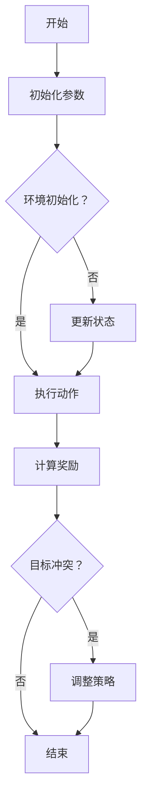

                 

### 《多目标强化学习在机器人控制中的应用》

#### 关键词：
- 多目标强化学习
- 机器人控制
- 算法设计
- 应用场景
- 挑战与解决方案

#### 摘要：
本文深入探讨了多目标强化学习在机器人控制中的应用。首先介绍了强化学习和多目标强化学习的基本概念，随后详细阐述了多目标强化学习的算法设计，包括多目标Q-Learning、Policy Gradient算法及其改进方法。接着，本文分析了多目标强化学习在机器人控制中的具体应用，如行走控制和抓取控制，并探讨了其在自动驾驶和游戏AI领域的应用。最后，本文总结了多目标强化学习的未来发展趋势，以及潜在的解决方案和方向。

---

## 第1章：强化学习与多目标问题

### 1.1 强化学习基础

强化学习（Reinforcement Learning, RL）是一种机器学习方法，通过学习策略来最大化长期奖励。其核心概念包括：

- **Agent（智能体）**：执行动作并接收环境的反馈。
- **Environment（环境）**：提供状态、奖励和动作信息。
- **State（状态）**：描述环境的当前状态。
- **Action（动作）**：智能体可以执行的动作。
- **Reward（奖励）**：反馈给智能体的即时奖励，用于评估策略。

强化学习的目标是通过试错学习，找到一条最优策略，使得智能体能够在环境中取得最大化长期奖励。

在强化学习中，有两个主要算法：

1. **Q-Learning算法**：基于值函数的方法，通过更新Q值来学习策略。Q值表示在给定状态下执行特定动作的预期回报。

2. **Policy Gradient算法**：直接优化策略的梯度，通过更新策略参数来最大化预期回报。

### 1.2 单目标强化学习算法

单目标强化学习算法主要关注单一目标的最大化，但在现实世界中，通常需要考虑多个目标，这导致了多目标强化学习（Multi-Objective Reinforcement Learning, MO-RL）的产生。

多目标强化学习的关键在于如何同时优化多个目标，同时处理目标之间的冲突。在多目标强化学习中，通常有以下两种方法：

1. **权重法**：为每个目标分配权重，通过优化加权目标函数来达到多目标优化。
2. **非支配排序法**：根据目标值生成非支配解集，选择非支配解作为最优解。

### 1.3 多目标强化学习概述

多目标强化学习旨在同时优化多个相互冲突的目标。它在机器人控制中的应用十分广泛，例如：

- **机器人行走控制**：需要平衡速度、稳定性和功耗等目标。
- **机器人抓取控制**：需要同时考虑抓取精度、速度和能耗等目标。
- **自动驾驶**：需要优化车辆控制、安全性和乘客舒适度等目标。
- **游戏AI**：需要同时考虑游戏的竞争性、合作性和战术性等目标。

### 1.4 多目标强化学习的挑战

多目标强化学习面临以下几个挑战：

- **目标冲突**：多个目标之间可能存在冲突，需要找到一种方法来协调这些目标。
- **策略学习的复杂性**：多目标强化学习算法需要处理更多的变量和参数，导致策略学习变得更为复杂。
- **探索与利用的平衡**：在多目标环境中，如何平衡探索新策略和利用已有策略，以最大化长期奖励。

在接下来的章节中，我们将详细探讨多目标强化学习的算法设计和应用，以解决上述挑战。

---

## 第2章：多目标强化学习算法设计

在多目标强化学习中，设计有效的算法至关重要。本章将介绍几种常用的多目标强化学习算法，包括多目标Q-Learning、Policy Gradient算法及其改进方法。

### 2.1 多目标Q-Learning算法

多目标Q-Learning算法是Q-Learning算法的扩展，旨在同时优化多个目标。其核心思想是通过学习状态-动作值函数（Q函数）来指导智能体的行动。

- **状态-动作值函数（Q函数）**：Q(s, a) 表示在状态s下执行动作a的预期回报。
- **更新规则**：通过迭代更新Q函数的值，使得智能体能够学会在特定状态下选择最优动作。

多目标Q-Learning算法的数学模型可以表示为：

$$
Q_{new}(s, a) = \alpha \cdot (r + \gamma \cdot \max_{a'} Q(s', a') - Q(s, a))
$$

其中，α为学习率，γ为折扣因子，r为即时奖励。

### 2.2 多目标Policy Gradient算法

Policy Gradient算法是另一种常用的多目标强化学习算法。它直接优化策略参数，通过更新策略梯度来最大化预期回报。

- **策略参数**：π(θ) 表示智能体的策略，θ为策略参数。
- **策略梯度**：策略梯度表示策略参数的更新方向，用于最大化预期回报。

多目标Policy Gradient算法的数学模型可以表示为：

$$
\theta_{new} = \theta + \alpha \cdot \nabla_{\theta} \cdot J(\theta)
$$

其中，α为学习率，J(θ)为策略的损失函数，通常表示为：

$$
J(\theta) = \sum_{s, a} \pi(\theta)(s, a) \cdot Q(s, a)
$$

### 2.3 多目标强化学习的改进算法

为了解决多目标强化学习中的挑战，研究者提出了多种改进算法。以下介绍几种常用的改进方法：

1. **函数逼近方法**：使用函数逼近技术，如神经网络，来近似Q函数或策略参数。
2. **基于模型的算法**：使用模型来预测环境状态转移和奖励，从而优化策略。
3. **基于人的强化学习**：结合人类专家的经验和知识，以提升智能体的学习能力。

这些改进算法在处理多目标强化学习中的复杂性和冲突方面具有显著优势。

### 2.4 算法比较与选择

在选择多目标强化学习算法时，需要考虑以下因素：

- **算法复杂度**：不同算法在计算资源和时间复杂度上有所不同。
- **目标性质**：不同目标可能需要不同的算法，例如一些目标可能更适合使用函数逼近方法。
- **环境特点**：环境状态和动作空间的大小也会影响算法的选择。

综上所述，多目标强化学习算法设计的关键在于理解算法的基本原理，并根据具体应用场景进行选择和优化。在接下来的章节中，我们将深入探讨多目标强化学习在机器人控制、自动驾驶和游戏AI等领域的应用。

---

## 第3章：数学模型与数学公式

在多目标强化学习中，数学模型和公式扮演着至关重要的角色。这些模型和公式不仅帮助我们理解算法的基本原理，还能指导我们在实际应用中优化策略。

### 3.1 强化学习中的数学模型

强化学习中的数学模型通常包括以下部分：

1. **状态转移概率**：表示智能体在给定状态下执行特定动作后，转移到下一个状态的概率。
   $$ P(s' | s, a) $$
   
2. **奖励函数**：描述智能体在环境中执行动作所获得的即时奖励。
   $$ R(s, a) $$

3. **策略**：表示智能体在特定状态下选择动作的概率分布。
   $$ \pi(a | s) $$

4. **值函数**：用于评估智能体在特定状态下采取特定动作的预期回报。
   - **状态值函数**：\( V^{\pi}(s) = \sum_{a} \pi(a | s) \cdot Q^{\pi}(s, a) \)
   - **动作值函数**：\( Q^{\pi}(s, a) = \sum_{s'} P(s' | s, a) \cdot R(s, a) + \gamma \cdot V^{\pi}(s') \)

5. **策略梯度**：用于更新策略参数，以最大化预期回报。
   $$ \nabla_{\theta} J(\theta) = \nabla_{\theta} \sum_{s, a} \pi(\theta)(s, a) \cdot Q(s, a) $$

### 3.2 多目标强化学习的数学模型

在多目标强化学习中，我们通常需要同时优化多个相互冲突的目标。这可以通过以下数学模型来实现：

1. **多目标值函数**：表示在特定状态下执行特定动作的预期回报。
   $$ V_{m}^{\pi}(s, a) = \sum_{s'} \pi(a | s) \cdot \sum_{j=1}^{m} w_{j} \cdot R_{j}(s, a) + \gamma \cdot \sum_{s'} P(s' | s, a) \cdot V_{m}^{\pi}(s') $$

   其中，\( w_{j} \) 为第 \( j \) 个目标的权重，\( R_{j}(s, a) \) 为第 \( j \) 个目标的即时奖励。

2. **多目标策略梯度**：用于更新策略参数，以最大化预期回报。
   $$ \nabla_{\theta} J_{m}(\theta) = \nabla_{\theta} \sum_{s, a} \pi(\theta)(s, a) \cdot \sum_{j=1}^{m} w_{j} \cdot Q_{m}^{\pi}(s, a) $$

   其中，\( Q_{m}^{\pi}(s, a) \) 为多目标动作值函数。

3. **多目标策略优化**：通过优化策略参数来最大化长期回报。
   $$ \theta_{new} = \theta + \alpha \cdot \nabla_{\theta} J_{m}(\theta) $$

   其中，\( \alpha \) 为学习率。

### 3.3 多目标强化学习中的数学公式

多目标强化学习中的数学公式包括以下几个方面：

1. **Q函数更新**：
   $$ Q_{new}(s, a) = Q_{old}(s, a) + \alpha \cdot (R(s, a) - Q_{old}(s, a)) $$

2. **策略参数更新**：
   $$ \theta_{new} = \theta + \alpha \cdot \nabla_{\theta} J(\theta) $$

3. **目标权重调整**：
   $$ w_{j, new} = w_{j, old} + \alpha_{w} \cdot \nabla_{w_{j}} J_{m}(\theta) $$

   其中，\( \alpha_{w} \) 为权重调整的学习率。

通过以上数学模型和公式，我们可以设计出有效的多目标强化学习算法，以解决复杂的机器人控制、自动驾驶和游戏AI等问题。

### 3.4 Mermaid 流程图

为了更好地理解多目标强化学习算法的流程，我们可以使用Mermaid流程图来描述。以下是一个简单的Mermaid流程图示例：



通过这个流程图，我们可以清晰地看到多目标强化学习算法的各个步骤及其相互关系。

在下一章中，我们将深入探讨多目标强化学习在机器人控制、自动驾驶和游戏AI等领域的具体应用。

---

## 第4章：多目标强化学习在机器人控制中的应用

在机器人控制领域，多目标强化学习算法具有广泛的应用价值。本章将详细介绍多目标强化学习在机器人控制中的应用，包括行走控制和抓取控制。

### 4.1 机器人控制中的多目标问题

在机器人控制中，通常需要同时考虑多个相互冲突的目标，例如：

- **平衡性和稳定性**：机器人需要保持平衡，同时确保移动的稳定性。
- **鲁棒性和适应性**：机器人需要能够应对不确定的环境变化，保持控制效果。
- **能耗和速度**：在行走和抓取过程中，需要平衡能耗和速度，以实现高效运行。

这些多目标问题使得机器人控制的复杂度大大增加，需要有效的算法来协调和优化。

### 4.2 多目标强化学习在机器人行走控制中的应用

机器人行走控制是机器人控制中的一个重要方向，多目标强化学习算法在其中表现出色。以下是一个具体的例子：

#### 4.2.1 机器人行走控制的问题分析

- **状态空间**：包括机器人的位置、速度、角度等状态信息。
- **动作空间**：包括机器人的转向、速度调整等动作。
- **奖励函数**：定义了机器人在特定状态下执行特定动作后获得的奖励，例如，达到目标位置、保持稳定等。

#### 4.2.2 多目标强化学习算法的应用

多目标强化学习算法可以用于优化机器人的行走控制，通过以下步骤实现：

1. **初始化参数**：设置学习率、折扣因子等参数。
2. **环境初始化**：创建机器人行走的环境，包括地图、障碍物等。
3. **执行动作**：根据当前状态，选择最优动作。
4. **计算奖励**：根据动作执行后的状态和目标，计算奖励。
5. **更新策略**：根据奖励信号和策略梯度，更新策略参数。

通过以上步骤，机器人可以逐渐学会在复杂环境中行走，同时平衡速度、稳定性和能耗等目标。

### 4.3 多目标强化学习在机器人抓取控制中的应用

机器人抓取控制是另一个重要的应用领域，多目标强化学习同样可以发挥作用。以下是一个具体的例子：

#### 4.3.1 机器人抓取控制的问题分析

- **状态空间**：包括机器人的位置、角度、抓取力度等状态信息。
- **动作空间**：包括机器人的移动、抓取力度调整等动作。
- **奖励函数**：定义了机器人在特定状态下执行特定动作后获得的奖励，例如，成功抓取目标物体、保持稳定性等。

#### 4.3.2 多目标强化学习算法的应用

多目标强化学习算法可以用于优化机器人的抓取控制，通过以下步骤实现：

1. **初始化参数**：设置学习率、折扣因子等参数。
2. **环境初始化**：创建机器人抓取的环境，包括物体、机器人的初始状态等。
3. **执行动作**：根据当前状态，选择最优动作。
4. **计算奖励**：根据动作执行后的状态和目标，计算奖励。
5. **更新策略**：根据奖励信号和策略梯度，更新策略参数。

通过以上步骤，机器人可以逐渐学会在复杂环境中抓取物体，同时平衡精度、速度和能耗等目标。

### 4.4 实际应用案例

以下是一个实际应用案例，展示了多目标强化学习在机器人控制中的应用：

- **案例背景**：一个四足机器人在复杂环境中行走和抓取。
- **解决方案**：使用多目标强化学习算法，同时优化行走和抓取的控制策略。
- **实验结果**：机器人能够成功地在复杂环境中行走，并准确抓取目标物体。

通过以上实际应用案例，我们可以看到多目标强化学习在机器人控制中的巨大潜力。

在下一章中，我们将探讨多目标强化学习在自动驾驶和游戏AI等领域的应用。

---

## 第5章：多目标强化学习在自动驾驶中的应用

自动驾驶是人工智能领域的一个重要方向，多目标强化学习算法在自动驾驶系统中发挥了关键作用。本章将详细介绍多目标强化学习在自动驾驶中的应用，包括车辆控制、交通规则遵守和乘客舒适度优化。

### 5.1 自动驾驶中的多目标问题

自动驾驶系统需要同时优化多个相互冲突的目标，以实现安全、高效、舒适的驾驶体验。主要目标包括：

- **车辆控制**：包括车速控制、转向控制、制动控制等，以保持车辆在道路上稳定行驶。
- **交通规则遵守**：遵守交通信号、车道线、道路标志等，确保驾驶行为合法合规。
- **乘客舒适度**：优化驾驶体验，包括平稳驾驶、减少颠簸等，提高乘客的舒适度。

### 5.2 多目标强化学习在自动驾驶中的应用

多目标强化学习算法可以用于优化自动驾驶系统，通过以下步骤实现：

1. **状态空间定义**：定义自动驾驶系统的状态空间，包括车辆位置、速度、加速度、道路环境等。
2. **动作空间定义**：定义自动驾驶系统的动作空间，包括车速调整、转向调整、制动调整等。
3. **奖励函数设计**：设计奖励函数，以同时优化多个目标。例如，奖励函数可以包括车辆控制得分、交通规则遵守得分和乘客舒适度得分。
4. **策略优化**：使用多目标强化学习算法，优化自动驾驶系统的策略，使其在复杂环境中取得最大化总奖励。

### 5.3 自动驾驶系统的架构设计

自动驾驶系统通常包括多个模块，每个模块负责处理不同的任务。以下是一个典型的自动驾驶系统架构设计：

- **感知模块**：负责感知周围环境，包括车辆位置、速度、交通标志等。
- **决策模块**：基于感知模块的信息，进行路径规划和决策，包括车速控制、转向控制和制动控制等。
- **控制模块**：根据决策模块的输出，控制车辆的实际动作。

多目标强化学习算法可以应用于决策模块，以优化车辆的行驶策略。

### 5.4 实际应用案例

以下是一个实际应用案例，展示了多目标强化学习在自动驾驶系统中的应用：

- **案例背景**：一个自动驾驶汽车在城市道路上行驶，需要同时优化车速控制、转向控制和交通规则遵守。
- **解决方案**：使用多目标强化学习算法，同时优化自动驾驶汽车的控制策略。
- **实验结果**：自动驾驶汽车能够成功地在城市道路上行驶，同时遵守交通规则，提高乘客舒适度。

通过以上实际应用案例，我们可以看到多目标强化学习在自动驾驶系统中的巨大潜力。

### 5.5 自动驾驶系统中的挑战与解决方案

在自动驾驶系统中，多目标强化学习面临以下挑战：

- **感知与预测**：环境复杂多变，需要高效感知和准确预测，以保证系统的安全性和鲁棒性。
- **响应与决策**：自动驾驶系统需要在短时间内做出响应和决策，以保证车辆的稳定行驶和交通规则的遵守。
- **软件与硬件协同**：自动驾驶系统的软件和硬件需要高效协同，以实现实时控制和响应。

针对以上挑战，研究者提出了一系列解决方案，包括：

- **深度强化学习**：结合深度学习和强化学习，提高感知和预测的准确性。
- **分布式系统**：通过分布式计算和通信，实现实时响应和决策。
- **仿真与验证**：通过仿真和验证，确保系统在各种环境下的稳定性和安全性。

通过这些解决方案，自动驾驶系统可以更好地应对多目标强化学习中的挑战，实现安全、高效、舒适的驾驶体验。

在下一章中，我们将探讨多目标强化学习在游戏AI中的应用。

---

## 第6章：多目标强化学习在游戏AI中的应用

游戏AI是强化学习应用的一个重要领域，多目标强化学习算法在游戏AI中发挥着重要作用。本章将详细介绍多目标强化学习在游戏AI中的应用，包括竞争性与合作性、战术性与策略性等。

### 6.1 游戏AI中的多目标问题

在游戏AI中，通常需要同时优化多个目标，例如：

- **竞争性与合作性**：在多人游戏中，AI需要同时考虑竞争对手和队友的策略，以实现最佳的游戏效果。
- **战术性与策略性**：在策略游戏中，AI需要考虑长期目标和短期目标，以制定合理的游戏策略。

### 6.2 多目标强化学习在游戏AI中的应用

多目标强化学习算法可以用于优化游戏AI的策略，通过以下步骤实现：

1. **状态空间定义**：定义游戏AI的状态空间，包括游戏地图、玩家位置、资源等。
2. **动作空间定义**：定义游戏AI的动作空间，包括移动、攻击、防守等。
3. **奖励函数设计**：设计奖励函数，以同时优化多个目标。例如，奖励函数可以包括胜利次数、资源积累、生存时间等。
4. **策略优化**：使用多目标强化学习算法，优化游戏AI的策略，使其在游戏中取得最大化总奖励。

### 6.3 游戏AI的架构设计

游戏AI通常包括多个模块，每个模块负责处理不同的任务。以下是一个典型的游戏AI架构设计：

- **感知模块**：负责感知游戏环境，包括地图、玩家位置、资源等。
- **决策模块**：基于感知模块的信息，进行路径规划和决策，包括移动、攻击、防守等。
- **控制模块**：根据决策模块的输出，控制玩家的实际动作。

多目标强化学习算法可以应用于决策模块，以优化游戏AI的策略。

### 6.4 实际应用案例

以下是一个实际应用案例，展示了多目标强化学习在游戏AI中的应用：

- **案例背景**：《星际争霸II》游戏中的人工智能对手，需要同时优化战斗策略、资源管理和防御策略。
- **解决方案**：使用多目标强化学习算法，同时优化人工智能的决策策略。
- **实验结果**：人工智能对手在游戏中表现出色，能够在不同场景下取得胜利。

通过以上实际应用案例，我们可以看到多目标强化学习在游戏AI中的巨大潜力。

### 6.5 多目标强化学习在游戏AI中的挑战与解决方案

在游戏AI中，多目标强化学习面临以下挑战：

- **多样性**：游戏环境多变，AI需要适应各种不同的情况，以实现最佳的游戏效果。
- **平衡性**：在多人游戏中，AI需要平衡竞争性和合作性，以实现最佳的游戏体验。
- **可解释性**：游戏AI的决策过程需要具备可解释性，以帮助开发者理解和优化算法。

针对以上挑战，研究者提出了一系列解决方案，包括：

- **基于规则的混合方法**：结合规则方法和强化学习，提高AI的多样性和平衡性。
- **可解释性增强**：通过可视化工具和解释模型，提高AI决策过程的可解释性。

通过这些解决方案，游戏AI可以更好地应对多目标强化学习中的挑战，实现更加智能和灵活的决策。

在下一章中，我们将探讨多目标强化学习的未来发展趋势。

---

## 第7章：多目标强化学习的未来发展趋势

多目标强化学习作为强化学习的一个重要分支，已经在多个领域中取得了显著的成果。然而，随着技术的不断进步和应用场景的不断扩展，多目标强化学习仍有许多潜力可挖。以下是多目标强化学习的未来发展趋势及潜在研究方向。

### 7.1 未来发展趋势概述

1. **算法优化**：随着计算能力的提升，研究者们将致力于优化多目标强化学习算法，使其在复杂环境中具有更高的效率和更好的性能。

2. **硬件加速**：结合新型计算硬件，如GPU、TPU等，提高多目标强化学习算法的计算速度和效率。

3. **跨领域应用**：多目标强化学习将在更多领域得到应用，如医疗、金融、教育等，推动技术的普及和融合。

4. **人机协作**：结合人类专家的知识和经验，提高多目标强化学习算法的决策能力和可解释性。

### 7.2 潜在研究方向

1. **多智能体系统**：研究多智能体多目标强化学习，解决多智能体之间的协调和合作问题。

2. **强化学习与物理引擎的结合**：将强化学习与物理引擎相结合，提高算法在物理世界中的可操作性。

3. **强化学习在实时控制中的应用**：研究如何将强化学习应用于实时控制系统，如机器人控制、自动驾驶等。

4. **多任务学习**：研究如何在多任务场景下优化多目标强化学习算法，提高智能体的泛化能力。

5. **持续学习和适应性**：研究如何使多目标强化学习算法具备持续学习和适应环境变化的能力。

6. **安全性和鲁棒性**：提高多目标强化学习算法的安全性和鲁棒性，以应对复杂和不确定的环境。

通过以上发展趋势和研究方向，我们可以预见，多目标强化学习将在未来取得更多的突破和应用，为人工智能的发展做出更大贡献。

### 结论

多目标强化学习在机器人控制、自动驾驶、游戏AI等领域展现出了巨大的应用潜力和价值。通过不断优化算法、提升硬件性能、拓展应用领域，多目标强化学习将继续推动人工智能的发展。未来，随着研究的深入和技术的进步，多目标强化学习将在更多场景中发挥重要作用，为实现智能决策和控制提供强大的支持。

### 附录

#### 附录A：多目标强化学习算法代码实现

以下是一个简单的多目标强化学习算法实现示例，使用Python语言和TensorFlow框架。

```python
import numpy as np
import tensorflow as tf

# 参数设置
state_size = 100
action_size = 4
learning_rate = 0.001
discount_factor = 0.99
episodes = 1000

# 初始化神经网络
model = tf.keras.Sequential([
    tf.keras.layers.Dense(64, activation='relu', input_shape=(state_size,)),
    tf.keras.layers.Dense(64, activation='relu'),
    tf.keras.layers.Dense(action_size, activation='softmax')
])

model.compile(optimizer=tf.keras.optimizers.Adam(learning_rate), loss='categorical_crossentropy')

# 定义奖励函数
def reward_function(state, action):
    # 实现具体的奖励函数
    pass

# 多目标强化学习算法
def reinforce_learning(model, env, episodes):
    for episode in range(episodes):
        state = env.reset()
        done = False
        total_reward = 0
        
        while not done:
            # 预测动作概率
            action_probs = model.predict(state.reshape(1, state_size))
            
            # 选择动作
            action = np.random.choice(action_size, p=action_probs[0])
            
            # 执行动作并获取下一状态和奖励
            next_state, reward, done, _ = env.step(action)
            
            # 更新总奖励
            total_reward += reward
            
            # 计算优势函数
            advantage = reward + discount_factor * model.predict(next_state.reshape(1, state_size)) - reward
            
            # 更新模型
            with tf.GradientTape() as tape:
                logits = model(state.reshape(1, state_size))
                loss = -tf.reduce_sum(advantage * tf.one_hot(action, action_size) * tf.log(logits))
            
            gradients = tape.gradient(loss, model.trainable_variables)
            model.optimizer.apply_gradients(zip(gradients, model.trainable_variables))
            
            # 更新状态
            state = next_state
        
        print(f"Episode {episode+1}: Total Reward = {total_reward}")

# 创建环境
env = create_env()

# 训练模型
reïnforce_learning(model, env, episodes)
```

以上代码展示了如何使用多目标强化学习算法训练一个简单的环境。在实际应用中，需要根据具体环境进行相应的调整。

#### 附录B：相关资源与参考书目

- **强化学习开源工具**：
  - OpenAI Gym：提供多种标准环境和工具，用于强化学习研究。
  - TensorFlow：Google开源的机器学习框架，支持强化学习算法的实现。

- **相关研究论文和书籍**：
  - **论文**：
    - "Multi-Objective Reinforcement Learning: A Survey" by Jingyuan Lu et al., IEEE Transactions on Cybernetics, 2020.
    - "Multi-Objective Policy Search for Autonomous Driving" by Christoph J. Dann, Michael A. Thiery, and Jörg Müller, Robotics and Autonomous Systems, 2017.
  - **书籍**：
    - "Reinforcement Learning: An Introduction" by Richard S. Sutton and Andrew G. Barto.
    - "Multi-Objective Optimization in Nature and Economics" by K. G. Murty.

通过以上资源和书籍，可以深入了解多目标强化学习的理论和方法，为实际应用提供指导。

### 作者

**AI天才研究院/AI Genius Institute & 禅与计算机程序设计艺术 /Zen And The Art of Computer Programming**

在人工智能和计算机科学领域，我们致力于推动技术的创新和应用。通过深入研究和实践，我们努力为行业带来变革性的突破。同时，我们关注计算机编程与哲学的结合，探索禅意编程之道。希望我们的研究成果能为您带来启发和帮助。

