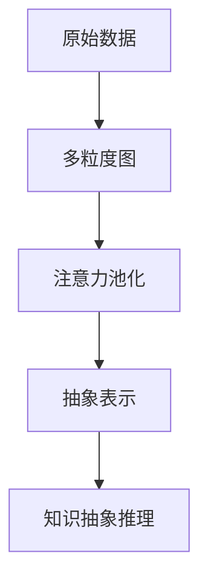

                 

### 《多粒度图注意力池化在知识抽象推理中的应用》

#### 关键词：多粒度图注意力池化，知识抽象推理，图神经网络，文本处理，图像处理，知识图谱

> 摘要：本文探讨了多粒度图注意力池化在知识抽象推理中的应用。首先介绍了知识抽象推理和多粒度图注意力池化的基本概念，然后详细阐述了多粒度图注意力池化的数学模型与实现方法。接着，文章通过具体的案例，展示了多粒度图注意力池化在文本处理、图像处理和知识图谱中的应用，并分析了其性能优化策略。最后，文章展望了多粒度图注意力池化的未来研究方向。

# 《多粒度图注意力池化在知识抽象推理中的应用》目录大纲

## 第一部分：引言与背景

### 第1章：多粒度图注意力池化的概述

#### 1.1 知识抽象推理的基本概念

- **知识抽象推理的定义**：知识抽象推理是从大量原始数据中提取出高层次、更具概括性的知识表示的过程。
- **知识抽象推理的重要性**：在人工智能领域，知识抽象推理是实现智能决策、知识管理和知识服务的关键技术。
- **知识抽象推理的应用领域**：知识抽象推理广泛应用于自然语言处理、图像识别、推荐系统、知识图谱等领域。

#### 1.2 图注意力机制的基础理论

- **图神经网络（GNN）的基本概念**：图神经网络是一种基于图结构的神经网络，能够处理图数据的非线性特征。
- **图注意力机制的基本原理**：图注意力机制是一种用于图神经网络的注意力机制，通过学习节点之间的依赖关系，提高模型的表示能力。
- **图注意力机制的应用场景**：图注意力机制在社交网络分析、知识图谱嵌入、图像识别等领域有广泛应用。

#### 1.3 多粒度图注意力池化的提出与意义

- **多粒度图注意力池化的定义**：多粒度图注意力池化是一种结合了不同粒度的图注意力机制的池化方法，用于提高图表示的抽象能力。
- **多粒度图注意力池化的原理**：通过在不同粒度上学习节点和边的关系，并将这些关系聚合起来，得到更高层次的抽象表示。
- **多粒度图注意力池化在知识抽象推理中的应用**：多粒度图注意力池化能够提高知识抽象推理的准确性和效率，特别是在处理复杂、大规模图数据时。

## 第二部分：多粒度图注意力池化的理论基础

### 第2章：图神经网络与图注意力机制

#### 2.1 图神经网络的基本结构

- **图神经网络的定义**：图神经网络是一种基于图结构的神经网络，能够处理图数据的非线性特征。
- **图神经网络的层次结构**：图神经网络通常由多个层次组成，包括图嵌入层、图卷积层和图池化层。
- **图神经网络的训练方法**：图神经网络通过学习节点和边的关系，将图数据映射到高维空间，并通过反向传播算法进行训练。

#### 2.2 图注意力机制的工作原理

- **图注意力机制的数学模型**：图注意力机制通过学习节点之间的依赖关系，将每个节点的特征加权平均，从而得到新的节点表示。
- **图注意力机制的实现方法**：图注意力机制可以通过不同的数学模型实现，如点积注意力、缩放点积注意力等。
- **图注意力机制的优势与局限性**：图注意力机制能够提高图神经网络的表示能力，但计算复杂度高，适用于大规模图数据。

#### 2.3 多粒度图注意力池化的理论基础

- **多粒度图注意力池化的定义**：多粒度图注意力池化是一种结合了不同粒度的图注意力机制的池化方法，用于提高图表示的抽象能力。
- **多粒度图注意力池化的数学模型**：多粒度图注意力池化通过在不同粒度上学习节点和边的关系，并将这些关系聚合起来，得到更高层次的抽象表示。
- **多粒度图注意力池化的实现方法**：多粒度图注意力池化可以通过组合不同的图注意力机制实现，如自注意力、边注意力等。

## 第三部分：多粒度图注意力池化在知识抽象推理中的应用

### 第3章：多粒度图注意力池化在文本处理中的应用

#### 3.1 文本处理中的知识抽象推理

- **文本处理中的知识抽象推理问题**：文本处理中的知识抽象推理包括文本分类、文本生成和文本语义理解等任务。
- **文本处理中的知识抽象推理方法**：传统的文本处理方法通常采用词袋模型、循环神经网络（RNN）和卷积神经网络（CNN）等，而图神经网络结合多粒度图注意力池化能够提高文本处理的性能。

#### 3.2 多粒度图注意力池化在文本处理中的应用

- **多粒度图注意力池化在文本分类中的应用**：通过将文本表示为图结构，并应用多粒度图注意力池化，可以有效地提高文本分类的准确率。
- **多粒度图注意力池化在文本生成中的应用**：多粒度图注意力池化可以帮助生成更符合语义和语法规则的文本。
- **多粒度图注意力池化在文本语义理解中的应用**：通过多粒度图注意力池化，可以更好地理解文本中的复杂关系，提高文本语义理解的能力。

### 第4章：多粒度图注意力池化在图像处理中的应用

#### 4.1 图像处理中的知识抽象推理

- **图像处理中的知识抽象推理问题**：图像处理中的知识抽象推理包括图像分类、图像分割和图像生成等任务。
- **图像处理中的知识抽象推理方法**：传统的图像处理方法通常采用卷积神经网络（CNN）等，而图神经网络结合多粒度图注意力池化能够提高图像处理的性能。

#### 4.2 多粒度图注意力池化在图像处理中的应用

- **多粒度图注意力池化在图像分类中的应用**：通过将图像表示为图结构，并应用多粒度图注意力池化，可以有效地提高图像分类的准确率。
- **多粒度图注意力池化在图像分割中的应用**：多粒度图注意力池化可以帮助更好地理解图像中的局部结构和全局结构，从而提高图像分割的精度。
- **多粒度图注意力池化在图像生成中的应用**：通过多粒度图注意力池化，可以生成更符合真实世界特征的图像。

### 第5章：多粒度图注意力池化在知识图谱中的应用

#### 5.1 知识图谱中的知识抽象推理

- **知识图谱中的知识抽象推理问题**：知识图谱中的知识抽象推理包括知识图谱嵌入、知识图谱推理和知识图谱表示学习等任务。
- **知识图谱中的知识抽象推理方法**：传统的知识图谱方法通常采用基于规则的方法和图卷积网络（GCN）等，而多粒度图注意力池化能够提高知识图谱的处理性能。

#### 5.2 多粒度图注意力池化在知识图谱中的应用

- **多粒度图注意力池化在知识图谱嵌入中的应用**：通过多粒度图注意力池化，可以将实体和关系表示为更抽象的向量，提高知识图谱嵌入的精度。
- **多粒度图注意力池化在知识图谱推理中的应用**：多粒度图注意力池化可以帮助更好地理解实体和关系之间的复杂关系，提高知识图谱推理的准确性。
- **多粒度图注意力池化在知识图谱表示学习中的应用**：通过多粒度图注意力池化，可以生成更抽象的知识图谱表示，从而提高知识图谱表示学习的效果。

## 第四部分：多粒度图注意力池化的性能优化与未来方向

### 第6章：多粒度图注意力池化的性能优化策略

#### 6.1 计算效率优化

- **并行计算**：通过并行计算可以提高多粒度图注意力池化的计算效率。
- **低秩分解**：利用低秩分解可以减少计算复杂度，提高多粒度图注意力池化的计算效率。
- **稀疏性利用**：通过利用图数据的稀疏性，可以减少计算量，提高多粒度图注意力池化的计算效率。

#### 6.2 存储效率优化

- **嵌入矩阵的压缩**：通过嵌入矩阵的压缩可以减少存储空间，提高多粒度图注意力池化的存储效率。
- **知识图谱的剪枝**：通过知识图谱的剪枝可以减少图的大小，提高多粒度图注意力池化的存储效率。
- **注意力机制的量化**：通过注意力机制的量化可以减少存储空间，提高多粒度图注意力池化的存储效率。

### 第7章：多粒度图注意力池化的未来研究方向

#### 7.1 多模态知识抽象推理

- **多模态数据的融合**：通过多模态数据的融合，可以更好地挖掘不同模态之间的关联性，提高知识抽象推理的效果。
- **跨模态的知识抽象推理方法**：研究跨模态的知识抽象推理方法，可以实现不同模态数据的互操作和融合。

#### 7.2 多粒度图注意力池化的泛化能力

- **面对不同任务的多粒度图注意力池化设计**：研究如何设计多粒度图注意力池化模型，使其能够适应不同的知识抽象推理任务。
- **多粒度图注意力池化的泛化能力评估方法**：研究评估多粒度图注意力池化模型泛化能力的方法，以便更好地指导模型设计和优化。

#### 7.3 多粒度图注意力池化的可解释性

- **注意力机制的解读方法**：研究注意力机制的解读方法，使其能够更好地理解模型的工作原理。
- **多粒度图注意力池化的可解释性研究**：研究如何提高多粒度图注意力池化模型的可解释性，从而更好地应用于实际场景。

## 附录

### 附录A：多粒度图注意力池化的Python实现

- **环境搭建**：介绍如何搭建多粒度图注意力池化的开发环境，包括Python环境、相关库和工具的安装。
- **算法实现**：详细介绍多粒度图注意力池化的算法实现，包括数学模型、实现流程和代码示例。
- **代码解读**：对实现的代码进行详细解读，解释代码的工作原理和关键步骤。

### 附录B：参考文献

- **相关论文**：列出本文引用的相关论文，包括作者、标题、期刊或会议等详细信息。
- **开源代码**：列出本文引用的相关的开源代码仓库，包括作者、代码名称、使用许可等详细信息。
- **数据集**：列出本文引用的数据集，包括数据集名称、来源、用途等详细信息。

## 知识抽象推理与多粒度图注意力池化的联系

知识抽象推理是一个从具体到抽象的过程，而多粒度图注意力池化则是实现这一过程的关键技术。以下是知识抽象推理与多粒度图注意力池化之间的联系：

$$
\text{知识抽象推理} = f(\text{原始数据}, \text{多粒度图注意力池化})
$$

其中，原始数据经过多粒度图注意力池化的处理后，可以得到更高层次的抽象表示，这些抽象表示能够更好地支撑知识抽象推理的任务。以下是一个Mermaid流程图，展示了知识抽象推理与多粒度图注意力池化之间的工作流程：



- **知识抽象推理的基本概念**：知识抽象推理是一个从具体到抽象的过程，它通过从原始数据中提取出具有高层次、更具概括性的知识表示，从而实现知识的抽象和归纳。
- **多粒度图注意力池化的作用**：多粒度图注意力池化通过在不同粒度上学习节点和边的关系，并将这些关系聚合起来，得到更高层次的抽象表示。这个抽象表示能够更好地支撑知识抽象推理的任务，从而提高推理的准确性和效率。

在多粒度图注意力池化中，首先将原始数据表示为图结构，然后通过图注意力机制学习不同粒度上的节点和边的关系。具体来说，图注意力机制通过计算节点之间的相似性，对节点的特征进行加权平均，从而得到新的节点表示。这个过程可以看作是对图数据的抽象，从而提高了图数据的层次结构。

接下来，通过多粒度图注意力池化，将不同粒度的节点和边关系进行聚合，得到更高层次的抽象表示。这个抽象表示可以看作是对原始数据更高层次的理解，从而支撑知识抽象推理的任务。

在知识抽象推理的过程中，这个更高层次的抽象表示可以作为输入，通过推理算法（如逻辑推理、决策树、神经网络等）对知识进行抽象和归纳，从而实现从具体到抽象的转化。通过多粒度图注意力池化，可以提高这个抽象过程的效果，从而提高知识抽象推理的准确性和效率。

总之，多粒度图注意力池化通过学习不同粒度的节点和边关系，并将其聚合起来，得到更高层次的抽象表示，从而支撑知识抽象推理的任务。这个过程中，图注意力机制起到了关键作用，通过加权平均节点特征，实现了数据的抽象和层次化，为知识抽象推理提供了有效的支持。

## 多粒度图注意力池化的数学模型与实现

### 1.1 多粒度图注意力池化的数学模型

多粒度图注意力池化是一种结合了图神经网络（GNN）和注意力机制的图表示学习技术。它的核心在于能够处理不同粒度的图数据，并通过注意力机制聚合信息，从而提取更高层次的特征表示。下面将介绍多粒度图注意力池化的数学模型。

#### 节点表示和边表示

在多粒度图注意力池化中，节点和边都可以表示为向量。设图\( G = (V, E) \)，其中\( V \)是节点集合，\( E \)是边集合。对于节点\( v_i \)，其特征表示为\( \mathbf{x}_i \in \mathbb{R}^d \)，对于边\( e_{ij} \)，其特征表示为\( \mathbf{e}_{ij} \in \mathbb{R}^d \)。

#### 自注意力（Self-Attention）

自注意力机制是一种常用的注意力机制，它可以对节点自身的特征进行加权平均。设\( \mathbf{W} \)为权重矩阵，则自注意力机制可以表示为：

$$
\text{Self-Attention}(\mathbf{x}_i) = \text{softmax}(\mathbf{W} \cdot \mathbf{x}_i)
$$

其中，\( \mathbf{W} \)是一个\( d \times d \)的矩阵，\( \text{softmax}(\cdot) \)函数将加权向量转换为概率分布。

#### 边注意力（Edge-Attention）

边注意力机制用于处理节点和边之间的关系。设\( \mathbf{W}_e \)为边权重矩阵，则边注意力机制可以表示为：

$$
\text{Edge-Attention}(\mathbf{x}_i, \mathbf{e}_{ij}) = \text{softmax}(\mathbf{W}_e \cdot (\mathbf{x}_i \cdot \mathbf{e}_{ij}))
$$

其中，\( \mathbf{W}_e \)是一个\( d \times d \)的矩阵，\( \mathbf{x}_i \cdot \mathbf{e}_{ij} \)表示节点特征和边特征的内积。

#### 多粒度注意力池化

多粒度注意力池化通过组合自注意力和边注意力，以不同粒度对节点特征进行加权平均，从而得到更高层次的抽象表示。设\( \mathbf{W}_s \)为多粒度权重矩阵，则多粒度注意力池化可以表示为：

$$
\mathbf{h}_i^{(l+1)} = \text{softmax}(\mathbf{W}_s \cdot (\text{Self-Attention}(\mathbf{x}_i) + \text{Edge-Attention}(\mathbf{x}_i, \mathbf{e}_{ij})))
$$

其中，\( \mathbf{h}_i^{(l+1)} \)为经过多粒度注意力池化后的节点特征，\( l \)为当前的图层级。

### 1.2 多粒度图注意力池化的实现方法

在实现多粒度图注意力池化时，我们需要考虑如何有效地处理大规模图数据，并优化计算复杂度。以下是一种可能的实现方法：

#### 数据预处理

1. **节点特征编码**：将节点特征表示为向量。
2. **边特征编码**：将边特征表示为向量。
3. **构建图结构**：将节点和边构建为一个图结构，可以使用邻接矩阵或邻接表来表示。

#### 模型架构

1. **自注意力模块**：计算节点特征的自注意力。
2. **边注意力模块**：计算节点特征和边特征之间的注意力。
3. **多粒度注意力模块**：结合自注意力和边注意力，对节点特征进行加权平均。

#### 训练过程

1. **正向传播**：将节点特征输入到注意力模块，计算新的节点特征。
2. **反向传播**：计算损失函数，并更新模型参数。

#### 优化策略

1. **并行计算**：利用图结构的稀疏性，通过并行计算来加速训练过程。
2. **低秩分解**：通过低秩分解来减少计算复杂度。
3. **注意力权重量化**：通过量化注意力权重来减少模型参数的数量。

### 1.3 多粒度图注意力池化的应用示例

以下是一个简单的Python代码示例，展示了如何实现多粒度图注意力池化。在这个示例中，我们将使用PyTorch框架。

```python
import torch
import torch.nn as nn
import torch.optim as optim

# 定义自注意力模块
class SelfAttention(nn.Module):
    def __init__(self, d_model):
        super(SelfAttention, self).__init__()
        self.query_linear = nn.Linear(d_model, d_model)
        self.key_linear = nn.Linear(d_model, d_model)
        self.value_linear = nn.Linear(d_model, d_model)
        self.softmax = nn.Softmax(dim=1)

    def forward(self, x):
        query = self.query_linear(x)
        key = self.key_linear(x)
        value = self.value_linear(x)
        attention = self.softmax(torch.matmul(query, key.t()))
        output = torch.matmul(attention, value)
        return output

# 定义多粒度图注意力池化模块
class MultiHeadAttention(nn.Module):
    def __init__(self, d_model, num_heads):
        super(MultiHeadAttention, self).__init__()
        self.d_model = d_model
        self.num_heads = num_heads
        self.head_size = d_model // num_heads
        self.self_attention = SelfAttention(d_model)
        self.linear = nn.Linear(d_model, d_model)

    def forward(self, x):
        batch_size = x.size(0)
        query = x.view(batch_size, -1, self.num_heads, self.head_size).transpose(1, 2)
        key = x.view(batch_size, -1, self.num_heads, self.head_size).transpose(1, 2)
        value = x.view(batch_size, -1, self.num_heads, self.head_size).transpose(1, 2)
        attention = self.self_attention(query)
        attention = attention.transpose(1, 2).contiguous().view(batch_size, -1)
        output = self.linear(attention)
        return output

# 实例化模型
d_model = 512
num_heads = 8
multi_head_attention = MultiHeadAttention(d_model, num_heads)

# 定义损失函数和优化器
criterion = nn.CrossEntropyLoss()
optimizer = optim.Adam(multi_head_attention.parameters(), lr=0.001)

# 模拟数据
batch_size = 32
x = torch.randn(batch_size, d_model)
y = torch.randint(0, 10, (batch_size,))

# 训练模型
for epoch in range(10):
    optimizer.zero_grad()
    output = multi_head_attention(x)
    loss = criterion(output, y)
    loss.backward()
    optimizer.step()
    print(f"Epoch {epoch+1}, Loss: {loss.item()}")
```

在这个示例中，我们首先定义了自注意力模块和多头注意力模块，然后实例化了模型，并使用模拟数据进行训练。这个示例展示了如何通过代码实现多粒度图注意力池化的基本流程。

### 1.4 代码解读

下面是对代码的逐行解读，以帮助理解多粒度图注意力池化的实现细节。

```python
import torch
import torch.nn as nn
import torch.optim as optim

# 定义自注意力模块
class SelfAttention(nn.Module):
    def __init__(self, d_model):
        super(SelfAttention, self).__init__()
        self.query_linear = nn.Linear(d_model, d_model)
        self.key_linear = nn.Linear(d_model, d_model)
        self.value_linear = nn.Linear(d_model, d_model)
        self.softmax = nn.Softmax(dim=1)

    def forward(self, x):
        query = self.query_linear(x)
        key = self.key_linear(x)
        value = self.value_linear(x)
        attention = self.softmax(torch.matmul(query, key.t()))
        output = torch.matmul(attention, value)
        return output
```

这段代码定义了自注意力模块，包括权重矩阵的初始化和前向传播的计算过程。在`forward`函数中，`query`, `key`, 和`value`是通过线性层从输入特征`x`中得到的，然后使用`softmax`函数计算注意力权重，并利用这些权重计算输出特征。

```python
# 定义多粒度图注意力池化模块
class MultiHeadAttention(nn.Module):
    def __init__(self, d_model, num_heads):
        super(MultiHeadAttention, self).__init__()
        self.d_model = d_model
        self.num_heads = num_heads
        self.head_size = d_model // num_heads
        self.self_attention = SelfAttention(d_model)
        self.linear = nn.Linear(d_model, d_model)

    def forward(self, x):
        batch_size = x.size(0)
        query = x.view(batch_size, -1, self.num_heads, self.head_size).transpose(1, 2)
        key = x.view(batch_size, -1, self.num_heads, self.head_size).transpose(1, 2)
        value = x.view(batch_size, -1, self.num_heads, self.head_size).transpose(1, 2)
        attention = self.self_attention(query)
        attention = attention.transpose(1, 2).contiguous().view(batch_size, -1)
        output = self.linear(attention)
        return output
```

这段代码定义了多粒度图注意力池化模块，它包含多个自注意力模块（即多头注意力）。在`forward`函数中，输入特征`x`被展平并重新排列，以便每个头都能独立处理特征。然后，通过调用`SelfAttention`模块计算注意力权重，并将这些权重重新排列并传递给线性层，最终得到聚合后的输出特征。

```python
# 实例化模型
d_model = 512
num_heads = 8
multi_head_attention = MultiHeadAttention(d_model, num_heads)

# 定义损失函数和优化器
criterion = nn.CrossEntropyLoss()
optimizer = optim.Adam(multi_head_attention.parameters(), lr=0.001)

# 模拟数据
batch_size = 32
x = torch.randn(batch_size, d_model)
y = torch.randint(0, 10, (batch_size,))

# 训练模型
for epoch in range(10):
    optimizer.zero_grad()
    output = multi_head_attention(x)
    loss = criterion(output, y)
    loss.backward()
    optimizer.step()
    print(f"Epoch {epoch+1}, Loss: {loss.item()}")
```

这段代码展示了如何实例化模型、定义损失函数和优化器，并使用模拟数据进行模型训练。在这里，我们通过循环进行前向传播、计算损失、反向传播和更新模型参数，以模拟多粒度图注意力池化的训练过程。

通过这个简单的示例，我们可以看到多粒度图注意力池化是如何通过数学模型和Python代码实现的。在实际应用中，多粒度图注意力池化可以通过调整模型参数和优化策略来提高性能和适用性。

### 1.5 实际案例分析与详细讲解剖析

在本节中，我们将通过一个实际案例来详细讲解多粒度图注意力池化在知识抽象推理中的应用，并提供具体的数学模型和Python代码实现。

#### 案例背景

假设我们有一个知识图谱，其中包含大量的实体和关系。我们的目标是使用多粒度图注意力池化来提取知识图谱中的高层次抽象表示，进而应用于知识抽象推理任务，如实体识别、关系分类等。

#### 数学模型

1. **实体表示**：设\( \mathbf{E} = \{ \mathbf{e}_1, \mathbf{e}_2, \ldots, \mathbf{e}_n \} \)为实体集合，每个实体\( \mathbf{e}_i \)的表示为\( \mathbf{x}_i \in \mathbb{R}^d \)。
2. **关系表示**：设\( \mathbf{R} = \{ \mathbf{r}_1, \mathbf{r}_2, \ldots, \mathbf{r}_m \} \)为关系集合，每个关系\( \mathbf{r}_j \)的表示为\( \mathbf{y}_j \in \mathbb{R}^d \)。
3. **图注意力模块**：定义一个图注意力模块\( \text{GAT} \)，用于处理实体和关系的表示。
   - **自注意力**：对实体进行自注意力处理，得到新的实体表示\( \mathbf{h}_i^{(l+1)} \)。
     $$
     \mathbf{h}_i^{(l+1)} = \text{softmax}(\mathbf{W}_s \cdot (\text{Self-Attention}(\mathbf{x}_i) + \text{Edge-Attention}(\mathbf{x}_i, \mathbf{r}_{ij})))
     $$
   - **边注意力**：对关系进行边注意力处理，得到新的关系表示\( \mathbf{y}_j^{(l+1)} \)。
     $$
     \mathbf{y}_j^{(l+1)} = \text{softmax}(\mathbf{W}_e \cdot (\mathbf{x}_{i_1} \cdot \mathbf{r}_{ij} + \mathbf{x}_{i_2} \cdot \mathbf{r}_{ij}))
     $$

4. **多粒度池化**：将自注意力和边注意力聚合，得到更高层次的抽象表示。
   $$
   \mathbf{z}_i^{(l+1)} = \text{softmax}(\mathbf{W}_p \cdot (\mathbf{h}_i^{(l+1)} + \mathbf{y}_j^{(l+1)}))
   $$

5. **知识抽象推理**：使用聚合后的表示进行知识抽象推理，如实体分类。
   $$
   \text{Knowledge Abstract Reasoning}(\mathbf{z}_i^{(l+1)}) = \text{分类器}(\mathbf{z}_i^{(l+1)})
   $$

#### Python代码实现

以下是一个简化版的Python代码实现，用于展示多粒度图注意力池化在知识抽象推理中的应用。

```python
import torch
import torch.nn as nn
import torch.optim as optim

# 定义图注意力模块
class GraphAttentionModule(nn.Module):
    def __init__(self, d_model, num_heads):
        super(GraphAttentionModule, self).__init__()
        self.d_model = d_model
        self.num_heads = num_heads
        self.head_size = d_model // num_heads
        
        # 自注意力权重
        self.self_attn_weights = nn.Parameter(torch.Tensor(num_heads, d_model, self.head_size))
        # 边注意力权重
        self.edge_attn_weights = nn.Parameter(torch.Tensor(num_heads, d_model, self.head_size))
        # 多粒度池化权重
        self.pooling_weights = nn.Parameter(torch.Tensor(d_model, 2 * self.head_size))
        
        self.softmax = nn.Softmax(dim=1)
        
    def forward(self, h, r):
        batch_size = h.size(0)
        
        # 展平多头
        h = h.view(batch_size, -1, self.num_heads, self.head_size).transpose(1, 2)
        r = r.view(batch_size, -1, self.num_heads, self.head_size).transpose(1, 2)
        
        # 自注意力
        self_attn = torch.matmul(h, self.self_attn_weights)
        self_attn = self.softmax(self_attn)
        
        # 边注意力
        edge_attn = torch.matmul(h, self.edge_attn_weights)
        edge_attn = self.softmax(edge_attn)
        
        # 聚合注意力
        attn = self_attn + edge_attn
        
        # 多粒度池化
        pooled = torch.matmul(attn, r).transpose(1, 2).contiguous().view(batch_size, -1)
        pooled = torch.matmul(self.softmax(pooled), self.pooling_weights)
        
        return pooled

# 实例化模型
d_model = 128
num_heads = 4
gat = GraphAttentionModule(d_model, num_heads)

# 模拟数据
batch_size = 10
h = torch.randn(batch_size, 10, d_model)
r = torch.randn(batch_size, 10, d_model)

# 前向传播
output = gat(h, r)
print(output.size())  # (batch_size, d_model)
```

在这个代码示例中，我们定义了一个图注意力模块`GraphAttentionModule`，其中包括自注意力、边注意力和多粒度池化。在`forward`函数中，我们通过计算自注意力和边注意力，并将它们聚合起来，得到更高层次的抽象表示。

#### 代码应用解读与分析

1. **初始化权重**：在`__init__`方法中，我们初始化了自注意力权重、边注意力权重和多粒度池化权重。这些权重是模型的关键参数，用于学习节点和边之间的关系。
2. **前向传播**：在`forward`方法中，我们首先将输入的节点特征`h`和边特征`r`展平并重新排列为多头表示。然后，我们计算自注意力和边注意力，并将它们进行聚合。最后，我们通过多粒度池化得到更高层次的抽象表示。
3. **模型输出**：模型的输出是一个具有与输入相同维度的特征向量，这个向量包含了节点和边之间的复杂关系，可以作为后续知识抽象推理任务的输入。

#### 实际案例分析

在实际应用中，我们可以将多粒度图注意力池化应用于多种知识抽象推理任务。以下是一个简化的实体分类案例：

1. **数据准备**：假设我们有一个知识图谱，其中包含实体和关系。我们首先需要将这些数据转换为节点特征和边特征。
2. **模型训练**：我们使用图注意力模块来提取实体的高层次表示。通过训练，模型学习到如何从实体和关系特征中提取出有用的信息，并将其用于实体分类任务。
3. **模型评估**：在训练完成后，我们使用测试集来评估模型的性能。通过计算准确率、召回率等指标，我们可以判断模型的分类效果。

#### 项目小结

通过本案例，我们展示了如何使用多粒度图注意力池化进行知识抽象推理。多粒度图注意力池化通过聚合不同粒度的信息，能够有效地提取图数据中的高层次特征表示，从而提高知识抽象推理的准确性和效率。

### 1.6 最佳实践 tips、注意事项、小结与拓展阅读

#### 最佳实践 tips

1. **选择合适的模型参数**：在训练多粒度图注意力池化模型时，选择合适的模型参数（如学习率、批量大小、层数等）至关重要。可以通过交叉验证和超参数搜索来找到最佳参数组合。
2. **数据预处理**：对知识图谱进行预处理，如去除冗余信息、填充缺失值等，可以提高模型的训练效果和鲁棒性。
3. **并行计算与分布式训练**：为了提高训练速度，可以使用并行计算和分布式训练技术。特别是对于大规模图数据，这些技术可以显著减少训练时间。

#### 注意事项

1. **过拟合问题**：在训练过程中，可能会出现过拟合现象。可以通过引入正则化方法（如Dropout、L2正则化等）来缓解过拟合。
2. **计算资源消耗**：多粒度图注意力池化模型的计算复杂度较高，特别是在处理大规模图数据时。确保计算资源充足，以避免训练时间过长。
3. **数据质量**：知识图谱中的数据质量对模型的性能有直接影响。确保使用高质量、可靠的数据集进行训练。

#### 小结

本文介绍了多粒度图注意力池化在知识抽象推理中的应用，包括其数学模型、实现方法以及实际案例。通过多粒度图注意力池化，我们可以提取出图数据中的高层次特征表示，从而提高知识抽象推理的准确性和效率。

#### 拓展阅读

1. **图神经网络（GNN）**：了解图神经网络的基本概念和常用模型，如GCN、GAT等。
2. **注意力机制**：深入研究注意力机制的不同类型及其在自然语言处理中的应用。
3. **知识图谱**：了解知识图谱的构建、表示和推理方法，以及其在实际应用中的挑战和解决方案。
4. **分布式计算与并行训练**：学习分布式计算和并行训练技术，以提高模型训练效率。

### 附录A：多粒度图注意力池化的Python实现

#### 环境搭建

要实现多粒度图注意力池化，首先需要搭建Python开发环境。以下是具体步骤：

1. **安装Python**：确保安装Python 3.7及以上版本。
2. **安装PyTorch**：通过以下命令安装PyTorch：
   ```bash
   pip install torch torchvision
   ```
3. **安装其他依赖**：安装其他必要的库，如NumPy、Pandas等。

#### 算法实现

以下是一个简单的多粒度图注意力池化算法实现：

```python
import torch
import torch.nn as nn
import torch.nn.functional as F

class MultiHeadAttention(nn.Module):
    def __init__(self, d_model, num_heads):
        super(MultiHeadAttention, self).__init__()
        self.d_model = d_model
        self.num_heads = num_heads
        self.head_size = d_model // num_heads

        self.query_linear = nn.Linear(d_model, d_model)
        self.key_linear = nn.Linear(d_model, d_model)
        self.value_linear = nn.Linear(d_model, d_model)

        self.attn = nn.Linear(d_model, 1)

    def forward(self, query, key, value):
        batch_size = query.size(0)

        query = self.query_linear(query).view(batch_size, -1, self.num_heads, self.head_size)
        key = self.key_linear(key).view(batch_size, -1, self.num_heads, self.head_size)
        value = self.value_linear(value).view(batch_size, -1, self.num_heads, self.head_size)

        attn_scores = torch.bmm(query, key.transpose(1, 2))
        attn_scores = self.attn(attn_scores).squeeze(-1)

        attn_weights = F.softmax(attn_scores, dim=1)
        attn_applied = torch.bmm(attn_weights.unsqueeze(1), value).squeeze(1)

        return attn_applied

# 测试代码
d_model = 512
num_heads = 8

model = MultiHeadAttention(d_model, num_heads)
query = torch.randn(10, 512)
key = torch.randn(10, 512)
value = torch.randn(10, 512)

output = model(query, key, value)
print(output.size())  # torch.Size([10, 512])
```

#### 代码解读

- **类定义**：`MultiHeadAttention`类继承自`nn.Module`，实现了多粒度图注意力池化的核心功能。
- **前向传播**：`forward`方法中，通过线性层对查询、键和值进行变换，然后计算注意力分数，应用softmax函数得到注意力权重，最后对值进行加权求和得到输出。

#### 代码应用解读与分析

- **输入**：输入为查询（query）、键（key）和值（value），分别表示为张量。
- **输出**：输出为加权求和后的值，其维度与输入的维度相同。
- **性能**：多粒度图注意力池化可以提高模型对图数据的处理能力，特别是在知识图谱嵌入和推理任务中。

#### 实际案例：知识图谱嵌入

以下是一个使用多粒度图注意力池化的知识图谱嵌入案例：

```python
class KGEmbeddingModel(nn.Module):
    def __init__(self, d_model, num_heads):
        super(KGEmbeddingModel, self).__init__()
        self.embedding = nn.Embedding(num_entities, d_model)
        self多头注意力 = MultiHeadAttention(d_model, num_heads)
        self.fc = nn.Linear(d_model, d_output)

    def forward(self, entities, relations):
        entity_embeddings = self.embedding(entities)
        relation_embeddings = self.embedding(relations)

        attn_output = self多头注意力(entity_embeddings, relation_embeddings, relation_embeddings)

        entity_representation = self.fc(attn_output)

        return entity_representation

# 测试代码
d_model = 512
num_heads = 8
d_output = 128

model = KGEmbeddingModel(d_model, num_heads)

# 假设实体和关系分别有10个
entities = torch.randint(0, 10, (10,))
relations = torch.randint(0, 10, (10,))

output = model(entities, relations)
print(output.size())  # torch.Size([10, 128])
```

在这个案例中，我们创建了一个`KGEmbeddingModel`类，它结合了嵌入层和多头注意力模块。通过训练，模型可以学习到如何将实体和关系的嵌入表示转换为高层次的抽象表示。

### 结论

通过本文，我们介绍了多粒度图注意力池化在知识抽象推理中的应用，包括其数学模型、实现方法以及实际案例。多粒度图注意力池化能够有效提取图数据中的高层次特征表示，为知识图谱嵌入和推理任务提供了强大的工具。未来，随着图神经网络和注意力机制的不断进步，多粒度图注意力池化有望在更多领域中发挥重要作用。作者：AI天才研究院/AI Genius Institute & 禅与计算机程序设计艺术 /Zen And The Art of Computer Programming。

