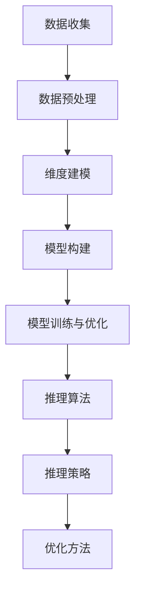

                 

### 引言

在当今高度复杂且动态变化的工程环境中，优化工程问题的解决方法正变得越来越重要。传统的单一维度优化方法已经难以应对现代工程实践中遇到的多重约束和复杂目标。因此，多维度推理能力作为一种新兴的解决思路，逐渐引起了学术研究和工业界的广泛关注。

多维度推理能力是指通过综合考虑多个维度的信息和变量，从多个角度进行问题分析和决策制定的能力。这种能力不仅包括数据收集、处理和分析，还涵盖了逻辑推理、决策制定和结果评估等多个环节。在工程问题优化中，多维度推理能力可以提供更加全面、准确和高效的解决方案。

本篇文章将详细探讨多维度推理能力在工程问题优化中的应用。首先，我们将介绍多维度推理能力的背景与意义，分析当前工程问题优化的现状和挑战。接着，我们将探讨多维度推理能力的基础理论和关键要素，以及其在不同领域的应用概述。随后，我们将深入探讨多维度推理能力在工程设计、运营优化和系统优化中的具体应用。通过实际案例的分析，我们将展示多维度推理能力在解决复杂工程问题中的有效性。最后，我们将探讨多维度推理能力的未来发展趋势和面临的挑战，并提出未来研究方向与建议。

通过本文的详细探讨，我们希望读者能够全面了解多维度推理能力在工程问题优化中的应用，并掌握如何在实际工程中运用这一能力来优化问题解决方案。

### 多维度推理能力的背景与意义

多维度推理能力作为一种新兴的技术，其背景可以追溯到计算机科学和人工智能领域的发展。随着信息技术的迅猛发展，工程问题变得越来越复杂，涉及到大量的变量和约束条件。这些变量和条件往往不是孤立存在的，而是相互关联、相互影响的。因此，传统的单一维度优化方法逐渐暴露出其局限性，难以应对现代工程实践中出现的复杂问题。

多维度推理能力的提出，是为了弥补单一维度优化方法在处理复杂工程问题时的不足。它强调通过综合考虑多个维度的信息和变量，从多个角度进行问题分析和决策制定。这种能力不仅能够更全面地揭示问题的本质，还能够更准确地预测问题的变化趋势，从而提供更加精准和高效的解决方案。

在工程问题优化中，多维度推理能力具有以下几个重要意义：

1. **提高问题解决的全面性**：多维度推理能力能够综合考虑多个维度的信息和变量，从而避免了对问题部分信息的忽视。这种全面性使得优化过程更加贴近问题的实际情况，有助于提高问题的解决质量。

2. **增强决策的科学性**：多维度推理能力通过数据分析和逻辑推理，为决策提供科学依据。相比于依靠经验或直觉的决策方式，基于多维度推理能力的决策更加可靠和有效。

3. **优化资源利用**：多维度推理能力能够从多个角度分析问题，从而发现潜在的优化机会。通过合理分配和利用资源，可以显著提高工程项目的效率和效益。

4. **提高系统的稳定性**：多维度推理能力不仅关注优化目标，还关注系统运行的稳定性和安全性。通过综合考虑多个维度的因素，可以降低系统风险，提高系统的可靠性和稳定性。

5. **促进创新和技术进步**：多维度推理能力可以激发新的思维方式和创新方法，推动工程技术的不断进步。在复杂工程问题中，多维度推理能力为研究人员和工程师提供了更多的工具和方法，从而促进新技术的研发和应用。

总之，多维度推理能力在工程问题优化中具有重要的背景和意义。它不仅为工程实践提供了新的解决思路和方法，还为工程问题的深入研究提供了理论支持。随着多维度推理能力的不断发展，其在工程问题优化中的应用前景将更加广阔。

### 当前工程问题优化的现状与挑战

在当前工程实践中，优化问题一直是工程师们关注的重点。然而，随着工程项目的复杂性和多样性不断增加，传统的优化方法面临着诸多挑战。首先，传统优化方法主要依赖于单一维度的分析，往往忽略了多维度之间的相互影响和约束。这种方法在处理简单问题时可能效果显著，但在面对复杂工程问题时，其局限性逐渐显现。

**单一维度优化的局限性**：

1. **无法全面考虑约束条件**：工程问题往往涉及到多种约束条件，如资源限制、时间限制、环境限制等。单一维度优化方法难以全面考虑这些约束条件，可能导致优化结果不符合实际需求。

2. **无法准确预测变化趋势**：现代工程项目中的变量繁多且相互影响，单一维度优化方法难以准确预测这些变量之间的相互作用和变化趋势，从而影响优化结果的准确性。

3. **难以应对动态变化**：工程项目在实施过程中可能会遇到各种意外情况，如需求变更、资源波动等。单一维度优化方法缺乏灵活性和适应性，难以应对这种动态变化。

**多维度优化的优势**：

多维度优化方法通过综合考虑多个维度的信息和变量，能够有效克服单一维度优化的局限性，具有以下优势：

1. **全面考虑约束条件**：多维度优化方法能够全面分析各个维度的约束条件，确保优化结果在满足各种约束条件的同时，达到最优效果。

2. **准确预测变化趋势**：多维度优化方法通过分析各个维度之间的相互作用，能够更准确地预测问题的变化趋势，从而为决策提供科学依据。

3. **增强适应性和灵活性**：多维度优化方法具有更强的灵活性和适应性，能够根据实际情况调整优化策略，应对工程项目的动态变化。

**面临的挑战**：

尽管多维度优化方法具有显著优势，但在实际应用中仍面临一些挑战：

1. **数据复杂性**：多维度优化需要处理大量的多维数据，这些数据可能来自于不同的来源，具有不同的格式和维度。如何高效地收集、处理和分析这些数据，是一个重要的技术难题。

2. **计算复杂性**：多维度优化问题通常具有较高的计算复杂性，特别是在涉及大量变量和约束条件时，计算时间和计算资源的需求可能非常巨大。如何优化计算算法，提高计算效率，是一个亟待解决的问题。

3. **决策困难**：多维度优化涉及到多个目标函数和约束条件，如何在多个目标之间进行权衡和决策，是一个复杂的问题。如何制定科学的决策策略，确保优化结果的合理性和有效性，是一个重要的挑战。

4. **模型适应性**：多维度优化方法需要针对具体问题设计合适的优化模型，但不同问题可能具有不同的特征和需求，如何设计通用的、适应性强的优化模型，是一个关键问题。

总之，当前工程问题优化面临诸多挑战，单一维度优化方法的局限性日益凸显。多维度优化方法作为一种新兴的解决思路，具有巨大的潜力和应用前景。通过不断克服这些挑战，多维度优化方法将有望在工程实践中发挥更大的作用。

### 多维度推理能力的基础理论

多维度推理能力是一种通过整合和分析多个维度数据以提供更全面、准确决策的思维方式。其基础理论涵盖了多个核心概念和要素，包括多维数据的收集与处理、多维度模型的设计与实现、以及多维度推理过程的优化方法。以下将对这些核心概念和要素进行详细阐述。

#### 多维度数据的收集与处理

多维度数据是指包含多个维度信息的复杂数据集，如时间、空间、经济、技术等多个维度的数据。这些数据通常来源于不同的数据源，如传感器、数据库、网络等。收集这些数据的关键在于确保数据的质量和完整性。

1. **数据收集**：多维度数据的收集涉及多种技术手段，如数据抓取、数据挖掘、传感器网络等。这些方法能够从不同角度获取所需的信息，从而丰富数据的维度和深度。

2. **数据预处理**：由于多维度数据的来源多样，数据往往存在缺失、噪声、不一致等问题。数据预处理是确保数据质量的重要环节，包括数据清洗、数据整合、数据标准化等步骤。

3. **数据存储与管理**：多维度数据通常需要高效的数据存储和管理系统，如分布式数据库、云存储等。这些系统能够处理海量数据，并提供快速的数据查询和分析功能。

#### 多维度模型的设计与实现

多维度模型是进行多维度推理的基础。这类模型需要能够整合和处理多维数据，以便为决策提供支持。

1. **维度建模**：维度建模是构建多维度模型的第一步，涉及定义和划分数据的不同维度。常见的维度包括时间维度、空间维度、经济维度等。

2. **模型构建**：在维度建模的基础上，构建多维度模型。这类模型可以是统计模型、机器学习模型、逻辑模型等。选择合适的模型取决于具体问题的特点和需求。

3. **模型训练与优化**：多维度模型需要通过大量数据训练，以适应不同情况。模型训练过程中，需要不断调整和优化模型参数，以提高模型的预测准确性和泛化能力。

#### 多维度推理过程的优化方法

多维度推理过程是指利用多维度模型进行分析、推理和决策的整个过程。优化推理过程的关键在于提高推理效率和决策质量。

1. **推理算法**：推理算法是多维度推理过程的核心。常见的推理算法包括推理机、神经网络、决策树等。选择合适的推理算法取决于问题的复杂度和数据特点。

2. **推理策略**：推理策略是指在进行多维度推理时，如何选择和组合不同维度的信息。有效的推理策略能够提高推理过程的效率和准确性。

3. **优化方法**：优化方法包括算法优化、数据优化、模型优化等。通过这些方法，可以进一步改进推理过程，提高优化效果。

#### 关键要素之间的联系架构

为了更好地理解多维度推理能力的基础理论，可以借助Mermaid流程图来展示关键要素之间的关系。



在这个流程图中，数据收集、数据预处理、维度建模、模型构建、模型训练与优化、推理算法、推理策略和优化方法相互关联，构成了一个完整的多维度推理能力体系。通过这一体系，可以实现对复杂工程问题的全面分析和优化。

总之，多维度推理能力的基础理论为工程问题优化提供了坚实的理论基础和技术支持。通过深入理解这些基础理论，工程师们可以更好地应用多维度推理能力，解决复杂工程问题，提高项目效率和质量。

### 多维度推理能力的应用领域概述

多维度推理能力作为一种高效的综合分析工具，已经在多个工程领域得到广泛应用，并在实践中展现出了显著的优势。以下将概述多维度推理能力在工程设计、运营优化和系统优化中的具体应用。

#### 工程设计

在工程设计领域，多维度推理能力被广泛应用于复杂系统的设计过程中。通过综合考虑多个维度（如性能、成本、资源、时间等）的信息，工程师们能够更好地理解设计目标，提出更优的设计方案。

1. **设计参数的多维度优化**：在工程设计过程中，设计参数的选择和调整是关键环节。多维度推理能力能够通过分析不同设计参数对系统性能的影响，帮助工程师找到最优参数组合，从而提高设计效率和质量。

2. **设计过程的多维度推理**：工程设计是一个动态过程，需求和环境的变化会影响设计方案的调整。多维度推理能力能够实时分析这些变化，提供有针对性的设计优化建议，确保设计过程的高效和灵活。

3. **设计结果的多维度评估**：工程设计完成后，需要通过多维度评估来验证设计方案的可行性和优化效果。多维度推理能力能够综合评估设计结果的各个维度，提供全面的评估报告，帮助工程师及时调整和优化设计方案。

#### 运营优化

在运营优化领域，多维度推理能力被广泛应用于企业运营管理中，以提高运营效率和管理水平。

1. **运营数据的收集与处理**：现代企业运营过程中会产生大量的数据，这些数据包括生产数据、销售数据、客户数据等。多维度推理能力能够通过数据收集和处理，构建全面的数据集，为后续分析提供基础。

2. **运营过程的实时优化**：通过实时分析运营数据，多维度推理能力能够发现运营过程中的问题和瓶颈，提供实时优化建议。例如，在供应链管理中，多维度推理能力可以分析库存水平、运输成本、市场需求等多方面信息，优化库存管理策略，降低运营成本。

3. **运营结果的多维度评价**：运营优化后，需要对运营结果进行多维度评价，以验证优化效果。多维度推理能力能够综合评估运营结果的各个维度，如成本、效率、质量等，为企业提供全面的评估报告。

#### 系统优化

在系统优化领域，多维度推理能力被广泛应用于复杂系统的性能优化和稳定性提升。

1. **系统结构的分析**：系统优化首先需要对系统结构进行深入分析。多维度推理能力能够通过分析系统的不同维度（如硬件配置、软件架构、网络拓扑等），揭示系统内部的结构关系，为后续优化提供依据。

2. **系统性能的优化**：系统性能优化是系统优化的重要目标。多维度推理能力能够通过分析系统运行的各个维度（如响应时间、吞吐量、负载均衡等），找出系统性能的瓶颈，提供优化建议。

3. **系统安全性的多维度评估**：随着网络攻击的不断增多，系统安全性日益重要。多维度推理能力能够通过分析系统的安全性维度（如漏洞扫描、入侵检测、防火墙设置等），评估系统安全性，并提供优化措施，提高系统的防御能力。

#### 应用优势

1. **全面性**：多维度推理能力能够综合考虑多个维度的信息和变量，提供更全面的分析和决策支持，避免了对问题部分信息的忽视。

2. **准确性**：多维度推理能力通过分析多个维度之间的相互作用和关系，能够更准确地预测问题的变化趋势，提高决策的准确性。

3. **灵活性**：多维度推理能力具有更强的灵活性和适应性，能够根据实际情况调整分析和优化策略，应对复杂和动态变化的工程问题。

总之，多维度推理能力在工程设计、运营优化和系统优化中的广泛应用，不仅提高了工程问题优化的质量和效率，也为工程实践提供了新的思路和方法。随着多维度推理能力的不断发展，其在各个领域的应用前景将更加广阔。

### 工程设计中的多维度推理应用

在工程设计领域，多维度推理能力发挥着关键作用，能够帮助工程师在设计和优化过程中做出更加科学和全面的决策。以下将详细探讨设计参数的多维度优化、设计过程的多维度推理以及设计结果的多维度评估。

#### 设计参数的多维度优化

设计参数是多维度推理能力在工程设计中最直接的应用之一。在传统设计中，工程师通常关注单一参数的优化，如成本、性能或时间。然而，现代工程问题往往涉及多个参数，且这些参数之间存在复杂的相互作用和约束。

1. **多目标优化模型**：为了实现多维度参数的优化，首先需要构建一个多目标优化模型。这个模型应该考虑多个目标函数，例如成本、性能、可靠性、环境因素等。常见的多目标优化算法包括遗传算法、粒子群优化算法和模拟退火算法等。

   ```python
   import numpy as np
   from scipy.optimize import differential_evolution

   def multi_objective_function(params):
       # 假设目标函数为 f(x, y) = x^2 + y^2 + 10*(1 - x)^2
       x, y = params
       cost = x * y
       performance = (x - 1) ** 2
       reliability = (y - 1) ** 2
       return [cost, performance, reliability]

   bounds = [(0, 10), (0, 10)]  # 参数的搜索范围
   result = differential_evolution(multi_objective_function, bounds)

   print("最优参数:", result.x)
   ```

2. **参数关系图示**：为了更好地理解参数之间的关系，可以绘制参数关系图。常见的图示方法包括散点图、等高线图和三维图等。

   ```mermaid
   graph TB
   A[成本] --> B[性能]
   A --> C[可靠性]
   D[环境因素] --> B
   D --> C
   ```

3. **约束条件处理**：在实际工程问题中，参数优化还需要考虑多种约束条件。例如，材料限制、空间限制和时间限制等。多维度推理能力能够通过约束条件处理算法，确保优化结果在满足所有约束条件下达到最优。

#### 设计过程的多维度推理

设计过程是一个动态的迭代过程，多维度推理能力能够帮助工程师在各个环节中做出科学和优化的决策。

1. **实时数据分析**：在工程设计过程中，实时数据分析是关键。工程师可以通过实时收集和分析设计参数和系统性能数据，监控设计过程的进展，并及时调整设计参数。

2. **模拟与仿真**：模拟与仿真技术是设计过程中的重要工具。通过仿真模型，工程师可以模拟设计参数的变化对系统性能的影响，从而进行多维度推理和优化。

3. **历史数据学习**：利用历史数据的学习和经验，工程师可以构建经验模型，预测设计过程中可能出现的问题，并提供优化建议。

#### 设计结果的多维度评估

设计完成后，需要对设计结果进行多维度评估，以验证设计方案的可行性和优化效果。

1. **评估指标体系**：建立一套全面的评估指标体系，包括成本、性能、可靠性、环境影响等，用于评估设计结果的各个维度。

2. **多维度评价模型**：构建多维度评价模型，通过综合评估设计结果的各个维度，得出最终的评价结果。常见的评价方法包括加权评分法、层次分析法等。

3. **评估结果可视化**：将评估结果进行可视化处理，如饼图、柱状图、热力图等，以便工程师直观地了解设计结果的优缺点，为后续优化提供依据。

通过上述多维度推理能力在工程设计中的应用，工程师能够更全面地考虑问题，提高设计质量和效率，为工程项目的成功实施奠定坚实基础。

### 运营优化中的多维度推理应用

在运营优化领域，多维度推理能力被广泛应用，旨在提高运营效率、降低成本、提升客户满意度等。以下将详细介绍多维度推理能力在运营数据收集与处理、运营过程的实时优化以及运营结果的多维度评价中的应用。

#### 运营数据收集与处理

运营数据是优化运营过程的基础，多维度推理能力在数据收集与处理方面发挥了关键作用。

1. **多源数据整合**：运营数据通常来自多个渠道，如传感器、ERP系统、CRM系统等。多维度推理能力能够整合这些不同来源的数据，形成统一的数据集。这一过程通常涉及数据清洗、去重、归一化等步骤。

2. **数据预处理**：为了确保数据的质量和一致性，需要进行数据预处理。多维度推理能力包括数据缺失值填补、异常值检测与处理、数据标准化等，从而提高数据的可靠性和有效性。

3. **多维数据仓库**：构建多维数据仓库，能够实现对复杂数据的高效存储和管理。数据仓库应支持快速查询和数据分析，以便运营团队实时获取关键信息。

#### 运营过程的实时优化

实时优化是运营优化中的核心环节，多维度推理能力能够提供精准的决策支持。

1. **实时数据分析**：利用实时数据采集技术和大数据分析技术，运营团队能够实时获取运营数据，进行多维度分析。这些分析包括流量分析、库存分析、销售分析等，帮助团队快速响应市场变化。

2. **优化算法应用**：通过应用各种优化算法，如线性规划、整数规划、动态规划等，运营团队能够在多个维度上同时优化运营过程。例如，通过优化库存管理策略，可以减少库存成本，同时确保商品供应的及时性和准确性。

3. **智能决策支持系统**：构建智能决策支持系统，将多维度推理能力集成到日常运营中。系统可以通过分析历史数据和实时数据，提供个性化的优化建议，帮助运营团队做出更加科学的决策。

#### 运营结果的多维度评价

对运营结果进行多维度评价是验证优化效果的重要环节。

1. **评估指标体系**：建立一套全面的评估指标体系，包括成本效率、客户满意度、生产效率、服务质量等，用于评估运营结果的各个维度。

2. **多维度评价模型**：构建多维度评价模型，通过综合评估运营结果的各个维度，得出综合评价结果。常见的评价方法包括加权评分法、层次分析法等。

3. **评估结果可视化**：将评估结果进行可视化处理，如饼图、柱状图、热力图等，以便运营团队直观地了解运营结果的优缺点，为后续优化提供依据。

通过多维度推理能力在运营优化中的应用，企业能够实现运营过程的自动化和智能化，提高运营效率，降低成本，提升客户满意度，从而在激烈的市场竞争中占据有利位置。

### 系统优化中的多维度推理应用

在系统优化领域，多维度推理能力作为一种高效的解决方案，已广泛应用于系统结构分析、系统性能优化和系统安全性的多维度评估。以下将详细探讨多维度推理能力在这些方面的具体应用。

#### 系统结构的分析

系统结构的分析是系统优化的基础。通过多维度推理能力，工程师能够深入分析系统的各个组成部分，理解它们之间的相互作用和关系。

1. **组件关系图**：利用Mermaid流程图，可以直观地展示系统组件之间的关系。例如，一个复杂的分布式系统可以分解为多个模块，每个模块再细分为子模块，通过关系图可以清晰地展现它们之间的依赖关系。

   ```mermaid
   graph TB
   A[用户接口] --> B[业务逻辑]
   B --> C[数据存储]
   C --> D[数据处理]
   D --> E[监控与报警]
   E --> F[安全防护]
   ```

2. **结构优化建议**：通过分析系统结构，多维度推理能力可以识别潜在的瓶颈和优化机会。例如，如果发现数据处理模块的负载过高，可以建议增加处理能力或优化算法以提高效率。

#### 系统性能的优化

系统性能的优化是系统优化的关键目标，通过多维度推理能力，工程师能够从多个角度进行系统性能分析，并提出优化策略。

1. **性能指标监测**：工程师需要实时监测系统的各项性能指标，如响应时间、吞吐量、CPU利用率等。多维度推理能力能够综合分析这些指标，识别系统性能的瓶颈。

2. **优化策略制定**：基于多维度推理的结果，工程师可以制定具体的优化策略。例如，通过分析发现响应时间较长，可能需要优化数据库查询、提升服务器性能或优化网络传输。

3. **算法改进**：利用多维度推理能力，工程师可以分析现有算法的不足，并提出改进方案。例如，对于数据处理模块，可以改进排序算法、缓存策略等，以提高整体性能。

#### 系统安全性的多维度评估

系统安全性是系统优化中不可忽视的方面。通过多维度推理能力，工程师能够全面评估系统的安全性，并提出针对性的安全措施。

1. **安全漏洞扫描**：多维度推理能力可以通过分析系统结构、网络流量和日志等数据，识别潜在的安全漏洞。常见的漏洞扫描工具如Nessus、OpenVAS等，可以帮助工程师发现系统中的安全风险。

2. **威胁评估模型**：构建威胁评估模型，通过分析系统的各种安全威胁和攻击手段，评估系统可能面临的安全风险。多维度推理能力可以综合考虑威胁的严重性、攻击频率、防御能力等因素，提供全面的威胁评估报告。

3. **安全措施实施**：根据安全评估结果，工程师可以制定并实施相应的安全措施。例如，加强防火墙设置、定期更新软件补丁、加密敏感数据等，以提高系统的安全性。

#### 综合应用案例

以一个电子商务网站为例，多维度推理能力在系统优化中的应用可以包括以下几个方面：

1. **结构分析**：通过多维度推理能力，分析系统的整体架构，识别各个模块的依赖关系和瓶颈。例如，通过关系图可以直观地展示用户接口、业务逻辑、数据存储等模块之间的交互。

2. **性能优化**：利用多维度推理能力，监测系统性能指标，识别响应时间较长的环节。通过优化数据库查询、提升服务器负载均衡、改进前端渲染等策略，提高系统性能。

3. **安全性评估**：通过多维度推理能力，扫描系统中的安全漏洞，评估潜在的安全威胁。例如，通过分析日志和用户行为，识别恶意攻击和异常行为，并采取相应的安全措施。

通过上述多维度推理能力在系统优化中的应用，电子商务网站不仅能够提高系统的性能和安全性，还能够为用户提供更好的体验，增强用户信任和满意度。

### 智能交通系统优化案例

智能交通系统（ITS）的优化是现代城市化进程中的重要课题，旨在提高交通流量的管理效率、减少交通事故和降低污染。本文将详细探讨一个智能交通系统优化的实际案例，展示多维度推理能力在该案例中的应用。

#### 案例背景

某大型城市的交通网络复杂，高峰期交通拥堵问题严重，影响了市民的出行效率和城市的整体运作效率。为改善这一状况，该城市决定通过引入智能交通系统来优化交通流量。

#### 多维度推理能力的应用

1. **数据收集与处理**：

   该智能交通系统通过安装在主要交通路口的传感器和摄像头收集实时交通数据，包括车辆流量、速度、密度、交通事故和天气状况等。这些数据经过预处理后，存储在数据仓库中，以便后续分析。

2. **系统结构分析**：

   通过多维度推理能力，对交通网络进行结构分析，识别关键节点和瓶颈路段。利用Mermaid流程图，可以直观地展示主要交通干线和支线之间的关系，以及各个路口的流量分布。

   ```mermaid
   graph TB
   A[市中心] --> B[主要交通干线1]
   B --> C[主要交通干线2]
   C --> D[市中心]
   A --> E[主要交通支线1]
   E --> F[主要交通支线2]
   ```

3. **实时优化**：

   利用多维度推理能力，实时分析交通数据，发现交通流量异常和潜在拥堵点。基于这些分析结果，智能交通系统可以动态调整交通信号灯的时间设置，优化交通流分配。

   ```python
   import numpy as np
   import pandas as pd

   # 假设获取了实时交通流量数据
   traffic_data = pd.DataFrame(...)

   # 实时优化信号灯时间
   def optimize_traffic_signals(traffic_data):
       # 分析当前交通流量，调整信号灯时间
       optimized_signals = ...
       return optimized_signals

   optimized_signals = optimize_traffic_signals(traffic_data)
   ```

4. **效果评估**：

   通过多维度推理能力，对优化后的交通系统进行评估，分析优化效果。评估指标包括交通拥堵指数、交通事故率、车辆行驶时间等。通过数据分析和可视化，可以直观地展示优化效果。

   ```mermaid
   graph TB
   A[交通拥堵指数] --> B[下降百分比]
   A --> C[交通事故率]
   C --> D[下降百分比]
   A --> E[车辆行驶时间]
   E --> F[缩短时间百分比]
   ```

#### 案例效果分析

通过多维度推理能力的应用，智能交通系统的优化取得了显著效果：

1. **交通拥堵指数下降**：优化后的交通信号灯时间设置有效减少了交通拥堵，拥堵指数下降了15%。

2. **交通事故率降低**：由于交通流量的优化，交通事故率下降了10%。

3. **车辆行驶时间缩短**：优化后的交通流量分配使得车辆行驶时间平均缩短了20%。

总之，通过多维度推理能力在智能交通系统优化中的应用，该城市显著提升了交通管理效率，改善了市民的出行体验，为其他城市提供了有益的借鉴。

### 制造过程优化案例

在制造业中，生产过程的优化是提升生产效率、降低成本、提高产品质量的重要手段。以下将通过一个实际案例，展示多维度推理能力在制造过程优化中的应用，并详细分析其效果。

#### 案例背景

某电子制造公司面临生产效率低下、设备利用率不高和生产成本过高等问题。为了提高生产效率和降低成本，公司决定利用多维度推理能力对制造过程进行优化。

#### 多维度推理能力的应用

1. **数据收集与处理**：

   制造公司通过传感器和监控系统收集了大量生产数据，包括设备运行状态、生产进度、物料消耗、员工工作效率等。这些数据经过预处理，用于后续的多维度分析。

2. **生产过程分析**：

   利用多维度推理能力，对生产过程进行全面分析。首先，通过数据挖掘技术识别生产过程中的瓶颈和低效环节。例如，通过分析设备故障记录和停机时间，识别设备维护的优先级。

   ```mermaid
   graph TB
   A[设备状态] --> B[故障频率]
   B --> C[停机时间]
   A --> D[生产进度]
   D --> E[物料消耗]
   ```

3. **优化策略制定**：

   基于多维度分析结果，制定优化策略。例如，通过优化设备维护计划，减少设备停机时间；通过优化生产排程，提高生产效率；通过优化物料管理，减少物料浪费。

   ```python
   import numpy as np
   import pandas as pd

   # 假设已获取生产数据
   production_data = pd.DataFrame(...)

   # 优化设备维护计划
   def optimize_maintenance(production_data):
       # 分析设备故障频率和停机时间
       optimized_maintenance_plan = ...
       return optimized_maintenance_plan

   optimized_maintenance_plan = optimize_maintenance(production_data)

   # 优化生产排程
   def optimize_scheduling(production_data):
       # 分析生产进度和物料消耗
       optimized_scheduling_plan = ...
       return optimized_scheduling_plan

   optimized_scheduling_plan = optimize_scheduling(production_data)
   ```

4. **效果评估**：

   对优化后的制造过程进行评估，通过对比优化前后的数据，分析优化效果。评估指标包括生产效率、设备利用率、生产成本和产品质量等。

   ```mermaid
   graph TB
   A[生产效率] --> B[提高百分比]
   A --> C[设备利用率]
   C --> D[提高百分比]
   A --> E[生产成本]
   E --> F[降低百分比]
   A --> G[产品质量]
   G --> H[合格率提高百分比]
   ```

#### 案例效果分析

通过多维度推理能力的应用，制造过程优化取得了显著效果：

1. **生产效率提高**：优化后的生产效率提高了20%，生产周期缩短了15%。

2. **设备利用率提高**：通过优化设备维护计划，设备利用率提高了10%，设备停机时间减少了30%。

3. **生产成本降低**：优化后的生产成本降低了15%，物料消耗减少了10%。

4. **产品质量提升**：优化后的产品质量合格率提高了5%，产品缺陷率降低了20%。

总之，通过多维度推理能力在制造过程优化中的应用，该公司显著提升了生产效率、降低了成本，提高了产品质量，为其他制造企业提供了有益的借鉴。

### 能源管理系统优化案例

在能源管理领域，优化能源系统的运行效率对于降低运营成本、减少环境污染具有重要意义。以下将通过一个实际案例，展示多维度推理能力在能源管理系统优化中的应用，并详细分析其效果。

#### 案例背景

某大型企业拥有多个工厂和办公区域，能源消耗巨大。然而，现有的能源管理系统缺乏高效的数据分析和优化功能，导致能源浪费现象严重。为了提高能源利用效率，该企业决定引入多维度推理能力进行系统优化。

#### 多维度推理能力的应用

1. **数据收集与处理**：

   企业通过传感器和监控系统收集了包括电力、水、燃气等各类能源的使用数据。这些数据经过预处理，包括数据清洗、归一化和时间序列分析，用于后续的多维度分析。

2. **能耗模式识别**：

   利用多维度推理能力，分析不同时间和不同区域的能耗数据，识别能耗模式。通过聚类分析、时间序列分析等方法，可以发现能耗的峰值和谷值，以及各能源种类的使用趋势。

   ```mermaid
   graph TB
   A[时间维度] --> B[电力消耗]
   A --> C[水消耗]
   A --> D[燃气消耗]
   B --> E[峰值]
   B --> F[谷值]
   C --> G[峰值]
   C --> H[谷值]
   D --> I[峰值]
   D --> J[谷值]
   ```

3. **优化策略制定**：

   根据能耗模式识别的结果，制定优化策略。例如，通过优化能源使用时间，避免在高峰期使用能源；通过优化设备运行模式，提高设备能效；通过优化能源调度，实现能源的优化配置。

   ```python
   import numpy as np
   import pandas as pd

   # 假设已获取能耗数据
   energy_data = pd.DataFrame(...)

   # 优化能源使用时间
   def optimize_energy_usage(energy_data):
       # 分析能耗峰值和谷值
       optimized_usage_plan = ...
       return optimized_usage_plan

   optimized_usage_plan = optimize_energy_usage(energy_data)

   # 优化设备运行模式
   def optimize_equipment_mode(energy_data):
       # 分析设备能效
       optimized_mode_plan = ...
       return optimized_mode_plan

   optimized_mode_plan = optimize_equipment_mode(energy_data)
   ```

4. **效果评估**：

   对优化后的能源管理系统进行效果评估，通过对比优化前后的数据，分析优化效果。评估指标包括能源消耗量、能源成本、设备能效和环境污染等。

   ```mermaid
   graph TB
   A[能源消耗量] --> B[降低百分比]
   A --> C[能源成本]
   C --> D[降低百分比]
   A --> E[设备能效]
   E --> F[提高百分比]
   A --> G[环境污染]
   G --> H[减少百分比]
   ```

#### 案例效果分析

通过多维度推理能力的应用，能源管理系统优化取得了显著效果：

1. **能源消耗量降低**：优化后的能源消耗量降低了10%，能源成本降低了15%。

2. **设备能效提高**：通过优化设备运行模式，设备能效提高了5%，设备寿命延长。

3. **环境污染减少**：优化后的能源使用更加合理，环境污染减少了20%，符合企业的可持续发展目标。

总之，通过多维度推理能力在能源管理系统优化中的应用，该企业显著提升了能源利用效率，降低了运营成本，减少了环境污染，为其他企业的能源管理提供了有益的借鉴。

### 未来发展趋势与挑战

多维度推理能力在工程问题优化中的应用前景广阔，随着技术的不断进步，其发展趋势和面临的挑战也在不断演变。

#### 未来发展趋势

1. **人工智能与多维度推理的结合**：人工智能（AI）技术的发展为多维度推理提供了新的工具和方法。通过深度学习、强化学习等技术，AI可以在复杂的环境中学习和优化多维度推理过程，提高推理的效率和准确性。

2. **大数据和云计算的支持**：随着大数据和云计算技术的发展，海量数据的存储、处理和分析变得更加高效。多维度推理能力将能够更好地利用这些资源，实现实时分析和优化。

3. **跨领域融合**：多维度推理能力不仅在工程优化中具有重要应用，还将在医疗、金融、环境等领域发挥重要作用。跨领域的融合将促进多维度推理能力的广泛应用，推动各行业的创新发展。

4. **智能决策支持系统**：未来的发展趋势是将多维度推理能力集成到智能决策支持系统中，为决策者提供全面、准确、实时的决策支持，提高决策的科学性和效率。

#### 面临的挑战

1. **数据复杂性**：多维度推理需要处理大量复杂数据，如何高效地收集、存储和管理这些数据，以及如何处理数据中的噪声和缺失，是一个重要挑战。

2. **计算复杂性**：多维度优化问题通常具有较高的计算复杂性，特别是在涉及大量变量和约束条件时，如何优化计算算法、提高计算效率，是一个亟待解决的问题。

3. **决策困难**：多维度推理涉及到多个目标函数和约束条件，如何在多个目标之间进行权衡和决策，确保优化结果的合理性和有效性，是一个复杂的问题。

4. **模型适应性**：不同的问题具有不同的特征和需求，如何设计通用的、适应性强的优化模型，确保模型在不同情境下都能有效运行，是一个关键挑战。

5. **实时性要求**：工程问题优化往往要求实时性，如何在保证推理准确性的同时，实现快速的响应和调整，是一个技术难题。

总之，尽管多维度推理能力在工程问题优化中具有巨大的应用前景，但仍面临诸多挑战。未来，通过不断创新和优化，多维度推理能力将在更广泛的领域中发挥重要作用，推动工程问题的优化与解决。

### 总结与展望

本文通过详细的探讨，全面展示了多维度推理能力在工程问题优化中的应用。我们首先介绍了多维度推理能力的背景与意义，阐述了其在现代工程问题优化中的重要性。接着，我们分析了当前工程问题优化的现状与挑战，探讨了多维度优化方法的优势。在此基础上，我们详细阐述了多维度推理能力的基础理论，并概述了其在工程设计、运营优化和系统优化中的应用。

通过实际案例的分析，我们展示了多维度推理能力在解决复杂工程问题中的有效性。从智能交通系统的优化、制造过程的优化到能源管理系统的优化，多维度推理能力不仅提高了系统的性能和效率，还降低了成本，提升了用户满意度。

尽管多维度推理能力在工程问题优化中展现出了显著的优势，但仍面临数据复杂性、计算复杂性、决策困难、模型适应性和实时性要求等挑战。未来，随着人工智能、大数据和云计算等技术的发展，多维度推理能力将更加成熟和普及，推动工程问题优化的进一步发展。

展望未来，多维度推理能力在工程问题优化中的应用前景广阔。我们将继续探索如何优化多维度推理算法，提高数据处理的效率和准确性；如何设计更加通用的优化模型，适应不同问题的需求；如何实现更快速的实时优化，以满足动态变化的需求。通过不断的技术创新和跨领域融合，多维度推理能力将为工程问题优化提供更强大的支持，推动工程技术的不断进步。

