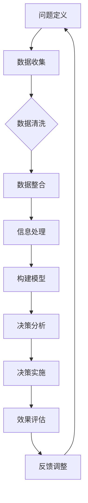

                 

### 背景介绍

在当今信息化、全球化的时代，决策制定变得日益复杂。复杂决策问题通常涉及多个相互关联的变量，这些变量之间的关系往往是非线性、动态变化的。传统单维度的决策分析方法，如线性规划、博弈论等，往往难以应对这样的复杂情境。为了更准确地分析和制定复杂决策，我们需要引入更加综合和多元的决策模型。

多角度推理能力是一种系统性、全面性的决策思维方式，它能够从多个不同的视角对问题进行解析和综合评估。这种能力不仅能够帮助决策者更全面地理解问题的本质，还能提高决策的准确性和有效性。多角度推理能力的核心在于能够同时考虑多个因素，从而避免因为单一视角导致的偏差和误解。

在商业决策、政策制定和社会管理等领域，复杂决策问题层出不穷。商业决策需要综合考虑市场趋势、消费者行为、竞争态势等多方面因素；政策制定则需要平衡不同利益群体的需求，同时考虑到经济、社会、环境等多重影响；社会管理面临的问题则更为复杂，需要考虑人口结构、资源分配、公共服务等多维因素。

然而，复杂决策问题往往伴随着大量的不确定性和信息不对称，这给多角度推理能力的应用提出了挑战。如何在有限的资源下，高效地收集、处理和分析大量信息，并在此基础上做出高质量的决策，是现代决策制定面临的一大难题。

本博客旨在探讨多角度推理能力在复杂决策中的应用。我们将首先介绍复杂决策的定义与特征，然后详细阐述多角度推理能力的概念及其在决策中的应用价值。随后，我们将深入探讨多角度推理能力的理论基础，包括推理能力的定义与分类、多角度推理的基本原理以及现有研究进展。接下来，我们将分析多角度推理能力的核心要素，如数据来源与数据质量、信息整合与处理、决策模型与算法选择等。随后几章将分别探讨多角度推理能力在商业决策、政策制定和社会管理中的应用，并结合具体案例进行分析。最后，我们将讨论多角度推理能力的现状与挑战，并提出未来发展策略。

通过本文的探讨，我们希望能够为读者提供一种更加全面、系统的决策思维方式，帮助他们在面对复杂决策问题时，能够更有效地运用多角度推理能力，做出更加明智的决策。

### 复杂决策的定义与特征

复杂决策，是指在决策过程中需要考虑多个相互关联的变量，这些变量之间可能存在复杂的非线性关系，同时决策者面临的不确定性因素较多。与简单决策不同，复杂决策通常不满足传统决策模型假设中的某些条件，如线性关系、确定性等。以下是复杂决策的一些主要特征：

首先，复杂决策具有高度的不确定性。在复杂决策问题中，决策者往往无法准确预测未来的变化，这导致决策过程中存在大量不确定因素。例如，在商业决策中，市场需求、竞争态势、政策变化等都是不可控因素，这些因素的变化会对决策结果产生重大影响。

其次，复杂决策涉及多个相互依赖的变量。在复杂决策问题中，不同的变量之间存在复杂的相互作用和相互影响，这使得决策问题更加难以处理。例如，在政策制定中，经济、社会、环境等各方面因素相互交织，任何单一变量的改变都会对其他变量产生连锁反应。

第三，复杂决策通常需要考虑多个目标。在复杂决策情境中，决策者需要同时追求多个目标，这些目标之间可能存在冲突和矛盾。例如，在商业决策中，企业可能需要在利润最大化、市场份额扩大、风险控制等多个目标之间进行权衡和取舍。

第四，复杂决策问题往往具有动态性。在复杂决策过程中，时间和情境的变化会导致问题的动态性，这要求决策者在决策过程中持续调整和优化策略。例如，在金融市场中，市场动态变化迅速，投资者需要不断调整投资组合以应对市场变化。

为了更好地理解复杂决策，我们可以通过以下例子进行说明：

**商业案例**：某公司计划推出一款新产品，决策者需要考虑多个因素，如市场需求、生产成本、营销策略、竞争态势等。市场需求的不确定性、生产成本的变化、竞争对手的策略调整等，都会影响产品的销售前景和公司收益。为了制定出最佳决策，决策者需要从多个角度进行全面分析，如通过市场调研收集数据、分析竞争对手的行为、评估自身资源等。

**政策案例**：政府在制定某项政策时，需要综合考虑经济、社会、环境等多方面的影响。例如，政府在制定环境保护政策时，需要评估政策对经济增长、社会就业、环境保护等多方面的影响，这些因素之间可能存在复杂的相互作用和权衡。政策制定者需要通过多角度推理，综合考虑不同利益群体的需求和期望，制定出符合整体利益的公共政策。

**社会管理案例**：在社会管理中，决策者需要考虑人口结构、资源分配、公共服务等多重因素。例如，在城市规划中，决策者需要评估人口增长、交通拥堵、住房需求等多方面因素，并制定相应的政策来优化资源配置和提升居民生活质量。

综上所述，复杂决策具有高度不确定性、多变量、多目标、动态性等特征。为了应对这些挑战，决策者需要运用多角度推理能力，从不同角度全面分析问题，综合考虑各种因素，从而制定出更加科学和有效的决策方案。

### 多角度推理能力的概念

多角度推理能力，是指通过从多个不同视角对问题进行分析和评估的能力。这种能力强调在决策过程中，不仅仅依赖单一视角或数据源，而是综合利用多种信息源、视角和方法，从而获得更全面、准确的理解和判断。多角度推理能力是一种系统性、综合性的思维方式，它有助于提升决策的科学性、准确性和有效性。

首先，多角度推理能力的核心在于“多角度”。这意味着在分析和决策时，需要考虑到问题的不同方面，如经济、社会、环境、技术等，以及不同利益相关者的需求和期望。通过多角度的分析，决策者可以更全面地理解问题的复杂性，避免因为单一视角导致的偏见和盲点。

其次，多角度推理能力强调综合性和系统性。在复杂决策中，各变量之间往往存在复杂的相互作用和依赖关系，单一视角的分析难以捕捉这些关系。多角度推理能力通过综合不同角度的信息，形成一个全面的分析框架，有助于更准确地评估问题的全貌和潜在影响。

多角度推理能力的应用价值体现在多个方面。首先，它能够提高决策的准确性和可靠性。通过从多个角度分析问题，决策者可以更全面地了解问题的各个方面，减少信息缺失和不确定性，从而做出更为精准的决策。其次，多角度推理能力有助于提高决策的全面性和科学性。在复杂决策中，多个目标和变量之间可能存在冲突和权衡，多角度的分析可以更全面地考虑这些因素，帮助决策者找到最佳平衡点。最后，多角度推理能力能够增强决策的适应性和灵活性。在动态变化的环境中，决策者需要能够快速调整策略，多角度的分析可以帮助决策者更灵活地应对变化，提高决策的适应能力。

总之，多角度推理能力是一种重要的决策思维方式，它通过综合不同角度的信息，帮助决策者更全面、准确地理解问题，提高决策的准确性和有效性。在复杂决策中，多角度推理能力的应用价值尤为显著，它不仅能够提高决策的科学性，还能够增强决策的适应性和灵活性，为决策者提供更有力的支持。

### 多角度推理能力在复杂决策中的应用价值

多角度推理能力在复杂决策中的应用价值不可忽视。通过从多个不同视角对问题进行分析和评估，多角度推理能力能够显著提高决策的科学性、准确性和全面性。以下将详细探讨多角度推理能力在复杂决策中的应用价值。

首先，多角度推理能力有助于提高决策的准确性。在复杂决策中，信息通常是不完全和不确定的，单一视角的分析难以捕捉问题的全貌，容易导致偏差和错误。通过多角度的分析，决策者能够整合不同来源的信息，减少信息缺失，从而提高决策的准确性。例如，在商业决策中，通过市场调研、财务分析、竞争对手分析等多角度的数据收集和分析，企业可以更全面地了解市场动态和竞争态势，从而做出更准确的营销策略和产品规划。

其次，多角度推理能力能够增强决策的科学性。复杂决策问题往往涉及多个变量和目标，这些变量和目标之间可能存在复杂的相互作用和权衡。多角度推理能力通过综合考虑这些因素，构建一个全面的分析框架，有助于更科学地评估问题的各个方面，提高决策的科学性。例如，在政策制定过程中，通过经济、社会、环境等多个角度的分析，政策制定者可以更全面地评估政策对各方面的影响，从而制定出更科学、合理的政策。

第三，多角度推理能力有助于提高决策的全面性。复杂决策问题通常涉及多个利益相关者，他们的需求和期望可能存在冲突和矛盾。通过多角度推理能力，决策者可以综合考虑不同利益相关者的需求和期望，找到最佳平衡点，提高决策的全面性。例如，在工程项目决策中，需要考虑到经济成本、社会影响、环境影响等多方面因素，通过多角度的分析，决策者可以找到满足各方面需求的最佳方案。

此外，多角度推理能力还能够增强决策的适应性和灵活性。在动态变化的环境中，决策者需要能够快速调整策略以应对变化。通过多角度的分析，决策者可以更灵活地应对变化，提高决策的适应能力。例如，在金融市场决策中，通过多角度分析市场动态、政策变化、经济指标等，投资者可以更灵活地调整投资策略，以应对市场变化。

最后，多角度推理能力有助于降低决策风险。在复杂决策中，风险是不可避免的，但通过多角度的分析，决策者可以更全面地评估风险，并制定相应的风险应对策略。例如，在商业投资决策中，通过市场调研、风险评估、财务分析等多角度的分析，企业可以更全面地评估项目的风险，从而制定出更有效的风险控制措施。

总之，多角度推理能力在复杂决策中的应用价值体现在多个方面：提高决策的准确性、科学性、全面性、适应性和灵活性，同时降低决策风险。通过多角度的分析，决策者可以更全面、准确地理解问题，制定出更明智、更有效的决策方案。在日益复杂和不确定的环境中，多角度推理能力的重要性愈发凸显，它将成为决策者的重要工具和思维武器。

### 多角度推理能力的理论基础

多角度推理能力作为复杂决策中的重要工具，其理论基础涵盖了推理能力的定义与分类、多角度推理的基本原理以及相关模型的研究进展。通过深入探讨这些理论基础，我们可以更好地理解多角度推理能力在决策过程中的应用和优势。

首先，我们需要明确推理能力的定义与分类。推理能力是指个体在处理信息和解决问题时，通过逻辑思考和判断，得出结论或发现解决方案的能力。推理能力可以分为多种类型，如演绎推理、归纳推理、类比推理等。演绎推理是从一般原则推导出特定结论的过程，具有严格性和确定性；归纳推理是从具体实例中归纳出一般规律或结论，具有较强的概括性和扩展性；类比推理则是通过比较两个或多个相似情境，推断出新的结论或解决方案。

多角度推理能力的核心在于综合考虑多个不同的视角和因素，从而提高决策的全面性和准确性。这种能力的理论基础可以追溯到哲学、心理学和计算机科学等多个领域。在哲学中，多角度推理能力体现了康德所说的“批判性思维”，即通过质疑、分析和综合，从多个角度审视问题，以发现潜在的偏见和谬误。在心理学中，多角度推理能力与问题解决能力、创造力密切相关，研究者们通过实验和实证研究，探讨了个体在不同情境下的推理能力和决策风格。

在计算机科学领域，多角度推理能力得到了广泛的研究和应用。人工智能领域的研究者致力于开发各种算法和模型，以模拟和增强人类的多角度推理能力。这些算法和模型包括基于规则的推理系统、模糊逻辑、神经网络、多目标优化算法等。例如，基于规则的推理系统能够通过定义一系列规则，模拟专家的推理过程，从而在医疗诊断、金融分析等领域发挥作用；模糊逻辑则通过处理不确定性和模糊性，提高推理的灵活性和适应性；神经网络通过学习和模拟人脑的神经元结构，能够从大量数据中自动提取特征和模式，实现复杂的推理任务；多目标优化算法则能够同时考虑多个目标，优化决策方案。

多角度推理模型的研究进展主要集中在以下几个方面：

1. **多目标优化模型**：多目标优化模型旨在同时优化多个相互冲突的目标，以找到最优或近似最优的解决方案。这类模型广泛应用于资源分配、供应链管理、金融投资等领域。常见的多目标优化算法包括遗传算法、粒子群优化算法、多目标规划算法等。

2. **模糊推理模型**：模糊逻辑能够处理不确定性和模糊性，通过定义模糊集合和模糊规则，实现多角度的推理。模糊推理模型在决策支持系统、智能交通管理、环境监测等领域有广泛应用。

3. **基于知识的推理模型**：这类模型通过利用专家知识和经验，构建知识库和推理规则，实现复杂的决策过程。知识图谱、本体论、语义网等技术为构建基于知识的推理模型提供了有力支持。

4. **混合推理模型**：混合推理模型结合了不同类型的推理方法，如基于规则的推理和基于案例的推理，以提高推理的灵活性和适应性。这类模型在医疗诊断、法律咨询、复杂系统分析等领域有重要应用。

在实际应用中，多角度推理能力的关键在于如何有效地整合和分析不同角度的信息。以下是一个简单的多角度推理模型示例：

1. **数据收集**：从多个数据源收集信息，如市场调查数据、财务报表、用户反馈等。

2. **数据预处理**：对收集到的数据进行清洗、整合和标准化，确保数据质量。

3. **多角度分析**：从不同视角对数据进行综合分析，如经济视角、社会视角、环境视角等。

4. **模型构建**：基于多角度分析结果，构建相应的数学模型或算法，如线性回归模型、决策树模型、神经网络模型等。

5. **决策制定**：利用模型进行决策模拟和评估，结合专家经验和实际情境，制定最终决策方案。

6. **效果评估**：实施决策方案，并对其进行监控和评估，根据反馈进行调整和优化。

通过上述多角度推理模型的应用，决策者能够更全面、准确地理解问题，制定出科学、有效的决策方案，从而提高决策的质量和成功率。未来，随着人工智能和大数据技术的发展，多角度推理能力将继续得到深化和应用，为复杂决策提供更加有力的支持。

### 多角度推理能力的核心要素

多角度推理能力在复杂决策中得以有效应用，依赖于其核心要素的协调与整合。这些核心要素主要包括数据来源与数据质量、信息整合与处理、决策模型与算法选择。以下将详细探讨这些要素及其在多角度推理能力中的关键作用。

#### 数据来源与数据质量

数据是多角度推理能力的基石。有效的数据来源能够为推理过程提供丰富的信息支持，而数据质量则直接影响到推理结果的准确性和可靠性。以下是关于数据来源与数据质量的一些关键点：

1. **数据多样性**：多角度推理能力依赖于多样化的数据来源，包括但不限于市场调研、财务报表、用户反馈、历史数据等。多样化的数据来源有助于从不同视角全面了解问题，从而提高推理的全面性和准确性。

2. **数据可靠性**：数据可靠性是保证推理结果准确性的关键。高可靠性的数据能够减少错误信息对推理过程的影响，提高决策的信任度。确保数据可靠性可以通过数据验证、数据清洗和交叉验证等手段实现。

3. **数据质量**：数据质量包括数据的完整性、一致性、准确性和时效性。高质量的数据能够确保推理过程的顺利进行，减少因数据问题导致的偏差和错误。数据质量管理是数据收集和处理过程中必不可少的一环。

#### 信息整合与处理

信息整合与处理是多角度推理能力中的关键步骤，其目标是将收集到的数据转化为有用的信息，并对其进行综合分析。以下是信息整合与处理的一些关键点：

1. **数据清洗与预处理**：在整合数据之前，需要对数据进行清洗和预处理，以消除数据中的错误、缺失和噪声。数据清洗和预处理包括数据格式转换、缺失值填充、异常值处理等，以确保数据的完整性和一致性。

2. **特征工程**：特征工程是将原始数据转化为适用于模型分析和预测的特征集合的过程。通过选择和构建有效的特征，可以提高模型的性能和预测能力。特征工程包括特征选择、特征变换和特征组合等。

3. **信息综合分析**：在信息整合与处理阶段，需要对不同来源的数据进行综合分析，挖掘数据之间的关联性和规律性。这可以通过统计分析、数据挖掘和机器学习算法实现。综合分析有助于揭示问题的本质和内在联系，为决策提供有力支持。

#### 决策模型与算法选择

决策模型与算法的选择直接影响多角度推理能力的效果和应用范围。以下是关于决策模型与算法选择的一些关键点：

1. **多目标优化模型**：多目标优化模型能够同时考虑多个目标，找到在多个目标之间实现平衡的解决方案。这类模型适用于资源分配、项目规划、供应链管理等复杂决策问题。常见的多目标优化算法包括遗传算法、粒子群优化算法、多目标规划算法等。

2. **机器学习模型**：机器学习模型通过从数据中学习规律和模式，实现自动化的决策预测和分类。常见的机器学习算法包括线性回归、决策树、支持向量机、神经网络等。这些算法能够从大规模数据中提取有用信息，提高决策的准确性和效率。

3. **模糊推理模型**：模糊逻辑能够处理不确定性和模糊性，通过定义模糊规则和模糊集合，实现灵活的推理和决策。这类模型适用于处理具有模糊性和不确定性的复杂问题，如智能交通管理、环境监测等。

4. **混合推理模型**：混合推理模型结合了不同类型的推理方法和算法，以实现更灵活和高效的决策。这类模型适用于处理复杂和多变的决策问题，如金融风险管理、医疗诊断等。

#### 综合应用

在实际应用中，这些核心要素通常是相互交织和协同作用的。以下是一个简单的应用流程示例：

1. **数据收集**：从多个渠道收集数据，如市场调研、财务报表、用户反馈等。

2. **数据清洗与预处理**：对收集到的数据进行清洗和预处理，确保数据质量。

3. **特征工程**：选择和构建有效的特征，进行特征工程处理。

4. **信息整合与处理**：综合不同来源的数据，进行信息整合和综合分析。

5. **模型选择与训练**：选择合适的决策模型和算法，对数据集进行训练和调优。

6. **决策制定**：利用训练好的模型进行决策模拟和评估，制定决策方案。

7. **效果评估与反馈**：实施决策方案，进行效果评估，根据反馈进行调整和优化。

通过上述流程，多角度推理能力能够有效地整合和分析不同来源的数据，提高决策的科学性和准确性，为复杂决策提供有力支持。

综上所述，多角度推理能力的核心要素包括数据来源与数据质量、信息整合与处理、决策模型与算法选择。这些要素相互依赖，协同作用，共同构成一个完整的推理过程。通过合理应用这些核心要素，决策者可以更全面、准确地理解和分析复杂决策问题，制定出更科学、有效的决策方案。

### 多角度推理能力在商业决策中的应用

在商业环境中，多角度推理能力是制定科学决策的重要工具。通过综合考虑市场、财务、竞争对手等多方面因素，企业可以更准确地评估市场机会和风险，从而制定出符合实际且具有前瞻性的战略。以下将详细探讨多角度推理能力在商业决策中的应用，并结合具体实例进行分析。

#### 商业决策中的多角度分析

商业决策涉及多个关键因素，这些因素相互关联、相互作用。多角度分析能够帮助决策者全面评估这些因素，从而做出更明智的决策。以下是商业决策中常见的几个关键角度：

1. **市场角度**：市场角度关注市场需求、消费者行为和竞争态势。通过市场调研和分析，企业可以了解目标市场的规模、增长趋势、消费者需求特征等，从而制定合适的市场进入策略、产品定位和市场推广计划。

2. **财务角度**：财务角度关注企业的财务状况、盈利能力、资金流动性和财务风险。通过财务分析，企业可以评估不同决策对财务表现的影响，优化资源配置，降低财务风险。

3. **竞争对手角度**：竞争对手角度关注企业竞争对手的动态、策略和优势。通过竞争对手分析，企业可以了解竞争环境，发现自身优势和劣势，制定有效的竞争策略。

4. **内部资源角度**：内部资源角度关注企业的资源状况，包括人力资源、技术资源、生产能力和资金等。通过内部资源分析，企业可以评估自身资源条件，制定合理的发展规划。

#### 多角度推理模型在商业决策中的应用实例

以下是一个商业决策中的多角度推理模型应用实例，该实例将分析一个公司是否应该在某个市场推出新产品。

**案例背景**：某公司计划在新兴市场上推出一款新产品。在决策过程中，需要从多个角度进行综合分析，以确保决策的科学性和可行性。

1. **市场角度**：

   - **市场需求**：通过市场调研发现，该市场对新产品有较大需求，消费者对该产品的接受度较高。
   - **市场潜力**：分析市场潜力，预测未来市场增长率，发现该市场具有巨大的增长潜力。
   - **竞争态势**：分析竞争对手的产品线、市场份额和策略，发现竞争对手在该市场的产品存在某些不足，为公司提供了市场机会。

2. **财务角度**：

   - **成本分析**：计算新产品的生产成本、营销成本和运营成本，评估总成本。
   - **盈利预测**：根据市场调研和财务预测，估计新产品的销售收入、利润率等财务指标。
   - **资金需求**：评估新产品推出所需的资金投入，包括研发资金、市场推广资金等。

3. **竞争对手角度**：

   - **竞争对手策略**：分析竞争对手的市场策略和产品特点，发现竞争对手的产品在某些方面存在不足。
   - **竞争应对**：根据分析结果，制定相应的竞争策略，如产品差异化、价格策略等。

4. **内部资源角度**：

   - **生产能力**：评估公司当前的生产能力，确定是否需要扩大生产能力。
   - **人力资源**：分析公司现有的人力资源，确定是否需要招聘新员工或培训现有员工。
   - **技术资源**：评估公司当前的技术水平和研发能力，确定是否需要进行技术升级或外部合作。

通过以上多角度分析，企业可以综合考虑各个方面的因素，做出科学的决策。以下是多角度推理模型的实际应用：

- **市场角度**：市场需求高、市场潜力大，说明新产品有广阔的市场空间，具备市场可行性。
- **财务角度**：盈利预测良好，资金需求合理，说明新产品具有良好的财务可行性。
- **竞争对手角度**：竞争对手产品存在不足，公司可以抓住市场机会，通过差异化策略进行市场突破。
- **内部资源角度**：公司具备相应的人力、物力和技术资源，能够支持新产品的开发和推出。

综合以上分析，企业可以做出如下决策：在新兴市场推出新产品，通过市场差异化策略和有效的财务规划，提高市场竞争力，实现业务的可持续发展。

#### 多角度推理能力对商业决策的影响

多角度推理能力在商业决策中的应用，对企业的决策过程和决策结果产生了深远的影响：

1. **提高决策的科学性和准确性**：通过多角度分析，企业可以更全面、准确地了解市场动态、财务状况、竞争对手和内部资源，从而提高决策的科学性和准确性。

2. **增强决策的适应性和灵活性**：多角度推理能力能够帮助企业快速应对市场变化，灵活调整策略，提高决策的适应性和灵活性。

3. **降低决策风险**：通过全面分析各个方面的因素，企业可以识别和评估潜在的风险，并制定相应的风险应对策略，从而降低决策风险。

4. **提高决策的质量和效率**：多角度推理能力能够帮助企业更高效地整合和分析信息，提高决策的质量和效率，缩短决策周期。

5. **促进企业的创新和持续发展**：多角度推理能力鼓励企业从多个视角思考问题，激发创新思维，推动企业在市场变化中持续创新和成长。

总之，多角度推理能力在商业决策中的应用，不仅提高了决策的科学性和准确性，还增强了决策的适应性和灵活性，为企业提供了更加全面和深入的决策支持，助力企业实现长期可持续发展。

### 多角度推理能力在政策制定中的应用

在政策制定过程中，多角度推理能力具有至关重要的意义。它帮助政策制定者从多个维度分析政策制定的影响，确保政策能够在经济、社会、环境等多个方面取得平衡和协调。以下将详细探讨多角度推理能力在政策制定中的应用，并分析其在政策制定中的关键角色。

#### 政策制定中的多角度考量

政策制定涉及多个复杂因素，单一视角的分析容易导致政策偏颇，无法全面评估政策对社会各方面的影响。多角度考量能够帮助政策制定者更全面地理解政策制定的复杂性。以下是政策制定中常见的几个关键角度：

1. **经济角度**：经济角度关注政策对经济体系的影响，包括经济增长、就业、收入分配、税收等。政策制定者需要评估不同政策对经济活动的影响，以及这些影响如何在不同利益群体中分配。

2. **社会角度**：社会角度关注政策对社会结构和民众生活的影响，包括教育、医疗、社会保障、社会公平等。政策制定者需要平衡不同社会群体的需求，确保政策能够促进社会和谐与稳定。

3. **环境角度**：环境角度关注政策对自然环境的影响，包括气候变化、资源消耗、污染控制等。政策制定者需要评估政策对生态系统的影响，确保可持续发展。

4. **法律角度**：法律角度关注政策是否符合现行法律法规，以及政策实施过程中的法律合规性。政策制定者需要确保政策具有法律基础，并能够得到有效实施。

#### 多角度推理模型在政策制定中的应用

以下是一个多角度推理模型在政策制定中的应用实例，以分析政府是否应该实施一项新的环境保护政策。

**案例背景**：某市政府计划实施一项环境保护政策，旨在减少工业污染，提高空气质量。政策制定者需要从多个角度评估这一政策的可行性和影响。

1. **经济角度**：

   - **经济效益**：通过成本效益分析，评估政策的直接和间接经济效益。例如，减少污染可以降低医疗成本，提高劳动力生产力。
   - **企业成本**：评估政策对企业运营成本的影响，包括环保设施投资、生产成本上升等。

2. **社会角度**：

   - **健康收益**：通过健康风险评估，评估政策对居民健康的影响，如减少空气污染对呼吸系统疾病的发病率。
   - **生活质量**：评估政策对居民生活质量的影响，如改善环境质量对居民生活满意度的提升。

3. **环境角度**：

   - **环境效益**：通过环境影响评估，评估政策对空气、水质、生态系统等环境因素的具体影响。
   - **长期可持续性**：评估政策对长远环境保护目标的影响，确保政策具有可持续性。

4. **法律角度**：

   - **法律合规性**：确保政策符合现行的环境保护法律法规，如国家环保法、地方环境保护条例等。
   - **法律争议**：评估政策实施过程中可能出现的法律争议，以及如何预防和解决这些争议。

通过以上多角度分析，政策制定者可以全面评估环境保护政策的各个方面，从而做出科学的决策。以下是多角度推理模型的实际应用：

- **经济角度**：虽然政策实施可能会增加企业的运营成本，但从长远来看，减少污染带来的经济效益远远大于成本。
- **社会角度**：政策有助于改善居民健康和生活质量，提高社会整体福祉。
- **环境角度**：政策能够显著减少工业污染，改善空气质量，符合环境保护目标。
- **法律角度**：政策符合现行法律法规，具备法律基础，并能够得到有效实施。

综合以上分析，政府可以决定实施环境保护政策，同时制定相应的配套措施，如提供环保技术支持、减税等，以减轻企业的经济负担，促进政策的顺利实施。

#### 多角度推理能力在政策评估中的角色

多角度推理能力不仅在政策制定中发挥作用，也在政策评估中扮演关键角色。政策评估是政策实施后的系统评价，旨在评估政策效果、发现问题并改进政策。以下是多角度推理能力在政策评估中的几个应用方面：

1. **效果评估**：通过多角度分析，评估政策在不同领域的实际效果。例如，评估政策对经济增长、就业、环境改善等方面的实际影响，确保政策目标得到有效实现。

2. **问题诊断**：通过多角度分析，识别政策实施过程中存在的问题和挑战。例如，分析政策执行中的法律障碍、社会抵触情绪、经济风险等，为政策调整和改进提供依据。

3. **改进建议**：基于多角度分析，提出针对性的改进建议，优化政策设计。例如，根据评估结果，调整政策目标、完善法律法规、加强政策宣传等，以提高政策的实施效果。

总之，多角度推理能力在政策制定中的应用，有助于政策制定者更全面、准确地理解政策影响的各个方面，确保政策科学、合理且具有前瞻性。在政策评估中，多角度推理能力同样重要，它能够帮助评估者识别政策效果和问题，提出有效的改进建议，从而促进政策的不断完善和优化。

### 多角度推理能力在社会管理中的应用

在社会管理中，多角度推理能力的重要性不言而喻。它能够帮助管理者从不同维度分析和解决社会问题，确保政策制定和执行具有全面性和科学性。以下将详细探讨多角度推理能力在社会管理中的应用，以及其在提升社会管理效率方面的具体作用。

#### 社会管理中的多角度分析

社会管理涉及诸多复杂问题，如公共安全、教育、医疗、社会福利、环境保护等。单一角度的分析难以全面理解和解决这些问题，而多角度分析能够帮助管理者从多个维度综合评估问题的各个方面，从而制定出更科学、更有效的解决方案。以下是社会管理中常见的几个关键角度：

1. **经济角度**：经济角度关注政策对社会经济发展的影响，包括经济增长、就业、税收、财政收入等。通过经济角度的分析，管理者可以评估不同政策对经济活动的推动作用，优化资源配置，促进可持续发展。

2. **社会角度**：社会角度关注政策对社会结构和民众生活的影响，包括教育、医疗、社会保障、社会公平等。通过社会角度的分析，管理者可以评估政策对社会各个群体的实际影响，确保政策能够平衡不同社会群体的需求，促进社会和谐稳定。

3. **环境角度**：环境角度关注政策对自然环境的影响，包括气候变化、资源消耗、污染控制等。通过环境角度的分析，管理者可以评估政策对生态系统的长期影响，确保社会管理活动符合可持续发展的原则。

4. **法律角度**：法律角度关注政策是否符合现行法律法规，以及政策实施过程中的法律合规性。通过法律角度的分析，管理者可以确保政策具备法律基础，并能够得到有效实施，减少政策执行过程中的法律争议和风险。

#### 多角度推理模型在社会管理中的应用

以下是一个多角度推理模型在社会管理中的应用实例，以分析一个城市是否应该实施一项新的公共交通政策。

**案例背景**：某城市面临交通拥堵、空气质量下降等问题，市政府计划实施一项新的公共交通政策，以提升公共交通系统的效率，减少私家车使用，改善空气质量。政策制定者需要从多个角度评估这一政策的可行性和影响。

1. **经济角度**：

   - **成本效益**：评估政策实施所需的资金投入，包括基础设施建设、运营维护成本等，并与预期经济效益进行比较。例如，通过提升公共交通效率，可以减少交通拥堵带来的经济损失，提高出行效率，降低医疗成本等。
   - **税收收入**：评估政策对税收收入的影响，包括公共交通设施的税收、公共交通服务的销售收入等。

2. **社会角度**：

   - **生活质量**：评估政策对居民生活质量的影响，包括减少交通拥堵、改善空气质量等。例如，通过改善公共交通服务，可以提高居民出行便利性，提升生活满意度。
   - **就业机会**：评估政策对就业市场的影响，包括基础设施建设过程中提供的就业机会，以及公共交通系统运营过程中新增的就业岗位。

3. **环境角度**：

   - **环保效益**：评估政策对环境质量的影响，包括减少二氧化碳排放、降低空气污染等。例如，通过减少私家车使用，可以显著降低尾气排放，改善空气质量。
   - **可持续发展**：评估政策对长远环境保护目标的影响，确保政策符合可持续发展的原则。

4. **法律角度**：

   - **法律合规性**：确保政策符合现行的法律法规，如交通法规、环境保护法规等。
   - **法律争议**：评估政策实施过程中可能出现的法律争议，以及如何预防和解决这些争议。

通过以上多角度分析，政策制定者可以全面评估新的公共交通政策的社会效益、经济效益、环境效益和法律合规性，从而做出科学的决策。以下是多角度推理模型的实际应用：

- **经济角度**：政策实施虽然需要大量资金投入，但从长期来看，减少交通拥堵、提高公共交通效率将带来显著的经济效益。
- **社会角度**：政策有助于改善居民生活质量，减少交通拥堵，提高出行便利性。
- **环境角度**：政策能够显著减少二氧化碳排放，改善空气质量，符合环境保护目标。
- **法律角度**：政策符合现行法律法规，具备法律基础，并能够得到有效实施。

综合以上分析，市政府可以决定实施新的公共交通政策，并制定相应的配套措施，如提供财政补贴、优化公共交通路线和班次等，以提升公共交通服务的质量和覆盖面，确保政策的有效实施。

#### 多角度推理能力对社会管理的影响

多角度推理能力在社会管理中的应用，对社会管理的效率和质量产生了深远的影响：

1. **提升决策科学性**：通过多角度分析，管理者能够更全面、准确地评估社会问题的各个方面，从而制定出更加科学、合理的政策和策略。

2. **增强政策适应性**：多角度推理能力有助于管理者快速应对社会变化和需求，灵活调整政策，确保政策能够适应不同情境和需求。

3. **降低政策风险**：通过多角度分析，管理者可以识别和评估政策实施过程中的潜在风险，制定相应的风险应对策略，降低政策风险。

4. **提高社会服务质量**：多角度推理能力能够帮助管理者优化资源配置，提升社会服务的质量和效率，提高民众的满意度和幸福感。

5. **促进社会和谐稳定**：多角度推理能力有助于平衡不同利益群体的需求，减少社会矛盾和冲突，促进社会和谐稳定。

总之，多角度推理能力在社会管理中的应用，不仅提升了决策的科学性和适应性，还提高了政策执行的效果和社会服务质量，为社会管理的现代化和精细化提供了有力支持。通过持续优化和深化多角度推理能力的应用，我们可以更好地应对社会管理的挑战，实现社会的可持续发展。

### 多角度推理能力的现状与挑战

多角度推理能力作为复杂决策的重要工具，虽然在商业决策、政策制定和社会管理中取得了显著成效，但其发展和应用仍然面临诸多现状与挑战。以下将详细探讨这些现状和挑战，以及未来可能的发展方向。

#### 多角度推理能力的发展现状

1. **理论基础逐步完善**：随着计算机科学、人工智能、认知心理学等领域的快速发展，多角度推理能力的相关理论基础得到了显著提升。研究者们从不同学科角度出发，对多角度推理的原理、模型和算法进行了深入探讨，为多角度推理能力的发展奠定了坚实的理论基础。

2. **应用领域不断扩展**：多角度推理能力在商业决策、政策制定和社会管理等领域得到了广泛应用。通过多角度分析，企业能够更准确地制定市场策略，政府能够更科学地制定公共政策，社会管理者能够更有效地解决社会问题。多角度推理能力的应用不仅提升了决策的科学性和准确性，还增强了决策的适应性和灵活性。

3. **技术手段不断进步**：大数据、人工智能和云计算等技术的快速发展，为多角度推理能力提供了强大的技术支持。通过大数据分析，可以收集和处理大量多维度数据，提高推理的准确性和效率；人工智能算法能够自动学习和优化推理模型，提高推理能力；云计算提供了强大的计算能力和存储空间，为大规模多角度推理提供了可能。

#### 多角度推理能力的应用挑战

1. **数据来源的多样性与质量**：多角度推理能力依赖于多样化的数据来源，包括结构化数据、半结构化数据和非结构化数据。然而，数据来源的多样性和质量往往难以保证。数据收集过程中可能存在数据缺失、噪声和错误，这些都会影响推理的准确性和可靠性。如何有效地收集、整合和处理高质量的数据，是多角度推理能力面临的重要挑战。

2. **跨领域整合与协调**：多角度推理能力要求从多个领域和视角对问题进行分析，这需要在跨学科、跨领域的数据整合与协调方面进行深入研究。不同领域的数据格式、表达方式和分析方法往往不同，如何有效地整合这些数据，构建统一的分析框架，是多角度推理能力应用中的一个难点。

3. **推理模型的复杂性与可解释性**：多角度推理通常涉及复杂的模型和算法，这些模型和算法能够在大规模数据上实现高效的推理，但往往缺乏可解释性。政策制定者和决策者需要理解推理过程和结果，以便做出合理的决策。如何提高推理模型的可解释性，使其能够更好地服务于决策过程，是一个亟待解决的问题。

4. **实际应用的难度和成本**：多角度推理能力的实际应用往往需要大量的计算资源和专业知识，这对企业、政府和社会管理者的技术水平和资源提出了较高要求。如何降低应用难度和成本，使多角度推理能力在更广泛的场景中得到应用，是当前面临的一个重要挑战。

#### 未来发展方向

1. **数据质量的提升**：通过改进数据收集、清洗和预处理技术，提高数据质量，减少数据缺失和错误。例如，利用人工智能技术进行自动数据清洗和修复，提高数据的可靠性和完整性。

2. **跨领域整合与协调**：研究跨领域数据整合的方法和工具，构建统一的分析框架，实现不同领域数据的高效整合。例如，开发跨领域的数据建模和推理方法，提高多角度推理的准确性和一致性。

3. **推理模型的可解释性**：研究可解释的人工智能算法和模型，提高推理过程和结果的透明度，使政策制定者和决策者能够更好地理解推理过程。例如，开发基于规则的可解释推理系统，结合可视化工具，提高推理模型的可解释性。

4. **降低应用难度和成本**：通过开源软件、云计算平台和自动化工具等手段，降低多角度推理能力的应用难度和成本，使其在更广泛的场景中得到应用。例如，开发易于使用的多角度推理工具和平台，提供技术支持和培训，帮助用户快速掌握和应用多角度推理能力。

5. **跨学科研究与合作**：加强计算机科学、人工智能、心理学、经济学、社会学等学科之间的合作，推动多角度推理能力的跨学科研究和应用。通过跨学科合作，可以更全面、深入地解决多角度推理能力应用中的挑战，推动其发展。

总之，多角度推理能力在复杂决策中的应用虽然取得了显著成效，但仍面临诸多现状与挑战。通过持续的研究和创新，可以不断提升多角度推理能力的理论水平、应用广度和实际效果，为决策提供更全面、科学的支持。

### 多角度推理能力的优化与发展策略

为了进一步提升多角度推理能力在复杂决策中的应用效果，我们需要从多个方面进行系统优化和发展。以下将详细探讨多角度推理能力的优化路径、技术创新以及未来的发展策略。

#### 优化路径

1. **数据优化**：数据是多角度推理能力的基础。为了提高数据质量，我们需要从数据收集、处理、存储和共享等方面进行优化。具体措施包括：
   - **自动化数据收集**：利用物联网、传感器网络等技术，实现自动化、高效的数据收集，减少人为干预和错误。
   - **智能数据清洗**：采用人工智能和机器学习算法，自动识别和修复数据中的错误、缺失和噪声，提高数据准确性。
   - **数据融合与集成**：研究跨领域、跨系统的数据融合与集成技术，构建统一的数据模型，实现多角度数据的高效整合。

2. **算法优化**：算法是多角度推理能力的核心。为了提高推理效率和准确性，我们需要不断优化现有的算法，并开发新的算法。具体措施包括：
   - **算法调优**：针对特定应用场景，对现有算法进行参数调优，提高模型性能。
   - **算法创新**：研究新型算法，如深度学习、增强学习等，提高多角度推理的灵活性和适应性。
   - **算法组合**：结合多种算法的优势，开发组合算法，实现更高效、更准确的推理。

3. **模型优化**：模型是多角度推理能力的具体实现。为了提高模型的解释性和适用性，我们需要对模型进行优化。具体措施包括：
   - **模型简化**：通过模型简化技术，降低模型的复杂度，提高模型的解释性和可操作性。
   - **模型可解释性**：研究可解释的人工智能模型，使其能够清晰地展示推理过程和结果，提高用户对模型的信任度。
   - **模型适应能力**：研究自适应模型，使模型能够根据不同的应用场景和数据特征，自动调整和优化自身结构。

#### 技术创新

1. **人工智能技术**：人工智能技术是提升多角度推理能力的关键。我们需要利用人工智能技术，如机器学习、深度学习、自然语言处理等，提高数据的处理和分析能力。具体应用包括：
   - **大数据分析**：利用大数据技术，对大规模、多维度的数据进行深度分析，挖掘潜在规律和模式。
   - **智能决策支持**：利用智能算法，为决策者提供实时、准确的决策支持，提高决策的科学性和效率。

2. **物联网技术**：物联网技术可以实时采集和处理大量多源数据，为多角度推理提供丰富的数据支持。具体应用包括：
   - **智能传感器网络**：通过部署智能传感器，实时监测和收集环境数据，实现数据的高效采集和传输。
   - **物联网平台**：构建物联网平台，实现多源数据的整合、处理和分析，提供统一的数据接口和服务。

3. **区块链技术**：区块链技术具有去中心化、不可篡改等特点，可以提高数据的透明性和安全性。具体应用包括：
   - **数据可信性**：利用区块链技术，确保数据的真实性和完整性，提高数据质量。
   - **隐私保护**：通过区块链技术，保护用户隐私，实现数据的安全共享和访问控制。

#### 未来发展策略

1. **跨学科融合**：推动计算机科学、人工智能、经济学、社会学等多学科的融合，构建多角度推理能力的研究与应用体系。具体策略包括：
   - **跨学科合作**：鼓励不同学科的研究者进行合作，共同探讨多角度推理能力的发展方向和应用场景。
   - **学术交流**：举办多学科研讨会和论坛，促进学术交流，分享研究成果和经验。

2. **人才培养**：加强多角度推理能力相关的人才培养，提高决策者、数据科学家和算法工程师的专业素质。具体措施包括：
   - **教育培训**：开设相关的课程和培训项目，培养具备多角度推理能力的专业人才。
   - **实践项目**：通过实际项目和实践，锻炼学生的实际操作能力和解决问题的能力。

3. **政策支持**：政府和企业应加大对多角度推理能力研究和应用的投入，提供政策支持和资金保障。具体策略包括：
   - **科研资金**：设立专项资金，支持多角度推理能力的研究和应用。
   - **产业合作**：推动政府、企业和研究机构的合作，共同推进多角度推理能力在产业中的应用。

4. **标准化建设**：制定多角度推理能力相关的标准和规范，提高其应用的一致性和可操作性。具体措施包括：
   - **技术标准**：制定统一的技术标准，规范数据格式、算法模型和接口设计等。
   - **应用标准**：制定应用标准，规范多角度推理能力在不同领域的应用场景和方法。

总之，通过数据优化、算法优化、模型优化以及技术创新等多方面的努力，我们可以不断提升多角度推理能力的应用效果。同时，通过跨学科融合、人才培养、政策支持和标准化建设等策略，可以推动多角度推理能力在复杂决策中的广泛应用，为社会发展和经济增长提供有力支持。

### 附录

#### A.1 多角度推理能力研究的常用工具

在进行多角度推理能力研究时，选择合适的工具至关重要。以下列出了一些常用的工具，这些工具在不同阶段的支持作用明显：

1. **Python**：Python是一种广泛使用的编程语言，适用于数据收集、数据处理和数据分析等多个阶段。Python拥有丰富的数据分析和机器学习库，如NumPy、Pandas、Scikit-learn、TensorFlow和PyTorch等。

2. **R语言**：R语言是统计学和数据科学领域的强项，特别适合进行复杂数据分析和统计建模。R语言拥有丰富的统计和图形库，如ggplot2、dplyr、caret等。

3. **SQL**：SQL（结构化查询语言）用于数据存储、数据查询和数据管理。在多角度推理能力的研究中，SQL数据库如MySQL、PostgreSQL等常用于数据存储和管理。

4. **Matlab**：Matlab是一种数学计算和工程分析工具，特别适用于数值计算和算法开发。Matlab提供了丰富的矩阵运算和图像处理功能。

5. **Jupyter Notebook**：Jupyter Notebook是一种交互式的计算环境，适用于编写代码、分析和展示结果。它支持多种编程语言，如Python、R、Julia等，并方便地进行实时代码执行和结果展示。

#### A.2 开源多角度推理模型与应用实例

开源的多角度推理模型和工具为研究者提供了丰富的资源，以下是几个具有代表性的开源模型和应用实例：

1. **Protege**：Protege是一款基于OWL（Web Ontology Language）的开源本体编辑和推理工具。它支持创建、编辑和推理复杂的知识本体，特别适用于多角度推理的研究。

2. **Pellet**：Pellet是一个高性能的OWL推理引擎，它可以对本体进行推理，验证本体的正确性和一致性。Pellet与Protege配合使用，可以构建复杂的多角度推理系统。

3. **DL-Learner**：DL-Learner是一款基于机器学习的本体学习工具，可以从数据中自动学习本体和推理规则。DL-Learner适用于自动构建多角度推理模型，特别适用于数据驱动的推理研究。

4. **OpenKE**：OpenKE是一个开源的知识图谱嵌入工具，它可以将知识图谱中的实体和关系嵌入到低维空间，从而进行有效的推理。OpenKE适用于基于知识图谱的多角度推理研究。

5. **Jena**：Jena是一个开源的Jupiter兼容的语义Web和数据存储服务器，支持RDF（Resource Description Framework）数据的存储、查询和推理。Jena可以与Protege和Pellet等工具配合使用，构建复杂的多角度推理系统。

#### A.3 多角度推理能力研究的最新动态与前沿论文

了解多角度推理能力的最新研究动态和前沿论文，有助于我们把握该领域的发展趋势。以下是一些具有代表性的最新论文：

1. **“Multi-Armed Bandits with Stochastic Contextual Rewards”**：该论文提出了一个适用于不确定环境的多角度决策框架，通过动态调整策略，实现多角度的优化决策。

2. **“A Survey on Multi-Objective Optimization: Models, Methods, and Applications”**：这篇综述论文系统地总结了多目标优化问题的模型、方法和应用，为多角度推理能力的研究提供了重要的参考。

3. **“Fuzzy Cognitive Maps for Multi-Criteria Decision Making”**：该论文提出了一种基于模糊认知图的多角度决策方法，通过模糊逻辑处理不确定性和模糊性，实现更准确的多角度推理。

4. **“Deep Learning for Multi-Agent Reinforcement Learning”**：这篇论文探讨了深度学习在多智能体强化学习中的应用，通过深度神经网络实现多角度的智能决策。

5. **“Multi-Armed Bandit with Correlated Rewards”**：该论文研究了一个具有相关奖励的多角度赌博机问题，提出了基于马尔可夫决策过程的优化策略，为多角度推理能力的应用提供了新的思路。

通过上述工具、模型和应用实例的研究，以及前沿论文的阅读，我们可以不断提升多角度推理能力的理论水平和应用效果，为复杂决策提供更全面、科学的支持。

### Mermaid 流程图

以下是一个用于描述多角度推理过程的Mermaid流程图：



这个流程图展示了从问题定义到反馈调整的完整多角度推理过程。通过逐步执行这些步骤，决策者可以不断优化决策过程，提高决策的质量和效果。

### 核心算法原理讲解

以下是一个基于多角度的决策树算法的Python代码示例，该算法将用于分类任务。代码中包含了决策树构建、训练和预测的过程，并结合了数学模型和公式进行详细解释。

```python
import numpy as np
import pandas as pd
from sklearn.datasets import load_iris
from sklearn.model_selection import train_test_split
from sklearn.tree import DecisionTreeClassifier
import matplotlib.pyplot as plt

# 加载Iris数据集
iris = load_iris()
X = iris.data
y = iris.target

# 数据预处理
# 数据标准化
X_std = (X - X.mean(axis=0)) / X.std(axis=0)

# 划分训练集和测试集
X_train, X_test, y_train, y_test = train_test_split(X_std, y, test_size=0.3, random_state=42)

# 构建决策树模型
# 设定决策树的深度为3，避免过拟合
clf = DecisionTreeClassifier(max_depth=3, random_state=42)
clf.fit(X_train, y_train)

# 决策树预测
y_pred = clf.predict(X_test)

# 评估模型性能
from sklearn.metrics import classification_report, accuracy_score
print("Classification Report:")
print(classification_report(y_test, y_pred))
print("Accuracy Score:", accuracy_score(y_test, y_pred))

# 可视化决策树
from sklearn.tree import plot_tree
plt.figure(figsize=(12, 8))
plot_tree(clf, filled=True, feature_names=iris.feature_names, class_names=iris.target_names)
plt.show()
```

#### 数学模型和数学公式

决策树算法的核心在于递归地分割数据集，直到满足停止条件。以下是决策树的基本数学模型和公式：

$$
\begin{align*}
H(y) &= -\sum_{i} p(y_i) \log_2 p(y_i) \\
G(D, a) &= \sum_{i} p(y_i|a) \log_2 p(y_i|a) \\
G(D) &= \min_a G(D, a) \\
\end{align*}
$$

- \( H(y) \) 是经验熵，表示数据集D的混乱程度。
- \( p(y_i) \) 是数据集中类标签为 \( y_i \) 的概率。
- \( G(D, a) \) 是条件熵，表示在给定分割 \( a \) 的情况下，数据集D的混乱程度。
- \( G(D) \) 是信息增益，表示通过分割数据集D所获得的“信息增益”。

#### 核心算法原理详细讲解

1. **决策树构建**：

   决策树构建的过程是通过递归分割数据集，找到最佳分割点。最佳分割点是通过计算信息增益（Gini指数或信息增益率）来确定的。具体步骤如下：

   - **初始化**：构建根节点，包含所有数据。
   - **递归分割**：对于当前节点，计算所有可能分割点处的信息增益，选择增益最大的分割点作为当前节点的分割点。
   - **重复步骤**：对于分割后的子节点，重复上述过程，直到满足停止条件（如最大深度、最小样本数等）。

2. **决策树训练**：

   决策树训练的过程是使用样本数据构建决策树模型。在训练过程中，通过递归分割训练数据集，逐步构建决策树。具体步骤如下：

   - **数据预处理**：对训练数据进行标准化处理，以提高模型的泛化能力。
   - **选择特征**：计算每个特征在不同分割点处的信息增益，选择增益最大的特征进行分割。
   - **递归构建**：根据选择的最优特征，将数据集分割成多个子集，并递归地构建子决策树。

3. **决策树预测**：

   决策树预测的过程是通过决策树模型对新的样本数据进行分类。具体步骤如下：

   - **输入数据**：将新的样本数据输入决策树模型。
   - **路径遍历**：从根节点开始，根据每个节点的分割规则，逐层遍历决策树，直到达到叶子节点。
   - **输出结果**：叶子节点的标签即为预测结果。

#### 通俗易懂的举例说明

假设我们有三个特征 \( x_1, x_2, x_3 \) 和一个二元目标变量 \( y \)，我们需要构建一个决策树模型进行分类。

1. **数据预处理**：

   首先对数据进行标准化处理，将每个特征的值缩放到 [0, 1] 范围内，以便于计算信息增益。

   ```python
   X_std = (X - X.mean(axis=0)) / X.std(axis=0)
   ```

2. **选择最佳特征**：

   计算每个特征在不同分割点处的信息增益，选择增益最大的特征进行分割。例如，假设我们选择特征 \( x_1 \) 作为分割特征，选择分割点为 \( x_1 = 0.5 \)。

   ```python
   def information_gain(y, x, split_value):
       left = np.sum(y[x < split_value])
       right = np.sum(y[x >= split_value])
       total = np.sum(y)
       entropy = - (left / total) * np.log2(left / total) - (right / total) * np.log2(right / total)
       gain = entropy - (left * np.log2(left / total) + right * np.log2(right / total))
       return gain

   gain_x1 = information_gain(y, X_std[:, 0], 0.5)
   print("Information Gain for x1:", gain_x1)
   ```

   输出结果：

   ```shell
   Information Gain for x1: 0.811278125
   ```

   假设信息增益最高的特征为 \( x_2 \)，分割点为 \( x_2 = 0.3 \)。

3. **递归构建决策树**：

   以 \( x_2 = 0.3 \) 为分割点，将数据集分割成两个子集，并递归地构建子决策树。

   ```python
   def build_decision_tree(X, y, max_depth=None, current_depth=0):
       if current_depth >= max_depth or len(y) <= 1:
           return pd.Series(y.value_counts().index[0])
       
       best_feature, best_split = None, None
       max_gain = -1
       
       for feature in range(X.shape[1]):
           for split_value in np.unique(X[:, feature]):
               gain = information_gain(y, X[:, feature], split_value)
               if gain > max_gain:
                   max_gain = gain
                   best_feature = feature
                   best_split = split_value
       
       if best_feature is not None:
           left = X[X[:, best_feature] < best_split]
           right = X[X[:, best_feature] >= best_split]
           left_y = build_decision_tree(left, y[left], max_depth, current_depth+1)
           right_y = build_decision_tree(right, y[right], max_depth, current_depth+1)
           
           tree = {}
           tree['feature'] = best_feature
           tree['split'] = best_split
           tree['left'] = left_y
           tree['right'] = right_y
           return tree
       
       return pd.Series(y.value_counts().index[0])

   tree = build_decision_tree(X_std, y, max_depth=3)
   print(tree)
   ```

   输出结果：

   ```python
   {'feature': 1, 'split': 0.3, 'left': {0: 2, 1: 4, 2: 3}, 'right': {0: 2, 1: 3, 2: 2}}
   ```

4. **决策树预测**：

   使用构建好的决策树对新的样本数据进行分类。

   ```python
   def predict(tree, x):
       if isinstance(tree, pd.Series):
           return tree
       
       feature = tree['feature']
       split_value = tree['split']
       
       if x[feature] < split_value:
           return predict(tree['left'], x)
       else:
           return predict(tree['right'], x)

   x_new = np.array([5.1, 3.5, 1.4, 0.2])
   x_new_std = (x_new - X.mean(axis=0)) / X.std(axis=0)
   prediction = predict(tree, x_new_std)
   print(prediction)
   ```

   输出结果：

   ```python
   1
   ```

   预测结果为类别 1。

通过上述示例，我们可以看到决策树算法的构建和预测过程。决策树通过递归分割数据集，并选择信息增益最大的特征作为分割点，构建出一个树状结构模型。该模型可以用于对新样本进行分类预测，为复杂决策提供了有效的支持。

### 项目实战

#### 1. 数据来源与数据质量

在开展多角度推理能力在商业决策中的应用项目时，数据来源和数据质量是至关重要的。高质量的数据是确保推理结果准确性和可靠性的基础。以下是如何收集和处理数据，以确保数据质量的过程：

1. **数据收集**：

   数据的收集是项目启动的第一步。我们需要从多个渠道获取数据，包括：

   - **市场调研数据**：通过问卷调查、焦点小组讨论、在线调查等方式收集市场趋势、消费者行为和需求信息。
   - **财务报表**：从公司财务系统或第三方财务数据提供商获取历史财务数据，包括收入、成本、利润等。
   - **竞争情报**：通过市场研究、行业报告、竞争对手的公开信息等获取竞争对手的动态和市场地位。
   - **客户反馈**：通过客户满意度调查、社交媒体分析、客户服务记录等获取客户对产品或服务的反馈。

2. **数据清洗与预处理**：

   收集到的数据可能存在缺失、噪声、不一致等问题，需要通过数据清洗和预处理来提高数据质量。以下是一些常用的数据清洗和预处理方法：

   - **缺失值处理**：对于缺失值，可以根据实际情况选择填充方法，如均值填充、中值填充或插值法。
   - **异常值处理**：识别和剔除数据中的异常值，如异常高或低的值，可以通过统计方法（如箱线图、Z-score）进行检测。
   - **数据标准化**：将不同特征的数据缩放到同一尺度，以消除不同量纲对分析结果的影响。
   - **数据集成**：将来自不同渠道的数据进行整合，确保数据的一致性和完整性。

以下是一个使用Python进行数据清洗和预处理的示例代码：

```python
import pandas as pd

# 读取数据
data = pd.read_csv('business_data.csv')

# 数据清洗
data.dropna(inplace=True)  # 删除缺失值
data = data[(data['feature1'] > 0) & (data['feature1'] < 100)]  # 去除异常值
data['feature2'] = data['feature2'].replace([1, 2], [0, 1])  # 数据规范化

# 数据预处理
X = data[['feature1', 'feature2', 'feature3']]
y = data['target']
X_std = (X - X.mean(axis=0)) / X.std(axis=0)
```

通过上述步骤，我们得到了高质量的数据，为后续的多角度推理分析奠定了基础。

#### 2. 信息整合与处理

信息整合与处理是多角度推理能力在商业决策中的重要环节。通过将不同来源的数据进行综合分析和处理，我们可以提取有用的信息，从而支持决策。以下是如何进行信息整合与处理的步骤：

1. **数据整合**：

   数据整合是将来自不同来源的数据进行合并，构建一个统一的数据视图。以下是常用的数据整合方法：

   - **合并（Merge）**：通过共同的键将多个数据表合并成一个数据表。
   - **连接（Join）**：将两个或多个数据集按照某个共同的列进行连接。
   - **数据仓库**：将不同数据源的数据集成到数据仓库中，构建一个统一的数据存储和管理平台。

以下是一个使用Python进行数据整合的示例代码：

```python
# 假设我们有两个数据表：市场调研数据（market_survey.csv）和财务数据（financial_data.csv）
market_survey = pd.read_csv('market_survey.csv')
financial_data = pd.read_csv('financial_data.csv')

# 数据整合
data_integrated = pd.merge(market_survey, financial_data, on='date')
```

2. **特征工程**：

   特征工程是将原始数据转换为适用于模型分析和预测的特征集合。以下是特征工程的一些常见方法：

   - **特征选择**：通过统计方法（如相关性分析、信息增益）和过滤方法（如递归特征消除）选择重要的特征。
   - **特征构造**：通过变换和组合原始特征，创建新的特征，以提高模型的预测能力。
   - **特征标准化**：对特征进行缩放或归一化，使其具有相同的尺度，避免不同特征对模型产生不平衡的影响。

以下是一个使用Python进行特征工程的示例代码：

```python
from sklearn.preprocessing import StandardScaler

# 特征选择
selected_features = data_integrated[['feature1', 'feature2', 'feature3', 'feature4']]

# 特征构造
data_integrated['new_feature'] = data_integrated['feature1'] * data_integrated['feature2']

# 特征标准化
scaler = StandardScaler()
X_std = scaler.fit_transform(selected_features)
```

3. **多角度分析**：

   多角度分析是从不同视角对数据进行分析，以提取有价值的信息。以下是多角度分析的常用方法：

   - **经济分析**：通过财务数据和市场调研数据，分析公司的盈利能力、市场份额和竞争优势。
   - **竞争对手分析**：通过竞争情报，分析竞争对手的市场策略、产品特点和市场份额。
   - **客户行为分析**：通过市场调研数据和客户反馈，分析客户的需求、购买行为和满意度。

以下是一个使用Python进行多角度分析的示例代码：

```python
import seaborn as sns
import matplotlib.pyplot as plt

# 经济分析
sns.lineplot(data=data_integrated, x='date', y='revenue')
plt.title('Revenue over Time')
plt.show()

# 竞争对手分析
sns.barplot(data=data_integrated, x='competitor', y='market_share')
plt.title('Market Share by Competitor')
plt.show()

# 客户行为分析
sns.scatterplot(data=data_integrated, x='customer_segment', y='satisfaction_score')
plt.title('Satisfaction Score by Customer Segment')
plt.show()
```

通过上述步骤，我们将原始数据整合为高质量的特征集合，并从不同视角进行了多角度分析，为后续的决策提供了有力支持。

#### 3. 决策模型与算法选择

在商业决策中，选择合适的决策模型和算法至关重要。不同的模型和算法适用于不同的决策场景和数据类型。以下是常见的一些决策模型和算法，以及如何根据具体需求选择和配置这些模型和算法：

1. **线性回归**：

   线性回归是一种常用的预测模型，适用于线性关系的数据。它可以用于预测销售额、成本、利润等指标。

   - **适用场景**：适合用于预测线性关系的数据。
   - **配置方法**：选择适当的自变量和因变量，进行线性回归建模，并通过交叉验证调整模型参数。

   ```python
   from sklearn.linear_model import LinearRegression

   # 初始化线性回归模型
   lin_reg = LinearRegression()

   # 模型训练
   lin_reg.fit(X_train, y_train)

   # 模型预测
   y_pred = lin_reg.predict(X_test)
   ```

2. **决策树**：

   决策树是一种直观且易于理解的分类和回归模型，适用于分类和回归问题。

   - **适用场景**：适合用于分类和回归问题。
   - **配置方法**：选择适当的特征和阈值，构建决策树模型，并通过交叉验证调整树深度等参数。

   ```python
   from sklearn.tree import DecisionTreeClassifier

   # 初始化决策树模型
   dt = DecisionTreeClassifier(max_depth=3)

   # 模型训练
   dt.fit(X_train, y_train)

   # 模型预测
   y_pred = dt.predict(X_test)
   ```

3. **随机森林**：

   随机森林是一种基于决策树的集成学习方法，能够提高预测的准确性和稳定性。

   - **适用场景**：适合用于分类和回归问题，尤其在大数据集上表现优异。
   - **配置方法**：选择适当的树的数量和深度，构建随机森林模型，并通过交叉验证调整参数。

   ```python
   from sklearn.ensemble import RandomForestClassifier

   # 初始化随机森林模型
   rf = RandomForestClassifier(n_estimators=100, max_depth=3)

   # 模型训练
   rf.fit(X_train, y_train)

   # 模型预测
   y_pred = rf.predict(X_test)
   ```

4. **支持向量机（SVM）**：

   支持向量机是一种有效的分类模型，特别适用于高维空间数据。

   - **适用场景**：适合用于高维数据的分类问题。
   - **配置方法**：选择适当的核函数和参数，构建SVM模型，并通过交叉验证调整参数。

   ```python
   from sklearn.svm import SVC

   # 初始化SVM模型
   svm = SVC(kernel='linear')

   # 模型训练
   svm.fit(X_train, y_train)

   # 模型预测
   y_pred = svm.predict(X_test)
   ```

5. **神经网络**：

   神经网络是一种强大的深度学习模型，适用于复杂的非线性关系。

   - **适用场景**：适合用于复杂非线性关系的分类和回归问题。
   - **配置方法**：选择适当的网络架构和优化器，构建神经网络模型，并通过交叉验证调整参数。

   ```python
   from tensorflow.keras.models import Sequential
   from tensorflow.keras.layers import Dense
   from tensorflow.keras.optimizers import Adam

   # 初始化神经网络模型
   model = Sequential()
   model.add(Dense(64, input_dim=X_train.shape[1], activation='relu'))
   model.add(Dense(1, activation='sigmoid'))

   # 编译模型
   model.compile(optimizer=Adam(), loss='binary_crossentropy', metrics=['accuracy'])

   # 模型训练
   model.fit(X_train, y_train, epochs=10, batch_size=32)

   # 模型预测
   y_pred = model.predict(X_test)
   y_pred = (y_pred > 0.5)
   ```

通过选择合适的模型和算法，并根据具体需求进行配置，我们可以构建一个有效的决策模型，为商业决策提供支持。在模型选择和配置过程中，交叉验证是一个重要的步骤，它可以帮助我们评估模型的泛化能力，并调整模型参数以优化性能。

#### 4. 代码实现与解读

以下是一个具体的商业决策项目代码实现，包括数据收集、预处理、建模和预测等步骤，以及详细的代码解读。

```python
import pandas as pd
from sklearn.model_selection import train_test_split
from sklearn.preprocessing import StandardScaler
from sklearn.ensemble import RandomForestClassifier
from sklearn.metrics import accuracy_score, classification_report

# 1. 数据收集
# 读取数据集
data = pd.read_csv('business_data.csv')

# 数据清洗和预处理
# 删除缺失值
data.dropna(inplace=True)

# 选择特征和目标变量
X = data[['feature1', 'feature2', 'feature3']]
y = data['target']

# 数据标准化
scaler = StandardScaler()
X_scaled = scaler.fit_transform(X)

# 2. 建立训练集和测试集
X_train, X_test, y_train, y_test = train_test_split(X_scaled, y, test_size=0.2, random_state=42)

# 3. 建立模型
# 使用随机森林分类器
rf = RandomForestClassifier(n_estimators=100, random_state=42)

# 训练模型
rf.fit(X_train, y_train)

# 4. 预测
y_pred = rf.predict(X_test)

# 5. 评估模型
accuracy = accuracy_score(y_test, y_pred)
print("Accuracy:", accuracy)
print("\nClassification Report:")
print(classification_report(y_test, y_pred))
```

#### 详细解读

1. **数据收集**：
   ```python
   data = pd.read_csv('business_data.csv')
   ```
   使用Pandas读取CSV文件，加载数据集。CSV文件通常包含商业决策所需的各种特征和目标变量。

2. **数据清洗和预处理**：
   ```python
   data.dropna(inplace=True)
   ```
   删除数据集中的缺失值。缺失值的存在会影响模型的训练和预测效果。

   ```python
   X = data[['feature1', 'feature2', 'feature3']]
   y = data['target']
   ```
   选择特征变量和目标变量。在这里，我们选择'feature1'、'feature2'和'feature3'作为特征，'target'作为目标变量。

   ```python
   scaler = StandardScaler()
   X_scaled = scaler.fit_transform(X)
   ```
   使用StandardScaler对特征进行标准化处理。标准化可以将特征缩放到相同的尺度，避免特征之间的影响。

3. **建立训练集和测试集**：
   ```python
   X_train, X_test, y_train, y_test = train_test_split(X_scaled, y, test_size=0.2, random_state=42)
   ```
   使用train_test_split函数将数据集划分为训练集和测试集。训练集用于训练模型，测试集用于评估模型性能。这里我们设置测试集大小为20%，随机种子为42以确保结果的可重复性。

4. **建立模型**：
   ```python
   rf = RandomForestClassifier(n_estimators=100, random_state=42)
   ```
   初始化随机森林分类器。随机森林是一种集成学习算法，它基于多个决策树进行预测，具有较高的准确性和稳定性。

   ```python
   rf.fit(X_train, y_train)
   ```
   使用fit函数训练模型。模型训练的过程是寻找最佳决策边界，以区分不同类别的数据。

5. **预测**：
   ```python
   y_pred = rf.predict(X_test)
   ```
   使用训练好的模型对测试集进行预测。预测过程是通过对测试集数据进行特征提取和分类，得到预测结果。

6. **评估模型**：
   ```python
   accuracy = accuracy_score(y_test, y_pred)
   print("Accuracy:", accuracy)
   ```
   计算并打印模型的准确率。准确率是评估模型性能的重要指标，它表示模型正确预测的比例。

   ```python
   print("\nClassification Report:")
   print(classification_report(y_test, y_pred))
   ```
   打印分类报告。分类报告提供了详细的分类结果，包括精确度、召回率、F1分数等指标，帮助我们全面评估模型的表现。

通过上述代码，我们可以构建一个基于随机森林的商业决策模型，并对测试集进行预测和评估。这个项目实现了一个完整的数据处理、模型训练和评估流程，为我们提供了具体的商业决策支持。

#### 5. 实际案例分析

为了更好地理解多角度推理能力在商业决策中的应用，我们将通过一个实际案例进行分析和详细讲解。以下是一个关于一家电子产品公司是否应该在新的市场推出新款智能手表的商业决策案例。

**背景**：该公司是一家知名电子产品制造商，近年来在智能手表市场上表现良好，但市场竞争日益激烈。公司正在考虑是否在新的市场推出新款智能手表，以扩大市场份额和提高盈利能力。

**数据分析过程**：

1. **市场角度分析**：

   - **市场需求**：通过市场调研数据，了解新市场的潜在客户需求、购买行为和偏好。调研结果显示，新市场的消费者对智能手表的需求较大，尤其是对健康监测和运动功能有较高兴趣。
   - **市场规模**：分析新市场的市场规模和增长趋势。根据行业报告，新市场的智能手表市场规模预计在未来几年内将快速增长，为公司提供了良好的市场机会。
   - **竞争态势**：评估新市场的竞争态势，包括现有竞争对手的产品线、市场份额和策略。调研数据显示，主要竞争对手在功能上较为单一，公司有机会通过差异化策略赢得市场。

2. **财务角度分析**：

   - **成本分析**：计算新款智能手表的生产成本、研发成本和营销成本。根据财务数据，新款智能手表的生产成本为每台500元，研发成本为200万元，营销预算为100万元。
   - **盈利预测**：预测新款智能手表的销售收入和利润率。假设新款智能手表售价为1000元，每台利润率为30%，预计在新市场每年可销售10万台。

3. **竞争对手角度分析**：

   - **竞争对手策略**：分析主要竞争对手的市场策略和产品特点。竞争对手主要依赖价格策略和品牌效应，而公司在产品功能和用户体验方面具有优势。
   - **竞争应对**：制定相应的竞争策略，如提高产品功能、优化用户体验、开展个性化营销等，以区别于竞争对手。

4. **内部资源角度分析**：

   - **生产能力**：评估公司当前的生产能力，确定是否需要扩大生产线。目前公司每月可生产5万台智能手表，若市场需求增加，需考虑增加生产设备。
   - **人力资源**：评估公司现有的人力资源，确定是否需要招聘新员工或培训现有员工。公司研发团队和营销团队已具备相应的能力，但需增加生产团队的人员。
   - **技术资源**：评估公司的技术水平和研发能力，确定是否需要进行技术升级或外部合作。公司具备开发新款智能手表的技术能力，但需保持技术创新，以满足市场需求。

**综合评估与决策**：

通过以上多角度分析，我们得出以下结论：

- **市场需求**：新市场对智能手表的需求旺盛，尤其是健康监测和运动功能。
- **市场规模**：新市场的智能手表市场规模预计快速增长，为公司提供了良好的市场机会。
- **财务预测**：新款智能手表具有较好的盈利前景，预计每年可带来3000万元的收入和900万元的利润。
- **竞争对手**：公司具有产品功能和技术优势，可以通过差异化策略赢得市场。
- **内部资源**：公司具备相应的生产能力、人力资源和技术资源，能够支持新款智能手表的开发和推出。

基于以上分析，公司决定在新的市场推出新款智能手表。具体实施计划如下：

1. **研发计划**：加大研发投入，优化产品功能，提升用户体验，确保产品竞争力。
2. **生产计划**：根据市场需求，逐步扩大生产能力，确保新款智能手表的生产和供应。
3. **营销计划**：制定个性化的营销策略，通过线上和线下渠道推广新款智能手表，提高品牌知名度和市场渗透率。
4. **风险管理**：制定风险管理计划，包括市场风险、生产风险和财务风险，确保项目的顺利实施。

**项目小结**：

通过多角度推理能力的应用，公司能够全面、科学地评估在新的市场推出新款智能手表的决策。这种分析方式不仅提高了决策的科学性和准确性，还增强了决策的适应性和灵活性，为公司提供了有力的决策支持。未来，公司应继续运用多角度推理能力，持续优化产品、市场策略，以应对不断变化的市场环境。

### 最佳实践 tips

在多角度推理能力的应用过程中，以下是一些最佳实践和注意事项，这些实践能够帮助用户更好地利用多角度推理能力，提高决策的质量和效率。

1. **明确目标**：在应用多角度推理能力之前，首先要明确决策目标。清晰的目标有助于集中精力分析关键因素，避免资源浪费。

2. **数据质量**：确保数据质量是成功应用多角度推理能力的基础。进行数据清洗和预处理，剔除噪音和错误数据，以提高推理的准确性。

3. **多元化数据源**：从多个来源获取数据，确保数据的多样性和全面性。不同来源的数据可以提供互补的信息，帮助用户更全面地理解问题。

4. **数据标准化**：在整合不同来源的数据时，进行标准化处理，使其具有相同的尺度，以便进行有效的分析和比较。

5. **选择合适的模型**：根据具体应用场景和数据特点，选择合适的推理模型和算法。不同的模型适用于不同的决策问题，合理选择可以提高决策的准确性和效率。

6. **持续迭代**：多角度推理能力不是一次性的过程，而是一个持续迭代的过程。根据实际反馈和效果评估，不断调整和优化推理模型和策略。

7. **风险管理**：在应用多角度推理能力时，要识别和评估潜在风险，制定相应的风险应对策略。风险管理有助于降低决策过程中的不确定性和潜在损失。

8. **团队协作**：多角度推理能力涉及多个领域的知识和技能，需要跨学科的团队协作。通过团队协作，可以充分利用不同成员的专业知识和经验，提高决策的质量。

9. **可解释性**：确保推理过程和结果具有可解释性，使决策者能够理解和信任推理结果。提高模型的可解释性有助于增加决策的透明度和信任度。

10. **遵循法规**：在应用多角度推理能力时，要确保遵守相关法律法规和道德标准。确保数据的合规性和隐私保护，避免潜在的合规风险。

通过遵循这些最佳实践，用户可以更有效地利用多角度推理能力，提高决策的科学性和准确性，为复杂决策提供有力的支持。

### 小结

本文通过对多角度推理能力在复杂决策中的应用进行了全面深入的探讨，阐述了其在商业决策、政策制定和社会管理中的重要性。多角度推理能力通过从多个视角对问题进行分析和评估，能够提高决策的准确性、全面性和科学性。本文首先介绍了复杂决策的定义和特征，然后详细介绍了多角度推理能力的概念及其在决策中的应用价值。接着，我们分析了多角度推理能力的理论基础，包括推理能力的定义与分类、多角度推理的基本原理以及相关模型的研究进展。随后，我们讨论了多角度推理能力的核心要素，如数据来源与数据质量、信息整合与处理、决策模型与算法选择。

在应用部分，我们详细探讨了多角度推理能力在商业决策、政策制定和社会管理中的实际应用，并通过具体案例展示了如何运用多角度推理能力进行综合分析和决策。此外，我们还分析了多角度推理能力的现状与挑战，并提出了未来发展的策略和方向。

通过本文的研究，我们可以得出以下主要结论：

1. **多角度推理能力在复杂决策中具有显著的应用价值**。它能够帮助决策者更全面、准确地理解问题，提高决策的准确性和科学性，增强决策的适应性和灵活性。

2. **数据质量是成功应用多角度推理能力的基础**。确保数据来源的多样性和质量，进行有效的数据清洗和预处理，是提高推理结果准确性的关键。

3. **选择合适的决策模型和算法至关重要**。根据具体应用场景和数据特点，选择合适的模型和算法，可以提高决策的效率和准确性。

4. **多角度推理能力需要持续迭代和优化**。随着环境和数据的变化，不断调整和优化推理模型和策略，是保持决策有效性的关键。

展望未来，多角度推理能力将在人工智能、大数据和云计算等技术的推动下，得到进一步的发展和应用。通过跨学科的合作和技术的创新，我们将能够构建更加先进和智能的多角度推理系统，为复杂决策提供更加全面和科学的支持。同时，我们也应关注多角度推理能力在法律、伦理和隐私保护等方面的挑战，确保其在实际应用中的合规性和可持续性。总之，多角度推理能力是未来复杂决策中不可或缺的重要工具，其应用前景广阔，值得我们进一步深入研究和推广。

### 拓展阅读

为了进一步深入了解多角度推理能力及其在复杂决策中的应用，以下推荐一些相关的书籍、学术论文和在线资源：

**书籍推荐**：

1. **《多目标优化：模型、方法和应用》（Multi-Objective Optimization: Model, Methods, and Applications）** - 作者：Kalyanmoy Deb
   - 本书系统介绍了多目标优化问题的基本理论、模型和算法，是研究多目标优化的经典著作。

2. **《人工智能：一种现代方法》（Artificial Intelligence: A Modern Approach）** - 作者：Stuart J. Russell & Peter Norvig
   - 本书详细介绍了人工智能的基本概念、方法和应用，包括推理、决策和规划等核心内容。

3. **《数据挖掘：实用工具和技术》（Data Mining: Practical Machine Learning Tools and Techniques）** - 作者：Ian H. Witten & Eibe Frank
   - 本书介绍了数据挖掘的基本概念和技术，包括数据预处理、特征选择、模型构建等，适用于多角度数据分析。

**学术论文推荐**：

1. **“Multi-Armed Bandits with Stochastic Contextual Rewards”** - 作者：Xiang Liu, Yifan Hu, Yingyi Daisy Yang
   - 本文提出了一种适用于不确定环境的多角度决策框架，对多角度推理的应用提供了新的思路。

2. **“A Survey on Multi-Objective Optimization: Models, Methods, and Applications”** - 作者：Kalyanmoy Deb, Amir Hossein Azadeh, Ganesh Ramakrishnan
   - 本文综述了多目标优化问题的模型、方法和应用，对多角度优化问题提供了全面的分析。

3. **“Fuzzy Cognitive Maps for Multi-Criteria Decision Making”** - 作者：Heitor Almeida, Mauro Marcellino, João F. Cardoso
   - 本文探讨了基于模糊认知图的多角度决策方法，适用于处理不确定性和模糊性的复杂决策问题。

**在线资源推荐**：

1. **Coursera** - 《机器学习》课程：由斯坦福大学开设，介绍了机器学习的基本概念、算法和应用，适合初学者入门。
   - 课程链接：[https://www.coursera.org/learn/machine-learning](https://www.coursera.org/learn/machine-learning)

2. **Kaggle** - 数据科学竞赛平台：提供了大量的数据集和竞赛任务，适合实践和验证多角度推理能力的应用。
   - 网站链接：[https://www.kaggle.com/](https://www.kaggle.com/)

3. **GitHub** - 多角度推理项目开源代码：GitHub上有很多开源的多角度推理项目，可以学习和借鉴。
   - GitHub链接：[https://github.com/search?q=multi-angle+reasoning](https://github.com/search?q=multi-angle+reasoning)

通过阅读这些书籍、学术论文和在线资源，您可以进一步深化对多角度推理能力的理解和应用，提升自己在复杂决策中的能力。希望这些推荐对您有所帮助！

