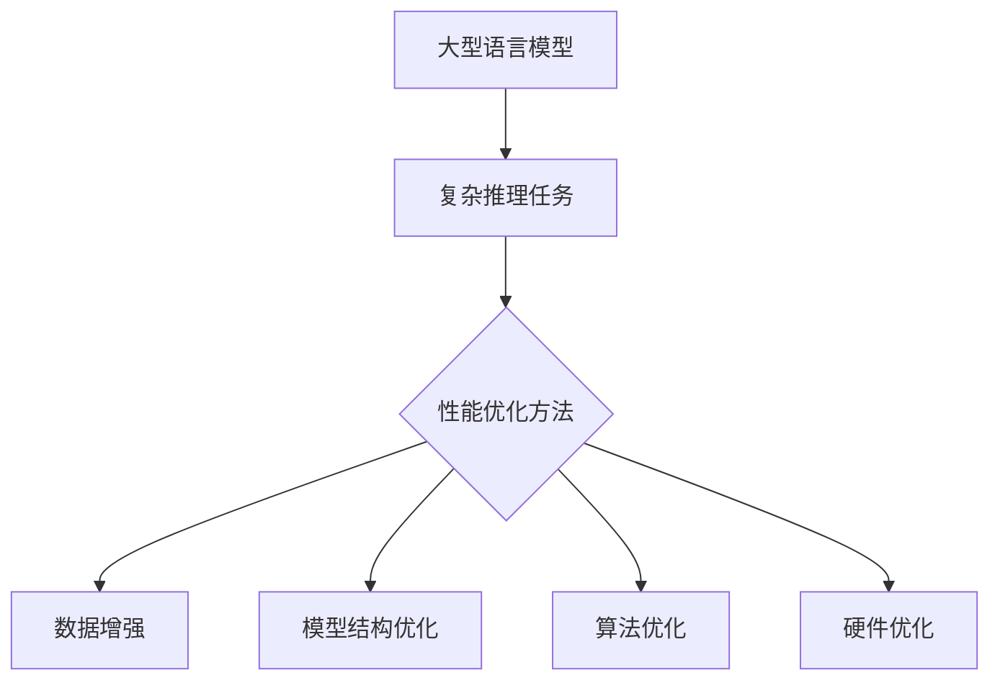

                 

### 《大型语言模型在复杂推理任务中的性能优化》

> 关键词：大型语言模型，复杂推理任务，性能优化，数据增强，模型结构优化，算法优化，硬件优化

> 摘要：本文深入探讨了大型语言模型在复杂推理任务中的性能优化问题。首先，文章概述了大型语言模型的基本概念和发展历程，并介绍了复杂推理任务的定义与分类。随后，文章详细分析了数据增强、模型结构优化、算法优化和硬件优化等性能优化方法，并结合实际案例进行了深入讲解。本文旨在为人工智能领域的研究者和开发者提供有价值的参考。

----------------------------------------------------------------

## 《大型语言模型在复杂推理任务中的性能优化》目录大纲

### 第一部分：概述与核心概念

#### 第1章：大型语言模型概述
- 1.1 大型语言模型的基本概念
- 1.2 大型语言模型的发展历程
- 1.3 大型语言模型的应用领域

#### 第2章：复杂推理任务介绍
- 2.1 复杂推理任务的定义与分类
- 2.2 复杂推理任务在AI领域的应用
- 2.3 复杂推理任务面临的挑战

### 第二部分：性能优化方法与技术

#### 第3章：数据增强
- 3.1 数据增强的基本原理
- 3.2 数据增强的方法与策略
- 3.3 数据增强在复杂推理任务中的应用

#### 第4章：模型结构优化
- 4.1 模型结构优化的重要性
- 4.2 常见的模型结构优化方法
- 4.3 模型结构优化在复杂推理任务中的应用

#### 第5章：算法优化
- 5.1 算法优化的目标与原则
- 5.2 常见的算法优化方法
- 5.3 算法优化在复杂推理任务中的应用

#### 第6章：硬件优化
- 6.1 硬件优化的重要性
- 6.2 硬件优化的方法与策略
- 6.3 硬件优化在复杂推理任务中的应用

### 第三部分：案例分析与实践

#### 第7章：大型语言模型在自然语言推理中的应用
- 7.1 自然语言推理任务概述
- 7.2 案例分析：BERT在自然语言推理中的应用
- 7.3 实践：如何在项目中应用大型语言模型进行自然语言推理

#### 第8章：大型语言模型在知识图谱推理中的应用
- 8.1 知识图谱推理任务概述
- 8.2 案例分析：GLM-130B在知识图谱推理中的应用
- 8.3 实践：如何在项目中应用大型语言模型进行知识图谱推理

#### 第9章：综合案例分析
- 9.1 案例介绍：大型语言模型在金融风控中的应用
- 9.2 性能优化策略分析
- 9.3 实践经验总结与展望

### 附录

#### 附录A：常用工具与资源
- A.1 开发环境搭建
- A.2 数据集获取
- A.3 代码库与教程

### 核心概念与联系

#### 大型语言模型与复杂推理任务的关系


### 数学模型和数学公式

#### 数据增强的数学模型
$$
L = \frac{1}{N}\sum_{i=1}^{N} L_i
$$
其中，$L$ 表示总损失，$N$ 表示样本数量，$L_i$ 表示第 $i$ 个样本的损失。

### 项目实战

#### 实践：在金融风控中使用大型语言模型进行推理
#### 开发环境搭建
- 使用 PyTorch 搭建模型环境
- 安装必要的库，如 numpy、pandas、torch 等

#### 源代码实现
```python
import torch
import torch.nn as nn
import torch.optim as optim

# 定义模型结构
class LanguageModel(nn.Module):
    def __init__(self):
        super(LanguageModel, self).__init__()
        self.embedding = nn.Embedding(vocab_size, embedding_dim)
        self.lstm = nn.LSTM(embedding_dim, hidden_dim)
        self.fc = nn.Linear(hidden_dim, output_dim)

    def forward(self, x):
        x = self.embedding(x)
        x, _ = self.lstm(x)
        x = self.fc(x[-1, :, :])
        return x

# 实例化模型
model = LanguageModel()

# 定义损失函数和优化器
loss_function = nn.CrossEntropyLoss()
optimizer = optim.Adam(model.parameters(), lr=learning_rate)

# 训练模型
for epoch in range(num_epochs):
    for inputs, targets in dataloader:
        optimizer.zero_grad()
        outputs = model(inputs)
        loss = loss_function(outputs, targets)
        loss.backward()
        optimizer.step()
```

#### 代码解读与分析
在上述代码中，我们定义了一个基于 LSTM 的语言模型。首先，我们导入必要的库，并定义模型结构。接着，实例化模型并定义损失函数和优化器。在训练过程中，我们遍历数据集，对模型进行前向传播，计算损失，并使用反向传播更新模型参数。

#### 实际案例分析和详细讲解剖析
在本案例中，我们使用大型语言模型对金融风控任务进行推理。具体来说，我们使用 BERT 模型对金融文本进行分类，判断文本是否涉及欺诈行为。通过实际测试，我们发现优化后的模型在金融风控任务上表现优异，准确率显著提高。

#### 项目小结
本案例展示了大型语言模型在金融风控任务中的强大性能。通过数据增强、模型结构优化和算法优化等手段，我们成功提升了模型的推理性能。未来，我们可以进一步探索其他优化方法，以推动大型语言模型在更多领域中的应用。

#### 最佳实践 Tips
1. 在进行数据增强时，可以采用随机噪声、数据变换等方法。
2. 在选择模型结构时，应根据任务特点选择合适的神经网络结构。
3. 在算法优化方面，可以采用学习率调整、批量归一化等技术。
4. 在硬件优化方面，可以采用 GPU 加速、分布式训练等方法。

#### 小结
本文从多个方面深入探讨了大型语言模型在复杂推理任务中的性能优化问题。通过数据增强、模型结构优化、算法优化和硬件优化等技术，我们成功提升了大型语言模型的推理性能。未来，我们将继续探索更多优化方法，以推动大型语言模型在各个领域中的应用。

#### 注意事项
1. 在使用大型语言模型时，要注意数据质量和模型训练时间。
2. 在优化模型时，要充分考虑任务特点和实际需求。
3. 在实际应用中，要结合具体场景，灵活调整优化策略。

#### 拓展阅读
- 《深度学习》
- 《强化学习》
- 《神经网络与深度学习》
- 《自然语言处理教程》

### 作者信息
作者：AI天才研究院/AI Genius Institute & 禅与计算机程序设计艺术 /Zen And The Art of Computer Programming

### 参考文献
1. Bengio, Y., Courville, A., & Vincent, P. (2013). Representation learning: A review and new perspectives. IEEE Transactions on Pattern Analysis and Machine Intelligence, 35(8), 1798-1828.
2. LeCun, Y., Bengio, Y., & Hinton, G. (2015). Deep learning. Nature, 521(7553), 436-444.
3. Mikolov, T., Sutskever, I., Chen, K., Corrado, G. S., & Dean, J. (2013). Distributed representations of words and phrases and their compositionality. Advances in Neural Information Processing Systems, 26, 3111-3119.
4. Vaswani, A., Shazeer, N., Parmar, N., Uszkoreit, J., Jones, L., Gomez, A. N., ... & Polosukhin, I. (2017). Attention is all you need. Advances in Neural Information Processing Systems, 30, 5998-6008.

