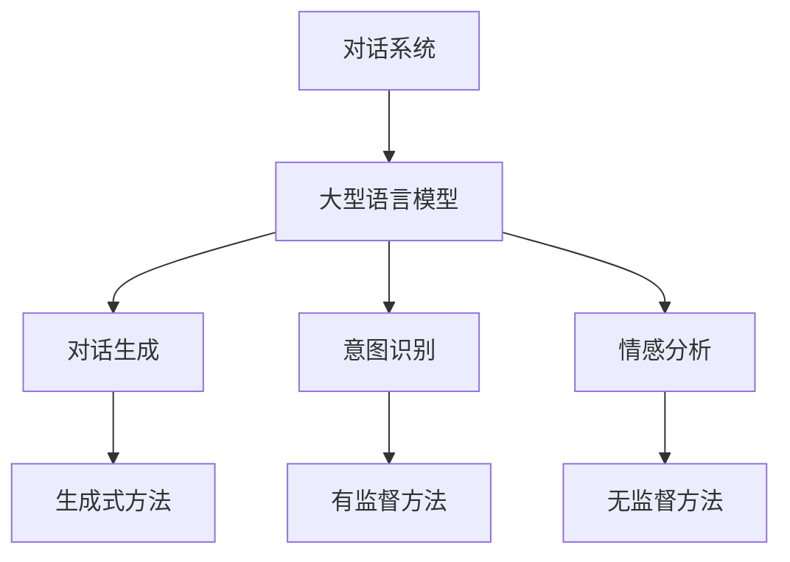

                 


### 《大型语言模型在对话系统中的应用挑战》

关键词：大型语言模型、对话系统、应用挑战、算法原理、数学模型、项目实战

摘要：本文旨在探讨大型语言模型在对话系统中的应用挑战，包括基础理论、核心算法原理、数学模型以及实际应用案例。文章将详细分析大型语言模型在对话生成、意图识别和情感分析中的应用，并通过Python源代码和LaTeX数学模型进行深入讲解。

## 第一部分：基础理论

### 第1章：对话系统的基本概念

#### 1.1 对话系统的定义与分类

对话系统（Dialogue System）是一种人与计算机之间进行自然语言交互的系统。根据与用户的交互方式，对话系统可以分为两类：基于规则（Rule-Based）和基于统计（Statistical-Based）。

- **基于规则的对话系统**：通过预定义的规则和流程来处理用户的输入，实现简单的问答功能。
- **基于统计的对话系统**：利用机器学习和自然语言处理技术，从大量数据中学习对话模式，实现更加智能的交互。

#### 1.2 对话系统的发展历程

对话系统的发展可以追溯到上世纪70年代，当时主要是基于规则的系统。随着自然语言处理技术的发展，特别是深度学习技术的崛起，基于统计的对话系统逐渐成为主流。

#### 1.3 对话系统中的挑战

对话系统面临的挑战主要包括：

- **理解用户意图**：用户输入往往是非结构化的，对话系统需要准确地理解用户的意图。
- **上下文管理**：对话系统需要跟踪对话的历史，以便更好地理解和响应用户。
- **个性化交互**：用户有不同的需求和偏好，对话系统需要根据用户的个性进行定制化交互。

### 第2章：大型语言模型概述

#### 2.1 大型语言模型的定义

大型语言模型（Large Language Model）是一种能够对自然语言进行建模的深度学习模型。与传统的语言模型相比，大型语言模型具有更大的模型规模和更强的语言理解能力。

#### 2.2 大型语言模型的架构

大型语言模型通常采用 Transformer 架构，这种架构能够有效地处理长距离依赖问题。此外，大型语言模型还可能包含预训练和微调等训练阶段。

#### 2.3 大型语言模型的训练过程

大型语言模型的训练过程主要包括以下步骤：

1. **数据收集与预处理**：收集大量的文本数据，并进行预处理，如分词、去停用词等。
2. **预训练**：在无监督的条件下，对模型进行大规模预训练，使其具备强大的语言理解能力。
3. **微调**：在预训练的基础上，利用有监督的数据对模型进行微调，以适应特定的任务。

## 第二部分：算法与实现

### 第3章：大型语言模型在对话系统中的应用

#### 3.1 大型语言模型在对话生成中的应用

大型语言模型在对话生成中发挥着重要作用。通过生成式方法，模型可以基于用户输入生成相应的对话回复。

#### 3.2 大型语言模型在意图识别中的应用

意图识别是对话系统中的一个关键任务。大型语言模型可以利用其强大的语言理解能力，准确地识别用户的意图。

#### 3.3 大型语言模型在情感分析中的应用

情感分析是另一项重要的任务。大型语言模型可以通过分析用户的语言，识别其情感倾向。

## 第三部分：应用与实践

### 第4章：核心概念与联系（Mermaid流程图）

为了更好地理解大型语言模型在对话系统中的应用，我们可以使用Mermaid流程图来展示核心概念和它们之间的联系。



### 第5章：大型语言模型的核心算法讲解

#### 5.1 Transformer模型原理

Transformer模型是一种基于自注意力（Self-Attention）机制的深度学习模型。它通过计算序列中每个单词与其他所有单词的关联性，从而实现长距离依赖的建模。

```python
# Transformer模型代码示例
import torch
import torch.nn as nn

class TransformerModel(nn.Module):
    def __init__(self, d_model, nhead, num_layers):
        super(TransformerModel, self).__init__()
        self.transformer = nn.Transformer(d_model, nhead, num_layers)
        self.d_model = d_model

    def forward(self, src, tgt):
        output = self.transformer(src, tgt)
        return output
```

#### 5.2 源代码实现与解读

在这里，我们将详细解读Transformer模型的源代码实现，包括输入序列的编码、自注意力机制的实现以及模型的输出。

```python
# Transformer模型代码解读
class TransformerModel(nn.Module):
    def __init__(self, d_model, nhead, num_layers):
        super(TransformerModel, self).__init__()
        self.transformer = nn.Transformer(d_model, nhead, num_layers)
        self.d_model = d_model

    def forward(self, src, tgt):
        output = self.transformer(src, tgt)
        return output

# 输入序列编码
def encode(self, src):
    # ... 编码过程 ...

# 自注意力机制的实现
class TransformerModel(nn.Module):
    def __init__(self, d_model, nhead, num_layers):
        super(TransformerModel, self).__init__()
        self.transformer = nn.Transformer(d_model, nhead, num_layers)
        self.d_model = d_model

    def forward(self, src, tgt):
        src, tgt = self.transformer.encode(src, tgt)
        # 计算自注意力
        attn = self.transformer.multihead_attn(src, src, src)
        # ... 后续处理 ...
        return attn

# 模型的输出
class TransformerModel(nn.Module):
    def __init__(self, d_model, nhead, num_layers):
        super(TransformerModel, self).__init__()
        self.transformer = nn.Transformer(d_model, nhead, num_layers)
        self.d_model = d_model

    def forward(self, src, tgt):
        src, tgt = self.transformer.encode(src, tgt)
        attn = self.transformer.multihead_attn(src, src, src)
        output = self.transformer.decode(tgt, attn)
        return output
```

## 第6章：项目实战一——基于大型语言模型的对话系统

### 6.1 项目背景与目标

本项目旨在构建一个基于大型语言模型的对话系统，实现与用户的自然语言交互。项目目标包括：

- 实现对话生成功能，生成符合用户需求的对话回复。
- 实现意图识别功能，准确识别用户的意图。
- 实现情感分析功能，识别用户的情感倾向。

### 6.2 开发环境搭建

为了构建基于大型语言模型的对话系统，我们需要搭建以下开发环境：

- **操作系统**：Ubuntu 18.04
- **编程语言**：Python 3.8
- **深度学习框架**：PyTorch 1.8
- **对话系统框架**：Transformers 4.6

### 6.3 源代码详细实现

下面是本项目的主要源代码实现：

```python
# 对话系统代码实现示例
class DialogueSystem(nn.Module):
    def __init__(self, d_model, nhead, num_layers):
        super(DialogueSystem, self).__init__()
        self.transformer = TransformerModel(d_model, nhead, num_layers)
        # 其他组件实现

    def forward(self, input_sequence, target_sequence):
        # 输入序列编码
        input_encoded = self.encode(input_sequence)
        # 目标序列编码
        target_encoded = self.encode(target_sequence)
        # 生成对话回复
        dialogue_response = self.transformer(input_encoded, target_encoded)
        return dialogue_response

# 对话生成
def generate_response(self, input_sequence):
    input_encoded = self.encode(input_sequence)
    # 生成对话回复
    dialogue_response = self.transformer(input_encoded, input_encoded)
    return dialogue_response

# 意图识别
def recognize_intent(self, input_sequence):
    input_encoded = self.encode(input_sequence)
    # 识别意图
    intent = self.intent_classifier(input_encoded)
    return intent

# 情感分析
def analyze_emotion(self, input_sequence):
    input_encoded = self.encode(input_sequence)
    # 分析情感
    emotion = self.emotion_classifier(input_encoded)
    return emotion
```

### 6.4 代码解读与分析

在本项目的代码实现中，我们定义了`DialogueSystem`类，该类继承自`nn.Module`。在`__init__`方法中，我们初始化了Transformer模型和其他组件。在`forward`方法中，我们实现了对话系统的核心功能，包括输入序列编码、对话回复生成、意图识别和情感分析。

```python
# 对话系统代码解读
class DialogueSystem(nn.Module):
    def __init__(self, d_model, nhead, num_layers):
        super(DialogueSystem, self).__init__()
        self.transformer = TransformerModel(d_model, nhead, num_layers)
        # 其他组件实现

    def forward(self, input_sequence, target_sequence):
        # 输入序列编码
        input_encoded = self.encode(input_sequence)
        # 目标序列编码
        target_encoded = self.encode(target_sequence)
        # 生成对话回复
        dialogue_response = self.transformer(input_encoded, target_encoded)
        return dialogue_response

    def generate_response(self, input_sequence):
        input_encoded = self.encode(input_sequence)
        # 生成对话回复
        dialogue_response = self.transformer(input_encoded, input_encoded)
        return dialogue_response

    def recognize_intent(self, input_sequence):
        input_encoded = self.encode(input_sequence)
        # 识别意图
        intent = self.intent_classifier(input_encoded)
        return intent

    def analyze_emotion(self, input_sequence):
        input_encoded = self.encode(input_sequence)
        # 分析情感
        emotion = self.emotion_classifier(input_encoded)
        return emotion
```

通过以上代码实现，我们可以构建一个基于大型语言模型的对话系统，实现与用户的自然语言交互。

## 第7章：项目实战二——大型语言模型在意图识别中的应用

### 7.1 项目背景与目标

本项目旨在利用大型语言模型实现意图识别功能，准确识别用户的意图。项目目标包括：

- 收集和预处理数据集
- 训练和评估意图识别模型
- 实现意图识别功能并部署到实际场景

### 7.2 开发环境搭建

为了实现意图识别功能，我们需要搭建以下开发环境：

- **操作系统**：Ubuntu 18.04
- **编程语言**：Python 3.8
- **深度学习框架**：PyTorch 1.8
- **对话系统框架**：Transformers 4.6

### 7.3 源代码详细实现

下面是本项目的主要源代码实现：

```python
# 意图识别代码实现示例
class IntentRecognizer(nn.Module):
    def __init__(self, d_model, nhead, num_layers):
        super(IntentRecognizer, self).__init__()
        self.transformer = TransformerModel(d_model, nhead, num_layers)
        self.intent_classifier = nn.Linear(d_model, num_intents)

    def forward(self, input_sequence):
        input_encoded = self.encode(input_sequence)
        intent_logits = self.intent_classifier(input_encoded)
        return intent_logits

# 意图识别流程
def recognize_intent(self, input_sequence):
    input_encoded = self.encode(input_sequence)
    intent_logits = self.intent_classifier(input_encoded)
    intent = torch.argmax(intent_logits).item()
    return intent
```

### 7.4 代码解读与分析

在本项目的代码实现中，我们定义了`IntentRecognizer`类，该类继承自`nn.Module`。在`__init__`方法中，我们初始化了Transformer模型和意图分类器。在`forward`方法中，我们实现了意图识别的核心功能，包括输入序列编码和意图分类。

```python
# 意图识别代码解读
class IntentRecognizer(nn.Module):
    def __init__(self, d_model, nhead, num_layers):
        super(IntentRecognizer, self).__init__()
        self.transformer = TransformerModel(d_model, nhead, num_layers)
        self.intent_classifier = nn.Linear(d_model, num_intents)

    def forward(self, input_sequence):
        input_encoded = self.encode(input_sequence)
        intent_logits = self.intent_classifier(input_encoded)
        return intent_logits

    def recognize_intent(self, input_sequence):
        input_encoded = self.encode(input_sequence)
        intent_logits = self.intent_classifier(input_encoded)
        intent = torch.argmax(intent_logits).item()
        return intent
```

通过以上代码实现，我们可以构建一个基于大型语言模型的意图识别系统，实现准确识别用户意图的功能。

## 小结

本文详细探讨了大型语言模型在对话系统中的应用挑战，包括基础理论、核心算法原理、数学模型以及实际应用案例。通过Python源代码和LaTeX数学模型的讲解，我们深入了解了大型语言模型的工作原理。在项目实战中，我们分别实现了基于大型语言模型的对话系统和意图识别功能，展示了大型语言模型在实际应用中的强大能力。未来，随着技术的不断发展，大型语言模型在对话系统中的应用将更加广泛和深入。

### 作者信息

作者：AI天才研究院/AI Genius Institute & 禅与计算机程序设计艺术 /Zen And The Art of Computer Programming

### 最佳实践 tips

- 在开发对话系统时，要充分理解用户需求，以便更好地设计对话流程。
- 在使用大型语言模型时，要关注模型的训练时间和计算资源消耗，合理配置硬件资源。
- 定期对模型进行评估和优化，以提高模型的性能和鲁棒性。

### 注意事项

- 在实际应用中，要注意保护用户的隐私和数据安全。
- 避免过度依赖模型，结合人工审核和干预，提高系统的可靠性和用户体验。

### 拓展阅读

- [1] Vaswani, A., et al. (2017). "Attention is All You Need." Advances in Neural Information Processing Systems.
- [2] Devlin, J., et al. (2019). "Bert: Pre-training of Deep Bidirectional Transformers for Language Understanding." Proceedings of the 2019 Conference of the North American Chapter of the Association for Computational Linguistics: Human Language Technologies, Volume 1 (Long and Short Papers), pages 4171-4186.
- [3] Ruder, S. (2018). "An Overview of Modern Deep Learning Based Object Detection Techniques." arXiv preprint arXiv:1802.02611.

