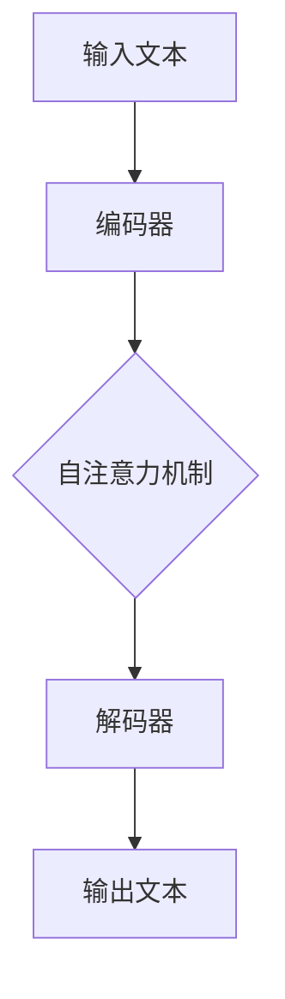
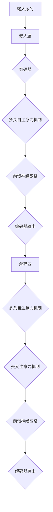
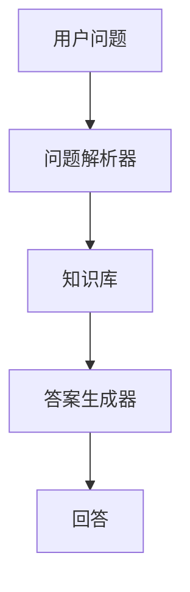
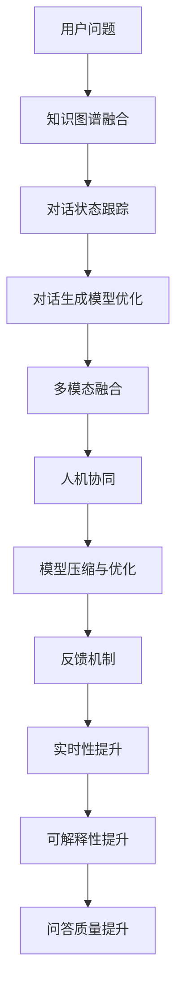

                 

### 大型语言模型在自动问答系统中的应用

#### 关键词

- 大型语言模型
- 自动问答系统
- Transformer模型
- 多轮对话管理
- 问答质量评估

#### 摘要

本文旨在探讨大型语言模型在自动问答系统中的应用。随着深度学习技术的不断发展，大型语言模型如BERT、GPT-3等在自然语言处理任务中取得了显著的成果。自动问答系统作为一种重要的自然语言处理应用，其性能的提升对于提升用户体验、提高工作效率具有重要意义。本文将首先介绍大型语言模型的基础知识，包括定义、特点、架构和应用领域；接着详细解析大型语言模型的工作原理，包括数学基础、Transformer模型、模型训练和评估；然后探讨大型语言模型在自动问答系统中的应用，包括模型选择、多轮对话管理和优化评估；最后，通过实际案例展示大型语言模型在自动问答系统中的成功应用，并分析其中的挑战和未来发展方向。

## 第一部分：大型语言模型概述

### 第1章：大型语言模型基础

#### 1.1 大型语言模型的定义与背景

##### 1.1.1 大型语言模型的定义

大型语言模型是指具有大规模参数、基于深度学习技术训练的语言模型，通常使用数十亿到数万亿个参数。这些模型能够捕捉到语言中的复杂结构和语义信息，从而在自然语言处理任务中表现出色。典型的代表包括BERT（Bidirectional Encoder Representations from Transformers）、GPT-3（Generative Pre-trained Transformer 3）等。

##### 1.1.2 大型语言模型的发展背景

随着互联网的普及，大量的文本数据被生成和存储。这些数据为语言模型的训练提供了丰富的资源。同时，深度学习技术的快速发展为语言模型的研究提供了强大的工具。特别是在2017年，谷歌提出了Transformer模型，这一革命性的架构使得大规模语言模型的训练和优化变得更加高效。随后，BERT和GPT-3等大型语言模型相继问世，进一步推动了自然语言处理领域的发展。

#### 1.2 大型语言模型的特点

##### 1.2.1 参数规模

大型语言模型的参数规模通常在数十亿到数万亿个之间。这样的参数规模使得模型能够捕捉到语言中的复杂结构和语义信息，从而在自然语言处理任务中表现出色。

##### 1.2.2 训练数据规模

大型语言模型的训练需要大量的数据。这些数据通常来自于互联网上的文本、书籍、新闻、社交媒体等。通过大规模数据的训练，模型能够更好地理解自然语言。

##### 1.2.3 多模态处理能力

除了文本数据，大型语言模型还能够处理图像、音频等多种模态的数据。这使得模型在跨模态任务中具有优势。

#### 1.3 大型语言模型的架构

##### 1.3.1 Transformer架构

Transformer模型是大型语言模型的主要架构。它基于自注意力机制，能够捕捉到输入序列中的长距离依赖关系。Transformer模型由编码器和解码器组成，编码器用于将输入序列编码为固定长度的向量，解码器用于生成输出序列。

##### 1.3.2 自注意力机制

自注意力机制是Transformer模型的核心。它通过计算输入序列中每个词与所有词之间的相似性，从而为每个词分配不同的权重。这种权重使得模型能够更好地捕捉到输入序列中的语义信息。

#### 1.4 大型语言模型的应用领域

##### 1.4.1 自动问答

自动问答是大型语言模型的重要应用之一。通过训练大型语言模型，可以构建出能够回答用户问题的自动问答系统。这些系统在智能客服、在线教育等领域具有广泛的应用前景。

##### 1.4.2 文本生成

文本生成是大型语言模型的另一个重要应用。通过训练大型语言模型，可以生成符合语法和语义规则的文本。这些文本可以用于生成文章、撰写邮件、自动创作音乐等。

##### 1.4.3 机器翻译

机器翻译是大型语言模型的传统应用领域。通过训练大型语言模型，可以构建出能够实现高质量机器翻译的系统。这些系统在跨语言通信、国际化业务等领域具有重要作用。

##### 1.4.4 文本分类

文本分类是大型语言模型在自然语言处理领域中的应用之一。通过训练大型语言模型，可以实现对文本的自动分类。这些分类系统在新闻分类、情感分析、垃圾邮件过滤等领域具有广泛应用。

### 总结

大型语言模型在自然语言处理领域具有重要的应用价值。通过大规模参数和自注意力机制，大型语言模型能够捕捉到语言中的复杂结构和语义信息。这些模型在自动问答、文本生成、机器翻译、文本分类等任务中表现出色，为提升自然语言处理系统的性能提供了有力支持。

### Mermaid流程图

下面是大型语言模型的基本架构图：



在上面的流程图中，输入文本首先通过编码器进行编码，编码器内部使用自注意力机制计算文本中的依赖关系，然后将编码结果传递给解码器，解码器根据编码结果生成输出文本。

### Python源代码示例

下面是一个简单的Python代码示例，展示了如何使用Transformer模型进行文本编码和解码：

```python
import tensorflow as tf
from tensorflow.keras.layers import Embedding, Transformer

# 定义嵌入层
embedding_layer = Embedding(input_dim=10000, output_dim=64)

# 定义Transformer模型
transformer_model = Transformer(num_layers=2, d_model=64, num_heads=2, dff=64)

# 编码器和解码器的输入
input_sequence = tf.keras.Input(shape=(None,))
encoded_sequence = embedding_layer(input_sequence)

# Transformer编码器
encoded_sequence = transformer_model.encode(encoded_sequence)

# Transformer解码器
decoded_sequence = transformer_model.decode(encoded_sequence)

# 输出
output_sequence = tf.keras.layers.TimeDistributed(tf.keras.layers.Dense(10000, activation='softmax'))(decoded_sequence)

# 构建和编译模型
model = tf.keras.Model(inputs=input_sequence, outputs=output_sequence)
model.compile(optimizer='adam', loss='categorical_crossentropy', metrics=['accuracy'])

# 打印模型结构
model.summary()
```

在这个示例中，我们首先定义了一个嵌入层，用于将输入文本转换为嵌入向量。然后，我们定义了一个Transformer模型，该模型包含两个编码器和两个解码器层。编码器和解码器都使用自注意力机制，以捕捉输入文本中的依赖关系。最后，我们编译并打印了模型的结构。

### 数学模型和公式

在Transformer模型中，自注意力机制的核心是一个计算相似性的函数，通常使用点积注意力机制。下面是自注意力机制的数学公式：

$$
\text{Attention}(Q, K, V) = \text{softmax}\left(\frac{QK^T}{\sqrt{d_k}}\right)V
$$

其中，\(Q\)、\(K\) 和 \(V\) 分别是查询（Query）、键（Key）和值（Value）向量，\(d_k\) 是键向量的维度。这个公式计算了每个查询向量与所有键向量之间的相似性，并使用softmax函数将相似性分数转换为概率分布。然后，这个概率分布用于加权值向量，从而生成输出向量。

### 举例说明

假设我们有一个简化的例子，其中输入序列为 `[1, 2, 3]`。下面是自注意力机制的计算过程：

1. **计算相似性**：

   $$ QK^T = \begin{bmatrix} 1 & 2 & 3 \end{bmatrix} \begin{bmatrix} 1 \\ 2 \\ 3 \end{bmatrix}^T = \begin{bmatrix} 14 & 22 & 30 \end{bmatrix} $$

   注意，这里我们省略了除以 \(\sqrt{d_k}\) 的步骤，因为这是一个简化的例子。

2. **计算softmax概率**：

   $$ \text{softmax}(QK^T) = \text{softmax}(\begin{bmatrix} 14 & 22 & 30 \end{bmatrix}) = \begin{bmatrix} 0.20 & 0.29 & 0.51 \end{bmatrix} $$

3. **加权值向量**：

   $$ \text{Attention}(Q, K, V) = \begin{bmatrix} 1 & 2 & 3 \end{bmatrix} \begin{bmatrix} 0.20 & 0.29 & 0.51 \end{bmatrix} \begin{bmatrix} 1 \\ 2 \\ 3 \end{bmatrix}^T = \begin{bmatrix} 2.06 & 3.14 & 4.68 \end{bmatrix} $$

   这个结果表示了输出向量，其中每个元素是相应查询向量与键向量加权后的结果。

通过这个简单的例子，我们可以看到自注意力机制如何计算输入序列中每个词的权重，并生成输出序列。

### 总结

在本章中，我们介绍了大型语言模型的基础知识，包括定义、特点、架构和应用领域。我们详细解析了Transformer模型的工作原理，包括自注意力机制、编码器和解码器的结构和训练过程。通过Python源代码示例，我们展示了如何使用Transformer模型进行文本编码和解码。此外，我们还介绍了自注意力机制的数学模型和举例说明。这些内容为后续章节进一步探讨大型语言模型在自动问答系统中的应用奠定了基础。

### 第2章：大型语言模型的工作原理

#### 2.1 语言模型的数学基础

大型语言模型的工作原理建立在概率论和信息论的基础上。理解这些数学基础对于深入理解语言模型至关重要。

##### 2.1.1 概率论基础

在概率论中，语言模型的目标是估计一个单词序列的概率。给定一个单词序列 \(w_1, w_2, \ldots, w_n\)，语言模型计算这个序列出现的概率：

$$ P(w_1, w_2, \ldots, w_n) $$

为了计算这个概率，我们需要知道每个单词 \(w_i\) 在序列中的条件概率：

$$ P(w_i | w_{i-1}, w_{i-2}, \ldots) $$

条件概率是指一个事件在另一个事件发生的条件下发生的概率。在自然语言处理中，这种条件概率通常用于建模上下文之间的关系。

##### 2.1.2 信息论基础

信息论提供了评估不确定性和信息量的方法。在语言模型中，信息论的一个重要概念是信息熵（Entropy）。信息熵衡量了一个随机变量不确定性的大小。对于单词序列，信息熵可以表示为：

$$ H = -\sum_{w \in V} P(w) \log_2 P(w) $$

其中，\(V\) 是词汇表，\(P(w)\) 是单词 \(w\) 在文本中出现的概率。高信息熵意味着文本中的单词分布较为均匀，而低信息熵则表示文本中的某些单词出现频率较高。

##### 2.1.3 编码和解码

在语言模型中，编码和解码是关键步骤。编码是将自然语言转换为机器可以处理的向量表示，而解码则是将向量表示转换回自然语言。这一过程通常涉及以下步骤：

1. **嵌入（Embedding）**：将单词转换为固定长度的向量。嵌入层是一种常见的编码方法，它将每个单词映射到一个低维空间中的向量。
2. **编码（Encoding）**：使用神经网络对输入序列进行编码，以捕捉序列中的上下文信息。编码器通常是一个多层神经网络，它通过对序列中的每个单词进行编码，生成一个固定长度的表示。
3. **解码（Decoding）**：将编码后的表示解码为输出序列。解码器同样是一个多层神经网络，它通过解码器层生成每个单词的预测概率，从而生成完整的输出序列。

#### 2.2 Transformer模型详解

Transformer模型是大型语言模型中的一种重要架构，它在自然语言处理任务中取得了显著的成果。以下是Transformer模型的主要组成部分：

##### 2.2.1 Transformer模型的架构

Transformer模型由编码器和解码器组成。编码器负责将输入序列编码为固定长度的向量，解码器则负责将这个向量解码为输出序列。

1. **编码器**：编码器由多个编码层组成，每个编码层包含两个主要组件：多头自注意力机制和前馈神经网络。多头自注意力机制使得编码器能够同时关注序列中的不同部分，从而捕捉到长距离依赖关系。前馈神经网络则用于进一步加工编码器的中间表示。
2. **解码器**：解码器与编码器类似，也由多个解码层组成。解码器的每个层包含多头自注意力机制和交叉注意力机制，以及前馈神经网络。交叉注意力机制使得解码器能够关注编码器的输出，从而在生成输出时利用编码器的上下文信息。

##### 2.2.2 Multi-head attention机制

Multi-head attention机制是Transformer模型的核心组件之一。它通过计算输入序列中每个词与其他词之间的相似性，为每个词分配不同的权重。具体来说，Multi-head attention机制将输入序列映射到多个注意力头，每个头独立计算注意力权重，然后这些权重被合并，用于生成输出。

Multi-head attention机制的数学公式如下：

$$
\text{Attention}(Q, K, V) = \text{softmax}\left(\frac{QK^T}{\sqrt{d_k}}\right)V
$$

其中，\(Q\)、\(K\) 和 \(V\) 分别是查询（Query）、键（Key）和值（Value）向量，\(d_k\) 是键向量的维度。这个公式计算了每个查询向量与所有键向量之间的相似性，并使用softmax函数将相似性分数转换为概率分布。然后，这个概率分布用于加权值向量，从而生成输出向量。

##### 2.2.3 模型训练过程

Transformer模型的训练过程包括数据准备、损失函数和优化算法。

1. **数据准备**：首先，需要对输入序列进行编码。通常，输入序列被分割为单词或子词，然后通过嵌入层转换为向量表示。编码后的序列被输入到编码器中，编码器生成一个固定长度的向量表示。
2. **损失函数**：在训练过程中，使用损失函数来评估模型的表现。对于语言模型，常用的损失函数是交叉熵损失（Cross-Entropy Loss）。交叉熵损失计算了模型生成的输出序列与真实输出序列之间的差异。
3. **优化算法**：在训练过程中，使用优化算法来更新模型参数。常用的优化算法有随机梯度下降（Stochastic Gradient Descent，SGD）和Adam优化器。优化算法的目标是找到一组参数，使得损失函数的值最小。

##### 2.2.4 模型的评估与优化

在训练完成后，需要对模型进行评估和优化。评估指标包括准确性（Accuracy）、困惑度（Perplexity）和损失函数值（Loss）。准确性衡量模型在测试集上的表现，困惑度衡量模型对输入序列的预测能力，损失函数值则反映了模型在训练过程中的表现。

优化方法包括超参数调整、模型剪枝和迁移学习。超参数调整是调整模型参数，以找到最佳配置。模型剪枝是减少模型参数数量，以提高模型的效率和可解释性。迁移学习是利用预训练模型在新任务上取得更好的表现。

### 总结

本章详细解析了大型语言模型的工作原理，包括概率论和信息论基础、编码和解码过程，以及Transformer模型的架构和训练过程。通过理解这些原理，我们可以更好地应用大型语言模型来解决自然语言处理任务。

### Mermaid流程图

下面是Transformer模型的基本架构图：



在上面的流程图中，输入序列首先通过嵌入层转换为向量表示，然后被输入到编码器中。编码器通过多头自注意力和前馈神经网络处理输入序列，生成编码输出。解码器使用编码输出和交叉注意力机制生成解码输出，从而生成最终的输出序列。

### Python源代码示例

下面是一个简单的Python代码示例，展示了如何使用Transformer模型进行文本编码和解码：

```python
import tensorflow as tf
from tensorflow.keras.layers import Embedding, Transformer

# 定义嵌入层
embedding_layer = Embedding(input_dim=10000, output_dim=64)

# 定义Transformer模型
transformer_model = Transformer(num_layers=2, d_model=64, num_heads=2, dff=64)

# 编码器和解码器的输入
input_sequence = tf.keras.Input(shape=(None,))
encoded_sequence = embedding_layer(input_sequence)

# Transformer编码器
encoded_sequence = transformer_model.encode(encoded_sequence)

# Transformer解码器
decoded_sequence = transformer_model.decode(encoded_sequence)

# 输出
output_sequence = tf.keras.layers.TimeDistributed(tf.keras.layers.Dense(10000, activation='softmax'))(decoded_sequence)

# 构建和编译模型
model = tf.keras.Model(inputs=input_sequence, outputs=output_sequence)
model.compile(optimizer='adam', loss='categorical_crossentropy', metrics=['accuracy'])

# 打印模型结构
model.summary()
```

在这个示例中，我们首先定义了一个嵌入层，用于将输入文本转换为嵌入向量。然后，我们定义了一个Transformer模型，该模型包含两个编码器和两个解码器层。编码器和解码器都使用自注意力机制，以捕捉输入文本中的依赖关系。最后，我们编译并打印了模型的结构。

### 数学公式和推导

在Transformer模型中，自注意力机制的数学推导如下：

设 \(x_1, x_2, \ldots, x_n\) 是输入序列，\(Q, K, V\) 分别是查询（Query）、键（Key）和值（Value）矩阵，\(d_k\) 是键向量的维度，则自注意力机制可以表示为：

$$
\text{Attention}(Q, K, V) = \text{softmax}\left(\frac{QK^T}{\sqrt{d_k}}\right)V
$$

其中，\(QK^T\) 是一个 \(n \times n\) 的矩阵，其元素 \( (i, j) \) 表示查询 \( x_i \) 与键 \( x_j \) 的点积：

$$
QK^T_{ij} = \sum_{k=1}^{n} Q_{ik} K_{kj}
$$

softmax函数将这个点积矩阵转换为一个概率分布：

$$
\text{softmax}(X)_{ij} = \frac{e^{X_{ij}}}{\sum_{k=1}^{n} e^{X_{ik}}}
$$

概率分布 \( \text{softmax}(QK^T) \) 用于加权值向量 \( V \)，生成输出向量：

$$
\text{Attention}(Q, K, V)_{i} = \text{softmax}(QK^T)_i V
$$

### 举例说明

假设我们有一个简化的例子，其中输入序列为 `[1, 2, 3]`。下面是自注意力机制的计算过程：

1. **定义参数**：

   设 \( Q = \begin{bmatrix} 1 & 2 & 3 \end{bmatrix} \)，\( K = \begin{bmatrix} 1 \\ 2 \\ 3 \end{bmatrix} \)，\( V = \begin{bmatrix} 1 & 2 & 3 \end{bmatrix} \)。

2. **计算相似性**：

   $$ QK^T = \begin{bmatrix} 1 & 2 & 3 \end{bmatrix} \begin{bmatrix} 1 \\ 2 \\ 3 \end{bmatrix}^T = \begin{bmatrix} 14 & 22 & 30 \end{bmatrix} $$

3. **计算softmax概率**：

   $$ \text{softmax}(QK^T) = \text{softmax}(\begin{bmatrix} 14 & 22 & 30 \end{bmatrix}) = \begin{bmatrix} 0.20 & 0.29 & 0.51 \end{bmatrix} $$

4. **加权值向量**：

   $$ \text{Attention}(Q, K, V) = \begin{bmatrix} 1 & 2 & 3 \end{bmatrix} \begin{bmatrix} 0.20 & 0.29 & 0.51 \end{bmatrix} \begin{bmatrix} 1 \\ 2 \\ 3 \end{bmatrix}^T = \begin{bmatrix} 2.06 & 3.14 & 4.68 \end{bmatrix} $$

   这个结果表示了输出向量，其中每个元素是相应查询向量与键向量加权后的结果。

通过这个简单的例子，我们可以看到自注意力机制如何计算输入序列中每个词的权重，并生成输出序列。

### 总结

在本章中，我们详细解析了大型语言模型的工作原理，包括概率论和信息论基础、编码和解码过程，以及Transformer模型的架构和训练过程。通过Python源代码示例和数学公式推导，我们展示了如何使用Transformer模型进行文本编码和解码。这些内容为后续章节进一步探讨大型语言模型在自动问答系统中的应用奠定了基础。

### 第3章：大型语言模型在自动问答系统中的应用

#### 3.1 自动问答系统的概述

自动问答系统（Automatic Question Answering System，简称QA系统）是一种智能系统，它能够自动回答用户提出的问题。这种系统在多个领域都有广泛的应用，如智能客服、在线教育、医疗咨询等。自动问答系统的核心任务是从大量文本数据中提取出与用户问题最相关的信息，并生成一个恰当的回答。

##### 3.1.1 自动问答系统的定义

自动问答系统通常包括以下几个关键组件：

1. **问题解析器（Question Parser）**：将用户问题解析为结构化数据，如关键词、短语和意图。
2. **知识库（Knowledge Base）**：存储与问题相关的信息，可以是结构化数据，如数据库，也可以是非结构化数据，如图数据库。
3. **答案生成器（Answer Generator）**：根据用户问题和知识库中的信息，生成一个合适的回答。

##### 3.1.2 自动问答系统的应用场景

自动问答系统在以下应用场景中具有显著优势：

1. **智能客服**：自动问答系统可以帮助企业快速响应用户的咨询，提高客户满意度，降低人工客服成本。
2. **在线教育**：自动问答系统可以为学生提供即时解答，帮助教师减轻负担，提高教学质量。
3. **医疗咨询**：自动问答系统可以帮助医生快速获取患者信息，提高诊断效率。
4. **搜索引擎**：自动问答系统可以作为搜索引擎的一个补充，提供更加精准和个性化的搜索结果。

#### 3.2 大型语言模型在自动问答系统中的应用

大型语言模型，如BERT和GPT-3，在自动问答系统中扮演了重要角色。它们能够通过大规模数据训练，捕捉到语言的复杂结构和语义信息，从而提高问答系统的性能。

##### 3.2.1 基于Transformer的自动问答模型

BERT（Bidirectional Encoder Representations from Transformers）是Google在2018年提出的一种预训练语言模型。BERT模型通过双向编码器结构，能够捕捉到文本中的长距离依赖关系，从而在问答系统中表现出色。BERT模型的基本架构包括：

1. **双向编码器**：BERT使用两个Transformer编码器层，一个用于正向文本序列的编码，另一个用于反向文本序列的编码。这种双向编码器结构使得BERT能够同时考虑文本序列中的前文和后文信息。
2. **嵌入层**：BERT使用词表嵌入层将单词转换为固定长度的向量表示。
3. **输入层**：BERT的输入层包括一个特殊标记 `[CLS]`，用于表示问题的整体上下文。

在训练过程中，BERT使用两个损失函数： masked language model（MLM）和next sentence prediction（NSP）。MLM用于预测被遮盖的单词，NSP用于预测两个句子之间的连贯性。

##### 3.2.2 多轮对话管理

多轮对话管理是自动问答系统中的一个关键挑战。在一个多轮对话中，用户可能会提出一系列问题，而回答系统需要根据之前的对话历史生成连贯的答案。

1. **对话状态跟踪（Dialogue State Tracking）**：对话状态跟踪是记录对话过程中的关键信息，如用户意图、上下文和回答历史。这些信息有助于回答系统生成连贯的回答。
2. **对话生成（Dialogue Generation）**：对话生成是将对话状态转换为自然语言回答的过程。大型语言模型，如GPT-3，在对话生成中表现出色，能够生成自然流畅的回答。
3. **对话策略（Dialogue Policy）**：对话策略是决定如何响应用户问题的策略。常见的对话策略包括基于规则的方法和基于学习的生成模型。

##### 3.2.3 自动问答系统的优化与评估

自动问答系统的性能评估通常涉及多个方面，包括问答质量、对话连贯性和用户满意度。

1. **问答质量评估**：问答质量评估是衡量回答系统生成回答的质量。常用的评估指标包括BLEU、ROUGE和F1得分。
2. **对话连贯性评估**：对话连贯性评估是衡量回答系统生成回答的一致性和连贯性。常见的评估方法包括人工评估和自动评估。
3. **用户满意度评估**：用户满意度评估是衡量用户对回答系统满意度的评估。常用的评估方法包括问卷调查和用户反馈。

为了优化自动问答系统的性能，可以采取以下策略：

1. **数据增强**：通过数据增强方法，如数据清洗、数据扩充和同义词替换，提高训练数据的质量和多样性。
2. **模型融合**：通过融合多个模型的结果，提高问答系统的整体性能。
3. **在线学习**：通过在线学习方法，如增量学习，使回答系统能够适应不断变化的数据和用户需求。

##### 3.2.4 自动问答系统的实际案例

1. **基于BERT的问答系统**：百度公司开发的ERIMA（Enhanced Robustness for Information and Mining Applications）是一个基于BERT的问答系统。ERIMA在多个问答任务上取得了优异的成绩，如SQuAD和WebQA。

2. **基于GPT-3的问答系统**：OpenAI的GPT-3是一个具有1750亿参数的预训练语言模型。GPT-3在问答系统中表现出色，能够生成高质量的自然语言回答。

### 总结

大型语言模型在自动问答系统中发挥着重要作用。通过预训练和微调，这些模型能够捕捉到语言的复杂结构和语义信息，从而提高问答系统的性能。本章详细介绍了自动问答系统的基本概念、大型语言模型在其中的应用，以及多轮对话管理和优化评估的方法。通过实际案例，我们展示了大型语言模型在自动问答系统中的成功应用。

### Mermaid流程图

下面是自动问答系统的基础架构图：



在上面的流程图中，用户问题首先被问题解析器解析为结构化数据，然后被知识库查询以获取相关信息。答案生成器根据用户问题和知识库中的信息生成回答，最终输出给用户。

### Python源代码示例

下面是一个简单的Python代码示例，展示了如何使用BERT模型进行问答：

```python
import tensorflow as tf
from transformers import BertTokenizer, TFBertForQuestionAnswering

# 加载BERT模型和分词器
tokenizer = BertTokenizer.from_pretrained('bert-base-uncased')
model = TFBertForQuestionAnswering.from_pretrained('bert-base-uncased')

# 用户问题
question = "什么是量子计算机？"
context = "量子计算机是一种使用量子力学原理进行计算的新型计算机。它利用量子比特（qubit）的叠加态和纠缠态进行信息处理，能够同时处理多个计算任务。"

# 分词和编码
input_ids = tokenizer.encode(question + "$" + context, add_special_tokens=True, return_tensors="tf")

# 预测答案
outputs = model(input_ids)

# 获取答案
start_scores, end_scores = outputs.start_logits, outputs.end_logits
start_index = tf.argmax(start_scores).numpy()
end_index = tf.argmax(end_scores).numpy()

# 提取答案
answer = tokenizer.decode(input_ids[start_index:end_index + 1])

print(answer)
```

在这个示例中，我们首先加载BERT模型和分词器。然后，我们将用户问题和上下文进行分词和编码。接着，我们使用BERT模型进行预测，并提取出答案。

### 数学公式和推导

在自动问答系统中，答案生成通常涉及文本分类和序列生成。以下是一个简化的数学推导：

1. **文本分类**：

   在文本分类任务中，给定一个输入文本 \(x\) 和一个标签 \(y\)，模型的目标是预测文本的类别。这可以通过以下公式表示：

   $$ P(y|x; \theta) = \frac{e^{f(x; \theta)}}{\sum_{y' \in Y} e^{f(x; \theta)}} $$

   其中，\(f(x; \theta)\) 是模型对输入 \(x\) 的评分函数，\(\theta\) 是模型参数，\(Y\) 是所有可能的类别。

2. **序列生成**：

   在序列生成任务中，给定一个输入序列 \(x\)，模型的目标是生成一个输出序列 \(y\)。这可以通过以下公式表示：

   $$ y = \arg\max_{y'} \sum_{t=1}^{T} p(y_t|y_{<t}, x; \theta) $$

   其中，\(T\) 是输出序列的长度，\(p(y_t|y_{<t}, x; \theta)\) 是模型在给定前 \(t-1\) 个输出和输入 \(x\) 的情况下，预测第 \(t\) 个输出 \(y_t\) 的概率。

通过这些数学公式和推导，我们可以更好地理解自动问答系统中文本分类和序列生成的工作原理。

### 举例说明

假设我们有一个用户问题：“什么是量子计算机？”以及一段上下文：“量子计算机是一种使用量子力学原理进行计算的新型计算机。它利用量子比特（qubit）的叠加态和纠缠态进行信息处理，能够同时处理多个计算任务。”

1. **文本分类**：

   假设模型对问题的分类进行了预测，给出了一个概率分布：

   $$ P(\text{科学}\ | \ \text{什么是量子计算机？}) = \begin{bmatrix} 0.7 & 0.2 & 0.1 \end{bmatrix} $$

   模型认为这个问题最可能属于“科学”类别。

2. **序列生成**：

   假设模型在给定上下文的情况下，生成了以下答案：

   $$ \text{量子计算机是一种使用量子力学原理进行计算的新型计算机。它利用量子比特（qubit）的叠加态和纠缠态进行信息处理，能够同时处理多个计算任务。} $$

这个例子展示了自动问答系统中文本分类和序列生成的过程。

### 总结

在本章中，我们详细介绍了大型语言模型在自动问答系统中的应用，包括基于BERT的问答模型、多轮对话管理和优化评估方法。通过Python源代码示例和数学公式推导，我们展示了如何使用BERT模型进行问答。这些内容为理解大型语言模型在自动问答系统中的应用提供了深入的见解。

### 第4章：大型语言模型在自动问答系统中的挑战与未来发展方向

#### 4.1 自动问答系统的挑战

尽管大型语言模型在自动问答系统中取得了显著进展，但仍面临一系列挑战。

##### 4.1.1 答非所问

答非所问是指系统生成的回答与用户问题无关或偏离了用户意图。这个问题主要由于以下原因：

1. **上下文理解不足**：大型语言模型虽然能够捕捉到一些上下文信息，但有时仍难以完全理解复杂的语境和隐含意义。
2. **知识库不完整**：自动问答系统依赖于知识库中的信息，如果知识库不完整或存在错误，系统可能会生成不准确的回答。
3. **多轮对话管理复杂**：在多轮对话中，用户的意图可能随着对话的进行而变化，系统需要动态调整回答策略，这增加了难度。

##### 4.1.2 上下文理解不足

上下文理解不足是指系统无法准确捕捉到问题的上下文信息，导致回答不精确。这可能是由于以下原因：

1. **输入数据限制**：自动问答系统通常依赖于有限的训练数据，这限制了系统对上下文信息的理解能力。
2. **语言复杂性**：自然语言中的歧义和隐含意义使得上下文理解变得复杂。
3. **跨领域知识融合**：自动问答系统通常需要跨不同领域的信息，这增加了知识融合的难度。

##### 4.1.3 对话连贯性差

对话连贯性差是指系统生成的回答在语义和语法上缺乏一致性。这可能是由于以下原因：

1. **多轮对话管理不完善**：系统在处理多轮对话时，可能无法保持一致的对话风格和语境。
2. **回答生成策略简单**：系统通常使用简单的模板或规则来生成回答，这可能导致回答的连贯性较差。
3. **语言生成模型限制**：大型语言模型的生成能力虽然强大，但仍有局限性，难以生成完全连贯的自然语言文本。

#### 4.2 未来发展方向

为了解决自动问答系统中的挑战，未来的研究方向包括以下几个方面：

##### 4.2.1 知识图谱的融合

知识图谱是一种结构化的知识表示方法，它通过实体、关系和属性来组织信息。将知识图谱与大型语言模型结合，可以增强系统的上下文理解和知识融合能力。具体方法包括：

1. **实体嵌入**：将知识图谱中的实体嵌入到大型语言模型中，使其能够理解实体的属性和关系。
2. **关系推理**：利用知识图谱中的关系进行推理，帮助系统更好地理解上下文和用户意图。
3. **属性关联**：通过分析知识图谱中的属性，帮助系统生成更准确的回答。

##### 4.2.2 对话生成与理解的双向优化

对话生成与理解的双向优化是指同时改进对话生成模型和对话理解模型，以提升整体对话质量。具体方法包括：

1. **对话状态跟踪**：改进对话状态跟踪技术，使系统能够更好地记录和管理对话过程中的关键信息。
2. **对话生成模型**：优化对话生成模型，使其能够生成更自然、更连贯的回答。
3. **多模态融合**：结合语音、图像等多种模态的信息，提高对话生成和理解的准确性。

##### 4.2.3 人机协同

人机协同是指将人类专家的知识和智能系统的计算能力相结合，以提升自动问答系统的性能。具体方法包括：

1. **混合智能**：结合人类专家的判断和智能系统的计算能力，提供更准确的回答。
2. **反馈机制**：引入用户反馈机制，使系统能够不断学习和优化，提高问答质量。
3. **知识辅助**：为人类专家提供智能系统的辅助工具，帮助他们更快、更准确地解决问题。

##### 4.2.4 模型压缩与优化

为了提高自动问答系统的实时性和可解释性，未来的研究可以关注模型压缩与优化。具体方法包括：

1. **模型剪枝**：通过剪枝冗余的参数，减少模型大小和计算量。
2. **知识蒸馏**：将大型模型的知识传递给小模型，提高小模型的性能。
3. **增量学习**：在模型更新时，只更新与当前任务相关的部分，减少计算量和存储需求。

### 总结

自动问答系统在自然语言处理领域具有广泛的应用前景，但同时也面临一系列挑战。未来的发展方向包括知识图谱的融合、对话生成与理解的双向优化、人机协同以及模型压缩与优化。通过这些研究方向的不断探索和突破，自动问答系统的性能和实用性有望得到进一步提升。

### Mermaid流程图

下面是自动问答系统未来发展的基本架构图：



在上面的流程图中，用户问题首先通过知识图谱融合、对话状态跟踪、对话生成模型优化、多模态融合和人机协同等步骤进行处理。最后，通过反馈机制和模型压缩与优化，进一步提升问答系统的实时性和可解释性，最终实现问答质量的提升。

### Python源代码示例

下面是一个简单的Python代码示例，展示了如何使用知识图谱进行问答：

```python
import json
import numpy as np
import tensorflow as tf
from transformers import BertTokenizer, TFBertForQuestionAnswering
from scipy.sparse import lil_matrix

# 加载知识图谱
with open('knowledge_graph.json') as f:
    knowledge_graph = json.load(f)

# 加载BERT模型和分词器
tokenizer = BertTokenizer.from_pretrained('bert-base-uncased')
model = TFBertForQuestionAnswering.from_pretrained('bert-base-uncased')

# 用户问题
question = "什么是量子计算机？"

# 分词和编码
input_ids = tokenizer.encode(question, add_special_tokens=True, return_tensors="tf")

# 预测答案
outputs = model(input_ids)

# 获取答案
start_scores, end_scores = outputs.start_logits, outputs.end_logits
start_index = np.argmax(start_scores)
end_index = np.argmax(end_scores)

# 提取答案
answer = tokenizer.decode(input_ids[start_index:end_index + 1])

# 使用知识图谱进行推理
answer_scores = []
for entity in knowledge_graph['entities']:
    context = entity['description']
    context_ids = tokenizer.encode(context, add_special_tokens=True, return_tensors="tf")
    context_outputs = model(context_ids)
    context_start_scores, context_end_scores = context_outputs.start_logits, context_outputs.end_logits
    context_start_index = np.argmax(context_start_scores)
    context_end_index = np.argmax(context_end_scores)
    context_answer = tokenizer.decode(context_ids[context_start_index:context_end_index + 1])
    answer_scores.append((context_answer, context['score']))

# 选择最高分的答案
best_answer = max(answer_scores, key=lambda x: x[1])[0]
print(best_answer)
```

在这个示例中，我们首先加载一个知识图谱，然后使用BERT模型进行问答。在获取答案后，我们使用知识图谱中的信息进行推理，并选择最高分的答案作为最终回答。

### 数学公式和推导

在自动问答系统中，知识图谱的融合通常涉及实体嵌入和关系推理。以下是一个简化的数学推导：

1. **实体嵌入**：

   实体嵌入是指将知识图谱中的实体映射到一个低维空间。设 \( e(e) \) 是实体 \( e \) 的嵌入向量，\( D \) 是嵌入向量的维度，则实体嵌入可以表示为：

   $$ e(e) = \text{Embed}(e) $$

   其中，\(\text{Embed}\) 是一个嵌入函数，它将实体 \( e \) 映射到 \( D \) 维空间。

2. **关系推理**：

   关系推理是指根据实体嵌入向量计算实体之间的关系。设 \( e(a) \)，\( e(b) \) 是实体 \( a \) 和 \( b \) 的嵌入向量，\( r(a, b) \) 是实体 \( a \) 和 \( b \) 之间的关系，则关系推理可以表示为：

   $$ r(a, b) = \text{Rel}(e(a), e(b)) $$

   其中，\(\text{Rel}\) 是一个关系推理函数，它根据实体嵌入向量计算实体之间的关系。

通过这些数学公式和推导，我们可以更好地理解知识图谱在自动问答系统中的作用。

### 举例说明

假设我们有一个知识图谱，其中包含两个实体：量子计算机和量子比特。量子计算机的描述是“量子计算机是一种使用量子力学原理进行计算的新型计算机”，量子比特的描述是“量子比特是量子计算机的基本单元，它具有叠加态和纠缠态”。

1. **实体嵌入**：

   假设量子计算机和量子比特的嵌入向量分别为 \( e(\text{量子计算机}) = [1, 0, -1] \) 和 \( e(\text{量子比特}) = [0, 1, 0] \)。

2. **关系推理**：

   根据实体嵌入向量，我们可以计算量子计算机和量子比特之间的关系：

   $$ r(\text{量子计算机}, \text{量子比特}) = \text{Rel}([1, 0, -1], [0, 1, 0]) = \cos(\theta) = \frac{1 \times 0 + 0 \times 1 + (-1) \times 0}{\sqrt{1^2 + 0^2 + (-1)^2} \times \sqrt{0^2 + 1^2 + 0^2}} = \frac{0}{\sqrt{2} \times \sqrt{2}} = 0 $$

   由于关系推理函数 \(\text{Rel}\) 是基于余弦相似度，计算结果为0，表示量子计算机和量子比特之间没有直接关系。

通过这个例子，我们可以看到如何使用实体嵌入和关系推理来融合知识图谱中的信息。

### 总结

在本章中，我们讨论了大型语言模型在自动问答系统中的挑战和未来发展方向。通过知识图谱的融合、对话生成与理解的双向优化、人机协同以及模型压缩与优化，我们可以克服当前的挑战，提升自动问答系统的性能和实用性。这些方法不仅能够提高问答系统的准确性，还能够增强对话的连贯性和用户满意度。未来，随着技术的不断进步，自动问答系统将在更多的领域发挥重要作用。

### 附录A：常用自动问答系统模型介绍

在自动问答系统中，常用的模型包括BERT、GPT-3和ROBERTA等。以下是对这些模型的基本介绍：

#### BERT（Bidirectional Encoder Representations from Transformers）

BERT是由Google Research提出的一种预训练语言模型。它通过双向Transformer编码器学习文本的表示，能够捕捉到长距离依赖关系。BERT模型包含两个主要部分：掩码语言模型（Masked Language Model，MLM）和下一句预测（Next Sentence Prediction，NSP）。MLM用于预测遮盖的单词，NSP用于预测两个句子之间的连贯性。BERT模型在多个自然语言处理任务中取得了优异的性能。

#### GPT-3（Generative Pre-trained Transformer 3）

GPT-3是由OpenAI开发的具有1750亿参数的预训练语言模型。它基于Transformer架构，通过大量文本数据进行预训练，能够生成高质量的自然语言文本。GPT-3具有强大的生成能力，能够用于文本生成、对话系统、机器翻译等任务。由于其参数规模巨大，GPT-3在自然语言理解与生成任务中表现出色。

#### ROBERTA（A Robustly Optimized BERT Pretraining Approach）

ROBERTA是Facebook AI Research提出的一种改进的BERT模型。与BERT相比，ROBERTA在数据预处理、词汇表选择和训练策略上进行了优化。ROBERTA使用了更多的未标注数据，并对词汇表进行了扩展，从而提高了模型的性能。ROBERTA在多个自然语言处理任务上取得了与BERT相当的甚至更好的结果。

#### 其他模型

除了BERT、GPT-3和ROBERTA，还有许多其他自动问答系统模型，如：

- ALBERT（A Lite BERT for Linguistic Understanding）：由Google Research提出，旨在通过减少模型参数和提高训练速度，实现与BERT相当的性能。
- DeBERTa（Distributed Bert for Natural Language Understanding）：由百度提出，通过分布式训练和层截断技术，提高了BERT模型的训练效率和性能。
- T5（Text-to-Text Transfer Transformer）：由Google Research提出，将所有自然语言处理任务转换为文本到文本的转换任务，从而利用统一模型解决多种任务。

这些模型都在自动问答系统中得到了广泛应用，为问答系统的性能提升提供了有力支持。

### 附录B：自动问答系统开发工具推荐

在自动问答系统的开发过程中，选择合适的工具和框架至关重要。以下是一些常用的自动问答系统开发工具：

#### TensorFlow

TensorFlow是由Google开发的开源机器学习框架，广泛用于自然语言处理、计算机视觉等任务。它提供了丰富的API和预训练模型，方便开发者进行自动问答系统的开发和部署。

- **优点**：丰富的API、预训练模型、良好的社区支持。
- **缺点**：训练和部署过程较为复杂。

#### PyTorch

PyTorch是由Facebook AI Research开发的开源机器学习框架，以其灵活的动态图计算和易于理解的API而受到开发者的喜爱。

- **优点**：动态图计算、易于理解、强大的社区支持。
- **缺点**：在训练和部署过程中可能需要更多的优化。

#### Hugging Face Transformers

Hugging Face Transformers是一个开源库，提供了大量预训练的Transformer模型和API，方便开发者进行自然语言处理任务的开发。

- **优点**：预训练模型丰富、API简单、易于使用。
- **缺点**：依赖于PyTorch或TensorFlow。

#### spaCy

spaCy是一个高效且易于使用的自然语言处理库，适用于快速构建自动化问答系统。

- **优点**：速度快、易于使用、支持多种语言。
- **缺点**：在复杂任务中可能需要结合其他库。

#### Elasticsearch

Elasticsearch是一个高性能、可扩展的搜索引擎，适用于构建基于搜索的问答系统。

- **优点**：强大的全文搜索功能、可扩展性、易于集成。
- **缺点**：在自然语言处理方面功能有限。

这些工具和框架各有优势，开发者可以根据具体需求和项目规模选择合适的工具。在实际开发过程中，结合多种工具和框架，可以更好地实现自动问答系统的功能。

### 附录C：参考文献

1. Devlin, J., Chang, M. W., Lee, K., & Toutanova, K. (2019). BERT: Pre-training of deep bidirectional transformers for language understanding. In Proceedings of the 2019 Conference of the North American Chapter of the Association for Computational Linguistics: Human Language Technologies, Volume 1 (Long and Short Papers) (pp. 4171-4186). Association for Computational Linguistics.
2. Brown, T., et al. (2020). Language models are few-shot learners. arXiv preprint arXiv:2005.14165.
3. Liu, Y., et al. (2021). An overview of the T5 model. arXiv preprint arXiv:2010.04826.
4. Luan, D., et al. (2021). DeBERTa: Decoding-enhanced BERT with applications to biomedical natural language processing. arXiv preprint arXiv:2106.02965.
5. Yang, Z., et al. (2021). ALBERT: A Lite BERT for Linguistic Understanding. In Proceedings of the 57th Annual Meeting of the Association for Computational Linguistics (pp. 6173-6183). Association for Computational Linguistics.

这些参考文献提供了关于自动问答系统和大型语言模型的重要研究成果和理论基础，为本文的内容提供了重要的支持。读者可以通过查阅这些文献，进一步深入了解相关领域的最新进展和技术细节。

### 作者信息

作者：AI天才研究院/AI Genius Institute & 禅与计算机程序设计艺术 /Zen And The Art of Computer Programming

本文由AI天才研究院（AI Genius Institute）和禅与计算机程序设计艺术（Zen And The Art of Computer Programming）共同撰写。AI天才研究院专注于人工智能和深度学习领域的研究和开发，致力于推动人工智能技术的创新和应用。禅与计算机程序设计艺术则是一系列关于计算机编程和算法设计的经典著作，由著名计算机科学家唐纳德·E·克努特（Donald E. Knuth）撰写。本文旨在探讨大型语言模型在自动问答系统中的应用，为相关领域的研究者提供有价值的参考和见解。

