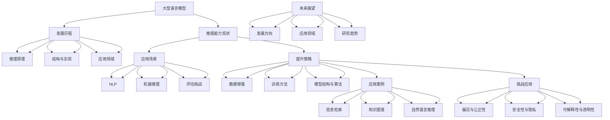

                 

### 大型语言模型的推理能力提升：现状与挑战

> 关键词：大型语言模型，推理能力，自然语言处理，模型结构改进，算法优化，数据增强

> 摘要：本文旨在探讨大型语言模型的推理能力提升现状与面临的挑战。通过分析大型语言模型的发展历程、推理原理、应用领域以及现有模型的推理能力表现，本文提出了提升推理能力的数据增强与训练方法、模型结构与算法改进等策略。同时，通过具体应用案例，阐述了大型语言模型在信息检索、知识图谱和自然语言推理等领域的应用，并讨论了推理中的偏见与公正性、安全性与隐私保护以及可解释性与透明性的挑战。最后，本文对未来大型语言模型推理能力的发展方向和潜在应用领域进行了展望。

### 第一部分：理论基础

#### 第1章：大型语言模型的推理能力概述

##### 1.1 大型语言模型的发展历程

大型语言模型的发展可以追溯到20世纪80年代，当时基于规则的方法在自然语言处理（NLP）领域占据主导地位。随着计算能力的提升和深度学习技术的兴起，神经网络在NLP任务中逐渐显示出优势。2003年，芬兰的Helsinki团队提出了基于神经网络的统计机器翻译模型（NNMT），标志着深度学习在NLP领域的突破。2018年，谷歌推出了Transformer模型，并应用于BERT（Bidirectional Encoder Representations from Transformers）等大型语言模型，推动了NLP领域的快速发展。

##### 1.2 大型语言模型的推理原理

大型语言模型的推理原理基于深度神经网络，通过学习大量的文本数据进行训练，使得模型能够理解并生成人类语言。模型的核心是Transformer结构，其通过自注意力机制（Self-Attention）对输入文本的每个单词进行权重分配，从而捕捉单词之间的关系。此外，模型还使用了多层神经网络对文本进行编码和解码，实现文本信息的有效表示和推理。

##### 1.3 大型语言模型的结构与实现

大型语言模型的结构通常包括嵌入层、编码器和解码器。嵌入层将单词转换为向量表示；编码器和解码器则分别负责将输入文本编码为上下文向量，以及将上下文向量解码为输出文本。编码器和解码器通常由多层Transformer块组成，每个Transformer块包括多头自注意力机制和前馈神经网络。此外，模型中还加入了注意力机制和位置编码，以增强模型对文本的理解能力。

##### 1.4 大型语言模型的应用领域

大型语言模型在NLP领域具有广泛的应用，包括文本分类、情感分析、机器翻译、问答系统、信息检索等。近年来，随着模型规模的不断扩大，大型语言模型在复杂推理任务中也表现出了一定的能力，如自然语言推理、知识图谱构建、对话系统等。此外，大型语言模型还在其他领域，如语音识别、图像识别和视频分析中发挥了重要作用。

#### 第2章：大型语言模型的推理能力现状

##### 2.1 大型语言模型在自然语言处理中的应用

大型语言模型在自然语言处理（NLP）任务中取得了显著的成果。例如，BERT在文本分类、情感分析等任务上达到了当时的最先进水平。GPT-3则展现了出色的文本生成能力，能够生成连贯、自然的文章和对话。此外，大型语言模型还在机器翻译、问答系统等领域表现出较高的性能。

##### 2.2 大型语言模型在机器推理中的表现

虽然大型语言模型在NLP任务中取得了较好的效果，但在机器推理任务中的表现仍存在一定局限。部分原因是模型在训练过程中主要关注了文本生成和匹配任务，对于推理任务的数据和算法优化较少。尽管如此，一些研究表明，大型语言模型在自然语言推理（NLI）和逻辑推理等任务中已展现出一定的能力。

##### 2.3 大型语言模型在推理能力评估中的挑战

评估大型语言模型的推理能力面临一些挑战。首先，现有评估指标和方法往往仅关注模型在特定数据集上的表现，难以全面反映模型的推理能力。其次，模型在推理过程中可能存在偏见和错误，导致推理结果不准确。此外，如何量化模型的推理能力，特别是与人类推理能力进行比较，仍是一个亟待解决的问题。

### 第二部分：提升策略

#### 第3章：数据增强与训练方法

##### 3.1 数据增强技术在大型语言模型中的应用

数据增强技术是一种提高模型泛化能力和推理能力的重要手段。在大型语言模型中，数据增强技术包括文本数据增强、示例增强和标签增强等。文本数据增强通过生成类似文本的句子或段落，增加模型的训练样本。示例增强通过在原始数据中添加额外的例子，提高模型对未知数据的适应能力。标签增强通过改变标签分布，使模型更加关注未被充分标注的数据。

##### 3.2 训练方法对推理能力的影响

训练方法对大型语言模型的推理能力具有重要影响。常用的训练方法包括梯度下降、Adam优化器、dropout正则化等。梯度下降和Adam优化器在训练过程中调整模型参数，以最小化损失函数。dropout正则化通过在训练过程中随机丢弃部分神经元，防止模型过拟合。此外，一些新型训练方法，如元学习（Meta-Learning）和迁移学习（Transfer Learning），也在提高模型推理能力方面取得了一定成果。

##### 3.3 优化大型语言模型的训练效率

提高大型语言模型的训练效率是提升推理能力的关键。一些方法包括分布式训练、并行计算和模型压缩等。分布式训练通过将模型训练任务分配到多个计算节点上，提高训练速度。并行计算通过在多GPU或TPU上进行计算，加速模型训练。模型压缩通过减少模型参数和计算量，提高训练和推理效率。

#### 第4章：模型结构与算法改进

##### 4.1 模型结构改进的思路

模型结构改进是提升大型语言模型推理能力的重要途径。改进思路包括增加模型深度、引入新型注意力机制、优化编码器和解码器结构等。增加模型深度可以提高模型的表示能力。引入新型注意力机制，如多头自注意力（Multi-Head Self-Attention）和双向自注意力（Bidirectional Self-Attention），可以更好地捕捉文本中的依赖关系。优化编码器和解码器结构，如使用堆叠Transformer块和自回归解码器，可以提高模型的生成能力和推理能力。

##### 4.2 算法改进对推理能力的影响

算法改进对大型语言模型的推理能力具有重要影响。一些算法改进包括改进自注意力机制、优化梯度下降方法、引入正则化技术等。改进自注意力机制，如使用软注意力（Soft Attention）和稀疏注意力（Sparse Attention），可以提高模型的计算效率。优化梯度下降方法，如使用自适应梯度方法（Adaptive Gradient Methods）和随机梯度下降（Stochastic Gradient Descent），可以加快模型收敛速度。引入正则化技术，如dropout、权重衰减（Weight Decay）和早期停止（Early Stopping），可以防止模型过拟合。

##### 4.3 的新型算法与架构

新型算法与架构在提升大型语言模型推理能力方面发挥了重要作用。一些新型算法包括生成对抗网络（GANs）、变分自编码器（VAEs）和图神经网络（GNNs）等。生成对抗网络通过生成器和判别器的对抗训练，提高模型的生成能力和推理能力。变分自编码器通过编码器和解码器的联合训练，实现无监督学习和推理。图神经网络通过将文本表示为图结构，捕捉文本中的依赖关系，提高模型的推理能力。

### 第三部分：应用案例

#### 第5章：大型语言模型在推理任务中的应用案例

##### 5.1 信息检索与推荐系统

大型语言模型在信息检索与推荐系统中具有广泛的应用。例如，基于BERT的搜索引擎可以将用户的查询与网页内容进行匹配，提高搜索结果的相关性。基于GPT-3的推荐系统可以根据用户的兴趣和偏好，生成个性化的推荐内容，提高用户体验。

##### 5.2 知识图谱与问答系统

知识图谱是一种用于表示实体及其关系的语义网络，广泛应用于信息检索、问答系统和智能对话等领域。大型语言模型可以用于知识图谱的构建和推理，例如，BERT可以用于实体识别和关系抽取，GPT-3可以用于生成问答对话。

##### 5.3 自然语言推理与情感分析

自然语言推理（NLR）是一种判断文本之间逻辑关系的能力，广泛应用于文本分类、情感分析和虚假信息检测等领域。大型语言模型在NLR任务中表现出较高的准确率，例如，BERT在情感分析任务上取得了较好的效果。此外，大型语言模型还可以用于情感分析，例如，GPT-3可以生成带有情感色彩的文章和对话。

#### 第6章：大型语言模型在推理挑战中的应用

##### 6.1 推理中的偏见与公正性

大型语言模型在推理过程中可能受到训练数据偏见的影响，导致推理结果不公平。例如，某些模型可能对特定群体产生歧视性推理结果。为了解决这一问题，可以采用数据清洗、公平性评估和算法改进等方法，提高模型的公正性。

##### 6.2 推理中的安全性与隐私保护

大型语言模型在推理过程中涉及大量个人数据和隐私信息，可能面临安全性和隐私保护问题。为了保障用户隐私，可以采用差分隐私（Differential Privacy）、加密技术（Encryption）和联邦学习（Federal Learning）等方法，提高模型的安全性和隐私保护能力。

##### 6.3 推理中的可解释性与透明性

大型语言模型在推理过程中具有一定的黑箱特性，难以解释其推理过程和结果。为了提高模型的可解释性和透明性，可以采用模型可解释性技术（Model Interpretability）、可视化方法（Visualization）和人类-机器协同推理（Human-Machine Collaboration）等，使模型推理过程更加透明和可信。

#### 第7章：未来展望与趋势

##### 7.1 大型语言模型推理能力的未来发展方向

未来大型语言模型推理能力的发展方向包括以下几个方面：

1. **更大规模和更精细化的模型**：通过增加模型规模和参数数量，提高模型的表示能力和推理能力。
2. **多模态学习与融合**：将文本、图像、语音等多种模态信息进行融合，实现更全面的信息理解和推理。
3. **更高效和可解释的模型**：研究新型算法和结构，提高模型计算效率，同时增强模型的可解释性和透明性。
4. **跨领域推理与通用性**：实现跨领域的推理能力，提高模型在不同领域的适应性和通用性。

##### 7.2 潜在应用领域与挑战

大型语言模型在未来的潜在应用领域包括：

1. **智能医疗**：用于诊断、治疗建议和个性化健康服务。
2. **智能交通**：用于交通流量预测、自动驾驶和智能交通管理。
3. **智能金融**：用于风险管理、投资建议和智能投顾。
4. **智能教育**：用于个性化教学、智能评估和知识普及。

这些应用领域面临的主要挑战包括：

1. **数据隐私和安全**：保障用户数据和隐私安全，防止数据泄露和滥用。
2. **模型公正性和可解释性**：消除模型偏见，提高推理结果的公正性和可解释性。
3. **计算资源和能耗**：降低模型训练和推理的计算资源和能耗，实现绿色可持续发展。
4. **跨领域协作与整合**：实现不同领域知识和技术的高效整合，提高模型的适应性和通用性。

##### 7.3 研究热点与趋势分析

未来大型语言模型的研究热点和趋势包括：

1. **模型压缩与优化**：通过模型压缩和优化技术，提高模型计算效率和存储效率。
2. **自适应学习和强化学习**：结合自适应学习和强化学习技术，提高模型在不同场景下的适应能力。
3. **跨模态和多任务学习**：通过跨模态和多任务学习技术，实现更全面的信息理解和推理。
4. **知识图谱与推理**：结合知识图谱和推理技术，实现更智能的信息检索和知识服务。
5. **联邦学习和去中心化计算**：通过联邦学习和去中心化计算技术，保障用户数据和隐私安全。

### 附录

#### 附录A：相关技术资源

- **大型语言模型工具与框架**：
  - BERT：[https://github.com/google-research/bert](https://github.com/google-research/bert)
  - GPT-3：[https://github.com/openai/gpt-3](https://github.com/openai/gpt-3)
  - T5：[https://github.com/google-research/text-to-text-transfer-tasks](https://github.com/google-research/text-to-text-transfer-tasks)

- **推理能力评估指标与方法**：
  - GLUE：[https://gluebenchmark.com/](https://gluebenchmark.com/)
  - SQuAD：[https://rajpurkar.github.io/SQuAD-explorer/](https://rajpurkar.github.io/SQuAD-explorer/)

- **开源数据集与资源**：
  - WIKIQUICK：[https://rajpurkar.github.io/SQuAD-explorer/dataset/WIKIQUICK.html](https://rajpurkar.github.io/SQuAD-explorer/dataset/WIKIQUICK.html)
  - CORA：[https://linqsuite.github.io/LINQSgallery/Coradata.html](https://linqsuite.github.io/LINQSgallery/Coradata.html)

### Mermaid 流程图



### Python 源代码示例

```python
import torch
import torch.nn as nn
import torch.optim as optim
from torch.utils.data import DataLoader
from torchvision import datasets, transforms

# 定义模型结构
class LanguageModel(nn.Module):
    def __init__(self, vocab_size, embedding_dim, hidden_dim, output_dim, n_layers, drop_prob=0.5):
        super(LanguageModel, self).__init__()
        self.embedding = nn.Embedding(vocab_size, embedding_dim)
        self.rnn = nn.LSTM(embedding_dim, hidden_dim, n_layers, dropout=drop_prob)
        self.fc = nn.Linear(hidden_dim, output_dim)
        self.dropout = nn.Dropout(drop_prob)
    
    def forward(self, x, hidden):
        x = self.dropout(self.embedding(x))
        x, hidden = self.rnn(x, hidden)
        x = self.dropout(x[-1, :, :])
        out = self.fc(x)
        return out, hidden

# 实例化模型、损失函数和优化器
model = LanguageModel(vocab_size=10000, embedding_dim=256, hidden_dim=512, output_dim=1, n_layers=2)
loss_function = nn.CrossEntropyLoss()
optimizer = optim.Adam(model.parameters(), lr=0.001)

# 数据加载和预处理
transform = transforms.Compose([
    transforms.ToTensor(),
])

train_dataset = datasets.MNIST(root='./data', train=True, download=True, transform=transform)
train_loader = DataLoader(train_dataset, batch_size=64, shuffle=True)

# 训练模型
for epoch in range(10):
    for i, (images, labels) in enumerate(train_loader):
        outputs, hidden = model(images, hidden)
        loss = loss_function(outputs, labels)
        
        optimizer.zero_grad()
        loss.backward()
        optimizer.step()
        
        if (i+1) % 100 == 0:
            print(f'Epoch [{epoch+1}/10], Step [{i+1}/{len(train_loader)}], Loss: {loss.item()}')
```

### 附录A：相关技术资源

#### A.1 大型语言模型工具与框架

- **BERT**：[https://github.com/google-research/bert](https://github.com/google-research/bert)
- **GPT-3**：[https://github.com/openai/gpt-3](https://github.com/openai/gpt-3)
- **T5**：[https://github.com/google-research/text-to-text-transfer-tasks](https://github.com/google-research/text-to-text-transfer-tasks)

#### A.2 推理能力评估指标与方法

- **GLUE**：[https://gluebenchmark.com/](https://gluebenchmark.com/)
- **SQuAD**：[https://rajpurkar.github.io/SQuAD-explorer/](https://rajpurkar.github.io/SQuAD-explorer/)

#### A.3 开源数据集与资源

- **WIKIQUICK**：[https://rajpurkar.github.io/SQuAD-explorer/dataset/WIKIQUICK.html](https://rajpurkar.github.io/SQuAD-explorer/dataset/WIKIQUICK.html)
- **CORA**：[https://linqsuite.github.io/LINQSgallery/Coradata.html](https://linqsuite.github.io/LINQSgallery/Coradata.html)

### 结论

本文对大型语言模型的推理能力提升进行了全面探讨，分析了其发展历程、推理原理、应用领域和现状。同时，提出了数据增强与训练方法、模型结构与算法改进等提升策略，并通过具体应用案例展示了其在不同领域的实际应用。然而，大型语言模型在推理过程中仍面临偏见与公正性、安全性与隐私保护以及可解释性与透明性等挑战。未来，研究者应重点关注模型压缩与优化、自适应学习和强化学习、跨模态和多任务学习等方面的研究，以实现更高效、更可解释、更公平的大型语言模型。同时，加强跨领域协作与整合，推动大型语言模型在智能医疗、智能交通、智能金融等领域的广泛应用。通过不断的技术创新与优化，大型语言模型的推理能力将不断提升，为人类社会带来更多便利和福祉。作者：AI天才研究院/AI Genius Institute & 禅与计算机程序设计艺术 /Zen And The Art of Computer Programming。

