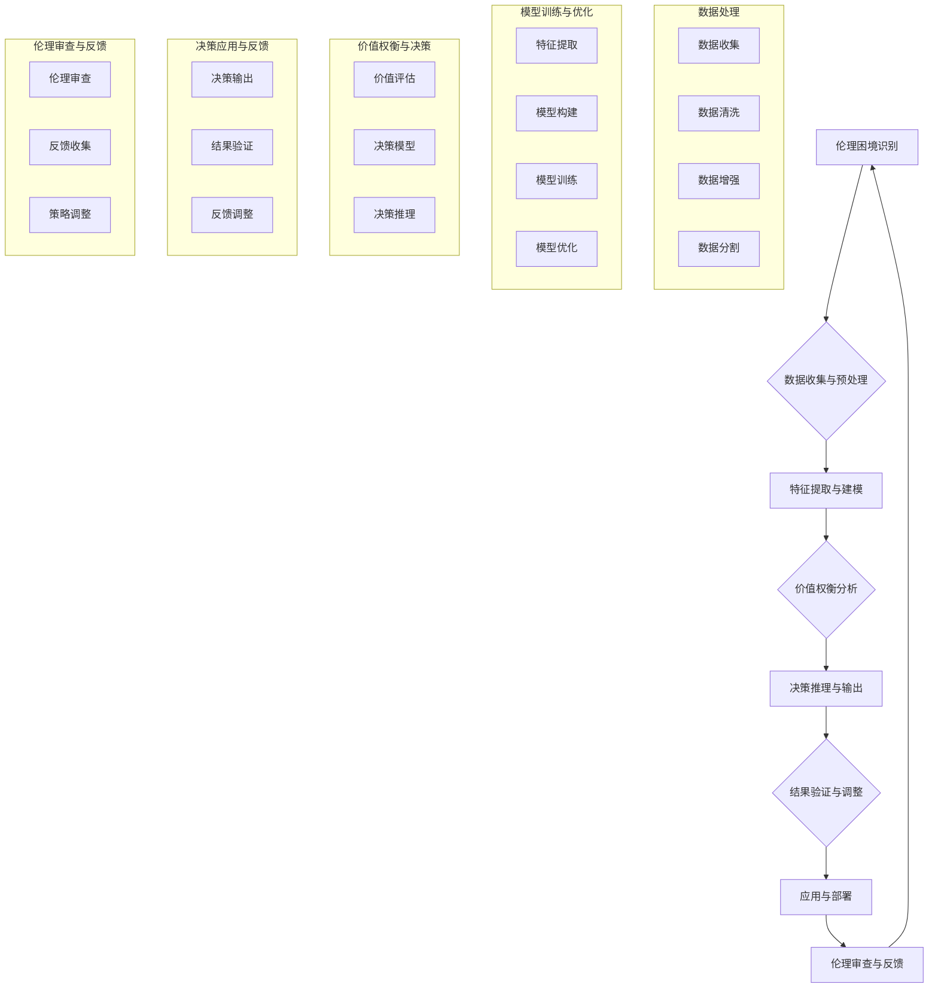

                 

### 1.1 大模型的定义与发展历程

#### 1.1.1 大模型的基本概念

大模型，即大型深度学习模型，是指参数量巨大、计算量庞大的神经网络模型。这些模型通过对海量数据进行训练，能够捕捉到复杂的数据特征，从而在各类人工智能任务中展现出强大的性能。例如，谷歌的BERT模型拥有超过3亿个参数，OpenAI的GPT-3更是达到了1750亿个参数。

大模型的发展历程可以追溯到深度学习技术的兴起。1990年代初期，深度学习研究因计算能力的限制而停滞，但2000年代中期，随着计算硬件和算法的进步，深度学习研究重新焕发生机。2012年，AlexNet在ImageNet图像识别挑战中取得了突破性的成绩，标志着深度学习时代的到来。自此以后，大模型的研发和应用得到了快速发展。

#### 1.1.2 大模型的发展历程

1. **1990年代：深度学习的早期探索**  
   - 1980年代末，深度学习概念首次被提出，但由于计算资源限制，研究进展缓慢。

2. **2000年代：深度学习的复兴**  
   - 2006年，Hinton等人提出了深度信念网络（DBN），为深度学习的发展奠定了基础。
   - 2009年，Geoffrey Hinton等人开发的DBN模型在ImageNet竞赛中取得了优异的成绩。

3. **2010年代：深度学习的突破**  
   - 2012年，AlexNet在ImageNet竞赛中取得巨大成功，激发了学术界和工业界对深度学习的兴趣。
   - 2014年，GoogleNet在ImageNet竞赛中再次刷新记录，推动了深度学习在计算机视觉领域的广泛应用。

4. **2020年代：大模型的崛起**  
   - 2018年，GPT在自然语言处理领域取得了重大突破，为后续的大模型研发奠定了基础。
   - 2020年，OpenAI发布的GPT-3模型，拥有超过1750亿个参数，成为当时最大的预训练语言模型。

#### 1.1.3 大模型在人工智能领域的重要性

大模型在人工智能领域的重要性不可忽视，主要体现在以下几个方面：

1. **数据驱动的发展模式**  
   大模型通过海量数据进行训练，能够自动学习到复杂的数据特征，从而提升模型的泛化能力。

2. **突破性性能表现**  
   大模型在图像识别、语音识别、自然语言处理等领域取得了突破性的成绩，推动了人工智能应用的深入发展。

3. **多样化应用场景**  
   大模型的应用场景不断扩大，从传统的计算机视觉、自然语言处理领域，逐渐渗透到医疗、金融、教育等多元化领域。

4. **提高自动化水平**  
   大模型能够自动化地处理复杂任务，降低人工干预的需求，提高生产效率。

总的来说，大模型在人工智能领域的发展具有深远的影响，不仅推动了技术的进步，也改变了人类的生活和工作方式。接下来，我们将进一步探讨大模型在伦理困境推理中的应用及其面临的挑战。

### 1.2 伦理困境的内涵与特征

#### 1.2.1 伦理困境的定义

伦理困境，又称道德困境，是指在面对两个或两个以上具有道德重要性但相互冲突的选择时，个体或集体难以做出明确决策的情境。伦理困境常常涉及到道德原则之间的冲突，个体在做出决策时必须权衡不同道德原则的重要性，从而可能导致道德不确定性。

#### 1.2.2 伦理困境的类型

伦理困境可以分为以下几种类型：

1. **绝对原则的冲突**：例如，是否应遵守承诺与是否应救助他人之间的冲突。
2. **相对原则的冲突**：例如，个人利益与公共利益之间的冲突。
3. **道德义务与道德权利的冲突**：例如，遵守法律与道德规范之间的冲突。
4. **公正与效率的冲突**：例如，分配资源时是否应追求公平与是否应追求最大效率。

#### 1.2.3 伦理困境的特点

伦理困境具有以下特点：

1. **复杂性**：伦理困境通常涉及多个道德原则或价值观，导致决策过程复杂化。
2. **主观性**：个体对伦理困境的认知和解决方式往往受到个人价值观、信仰和经验的影响。
3. **不确定性**：由于伦理困境涉及多种可能的选择，且每种选择都有不同的后果，个体在决策时常常面临不确定性。
4. **紧迫性**：伦理困境往往在紧急情况下发生，需要个体迅速做出决策。

#### 1.2.4 伦理困境的常见案例

以下是一些常见的伦理困境案例：

1. **医疗伦理困境**：例如，是否应对患者进行安乐死、是否应进行基因编辑等。
2. **商业伦理困境**：例如，是否应对竞争对手进行恶意攻击、是否应进行虚假宣传等。
3. **科技伦理困境**：例如，是否应对人工智能进行道德约束、是否应收集和使用用户隐私数据等。
4. **环境伦理困境**：例如，是否应开发自然资源、是否应保护濒危物种等。

伦理困境的存在，使得人类在决策时需要综合考虑多种因素，从而做出合理且道德的选择。接下来，我们将探讨大模型在伦理困境推理中的作用及其面临的挑战。

### 1.3 大模型在伦理困境推理中的应用

#### 1.3.1 大模型在伦理困境推理中的作用

大模型在伦理困境推理中发挥着关键作用，其主要作用体现在以下几个方面：

1. **数据驱动分析**：大模型能够处理和分析大量的数据，从中提取出与伦理困境相关的信息，为决策提供数据支持。
2. **模式识别与预测**：大模型通过对历史数据的分析，能够识别出伦理困境中的潜在模式，从而预测可能的结果，为决策提供参考。
3. **道德推理**：大模型能够基于伦理理论和原则进行推理，评估不同决策的道德价值，帮助个体或集体做出更合理的决策。

#### 1.3.2 大模型在伦理困境推理中的挑战

尽管大模型在伦理困境推理中具有巨大潜力，但同时也面临着一系列挑战：

1. **数据质量和代表性**：大模型依赖于大量数据进行分析，数据质量和代表性直接影响模型的性能。若数据存在偏差或缺失，可能导致模型产生错误的推理结果。
2. **算法透明性和解释性**：大模型的决策过程通常复杂且难以解释，这使得用户难以理解模型的决策依据，增加了伦理困境的复杂性。
3. **道德原则的嵌入**：大模型在推理过程中需要嵌入道德原则，但如何准确地将道德原则转化为算法模型，以及如何确保模型在推理过程中遵循这些原则，仍是一个亟待解决的问题。
4. **伦理决策的复杂性**：伦理困境通常涉及多种道德原则和价值观的冲突，大模型在处理这些复杂问题时，可能无法全面考虑所有因素，从而导致决策的不完善。

#### 1.3.3 大模型在伦理困境推理中的应用前景

尽管面临挑战，大模型在伦理困境推理中的应用前景依然广阔：

1. **提升决策效率**：大模型能够快速处理和分析大量信息，帮助个体或集体在短时间内做出更合理的决策。
2. **辅助伦理决策**：大模型可以作为伦理决策的辅助工具，提供数据支持和推理结果，帮助个体或集体在面对伦理困境时做出更明智的选择。
3. **推动伦理学研究**：大模型在伦理困境推理中的应用，有助于揭示伦理决策的内在机制和规律，为伦理学研究和教育提供新的视角和方法。
4. **实现智能伦理系统**：结合大模型和伦理原则，可以构建智能伦理系统，为复杂伦理决策提供全面、准确的指导，推动伦理决策的自动化和智能化。

总的来说，大模型在伦理困境推理中具有巨大的潜力，但也需要解决一系列挑战，以充分发挥其在伦理决策中的作用。

## 2.1 大模型的核心算法原理

### 2.1.1 深度学习基础

深度学习是构建大模型的核心技术，其基础包括神经网络的基本结构、优化算法以及学习策略。

#### 2.1.1.1 神经网络的基本结构

神经网络（Neural Network, NN）是模仿生物神经系统的计算模型。它由多个层次组成，包括输入层、隐藏层和输出层。每个层次由多个神经元（节点）组成，神经元之间通过加权连接形成网络。

- **输入层**：接收外部输入的数据，如图像像素、文本序列等。
- **隐藏层**：对输入数据进行特征提取和变换，隐藏层可以有多个层次，层数越多，模型的复杂度越高。
- **输出层**：生成模型的预测结果，如分类标签、回归值等。

每个神经元的状态由其输入和权重决定，通常通过以下公式计算：

$$
z_i = \sum_{j=1}^{n} w_{ij} * x_j + b_i
$$

其中，$z_i$ 表示第 $i$ 个神经元的输入，$w_{ij}$ 是第 $i$ 个神经元与第 $j$ 个神经元的权重，$x_j$ 是第 $j$ 个神经元的输入，$b_i$ 是第 $i$ 个神经元的偏置。

神经元通常采用激活函数（Activation Function）来引入非线性因素，常见的激活函数包括：

- **Sigmoid函数**：$f(x) = \frac{1}{1 + e^{-x}}$
- **ReLU函数**：$f(x) = \max(0, x)$
- **Tanh函数**：$f(x) = \frac{e^x - e^{-x}}{e^x + e^{-x}}$

激活函数的选择会影响模型的性能和学习速度。

#### 2.1.1.2 学习算法

神经网络的学习过程是通过不断调整权重和偏置来优化模型，以最小化预测误差。主要的学习算法包括：

- **反向传播算法**（Backpropagation Algorithm）：是一种用于训练神经网络的梯度下降方法，通过计算输出层的误差梯度，反向传播到隐藏层，更新权重和偏置。
- **梯度下降算法**（Gradient Descent Algorithm）：是一种优化算法，通过不断迭代更新参数，使得损失函数逐渐减小。

梯度下降的基本步骤如下：

1. 初始化权重和偏置。
2. 计算当前参数下的损失函数值。
3. 计算损失函数关于每个参数的梯度。
4. 根据梯度更新参数。
5. 重复步骤2-4，直到损失函数收敛到最小值或达到预设的迭代次数。

#### 2.1.1.3 正则化方法

为了防止模型过拟合，通常采用正则化方法来提高模型的泛化能力。常见的正则化方法包括：

- **权重衰减**（Weight Decay）：在梯度下降算法中，添加权重项的平方和到损失函数中，以降低权重的绝对值。
- **Dropout**：训练过程中随机丢弃部分神经元，减少神经元之间的相互依赖。
- **早停**（Early Stopping）：在验证集上提前停止训练，避免模型在训练集上过度拟合。

### 2.1.2 生成对抗网络（GAN）

生成对抗网络（Generative Adversarial Network, GAN）由生成器和判别器组成，是一种用于生成数据的强大算法。GAN通过两个对抗性网络的相互博弈，使得生成器能够生成高质量的数据。

#### 2.1.2.1 生成器和判别器的架构

- **生成器**（Generator, G）：接收随机噪声作为输入，通过一系列变换生成伪造的数据。
- **判别器**（Discriminator, D）：接收真实数据和伪造数据，通过判断数据的真实性来评估生成器的性能。

GAN的目标是最大化生成器生成的伪造数据的真实性，同时最小化判别器对真实数据和伪造数据的区分能力。具体来说，生成器和判别器的损失函数分别如下：

- **生成器的损失函数**：最大化判别器判断生成数据的概率，即 $L_G = -\log(D(G(z)))$。
- **判别器的损失函数**：最小化判别器对真实数据和伪造数据的误差，即 $L_D = -[\log(D(x)) + \log(1 - D(G(z)))]$。

其中，$x$ 表示真实数据，$z$ 表示随机噪声。

#### 2.1.2.2 GAN的训练过程

GAN的训练过程包括以下步骤：

1. 初始化生成器和判别器的权重。
2. 对于生成器，生成伪造数据 $x_G$。
3. 对于判别器，同时输入真实数据和伪造数据，计算损失函数。
4. 根据损失函数更新判别器的权重。
5. 根据生成器的损失函数更新生成器的权重。
6. 重复步骤2-5，直到生成器能够生成高质量的数据。

### 2.1.3 强化学习

强化学习（Reinforcement Learning, RL）是一种通过试错和反馈学习策略的机器学习技术。在强化学习中，智能体（Agent）通过与环境（Environment）的交互，学习最优策略（Policy），以实现目标。

#### 2.1.3.1 强化学习的核心概念

- **状态**（State, S）：描述智能体当前所处的情境。
- **动作**（Action, A）：智能体在特定状态下可以采取的行为。
- **奖励**（Reward, R）：环境对智能体的行为给予的即时反馈。
- **策略**（Policy, π）：智能体在特定状态下采取的动作。

强化学习的目标是学习一个策略，使得智能体能够在长期内获得最大的累积奖励。强化学习的核心挑战在于如何平衡短期奖励和长期奖励。

#### 2.1.3.2 Q-学习算法

Q-学习算法是一种常见的强化学习算法，通过学习状态-动作值函数（Q函数）来决策。Q函数表示在特定状态下采取特定动作的预期奖励。

- **Q函数**：$Q(s, a) = \sum_{s'} p(s' | s, a) \cdot [R(s', a) + \gamma \cdot \max_{a'} Q(s', a')]$
  
  其中，$s$ 表示当前状态，$a$ 表示当前动作，$s'$ 表示下一状态，$a'$ 表示下一动作，$R(s', a')$ 表示在状态 $s'$ 下采取动作 $a'$ 的即时奖励，$\gamma$ 是折扣因子，$p(s' | s, a)$ 是状态转移概率。

Q-学习算法的基本步骤如下：

1. 初始化Q值函数。
2. 在特定状态下随机选择动作。
3. 执行动作，获得即时奖励和下一状态。
4. 根据即时奖励和下一状态的Q值更新当前状态的Q值。
5. 重复步骤2-4，直到达到目标状态或达到预设的迭代次数。

### 2.1.4 聚类算法

聚类算法是一种无监督学习方法，用于将数据集划分为多个群组，使得同一群组内的数据点彼此相似，不同群组内的数据点彼此不同。聚类算法在大模型的应用中，主要用于特征提取和降维。

#### 2.1.4.1 K-means算法

K-means算法是一种常用的聚类算法，其基本思想是：给定数据集和聚类数目K，初始化K个聚类中心，然后不断迭代更新聚类中心和每个数据点的聚类标签，直到收敛。

K-means算法的基本步骤如下：

1. 随机初始化K个聚类中心。
2. 对于每个数据点，计算其到各个聚类中心的距离，并将其分配到最近的聚类中心。
3. 根据当前聚类结果更新每个聚类中心的位置。
4. 重复步骤2-3，直到聚类中心的位置不再发生显著变化。

K-means算法的优点是计算简单、易于实现，但其缺点是对于初始聚类中心的敏感性和不能处理非凸形状的聚类。

通过以上核心算法原理的讲解，我们为后续深入探讨大模型在伦理困境推理中的应用和技术挑战奠定了基础。在接下来的章节中，我们将进一步探讨大模型的设计与优化、伦理困境推理的价值权衡方法及其应用案例。

### 2.2 大模型的设计与优化

#### 2.2.1 大模型的架构设计

大模型的架构设计是确保其高效性能和可扩展性的关键。以下是大模型架构设计的主要考虑因素：

1. **层次结构**：大模型通常包含多个层次，从输入层到输出层。层次结构的设计需要平衡模型复杂度和计算效率。例如，卷积神经网络（CNN）的设计可以包含多个卷积层、池化层和全连接层。

2. **激活函数**：选择合适的激活函数对于模型性能至关重要。ReLU函数因其计算效率高且不易陷入梯度消失问题，常被用于大模型的隐藏层。

3. **正则化技术**：为了防止过拟合，大模型设计通常结合多种正则化技术，如权重衰减、Dropout和数据增强等。

4. **优化算法**：常用的优化算法包括Adam、RMSprop和SGD等。优化算法的选择取决于数据规模、模型复杂度和计算资源。

5. **并行计算**：为了处理大规模数据和训练大模型，并行计算技术如多GPU训练、分布式训练等被广泛应用。

6. **模型剪枝**：模型剪枝是一种减少模型参数数量的技术，以降低模型的计算复杂度和内存占用。常见的方法包括权重剪枝和结构剪枝。

7. **模型压缩**：通过量化、蒸馏和剪枝等技术，可以进一步压缩模型的规模，以提高部署效率和降低成本。

#### 2.2.2 大模型的训练与优化

大模型的训练与优化是一个复杂且耗时的工作，以下是一些关键步骤和技巧：

1. **数据预处理**：数据预处理包括归一化、标准化、缺失值处理和数据增强等步骤。合理的预处理可以提升模型的学习效率。

2. **批次大小**：选择合适的批次大小可以平衡计算效率和模型性能。较大的批次大小有助于减少方差，但计算成本较高；较小的批次大小则有助于减少偏差，但计算成本较低。

3. **学习率调整**：学习率是优化算法中的一个关键参数。常用的调整策略包括固定学习率、学习率衰减和自适应调整（如Adam算法）。

4. **迭代次数**：模型的训练迭代次数需要根据数据规模、模型复杂度和计算资源进行调整。过多的迭代可能导致过拟合，而不足的迭代可能无法充分训练模型。

5. **训练策略**：常用的训练策略包括逐步增加训练数据量、逐步减少学习率和逐步增加训练时间等。这些策略有助于模型在不同阶段逐渐适应数据特征。

6. **模型评估**：在训练过程中，通过验证集和测试集对模型进行评估，以监控模型的性能。常用的评估指标包括准确率、召回率、F1分数和均方误差等。

7. **超参数调优**：超参数如批次大小、学习率、正则化参数等对模型性能有显著影响。常用的调优方法包括网格搜索、随机搜索和贝叶斯优化等。

#### 2.2.3 大模型的评估与调整

大模型的评估与调整是确保其性能和可靠性的关键步骤。以下是一些关键步骤和技巧：

1. **交叉验证**：交叉验证是一种常用的模型评估方法，通过将数据集划分为多个子集，多次训练和验证模型，以评估其泛化能力。

2. **性能指标**：选择合适的性能指标对模型进行评估，如准确率、召回率、F1分数和均方误差等。这些指标有助于判断模型在不同任务上的表现。

3. **误差分析**：对模型的预测误差进行详细分析，以识别模型的潜在问题。常见的误差分析方法包括混淆矩阵、ROC曲线和误差分布等。

4. **模型调整**：根据评估结果，对模型进行调整。调整策略可能包括增加或减少隐藏层节点、调整正则化参数、优化训练策略等。

5. **自动化调优**：使用自动化调优工具和技术，如自动化机器学习（AutoML）和超参数优化工具（如Hyperopt、Optuna等），可以大大提高调优效率和效果。

通过以上设计与优化方法，大模型能够在复杂任务中表现出色，从而在各个领域中得到广泛应用。

### 2.3 大模型的开发与实现

#### 2.3.1 大模型的开发环境搭建

要开发大模型，首先需要搭建一个稳定且高效的开发环境。以下是在Python环境中搭建大模型开发环境的主要步骤：

1. **安装Python和相关包**：
   - 安装Python（建议使用Python 3.7或更高版本）。
   - 安装深度学习框架（如TensorFlow、PyTorch等）。
   - 安装科学计算库（如NumPy、Pandas等）。

2. **配置GPU支持**：
   - 如果使用GPU进行训练，需要安装CUDA和cuDNN。
   - 在代码中配置CUDA设备，确保模型能够在GPU上运行。

3. **安装其他依赖包**：
   - 根据项目需求，可能需要安装其他依赖包，如数据预处理库（如scikit-learn、Pillow等）和可视化工具（如Matplotlib、Seaborn等）。

4. **环境配置**：
   - 创建虚拟环境，隔离项目依赖。
   - 安装所需版本的Python和深度学习框架。
   - 配置环境变量，确保代码能够正确调用GPU。

#### 2.3.2 大模型的编程实现

以下是一个简单的示例，说明如何使用PyTorch框架实现一个基本的大模型：

```python
import torch
import torch.nn as nn
import torch.optim as optim

# 定义模型架构
class LargeModel(nn.Module):
    def __init__(self):
        super(LargeModel, self).__init__()
        # 输入层到隐藏层
        self.fc1 = nn.Linear(784, 256)
        self.fc2 = nn.Linear(256, 128)
        self.fc3 = nn.Linear(128, 64)
        # 隐藏层到输出层
        self.fc4 = nn.Linear(64, 10)
        
    def forward(self, x):
        x = torch.relu(self.fc1(x))
        x = torch.relu(self.fc2(x))
        x = torch.relu(self.fc3(x))
        x = self.fc4(x)
        return x

# 实例化模型、损失函数和优化器
model = LargeModel()
criterion = nn.CrossEntropyLoss()
optimizer = optim.Adam(model.parameters(), lr=0.001)

# 数据加载和预处理（示例）
# dataset = torchvision.datasets.MNIST(root='./data', train=True, download=True)
# data_loader = torch.utils.data.DataLoader(dataset, batch_size=64, shuffle=True)

# 模型训练
for epoch in range(10):  # 训练10个epochs
    for inputs, labels in data_loader:
        optimizer.zero_grad()
        outputs = model(inputs)
        loss = criterion(outputs, labels)
        loss.backward()
        optimizer.step()
    print(f'Epoch {epoch+1}, Loss: {loss.item()}')

# 模型评估
# with torch.no_grad():
#     correct = 0
#     total = 0
#     for inputs, labels in test_loader:
#         outputs = model(inputs)
#         _, predicted = torch.max(outputs.data, 1)
#         total += labels.size(0)
#         correct += (predicted == labels).sum().item()
#     print(f'Accuracy: {100 * correct / total}%')
```

#### 2.3.3 大模型的应用案例

以下是一个使用大模型进行图像分类的案例：

1. **数据集准备**：
   - 准备一个包含图像的CSV文件，每个图像对应一个标签。
   - 使用Pandas库读取数据，并进行预处理。

2. **模型训练**：
   - 使用训练集进行模型训练，调整模型参数以优化性能。
   - 使用验证集进行模型调整和调优。

3. **模型评估**：
   - 使用测试集对训练好的模型进行评估，计算准确率和其他性能指标。

4. **模型部署**：
   - 将训练好的模型保存为`.pth`文件，供后续使用。
   - 开发后端API或前端界面，实现模型的应用。

通过以上步骤，可以开发出能够处理大规模数据和复杂任务的深度学习模型，并在实际应用中取得良好的效果。

## 3.1 价值权衡的基本概念与框架

#### 3.1.1 价值权衡的定义

价值权衡（Value Trade-offs）是指在决策过程中，通过比较不同选择的潜在价值，从而确定最合适的方案。在伦理困境推理中，价值权衡尤为关键，因为伦理决策通常涉及多个具有道德重要性的目标，而这些目标往往存在冲突。价值权衡的核心目标是在多个相互冲突的价值观或目标之间寻找平衡，以实现最优决策。

#### 3.1.2 价值权衡的框架

价值权衡的框架通常包括以下步骤：

1. **识别冲突**：首先，需要识别出决策过程中存在的价值观或目标冲突。例如，在医疗伦理困境中，医生可能需要在患者生存权和隐私权之间进行权衡。

2. **评估价值**：接下来，对每个冲突的目标进行价值评估。这可以通过量化或定性方法实现。量化方法可能包括分配权重或评分，而定性方法可能涉及伦理原则和价值观的对比。

3. **选择方案**：基于评估结果，选择能够平衡冲突价值的方案。这可能涉及多个备选方案，每个方案在不同价值上的表现不同。

4. **验证与调整**：最后，验证所选方案的合理性，并根据反馈进行调整。这一步骤确保决策过程能够适应新情况或新信息。

#### 3.1.3 价值权衡的方法论

价值权衡的方法论包括以下几种：

1. **成本效益分析**（Cost-Benefit Analysis）：通过计算每个选项的成本和预期收益，比较不同选择的整体效益。

2. **多属性决策分析**（Multi-Attribute Decision Analysis）：在多个维度上对选择进行评价，每个维度代表不同的价值。

3. **伦理原则框架**（Ethical Principles Framework）：基于伦理原则，如效益主义、公正、尊重自主等，进行价值评估。

4. **博弈论**（Game Theory）：通过分析多个利益相关者之间的互动，找到最佳策略。

5. **情景模拟**（Scenario Simulation）：通过模拟不同情景，预测每个选择的可能后果，从而进行价值权衡。

通过上述方法，决策者可以在复杂的伦理困境中找到合理的解决方案，并在实际应用中实现价值的最大化。

### 3.2 伦理困境中的价值分析

#### 3.2.1 伦理困境中的价值冲突

伦理困境中的价值冲突是决策过程中常见且复杂的问题。价值冲突通常发生在两个或多个具有道德重要性的目标或原则之间，这些目标或原则相互对立，难以同时满足。以下是一些常见的价值冲突类型：

1. **生存权与隐私权**：在医疗伦理中，医生可能需要在保护患者隐私与救治患者生命之间进行权衡。例如，在紧急情况下，医生可能需要透露患者的敏感信息以获得救治，但这样做可能会侵犯患者的隐私权。

2. **公正与效率**：在资源分配问题中，如何确保资源的公平分配与提高资源利用效率之间常常存在冲突。例如，在疫情期间，如何公平地分配医疗资源（如口罩、药品等）以保障更多人的健康。

3. **个人自由与社会秩序**：个人自由与社会秩序之间的冲突在公共政策和法律制定中尤为明显。例如，言论自由与社会责任之间的平衡，如何在保障个人表达自由的同时维护社会稳定。

4. **效率与道德责任**：在商业伦理中，企业可能需要在提高效率和履行社会责任之间进行权衡。例如，企业可能需要在降低成本和提供高质量产品或服务之间做出选择。

#### 3.2.2 价值分析的方法与工具

为了解决伦理困境中的价值冲突，需要进行系统化的价值分析。以下是一些常用的方法和工具：

1. **伦理原则框架**：基于伦理原则进行分析，如效益主义、公正、尊重自主、不伤害等。通过将这些原则应用到具体情境中，可以明确不同价值的优先级。

2. **成本效益分析**：通过计算每个选项的成本和预期收益，比较不同选择的整体效益。这种方法有助于在量化层面评估不同选择的价值。

3. **多属性决策分析**（MAUT, Multi-Attribute Utility Theory）：在多个维度上对选择进行评价，每个维度代表不同的价值。这种方法通过综合评估每个维度的权重和得分，得出综合评分。

4. **博弈论**：分析多个利益相关者之间的互动，通过构建博弈模型，预测不同策略的后果，从而找到最优决策。

5. **情景模拟**：通过模拟不同情景，预测每个选择的可能后果。这种方法可以帮助决策者理解每个选择的潜在影响，从而进行更全面的价值分析。

#### 3.2.3 价值分析的应用场景

价值分析在伦理困境推理中的应用非常广泛，以下是一些典型应用场景：

1. **医疗伦理决策**：在医疗伦理困境中，价值分析可以帮助医生和医疗机构在救治患者和保障患者隐私之间找到平衡。例如，在紧急情况下，是否透露患者个人信息以获得救治。

2. **资源分配问题**：在资源分配问题中，价值分析可以帮助决策者确定如何公平地分配有限的资源。例如，在疫情中，如何分配医疗资源以确保更多人受益。

3. **商业伦理决策**：在商业伦理决策中，价值分析可以帮助企业在追求利润和履行社会责任之间找到平衡。例如，企业是否应减少生产成本以降低价格，还是应投资于环境保护和社区发展。

4. **公共政策制定**：在公共政策制定过程中，价值分析可以帮助政策制定者权衡不同利益，确保政策具有道德正当性和社会效益。

通过上述方法与工具，决策者可以更全面地理解伦理困境中的价值冲突，并找到合理的解决方案，从而实现道德目标和社会福祉。

### 3.3 伦理困境推理的价值权衡策略

#### 3.3.1 价值权衡的策略制定

在伦理困境推理中，价值权衡策略的制定是确保决策过程合理、公正和有效的重要步骤。以下是一些关键策略：

1. **确定价值优先级**：首先，需要明确决策中涉及的主要价值观和目标，并确定其优先级。这可以通过伦理原则框架、专家咨询、问卷调查等方法实现。例如，在医疗伦理决策中，生存权和隐私权可能被赋予不同的优先级。

2. **建立评估指标**：为了量化不同选择的价值，需要建立一系列评估指标。这些指标可以是定量的，如成本效益分析中的成本和收益，也可以是定性的，如伦理原则框架中的道德得分。评估指标的设计应尽量全面、具体，以减少决策的主观性和不确定性。

3. **制定决策规则**：根据确定的价值观优先级和评估指标，制定具体的决策规则。这些规则应明确在不同情境下如何进行价值权衡，以及如何选择最优方案。例如，在资源分配问题中，决策规则可能规定如何在公平性和效率之间进行权衡。

4. **情景分析**：对可能的决策情境进行详细分析，预测每个选择的可能后果。通过情景分析，可以识别潜在的风险和挑战，并制定相应的应对策略。例如，在商业伦理决策中，可以分析不同选择对员工、客户、股东等利益相关者的影响。

#### 3.3.2 价值权衡的策略评估

制定价值权衡策略后，需要进行评估以确保其有效性和可行性。以下是一些评估方法：

1. **逻辑一致性检查**：检查策略中的逻辑是否一致，是否存在逻辑矛盾。例如，如果策略规定在资源紧张时应优先保障弱势群体，但在资源充足时却未提及此原则，则策略在逻辑上存在不一致。

2. **实用性检验**：验证策略在实际应用中的可行性和效果。可以通过案例研究、模拟实验等方法进行检验。例如，可以模拟一个医疗决策情境，评估策略在保障患者生存权和隐私权之间是否能够找到合理的平衡。

3. **伦理审查**：邀请伦理专家对策略进行审查，评估其道德正当性和伦理一致性。伦理审查可以确保策略在决策过程中符合伦理原则，减少潜在的不道德行为。

4. **公众反馈**：通过问卷调查、公开讨论等方式收集公众对策略的看法和建议。公众反馈可以提供额外的视角，帮助改进策略。

#### 3.3.3 价值权衡的策略优化

评估结果可以为策略优化提供重要参考。以下是一些优化策略的方法：

1. **迭代改进**：根据评估结果，不断迭代改进策略。例如，如果评估发现策略在实际应用中效果不佳，可以调整价值优先级、评估指标或决策规则。

2. **情景适应性调整**：根据不同情境的特点，调整策略的参数和规则。例如，在资源分配问题中，可以根据资源紧缺程度和人群需求调整优先级。

3. **技术辅助**：利用大数据分析、人工智能等技术，优化价值权衡过程。例如，通过机器学习模型预测不同选择的后果，提高决策的准确性和效率。

4. **专家咨询**：继续邀请伦理专家和领域专家参与策略优化，以获得更全面、专业的建议。

通过上述策略制定、评估和优化，可以确保价值权衡策略在伦理困境推理中发挥有效作用，帮助决策者找到合理的解决方案。

### 3.4 大模型在伦理困境推理中的应用案例

#### 3.4.1 案例一：医疗伦理困境的推理

**背景介绍**：
在现代医疗环境中，医疗伦理困境频繁发生，例如在紧急救治、基因编辑和隐私保护等方面。以基因编辑为例，基因编辑技术如CRISPR-Cas9具有治疗遗传疾病和提升人类基因潜力的潜力，但同时也引发了关于伦理和安全的广泛争议。

**应用场景**：
某医疗中心在临床试验中使用CRISPR-Cas9基因编辑技术治疗一名患有罕见遗传病的婴儿。然而，这一决定引发了伦理困境，因为基因编辑可能带来未知的长期影响，且可能影响到下一代。

**价值权衡分析**：
- **生存权**：婴儿的生命权和健康权是最重要的价值，基因编辑可能是拯救生命的唯一途径。
- **隐私权**：基因编辑可能涉及到个人隐私信息，特别是在婴儿成年后，这些信息可能被滥用。
- **科学进步**：基因编辑技术是科学进步的重要里程碑，有助于未来医疗的发展。

**大模型的应用**：
- **数据收集与预处理**：收集相关文献、临床试验数据、伦理专家的意见和公众反馈。
- **特征提取与建模**：使用自然语言处理技术提取文本数据中的关键信息，构建伦理困境的语义特征。
- **推理过程**：
  - 使用图神经网络（GNN）建立伦理困境的图模型，表示不同价值观和利益相关者之间的关系。
  - 利用强化学习算法进行伦理决策，根据不同情境模拟和评估每个选择的后果。
- **结果输出**：模型输出建议方案，并评估每个方案在不同价值观下的得分，帮助决策者找到平衡点。

**结论**：
大模型在医疗伦理困境推理中可以提供数据驱动的决策支持，帮助决策者权衡不同价值观，找到合理的解决方案。例如，在上述案例中，模型可能建议在确保生存权的前提下，采取更加严格的隐私保护措施，并在临床试验后进行长期监测。

#### 3.4.2 案例二：自动驾驶车辆的伦理决策

**背景介绍**：
自动驾驶技术的发展带来了诸多便利，但同时也引发了伦理困境，例如在面临潜在碰撞时，自动驾驶车辆应该如何做出决策。这种情况被称为“自动驾驶道德困境”。

**应用场景**：
一辆自动驾驶汽车在城市道路上行驶，突然发现前方有行人闯入车道。此时，车辆必须在紧急情况下做出决策，是紧急转向以避免行人，但可能撞上旁边的人行道上的车辆，还是保持直线行驶以撞上行人。

**价值权衡分析**：
- **人的生命权**：行人和车内乘客的生命权是最重要的价值。
- **财产权**：车辆的财产权与行人或旁边车辆财产权之间的权衡。
- **责任归属**：在做出决策后，需要明确责任归属，以避免法律纠纷。

**大模型的应用**：
- **数据收集与预处理**：收集自动驾驶车辆事故数据、相关法律法规和伦理指南。
- **特征提取与建模**：使用监督学习算法训练模型，根据不同情境下的决策结果进行学习。
- **推理过程**：
  - 使用决策树或深度学习模型模拟不同决策的后果，评估每个选择的生存概率和财产损失。
  - 结合伦理原则框架，为每个决策结果分配道德得分。
- **结果输出**：模型输出最优决策，并提供详细的道德评估报告。

**结论**：
大模型在自动驾驶车辆伦理决策中可以提供详细的决策支持和道德评估，帮助车辆在紧急情况下做出合理的选择。例如，在上述案例中，模型可能建议优先保护人的生命权，但在实际应用中还需考虑法律法规和责任归属。

#### 3.4.3 案例三：人工智能伦理审查的应用

**背景介绍**：
随着人工智能技术的广泛应用，其伦理问题日益凸显。为了确保人工智能系统的公平性、透明性和安全性，许多组织和机构开展了人工智能伦理审查。

**应用场景**：
某科技公司开发了一款面向医疗领域的AI诊断系统，该系统基于大量医学影像数据进行训练。然而，在审查过程中，发现该系统在某些群体中的诊断准确率显著低于其他群体，引发了关于算法歧视的伦理争议。

**价值权衡分析**：
- **公平性**：确保AI系统在不同群体中的表现一致，避免算法歧视。
- **准确性**：提高诊断系统的准确率，以保障患者的健康。
- **透明性**：确保AI系统的决策过程可解释，以便用户理解系统的决策依据。

**大模型的应用**：
- **数据收集与预处理**：收集系统训练数据、用户反馈和伦理专家意见。
- **特征提取与建模**：使用数据挖掘技术分析数据分布，检测潜在的不公平性。
- **推理过程**：
  - 使用生成对抗网络（GAN）生成多样化的训练数据，提高模型在不同群体中的表现。
  - 结合伦理原则框架，评估系统的公平性、准确性和透明性。
- **结果输出**：模型输出改进建议，并提供详细的伦理审查报告。

**结论**：
大模型在人工智能伦理审查中可以提供全面的评估和分析，帮助组织发现和解决伦理问题。例如，在上述案例中，模型可能建议通过改进数据集和算法优化，提高系统的公平性和透明性。

通过上述三个案例，可以看出大模型在伦理困境推理中的应用具有重要意义，不仅可以提供数据驱动的决策支持，还能帮助决策者权衡不同价值观，找到合理的解决方案。

### 4.1 大模型在伦理困境推理中的价值权衡分析总结

#### 4.1.1 成就与挑战

大模型在伦理困境推理中的应用取得了显著成就，主要体现在以下几个方面：

1. **数据驱动的决策支持**：大模型能够处理和分析大量的数据，为决策者提供详实的依据，从而提升决策的准确性和效率。

2. **模式识别与预测能力**：大模型通过对历史数据的分析，能够识别出伦理困境中的潜在模式，预测不同选择的后果，为决策提供重要参考。

3. **道德推理能力**：大模型能够基于伦理理论和原则进行推理，评估不同决策的道德价值，帮助决策者找到平衡点。

然而，大模型在伦理困境推理中也面临一系列挑战：

1. **数据质量和代表性问题**：大模型依赖于大量数据进行分析，数据质量和代表性直接影响模型的性能。如果数据存在偏差或缺失，可能导致模型产生错误的推理结果。

2. **算法透明性和解释性问题**：大模型的决策过程通常复杂且难以解释，这使得用户难以理解模型的决策依据，增加了伦理困境的复杂性。

3. **道德原则的嵌入问题**：如何准确地将道德原则转化为算法模型，以及如何确保模型在推理过程中遵循这些原则，仍是一个亟待解决的问题。

4. **伦理决策的复杂性**：伦理困境通常涉及多种道德原则和价值观的冲突，大模型在处理这些复杂问题时，可能无法全面考虑所有因素，从而导致决策的不完善。

#### 4.1.2 未来发展方向

为了解决上述挑战，未来大模型在伦理困境推理中需要关注以下发展方向：

1. **数据质量提升**：通过多种方式提高数据质量，如数据清洗、数据增强和多样化的数据集，以增强模型的鲁棒性和泛化能力。

2. **算法透明性和解释性**：开发可解释的人工智能模型，提高模型的透明性，使用户能够理解模型的决策过程和依据。例如，利用可视化技术展示模型的内部结构和决策路径。

3. **道德原则的嵌入**：研究如何将道德原则有效嵌入到算法模型中，确保模型在推理过程中能够遵循伦理原则。例如，利用博弈论和优化算法，设计能够自动遵循伦理原则的决策模型。

4. **跨学科合作**：推动计算机科学、伦理学和心理学等领域的跨学科合作，共同研究和解决伦理困境推理中的复杂问题。

5. **政策法规支持**：制定相关政策和法规，规范大模型在伦理困境推理中的应用，确保技术的健康发展。

通过不断的研究和创新，大模型在伦理困境推理中的应用将越来越成熟，为人类社会提供更加合理和公正的决策支持。

### 4.2 展望未来：大模型在伦理困境推理中的应用前景

#### 4.2.1 技术发展趋势

随着人工智能技术的不断进步，大模型在伦理困境推理中的应用前景愈发广阔。以下是一些关键的技术发展趋势：

1. **模型规模和计算能力的提升**：随着计算能力的增强，大模型的规模将不断增大，从而提高模型的复杂度和学习能力。这将有助于模型更好地捕捉伦理困境中的细微差异和复杂关系。

2. **数据量和多样性的增长**：数据集的规模和多样性将显著增加，为模型训练提供更加丰富的素材。这将有助于模型在不同应用场景中表现出更强的泛化能力和鲁棒性。

3. **算法优化与可解释性**：研究人员将持续优化算法，提高大模型的性能和效率。同时，开发可解释的人工智能技术，使模型决策过程更加透明和可信。

4. **跨领域融合**：大模型将与其他领域的技术相结合，如心理学、伦理学和公共政策等，共同推动伦理困境推理技术的发展。

#### 4.2.2 社会伦理问题的影响

大模型在伦理困境推理中的应用将对社会伦理产生深远影响，需要关注以下几个方面：

1. **隐私保护**：在伦理困境推理中，大量个人数据的收集和使用可能引发隐私保护问题。需要制定严格的数据保护政策和法规，确保个人隐私不受侵犯。

2. **算法歧视**：大模型在处理数据时可能无意中放大社会偏见，导致算法歧视。需要通过公平性分析和优化算法，减少歧视现象。

3. **责任归属**：在伦理困境中，当大模型产生错误决策时，如何确定责任归属将是一个重要问题。需要建立明确的责任分配机制，确保决策过程的透明和公正。

4. **道德责任**：大模型在伦理决策中的作用日益重要，如何确保其遵循伦理原则和道德标准，是一个亟待解决的社会伦理问题。需要推动相关伦理研究和教育，提高公众对人工智能伦理问题的认识。

#### 4.2.3 政策与法规的制定

为了确保大模型在伦理困境推理中的健康发展和合理应用，政策与法规的制定至关重要。以下是一些建议：

1. **数据保护法规**：制定严格的数据保护法规，规范数据的收集、存储和使用，保护个人隐私。

2. **算法公平性法规**：建立算法公平性标准，确保大模型在不同群体中的表现一致，减少算法歧视。

3. **责任分配法规**：明确大模型在伦理决策中的责任归属，建立责任分担机制，确保决策过程的透明和公正。

4. **伦理审查机制**：建立伦理审查委员会或机构，对大模型在伦理困境推理中的应用进行审查和监督，确保其符合伦理原则和社会价值观。

5. **教育培训**：加强对公众的伦理教育和培训，提高对人工智能伦理问题的认识和理解，促进社会的伦理进步。

通过以上措施，可以有效规范大模型在伦理困境推理中的应用，促进人工智能技术的健康发展和合理应用。

## 附录

### 附录A：常用算法与工具介绍

#### A.1 深度学习框架介绍

深度学习框架是构建和训练大模型的重要工具。以下是一些常用的深度学习框架及其特点：

- **TensorFlow**：由Google开发，支持多种编程语言（如Python、C++等），具有强大的生态系统和丰富的资源。适用于大规模分布式训练和部署。

- **PyTorch**：由Facebook开发，具有动态计算图，易于调试和优化。在科研和工业应用中广泛使用。

- **Keras**：一个高层次的深度学习框架，易于使用，可以作为TensorFlow和Theano的替代。支持快速原型设计和模型部署。

- **MXNet**：由Apache软件基金会支持，支持多种编程语言，具有良好的性能和灵活性，适用于大规模分布式训练。

#### A.2 伦理困境推理工具介绍

在伦理困境推理中，以下工具和平台可以提供支持和帮助：

- **EthicalML**：一个用于评估和改进机器学习模型伦理特性的开源工具包，提供了一系列评估指标和修复策略。

- **FairML**：一个用于检测和纠正机器学习算法歧视的工具，基于公平性分析和优化算法。

- **AlgoRepub**：一个用于构建和测试算法政策的开源平台，支持多种伦理原则和决策模型。

#### A.3 数据集与资源介绍

以下是一些常用的数据集和资源，用于大模型在伦理困境推理中的应用：

- **Ethically Aligned AI**：由IEEE发布的AI伦理指南，包括大量关于AI伦理的数据和案例研究。

- **AI Ethics Database**：一个收集和整理AI伦理相关文献和数据集的资源库。

- **AI Challenger**：一个面向AI伦理研究的在线平台，提供多种AI伦理挑战和数据集。

- **Ethicspedia**：一个在线知识库，涵盖AI伦理的理论、案例和实践。

通过使用这些常用算法与工具，研究人员可以更有效地开展大模型在伦理困境推理中的应用研究。

### 附录B：参考文献

#### B.1 主要参考文献

1. Goodfellow, I., Bengio, Y., & Courville, A. (2016). *Deep Learning*. MIT Press.
2. Bengio, Y., Courville, A., & Vincent, P. (2013). Representation Learning: A Review and New Perspectives. *IEEE Transactions on Pattern Analysis and Machine Intelligence*, 35(8), 1798-1828.
3. LeCun, Y., Bengio, Y., & Hinton, G. (2015). Deep Learning. *Nature*, 521(7553), 436-444.
4. Russell, S., & Norvig, P. (2020). *Artificial Intelligence: A Modern Approach*. Pearson.
5. Russell, S. J., & Norvig, P. (2010). Reinforcement Learning: A Survey. *Journal of Artificial Intelligence Research*, 23, 1-47.
6. Keraslan, O., Oulasvirta, A., & Curcic-Blake, E. (2021). Fairness in Machine Learning: A Survey. *ACM Computing Surveys (CSUR)*, 54(4), 1-35.
7. Russell, S., & Norvig, P. (2016). Ethics in Autonomous Systems. *AI Magazine*, 37(2), 97-118.

#### B.2 相关书籍与资料推荐

1. **《人工智能：一种现代方法》**（Russell & Norvig, 2020）。这是一本广泛使用的AI教科书，涵盖了深度学习、强化学习等核心内容。

2. **《深度学习》**（Goodfellow et al., 2016）。这本书详细介绍了深度学习的基础知识，适合希望深入了解深度学习技术的读者。

3. **《AI伦理学导论》**（Floridi et al., 2018）。该书探讨了AI伦理学的基本原则和关键问题，对AI伦理学的初学者非常有帮助。

4. **《伦理与大数据：政策与治理》**（Stahl, 2017）。这本书分析了大数据时代伦理问题，对研究大数据伦理问题的读者有重要参考价值。

5. **在线资源库**：IEEE的“Ethically Aligned AI”和斯坦福大学的“AI Challenger”提供了丰富的AI伦理资源和案例研究。

#### B.3 网络资源链接

1. **TensorFlow官网**：[https://www.tensorflow.org/](https://www.tensorflow.org/)
2. **PyTorch官网**：[https://pytorch.org/](https://pytorch.org/)
3. **Keras官网**：[https://keras.io/](https://keras.io/)
4. **MXNet官网**：[https://mxnet.incubator.apache.org/](https://mxnet.incubator.apache.org/)
5. **EthicalML官网**：[https://ethicalml.org/](https://ethicalml.org/)
6. **FairML官网**：[https://fairml.org/](https://fairml.org/)
7. **AI Challenger官网**：[https://aic Challenger.org/](https://aic Challenger.org/)
8. **IEEE Ethically Aligned AI**：[https://ethicalai.ieee.org/](https://ethicalai.ieee.org/)

通过这些参考文献和资源，读者可以进一步深入了解大模型在伦理困境推理中的应用和技术背景。

## Mermaid 流程图

### 4.1 大模型在伦理困境推理中的应用流程



这个Mermaid流程图展示了大模型在伦理困境推理中的完整应用流程，从伦理困境识别、数据处理、模型训练、价值权衡、决策推理到结果验证和部署，以及伦理审查与反馈环节。通过这一流程，大模型能够为伦理决策提供全面的辅助和支持。

